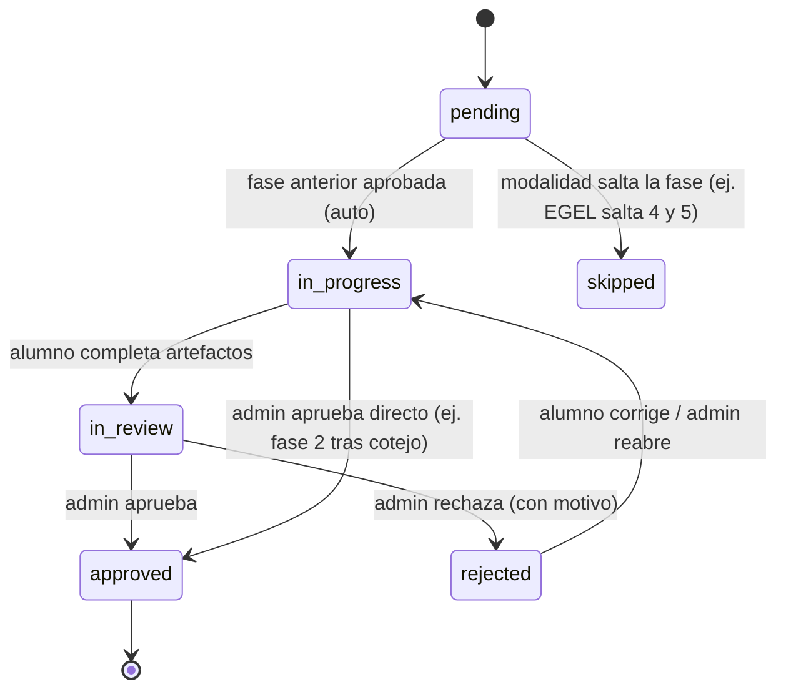
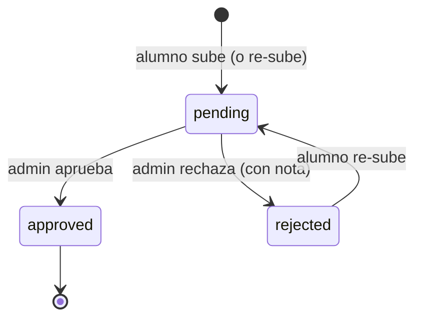
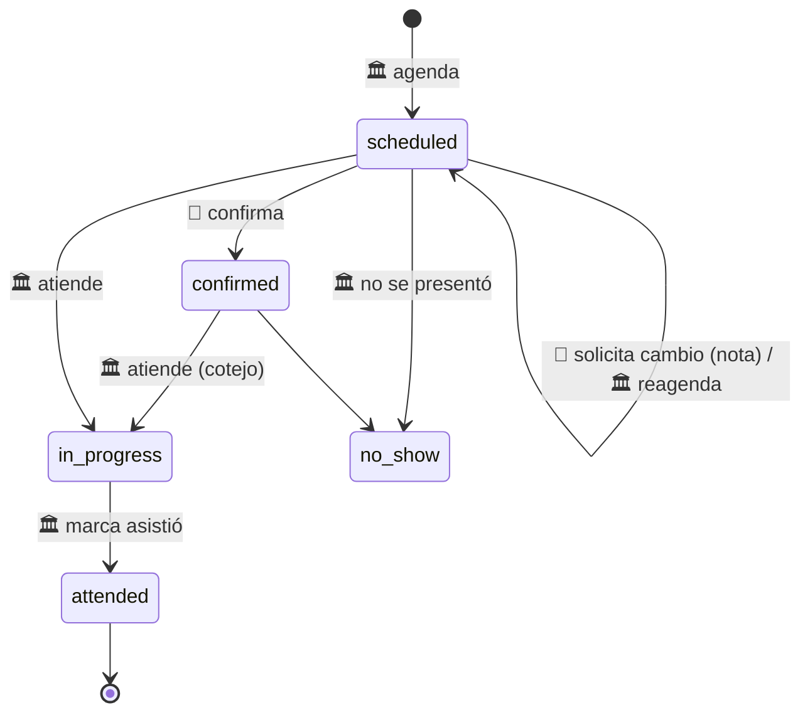

# Máquina de estados (fases · documentos · citas)

> Fuente única de las transiciones. Los flujos enlazan aquí en vez de redefinirlas.

## Proceso: las 9 fases

`TitulationProcess.current_phase` (0–8) espeja la fase activa. Cada fase es una fila
`ProcessPhase` con su propio `status`.

| # | code | Nombre | Responsable |
|---|---|---|---|
| 0 | `cohort_intake` | Convocatoria | 🏛️ Servicios Escolares |
| 1 | `initial_docs` | Documentos iniciales | 👤 Alumno → 🏛️/🎓 revisa |
| 2 | `review_appointment` | Cita de cotejo | 🏛️ Servicios Escolares |
| 3 | `format_b` | Formato B | 👤 Alumno → 🎓 Titulaciones |
| 4 | `synodal_assignment` | Asignación de sinodales | 🔗 Vinculación |
| 5 | `synodal_review` | Revisión de sinodales | 🧑‍⚖️ Sinodales |
| 6 | `anexo_iii` | Anexo III | 🎓 + 👤 |
| 7 | `final_docs` | Entrega final | 👤 → 🎓 |
| 8 | `ceremony` | Acto protocolario | 🎓 |

## Estado de una fase (`ProcessPhase.status`)

**Reglas (las implementa [`PhaseService`](engine_approve_advance_phase.md)):**
- Aprobar fase N → `N.status=approved` → activa la **siguiente aplicable** (`in_progress`,
  saltando `modality.skips_phases`). Si no hay siguiente → `process.status=completed`.
- Una fase ya `in_review`/`approved` **no** se rebaja al activarse (solo `pending`/`rejected`→`in_progress`).
- Cada transición escribe `ProcessEvent`.

## Estado de un documento (`Document.review_status`)

> Re-subir **sobreescribe** (solo última versión) y vuelve `review_status=pending`.

## Estado de una cita (`ReviewAppointment.status`) — Fase 2

> `attended` **no** aprueba la fase 2. La aprobación es un paso separado: el detalle del
> proceso → "Aprobar fase 02" → [motor de avance](engine_approve_advance_phase.md).

## Estado del Formato B (`FormatB.status`) — Fase 3

`draft` → (alumno envía) → `submitted` → 🎓 `approved` | `rejected` → (corrige) → `submitted`.
