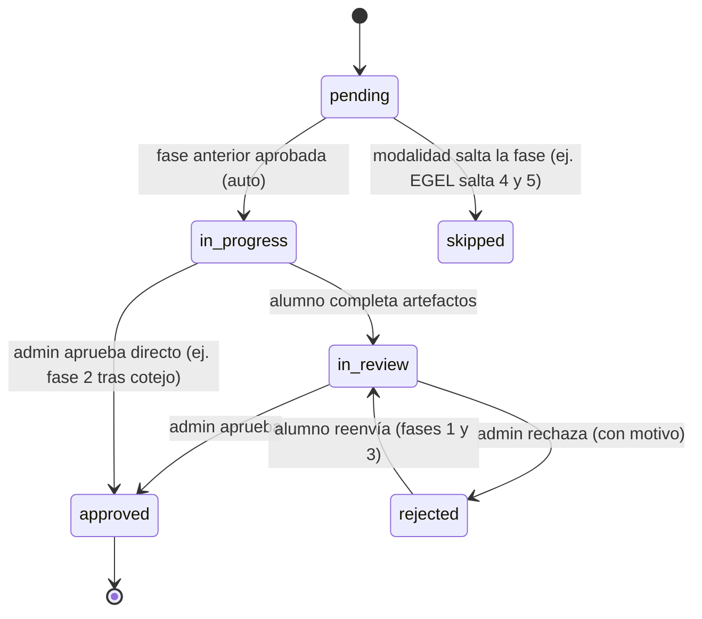
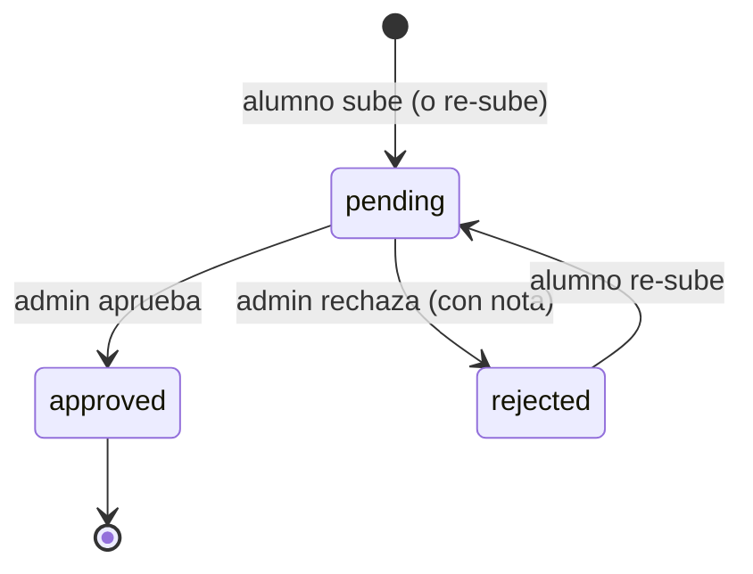
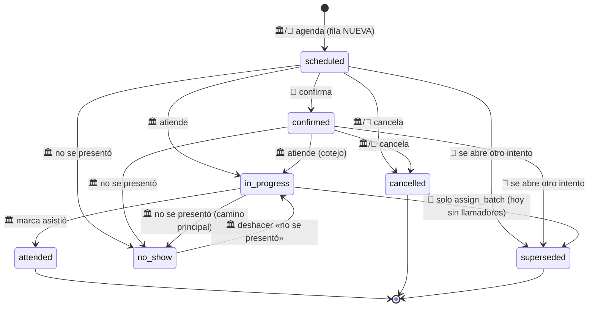
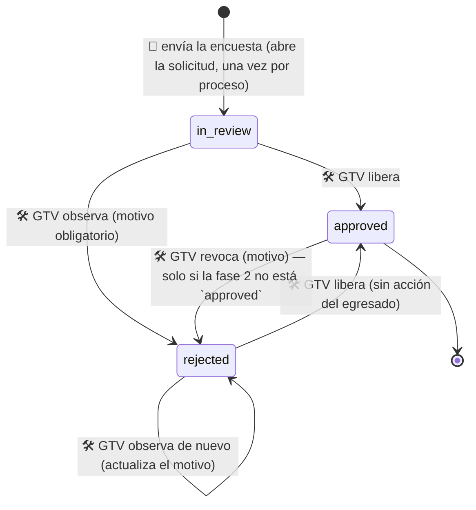

# Máquina de estados (fases · documentos · citas)

> Fuente única de las transiciones. Los flujos enlazan aquí en vez de redefinirlas.

## Proceso: las 9 fases

`TitulationProcess.current_phase` (0–8) espeja la fase activa. Cada fase es una fila
`ProcessPhase` con su propio `status`.

| # | code | Nombre | Responsable |
|---|---|---|---|
| 0 | `cohort_intake` | Convocatoria | 🏛️ Servicios Escolares |
| 1 | `initial_docs` | Documentos iniciales | 👤 Alumno → 🏛️/🎓 revisa |
| 2 | `review_appointment` | Cita de cotejo | 🏛️ Servicios Escolares |
| 3 | `format_b` | Formato B | 👤 Alumno → 🎓 Titulaciones |
| 4 | `synodal_assignment` | Asignación de sinodales | 🔗 Vinculación |
| 5 | `synodal_review` | Revisión de sinodales | 🧑‍⚖️ Sinodales |
| 6 | `anexo_iii` | Anexo III | 🎓 + 👤 |
| 7 | `final_docs` | Entrega final | 👤 → 🎓 |
| 8 | `ceremony` | Acto protocolario | 🎓 |

## Estado de una fase (`ProcessPhase.status`)

```mermaid
stateDiagram-v2
    [*] --> pending
    pending --> in_progress: fase anterior aprobada (auto)
    in_progress --> in_review: alumno completa artefactos
    in_review --> approved: admin aprueba
    in_review --> rejected: admin rechaza (con motivo)
    in_progress --> approved: admin aprueba directo (ej. fase 2 tras cotejo)
    rejected --> in_review: alumno reenvía (fases 1 y 3)
    approved --> [*]
    pending --> skipped: modalidad salta la fase (ej. EGEL salta 4 y 5)
```

> **Ojo:** una fase `rejected` **no** regresa a `in_progress` cuando el alumno corrige. El reenvío la manda directo a `in_review`: fase 1 en `pages/student.py:556` (`phase.status = "in_review"`) y fase 3 en `services/format_b_service.py:91` (`FormatBService.submit()`). El único código que escribe `in_progress` sobre una fase `rejected` es `services/phase_service.py:92-93`, y solo cuando esa fase resulta ser la **siguiente aplicable** al aprobarse otra (regla de abajo), no como «reapertura» de la fase rechazada.

**Reglas (las implementa [`PhaseService`](engine_approve_advance_phase.md)):**
- Aprobar fase N → `N.status=approved` → activa la **siguiente aplicable** (`in_progress`,
  saltando `modality.skips_phases`). Si no hay siguiente → `process.status=completed`.
- Una fase ya `in_review`/`approved` **no** se rebaja al activarse (solo `pending`/`rejected`→`in_progress`).
- Cada transición escribe `ProcessEvent`.

### Quién puede mover qué, y cuándo — las dos guardas

Ninguna transición del diagrama es libre: **solo se actúa sobre `current_phase`, y solo
si `process.status == 'active'`**. Es la misma regla escrita dos veces, una por cada lado
de la mesa, y las dos viven en `PhaseService`:

| Lado | Qué protege | Función | Fuera de regla |
|---|---|---|---|
| 🏛️🎓 **admin** | el **dictamen** (aprobar / rechazar) | [`assert_can_transition`](engine_approve_advance_phase.md#guarda-de-transición-desde-2026-09) | `400` + `X-Tt-Error` |
| 👤 **alumno** | la **ejecución** (subir, borrar, llenar, enviar, confirmar) | [`assert_student_can_act`](engine_student_phase_lock.md) | `400` + `X-Tt-Error` (acciones) · `302` al acordeón (páginas) |

Para el alumno eso significa: las fases **siguientes** son informativas (las lee en el
acordeón del dashboard, sin poder ejecutarlas) y las **anteriores** quedan cerradas e
**inmutables** — no puede reabrir una fase aprobada ni borrar evidencia ya dictaminada.
La fase `rejected` sigue abierta porque `reject_phase` deja `current_phase` apuntando a
ella; es corrección, no reapertura.

## Estado de un documento (`Document.review_status`)

```mermaid
stateDiagram-v2
    [*] --> pending: alumno sube (o re-sube)
    pending --> approved: admin aprueba
    pending --> rejected: admin rechaza (con nota)
    rejected --> pending: alumno re-sube
    approved --> [*]
```

> Re-subir **sobreescribe** (solo última versión) y vuelve `review_status=pending`.

## Estado de una cita (`ReviewAppointment.status`) — Fase 2

> **Siete valores desde 2026-09-16** (auto-agendado). Eran cinco; entraron `cancelled` y
> `superseded`, y desaparecieron dos aristas: `scheduled → scheduled` y `no_show → scheduled`.
> Ninguna de esas dos era una transición de verdad — hoy **abrir un intento nuevo inserta una
> fila**, no reescribe la que había. La matriz vive en `AppointmentService._TRANSICIONES`.
>
> **Ojo con el alcance de la matriz:** las transiciones que escribe `AppointmentService` se validan
> con `assert_transition` **antes** de escribir, pero **`SlotService._open_new_attempt` NO pasa por
> ella**: escribe `superseded` directo sobre la fila vieja, a propósito. No es un descuido —abrir un
> intento nuevo no es una transición del intento viejo—, pero significa que **`_TRANSICIONES` no es
> la lista completa de lo que puede ocurrirle a `status`**. Afirmar «toda escritura de estado pasa
> por la matriz» es falso, y es justo la clase de afirmación con la que alguien razona «esto no
> puede pasar».

```mermaid
stateDiagram-v2
    [*] --> scheduled: 🏛️/👤 agenda (fila NUEVA)
    scheduled --> confirmed: 👤 confirma
    scheduled --> in_progress: 🏛️ atiende
    confirmed --> in_progress: 🏛️ atiende (cotejo)
    in_progress --> attended: 🏛️ marca asistió
    scheduled --> no_show: 🏛️ no se presentó
    confirmed --> no_show: 🏛️ no se presentó
    in_progress --> no_show: 🏛️ no se presentó (camino principal)
    no_show --> in_progress: 🏛️ deshacer «no se presentó»
    scheduled --> cancelled: 🏛️/👤 cancela
    confirmed --> cancelled: 🏛️/👤 cancela
    scheduled --> superseded: 🤖 se abre otro intento
    confirmed --> superseded: 🤖 se abre otro intento
    in_progress --> superseded: 🤖 solo assign_batch (hoy sin llamadores)
    attended --> [*]
    cancelled --> [*]
    superseded --> [*]
```

**Los tres terminales son `attended`, `cancelled` y `superseded`** (conjunto vacío en la matriz).
`in_progress` **no** se puede cancelar: un cotejo empezado se cierra con `attended` o con `no_show`.

**`in_progress → no_show` es el camino principal, no un borde.** El encargado pulsa «iniciar el
cotejo» (que deja la cita `in_progress`) y desde ahí marca la ausencia; las aristas
`scheduled/confirmed → no_show` son los atajos, no el recorrido normal.

**`in_progress → superseded` existe en el código y NO está en la matriz.**
`_open_new_attempt` supersede cualquier estado de `SlotService._ESTADOS_ACTIVOS`, que **sí** incluye
`in_progress`; la matriz, en cambio, no lista `superseded` como destino suyo. Hoy esa arista **no la
alcanza el encargado**: `reschedule` exige `_REAGENDABLES = {scheduled, confirmed, no_show}` y
levanta `InvalidTransition` con una cita empezada, y `create` levanta `AppointmentConflict` antes de
llegar. El único camino es `SlotService.assign_batch`, que hoy **no tiene llamadores en
producción** — el mismo motor de reparto masivo que se salta la puerta de la encuesta. Si algún día
se cablea, esta arista se vuelve alcanzable de verdad.

**`in_progress → attended` tiene un segundo escritor, desde 2026-09-17: el dictamen de la
fase 02.** `PhaseService.approve_phase`/`reject_phase` cierran la cita vigente a `attended`
si sigue `in_progress` al momento de aprobar **o** rechazar esa fase — antes quedaba colgada
(ni `no_show` ni `attended`, y D4 bloqueaba abrir otro intento). A diferencia de
`_open_new_attempt`, este camino **sí** pasa por `AppointmentService.assert_transition` antes
de escribir (la arista ya existía en la matriz, así que no hace falta ampliarla); lo único que
cambia es que el escritor ya no es siempre `mark_attended`. El evento que deja
(`appointment_attended`) trae `payload={"auto": True, "via": "phase_approved"|"phase_rejected"}`
para distinguirlo en el timeline de un "Asistió" marcado a mano. Detalle completo:
[motor de aprobar/rechazar fase](engine_approve_advance_phase.md#cierre-automático-de-la-cita-de-cotejo-solo-fase-02-desde-2026-09-17).

| Estado | Quién lo escribe | Dónde |
|---|---|---|
| `scheduled` | 🏛️ agenda · 👤 auto-agenda | nace así en cada INSERT (`SlotService.assign`) |
| `confirmed` | 👤 confirma | `confirm` (+ `confirmed_at`) |
| `in_progress` | 🏛️ atiende | `start` · `undo_no_show` |
| `attended` | 🏛️ marca asistió · 🤖 dictamen de fase 02 (auto, solo si seguía `in_progress`) | `mark_attended` · `PhaseService._auto_close_cotejo_appointment` |
| `no_show` | 🏛️ no se presentó | `mark_no_show` |
| `cancelled` | 🏛️ o 👤 cancela | `AppointmentService.cancel` (+ `cancelled_at`, `cancelled_by_id`, `cancel_reason`) |
| `superseded` | 🤖 automático | `SlotService._open_new_attempt`, **solo si la vigente estaba ACTIVA** |

### El segundo eje: `is_current` es ORTOGONAL a `status`

Son dos cosas distintas y confundirlas es el error fácil. `status` dice **cómo terminó ese
intento**; `is_current` dice **cuál de los intentos es el vigente**. Un proceso tiene como mucho
una fila vigente — lo garantiza el índice único parcial `uq_titulatec_review_appt_current`
(declarado en el modelo **y** en la migración, para que el `create_all` del CI también lo tenga).

| Operación | La fila vieja | La fila nueva |
|---|---|---|
| **Reagendar / mover** una cita ACTIVA (`scheduled`/`confirmed`/`in_progress`) | `status='superseded'`, `is_current=False` | `attempt_no+1`, `status='scheduled'` |
| **Intento nuevo** tras `no_show` / `attended` / `cancelled` | **conserva su status** (un `no_show` sigue diciendo `no_show`), solo `is_current=False` | `attempt_no+1`, `status='scheduled'` |

**Y la consecuencia que hay que tener presente: la ocupación de una franja se calcula por ESTADO,
nunca por vigencia.** Una fila `no_show` que ya no es la vigente **sigue ocupando su lugar**.

| Estado | ¿Ocupa la franja? | Por qué |
|---|---|---|
| `scheduled` · `confirmed` · `in_progress` | sí | está viva |
| `attended` | sí | la franja se usó de verdad |
| `no_show` | **sí** | «si no se presentó es que ya pasó» (decisión del usuario) |
| `cancelled` | no | canceló a tiempo: el lugar vuelve al pozo |
| `superseded` | no | su ocupación la heredó la fila nueva |

Lo implementa `SlotService._ESTADOS_QUE_LIBERAN = {"cancelled", "superseded"}`, y `occupancy`
filtra por ese conjunto y **no** por `is_current`. Añadirle `is_current == True` parece lo natural
al leer el historial por primera vez, y vuelve a liberar los `no_show`: es el defecto que el
auto-agendado vino a cerrar. Lleva comentario en el código y test dedicado
(`test_slot_service.py::test_la_ocupacion_cuenta_los_no_show`).

`get_for_process` devuelve **la vigente** (`is_current=True`); el historial completo sale de
`list_attempts`. Un proceso cuya única cita se canceló devuelve `None` y vuelve a estar «sin cita».

> `attended` **no** aprueba la fase 2. La aprobación es un paso separado: el detalle del
> proceso → "Aprobar fase 02" → [motor de avance](engine_approve_advance_phase.md). Y por eso una
> cita `attended` con papeles faltantes **no** cierra nada: el egresado puede agendar otra mientras
> la fase 2 siga abierta.
>
> La flecha inversa **sí** existe, y es angosta a propósito: dictaminar la fase 02 (aprobar o
> rechazar) puede empujar la cita de `in_progress` a `attended` —nunca al revés, y nunca sobre
> ningún otro estado— para no dejarla colgada si el encargado dictamina sin haber marcado
> "Asistió". Ver la nota de `in_progress → attended` más arriba.

## Estado del Formato B (`FormatB.status`) — Fase 3

`draft` → (alumno envía) → `submitted` → 🎓 `approved` | `rejected` → (corrige) → `submitted`.

## Estado de una solicitud de liberación de GTV para la encuesta de egresados (`SurveyReview.status`) — Fase 2

Nace cuando el egresado envía la encuesta de egresados (una solicitud por proceso,
`UNIQUE(process_id)`); desde ahí el egresado **no vuelve a tocarla**. El requisito de cotejo
`graduate_survey` ya NO se acredita al enviarla (retirado de `SurveyService.submit`,
2026-09-15): se acredita cuando **Gestión Tecnológica y Vinculación** (GTV,
`titulatec_tech_management`) la libera desde su bandeja. Detalle completo, permisos y
pantallas: [liberación GTV de la encuesta de egresados](phase2_tech_management_survey_release.md).

```mermaid
stateDiagram-v2
    [*] --> in_review: 👤 envía la encuesta (abre la solicitud, una vez por proceso)
    in_review --> approved: 🛠️ GTV libera
    in_review --> rejected: 🛠️ GTV observa (motivo obligatorio)
    rejected --> approved: 🛠️ GTV libera (sin acción del egresado)
    rejected --> rejected: 🛠️ GTV observa de nuevo (actualiza el motivo)
    approved --> rejected: 🛠️ GTV revoca (motivo) — solo si la fase 2 no está `approved`
    approved --> [*]
```

> **Pseudo-estado `missing`**: no es un valor de la columna, es la AUSENCIA de fila (el
> egresado todavía no envía la encuesta) — mismo idioma que "ausencia de fila = pendiente" en
> `RequirementFulfillment`. Lo calcula `SurveyReviewService.summary_for_process`.
>
> **Liberar acredita, revocar desacredita; observar no toca nada.** `approve` llama a
> `RequirementService.fulfill` sobre `graduate_survey`; `revoke` llama a `unfulfill`. Ni
> `in_review` ni `rejected` tienen cumplimiento que tocar, así que "Observar" (`reject`) nunca
> toca el requisito.
>
> **El egresado no mueve ningún estado.** Todas las transiciones de arriba las escribe GTV desde
> `pages/survey_reviews_admin.py`; lo único que hace el egresado (enviar la encuesta) crea la
> fila inicial en `in_review`, vía `SurveyReviewService.open_for_submission`.
