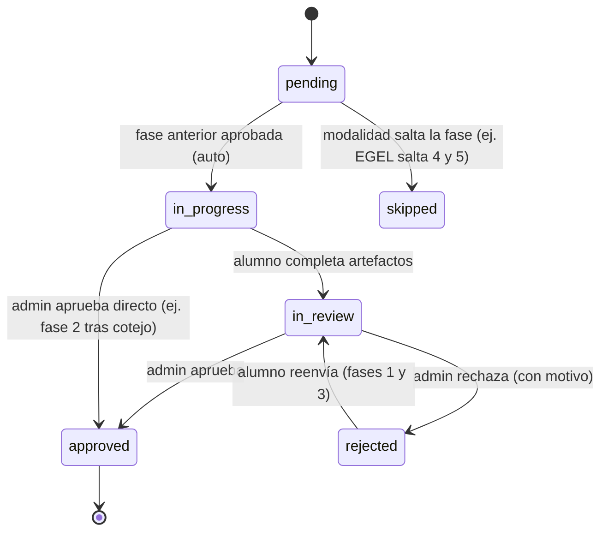
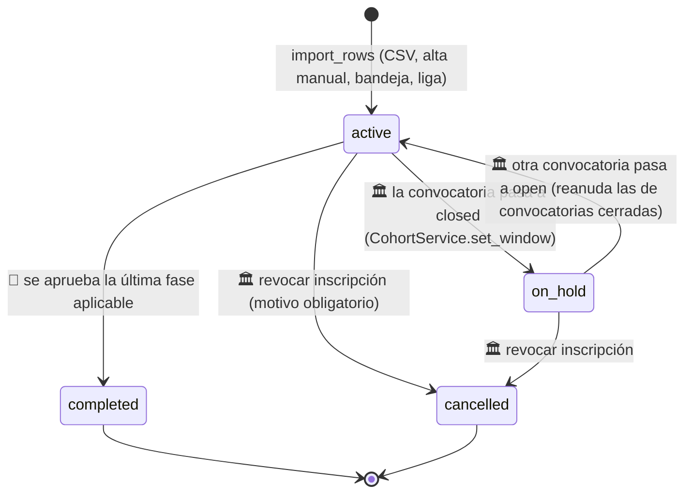
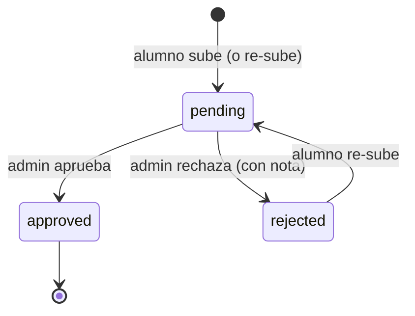
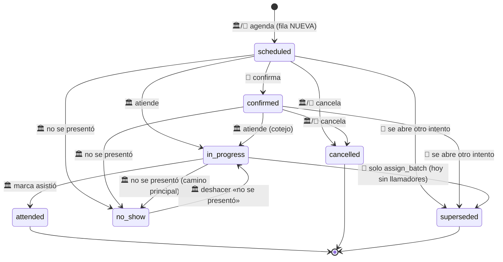
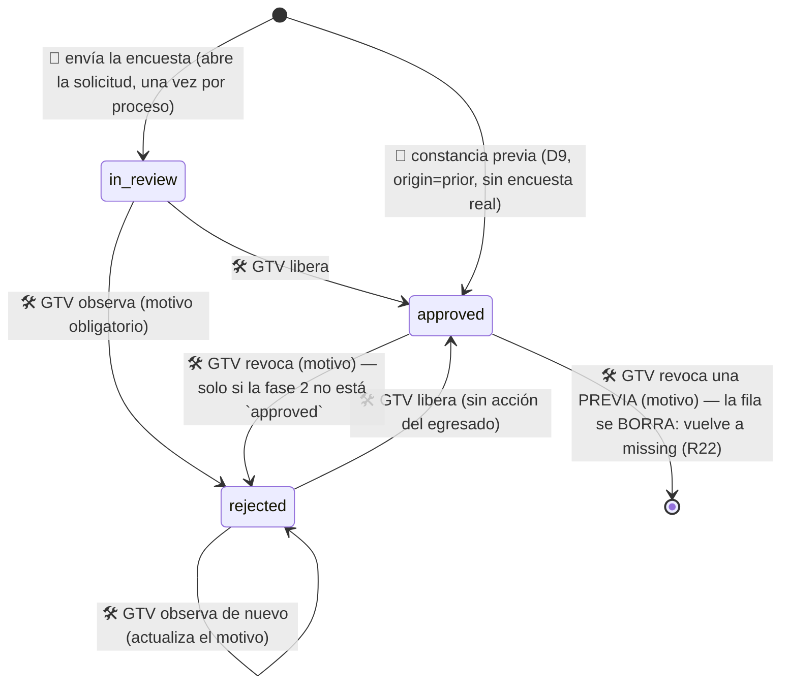
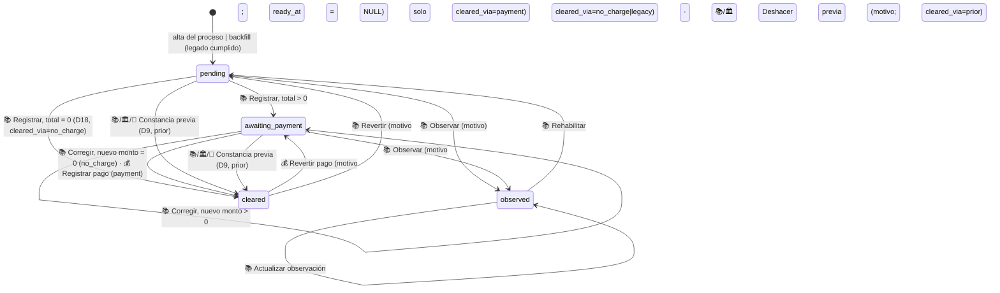
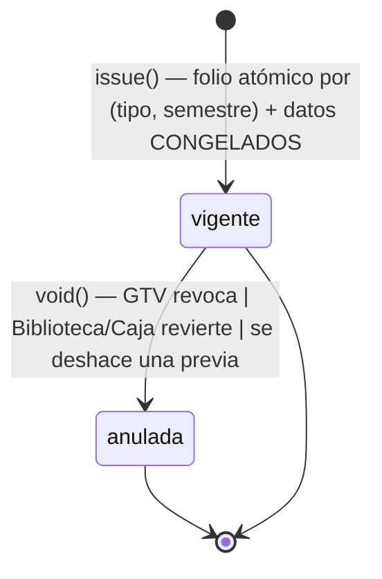
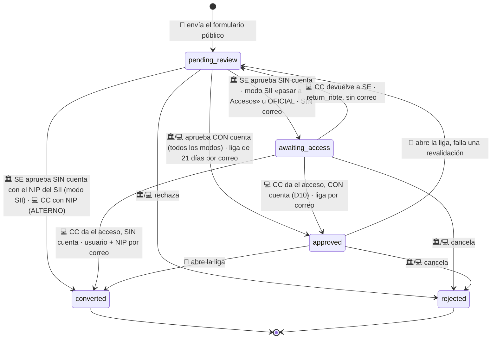
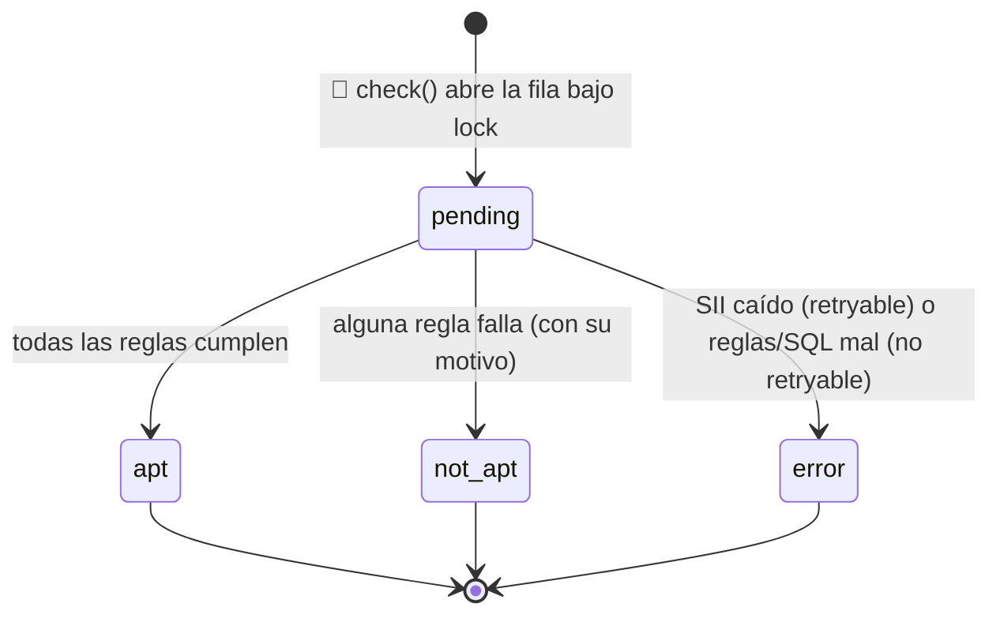

# Máquina de estados (fases · documentos · citas)

> Fuente única de las transiciones. Los flujos enlazan aquí en vez de redefinirlas.

## Proceso: las 9 fases

`TitulationProcess.current_phase` (0–8) espeja la fase activa. Cada fase es una fila
`ProcessPhase` con su propio `status`.

| # | code | Nombre | Responsable |
|---|---|---|---|
| 0 | `cohort_intake` | Convocatoria | 🏛️ Servicios Escolares |
| 1 | `initial_docs` | Documentos iniciales | 👤 Alumno → 🏛️/🎓 revisa |
| 2 | `review_appointment` | Cita de cotejo | 🏛️ Servicios Escolares |
| 3 | `format_b` | Formato B | 👤 Alumno → 🎓 Titulaciones |
| 4 | `synodal_assignment` | Asignación de sinodales | 🔗 Vinculación |
| 5 | `synodal_review` | Revisión de sinodales | 🧑‍⚖️ Sinodales |
| 6 | `anexo_iii` | Anexo III | 🎓 + 👤 |
| 7 | `final_docs` | Entrega final | 👤 → 🎓 |
| 8 | `ceremony` | Acto protocolario | 🎓 |

## Estado de una fase (`ProcessPhase.status`)

```mermaid
stateDiagram-v2
    [*] --> pending
    pending --> in_progress: fase anterior aprobada (auto)
    in_progress --> in_review: alumno completa artefactos
    in_review --> approved: admin aprueba
    in_review --> rejected: admin rechaza (con motivo)
    in_progress --> approved: admin aprueba directo (ej. fase 2 tras cotejo)
    rejected --> in_review: alumno reenvía (fases 1 y 3)
    approved --> [*]
    pending --> skipped: modalidad salta la fase (ej. EGEL salta 4 y 5)
```

> **Ojo:** una fase `rejected` **no** regresa a `in_progress` cuando el alumno corrige. El reenvío la manda directo a `in_review`: fase 1 en `services/document_service.py::DocumentService.sync_initial_phase` (desde 2026-09-28, Tarea 1 -- se llama sola en `save()`/`delete()` al completar los 3 documentos iniciales; ya **no** es `pages/student.py:1622`, ese endpoint se retiró) y fase 3 en `services/format_b_service.py:91` (`FormatBService.submit()`). El único código que escribe `in_progress` sobre una fase `rejected` es `services/phase_service.py:92-93`, y solo cuando esa fase resulta ser la **siguiente aplicable** al aprobarse otra (regla de abajo), no como «reapertura» de la fase rechazada.

**Reglas (las implementa [`PhaseService`](engine_approve_advance_phase.md)):**
- Aprobar fase N → `N.status=approved` → activa la **siguiente aplicable** (`in_progress`,
  saltando `modality.skips_phases`). Si no hay siguiente → `process.status=completed`.
- Una fase ya `in_review`/`approved` **no** se rebaja al activarse (solo `pending`/`rejected`→`in_progress`).
- Cada transición escribe `ProcessEvent`.

## Estado del proceso (`TitulationProcess.status`)

```mermaid
stateDiagram-v2
    [*] --> active: import_rows (CSV, alta manual, bandeja, liga)
    active --> on_hold: 🏛️ la convocatoria pasa a closed (CohortService.set_window)
    on_hold --> active: 🏛️ otra convocatoria pasa a open (reanuda las de convocatorias cerradas)
    active --> completed: 🤖 se aprueba la última fase aplicable
    active --> cancelled: 🏛️ revocar inscripción (motivo obligatorio)
    on_hold --> cancelled: 🏛️ revocar inscripción
    completed --> [*]
    cancelled --> [*]
```

**`cancelled` se escribe desde 2026-09-25** y tiene un solo escritor: `ProcessService.cancel`
(revocables = `REVOCABLE_STATUSES` = `active`/`on_hold`; `completed` no; una ya revocada responde
«Esta inscripción ya estaba revocada.» sin escribir). Es terminal: no hay «des-revocar», y reabrir
la convocatoria no la resucita (la pausa/reanudación solo mueve `active`↔`on_hold`). Deja
`ProcessEvent(process_cancelled)` con el motivo en el payload, cancela la cita vigente si está
`scheduled`/`confirmed`, y avisa al alumno después del commit. Los lectores de `status` se decidieron
sitio por sitio (excluir / etiquetar «Revocado» / bloquear); una revocada no cuenta como proceso
vivo para D5 —la persona puede inscribirse en **otra** convocatoria— pero en la **misma** no (D1:
una sola fila por alumno y convocatoria). Detalle:
[Consulta de elegibilidad al SII › Revocar](xcut_sii_eligibility.md#revocar-inscripción).

### Quién puede mover/dictaminar qué, y cuándo — cuatro puntos de aplicación

Ninguna transición del diagrama es libre: **solo se actúa sobre `current_phase`, y solo
si `process.status == 'active'`**. Es la misma regla escrita dos veces, una por cada lado
de la mesa. Desde 2026-09-21 hay dos puntos más: el dictamen de Formato B reusa la MISMA
función que el admin, y el dictamen de documentos suma un chequeo propio y más angosto —
los cuatro existen para que el corte a T-soft (ver abajo) sea de verdad cierto en toda la
superficie que dictamina o ejecuta una fase, no solo en el botón obvio.

| Punto | Qué protege | Función | ¿Mira `current_phase`? | Fuera de regla |
|---|---|---|---|---|
| 🏛️🎓 **admin — dictamen de la fase del proceso** | `approve_phase` / `reject_phase` | [`PhaseService.assert_can_transition`](engine_approve_advance_phase.md#guarda-de-transición-desde-2026-09) | Sí — exige `n == current_phase` | `400` + `X-Tt-Error` |
| 👤 **alumno — ejecución** | subir, borrar, llenar, enviar, confirmar | [`PhaseService.assert_student_can_act`](engine_student_phase_lock.md) | Sí — exige `n == current_phase` | `400` + `X-Tt-Error` (acciones) · `302` al acordeón (páginas) |
| 🎓 **admin — dictamen de Formato B** (desde 2026-09-21) | `FormatBService.review` (aprobar/rechazar) | la MISMA `assert_can_transition` de arriba, con `n` = fase `format_b` del catálogo | Sí — mismas reglas que la fila 1 | `400` + `X-Tt-Error` |
| 🏛️🎓 **admin — dictamen de un documento** (desde 2026-09-21) | `DocumentService.review` (aprobar/rechazar) | chequeo propio dentro del service — **no** reusa `assert_can_transition` | **No**, a propósito (ver abajo) | `400` + `X-Tt-Error` |

Para el alumno eso significa: las fases **siguientes** son informativas (las lee en el
acordeón del dashboard, sin poder ejecutarlas) y las **anteriores** quedan cerradas e
**inmutables** — no puede reabrir una fase aprobada ni borrar evidencia ya dictaminada.
La fase `rejected` sigue abierta porque `reject_phase` deja `current_phase` apuntando a
ella; es corrección, no reapertura.

### El corte a T-soft: la misma regla, en los cuatro puntos (desde 2026-09-21)

Los cuatro puntos de arriba comparten una regla más: **ninguna fase con `number >=
PhaseService._handoff_phase()` se dictamina ni se ejecuta desde esta app.**
`_handoff_phase()` lee `TITULATEC_HANDOFF_PHASE` (`itcj2/config.py:292`, default `3` =
Formato B): de ahí en adelante el proceso lo continúa el Departamento de Titulación en su
propio sistema, T-soft. Revertir el PROCESO es una variable de entorno y un reinicio —
`TITULATEC_HANDOFF_PHASE=9` —, sin migración ni backfill; revertir QUIÉN puede operarlo es
un paso aparte, porque el recorte de permisos vive en BD y los puestos nuevos nacen sin
ocupantes — los dos pasos, completos, en
["Cómo revertir el corte"](xcut_titulacion_handoff.md#cómo-revertir-el-corte).

**La asimetría entre el dictamen de Formato B y el de documentos es deliberada, no un
descuido.** El de Formato B exige la guarda completa (`assert_can_transition`) porque ese
dictamen siempre es sobre la fase EN CURSO (`format_b`): la regla "solo la fase actual"
aplica tal cual — y de paso hereda las otras dos reglas de esa guarda
(`process.status == 'active'`, `n == current_phase`), que **no dependen de la variable del
corte**: un dictamen tardío de Formato B o sobre un proceso `on_hold` da 400 aunque el
corte esté en `9`. Antes de esta feature `FormatBService.review` no comprobaba ninguna de
las dos; es un cambio de comportamiento permanente, no algo que la reversión deshaga. El
de documentos **no puede** exigir lo mismo: dictaminar HOY un documento de una fase que el
proceso ya dejó atrás — el dictamen tardío — es el uso NORMAL de la bandeja de Documentos,
no una excepción (`DocumentService.save` ya trata la fase del documento como la del TIPO,
`dtype.phase_number`, no la del proceso). Su guarda mira **solo** si
`dtype.phase_number >= _handoff_phase()`, nunca `current_phase` ni `process.status`:
endurecerla para que también exigiera `current_phase` sería un defecto nuevo — rompería
el dictamen tardío — y hay un test que fija ese comportamiento como el deseado
(`test_handoff_phase_cut.py`). Con el corte en `9` esta guarda sí queda neutra del todo
(ninguna fase real es `>= 9`), a diferencia de la de Formato B. Detalle completo, con los
cuatro puntos, la tarjeta que ve el alumno y sus bordes:
[`xcut_titulacion_handoff.md`](xcut_titulacion_handoff.md).

**Qué significa "liberado".** No es un valor de columna en ningún modelo — es un cálculo:
un proceso está **liberado hacia Titulación** cuando `ProcessPhase(phase_number=2).status
== 'approved'`. La fecha de liberación es su `completed_at`, no la de la cita ni la del
alta del proceso. Deliberadamente **no** se usa el estado de la cita
(`ReviewAppointment.status`): marcarla `attended` no libera nada — con requisitos
faltantes el encargado sigue pudiendo abrirle otro intento sin importar el veredicto (ver
más arriba, "`attended` no aprueba la fase 2"). El EGRESADO es distinto desde el
2026-09-30 (D13 de [el auto-agendado](phase2_student_self_booking.md)): mientras la fase 2
siga SIN veredicto no puede agendar solo (`cotejo_en_dictamen`), y recupera el auto-agendado
solo en cuanto Servicios Escolares la RECHAZA. Aprobar la fase 2 es el acto explícito de
liberación. La bandeja **Liberados** (`/titulatec/admin/liberados`) lista exactamente esto.

## Estado de un documento (`Document.review_status`)

```mermaid
stateDiagram-v2
    [*] --> pending: alumno sube (o re-sube)
    pending --> approved: admin aprueba
    pending --> rejected: admin rechaza (con nota)
    rejected --> pending: alumno re-sube
    approved --> [*]
```

> Re-subir **sobreescribe** (solo última versión) y vuelve `review_status=pending`.

## Estado de una cita (`ReviewAppointment.status`) — Fase 2

> **Siete valores desde 2026-09-16** (auto-agendado). Eran cinco; entraron `cancelled` y
> `superseded`, y desaparecieron dos aristas: `scheduled → scheduled` y `no_show → scheduled`.
> Ninguna de esas dos era una transición de verdad — hoy **abrir un intento nuevo inserta una
> fila**, no reescribe la que había. La matriz vive en `AppointmentService._TRANSICIONES`.
>
> **Ojo con el alcance de la matriz:** las transiciones que escribe `AppointmentService` se validan
> con `assert_transition` **antes** de escribir, pero **`SlotService._open_new_attempt` NO pasa por
> ella**: escribe `superseded` directo sobre la fila vieja, a propósito. No es un descuido —abrir un
> intento nuevo no es una transición del intento viejo—, pero significa que **`_TRANSICIONES` no es
> la lista completa de lo que puede ocurrirle a `status`**. Afirmar «toda escritura de estado pasa
> por la matriz» es falso, y es justo la clase de afirmación con la que alguien razona «esto no
> puede pasar».

```mermaid
stateDiagram-v2
    [*] --> scheduled: 🏛️/👤 agenda (fila NUEVA)
    scheduled --> confirmed: 👤 confirma
    scheduled --> in_progress: 🏛️ atiende
    confirmed --> in_progress: 🏛️ atiende (cotejo)
    in_progress --> attended: 🏛️ marca asistió
    scheduled --> no_show: 🏛️ no se presentó
    confirmed --> no_show: 🏛️ no se presentó
    in_progress --> no_show: 🏛️ no se presentó (camino principal)
    no_show --> in_progress: 🏛️ deshacer «no se presentó»
    scheduled --> cancelled: 🏛️/👤 cancela
    confirmed --> cancelled: 🏛️/👤 cancela
    scheduled --> superseded: 🤖 se abre otro intento
    confirmed --> superseded: 🤖 se abre otro intento
    in_progress --> superseded: 🤖 solo assign_batch (hoy sin llamadores)
    attended --> [*]
    cancelled --> [*]
    superseded --> [*]
```

**Los tres terminales son `attended`, `cancelled` y `superseded`** (conjunto vacío en la matriz).
`in_progress` **no** se puede cancelar: un cotejo empezado se cierra con `attended` o con `no_show`.

**`in_progress → no_show` es el camino principal, no un borde.** El encargado pulsa «iniciar el
cotejo» (que deja la cita `in_progress`) y desde ahí marca la ausencia; las aristas
`scheduled/confirmed → no_show` son los atajos, no el recorrido normal.

**`in_progress → superseded` existe en el código y NO está en la matriz.**
`_open_new_attempt` supersede cualquier estado de `SlotService._ESTADOS_ACTIVOS`, que **sí** incluye
`in_progress`; la matriz, en cambio, no lista `superseded` como destino suyo. Hoy esa arista **no la
alcanza el encargado**: `reschedule` exige `_REAGENDABLES = {scheduled, confirmed, no_show}` y
levanta `InvalidTransition` con una cita empezada, y `create` levanta `AppointmentConflict` antes de
llegar. El único camino es `SlotService.assign_batch`, que hoy **no tiene llamadores en
producción** — el mismo motor de reparto masivo que se salta la puerta de la encuesta. Si algún día
se cablea, esta arista se vuelve alcanzable de verdad.

**`in_progress → attended` tiene un segundo escritor, desde 2026-09-17: el dictamen de la
fase 02.** `PhaseService.approve_phase`/`reject_phase` cierran la cita vigente a `attended`
si sigue `in_progress` al momento de aprobar **o** rechazar esa fase — antes quedaba colgada
(ni `no_show` ni `attended`, y D4 bloqueaba abrir otro intento). A diferencia de
`_open_new_attempt`, este camino **sí** pasa por `AppointmentService.assert_transition` antes
de escribir (la arista ya existía en la matriz, así que no hace falta ampliarla); lo único que
cambia es que el escritor ya no es siempre `mark_attended`. El evento que deja
(`appointment_attended`) trae `payload={"auto": True, "via": "phase_approved"|"phase_rejected"}`
para distinguirlo en el timeline de un "Asistió" marcado a mano. Detalle completo:
[motor de aprobar/rechazar fase](engine_approve_advance_phase.md#cierre-automático-de-la-cita-de-cotejo-solo-fase-02-desde-2026-09-17).

| Estado | Quién lo escribe | Dónde |
|---|---|---|
| `scheduled` | 🏛️ agenda · 👤 auto-agenda | nace así en cada INSERT (`SlotService.assign`) |
| `confirmed` | 👤 confirma | `confirm` (+ `confirmed_at`) |
| `in_progress` | 🏛️ atiende | `start` · `undo_no_show` |
| `attended` | 🏛️ marca asistió · 🤖 dictamen de fase 02 (auto, solo si seguía `in_progress`) | `mark_attended` · `PhaseService._auto_close_cotejo_appointment` |
| `no_show` | 🏛️ no se presentó | `mark_no_show` |
| `cancelled` | 🏛️ o 👤 cancela | `AppointmentService.cancel` (+ `cancelled_at`, `cancelled_by_id`, `cancel_reason`) |
| `superseded` | 🤖 automático | `SlotService._open_new_attempt`, **solo si la vigente estaba ACTIVA** |

### El segundo eje: `is_current` es ORTOGONAL a `status`

Son dos cosas distintas y confundirlas es el error fácil. `status` dice **cómo terminó ese
intento**; `is_current` dice **cuál de los intentos es el vigente**. Un proceso tiene como mucho
una fila vigente — lo garantiza el índice único parcial `uq_titulatec_review_appt_current`
(declarado en el modelo **y** en la migración, para que el `create_all` del CI también lo tenga).

| Operación | La fila vieja | La fila nueva |
|---|---|---|
| **Reagendar / mover** una cita ACTIVA (`scheduled`/`confirmed`/`in_progress`) | `status='superseded'`, `is_current=False` | `attempt_no+1`, `status='scheduled'` |
| **Intento nuevo** tras `no_show` / `attended` / `cancelled` | **conserva su status** (un `no_show` sigue diciendo `no_show`), solo `is_current=False` | `attempt_no+1`, `status='scheduled'` |

**Y la consecuencia que hay que tener presente: la ocupación de una franja se calcula por ESTADO,
nunca por vigencia.** Una fila `no_show` que ya no es la vigente **sigue ocupando su lugar**.

| Estado | ¿Ocupa la franja? | Por qué |
|---|---|---|
| `scheduled` · `confirmed` · `in_progress` | sí | está viva |
| `attended` | sí | la franja se usó de verdad |
| `no_show` | **sí** | «si no se presentó es que ya pasó» (decisión del usuario) |
| `cancelled` | no | canceló a tiempo: el lugar vuelve al pozo |
| `superseded` | no | su ocupación la heredó la fila nueva |

Lo implementa `SlotService._ESTADOS_QUE_LIBERAN = {"cancelled", "superseded"}`, y `occupancy`
filtra por ese conjunto y **no** por `is_current`. Añadirle `is_current == True` parece lo natural
al leer el historial por primera vez, y vuelve a liberar los `no_show`: es el defecto que el
auto-agendado vino a cerrar. Lleva comentario en el código y test dedicado
(`test_slot_service.py::test_la_ocupacion_cuenta_los_no_show`).

`get_for_process` devuelve **la vigente** (`is_current=True`); el historial completo sale de
`list_attempts`. Un proceso cuya única cita se canceló devuelve `None` y vuelve a estar «sin cita».

> `attended` **no** aprueba la fase 2. La aprobación es un paso separado: el detalle del
> proceso → "Aprobar fase 02" → [motor de avance](engine_approve_advance_phase.md). Y por eso una
> cita `attended` con papeles faltantes **no** cierra nada para el ENCARGADO: sigue pudiendo
> abrirle otro intento sin importar el veredicto. Para el EGRESADO es distinto desde el
> 2026-09-30 ([D13 del auto-agendado](phase2_student_self_booking.md)): mientras la fase 2
> siga SIN veredicto no puede agendar solo (`cotejo_en_dictamen`); recupera el auto-agendado
> solo en cuanto Servicios Escolares la RECHAZA -revierte en parte la regla del auto-agendado
> del 2026-09-15, que dejaba agendar con cualquier `attended` sin aprobar-.
>
> La flecha inversa **sí** existe, y es angosta a propósito: dictaminar la fase 02 (aprobar o
> rechazar) puede empujar la cita de `in_progress` a `attended` —nunca al revés, y nunca sobre
> ningún otro estado— para no dejarla colgada si el encargado dictamina sin haber marcado
> "Asistió". Ver la nota de `in_progress → attended` más arriba.

## Estado del Formato B (`FormatB.status`) — Fase 3

`draft` → (alumno envía) → `submitted` → 🎓 `approved` | `rejected` → (corrige) → `submitted`.

## Estado de una solicitud de liberación de GTV para la encuesta de egresados (`SurveyReview.status`) — Fase 2

Nace cuando el egresado envía la encuesta de egresados (una solicitud por proceso,
`UNIQUE(process_id)`); desde ahí el egresado **no vuelve a tocarla**. El requisito de cotejo
`graduate_survey` ya NO se acredita al enviarla (retirado de `SurveyService.submit`,
2026-09-15): se acredita cuando **Gestión Tecnológica y Vinculación** (GTV,
`titulatec_tech_management`) la libera desde su bandeja. Detalle completo, permisos y
pantallas: [liberación GTV de la encuesta de egresados](phase2_tech_management_survey_release.md).

```mermaid
stateDiagram-v2
    [*] --> in_review: 👤 envía la encuesta (abre la solicitud, una vez por proceso)
    in_review --> approved: 🛠️ GTV libera
    in_review --> rejected: 🛠️ GTV observa (motivo obligatorio)
    rejected --> approved: 🛠️ GTV libera (sin acción del egresado)
    rejected --> rejected: 🛠️ GTV observa de nuevo (actualiza el motivo)
    approved --> rejected: 🛠️ GTV revoca (motivo) — solo si la fase 2 no está `approved`
    [*] --> approved: 🤖 constancia previa (D9, origin=prior, sin encuesta real)
    approved --> [*]: 🛠️ GTV revoca una PREVIA (motivo) — la fila se BORRA: vuelve a missing (R22)
```

> **Pseudo-estado `missing`**: no es un valor de la columna, es la AUSENCIA de fila (el
> egresado todavía no envía la encuesta) — mismo idioma que "ausencia de fila = pendiente" en
> `RequirementFulfillment`. Lo calcula `SurveyReviewService.summary_for_process`.
>
> **Revocar una constancia previa la borra** (Ruling R22): una previa (`origin='prior'`) no
> tiene encuesta real detrás; si quedara `rejected`, `SurveyService.submit` (que corta mientras
> exista CUALQUIER fila) no dejaría al egresado contestar nunca. `revoke` deja el evento
> `survey_review_revoked` (con `origin`) y el `unfulfill`, y borra la fila: la solicitud vuelve
> a `missing` y el egresado contesta normalmente.
>
> **Liberar acredita, revocar desacredita; observar no toca nada.** `approve` llama a
> `RequirementService.fulfill` sobre `graduate_survey`; `revoke` llama a `unfulfill`. Ni
> `in_review` ni `rejected` tienen cumplimiento que tocar, así que "Observar" (`reject`) nunca
> toca el requisito.
>
> **El egresado no mueve ningún estado.** Todas las transiciones de arriba las escribe GTV desde
> `pages/survey_reviews_admin.py`; lo único que hace el egresado (enviar la encuesta) crea la
> fila inicial en `in_review`, vía `SurveyReviewService.open_for_submission`.

## Estado del no adeudo de biblioteca (`LibraryClearance.status`) — Fase 2 (2026-10-01)

Nace cuando el proceso se crea —`ImportService.import_rows` abre la fila `pending` EN LA MISMA
transacción del alta, antes de la fase 2— o, para procesos de antes de esta campaña, con el
backfill de la migración `tt20261001a` (`cleared/legacy` si ya tenía el requisito `library_clearance`
cumplido a mano; `pending` si no). Único dueño:
`services/library_clearance_service.py::LibraryClearanceService`. Detalle completo, permisos y
pantallas: [no adeudo de biblioteca: Biblioteca → Caja](phase2_library_clearance.md).

```mermaid
stateDiagram-v2
    [*] --> pending: alta del proceso | backfill (legado cumplido)
    pending --> awaiting_payment: 📚 Registrar, total > 0
    pending --> observed: 📚 Observar (motivo)
    awaiting_payment --> observed: 📚 Observar (motivo; ready_at = NULL)
    observed --> observed: 📚 Actualizar observación
    observed --> pending: 📚 Rehabilitar
    pending --> cleared: 📚 Registrar, total = 0 (D18, cleared_via=no_charge)
    awaiting_payment --> awaiting_payment: 📚 Corregir, nuevo monto > 0
    awaiting_payment --> cleared: 📚 Corregir, nuevo monto = 0 (no_charge) · 💰 Registrar pago (payment)
    pending --> cleared: 📚/🏛️/🤖 Constancia previa (D9, prior)
    awaiting_payment --> cleared: 📚/🏛️/🤖 Constancia previa (D9, prior)
    cleared --> awaiting_payment: 💰 Revertir pago (motivo; solo cleared_via=payment)
    cleared --> pending: 📚 Revertir (motivo; solo cleared_via=no_charge|legacy) · 📚/🏛️ Deshacer previa (motivo; solo cleared_via=prior)
```

> **`cleared_via`** (`payment`\|`no_charge`\|`prior`\|`legacy`) dice CÓMO se liberó, NULL salvo en
> `cleared`: decide qué botón de reversa aplica (un pago lo revierte Caja; sin cargo/legado lo
> revierte Biblioteca; una previa se deshace) — ningún botón funciona sobre el `cleared_via`
> equivocado, el service lo valida.
>
> **Folio por vía (2026-10-05):** todo `cleared` lleva un folio BIB vigente (`BIB-2026B-0001`).
> `payment`/`no_charge` lo emiten en el semestre de la emisión; `prior` (`register_prior`, también
> desde la importación) en el semestre ANTERIOR al registro; `legacy` lo recibe del backfill
> (`FolioBackfillService`, `titulatec emitir-folios-previos` o el paso 5 de
> `activar-biblioteca-caja`), no de este service. Salir de `cleared` —revertir pago, revertir
> sin cargo/legado, deshacer una previa— anula el folio. Antes de esa fecha `prior` y `legacy`
> no emitían. Detalle: [folios](xcut_certificates_batch.md#numeración-atómica).
>
> **`observed`** («Con observaciones», 2026-10-05, migración `tt20261005a`): Biblioteca detuvo al
> egresado con un motivo (`observation_reason`/`observed_by_id`/`observed_at`, NULL fuera de este
> estado). Se entra desde `pending`/`awaiting_payment` (desde Caja limpia `ready_at` y conserva los
> montos); se sale SOLO con **Rehabilitar** → `pending` (D2). Con `observed` no se registra, cobra,
> revierte ni aplica una constancia previa (`ClearanceObserved`); `ClearanceGate` lo bloquea con
> `library_observed`. Observar/rehabilitar exigen fase 2 sin aprobar y proceso admitido; desde
> `cleared` no se observa (primero se revierte). Detalle:
> [Con observaciones](phase2_library_clearance.md#con-observaciones-2026-10-05).
>
> **`ready_at`** (Ruling R10) es la entrada VIGENTE a `awaiting_payment`: se vuelve a fijar SOLO
> al ENTRAR desde otro estado (Registrar desde `pending`, Revertir pago desde `cleared/payment`),
> nunca al Corregir dentro de `awaiting_payment` — ancla del recordatorio de pago (D14) y del
> FIFO de la bandeja de Caja.
>
> **Revertir/Deshacer solo con la fase 2 SIN `approved`** (`LibraryClearanceService.can_revert`,
> gemelo de `SurveyReviewService.can_revoke`). Al volver a `pending` la fila pierde montos, nota,
> firma, pago y datos de constancia previa — salvo `ready_at`, que queda como historia.
>
> **El candado de agendar es condicional** (invariante 8, `ClearanceGate.library_required`):
> solo bloquea donde la convocatoria tiene el requisito de cotejo `library_clearance` ACTIVO con
> `auto_source='library_clearance'` — las convocatorias nuevas ya nacen así
> (`CotejoRequirementService.DEFAULTS`); las que ya existían lo ganan al correr `titulatec
> activar-biblioteca-caja` (el paso 2 del despliegue; `init-biblioteca-caja` solo crea puestos,
> roles y permisos, Ruling R19). Hasta entonces, el estado de esta fila se registra igual
> (Biblioteca y Caja siempre operan sobre procesos admitidos), pero nadie se queda sin agendar
> por él. La activación también promueve a `cleared/legacy` las `pending` que SE siguió marcando
> a mano después de la migración (Ruling R20).
>
> **`not_applicable`** (Ruling R21) es un pseudo-estado de LECTURA, no una columna: fase 2 ya
> `approved` sin el no adeudo liberado. No bloquea, el egresado no lo ve y SE ve «No aplica
> (cotejo ya liberado)»; Registrar, el lote y la constancia previa lo rechazan.
>
> **El egresado no mueve ningún estado.** Todas las transiciones las escribe Biblioteca, Caja o
> Servicios Escolares (respaldo D9, constancia previa); la CLI `titulatec
> import-prior-clearances` también puede llegar a `cleared/prior` sin acción humana en el
> momento (⤵ [constancias previas](xcut_prior_clearances.md)).

## Estado de un folio (`Certificate`) — transversal (2026-10-01; folio por semestre 2026-10-05)

No es una máquina de estados con transiciones intermedias: una `Certificate` nace **vigente**
(`voided_at IS NULL`) con un folio único por tipo y semestre (`{BIB|GTV}-{AAAA}{A|B}-{NNNN}`,
`BIB-2026B-0001`; `CertificateCounter` con PK `(kind, semester)`, contador atómico),
y su único cambio posible es **anularse** (`voided_at`/`voided_by_id`/`void_reason`) — nunca se
borra, nunca se reutiliza su folio, y «volver a liberar» emite una fila NUEVA con folio NUEVO en
vez de reabrir la anulada. A lo más UNA vigente por `source_ref`: la cuidan los emisores y la
base (UNIQUE parcial `uq_titulatec_certificates_live_source`, Ruling R29). Emisores: `SurveyReviewService.approve` (`kind='survey_release'`,
salvo `origin='prior'`), `LibraryClearanceService` al quedar `cleared` por `payment`/`no_charge`
(`kind='library_clearance'`), las dos `register_prior` (previas: semestre ANTERIOR al registro) y
`FolioBackfillService` (previas anteriores al código y legado `cleared/legacy`, sin emisor).
Anulan: `revoke`, `revert_payment`/`revert_clearance` y `undo_prior`. La impresión por lote
(`batch_id`) existe pero está apagada por omisión (`TITULATEC_CERTIFICATE_PRINTING`). Detalle
completo: [folios y constancias por lote](xcut_certificates_batch.md).

```mermaid
stateDiagram-v2
    [*] --> vigente: issue() — folio atómico por (tipo, semestre) + datos CONGELADOS
    vigente --> anulada: void() — GTV revoca | Biblioteca/Caja revierte | se deshace una previa
    anulada --> [*]
    vigente --> [*]
```

## Estado de una solicitud de auto-inscripción (`EnrollmentRequest.status`)

Es previo a las 9 fases: nace con el formulario público de `/titulatec/inscripcion` y termina en
`converted` (que abre la fase 0/1 vía `ImportService.import_rows`) o en `rejected`. Siete
valores, `String(20)`; `unverified`/`verified` son LEGADO del flujo con liga previa y ya no se
escriben. Quién revisa (SE o CC) y por dónde pasa una solicitud sin cuenta lo decide
`EnrollmentRequestService.reviewer_mode()` (`TITULATEC_ENROLLMENT_REVIEWER`; **`sii` por omisión
desde 2026-09-27**, `school_services` y `computer_center` como respaldo):

```mermaid
stateDiagram-v2
    [*] --> pending_review: 👤 envía el formulario público
    pending_review --> awaiting_access: 🏛️ SE aprueba SIN cuenta · modo SII «pasar a Accesos» u OFICIAL · SIN correo
    pending_review --> converted: 🏛️ SE aprueba SIN cuenta con el NIP del SII (modo SII) · 💻 CC con NIP (ALTERNO)
    pending_review --> approved: 🏛️/💻 aprueba CON cuenta (todos los modos) · liga de 21 días por correo
    awaiting_access --> converted: 💻 CC da el acceso, SIN cuenta · usuario + NIP por correo
    awaiting_access --> approved: 💻 CC da el acceso, CON cuenta (D10) · liga por correo
    awaiting_access --> pending_review: 💻 CC devuelve a SE · return_note, sin correo
    approved --> converted: 👤 abre la liga
    approved --> pending_review: 👤 abre la liga, falla una revalidación
    pending_review --> rejected: 🏛️/💻 rechaza
    awaiting_access --> rejected: 🏛️/💻 cancela
    approved --> rejected: 🏛️/💻 cancela
    converted --> [*]
    rejected --> [*]
```

**Modo `sii` (por omisión desde 2026-09-27, «el SII informa, Servicios Escolares decide»):**
TODAS las salidas de `pending_review` las escribe **SE** desde Solicitudes — nada se aprueba solo
(la aprobación automática del 2026-09-25 se retiró el 2026-09-27). El botón lo decide
`approval_path(tiene_cuenta, nip_status)`:

| Caso (al aprobar, bajo el lock) | Transición | `nip_source` |
|---|---|---|
| Con cuenta (`to_access` se ignora) | `pending_review → approved` (liga) | — |
| Sin cuenta, «Aprobar y dar acceso» y el SII da un NIP válido | `pending_review → converted` (cuenta con el NIP del SII, correo sin NIP) | `sii` |
| Sin cuenta, «Aprobar y pasar a Accesos» (`to_access`) | `pending_review → awaiting_access` → CC como en el oficial | `center` (al dar acceso) |
| Sin cuenta, «dar acceso», pero el SII ya no da un NIP válido | ninguna: sigue `pending_review`; la consulta vigente guarda el `nip_status` visto | — |

La consulta al SII **no mueve** la solicitud: deja una `EligibilityCheck` (abajo).

**`awaiting_access` existe en los modos `sii` y oficial** — el alumno nunca se entera de él (ni al
entrar ni al salir hay correo). En el alterno aprobar ya es de Centro de Cómputo y no pasa por ahí
(solo quedan las sobrantes de otro modo). Detalle completo de quién ve cada estado, los modos y
D8/D10: [Accesos de Centro de Cómputo](xcut_computer_center_access.md); el resto del ciclo
(formulario, liga, riesgo aceptado, rol `graduate`):
[Inscripción pública con revisión previa](xcut_public_enrollment.md).

**`nip_source`** (`titulatec_enrollment_requests`, `sii | center | form`, nullable,
`tt20260927a`): de dónde salió el NIP de la cuenta que **creó** la solicitud — `sii` (aprobación con
el NIP del SII), `center` (Centro de Cómputo en Accesos, `grant_access`), `form` (modo alterno).
`NULL` = cuenta que ya existía (liga) o fila anterior. Lo escribe solo `_create_account`; «Con
acceso» de Accesos deja fuera `sii` y «Reenviar aviso» lo exige.

## Estado de un check de elegibilidad (`EligibilityCheck.status`) — modo `sii`

Una fila de `titulatec_eligibility_checks` por intento de consulta al SII; la vigente es
`EnrollmentRequest.last_check_id`. La escribe solo `EligibilityService.check`.

```mermaid
stateDiagram-v2
    [*] --> pending: 🤖 check() abre la fila bajo lock
    pending --> apt: todas las reglas cumplen
    pending --> not_apt: alguna regla falla (con su motivo)
    pending --> error: SII caído (retryable) o reglas/SQL mal (no retryable)
    apt --> [*]
    not_apt --> [*]
    error --> [*]
```

- Una fila **no** cambia de veredicto: reintentar (tarea, barrido o «Reintentar consulta» con
  `force`) **inserta** otra con `attempt + 1` y mueve `last_check_id`.
- `pending` de más de 15 min (`_PENDING_STALE`) = colgada: el barrido o `force` la retoman.
- `error` + `retryable = true` se reintenta solo hasta `TITULATEC_SII_MAX_ATTEMPTS`; `retryable =
  false` espera a que SE la reconsulte (o `sii-sweep --reconsultar-errores`).
- Ningún veredicto aprueba nada: `apt`, `not_apt` y `error` son información para SE, que decide
  siempre (`not_apt`, `error`, sin consulta o un nombre que no coincide piden confirmación al
  aprobar, D7).
- Con el SII sin configurar (`TITULATEC_SII_BACKEND=disabled`) no nace ninguna fila.

**Eje aparte: `nip_status`** (`tt20260927a`) — solo el ESTADO del NIP del SII, nunca el valor.
Lo fija la fase ③ de `check` (y, si al aprobar el SII ya no da un NIP válido,
`EligibilityService.record_nip_status` sobre la consulta que siga vigente):

| Valor | Cuándo |
|---|---|
| `available` · `missing` · `invalid` · `unavailable` · `error` | sin cuenta y veredicto ≠ `error`: lo que dio `classify_sii_nip` (NIP de 4 dígitos · sin NIP · otro formato · el SII no respondió · `[credential]` mal configurada) |
| `not_needed` | la persona tenía cuenta al consultar: no se pidió |
| `NULL` | no se revisó: veredicto `error`, consulta en curso, o fila anterior a `tt20260927a` |

Solo `available` (y con el SII configurado) hace que la bandeja ofrezca «Aprobar y dar acceso»;
cualquier otro, sin cuenta, «Aprobar y pasar a Accesos». Detalle: [`xcut_sii_eligibility.md`](xcut_sii_eligibility.md).
