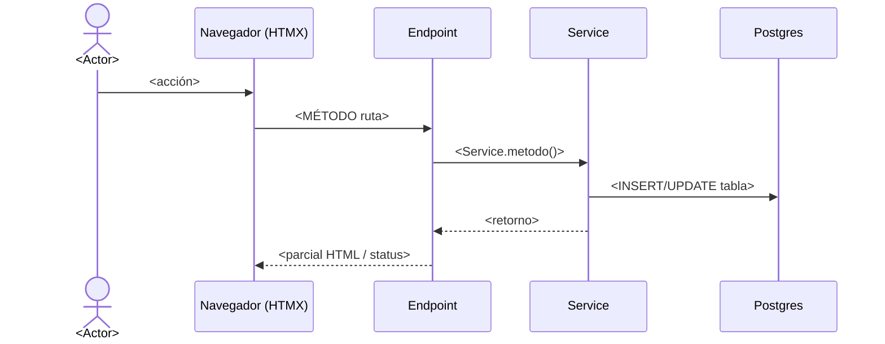

# <Título del flujo>

> **Objetivo:** <en una frase, el resultado de negocio que se logra>.

| | |
|---|---|
| **Actor(es)** | <rol(es) + emoji leyenda> |
| **Permiso(s)** | `titulatec.x.y.z` (los que exigen los endpoints) |
| **Trigger** | <qué lo inicia: clic, llegada a una fase, etc.> |
| **Precondiciones** | <estado previo requerido: fase N en X, doc subido, etc.> |
| **Sub-flujos** | ⤵ [otro-flujo](otro-flujo.md) (si compone) |
| **Estado final** | <a qué deja el proceso/entidad> |

## Ruta en la app (UI)

> Dónde está físicamente en la interfaz y qué ve/toca el actor.

1. <pantalla / URL> → <elemento que toca>
2. ...

## Secuencia

## Pasos detallados

| # | Actor | UI / dónde | Acción | Endpoint | Service · método | Efecto en BD | Eventos / Notif |
|---|---|---|---|---|---|---|---|
| 1 | 👤 | `/titulatec/...` | ... | `POST /...` | `XService.foo()` | `tabla` ← ... | `ProcessEvent(...)` |

## Estado resultante

- <tabla.campo> = <valor>
- Fase N → <status> · `current_phase` = <n>
- <qué desbloquea el siguiente paso>

## Caminos alternos / errores ❗

- <validación que falla> → <qué pasa> (status, header `X-Tt-Error`, re-render).
- <rechazo / reagenda / etc.>

## Flujos relacionados

- ⤵ [siguiente flujo natural](...)
- ← [flujo previo](...)
