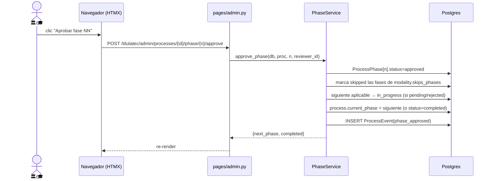

# Motor de avance de fase: aprobar / rechazar

> **Objetivo:** mover el proceso de una fase a la siguiente (o rechazarla), de forma
> consistente, respetando la modalidad. **Building block** que otros flujos invocan ⤵.

| | |
|---|---|
| **Actor(es)** | 🏛️ Servicios Escolares / 🎓 Titulaciones (según fase) · 🤖 lógica |
| **Permiso(s)** | `titulatec.process.api.approve_phase` · `...reject_phase` |
| **Trigger** | Botón "Aprobar fase NN" / "Rechazar fase" en el detalle del proceso |
| **Precondiciones** | Proceso `active`; la fase a aprobar es `current_phase` |
| **Estado final** | Fase `approved` + siguiente `in_progress` (o proceso `completed`); o fase `rejected` |

## Ruta en la app (UI)

1. `/titulatec/admin/processes/{id}` (sidebar 🏛️/🎓 → **Procesos** → abrir uno).
2. Card **"Fase actual · NN"** (parcial `partials/admin_process_detail.html`).
3. Botón **"Aprobar fase NN"** o input motivo + **"Rechazar fase"**.

## Secuencia

## Pasos detallados

| # | Actor | UI / dónde | Acción | Endpoint | Service · método | Efecto en BD | Eventos |
|---|---|---|---|---|---|---|---|
| 1 | 🏛️/🎓 | detalle proceso | Aprobar fase N | `POST .../phase/{n}/approve` | `PhaseService.approve_phase` | `ProcessPhase[n]=approved`, `completed_at`, `reviewed_by_id`; siguiente=`in_progress`; `process.current_phase`↑ (o `status=completed`) | `phase_approved` (+`process_completed` si última) |
| 1b| 🏛️/🎓 | detalle proceso | Rechazar fase N | `POST .../phase/{n}/reject` (form `reason`) | `PhaseService.reject_phase` | `ProcessPhase[n]=rejected`, `rejection_reason`; `current_phase=n` | `phase_rejected` (payload `reason`) |

## Lógica de "siguiente aplicable"

`_next_applicable(process, after)` recorre `after+1..8` y salta las de
`modality.skips_phases` (ej. modalidad `egel` salta 4 y 5). Las saltadas se marcan
`skipped`. Si no hay siguiente → `process.status=completed`, `completed_at`.
Ver [máquina de estados](00_state_machine.md).

## Caminos alternos / errores ❗

- Rechazo NO baja `current_phase` a otra fase: la deja en `n` para que el alumno corrija.
- Aprobar cuando la siguiente fase ya está `in_review`/`approved` → **no** la rebaja
  (solo `pending`/`rejected` pasan a `in_progress`).

## Flujos relacionados

- ← Invocado por: [revisión de docs iniciales](phase1_admin_review_initial_docs.md),
  [cita de cotejo](phase2_appointment_loop.md), revisión de Formato B, etc.
