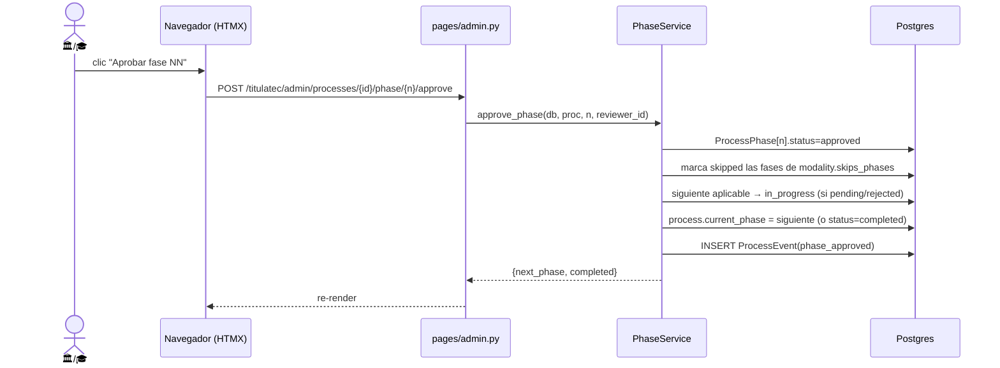

# Motor de avance de fase: aprobar / rechazar

> **Objetivo:** mover el proceso de una fase a la siguiente (o rechazarla), de forma
> consistente, respetando la modalidad. **Building block** que otros flujos invocan ⤵.

| | |
|---|---|
| **Actor(es)** | 🏛️ Servicios Escolares / 🎓 Titulaciones (según fase) · 🤖 lógica |
| **Permiso(s)** | `titulatec.process.api.approve_phase` · `...reject_phase` |
| **Trigger** | Botón "Aprobar fase NN" / "Rechazar fase" en el detalle del proceso |
| **Precondiciones** | Proceso `active`; la fase a aprobar es `current_phase`. **Se validan** en `PhaseService.assert_can_transition` (`services/phase_service.py:97`) |
| **Estado final** | Fase `approved` + siguiente `in_progress` (o proceso `completed`); o fase `rejected` |

## Ruta en la app (UI)

1. `/titulatec/admin/processes/{id}` (sidebar 🏛️/🎓 → **Procesos** → abrir uno).
2. Card **"Fase actual · NN"** (parcial `partials/admin_process_detail.html`).
3. Botón **"Aprobar fase NN"** o input motivo + **"Rechazar fase"**.

## Secuencia

```mermaid
sequenceDiagram
    actor A as 🏛️/🎓
    participant FE as Navegador (HTMX)
    participant API as pages/admin.py
    participant SVC as PhaseService
    participant DB as Postgres
    A->>FE: clic "Aprobar fase NN"
    FE->>API: POST /titulatec/admin/processes/{id}/phase/{n}/approve
    API->>SVC: approve_phase(db, proc, n, reviewer_id)
    SVC->>DB: ProcessPhase[n].status=approved
    SVC->>DB: marca skipped las fases de modality.skips_phases
    SVC->>DB: siguiente aplicable → in_progress (si pending/rejected)
    SVC->>DB: process.current_phase = siguiente  (o status=completed)
    SVC->>DB: INSERT ProcessEvent(phase_approved)
    SVC-->>API: {next_phase, completed}
    API-->>FE: re-render #process-detail (partial)
```

## Pasos detallados

| # | Actor | UI / dónde | Acción | Endpoint | Service · método | Efecto en BD | Eventos |
|---|---|---|---|---|---|---|---|
| 1 | 🏛️/🎓 | detalle proceso | Aprobar fase N | `POST .../phase/{n}/approve` | `PhaseService.approve_phase` | `ProcessPhase[n]=approved`, `completed_at`, `reviewed_by_id`; siguiente=`in_progress`; `process.current_phase`↑ (o `status=completed`) | `phase_approved` (+`process_completed` si última) |
| 1b| 🏛️/🎓 | detalle proceso | Rechazar fase N | `POST .../phase/{n}/reject` (form `reason`) | `PhaseService.reject_phase` | `ProcessPhase[n]=rejected`, `rejection_reason`; `current_phase=n` | `phase_rejected` (payload `reason`) |

## Lógica de "siguiente aplicable"

`_next_applicable(process, after)` recorre `after+1..8` y salta las de
`modality.skips_phases` (ej. modalidad `egel` salta 4 y 5). Las saltadas se marcan
`skipped`. Si no hay siguiente → `process.status=completed`, `completed_at`.
Ver [máquina de estados](00_state_machine.md).

## Cierre automático de la cita de cotejo (solo fase 02, desde 2026-09-17)

**El hueco.** Desde el expediente (`pages/admin.py::phase_approve/phase_reject`) y
desde el panel de Citas (`pages/appointments.py::fase2_approve/fase2_reject`) se
podía aprobar **o** rechazar la fase 02 con la cita vigente todavía `in_progress`
—el encargado la atiende y se le olvida marcar "Asistió" antes de dictaminar—.
Esa cita quedaba colgada: no aparecía en ningún cubo de la cola (no es `no_show`
ni `attended`) y D4 bloqueaba volver a agendar (una cita ACTIVA es la única que
lo impide).

**El arreglo.** `PhaseService._auto_close_cotejo_appointment(db, process,
actor_id, via)`, invocado desde `approve_phase` y `reject_phase` **solo cuando
`phase_number == PhaseService.PHASE_COTEJO`**, **después** de todas las guardas
de esa fase (si una guarda lanza `ValueError`, no se escribe nada — ni la cita
ni la fase) y **dentro de la misma transacción** que el resto del dictamen
(antes del `db.commit()` final; nunca `AppointmentService.mark_attended`, que
commitea por su cuenta):

1. Lee la cita vigente con `AppointmentService.get_for_process`.
2. Si es `None`, o su `status` no es `in_progress`, no hace nada.
   `scheduled`/`confirmed`/`no_show`/`attended`/sin cita **no se tocan** — solo
   `in_progress` queda de verdad "colgado" por el dictamen.
3. Si es `in_progress`: valida el salto con
   `AppointmentService.assert_transition("in_progress", "attended")` (legal
   siempre — está en `_TRANSICIONES`, ver [máquina de estados](00_state_machine.md)),
   escribe `status = "attended"` y un `ProcessEvent(appointment_attended,
   phase_number=2, payload={"auto": True, "via": "phase_approved"})` —
   `"phase_rejected"` si vino de `reject_phase`.

El `via` en el payload distingue en el timeline si el cierre automático vino de
una aprobación o de un rechazo; lo lee el alumno en su historial de fase con la
misma etiqueta que un `appointment_attended` manual (`_EVENT_LABELS` en
`pages/student.py`, "Asististe al cotejo").

**Por qué en el service y no en las rutas.** `approve_phase`/`reject_phase`
tienen ya dos llamadores cada una (el expediente y el panel de Citas) y
cualquier futuro tercero lo hereda gratis. Reimplementarlo en cada ruta es
exactamente como se desincroniza esta clase de regla.

## Notificaciones al alumno

`approve_phase` / `reject_phase` avisan al alumno vía `services/notify.notify_student`
(→ `NotificationService`, tab **Avisos** del shell): `PHASE_APPROVED` (link a la nueva fase),
`PROCESS_COMPLETED` (última fase → link al dashboard) o `PHASE_REJECTED` (con motivo → link a
la fase). Tabla de eventos en
[integración del alumno en el shell](xcut_student_shell_embed.md#notificaciones-regla-general-de-toda-app).

> **Ojo con «link a la fase»: ya no abre una pantalla.** Ese link es
> `/titulatec/student/fase/{n}` y desde 2026-09-02 responde **302** a
> `/titulatec/student/dashboard?fase={n}` — el acordeón de esa fase, ya abierto y resaltado en el
> HTML de la respuesta. La ruta **no se puede borrar**: esas URLs están escritas dentro de filas de
> `core_notifications` que ya existen. Ver [acordeón de fases](xcut_student_phase_detail.md).

## Guarda de transición (desde 2026-09)

`approve_phase` y `reject_phase` empiezan llamando a `PhaseService.assert_can_transition`
(`services/phase_service.py:97`), que lanza `ValueError` si falla alguna de las tres reglas.
La ruta lo traduce al canal de error de la app: `400` + header `X-Tt-Error`
(`pages/admin.py:824-826`, `:851-853`), y el path param está acotado con `Path(ge=0)`.

| Regla | Mensaje al usuario |
|---|---|
| `n` dentro del catálogo de fases | `Fase {n} fuera de rango: el proceso solo tiene las fases 0 a 8.` |
| `process.status == 'active'` | `El proceso ya no admite cambios de fase (estado: {status}).` |
| `n == process.current_phase` | `Solo puedes actuar sobre la fase en curso (fase NN, no la MM).` |

El rango **sale del catálogo** `titulatec_phase_definitions` (`PhaseService.phase_range`), no de un
literal: es la misma fuente que usa `_next_applicable` para saber dónde termina el proceso y que
`ImportService` para crear las `ProcessPhase` de un alumno nuevo.

Antes de esta guarda, un solo POST de quien tuviera `process.api.approve_phase` podía completar un
proceso (`n=8` desde la fase 1), inventar fases (`n=99`), retroceder (`n=0` desde la 5), escribir un
`current_phase` negativo vía `reject` o reabrir un proceso ya `completed`. Cubierto por
`tests/fastapi/titulatec/test_phase_guard.py`.

> **Tiene gemela.** Esta guarda protege el **dictamen** (🏛️🎓 aprobar / rechazar). La ejecución
> del 👤 alumno la protege [`assert_student_can_act`](engine_student_phase_lock.md), en el mismo
> service y con las mismas tres reglas. Si tocas una, mira la otra: entre las dos son las únicas
> puertas por las que una fase cambia de estado.

## Caminos alternos / errores ❗

- Rechazo NO baja `current_phase` a otra fase: la deja en `n` para que el alumno corrija — y `n`
  solo puede ser la fase en curso.
- Aprobar cuando la siguiente fase ya está `in_review`/`approved` → **no** la rebaja
  (solo `pending`/`rejected` pasan a `in_progress`).
- Proceso inexistente → `404` (antes se renderizaba el detalle con contexto `None`).
- El auto-avance del dictamen de documentos (`pages/documents.py:136`) pregunta con
  `PhaseService.can_transition` en vez de atrapar la excepción: si el proceso no está `active` o ya
  no está en la fase 1, simplemente no avanza.

## Flujos relacionados

- ← Invocado por: [revisión de docs iniciales](phase1_admin_review_initial_docs.md),
  [cita de cotejo](phase2_appointment_loop.md), revisión de Formato B, etc.
