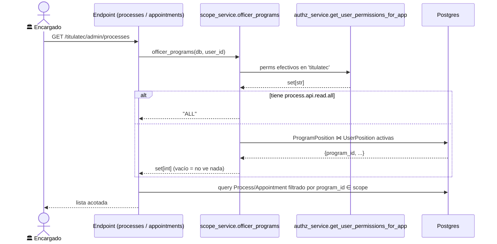

# Alcance por carrera + asignación delegada de encargados

> **Objetivo:** que cada encargado de Servicios Escolares vea y atienda **solo los procesos/citas
> de sus carreras**, y que el jefe pueda **dar de alta encargados** (usuario + carreras) sin tocar
> SQL. Pieza transversal: la usan la bandeja de procesos, el tablero kanban y la agenda de citas.

| | |
|---|---|
| **Actor(es)** | 🏛️ Jefe de Servicios Escolares (`titulatec_school_services_head`) · 🏛️ Encargado (`titulatec_school_services`) |
| **Permiso(s)** | `titulatec.officers.page.list` / `titulatec.officers.api.manage` (gestión) · `titulatec.process.api.read.all` (= ver TODO, salta el scope) |
| **Trigger** | El jefe abre **Encargados** y crea/edita uno; cualquier listado admin filtra por el alcance del usuario. |
| **Precondiciones** | El jefe ocupa un puesto con rol head (vía `PositionAppRole` sobre `head_school_services`). |
| **Sub-flujos** | ⤵ filtra [cita de cotejo](phase2_appointment_loop.md) y la bandeja/kanban de procesos. |
| **Estado final** | Encargado = `Position` del depto (`code` `se_officer_*`) con rol `school_services` + carreras (`ProgramPosition`) + usuarios (`UserPosition`). |

## Backbone (role-centric — 3 capas, no mezclar)

1. **Rol** = QUÉ puedes hacer. `titulatec_school_services` (operativo, **scoped**, SIN `read.all`) vs
   `titulatec_school_services_head` (operativo + `officers.*` + `process.api.read.all` = ve todo).
2. **Puesto** = QUIÉN. El usuario hereda el rol al ocupar el puesto (`UserPosition` → `PositionAppRole`).
3. **`core_program_positions` (ProgramPosition)** = SOBRE QUÉ carreras (M2M puesto↔programa) = el scope.

`PositionAppPerm` (perm directo en puesto) = **solo overrides**, nunca el mecanismo principal.

## Ruta en la app (UI)

1. `/titulatec/admin/officers` (pestaña **Encargados**, visible solo con `officers.page.list`) → alta
   (nombre + usuarios del depto + carreras) y baja. El menú admin es data-driven por permiso
   (`admin_nav_items` en `pages/nav.py`).
2. `/titulatec/admin/processes` (bandeja/kanban) y `/titulatec/admin/appointments` (agenda + "del día")
   listan **ya acotado** al alcance del usuario.

## Secuencia (resolución del alcance)

## Pasos detallados

| # | Actor | UI / dónde | Acción | Endpoint | Service · método | Efecto en BD |
|---|---|---|---|---|---|---|
| 1 | 🏛️ jefe | `/admin/officers` | Crea encargado | `POST /admin/officers` | `OfficerService.create_officer()` | `Position(se_officer_*)` + `PositionAppRole` + `UserPosition` + `ProgramPosition` |
| 2 | 🏛️ jefe | `/admin/officers` | Edita usuarios/carreras | `POST /admin/officers/{id}` | `OfficerService.set_users()` / `set_programs()` | sincroniza `UserPosition` / `ProgramPosition` |
| 3 | 🏛️ jefe | `/admin/officers` | Baja | `POST /admin/officers/{id}/deactivate` | `OfficerService.deactivate_officer()` | `Position.is_active=False` |
| 4 | 🏛️ enc. | procesos / kanban / citas | Listar | `GET …/processes` · `…/appointments[/day]` | `scope_service.officer_programs()` | (lectura) filtra `program_id ∈ scope` |

`officer_programs` → `"ALL"` si el usuario tiene `process.api.read.all`; si no, set de `program_id` de
los puestos titulatec que ocupa (vía `ProgramPosition`). **Set vacío = ve 0 procesos** hasta que el jefe
le asigne carreras.

## Estado resultante

- Encargado nuevo: `core_positions.code` = `se_officer_<hex8>`, rol `titulatec_school_services` en la app,
  N `ProgramPosition`, M `UserPosition`.
- Listados admin (`list_appointments`, `list_pending_processes`, `list_for_day`, bandeja/kanban de
  procesos) reciben `allowed_program_ids` = `None` (ALL) o el set, y filtran `TitulationProcess.program_id`.

## Caminos alternos / errores ❗

- Asignar un usuario **fuera del depto** del jefe → `ValueError` → `400` + header `X-Tt-Error` (toast).
- Jefe sin departamento gestionado (`positions_service.get_user_primary_managed_department` → None) →
  pestaña Encargados muestra estado vacío "Sin departamento".
- Encargado sin carreras → todos los listados salen vacíos (no es error; falta asignación).

## Patrón reusable (Etapa 2)

`OfficerService` es genérico (`assigned_role`, `department_id`, `program_ids`): el mismo patrón
"asignación delegada de rol con scope por carrera" sirve para Jefe de Vinculación y Sinodales sin
reescribir — solo cambia el `assigned_role` y el departamento.

## Flujos relacionados

- ⤵ [Cita de cotejo (loop completo)](phase2_appointment_loop.md) — su agenda y la vista "del día" se acotan aquí.
- ← [Glosario: roles, permisos, ProgramPosition](_glossary.md)
