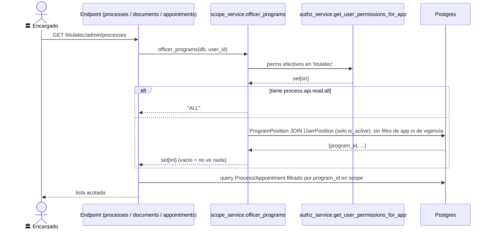

# Alcance por carrera + asignación delegada de encargados

> **Objetivo:** que cada encargado de Servicios Escolares vea y atienda **solo los procesos/citas
> de sus carreras**, y que el jefe pueda **dar de alta encargados** (usuario + carreras) sin tocar
> SQL. Pieza transversal: la usan la bandeja de procesos, el tablero kanban y la agenda de citas.

> ❗ **Alcance real del mecanismo:** hoy el scope por carrera **solo se aplica en 5 listados**
> (`pages/admin.py:652`, `pages/appointments.py:140`, `:199`, `:277`, `pages/documents.py:53`).
> Ninguna ruta de detalle ni de escritura lo verifica. Lee
> **Scope en escritura (estado real)** antes de asumir que este documento describe un control de
> acceso completo.

| | |
|---|---|
| **Actor(es)** | 🏛️ Jefe de Servicios Escolares (`titulatec_school_services_head`) · 🏛️ Encargado (`titulatec_school_services`) |
| **Permiso(s)** | `titulatec.officers.page.list` / `titulatec.officers.api.manage` (gestión) · `titulatec.process.api.read.all` (= ver TODO, salta el scope) |
| **Trigger** | El jefe abre **Encargados** y crea/edita uno; cualquier listado admin filtra por el alcance del usuario. |
| **Precondiciones** | El jefe ocupa un puesto con rol head (vía `PositionAppRole` sobre `head_school_services`). |
| **Sub-flujos** | ⤵ filtra [cita de cotejo](phase2_appointment_loop.md) y la bandeja/kanban de procesos. |
| **Estado final** | Encargado = `Position` del depto (`code` `se_officer_*`) con rol `school_services` + carreras (`ProgramPosition`) + usuarios (`UserPosition`). |

## Backbone (role-centric — 3 capas, no mezclar)

1. **Rol** = QUÉ puedes hacer. `titulatec_school_services` (operativo, **scoped**, SIN `read.all`) vs
   `titulatec_school_services_head` (operativo + `officers.*` + `process.api.read.all` = ve todo).
2. **Puesto** = QUIÉN. El usuario hereda el rol al ocupar el puesto (`UserPosition` → `PositionAppRole`).
3. **`core_program_positions` (ProgramPosition)** = SOBRE QUÉ carreras (M2M puesto↔programa) = el scope.

`PositionAppPerm` (perm directo en puesto) = **solo overrides**, nunca el mecanismo principal.

## Ruta en la app (UI)

1. `/titulatec/admin/officers` (pestaña **Encargados**, visible solo con `officers.page.list`) → alta
   (nombre + usuarios del depto + carreras) y baja. El menú admin es data-driven por permiso
   (`_ADMIN_NAV` + `admin_nav_items` en `pages/nav.py:95-103`).
2. `/titulatec/admin/processes` (bandeja/kanban), `/titulatec/admin/documents` (bandeja de docs) y
   `/titulatec/admin/appointments` (agenda + "del día") listan **ya acotado** al alcance del usuario.

## Secuencia (resolución del alcance)

```mermaid
sequenceDiagram
    actor U as 🏛️ Encargado
    participant API as Endpoint (processes / documents / appointments)
    participant SC as scope_service.officer_programs
    participant AZ as authz_service.get_user_permissions_for_app
    participant DB as Postgres
    U->>API: GET /titulatec/admin/processes
    API->>SC: officer_programs(db, user_id)
    SC->>AZ: perms efectivos en 'titulatec'
    AZ-->>SC: set[str]
    alt tiene process.api.read.all
        SC-->>API: "ALL"
    else
        SC->>DB: ProgramPosition JOIN UserPosition (solo is_active): sin filtro de app ni de vigencia
        DB-->>SC: {program_id, ...}
        SC-->>API: set[int]  (vacío = no ve nada)
    end
    API->>DB: query Process/Appointment filtrado por program_id en scope
    API-->>U: lista acotada
```

## Pasos detallados

| # | Actor | UI / dónde | Acción | Endpoint | Service · método | Efecto en BD |
|---|---|---|---|---|---|---|
| 1 | 🏛️ jefe | `/admin/officers` | Crea encargado | `POST /titulatec/admin/officers` (`officers.py:54`) | `OfficerService.create_officer()` (`officer_service.py:88`) | `Position(se_officer_*)` + `PositionAppRole` + `UserPosition` + `ProgramPosition` |
| 2 | 🏛️ jefe | `/admin/officers` | Edita usuarios/carreras | `POST /titulatec/admin/officers/{position_id}` (`officers.py:79`) | `OfficerService.set_users()` (`:71`) / `set_programs()` (`:59`) | sincroniza `UserPosition` / `ProgramPosition` |
| 3 | 🏛️ jefe | `/admin/officers` | Baja | `POST /titulatec/admin/officers/{position_id}/deactivate` (`officers.py:101`) | `OfficerService.deactivate_officer()` (`:104`) | `Position.is_active=False` |
| 4 | 🏛️ enc. | procesos / kanban / docs / citas | Listar | `GET /admin/processes` · `/admin/documents[/body]` · `/admin/appointments[/body,/calendar,/day]` | `scope_service.officer_programs()` | (lectura) filtra `program_id` ∈ scope |

`officer_programs` (`services/scope_service.py:32`) → `"ALL"` si el usuario tiene
`titulatec.process.api.read.all`; si no, `_program_ids_for_user` (`:20`) devuelve el set de
`program_id` de **todos** los puestos que ocupa el usuario que tengan filas en
`core_program_positions`. **Set vacío = ve 0 procesos** hasta que el jefe le asigne carreras.

Dos precisiones sobre esa query (`scope_service.py:22-28`), porque cambian el resultado:

- **No filtra por app.** El join es `ProgramPosition ⋈ UserPosition` sobre `user_id` únicamente; no
  toca `PositionAppRole` ni `App`. Un puesto de otra app con carreras asignadas en la misma tabla
  `core_program_positions` **aporta sus carreras al scope de TitulaTec**. Decir "los puestos
  titulatec que ocupa" es incorrecto: son *todos* sus puestos.
- **No filtra por vigencia.** Usa solo `UserPosition.is_active.is_(True)`; no aplica
  `authz_service._active_position_filter()` (`itcj2/core/services/authz_service.py:21-31`), que es la
  cláusula canónica y sí considera `start_date`/`end_date`. Un `UserPosition` vencido o con inicio
  futuro sigue aportando carreras al scope.

## Scope en escritura (estado real)

> ❗ **Esto es un hueco abierto, no un diseño.** `officer_programs` se consulta en **5 call sites, los
> 5 de listado**. Ninguna ruta que reciba un `{process_id}` (ni el `?selected=` de la agenda)
> comprueba que ese proceso caiga dentro del scope del usuario. El único control efectivo en esas
> rutas es el permiso de `require_page_app`, que es **global a la app** y con semántica OR sobre la
> lista de perms (`itcj2/dependencies.py:131-134`). Es decir: cualquier usuario con el permiso puede
> leer y mutar el proceso de **cualquier carrera** si conoce (o adivina) el id.

**Call sites que sí aplican scope (los 5, todos lectura de lista):**

| Archivo:línea | Ruta | Qué acota |
|---|---|---|
| `pages/admin.py:652` | `GET /titulatec/admin/processes` | `TitulationProcess.program_id.in_(scope)` (`admin.py:657`); scope vacío → render de contexto `_empty()` (`:655-656`) |
| `pages/appointments.py:140` | `GET /admin/appointments` y `/body` (vía `_body_ctx`) | `allowed_program_ids` a `list_appointments` (`:143-145`) y `list_pending_processes` (`:163-164`) |
| `pages/appointments.py:199` | `GET /admin/appointments/day` (vía `_day_ctx`) | `list_for_day(..., allowed_program_ids=allowed)` (`:202`) |
| `pages/appointments.py:277` | `GET /admin/appointments/calendar` | `counts_by_day(..., allowed_program_ids=allowed)` (`:283`) |
| `pages/documents.py:53` | `GET /admin/documents` y `/body` (vía `_body_ctx`) | `TitulationProcess.program_id.in_(scope)` (`:59`); scope vacío → `rows: []` (`:56-58`) |

**Rutas con `{process_id}` — ninguna aplica guard de carrera:**

| Archivo:línea | Ruta | Permiso exigido | Guard de carrera |
|---|---|---|---|
| `pages/admin.py:737` | `GET /titulatec/admin/processes/{process_id}` | `_PROCESS_VIEW_PERMS` | **NO** — `_detail_ctx(db, process_id)` directo (`:746`) |
| `pages/admin.py:758` | `POST /admin/processes/{process_id}/documents/{type_code}/review` | `document.api.approve` / `.reject` | **NO** |
| `pages/admin.py:782` | `POST /admin/processes/{process_id}/format-b/review` | `format_b.api.approve` / `.reject` | **NO** |
| `pages/admin.py:807` | `POST /admin/processes/{process_id}/phase/{n}/approve` | `process.api.approve_phase` | **NO** |
| `pages/admin.py:828` | `POST /admin/processes/{process_id}/phase/{n}/reject` | `process.api.reject_phase` | **NO** |
| `pages/appointments.py:329` | `POST /admin/appointments/{process_id}/schedule` | `appointment.api.create` | **NO** |
| `pages/appointments.py:358` | `POST /admin/appointments/{process_id}/reschedule` | `appointment.api.reschedule` | **NO** |
| `pages/appointments.py:388` | `POST /admin/appointments/{process_id}/start` | `appointment.api.update` | **NO** |
| `pages/appointments.py:407` | `POST /admin/appointments/{process_id}/attended` | `appointment.api.mark_attended` | **NO** |
| `pages/appointments.py:426` | `POST /admin/appointments/{process_id}/no-show` | `appointment.api.update` | **NO** |
| `pages/appointments.py:449` | `GET /admin/appointments/{process_id}/document/{type_code}` | `document.api.read.all` | **NO** — sirve el archivo con `FileResponse` |
| `pages/documents.py:107` | `POST /admin/documents/{process_id}/document/review` | `document.api.approve` / `.reject` | **NO** — además puede auto-avanzar la fase 1 (`:132-134`) |
| `pages/documents.py:142` | `GET /admin/documents/{process_id}/document/{type_code}` | `document.api.read.all` | **NO** — sirve el archivo, con `?download=1` opcional |

**Fuga extra por querystring (no lleva `{process_id}` en el path):**

`GET /titulatec/admin/appointments` (`appointments.py:222`) y `GET …/appointments/body`
(`appointments.py:241`) reciben `selected: str` del querystring, lo pasan por `_to_int` y lo entregan
a `_body_ctx`, que llama `_detail_ctx(db, selected_id)` **sin cruzarlo contra el scope**
(`appointments.py:174`). `_detail_ctx` (`:88-131`) devuelve, de cualquier proceso: `folio`,
`current_phase`, `status`, nombre / número de control / correo del alumno (`:99`, `:122-124`),
carrera, modalidad, periodo de la convocatoria y las `view_url` de los 3 documentos iniciales
(`_INITIAL_DOC_TYPES`, `:105-113`) — URLs que la tabla de arriba confirma servibles sin guard.
Cambiar `?selected=` a mano recorre alumnos de carreras ajenas.

Contraste (el patrón correcto ya existe en el repo): en `pages/documents.py:69` el `detail` se
resuelve como `next((r for r in rows if r["process_id"] == selected_id), None)` — se busca **dentro
de las filas ya filtradas por scope**, así que un `?selected=` fuera del alcance devuelve `None`. La
agenda de citas no hace eso.

Estas páginas son la única superficie de escritura: `apps/titulatec/api/` y `schemas/` están vacíos y
el router `/api/titulatec/v2` no incluye sub-routers, así que no hay una capa API detrás donde
pudiera vivir el guard faltante.

## Estado resultante

- Encargado nuevo: `core_positions.code` = `se_officer_<hex8>` (`officer_service.py:95`), rol
  `titulatec_school_services` en la app (`officers.py:13`), N `ProgramPosition`, M `UserPosition`.
- Listados admin (`list_appointments`, `list_pending_processes`, `list_for_day`, `counts_by_day`,
  bandeja/kanban de procesos, bandeja de documentos) reciben `allowed_program_ids` = `None` (ALL) o
  el set, y filtran `TitulationProcess.program_id`.

## Caminos alternos / errores ❗

- **`core_program_positions` está HOY en 0 filas** (BD de dev, 2026-09-01). Consecuencia directa: un
  encargado sin `process.api.read.all` obtiene `scope = set()` y **todos sus listados salen vacíos,
  sin error, sin toast y sin explicación en pantalla** (fail-closed silencioso: `admin.py:655-656`
  renderiza `_empty()`; `documents.py:56-58` devuelve `rows: []`). No es un fallo de permisos: faltan
  carreras asignadas. El alta de carreras se hace **solo** desde la pestaña **Encargados**
  (`/titulatec/admin/officers`), que escribe `ProgramPosition` vía `OfficerService.set_programs()`.
- Jefe sin departamento gestionado (`positions_service.get_user_primary_managed_department` → `None`,
  `officers.py:16-22`) → la pestaña Encargados renderiza `{"no_department": True}` (`officers.py:44-45`).
- **La validación "usuario fuera del depto" solo existe en el alta, no en la edición.**
  `create_officer` (`officer_service.py:91-94`) calcula `allowed = department_user_ids(...)` y
  `bad = set(user_ids) - allowed`, así que sí rechaza con `ValueError` → `400` + header `X-Tt-Error`
  (`officers.py:71-72`). Pero `set_users` (`officer_service.py:75`) calcula
  `allowed = OfficerService.department_user_ids(db, department_id) | set(user_ids)`: la unión mete
  los propios `user_ids` en el conjunto permitido, de modo que `bad = set(user_ids) - allowed` es
  **siempre vacío por álgebra de conjuntos** y el `raise` de la línea 78 es inalcanzable. El
  `except ValueError` de `officers.py:93-94` nunca se dispara por esa vía:
  `POST /admin/officers/{position_id}` acepta cualquier `user_id`, incluido uno de otro departamento.
- `POST /admin/officers/{position_id}` y `…/deactivate` tampoco comprueban que el `position_id`
  pertenezca al departamento que gestiona el jefe: `set_users` / `set_programs` /
  `deactivate_officer` reciben el id crudo del path (`officers.py:91-92`, `:109`).

## Patrón reusable (Etapa 2)

`OfficerService` es genérico (`assigned_role`, `department_id`, `program_ids`): el mismo patrón
"asignación delegada de rol con scope por carrera" sirve para Jefe de Vinculación y Sinodales sin
reescribir — solo cambia el `assigned_role` y el departamento. Antes de reusarlo hay que cerrar los
huecos de esta página: la validación inerte de `set_users` y la ausencia de guard en escritura.

## Flujos relacionados

- ⤵ [Cita de cotejo (loop completo)](phase2_appointment_loop.md) — su agenda y la vista "del día" se acotan aquí.
- ← [Glosario: roles, permisos, ProgramPosition](_glossary.md)
