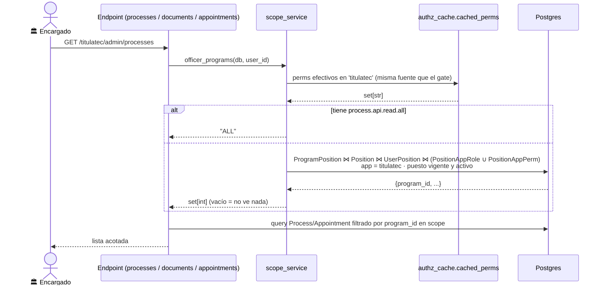

# Alcance por carrera + asignación delegada de encargados

> **Objetivo:** que cada encargado de Servicios Escolares vea y atienda **solo los procesos/citas
> de sus carreras**, y que el jefe pueda **dar de alta encargados** (usuario + carreras) sin tocar
> SQL. Pieza transversal: la usan la bandeja de procesos, el tablero kanban y la agenda de citas.

> ✅ **Alcance real del mecanismo:** el scope por carrera se aplica en **dos capas**: el filtro SQL
> de los listados (`pages/admin.py:652`, `pages/appointments.py:307`, `pages/documents.py:53`)
> **y** el guard `assert_process_in_scope` en las **13 rutas con
> `{process_id}`** (§ *Scope en escritura*). Mismo predicado en ambas: si un proceso no sale en tu
> listado, sus rutas de detalle y de mutación responden **404**.

| | |
|---|---|
| **Actor(es)** | 🏛️ Jefe de Servicios Escolares (`titulatec_school_services_head`) · 🏛️ Encargado (`titulatec_school_services`) |
| **Permiso(s)** | `titulatec.officers.page.list` / `titulatec.officers.api.manage` (gestión **y** llave del cubo "Sin carrera") · `titulatec.process.api.read.all` (= ver todas las carreras; **no** abre los procesos sin carrera) |
| **Trigger** | El jefe abre **Encargados** y crea/edita uno; cualquier listado admin filtra por el alcance del usuario. |
| **Precondiciones** | El jefe ocupa un puesto con rol head (vía `PositionAppRole` sobre `head_school_services`). |
| **Sub-flujos** | ⤵ filtra [cita de cotejo](phase2_appointment_loop.md) y la bandeja/kanban de procesos. |
| **Estado final** | Encargado = `Position` del depto (`code` `se_officer_*`) con rol `school_services` + carreras (`ProgramPosition`) + usuarios (`UserPosition`). |

## Backbone (role-centric — 3 capas, no mezclar)

1. **Rol** = QUÉ puedes hacer. `titulatec_school_services` (operativo, **scoped**, SIN `read.all`) vs
   `titulatec_school_services_head` (operativo + `officers.*` + `process.api.read.all` = ve todo).
2. **Puesto** = QUIÉN. El usuario hereda el rol al ocupar el puesto (`UserPosition` → `PositionAppRole`).
3. **`core_program_positions` (ProgramPosition)** = SOBRE QUÉ carreras (M2M puesto↔programa) = el scope.

`PositionAppPerm` (perm directo en puesto) = **solo overrides**, nunca el mecanismo principal —
pero el alcance lo acepta igual que el gate (`has_any_assignment`): si otorga la app, otorga
las carreras de su puesto. Un scope que ignorara esa vía dejaría entrar a la app y no mostraría
nada.

## Ruta en la app (UI)

1. `/titulatec/admin/officers` (pestaña **Encargados**, visible solo con `officers.page.list`) → alta
   (nombre + usuarios del depto + carreras) y baja. El menú admin es data-driven por permiso
   (`_ADMIN_NAV` + `admin_nav_items` en `pages/nav.py:95-103`).
2. `/titulatec/admin/processes` (bandeja/kanban), `/titulatec/admin/documents` (bandeja de docs) y
   `/titulatec/admin/appointments` (agenda + "del día") listan **ya acotado** al alcance del usuario.

## Secuencia (resolución del alcance)

```mermaid
sequenceDiagram
    actor U as 🏛️ Encargado
    participant API as Endpoint (processes / documents / appointments)
    participant SC as scope_service
    participant AZ as authz_cache.cached_perms
    participant DB as Postgres
    U->>API: GET /titulatec/admin/processes
    API->>SC: officer_programs(db, user_id)
    SC->>AZ: perms efectivos en 'titulatec' (misma fuente que el gate)
    AZ-->>SC: set[str]
    alt tiene process.api.read.all
        SC-->>API: "ALL"
    else
        SC->>DB: ProgramPosition ⋈ Position ⋈ UserPosition ⋈ (PositionAppRole ∪ PositionAppPerm)<br/>app = titulatec · puesto vigente y activo
        DB-->>SC: {program_id, ...}
        SC-->>API: set[int]  (vacío = no ve nada)
    end
    API->>DB: query Process/Appointment filtrado por program_id en scope
    API-->>U: lista acotada
```

Y el mismo criterio, por proceso, en toda ruta que reciba un `{process_id}`:

```mermaid
sequenceDiagram
    actor U as 🏛️ Encargado
    participant API as POST /admin/processes/{id}/phase/1/approve
    participant G as scope_service.assert_process_in_scope
    participant SV as PhaseService
    participant DB as Postgres
    U->>API: {process_id} de una carrera ajena
    API->>G: assert_process_in_scope(db, user_id, process_id)
    G->>DB: db.get(TitulationProcess, id)
    alt no existe · program_id NULL sin officers.api.manage · carrera fuera del scope
        G-->>API: HTTPException(404) sin detalle ni X-Tt-Error
        API-->>U: 404 (htmx no hace swap; toast genérico)
    else dentro del alcance
        G-->>API: TitulationProcess (ya cargado)
        API->>SV: approve_phase(db, proc, n, actor)
        API-->>U: parcial re-renderizado
    end
```

## Pasos detallados

| # | Actor | UI / dónde | Acción | Endpoint | Service · método | Efecto en BD |
|---|---|---|---|---|---|---|
| 1 | 🏛️ jefe | `/admin/officers` | Crea encargado | `POST /titulatec/admin/officers` (`officers.py:54`) | `OfficerService.create_officer()` (`officer_service.py:88`) | `Position(se_officer_*)` + `PositionAppRole` + `UserPosition` + `ProgramPosition` |
| 2 | 🏛️ jefe | `/admin/officers` | Edita usuarios/carreras | `POST /titulatec/admin/officers/{position_id}` (`officers.py:79`) | `OfficerService.set_users()` (`:71`) / `set_programs()` (`:59`) | sincroniza `UserPosition` / `ProgramPosition` |
| 3 | 🏛️ jefe | `/admin/officers` | Baja | `POST /titulatec/admin/officers/{position_id}/deactivate` (`officers.py:101`) | `OfficerService.deactivate_officer()` (`:104`) | `Position.is_active=False` |
| 4 | 🏛️ enc. | procesos / kanban / docs / citas | Listar | `GET /admin/processes` · `/admin/documents[/body]` · `/admin/appointments[/body,/calendar,/day]` | `scope_service.officer_programs()` | (lectura) filtra `program_id` ∈ scope |
| 5 | 🏛️ enc. | detalle / acción sobre un proceso | Abrir, dictaminar, agendar, descargar | las **13 rutas con `{process_id}`** (tabla de abajo) | `scope_service.assert_process_in_scope()` | **404** si el proceso no cae en el alcance; si cae, devuelve el `TitulationProcess` ya cargado |

`officer_programs` (`services/scope_service.py:96`) → `"ALL"` si el usuario tiene
`titulatec.process.api.read.all`; si no, `_program_ids_for_user` (`:41`) devuelve las carreras
(`core_program_positions`) de los puestos **vigentes y activos** que le otorgan **esta** app.
**Set vacío = ve 0 procesos** hasta que el jefe le asigne carreras.

Criterio exacto de esa query (`scope_service.py:69-93`) — el alcance es el **gemelo del gate**:

- **Filtra por app.** `ProgramPosition ⋈ Position ⋈ UserPosition` + (`PositionAppRole` ∪
  `PositionAppPerm` con `allow`) sobre `app_id = titulatec`. Se aceptan las dos vías porque son las
  dos que acepta `has_any_assignment`: si el gate deja entrar por una vía que el alcance ignora, el
  usuario entra a la app y ve **todo vacío sin explicación**. `core_program_positions` es tabla
  **core**, así que sin este filtro un puesto de otra app con carreras ampliaba el alcance aquí.
- **Filtra por vigencia.** Usa `authz_service._active_position_filter()`
  (`itcj2/core/services/authz_service.py:21-31`), la cláusula canónica: `is_active` **y**
  `start_date <= hoy` **y** (`end_date` NULL o >= hoy), más `Position.is_active`. Alinea el alcance
  con el gate, que ya usaba esa cláusula: un puesto vencido deja de aportar carreras y deja de
  abrir la app **a la vez**.
- **Una sola fuente de permisos.** `_user_perms` (`:28`) lee `cached_perms` — el mismo Redis del
  que lee el gate (`dependencies.py:132`) — y no `get_user_permissions_for_app` directo. Preguntar a
  la BD por separado hacía que gate y alcance discreparan dentro del mismo request mientras viviera
  el TTL.
- **Sin puesto no hay ancla.** Un rol concedido directo al usuario (`core_user_app_roles`) no tiene
  `ProgramPosition` → set vacío. Misma regla que el scope por departamento de `org-scoped-authz`.

## Scope en escritura (el guard)

Hasta 2026-09 esto era un **hueco abierto**: `officer_programs` se consultaba en 5 call sites, los
5 de listado, y ninguna ruta con `{process_id}` comprobaba nada. Como `titulatec_processes.id` es un
entero secuencial (`models/process.py:14`), bastaba con incrementarlo para leer, dictaminar y
**descargar** documentos de cualquier carrera. Cerrado con `assert_process_in_scope`.

**El predicado (`services/scope_service.py:116-152`), en orden:**

1. el proceso no existe → `None`
2. `program_id IS NULL` y el usuario tiene `officers.api.manage` → pasa *(cubo "Sin carrera")*
3. `program_id IS NULL` sin ese permiso → `None` — **también para quien tiene `read.all`**
4. scope `"ALL"` → pasa
5. `program_id ∈ scope` → pasa; resto → `None`

`assert_process_in_scope` lo envuelve y levanta **`HTTPException(404)`**. **404 y no 403**: un 403
confirmaría que el id existe y convertiría la ruta en un contador del padrón. Por lo mismo el 404 va
**sin `X-Tt-Error`** — ese header sería el oráculo que el 404 acaba de cerrar; en la UI queda el
toast genérico de `admin/base_admin.html:60-66`. En una navegación completa se renderiza
`core/errors/core_error.html` (`/titulatec` no está en `_APP_BY_PREFIX`, `main.py:217-227`); en un
parcial HTMX el cuerpo da igual: htmx no hace swap en 4xx.

La regla 3 es deliberada: `read.all` lo tienen **dos** roles (jefe y titulaciones), y el cubo
"Sin carrera" es una **cola de reparación de datos**, así que lo abre quien puede repararla.

**Call sites de listado (los 5, filtro SQL):**

| Archivo:línea | Ruta | Qué acota |
|---|---|---|
| `pages/admin.py:652` | `GET /titulatec/admin/processes` | `TitulationProcess.program_id.in_(scope)` (`:657`); scope vacío → contexto `_empty()` (`:655-656`) |
| `pages/appointments.py:307` | `GET /admin/appointments` y `/body` (vía `_shell_ctx`) | **una** resolución de `officer_programs` alimenta **cinco** consultas: `list_for_day` (`:324`), `list_appointments` (`:328`), `list_pending_processes` (`:343`), `agenda_process_ids` (`:363`) y `counts_by_day` (`:249`, vía `_calendar_ctx`) |
| `pages/documents.py:53` | `GET /admin/documents` y `/body` (vía `_body_ctx`) | `program_id.in_(scope)` (`:59`); scope vacío → `rows: []` (`:56-58`) |

> ⚠️ **Las rutas `/admin/appointments/calendar` y `/day` ya no existen** (2026-09-02): se plegaron
> dentro de `/body`, que ahora renderiza el shell de tres zonas completo. Eso concentra el riesgo:
> una sola petición resuelve las cinco consultas de arriba, y **las cinco tienen default abierto**
> (`allowed_program_ids: set | None = None`). Olvidar una filtra de menos **en silencio**, sin
> excepción ni log. Lo cubre `tests/fastapi/titulatec/test_appointments_scope_day.py`, con un test
> por superficie más un regresor estructural que lee el fuente de `_shell_ctx` y falla si aparece
> una llamada nueva sin acotar.

**Las 13 rutas con `{process_id}` — todas llaman al guard, como primera sentencia del `try`:**

| Archivo:línea | Ruta | Permiso exigido | Nota |
|---|---|---|---|
| `pages/admin.py:737` | `GET /titulatec/admin/processes/{process_id}` | `_PROCESS_VIEW_PERMS` | el guard sustituyó al `Response(404)` de `_detail_ctx` |
| `pages/admin.py:761` | `POST /admin/processes/{process_id}/documents/{type_code}/review` | `document.api.approve` / `.reject` | |
| `pages/admin.py:787` | `POST /admin/processes/{process_id}/format-b/review` | `format_b.api.approve` / `.reject` | |
| `pages/admin.py:814` | `POST /admin/processes/{process_id}/phase/{n}/approve` | `process.api.approve_phase` | usa el proceso que devuelve el guard (ya no hay `db.get`) |
| `pages/admin.py:839` | `POST /admin/processes/{process_id}/phase/{n}/reject` | `process.api.reject_phase` | ídem |
| `pages/appointments.py:501` | `POST /admin/appointments/{process_id}/schedule` | `appointment.api.create` | ídem (lo usa para `ReviewDayService.is_allowed`) |
| `pages/appointments.py:531` | `POST /admin/appointments/{process_id}/reschedule` | `appointment.api.reschedule` | ídem |
| `pages/appointments.py:557` | `POST /admin/appointments/{process_id}/start` | `appointment.api.update` | |
| `pages/appointments.py:579` | `POST /admin/appointments/{process_id}/attended` | `appointment.api.mark_attended` | |
| `pages/appointments.py:601` | `POST /admin/appointments/{process_id}/no-show` | `appointment.api.update` | |
| `pages/appointments.py:615` | `GET /admin/appointments/{process_id}/document/{type_code}` | `document.api.read.all` | guard **antes** de tocar disco (`FileResponse`) |
| `pages/documents.py:107` | `POST /admin/documents/{process_id}/document/review` | `document.api.approve` / `.reject` | corta también el auto-avance de fase 1 (`:135-139`) |
| `pages/documents.py:147` | `GET /admin/documents/{process_id}/document/{type_code}` | `document.api.read.all` | guard **antes** de tocar disco; admite `?download=1` |

El `finally: db.close()` sigue corriendo aunque el guard levante: la `HTTPException` sale del `try`.

**Por qué el guard vive en la ruta y no como parámetro de los services:** un parámetro de scope
fallaría **abierto** (`allowed_program_ids=None` significa hoy "sin restricción", y una ruta que
olvida el guard olvidaría también el parámetro). En su lugar: **(a)** el guard devuelve el proceso,
así que usarlo es el camino más corto al objeto — olvidarlo cuesta *más* código; **(b)** un test
estructural (`tests/fastapi/titulatec/test_scope_guard.py::test_toda_ruta_con_process_id_invoca_el_guard`)
recorre el router y falla en rojo ante cualquier ruta nueva con `{process_id}` sin guard.

**El `?selected=` de la agenda (fuga cerrada, sin `{process_id}` en el path):**

`GET /titulatec/admin/appointments` y `…/appointments/body` reciben `selected: str` del querystring.
Iba crudo a `_detail_ctx`, que devolvía —de **cualquier** proceso del sistema— folio, fase, estado,
**nombre, número de control y correo** del alumno, carrera, modalidad, periodo y las `view_url` de
sus 3 documentos iniciales. Enumeración del padrón con un incremento de entero.

Cerrado en dos capas, ambas vigentes:

1. **`_shell_ctx` (`appointments.py:358-369`)** descarta el `selected_id` que no esté en el
   **universo acotado** del usuario y lo pone a `None`, para que un id ajeno no quede pegado en los
   `hx-get` del parcial. Ese universo es `agenda_process_ids(allowed) | {pendientes}`: **toda** la
   agenda del usuario más **toda** su cola, nunca las filas de la vista. Estrecharlo al día o a los
   filtros rompería dos casos legítimos —abrir a un alumno de «Por agendar», que por definición no
   tiene cita, y abrir a uno cuya cita cae otro día— y los dos están cubiertos por
   `test_appointments_scope_day.py::TestDetalle`.
2. **`_detail_ctx` (`appointments.py:165-180`)** es `_detail_ctx(db, process_id, *, user_id)` y
   arranca con `process_in_scope`. Es la guarda DURA, no una comodidad: la capa 1 es una lista de
   ids y ésta es el predicado. Lo llaman `_shell_ctx` y, vía `_render_body`, las 5 acciones.

**Citas y documentos se direccionan siempre por `(process_id, …)`, nunca por su propio id** —
`AppointmentService.get_for_process`, `DocumentService.get_document(db, process_id, type_code)`.
Mientras se cumpla, **un solo guard cubre las tres entidades**; el día que aparezca un
`{appointment_id}` en una ruta hará falta un `assert_appointment_in_scope` que resuelva
`appt.process_id` y delegue en éste. Hay un test estructural que defiende la invariante.

**Las 13 rutas del alumno (`pages/student.py`) no llevan guard y no deben llevarlo:** resuelven el
proceso desde `DocumentService.get_active_process(db, int(user["sub"]))` o
`filter_by(student_id=user_id)`. **Ningún `process_id` viaja por la URL**, así que están
auto-acotadas por diseño; el otro test estructural lo defiende.

Estas páginas son la única superficie de escritura: `apps/titulatec/api/` y `schemas/` están vacíos y
el router `/api/titulatec/v2` no incluye sub-routers. Si algún día se monta uno, su dependencia debe
llamar **al mismo guard**.

### Lo que este guard NO cubre (todavía)

- **El cubo "Sin carrera" no tiene UI.** Los procesos con `program_id IS NULL` solo son alcanzables
  por URL directa y solo con `officers.api.manage`; falta el chip/KPI en la bandeja, el filtro
  `?program=none` y `POST /admin/processes/{id}/program` para reasignar la carrera (spec §5.3-5.4).
  Consecuencia visible hoy: un usuario con `read.all` **sin** `officers.api.manage` (rol
  `titulatec_titulaciones`) **ve** esos procesos en la lista de `GET /admin/processes` pero recibe
  404 al abrirlos. Se cierra con ese mismo trabajo.
- **`scope_empty`**: un alcance vacío sigue renderizando un listado vacío mudo, indistinguible de
  "no hay trabajo" (spec §9.2).
- **KPIs de la bandeja** (`admin.py:304-308`), **`_students_ctx`** y **`student_lookup`** siguen sin
  acotar (spec §8).

## Estado resultante

- Encargado nuevo: `core_positions.code` = `se_officer_<hex8>` (`officer_service.py:95`), rol
  `titulatec_school_services` en la app (`officers.py:13`), N `ProgramPosition`, M `UserPosition`.
- Listados admin (`list_appointments`, `list_pending_processes`, `list_for_day`, `counts_by_day`,
  bandeja/kanban de procesos, bandeja de documentos) reciben `allowed_program_ids` = `None` (ALL) o
  el set, y filtran `TitulationProcess.program_id`.
- Detalle y acciones: **lista == detalle == escritura**. Lo que el listado no muestra, la ruta con
  `{process_id}` lo rechaza con 404, y el `?selected=` de la agenda no lo resuelve.

## Caminos alternos / errores ❗

- **`core_program_positions` está HOY en 0 filas** (BD de dev, 2026-09-01). Consecuencia directa: un
  encargado sin `process.api.read.all` obtiene `scope = set()` y **todos sus listados salen vacíos,
  sin error, sin toast y sin explicación en pantalla** (fail-closed silencioso: `admin.py:655-656`
  renderiza `_empty()`; `documents.py:56-58` devuelve `rows: []`). No es un fallo de permisos: faltan
  carreras asignadas. El alta de carreras se hace **solo** desde la pestaña **Encargados**
  (`/titulatec/admin/officers`), que escribe `ProgramPosition` vía `OfficerService.set_programs()`.
- Jefe sin departamento gestionado (`positions_service.get_user_primary_managed_department` → `None`,
  `officers.py:16-22`) → la pestaña Encargados renderiza `{"no_department": True}` (`officers.py:44-45`).
- **La validación "usuario fuera del depto" solo existe en el alta, no en la edición.**
  `create_officer` (`officer_service.py:91-94`) calcula `allowed = department_user_ids(...)` y
  `bad = set(user_ids) - allowed`, así que sí rechaza con `ValueError` → `400` + header `X-Tt-Error`
  (`officers.py:71-72`). Pero `set_users` (`officer_service.py:75`) calcula
  `allowed = OfficerService.department_user_ids(db, department_id) | set(user_ids)`: la unión mete
  los propios `user_ids` en el conjunto permitido, de modo que `bad = set(user_ids) - allowed` es
  **siempre vacío por álgebra de conjuntos** y el `raise` de la línea 78 es inalcanzable. El
  `except ValueError` de `officers.py:93-94` nunca se dispara por esa vía:
  `POST /admin/officers/{position_id}` acepta cualquier `user_id`, incluido uno de otro departamento.
- `POST /admin/officers/{position_id}` y `…/deactivate` tampoco comprueban que el `position_id`
  pertenezca al departamento que gestiona el jefe: `set_users` / `set_programs` /
  `deactivate_officer` reciben el id crudo del path (`officers.py:91-92`, `:109`).

## Patrón reusable (Etapa 2)

`OfficerService` es genérico (`assigned_role`, `department_id`, `program_ids`): el mismo patrón
"asignación delegada de rol con scope por carrera" sirve para Jefe de Vinculación y Sinodales sin
reescribir — solo cambia el `assigned_role` y el departamento.

Regla que se fija **antes** de ese reuso: hoy el jefe de Servicios Escolares tiene `read.all`, así
que delegar *cualquier* carrera es coherente (no puede delegar más de lo que ve). Un delegante con
alcance **acotado** solo podrá delegar carreras de su propio alcance —
`program_ids ⊆ officer_programs(db, delegante)` cuando ese resultado no sea `"ALL"`. Sin esa regla,
"asignación delegada" se convierte en escalada horizontal en cuanto lo herede un rol scoped.

## Flujos relacionados

- ⤵ [Cita de cotejo (loop completo)](phase2_appointment_loop.md) — su agenda y la vista "del día" se acotan aquí.
- ← [Glosario: roles, permisos, ProgramPosition](_glossary.md)
