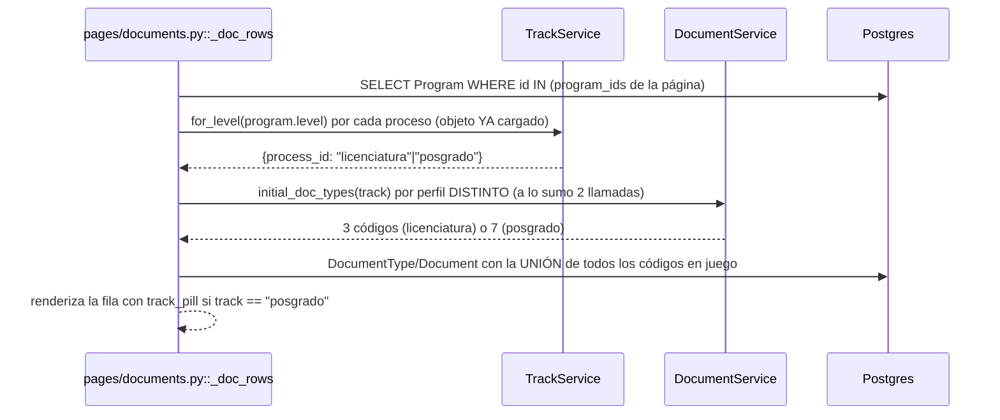

# Perfil de titulación por nivel de carrera (licenciatura | posgrado)

> **Objetivo:** que TODO lo que varía entre un egresado de licenciatura y uno de posgrado (fase 1
> de documentos, formulario de encuesta, textos, píldoras) cuelgue de un **perfil** (`licenciatura`
> | `posgrado`) resuelto en un ÚNICO lugar (`TrackService`), en vez de listas de carreras o
> comparaciones de `Program.level` regadas por el código. Pieza transversal (sin pantalla propia):
> la consumen los documentos de fase 1, la bandeja/visor/expediente admin, el alumno y la encuesta
> de egresados. Spec `docs/superpowers/specs/2026-09-30-titulatec-posgrado-design.md` (§4.1-4.5,
> §5, invariantes §6).

| | |
|---|---|
| **Actor(es)** | 🤖 Sistema (función de lectura pura; no la invoca un humano directamente) |
| **Permiso(s)** | ninguno nuevo (invariante 6): es una columna del core, no un permiso |
| **Trigger** | cualquier vista, servicio o comando que necesite saber si UN proceso (o una carrera) es de posgrado |
| **Precondiciones** | ninguna — sin carrera (`program_id IS NULL`) resuelve a `licenciatura`, igual que una carrera con nivel desconocido |
| **Sub-flujos** | ninguno propio; lo componen casi todos los de fase 1 y encuesta (tabla de consumidores, abajo) |
| **Estado final** | N/A — no muta nada; es la respuesta a "¿qué perfil es este proceso?" que otros servicios usan para decidir su propio estado |

## Backbone (3 capas, no mezclar)

1. **Dato** = `core_programs.level` (`licenciatura` \| `maestria` \| `doctorado`). Vive en el
   **core** (`itcj2/core/models/program.py`), no en TitulaTec: el nivel académico de una carrera no
   es un concepto de esta app, aunque hoy solo esta app lo consuma.
2. **Perfil** = `TrackService.for_level`/`for_process`/`for_process_id`/`for_processes`
   (`itcj2/apps/titulatec/services/track_service.py`). Traduce `level` → `licenciatura` \|
   `posgrado`. **Único lugar que compara `Program.level`** (invariante 2) — lo defiende
   `test_posgrado_structure.py::test_ninguna_comparacion_con_program_level_fuera_de_track_service`.
3. **Consumo** = cada servicio/página pregunta el perfil y decide su propio set (documentos,
   formulario, texto) — nunca vuelve a mirar `level` ni nombres de carrera.

## Datos — `core_programs.level`

- `Program.level = Column(String(20), nullable=False, server_default="licenciatura")`
  (`itcj2/core/models/program.py:24-27`), dominio en el comentario de la columna, **sin** `Enum`
  (convención del proyecto) — el dominio real lo cierra el `CheckConstraint`
  `ck_core_programs_level` (`:52-57`, `level IN ('licenciatura','maestria','doctorado')`), con el
  MISMO texto que la migración para que `create_all` (CI) y la migración nunca diverjan.
- Constantes: `PROGRAM_LEVELS = ("licenciatura", "maestria", "doctorado")` (`:11`),
  `POSTGRADUATE_LEVELS = ("maestria", "doctorado")` (`:16`); propiedad `Program.is_postgraduate`
  (`:59-66`, `self.level in POSTGRADUATE_LEVELS`) — de uso **interno** de `TrackService`; nadie más
  debe llamarla ni replicar la comparación.
- Migración `tt20260930a` (`migrations/versions/tt20260930a_core_programs_level.py`,
  `down_revision="tt20260929a"`), **escrita a mano** (nada de autogenerate): `add_column` con
  `server_default='licenciatura'` + `create_check_constraint`; el downgrade quita primero el check y
  luego la columna, en el mismo orden simétrico que el alta — no porque Postgres lo exija (tirar la
  columna se lleva el `CheckConstraint` solo, sin `CASCADE`: corrección de la revisión final, el
  docstring de la migración decía lo contrario), sino para no depender de ese comportamiento
  implícito y dejar la intención explícita en el propio script.
- Compatibilidad blue/green: el código viejo no lista `level` en sus `SELECT`/`INSERT` explícitos
  de `core_programs` — el `server_default` la llena sola —, así que una versión anterior del
  backend sigue funcionando contra la tabla ya migrada.
- Estado medido (2026-09-30): dev y el respaldo del 2026-09-17 tienen 25 carreras, todas
  `licenciatura`. En prod el usuario ya dio de alta a mano las 4 de posgrado (las 4 más recientes)
  — siguen en `licenciatura` hasta correr `titulatec init-posgrado` (ver abajo).

## `TrackService` — el único traductor

```python
TRACK_LICENCIATURA = "licenciatura"; TRACK_POSGRADO = "posgrado"

TrackService.for_level(level: str | None) -> str
TrackService.for_process(db, process) -> str
TrackService.for_process_id(db, process_id: int) -> str
TrackService.for_processes(db, processes: Iterable) -> dict[int, str]
```

(`itcj2/apps/titulatec/services/track_service.py`)

- **`for_level`** (`:20-30`): CUALQUIER valor en `POSTGRADUATE_LEVELS` → `posgrado`; cualquier
  otro — **incluido `None`** — → `licenciatura`. Falla CERRADO del lado que importa: un nivel
  desconocido o corrupto nunca se cuela como posgrado.
- **`for_process`** (`:32-40`): `process.program_id is None` → `licenciatura` directo, sin
  consultar (invariante del Review Focus 1: un proceso sin carrera se comporta como licenciatura
  en TODA pantalla, sin excepción); si hay carrera, `db.get(Program, ...)` + `for_level`.
- **`for_process_id`** (`:42-55`): igual que `for_process`, buscando primero el proceso; uno
  inexistente → `licenciatura` (nunca una excepción — lo llama código de lote/CLI, no una ruta que
  deba responder 404). Único consumidor: `DocumentService.initial_doc_types_for_id`.
- **`for_processes`** (`:57-82`): la versión EN LOTE, **una sola consulta** — `{Program.id:
  Program.level}` con `IN (...)` sobre los `program_id` distintos que traiga la lista, ninguna si
  nadie trae carrera. Para bandejas/barridos que no pueden permitirse una consulta de `Program` por
  fila.

**Leer `program.level` no es lo que este documento prohíbe.** `pages/admin.py:1338`,
`pages/appointments.py:205` y `pages/documents.py:64` hacen
`TrackService.for_level(program.level if program else None)` — un `program` que YA cargaron para
otra cosa (el nombre a mostrar), reusado para no repetir el `db.get`. Es una **lectura** (`ast.
IfExp`, no `ast.Compare`) que se la entrega a `TrackService`; lo prohibido es **decidir** el perfil
comparando `.level` uno mismo (`if program.level == "maestria"`, `level in (...)`) en vez de
preguntarle a este servicio. La guarda estructural lo distingue exactamente así — ver
`test_posgrado_structure.py`.

## Secuencia (caso de lote: bandeja de Documentos)



## Consumidores (uno por Tarea del plan)

| Consumidor | Perfil resuelto con | Qué produce |
|---|---|---|
| `services/document_service.py::initial_doc_types` / `_for` / `_for_id` / `_by_process` | `TrackService.for_level/for_process/for_process_id/for_processes` | el set de fase 1: `BASE_INITIAL_DOCS` (3) + `POSGRADO_EXTRA_DOCS` (4) si `track == "posgrado"` — **única fuente** del set (invariante 1) |
| `services/document_service.py::initial_docs_all_approved` (R-G, ver abajo) | recibe el set ya resuelto (`codes`) | elegibilidad de cotejo, tolerando extras de posgrado FALTANTES si la fase 1 ya cerró |
| `services/document_service.py::sync_initial_phase` | `initial_doc_types_for` | avanza `ProcessPhase(1)` a `in_review`/`in_progress` según el set DEL proceso (3 o 7) |
| `services/appointment_service.py::_pending_candidates` (→ `list_pending_processes`, `list_self_blocked_processes`, `list_missing_survey_processes`, `pages/appointments.py:937`) | `initial_doc_types_by_process` (lote, `TrackService.for_processes`) | los cubos «Por agendar» / «Requieren que les agendes» / «Encuesta sin liberar» de la cola del encargado |
| `services/mail_reminders.py::_documentos` (recordatorio `docs_reminder`) | `initial_doc_types_by_process` (lote) | a cada proceso le mide "falta"/"por corregir" contra SU set, no un 3 fijo |
| `pages/student.py::documents`, `_initial_docs_set_guard`, `document_upload`, `document_delete` | `TrackService.for_process` | 7 casillas en posgrado (3 en licenciatura); guarda 400 si el `type_code` no está en el set del proceso |
| `pages/documents.py::_doc_rows`/`_doc_row` (bandeja SE) | `TrackService.for_level` (reusa `Program` ya cargado) | filas con perfiles MEZCLADOS en la misma bandeja; `track_pill` junto a la carrera |
| `pages/appointments.py::_detail_ctx` (visor de cotejo) | ídem | visor con 7 documentos en vez de 3 |
| `pages/admin.py::_detail_ctx` (expediente) | ídem | expediente con 7 documentos en vez de 3 |
| `services/survey_service.py::form_for_user` | `TrackService.for_process` (del proceso acreditable del usuario) | resuelve `SURVEY_CODES_BY_TRACK[track]` EN ORDEN — ver más abajo |
| `cli/titulatec.py::_resync_posgrado_phase1` | `TrackService.for_processes` (lote) | re-sincroniza fase 1 tras clasificar las 4 carreras (§ CLI, abajo) |

`track_pill(track)` (macro, `templates/titulatec/_macros.html:92`): píldora violeta «Posgrado»
junto a la carrera, vacía para cualquier otro valor. La pintan `partials/documents_body.html`,
`partials/processes/_exp_shell.html` (expediente) y `partials/appointments/_appt_attend.html`
(ficha de cotejo) — las 3 vistas de documentos del spec §4.4.

## Documentos de fase 1 por perfil (`DocumentService`)

`itcj2/apps/titulatec/services/document_service.py`:

- `BASE_INITIAL_DOCS = ("birth_certificate", "high_school_cert", "curp")` (`:20`) — licenciatura Y
  el "suelo" de posgrado.
- `POSGRADO_EXTRA_DOCS = ("professional_license", "degree_title", "postgrad_authorization",
  "efirma_sat")` (`:21-23`) — cédula profesional, título, oficios de autorización de la DEPI (**un
  solo PDF**, D5) y comprobante de e.firma/cita SAT. D6: cédula y título son del **grado anterior**
  (`INITIAL_DOC_HINTS`, `:29-40` — solo cambia el texto de ayuda, no la validación).
- `initial_doc_types(track)` (`:43-60`): posgrado = los 3 base + los 4 extras, EN ESE ORDEN;
  cualquier otro valor —incluido uno que no debería llegar tras pasar por `TrackService`— cae a
  licenciatura (falla CERRADO: pide de más, nunca de menos).
- Catálogo (`titulatec_document_types`, DML 19 — ver CLI): `professional_license` → «Cédula
  profesional» → archivo `{control}_CEDULA`; `degree_title` → «Título» → `{control}_TITULO`;
  `postgrad_authorization` → «Oficios de autorización...» → `{control}_OFICIOS`; `efirma_sat` →
  «Comprobante de e.firma...» → `{control}_EFIRMA`. Etiquetas en
  `utils/storage.py::_DOCUMENT_LABELS` (`:43-51`).
- **Hueco cerrado** (spec §4.4, invariante 4): `pages/student.py::_initial_docs_set_guard`
  (`:407-436`) devuelve `400` + `X-Tt-Error` («Este documento no aplica a tu proceso.») si el
  `type_code` de la fase `initial_docs` NO está en el set del PERFIL del proceso — antes de tocar
  storage o BD (orden: `dtype` → proceso → `_phase_guard` → este guard → storage). Sin él,
  licenciatura podía subir los 4 extras de posgrado por `POST` directo, y cualquiera podía subir un
  tipo de fase 1 activo en el catálogo pero fuera de las dos listas (p. ej. `egel_proof`). Invocado
  en `POST /titulatec/student/documents/{type_code}` (`:1110`) y `DELETE .../{type_code}` (`:1196`).
- Licenciatura queda **byte a byte igual** (invariante 3, Controller ruling R1): con
  `docs_total == 3`, `student/documents.html` renderiza el mismo «Fase 01 · Acta · Certificado ·
  CURP»; con posgrado (`docs_total == 7`) pasa a «Fase 01 · {{ docs_total }} documentos». El texto
  del personal (`admin/documents.html:9`, ruling R2) es neutro para los dos perfiles («Al aprobar
  todos sus documentos...») — es copy de bandeja, no del trámite de licenciatura.

## R-G — un proceso que ya pasó la fase 1 no se regresa (invariante 8)

Deriva de D9 (spec §5): un proceso de posgrado que **ya pasó** la fase de `initial_docs` **antes**
del despliegue de este perfil (con solo los 3 documentos base, porque el perfil posgrado todavía no
existía) no debe regresar a Documentos por los 4 extras que nunca le pidieron.

- **Dónde vive el predicado (Ruling R11, revisión final 2026-09-30):**
  `DocumentService.excused_initial_docs(process, present_codes, *, initial_docs_phase)` — PURO, sin
  `db`: devuelve los códigos de `POSGRADO_EXTRA_DOCS` SIN fila que se dispensan **solo si**
  `process.current_phase` ya pasó el número de la fase `initial_docs`
  (`PhaseService.phase_number_for_code`, que el llamador resuelve una vez y reparte). Los 3 base
  **siempre** se exigen, haya pasado la fase o no, y un extra que SÍ tiene fila debe estar `approved`
  igual que cualquier otro. Sin proceso o sin catálogo de fases, la fase se trata como ABIERTA (se
  exige el set completo) — nunca lanza una excepción. `initial_docs_all_approved` ya NO trae la
  lógica en línea: consulta este predicado.
- **A quién afecta (hallazgo de la revisión final — R-G llegaba solo a la elegibilidad, no a los
  CONTADORES):**
  - **Elegibilidad de cotejo**: `AppointmentService._pending_candidates` (vía
    `list_pending_processes`/`list_self_blocked_processes`/`list_missing_survey_processes`,
    consumidos por la cola del encargado en [`phase2_appointment_loop.md`](phase2_appointment_loop.md)
    vía `pages/appointments.py:937`) — decide si el proceso ENTRA a la cola.
  - **Bandeja de Documentos** (`pages/documents.py::_doc_row`): un dispensado sale con
    `status="excused"` — pseudo-estado de la UI, igual que `missing` — y NO cuenta en `pending` ni
    impide `all_approved`; píldora neutra «En cotejo» (`estado_pill`, `_macros.html`). Sin esto, un
    proceso así se quedaba para siempre en la cola «Por evaluar» con una píldora «4».
  - **Resumen del alumno** (`DocumentService.initial_docs_summary` → `pages/student.py::
    _docs_progress`): `total`/`uploaded` cuentan SOLO lo exigible (sin los dispensados);
    `counts["excused"]`; el acordeón pinta «Se entrega en el cotejo» en vez de «sin subir».
  - **Visor de cotejo y expediente** (`pages/appointments.py`/`pages/admin.py::_detail_ctx`): mismos
    7 renglones, pero un dispensado se rotula «Se entrega en el cotejo» en vez de «Falta» — así
    Servicios Escolares sabe qué pedir en el cotejo (D9).
- **A quién NO afecta:** [el auto-agendado del propio egresado](phase2_student_self_booking.md).
  `SelfBookingService.eligibility()` no llama a `DocumentService` en ningún punto — sus 7 reglas
  miran `process.status`, el veredicto de la fase 2, el estado de la encuesta y las cancelaciones,
  nunca documentos (los documentos son la puerta de la fase 1, ya superada para llegar a la
  pantalla de cita). Un egresado de posgrado que cerró su fase 1 antes del despliegue, y que por
  tanto sigue en «Por agendar» gracias a R-G, agenda su cita exactamente igual que cualquier otro —
  R-G no le agrega ni le quita ninguna validación a esa pantalla; solo evita que la cola del
  encargado deje de ofrecerle un lugar.
- **`sync_initial_phase` nunca toca una fase cerrada** (`:244-246`, `:280-287`): solo actúa si
  `process.current_phase` es JUSTO la fase de `initial_docs`; una fase ya `approved`/`skipped` no se
  toca pase lo que pase con el conteo de documentos. Por eso el CLI (abajo) puede re-sincronizar sin
  miedo a regresar a nadie.
- Ver también la fila «Ya pasó la fase 1» de la tabla de despliegue, abajo.

## Encuesta de egresados por perfil (`SurveyService`)

`itcj2/apps/titulatec/services/survey_service.py`:

```python
SURVEY_CODE = "egresados"                       # licenciatura / por omisión (:48)
SURVEY_CODE_POSGRADO = "egresados_posgrado"     # aun sin contenido (D3) (:53)
SURVEY_CODES_BY_TRACK = {                        # (:58-61)
    "licenciatura": (SURVEY_CODE,),
    "posgrado": (SURVEY_CODE_POSGRADO, SURVEY_CODE),
}
SurveyService.form_for_user(db, user_id: int | None) -> SurveyForm | None   # (:165-202)
```

- **D3 (interino):** mientras no exista una versión `status='open'` de `egresados_posgrado`,
  posgrado contesta la de licenciatura — exactamente como si fuera licenciatura. El cambio a su
  propio formulario es automático en cuanto alguien publique esa versión (un DML nuevo en
  `posgrado_2026_10/` + `init-posgrado`, sin tocar `form_for_user` ni sus llamadores). Costo
  aceptado: un borrador interino sin enviar en `egresados` queda huérfano si `egresados_posgrado` se
  publica antes (el egresado empieza de cero); lo YA ENVIADO se respeta y no se vuelve a pedir.
- **Resolución por REQUEST, nunca por constante** (invariante 5): sin `user_id` (visitante anónimo)
  o sin proceso acreditable (`ProcessService.creditable_process`) resuelve la cadena de
  licenciatura. Con proceso, `TrackService.for_process` da el perfil y se prueba cada código de
  `SURVEY_CODES_BY_TRACK[track]` EN ORDEN con `open_form(db, code)` — gana el primero no nulo.
- **Consumidores:** las 4 rutas públicas de `pages/public.py` (GET `:675`, paso `:857`, borrador
  `:1042`, envío `:1215`) — las 4 llaman `SurveyService.form_for_user(db, int(user["sub"]) if user
  else None)`, **cero** referencias residuales a `open_form(db, SURVEY_CODE)`.
- **Excepción deliberada, no una copia:** `pages/surveys_admin.py::_resolve_form` (`:44-68`)
  SIGUE llamando `SurveyService.open_form(db, SURVEY_CODE)` (`:63`) como valor por omisión de la
  bandeja **Encuestas** (GTV) cuando nadie eligió un `form_id` — antes de esta tarea el default
  tomaba SIEMPRE el más reciente por `(status, version, id)`, que en cuanto exista una versión
  `open` de `egresados_posgrado` habría abierto esa bandeja (y su export CSV, que reusa el mismo
  resolver) en el formulario de posgrado por omisión, aunque casi todas las respuestas sigan siendo
  de licenciatura mientras dura el interino (D3). El selector (`_forms`) ya lista TODOS los
  formularios — este default solo evita sorprender a quien entra sin tocarlo. Es un default de
  PANTALLA (qué mostrar primero en un listado admin), no la resolución "qué formulario le toca a
  ESTE egresado" que exige el invariante 5; por eso el censo estructural
  (`test_posgrado_structure.py::test_ningun_open_form_con_survey_code_fuera_del_default_de_encuestas`)
  excluye explícitamente este único archivo en vez de tratarlo como una regresión.
- Sin cambios: `SurveyReview`, el requisito de cotejo `graduate_survey`, los recordatorios (por
  proceso, no por formulario) ni la URL pública. Detalle de lo que SÍ hace GTV con la respuesta:
  [liberación GTV de la encuesta de egresados](phase2_tech_management_survey_release.md).

## DML + CLI `titulatec init-posgrado`

`database/DML/titulatec/posgrado_2026_10/` (gitignored; subcarpeta propia, D10) +
`itcj2/cli/titulatec.py`:

- **`18_classify_posgrado_programs.sql`**: normaliza
  `upper(translate(name, 'áéíóúüÁÉÍÓÚÜ', 'aeiouuAEIOUU'))` y ubica las 4 carreras **por nombre**,
  nunca por id ni "las últimas 4" (D2): `MAESTRIA%`+`%NEGOCIOS%`, `MAESTRIA%`+`%ADMINISTRATIVA%`,
  `MAESTRIA%`+`%INDUSTRIAL%` → `maestria`; `DOCTORADO%` → `doctorado`. Cada patrón debe casar
  **exactamente 1** carrera o aborta con `RAISE EXCEPTION` (nunca duplica, invariante 7). Sin
  ninguna raíz `MAESTR`/`DOCTOR` en toda la tabla (dev/CI/instalación nueva) inserta las 4 con
  nombres canónicos.
- **`19_insert_posgrado_doc_types.sql`**: los 4 tipos de documento extra en fase 1, `ON CONFLICT
  (code) DO UPDATE` (idempotente).
- **Fuente única de los patrones** (`cli/titulatec.py:1245-1252`, `_POSGRADO_NORM`/
  `_POSGRADO_PATRONES`): la usan tanto el pre-chequeo como la verificación, para que un cambio en
  el SQL no desincronice al CLI de lo que el SQL en verdad hace.
- **`_precheck_posgrado()`** (`:1323-1427`, SOLO LECTURA): antes de escribir nada, dice qué rama
  tomaría el 18 AHORA MISMO — `"update"` (los 4 patrones casan 1 fila cada uno, con ids distintos),
  `"insert"` (ninguna carrera contiene `MAESTR`/`DOCTOR`) o `"abort"` (ambigüedad, o una carrera de
  posgrado a medias). `--dry-run` la usa para imprimir la rama sin escribir.
- **`_posgrado_resync_preview(db, program_ids)`** (`:1430-1487`): vista previa de a quién
  re-sincronizaría, usando los `program_ids` que YA identificó el precheck — no `TrackService`
  (inútil aquí: antes de correr el 18 las 4 carreras SIGUEN en `licenciatura`).
- **`init-posgrado [--dry-run] [--allow-insert]`** (`:1596-1763`): corre SOLO esos 2 archivos
  (mismo patrón D10 que `init-email-tasks`: producción ya corrió `init-titulatec` una vez y ese
  comando nunca se re-ejecuta). La rama `"insert"` **aborta sin `--allow-insert`** (evita duplicar
  4 carreras canónicas si los nombres reales usan una abreviatura que el 18 no reconoce, p. ej.
  «Mtría.»). Al terminar: `_verify_posgrado()` (`:1255-1320`, los `RAISE NOTICE` del SQL son
  invisibles para Python), imprime «Rama tomada» + id/nombre/nivel de las 4 carreras, avisa
  (amarillo) si alguna con `MAESTR`/`DOCTOR` en el nombre sigue en `licenciatura`
  (`_posgrado_warn_unclassified`, `:1505-1520`), y por último **`_resync_posgrado_phase1(dry_run=
  False)`** (`:1523-1593`): re-sincroniza `ProcessPhase(1)` de los procesos de posgrado `active` que
  siguen en esa fase (vía `TrackService.for_processes` + `DocumentService.sync_initial_phase`, **sin
  avisos ni correos** — la función solo escribe estado) y respeta R-G (un proceso que ya pasó esa
  fase no entra al filtro por `current_phase`).
- Ambos archivos están además en `SEED_FILES` (`cli/titulatec.py:108-109`, antes del 15 que da
  permisos a `admin`): una instalación desde cero (`init-titulatec`) ya los siembra sin gate extra.

## Despliegue (spec §9, resumen — no duplica el detalle completo)

1. Antes de fusionar: `SELECT id, name FROM core_programs ORDER BY id DESC LIMIT 6;` — las 4 de
   posgrado deben empezar con «Maestría»/«Doctorado» (si no, el 18 abortará; corregir el nombre
   primero) — y revisar procesos de posgrado por fase (para avisar a Servicios Escolares del §5 y de
   la población R-G, punto 3 de abajo).
2. Fusionar → `alembic upgrade head` (llega a `tt20260930a`) → copiar
   `database/DML/titulatec/posgrado_2026_10/` al servidor → `titulatec init-posgrado`,
   INMEDIATAMENTE después del deploy y FUERA DE HORARIO (hallazgo de la revisión final: hasta que
   corre, aprobar los 3 documentos base de un posgrado lo avanza de fase como si fuera licenciatura y
   lo suma a la población R-G de abajo) → comparar los ids impresos con las 4 más recientes.
3. `init-posgrado` (dry-run y corrida real) imprime además la población R-G bajo «Pedir en el cotejo
   (fase 1 ya cerrada): N» (D9 sin herramienta, Tarea 8, solo lectura) — avisarla a Servicios
   Escolares. Avisar TAMBIÉN de que el barrido de recordatorios de las 9:00
   (`MailReminders._documentos`) le va a mandar a cada posgrado que SIGUE en fase 1 con ≥3 días sin
   actividad el recordatorio de documentos con los 4 campos nuevos — es el aviso correcto para quien
   no ha pasado la fase, no un error.
4. Reversa — ORDEN INVERTIDO al de otras migraciones de esta app (p. ej.
   [elegibilidad SII](xcut_sii_eligibility.md#volver-atrás), que SÍ baja la BD antes de
   `rollback.sh`): hallazgo de la revisión final. `core_programs.level` lo lee el ORM de `Program`
   en cada carga (`SELECT` sin lista explícita de columnas) — con la imagen NUEVA todavía sirviendo,
   tirar la columna ANTES revienta esa lectura con `UndefinedColumn` hasta que `rollback.sh` conmute
   nginx y recree celery/sockets. El código VIEJO, en cambio, tolera la columna de más (no la lista
   en su `SELECT`/`INSERT`): por eso aquí `rollback.sh` va PRIMERO.
   1. `./docker/scripts/rollback.sh` (el código viejo ya sirve; tolera `level` de más).
   2. Después, `alembic downgrade tt20260929a` como paso suelto DESDE LA IMAGEN NUEVA (la vieja no
      trae `tt20260930a` y alembic no la encontraría):
      ```bash
      export IMAGE_TAG="$(git rev-parse --short HEAD)"   # la imagen NUEVA (la que corrió el deploy)
      docker compose -f docker/compose/docker-compose.prod.yml --profile blue \
          run --rm --entrypoint "" -e PYTHONPATH=/app backend-blue \
          bash -c "cd /app && alembic -c migrations/alembic.ini downgrade tt20260929a"
      ```
   La reversa sigue siendo obligatoria antes de desplegar un `main` revertido: ese árbol no reconoce
   `tt20260930a` y `alembic` no podría ubicarla.

## Procesos en curso al desplegar (spec §5)

| Estado del proceso de posgrado | Qué pasa |
|---|---|
| Fase 1, documentos incompletos | Ve 4 espacios nuevos; la fase avanza al tener los 7 aprobados. |
| Fase 1 `in_review` con los 3 base | `init-posgrado` la re-sincroniza a `in_progress` (sin avisos). |
| Ya pasó la fase 1 | No se regresa (R-G, arriba). El checklist de despliegue lo lista para que Servicios Escolares pida los 4 en el cotejo — sus faltantes se MUESTRAN pero no bloquean agendar. |
| Encuesta ya enviada | Se respeta (D3, arriba). |

## Caminos alternos / errores ❗

- Proceso sin carrera (`program_id IS NULL`) → `licenciatura`, sin excepción, en TODA pantalla
  (Review Focus 1 del plan) — `TrackService.for_process` corta antes de consultar `Program`.
- Carrera con `level` fuera del dominio conocido (no debería pasar: hay `CheckConstraint`) →
  `for_level` cae a `licenciatura` (falla cerrado).
- `TrackService.for_process_id`/`for_processes` con un proceso inexistente o sin `program_id` en el
  lote → `licenciatura` para esa fila, nunca una excepción ni una consulta con `IN ()` vacío.
- Subir/borrar un `type_code` de fase 1 fuera del set del PROPIO proceso → `400` + `X-Tt-Error`
  (`_initial_docs_set_guard`), sin fila `Document` ni archivo en disco.
- DML ante nombres casi duplicados (p. ej. «MAESTRIA EN INGENIERIA INDUSTRIAL» y «Maestría en
  Ingeniería Industrial») → `_precheck_posgrado`/el propio 18 abortan sin escribir; re-correrlo
  sobre una base ya marcada no duplica (el `UPDATE` es idempotente).

## Flujos relacionados

- ⤵ [El alumno sube sus documentos iniciales](phase1_student_upload_initial_docs.md) — 3 o 7 slots.
- ⤵ [Servicios Escolares revisa los documentos](phase1_school_services_review_docs.md) — bandeja
  con perfiles mezclados.
- ⤵ [Liberación GTV de la encuesta de egresados](phase2_tech_management_survey_release.md) — qué
  hace GTV con la respuesta, sin relación con el perfil.
- ⤵ [El egresado agenda su propia cita](phase2_student_self_booking.md) — por qué R-G NO le agrega
  ninguna validación a esa pantalla.
- ⤵ [Correos del proceso al egresado](xcut_student_email_notifications.md) — recordatorio de
  documentos por perfil.
- ← [Glosario: entidades, tablas, servicios](_glossary.md).
