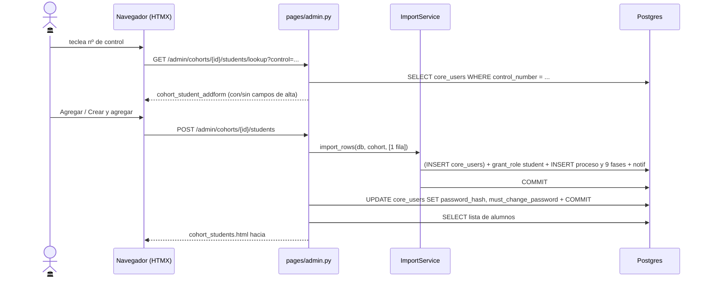

# Servicios Escolares da de alta un alumno a mano (Fase 0)

> **Objetivo:** meter a la convocatoria a un alumno suelto (el que no venía en el CSV del Forms)
> escribiendo sólo su número de control, reutilizando el mismo motor del importador.

| | |
|---|---|
| **Actor(es)** | 🏛️ Servicios Escolares (`titulatec_school_services` / `titulatec_school_services_head`) |
| **Permiso(s)** | Alta (POST): `titulatec.cohort.api.import_csv` (`admin.py:216`) · Tab, lookup y cancelar: cualquiera de `_COHORT_PERMS` = `cohort.page.list` · `cohort.api.import_csv` · `dashboard.admin` · `dashboard.school_services` (`admin.py:17-21`) |
| **Trigger** | Botón **Agregar alumno** en el tab *Alumnos* del detalle de convocatoria |
| **Precondiciones** | Existe el `Cohort`; hay `core_programs` y `titulatec_modalities` activas para poblar los selects |
| **Sub-flujos** | ⤵ reusa `ImportService.import_rows` de [import CSV](phase0_school_services_import_csv.md) |
| **Estado final** | 1 `TitulationProcess` en fase 1 `in_progress` + rol `student` concedido + notif `PROCESS_CREATED` |

## Ruta en la app (UI)

1. Sidebar → **Convocatorias** (`/titulatec/admin/cohorts`) → clic en la convocatoria
   (`/titulatec/admin/cohorts/{id}?tab=alumnos`, `pages/admin.py:385-411`).
2. Tab **Alumnos** → botón **Agregar alumno** (`partials/cohort_student_addbtn.html`), que hace
   `hx-get .../students/lookup` sobre `#student-add` con `hx-swap="innerHTML"`.
3. El form (`partials/cohort_student_addform.html`) trae un solo campo obligatorio inicial:
   **Nº de control**, con `hx-trigger="change, keyup changed delay:500ms"` que repite el lookup
   contra el mismo `#student-add`. El form se re-renderiza completo en cada tecleo.
4. Según el resultado del lookup el form cambia de cara:
   - **encontrado** → muestra el nombre en un cuadro de sólo lectura (`bg-light`) y el botón dice **Agregar**;
   - **no encontrado** → aparecen *Nombre (nuevo)* (`required`) y *Email* (opcional) y el botón dice **Crear y agregar**.
   Antes de teclear nada (`searched` falso) no se pinta botón de submit.
5. Selects **Carrera** (`_programs`) y **Modalidad** (`_modalities`, sólo `is_active`) siempre visibles.
   No tienen opción vacía: el navegador manda siempre la primera.
6. Submit → `hx-post .../students` con `hx-target="#cohort-tab-body" hx-swap="innerHTML"`: la respuesta
   es el tab *Alumnos* completo (`partials/cohort_students.html`), así que el form se colapsa solo
   y la tabla ya trae la fila nueva.
7. La ✕ hace `hx-get .../students/cancel`, que devuelve el botón colapsado y nada más.

## Secuencia

## Pasos detallados

| # | Actor | UI / dónde | Acción | Endpoint | Service · método | Efecto en BD | Eventos / Notif |
|---|---|---|---|---|---|---|---|
| 1 | 🏛️ | tab *Alumnos* | abrir el form | `GET /titulatec/admin/cohorts/{id}/students/lookup` (`admin.py:190-205`) | — (query inline a `User`) | — (sólo lectura) | — |
| 2 | 🏛️ | input control | buscar por control | mismo endpoint, re-render del form | — | — | — |
| 3 | 🏛️ | botón submit | dar de alta | `POST /titulatec/admin/cohorts/{id}/students` (`admin.py:214-239`) | `_add_student()` (`admin.py:124-139`) → `ImportService.import_rows()` (`import_service.py:240-327`) | `core_users` (INSERT si es nuevo; si ya existía y se mandó email y el user no tenía, se rellena `email`) · `core_user_app_roles` ← rol `student` en app `titulatec` · `titulatec_processes` ← 1 fila `folio=TT-{period_code}-{seq:04d}`, `current_phase=1`, `status=active`, `is_app_active=true` · `titulatec_process_phases` ← 9 filas (fase 0 `approved`, fase 1 `in_progress`, 2-8 `pending`) | `notify_student(type="PROCESS_CREATED")` → `core_notifications`, `data.url = /titulatec/student/fase/1` (`import_service.py:315-319`) |
| 4 | 🏛️ | — | credencial inicial (**sólo si el user es nuevo**) | mismo POST | `_add_student` (`admin.py:135-139`) | `core_users.password_hash = hash_nip(control)` · `must_change_password = true` · `COMMIT` propio | — |
| 5 | 🏛️ | tab *Alumnos* | ver el resultado | mismo POST | `_students_ctx()` (`admin.py:97-121`) | — | — |
| 6 | 🏛️ | ✕ | cancelar | `GET /titulatec/admin/cohorts/{id}/students/cancel` (`admin.py:207-211`) | — | — | — |

## Estado resultante

- `titulatec_processes` ← 1 proceso `active`, `current_phase = 1`, `is_app_active = true`.
- Fase 0 `approved` (intake), fase 1 `in_progress`, fases 2-8 `pending`.
- `core_user_app_roles` ← (`user`, app `titulatec`, rol `student`); `grant_role` invalida la caché de
  authz del usuario (`core/services/authz_service.py:85`).
- El alumno queda listo para [subir sus documentos iniciales](phase1_student_upload_initial_docs.md).
- Si el `User` se creó en este alta: `must_change_password = true` y `password_hash = hash_nip(control)`.

## Caminos alternos / errores ❗

- **El control ya existe** (`existed`, `admin.py:228` y `admin.py:128`) → **se adjunta**, no se crea:
  `import_rows` hace merge por `control_number` (`import_service.py:275-279`) y sólo rellena `email`
  si el user no tenía. **No se toca la contraseña**: el paso 4 está guardado por `if not existed`.
  El campo *Nombre* ni se pinta, y el POST lo repone con `existed.full_name` (`admin.py:229`).
- **El control no existe** → se crea `User` con `username = control_number`, `first_name`/`last_name`
  por split ingenuo (último token = apellido), `role_id` = rol global `student` si existe,
  `is_active=true`, `must_change_password=true` (`import_service.py:281-294`).
- **Falta convocatoria o falta control** → `400` + `X-Tt-Error: "Falta el número de control."` (`admin.py:226-227`).
- **Falta nombre y el alumno es nuevo** → `400` + `X-Tt-Error: "Falta el nombre del alumno."` (`admin.py:230-231`).
  Ambos los recoge el handler global de `htmx:responseError` en `admin/base_admin.html:61-66` → toast rojo.
- **Control con formato inválido** (no cumple `CONTROL_NUMBER_RE = ^(\d{8}|[A-Za-z]\d{7,9})$`,
  `import_service.py:45,271-273`) → `import_rows` lo cuenta como `skipped` y **no crea nada**, pero
  `_add_student` descarta el summary y el endpoint responde `200` con la tabla igual que estaba:
  el alta falla **en silencio**, sin toast. Mismo desenlace si el alumno ya tenía proceso en esa
  convocatoria (`import_service.py:298-299`): re-render idempotente, sin aviso.
- **Sin alcance por carrera:** ni el alta ni `_students_ctx` consultan `scope_service.officer_programs`.
  Quien tenga `titulatec.cohort.api.import_csv` puede dar de alta en **cualquier** carrera.
  Ver [alcance por carrera](engine_officer_scope.md).

## ⚠️ Advertencias sobre el comportamiento actual

Ambas verificadas en el código al 2026-09-01. Se documentan como **comportamiento real**, no como
diseño deseado.

1. **La credencial inicial es el propio número de control.**
   `_add_student` hace `user.password_hash = hash_nip(control)` (`admin.py:136`), y ese mismo `control`
   es el `username` (`import_service.py:286`). Usuario y contraseña son el mismo dato, y es un dato
   público. `must_change_password = true` obliga al cambio en el primer login, pero **hasta ese momento
   la cuenta es adivinable por cualquiera que conozca el número de control**.
   Nótese además la asimetría con el import por CSV: ahí `password_hash` se queda en `NULL`
   (`import_service.py:285-291` no lo asigna; la columna es nullable, `core/models/user.py:22`).
   Dos caminos de alta, dos políticas de credencial distintas.

2. **La contraseña se escribe en una transacción aparte y posterior.**
   `ImportService.import_rows` cierra con su propio `db.commit()` (`import_service.py:321`), y
   `grant_role` ya había hecho otro commit dentro del bucle (`core/services/authz_service.py:81`).
   Sólo *después* de ese commit `_add_student` asigna la credencial y hace un **segundo** `db.commit()`
   (`admin.py:136-139`). No hay `try/except` ni rollback compensatorio: si ese segundo commit falla,
   el alumno queda creado, con rol, con proceso y con la notificación ya enviada, pero con
   **`password_hash = NULL`** y sin poder entrar hasta que alguien le reponga la contraseña a mano.
   El endpoint devolvería igualmente la tabla actualizada, sin señal del fallo.

## Flujos relacionados

- ← Alternativa masiva: [import de alumnos por CSV](phase0_school_services_import_csv.md).
- ⤵ Siguiente: [el alumno sube documentos iniciales](phase1_student_upload_initial_docs.md).
- ⤵ Contexto: [alcance por carrera de los encargados](engine_officer_scope.md).
