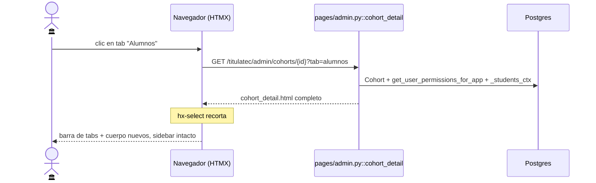

# Detalle de convocatoria: 4 sub-pestañas HTMX (Fase 0)

> **Objetivo:** dar a Servicios Escolares una sola pantalla por convocatoria donde ve el
> avance del padrón, da de alta alumnos (uno a uno o por CSV) y —si es la jefa— configura
> los días habilitados para el cotejo.

| | |
|---|---|
| **Actor(es)** | 🏛️ Servicios Escolares (encargado) · 🏛️ Jefa de Servicios Escolares (solo ella toca *Días de cotejo*) |
| **Permiso(s)** | Página: **cualquiera** de `titulatec.cohort.api.import_csv` · `titulatec.cohort.page.list` · `titulatec.dashboard.admin` · `titulatec.dashboard.school_services` (`_COHORT_PERMS`, `pages/admin.py:17-21`). Acciones: `titulatec.cohort.api.import_csv` (alta manual + wizard CSV) · `titulatec.cohort.api.review_days` (calendario editable) |
| **Trigger** | Clic en el nombre / botón **Detalles** de una fila de `/titulatec/admin/cohorts` (`admin/cohorts.html:55,60`) |
| **Precondiciones** | Existe el `Cohort` (creado en la lista; uno por `core_academic_periods.id`) |
| **Sub-flujos** | ⤵ [importación por CSV](phase0_school_services_import_csv.md) · ⤵ [cita de cotejo](phase2_appointment_loop.md) (consume los días) |
| **Estado final** | No muta por sí misma: es el hub. Cada tab escribe en `core_users` / `titulatec_processes` / `titulatec_cohort_review_days` |

## Ruta en la app (UI)

1. Sidebar admin → **Convocatorias** (`/titulatec/admin/cohorts`; entrada de `_ADMIN_NAV` gateada
   por `titulatec.cohort.page.list`, `pages/nav.py:99`) → fila → **Detalles**.
2. `/titulatec/admin/cohorts/{id}` — encabezado (nombre, `status`, `period_code`,
   `opens_at`/`closes_at`) + barra de 4 tabs.
3. Tabs (orden en pantalla, `admin/cohort_detail.html:21`):

| Tab | `?tab=` | Parcial incluido | Qué muestra |
|---|---|---|---|
| **Resumen** | `resumen` (default) | `partials/cohort_summary.html` | 4 KPIs + embudo por fase |
| **Alumnos** | `alumnos` | `partials/cohort_students.html` | alta manual + buscador + tabla paginada |
| **Días de cotejo** | `dias` | `partials/cohort_days_calendar.html` | calendario mensual toggle (o solo lectura) |
| **Importar** | `importar` | `partials/cohort_import.html` | dropzone del wizard CSV |

> Son **4**, no más. `cohort_detail()` normaliza `tab` contra la tupla
> `("resumen", "dias", "alumnos", "importar")` y cae a `"resumen"` con cualquier otro valor
> (`pages/admin.py:391`).

## Patrón de navegación entre tabs

Cada tab es un **link real** (`href`) **y** un `hx-get` a la misma URL con `?tab=`, con
`hx-push-url="true"`: funciona con y sin JS, y la URL siempre refleja el tab abierto.

El swap **no** es sobre `#cohort-tab-body`: es sobre `#cohort-pane`, el contenedor que envuelve
*la barra de tabs + el cuerpo*, con `hx-target="#cohort-pane" hx-select="#cohort-pane"
hx-swap="outerHTML"` (`admin/cohort_detail.html:25`). El comentario del template lo justifica:
swappear el pane completo deja el estado `is-active` correcto y evita IDs duplicados. El endpoint
devuelve **la página completa** (`cohort_detail.html`, que extiende `base_admin.html`) y es HTMX
quien recorta `#cohort-pane` con `hx-select`.

`#cohort-tab-body` sí existe (`admin/cohort_detail.html:29`) pero como **destino de un solo uso**:
el submit del alta manual de alumno (`cohort_student_addform.html:6`,
`hx-target="#cohort-tab-body" hx-swap="innerHTML"`).

Todo esto vive dentro de `#tt-admin-content`, el área que el sidebar swappea con
`hx-swap="morph:outerHTML"` (`admin/base_admin.html:48,63`): son dos niveles de swap
independientes.

## Pasos detallados

Prefijos: router de páginas `/titulatec` (`pages/router.py:18`) + router admin `/admin`
(`pages/admin.py:14`). Abajo se omiten.

| # | Actor | UI / dónde | Acción | Endpoint | Service · método | Efecto en BD | Permiso del endpoint |
|---|---|---|---|---|---|---|---|
| 0 | 🏛️ | lista | abrir detalle | `GET /cohorts/{id}[?tab=]` | `_cohort_summary_ctx` / `_students_ctx` / `_review_days_ctx` | — (lectura) | `_COHORT_PERMS` |
| 1 | 🏛️ | Alumnos | desplegar alta | `GET /cohorts/{id}/students/lookup?control=` | (inline, `User.control_number`) | — | `_COHORT_PERMS` |
| 1b | 🏛️ | Alumnos | cancelar alta | `GET /cohorts/{id}/students/cancel` | — | — | `_COHORT_PERMS` |
| 2 | 🏛️ | Alumnos | crear/adjuntar alumno | `POST /cohorts/{id}/students` | `_add_student` → `ImportService.import_rows` | `core_users` (UPSERT por `control_number`) + `titulatec_processes` + 9 `titulatec_process_phases` + rol `student`; si el user es nuevo: `password_hash=hash_nip(control)`, `must_change_password=True` | `titulatec.cohort.api.import_csv` |
| 3 | 🏛️ | Alumnos | buscar / filtrar fase / paginar | `GET /cohorts/{id}/students?q=&phase=&page=` | `_students_ctx` | — | `_COHORT_PERMS` |
| 4 | 🏛️ jefa | Días de cotejo | navegar de mes | `GET /cohorts/{id}/review-days?month=YYYY-MM` | `ReviewDayService.list_days` | — | `titulatec.cohort.api.review_days` |
| 5 | 🏛️ jefa | Días de cotejo | marcar/desmarcar día | `POST /cohorts/{id}/review-days/toggle` (`date`, `month`) | `ReviewDayService.toggle` | INSERT o DELETE en `titulatec_cohort_review_days` | `titulatec.cohort.api.review_days` |
| 6 | 🏛️ | Importar | subir CSV | `POST /cohorts/{id}/import/upload` | `ImportService.save_temp` + `parse` + `autodetect_mapping` | — (CSV temporal por token) | `titulatec.cohort.api.import_csv` |
| 7 | 🏛️ | Importar | ajustar mapeo | `POST /cohorts/{id}/import/revalidate` | `ImportService.read_temp` + `build_preview` | — | `titulatec.cohort.api.import_csv` |
| 8 | 🏛️ | Importar | confirmar | `POST /cohorts/{id}/import/commit` | `ImportService.save_mapping` + `import_rows` + `delete_temp` | igual que el paso 2, en lote; notif `PROCESS_CREATED` por proceso creado | `titulatec.cohort.api.import_csv` |

### Targets HTMX (no todo swappea el tab)

| Acción | `hx-target` | Fuente |
|---|---|---|
| Cambio de tab · botón "Importar CSV" del tab Alumnos | `#cohort-pane` (`outerHTML` + `hx-select`) | `cohort_detail.html:25` · `cohort_students.html:8` |
| Submit del alta manual | `#cohort-tab-body` (`innerHTML`) → `cohort_students.html` | `cohort_student_addform.html:6` |
| Lookup / cancelar alta | `#student-add` (`innerHTML`) | `cohort_student_addbtn.html:2` · `cohort_student_addform.html:10,29` |
| Buscador, filtro de fase, paginación | `#students-body` (`innerHTML`) → `cohort_students_table.html` | `cohort_students.html:16,20` · `cohort_students_table.html:30,33` |
| Flechas de mes y toggle del calendario | `#tt-cal-wrap` (`outerHTML` + `hx-select="#tt-cal-wrap"`) | `cohort_days_calendar.html:6,9,23` |
| Upload / revalidate / commit del CSV | `#import-body` (`innerHTML`) | `cohort_import.html:11` · `import_preview.html:32,92` |

## Detalle por sub-pestaña

### Resumen (`tab=resumen`, default)

`_cohort_summary_ctx` (`pages/admin.py:53-89`) carga **todos** los `TitulationProcess` del cohort
y agrega en memoria:

- KPIs: `total`, `completed` + `pct_completed`, `with_appt` (procesos con al menos un
  `ReviewAppointment`, `DISTINCT process_id`), `review_days` (`len(ReviewDayService.list_days)`).
- `phase_rows`: una franja del embudo por cada `PhaseDefinition` activa ordenada por
  `order_index`, **incluidas las de count 0** para ver el flujo completo. El color es
  `hsl(222 → 38)` interpolado por posición (`cohort_summary.html:18-20`).
- Con `total == 0` el embudo se sustituye por un texto que apunta a los tabs *Importar* y
  *Alumnos* (`cohort_summary.html:33`).

`ReviewDayService.list_days` va dentro de un `try/except` que degrada a `review_days = 0`
(`pages/admin.py:74-77`): el KPI nunca tumba la página.

### Alumnos (`tab=alumnos`)

- **Alta manual unificada por nº de control** (`#student-add`): el botón colapsado
  (`cohort_student_addbtn.html`) se reemplaza por el form del lookup; el input dispara
  `GET .../students/lookup` con `hx-trigger="change, keyup changed delay:500ms"`. Si el
  `control_number` ya existe, el nombre sale en solo lectura y el botón dice **Agregar**; si no
  existe, pide nombre + email y el botón dice **Crear y agregar**
  (`cohort_student_addform.html:13-18,27`).
- El submit reusa `ImportService.import_rows` con una sola fila: mismo folio secuencial
  `TT-{period_code}-{seq:04d}` y las 9 fases (fase 0 `approved`, fase 1 `in_progress`, resto
  `pending` — `import_service.py:300-313`). Extra sobre el CSV: si el usuario es nuevo,
  `_add_student` le pone la contraseña = número de control (`hash_nip`) y
  `must_change_password=True` (`pages/admin.py:124-138`).
- **Tabla**: 25 filas por página (`_STUDENTS_PER_PAGE`), orden `created_at DESC`, filtro `ILIKE`
  sobre `control_number` o `full_name`, filtro por `current_phase`. Cada fila enlaza al detalle del
  proceso (`/titulatec/admin/processes/{process_id}`).
- El selector de fase ofrece `0..8` (`cohort_students.html:22`).

### Días de cotejo (`tab=dias`)

- Contexto: `_review_days_ctx` (`pages/admin.py:141-168`) — matriz
  `Calendar(firstweekday=0).monthdatescalendar(year, month)` del **mes actual** al abrir el tab,
  con `on = fecha ∈ ReviewDayService.list_days`, más `prev_month`/`next_month` precalculados.
- **La editabilidad es del contexto, no de la ruta**: `cohort_detail()` resuelve
  `can_edit_days = "titulatec.cohort.api.review_days" in get_user_permissions_for_app(...)`
  (`pages/admin.py:397-399`). Con el permiso, cada celda del mes lleva
  `hx-post .../review-days/toggle`; sin él las celdas son `<td>` inertes y la cabecera dice
  **"· solo lectura"** (`cohort_days_calendar.html:7,19-29`).
- Hoy solo `titulatec_school_services_head` tiene `titulatec.cohort.api.review_days`
  (`database/DML/titulatec/03_insert_role_permissions.sql:62`, confirmado contra la BD de dev). El
  encargado operativo ve el calendario en solo lectura.
- El toggle es idempotente por fecha: `ReviewDayService.toggle` borra si existe, inserta si no, y
  hace `commit` en el service (`services/review_day_service.py:36-46`).
- Los días marcados son la lista de fechas agendables del
  [loop de cita de cotejo](phase2_appointment_loop.md): `ReviewDayService.is_allowed` valida el alta
  de cita y `months_with_days` alimenta el selector de fechas.

### Importar (`tab=importar`)

`cohort_detail()` no precarga nada para este tab (`pass`, `pages/admin.py:402-403`):
`cohort_import.html` solo pinta la dropzone y un `#import-body` vacío. A partir del `change` del
`<input type=file>` el wizard es **exactamente** el standalone
`/titulatec/admin/cohorts/{id}/import` — mismos endpoints y mismos parciales
(`import_preview.html` → `import_success.html`). Detalle completo del parseo, auto-mapeo y commit:
⤵ [importación por CSV](phase0_school_services_import_csv.md).

`import_success.html:15-16` cierra el ciclo devolviendo al detalle con `?tab=alumnos` o
`?tab=importar`.

## Estado resultante

- `titulatec_cohorts` **no se modifica** desde esta pantalla (alta y `status` viven en
  `/admin/cohorts` + `POST /cohorts`).
- Tras *Alumnos* / *Importar*: N `titulatec_processes` (`current_phase=1`, `status=active`,
  `is_app_active=true`) + 9 `titulatec_process_phases` c/u + rol `student` en la app.
- Tras *Días de cotejo*: filas en `titulatec_cohort_review_days` que habilitan el agendado de la
  fase 2.

## Caminos alternos / errores ❗

- `Cohort` inexistente → `Response(status_code=404)` **sin cuerpo** (`pages/admin.py:395-396`).
  Como el swap del tab usa `hx-select`, un 404 no reemplaza nada: la pantalla queda como estaba.
- Alta manual sin nº de control o sin nombre → `400` + header `X-Tt-Error`
  (`pages/admin.py:227,232`); el listener global de `htmx:responseError` en
  `base_admin.html:61-66` lo convierte en toast.
- `import_rows` descarta en silencio (`skipped++`) las filas sin control/nombre y las que no pasan
  `CONTROL_NUMBER_RE` — el control number acaba siendo tramo de ruta en
  `instance/apps/titulatec/{period}/{control}/documents/` (`import_service.py:264-273`).
- `phase` llega como `str` y se parsea con `isdigit()` (`pages/admin.py:180`), no como `int|None`:
  el mismo blindaje anti-422 que en la agenda de citas.
- **`?tab=dias` en solo lectura, flechas de mes rotas**: las flechas ‹ › apuntan siempre a
  `GET /cohorts/{id}/review-days`, que exige `titulatec.cohort.api.review_days`
  (`pages/admin.py:244`). Un encargado sin ese permiso ve bien el mes actual, pero al cambiar de mes
  recibe la página 403 de `PageForbidden` (`itcj2/main.py:331-344`), que no contiene `#tt-cal-wrap`
  → `hx-select` no encuentra nada y el calendario desaparece del tab hasta recargar.
- La paginación interpola `q` sin escapar en el query string (`cohort_students_table.html:30,33`):
  una búsqueda con `&` o `#` se trunca al pasar de página.

## Notas de implementación

- `GET /cohorts/{id}/review-days` (`admin/cohort_review_days.html`) sigue existiendo como **página
  completa** y fuerza `can_edit_days = True` en el template (línea 11) — coherente porque la ruta ya
  exige el permiso. Ningún template enlaza a ella; se llega solo por las flechas de mes / el toggle
  del tab, que recortan `#tt-cal-wrap` con `hx-select`.
- Las rutas de este flujo abren su propia `SessionLocal()` con `try/finally: db.close()`; ninguna
  usa `DbSession`. La única sesión inyectada es la de `require_page_app` (gate).
- `_cohort_summary_ctx` construye un dict `defs` (`pages/admin.py:61`) que no usa.
- De los permisos `cohort.*` seedeados, solo 4 gatean código: `page.list`, `api.create`,
  `api.import_csv`, `api.review_days`. `titulatec.cohort.page.detail`, `titulatec.cohort.api.read`,
  `titulatec.cohort.api.update` y `titulatec.cohort.api.cotejo_reqs` están asignados a roles pero no
  aparecen en ningún `require_page_app` de la app.
- Existe `titulatec_cotejo_requirements` (modelo + `CotejoRequirementService` + parcial
  `partials/cohort/cohort_cotejo_reqs.html` + permiso `titulatec.cohort.api.cotejo_reqs` ya seedeado
  y asignado a la jefa). **No está cableado**: no hay ruta `/cotejo-reqs` en `pages/admin.py` ni
  ningún template lo incluye, así que **no** es una quinta pestaña.

## Flujos relacionados

- ⤵ [Servicios Escolares importa alumnos por CSV](phase0_school_services_import_csv.md) — el tab *Importar* en detalle.
- ⤵ [Cita de cotejo (loop completo)](phase2_appointment_loop.md) — consume los días marcados aquí.
- [Alcance por carrera](engine_officer_scope.md) — **no** se aplica aquí: `_students_ctx`
  (`pages/admin.py:92-121`) filtra solo por `cohort_id`/`q`/`phase`, sin
  `scope_service.officer_programs`. Cualquier encargado con acceso a la página ve el padrón
  completo de la convocatoria, aunque en `/admin/processes` solo vea sus carreras.
- → [Revisión de docs iniciales](phase1_school_services_review_docs.md) — a dónde va el alumno recién dado de alta.
- ← [Glosario: `Cohort`, permisos `cohort.*`](_glossary.md) · [Máquina de estados](00_state_machine.md)
