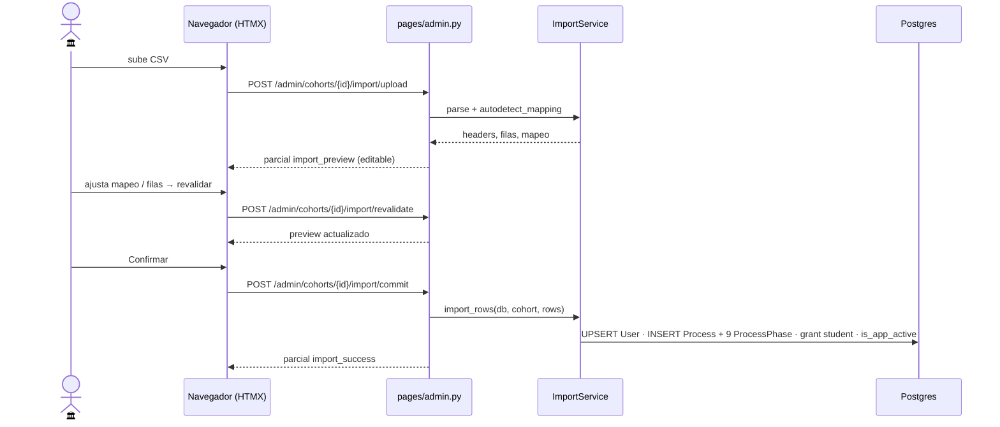

# Servicios Escolares importa alumnos por CSV (Fase 0)

> **Objetivo:** dar de alta a los alumnos de una convocatoria a partir del CSV del Forms:
> crear `User` (si falta) + `TitulationProcess` + sus 9 fases + activar rol `student`.

| | |
|---|---|
| **Actor(es)** | 🏛️ Servicios Escolares |
| **Permiso(s)** | `cohort.api.create` · `cohort.api.import_csv` |
| **Trigger** | "Importar alumnos" en una convocatoria |
| **Precondiciones** | Existe un `Cohort` (período académico) |
| **Estado final** | N procesos creados en fase 1 `in_progress`, alumnos con rol `student` y `is_app_active` |

## Ruta en la app (UI)

1. Sidebar → **Convocatorias** (`/titulatec/admin/cohorts`). Crear convocatoria (elige período).
2. Fila de la convocatoria → **Importar alumnos** (`/titulatec/admin/cohorts/{id}/import`).
3. Dropzone CSV → **preview editable** (auto-mapeo de columnas, validación por fila) →
   ajustar mapeo / corregir filas → **Confirmar** importación.

## Secuencia

## Pasos detallados

| # | Actor | UI / dónde | Acción | Endpoint | Service · método | Efecto en BD | Notas |
|---|---|---|---|---|---|---|---|
| 0 | 🏛️ | `/admin/cohorts` | crear convocatoria | `POST /admin/cohorts` | (inline) | `Cohort(status=open)` | período no reutilizado |
| 1 | 🏛️ | import | subir CSV | `POST /admin/cohorts/{id}/import/upload` | `ImportService.parse` + `autodetect_mapping` | — (CSV temporal por token) | heurística de encabezados sin acentos |
| 2 | 🏛️ | preview | revalidar | `POST /admin/cohorts/{id}/import/revalidate` | `ImportService.build_preview` | — | match fuzzy carrera→`core_programs`, modalidad→`titulatec_modalities` |
| 3 | 🏛️ | preview | confirmar | `POST /admin/cohorts/{id}/import/commit` | `ImportService.import_rows` | UPSERT `core_users` (merge por `control_number`, crea con `must_change_password`); `titulatec_processes` + 9 `titulatec_process_phases`; grant rol `student`; `is_app_active=true`; persiste mapeo a JSON; notif `PROCESS_CREATED` por alumno | filas con error se omiten salvo override |

## Estado resultante

- `TitulationProcess` por alumno (`current_phase` inicial, fase 1 `in_progress`).
- Alumno puede entrar y ver su [flujo de documentos](phase1_student_upload_initial_docs.md).
- Cada alumno nuevo recibe una notificación `PROCESS_CREATED` (tab **Avisos** del shell, link a
  la fase 1). Ver [integración del alumno en el shell](xcut_student_shell_embed.md#notificaciones-regla-general-de-toda-app).

## Caminos alternos / errores ❗

- Fila con problema (carrera no mapeable, etc.) = `warning`/`error`; se corrige con los
  inputs editables (override por fila) o se desmarca para no importarla.
- Merge por `control_number`: si el `User` ya existe, no se duplica.

## Flujos relacionados

- ⤵ Siguiente: [el alumno sube documentos iniciales](phase1_student_upload_initial_docs.md).
