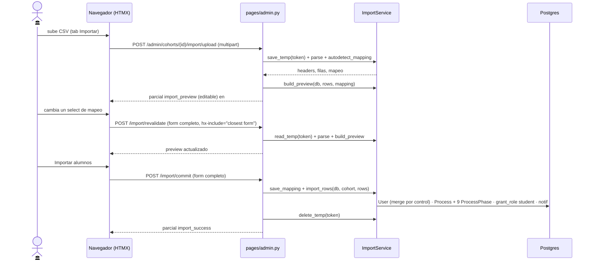

# Servicios Escolares importa alumnos por CSV (Fase 0)

> **Objetivo:** dar de alta a los alumnos de una convocatoria a partir del CSV del Forms:
> crear `User` (si falta) + `TitulationProcess` + sus 9 fases + activar rol `student`.

| | |
|---|---|
| **Actor(es)** | 🏛️ Servicios Escolares (`titulatec_school_services` / `_head`) |
| **Permiso(s)** | Ver convocatorias: cualquiera de `cohort.page.list` · `cohort.api.import_csv` · `dashboard.admin` · `dashboard.school_services` (`_COHORT_PERMS`, `pages/admin.py:17-21`) · Crear convocatoria: `cohort.api.create` (`admin.py:364`) · Subir/revalidar/confirmar: `cohort.api.import_csv` (`admin.py:457,481,507`) |
| **Trigger** | Pestaña **Importar** del detalle de una convocatoria (`?tab=importar`) |
| **Precondiciones** | Existe un `Cohort` (uno por período académico) |
| **Sub-flujos** | ⤵ alternativa fila por fila: [alta manual de un alumno](phase0_school_services_add_student_manual.md) |
| **Estado final** | N procesos con `current_phase=1`, fase 0 `approved` y fase 1 `in_progress`; alumnos con rol `student` en la app |

## Ruta en la app (UI)

1. Sidebar → **Convocatorias** (`/titulatec/admin/cohorts`). Entrada del menú gated por
   `titulatec.cohort.page.list` (`pages/nav.py:99`). El botón **Nueva convocatoria** solo aparece si
   queda algún período académico sin convocatoria (`admin/cohorts.html:8-12`, `admin.py:342-347`).
2. La fila de la tabla ya **no** ofrece "Importar alumnos": tanto el nombre como el botón
   **Detalles** llevan al detalle de la convocatoria (`admin/cohorts.html:55,60`).
3. Detalle → pestaña **Importar** (`/titulatec/admin/cohorts/{id}?tab=importar`,
   `admin/cohort_detail.html:21,33`). El wizard va embebido en el tab
   (`partials/cohort_import.html`), que hace morph de `#cohort-pane`.
4. Dropzone CSV → **preview editable** (mapeo auto-detectado + validación por fila) → ajustar mapeo /
   corregir filas / desmarcar → **Importar alumnos**.

> La página standalone del asistente (`GET /admin/cohorts/{id}/import` → `admin/import.html`,
> `admin.py:433-449`) sigue existiendo pero **ningún template la enlaza**: solo se llega escribiendo
> la URL. Los tres endpoints del wizard (`upload` / `revalidate` / `commit`) son los mismos para
> ambas entradas.

## Secuencia

```mermaid
sequenceDiagram
    actor S as 🏛️
    participant FE as Navegador (HTMX)
    participant API as pages/admin.py
    participant IS as ImportService
    participant DB as Postgres
    S->>FE: sube CSV (tab Importar)
    FE->>API: POST /admin/cohorts/{id}/import/upload (multipart)
    API->>IS: save_temp(token) + parse + autodetect_mapping
    IS-->>API: headers, filas, mapeo
    API->>IS: build_preview(db, rows, mapping)
    API-->>FE: parcial import_preview (editable) en #import-body
    S->>FE: cambia un select de mapeo
    FE->>API: POST /import/revalidate (form completo, hx-include="closest form")
    API->>IS: read_temp(token) + parse + build_preview
    API-->>FE: preview actualizado
    S->>FE: Importar alumnos
    FE->>API: POST /import/commit (form completo)
    API->>IS: save_mapping + import_rows(db, cohort, rows)
    IS->>DB: User (merge por control) · Process + 9 ProcessPhase · grant_role student · notif
    API->>IS: delete_temp(token)
    API-->>FE: parcial import_success
```

## Pasos detallados

| # | Actor | UI / dónde | Acción | Endpoint | Service · método | Efecto en BD | Notas |
|---|---|---|---|---|---|---|---|
| 0 | 🏛️ | `/admin/cohorts` | crear convocatoria | `POST /admin/cohorts` | (inline, `admin.py:360-382`) | `Cohort(status="open", created_by_id)` | no duplica período: `filter_by(period_id)` previo |
| 1 | 🏛️ | detalle → tab **Importar** | abrir wizard | `GET /admin/cohorts/{id}?tab=importar` | — | — | `tab` se sanea contra `("resumen","dias","alumnos","importar")` (`admin.py:391`) |
| 2 | 🏛️ | dropzone | subir CSV | `POST /admin/cohorts/{id}/import/upload` | `ImportService.save_temp` · `parse` · `autodetect_mapping` · `build_preview` | — (CSV temporal `instance/apps/titulatec/_imports/{token}.csv`) | token = `secrets.token_hex(8)` (`admin.py:464`); delimitador `,`/`;` por conteo en los primeros 2 KB (`import_service.py:118-119`); mapeo por keywords sin acentos, con prioridad al mapeo guardado (`import_service.py:126-144`) |
| 3 | 🏛️ | selects de mapeo | revalidar | `POST /admin/cohorts/{id}/import/revalidate` | `ImportService.read_temp` · `parse` · `build_preview` | — | dispara en `change` de cualquier `map_*` (`import_preview.html:30-32`); token inválido/expirado → `409` (`admin.py:490-491`) |
| 4 | 🏛️ | tabla editable | corregir fila / desmarcar | (ninguno; el estado vive en el `<form>`) | — | — | 6 inputs por fila: `row-{i}-include|control_number|full_name|email|program_id|modality_id` |
| 5 | 🏛️ | botón **Importar alumnos** | confirmar | `POST /admin/cohorts/{id}/import/commit` | `ImportService.save_mapping` + `import_rows` | ver "Estado resultante" | reconstruye filas desde el form (`admin.py:517-529`); borra el CSV temporal (`admin.py:541-542`) |

### Auto-detección del mapeo (`ImportService.autodetect_mapping`, `import_service.py:126`)

Campos destino: `control_number`, `full_name`, `email`, `career`, `modality` (`TARGET_FIELDS`,
`import_service.py:20`). Para cada uno: (1) si `_imports/_mapping.json` guarda un encabezado que
existe en este CSV, se reusa; (2) si no, primer encabezado cuyo texto normalizado
(minúsculas, sin acentos, sin puntuación) contenga alguna keyword de `_FIELD_KEYWORDS`
(`import_service.py:23-29`); (3) si nada matchea, queda vacío y el admin lo elige a mano.
El mapeo se persiste **solo al confirmar** y es **global**, no por convocatoria
(`admin.py:537` → `_imports/_mapping.json`).

### Match de catálogos (fuzzy)

- **Carrera** → `core_programs`: exacto sobre el nombre normalizado y, si falla, `contains` en
  cualquiera de las dos direcciones (`import_service._match_program:148-162`).
- **Modalidad** → `titulatec_modalities` activas: exacto sobre `code` o `name` normalizados y, si
  falla, `contains` en el nombre o coincidencia de un token del `code`
  (`import_service._match_modality:164-177`).

### Validación por fila (`build_preview`, `import_service.py:181`)

| Condición | Severidad |
|---|---|
| sin número de control | `error` |
| control que no cumple `^(\d{8}\|[A-Za-z]\d{7,9})$` (`CONTROL_NUMBER_RE:45`) | `error` |
| sin nombre | `error` |
| correo que no termina en `@cdjuarez.tecnm.mx` | `warning` |
| sin correo | `warning` |
| carrera presente que no matchea ningún `Program` | `warning` |
| modalidad presente que no matchea ninguna `Modality` | `warning` |

`status` = `error` si hay algún `error`, `warning` si hay alguno, `ok` si no hay ninguno. El checkbox
`row-{i}-include` viene **marcado salvo en las filas `error`** (`import_preview.html:57-58`), y los
contadores del encabezado (`total` / `importable` / `warnings` / `errors`) salen de
`_preview_ctx` (`admin.py:419-430`).

## Estado resultante

Por cada fila incluida (`ImportService.import_rows`, `import_service.py:240-327`):

- `core_users`: merge por `control_number`. Si existe, solo rellena `email` cuando estaba vacío
  (`:278-279`). Si no existe, crea `User(username=control, control_number=control, first_name/last_name`
  por split del último token`, role_id=student, is_active=True, must_change_password=True)` (`:285-291`).
- Rol de app: `grant_role(db, user.id, "titulatec", "student")` (`:296`).
- `titulatec_processes`: uno por (alumno, cohort) si no existía, con
  `folio = TT-{period_code}-{seq:04d}`, `current_phase=1`, `status="active"`, `is_app_active=True`
  (`:298-306`).
- `titulatec_process_phases`: 9 filas, `phase_number` 0..8 — la 0 `approved` (intake), la 1
  `in_progress`, 2..8 `pending` (`:310-312`).
- Notificación `PROCESS_CREATED` al alumno, con link a la fase 1
  (`:315-319` → `services/notify.notify_student`). Se ve en el tab **Avisos** del shell; ver
  [integración del alumno en el shell](xcut_student_shell_embed.md#notificaciones-regla-general-de-toda-app).
- El alumno ya puede entrar a su [flujo de documentos iniciales](phase1_student_upload_initial_docs.md).

El parcial `import_success.html` reporta `processes_created`, `created_users`, `matched_users` y
`skipped`, con accesos directos a `?tab=alumnos` y `?tab=importar`.

## Caminos alternos / errores ❗

- Fila con `error` → llega **desmarcada**; el admin puede corregir los inputs y marcarla. Si aun así
  el control queda vacío o fuera del regex, `import_rows` la descarta y suma a `skipped`
  (`import_service.py:262-273`).
- Alumno ya existente con proceso en esa convocatoria → cuenta como `matched_users`, **no** se crea
  proceso ni fases ni notificación (`import_service.py:298-299`).
- Token del CSV temporal ausente o expirado en `revalidate` → `409` sin cuerpo (`admin.py:490-491`);
  el wizard hay que reiniciarlo subiendo el archivo otra vez.
- Convocatoria inexistente en `commit` → `404` (`admin.py:534-535`).
- El token vuelve desde el formulario, así que se valida contra `^[0-9a-f]{16}$` antes de usarse como
  componente de ruta (`import_service.py:62-69`): un token con `../` leía y borraba cualquier `*.csv`
  del contenedor.

## Limitaciones conocidas

1. **Techo de ~165 filas por importación.** `commit` y `revalidate` leen el form completo con
   `await request.form()` sin argumentos (`admin.py:487`, `admin.py:514`), y ambos botones/selects
   mandan `hx-include="closest form"` (`import_preview.html:32,92`), es decir **todo** el preview.
   Con 6 inputs por fila más `token` y los 5 `map_*`, el conteo supera el `max_fields=1000` por
   defecto de Starlette (1.6.0) a partir de la fila 166, y `FormParser` lanza
   `MultiPartException("Too many fields…")` (`starlette/formparsers.py:96-97`) → 500. Afecta por igual
   al commit y a cada cambio de mapeo.
2. **`import_rows` no es atómico.** `grant_role` hace `db.commit()` dentro del bucle
   (`core/services/authz_service.py:81`) sobre la misma sesión, así que cada iteración persiste lo
   pendiente de las anteriores. Si una fila revienta a medio lote, lo ya escrito queda commiteado y no
   hay rollback del conjunto. Se agrava con el folio: `seq` arranca de un `count()` de los procesos del
   cohort (`import_service.py:256`) contra `folio` con `unique=True` global
   (`models/process.py:15`), sin lock ni reintento — dos importaciones concurrentes sobre la misma
   convocatoria calculan la misma secuencia y la segunda falla por integridad a media pasada.
3. **Carrera no reconocida = `warning`, no `error`.** La fila entra con `program_id=None`
   (`import_service.py:211-212,229`) y el proceso queda invisible para cualquier usuario con alcance
   por carrera, porque todos los filtros usan `program_id.in_(scope)` y `NULL` nunca matchea:
   bandeja/kanban (`admin.py:657`), documentos (`documents.py:59`) y citas
   (`appointments.py:140-145,199-202,277-283`). Peor: si la columna de carrera viene **vacía** no se
   genera ni el warning (la condición es `if career_raw and not program`), así que el preview la marca
   `ok`. Ver [alcance por carrera](engine_officer_scope.md).
4. **El usuario creado no puede iniciar sesión.** `import_rows` crea el `User` sin `password_hash`
   (`import_service.py:285-291`) y `auth_service` rechaza el login cuando ese campo es nulo
   (`core/services/auth_service.py:25,46`). El alta manual sí lo resuelve: `_add_student` pone
   `password_hash = hash_nip(control)` para los usuarios nuevos (`admin.py:133-138`). Los alumnos
   importados por CSV dependen de que ya existieran en `core_users` con contraseña.
5. **CSV temporales huérfanos.** `delete_temp` solo corre tras un commit exitoso
   (`admin.py:541-542`); si el admin abandona el wizard, el archivo se queda en
   `instance/apps/titulatec/_imports/` sin caducidad ni limpieza.

## Flujos relacionados

- ⤵ Siguiente: [el alumno sube documentos iniciales](phase1_student_upload_initial_docs.md).
- ↔ Alternativa: [alta manual de un alumno](phase0_school_services_add_student_manual.md) (tab **Alumnos**).
- ← [Alcance por carrera + encargados](engine_officer_scope.md) — explica por qué `program_id` importa.
