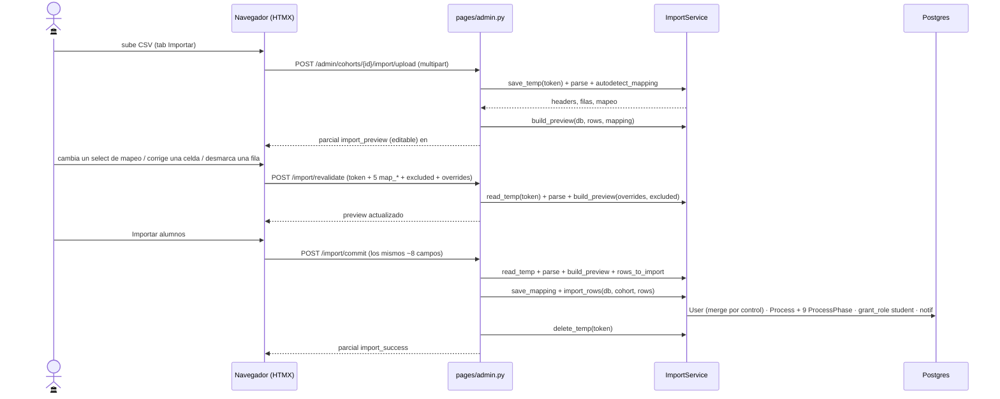

# Servicios Escolares importa alumnos por CSV (Fase 0)

> **Objetivo:** dar de alta a los alumnos de una convocatoria a partir del CSV del Forms:
> crear `User` (si falta) + `TitulationProcess` + sus 9 fases + activar rol `student`.

| | |
|---|---|
| **Actor(es)** | 🏛️ Servicios Escolares (`titulatec_school_services` / `_head`) |
| **Permiso(s)** | Ver convocatorias: cualquiera de `cohort.page.list` · `cohort.api.import_csv` · `dashboard.admin` · `dashboard.school_services` (`_COHORT_PERMS`, `pages/admin.py:17-21`) · Crear convocatoria: `cohort.api.create` (`admin.py:364`) · Subir/revalidar/confirmar: `cohort.api.import_csv` (`admin.py:457,481,507`) |
| **Trigger** | Pestaña **Importar** del detalle de una convocatoria (`?tab=importar`) |
| **Precondiciones** | Existe un `Cohort` (uno por período académico) |
| **Sub-flujos** | ⤵ alternativa fila por fila: [alta manual de un alumno](phase0_school_services_add_student_manual.md) |
| **Estado final** | N procesos con `current_phase=1`, fase 0 `approved` y fase 1 `in_progress`; alumnos con rol `student` en la app |

## Ruta en la app (UI)

1. Sidebar → **Convocatorias** (`/titulatec/admin/cohorts`). Entrada del menú gated por
   `titulatec.cohort.page.list` (`pages/nav.py:99`). El botón **Nueva convocatoria** solo aparece si
   queda algún período académico sin convocatoria (`admin/cohorts.html:8-12`, `admin.py:342-347`).
2. La fila de la tabla ya **no** ofrece "Importar alumnos": tanto el nombre como el botón
   **Detalles** llevan al detalle de la convocatoria (`admin/cohorts.html:55,60`).
3. Detalle → pestaña **Importar** (`/titulatec/admin/cohorts/{id}?tab=importar`,
   `admin/cohort_detail.html:21,33`). El wizard va embebido en el tab
   (`partials/cohort_import.html`), que hace morph de `#cohort-pane`.
4. Dropzone CSV → **preview editable** (mapeo auto-detectado + validación por fila) → ajustar mapeo /
   corregir filas / desmarcar → **Importar alumnos**. El preview **no** se reenvía: el servidor
   relee el CSV temporal (ver "El payload del wizard es O(1) en filas").

> La página standalone del asistente (`GET /admin/cohorts/{id}/import` → `admin/import.html`,
> `admin.py:433-449`) sigue existiendo pero **ningún template la enlaza**: solo se llega escribiendo
> la URL. Los tres endpoints del wizard (`upload` / `revalidate` / `commit`) son los mismos para
> ambas entradas.

## Secuencia

```mermaid
sequenceDiagram
    actor S as 🏛️
    participant FE as Navegador (HTMX)
    participant API as pages/admin.py
    participant IS as ImportService
    participant DB as Postgres
    S->>FE: sube CSV (tab Importar)
    FE->>API: POST /admin/cohorts/{id}/import/upload (multipart)
    API->>IS: save_temp(token) + parse + autodetect_mapping
    IS-->>API: headers, filas, mapeo
    API->>IS: build_preview(db, rows, mapping)
    API-->>FE: parcial import_preview (editable) en #import-body
    S->>FE: cambia un select de mapeo / corrige una celda / desmarca una fila
    FE->>API: POST /import/revalidate (token + 5 map_* + excluded + overrides)
    API->>IS: read_temp(token) + parse + build_preview(overrides, excluded)
    API-->>FE: preview actualizado
    S->>FE: Importar alumnos
    FE->>API: POST /import/commit (los mismos ~8 campos)
    API->>IS: read_temp + parse + build_preview + rows_to_import
    API->>IS: save_mapping + import_rows(db, cohort, rows)
    IS->>DB: User (merge por control) · Process + 9 ProcessPhase · grant_role student · notif
    API->>IS: delete_temp(token)
    API-->>FE: parcial import_success
```

## Pasos detallados

| # | Actor | UI / dónde | Acción | Endpoint | Service · método | Efecto en BD | Notas |
|---|---|---|---|---|---|---|---|
| 0 | 🏛️ | `/admin/cohorts` | crear convocatoria | `POST /admin/cohorts` | (inline, `admin.py:360-382`) | `Cohort(status="open", created_by_id)` | no duplica período: `filter_by(period_id)` previo |
| 1 | 🏛️ | detalle → tab **Importar** | abrir wizard | `GET /admin/cohorts/{id}?tab=importar` | — | — | `tab` se sanea contra `("resumen","dias","alumnos","importar")` (`admin.py:391`) |
| 2 | 🏛️ | dropzone | subir CSV | `POST /admin/cohorts/{id}/import/upload` | `ImportService.save_temp` · `parse` · `autodetect_mapping` · `build_preview` | — (CSV temporal `instance/apps/titulatec/_imports/{token}.csv`) | token = `secrets.token_hex(8)` (`admin.py:464`); delimitador `,`/`;` por conteo en los primeros 2 KB (`import_service.py:118-119`); mapeo por keywords sin acentos, con prioridad al mapeo guardado (`import_service.py:126-144`) |
| 3 | 🏛️ | selects de mapeo | revalidar | `POST /admin/cohorts/{id}/import/revalidate` | `ImportService.read_temp` · `parse` · `build_preview(overrides, excluded)` | — | dispara en `change` de cualquier `map_*`; token inválido/expirado → `409` (`admin.py:527-529`) |
| 4 | 🏛️ | tabla editable | corregir celda / desmarcar fila | (ninguno; `static/js/admin/import.js` escribe los 2 ocultos) | — | — | la tabla está **fuera** del `<form>` y sus inputs **no tienen `name`**: no viajan |
| 5 | 🏛️ | botón **Importar alumnos** | confirmar | `POST /admin/cohorts/{id}/import/commit` | `read_temp` · `parse` · `build_preview` · `rows_to_import` · `save_mapping` · `import_rows` | ver "Estado resultante" | relee el CSV del token (`admin.py:558-578`); borra el CSV temporal (`admin.py:582-583`) |

### El payload del wizard es O(1) en filas

`revalidate` y `commit` reciben **siempre los mismos ~8 campos**, dé el CSV 5 filas o 5000:

| Campo | Quién lo escribe | Para qué |
|---|---|---|
| `token` | servidor (oculto) | identifica el CSV temporal en disco; se revalida contra `^[0-9a-f]{16}$` |
| `map_{control_number,full_name,email,career,modality}` | los 5 selects de mapeo | reaplica el mapeo al releer el CSV |
| `excluded` | `import.js` (oculto) | índices desmarcados, `"3,17,42"` |
| `overrides` | `import.js` (oculto) | JSON `{"<idx>": {campo: valor}}` **solo** con las celdas que difieren del CSV |

Las filas se **releen del archivo** (`read_temp` → `parse` → `build_preview`), nunca del formulario.
`build_preview` aplica los `overrides` **antes** de validar —corregir un número de control quita el
`error` de la fila— y `excluded` decide el `include` de cada fila; sin ese campo se aplica el default
de la primera carga (entra todo salvo los `error`), que es también el valor que el servidor imprime
en el oculto, así que el wizard sigue siendo correcto aunque el JS no llegue a correr.

Cada input de la tabla lleva `data-tt-initial` = el valor que salió del CSV con el mapeo vigente.
`import.js` manda como override solo lo que difiere de ese valor, así que cambiar un select de mapeo
**no** borra lo que el admin ya corrigió y el ciclo editar → revalidar → editar es estable.

### Auto-detección del mapeo (`ImportService.autodetect_mapping`, `import_service.py:126`)

Campos destino: `control_number`, `full_name`, `email`, `career`, `modality` (`TARGET_FIELDS`,
`import_service.py:20`). Para cada uno: (1) si `_imports/_mapping.json` guarda un encabezado que
existe en este CSV, se reusa; (2) si no, primer encabezado cuyo texto normalizado
(minúsculas, sin acentos, sin puntuación) contenga alguna keyword de `_FIELD_KEYWORDS`
(`import_service.py:23-29`); (3) si nada matchea, queda vacío y el admin lo elige a mano.
El mapeo se persiste **solo al confirmar** y es **global**, no por convocatoria
(`admin.py:537` → `_imports/_mapping.json`).

### Match de catálogos (fuzzy)

- **Carrera** → `core_programs`: exacto sobre el nombre normalizado y, si falla, `contains` en
  cualquiera de las dos direcciones (`import_service._match_program:227`).
- **Modalidad** → `titulatec_modalities` activas: exacto sobre `code` o `name` normalizados y, si
  falla, `contains` en el nombre o coincidencia de un token del `code`
  (`import_service._match_modality:249`).
- Ambos catálogos se leen **una vez por preview** y el match se memoiza por texto crudo: se releían
  por fila, y con el rediseño el preview se reconstruye entero en cada revalidación.

### Validación por fila (`build_preview`, `import_service.py:266`)

| Condición | Severidad |
|---|---|
| sin número de control | `error` |
| control que no cumple `^(\d{8}\|[A-Za-z]\d{7,9})$` (`CONTROL_NUMBER_RE:45`) | `error` |
| sin nombre | `error` |
| correo que no termina en `@cdjuarez.tecnm.mx` | `warning` |
| sin correo | `warning` |
| carrera presente que no matchea ningún `Program` | `warning` |
| modalidad presente que no matchea ninguna `Modality` | `warning` |

`status` = `error` si hay algún `error`, `warning` si hay alguno, `ok` si no hay ninguno. En la
primera carga el checkbox viene **marcado salvo en las filas `error`**; después manda lo que traiga
`excluded`. Los contadores del encabezado (`total` / `importable` / `warnings` / `errors`) y los dos
ocultos salen de `_preview_ctx` (`admin.py:419-436`).

## Estado resultante

Por cada fila incluida (`ImportService.import_rows`, `import_service.py:394-528`):

- `core_users`: merge por `control_number`. Si existe, solo rellena `email` cuando estaba vacío.
  Si no existe, crea `User(username=control, control_number=control, first_name/last_name` por split
  del último token`, role_id=student, is_active=True, must_change_password=True)`.
- **Credencial inicial**: `set_initial_credential()` (`import_service.py:35-49`) le pone
  `password_hash = hash_nip(control_number)` y `must_change_password = True` — la misma política del
  [alta manual](phase0_school_services_add_student_manual.md). Al usuario que ya existía **no** se le
  toca la contraseña, salvo que la tenga en `NULL`: ese caso se **repara** (contador `repaired_users`),
  porque NULL no es una contraseña sino una cuenta que no puede entrar.
- Rol de app: `UserAppRole(user, titulatec, student)` insertado con `flush()` (`:494-502`) — no con
  `authz_service.grant_role`, que commitearía dentro del bucle; el caché de authz se invalida tras el
  commit final (`:521-522`).
- `titulatec_processes`: uno por (alumno, cohort) si no existía, con
  `folio = TT-{period_code}-{seq:04d}` continuando desde el último folio emitido de la convocatoria
  y bajo `pg_advisory_xact_lock`, `current_phase=1`, `status="active"`, `is_app_active=True`
  (`:433-442`, `:504-513`).
- `titulatec_process_phases`: 9 filas, `phase_number` 0..8 — la 0 `approved` (intake), la 1
  `in_progress`, 2..8 `pending` (`:310-312`).
- Notificación `PROCESS_CREATED` al alumno, con link a la fase 1 — `/student/fase/1`, que
  **redirige (302)** al [acordeón del dashboard](xcut_student_phase_detail.md) abierto en esa fase
  (`:315-319` → `services/notify.notify_student`). Se ve en el tab **Avisos** del shell; ver
  [integración del alumno en el shell](xcut_student_shell_embed.md#notificaciones-regla-general-de-toda-app).
- El alumno ya puede entrar a su [flujo de documentos iniciales](phase1_student_upload_initial_docs.md).

El parcial `import_success.html` reporta `processes_created`, `created_users`, `matched_users` y
`skipped`, con accesos directos a `?tab=alumnos` y `?tab=importar`. El summary trae además
`repaired_users`, que **el parcial todavía no muestra**.

## Caminos alternos / errores ❗

- Fila con `error` → llega **desmarcada**; el admin puede corregir los inputs y marcarla. Si aun así
  el control queda vacío o fuera del regex, `import_rows` la descarta y suma a `skipped`
  (`import_service.py:262-273`).
- Alumno ya existente con proceso en esa convocatoria → cuenta como `matched_users`, **no** se crea
  proceso ni fases ni notificación (`import_service.py:298-299`).
- Token del CSV temporal ausente o expirado en `revalidate` → `409` sin cuerpo (`admin.py:490-491`);
  el wizard hay que reiniciarlo subiendo el archivo otra vez.
- Convocatoria inexistente en `commit` → `404` (`admin.py:534-535`).
- El token vuelve desde el formulario, así que se valida contra `^[0-9a-f]{16}$` antes de usarse como
  componente de ruta (`import_service.py:62-69`): un token con `../` leía y borraba cualquier `*.csv`
  del contenedor.

## Limitaciones conocidas

1. ~~**Techo de ~165 filas por importación.**~~ **Corregido el 2026-09-01.** El preview emitía 6
   inputs con `name` por fila y `commit`/`revalidate` mandaban `hx-include="closest form"`, así que
   `await request.form()` recibía `6·N+6` campos y el `FormParser` de Starlette (1.6.0) corta en
   `max_fields=1000` (`starlette/formparsers.py:96-97`): medido, 165 filas pasaban y 166 respondía
   400. Una convocatoria real son cientos de alumnos, y el mismo techo impedía hasta **remapear** un
   CSV grande. Hoy la tabla vive fuera del `<form>` y sin `name`, y el payload es constante (ver
   "El payload del wizard es O(1) en filas"). Cubierto por
   `tests/fastapi/titulatec/test_import_scale.py` (400 filas, commit + revalidate).
2. ~~**`import_rows` no es atómico.**~~ **Corregido el 2026-09-01.** `grant_role` hacía `db.commit()`
   dentro del bucle (`core/services/authz_service.py:81`) sobre la misma sesión: cada vuelta
   persistía lo pendiente de las anteriores y un lote que reventaba a media pasada quedaba medio
   escrito. Ahora el rol de app se inserta en `import_rows` con `flush()` (mismo efecto, sin commit)
   y hay **un solo `commit()`**, al final; el caché de authz se invalida después. El folio, además,
   ya no sale de un `count()` sino del **último emitido** en la convocatoria, bajo
   `pg_advisory_xact_lock(ns, cohort_id)` (`import_service.py:433-442`) — de transacción, lo único
   compatible con PgBouncer en modo transaction, así que dos importaciones simultáneas de la misma
   convocatoria se serializan en vez de colisionar contra `folio UNIQUE`.
3. **Carrera no reconocida = `warning`, no `error`.** La fila entra con `program_id=None`
   (`import_service.py:211-212,229`) y el proceso queda invisible para cualquier usuario con alcance
   por carrera, porque todos los filtros usan `program_id.in_(scope)` y `NULL` nunca matchea:
   bandeja/kanban (`admin.py:657`), documentos (`documents.py:59`) y citas
   (`appointments.py:307-308`, una sola resolucion de alcance para las cinco consultas de la vista). Peor: si la columna de carrera viene **vacía** no se
   genera ni el warning (la condición es `if career_raw and not program`), así que el preview la marca
   `ok`. Ver [alcance por carrera](engine_officer_scope.md).
4. ~~**El usuario creado no puede iniciar sesión.**~~ **Corregido el 2026-09-01.** `import_rows`
   creaba el `User` sin `password_hash`; `auth_service` rechaza el login con ese campo nulo
   (`core/services/auth_service.py:25,46`) y el reset del core está **prohibido** para quien tiene
   `control_number` (`core/api/users_admin.py:427`): era un callejón sin salida, no una molestia.
   Hoy la credencial se asigna en el mismo INSERT (`set_initial_credential`). Los alumnos que
   quedaron rotos se reparan al re-importarlos, o de una vez con
   `python -m itcj2.cli.main titulatec fix-missing-credentials [--dry-run] [--cohort-id N]`.
   **La credencial inicial es el número de control**, que también es el `username`: es un dato
   público, así que la cuenta es adivinable hasta el primer cambio de contraseña
   (`must_change_password = True` lo fuerza).
5. **CSV temporales huérfanos.** `delete_temp` solo corre tras un commit exitoso
   (`admin.py:582-583`); si el admin abandona el wizard, el archivo se queda en
   `instance/apps/titulatec/_imports/` sin caducidad ni limpieza.

## Flujos relacionados

- ⤵ Siguiente: [el alumno sube documentos iniciales](phase1_student_upload_initial_docs.md).
- ↔ Alternativa: [alta manual de un alumno](phase0_school_services_add_student_manual.md) (tab **Alumnos**).
- ← [Alcance por carrera + encargados](engine_officer_scope.md) — explica por qué `program_id` importa.
