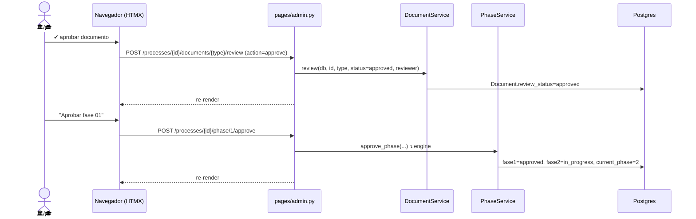

# Revisión admin de documentos iniciales (Fase 1)

> **Objetivo:** revisar los documentos del alumno, aprobar/rechazar cada uno y, si todo
> está bien, aprobar la fase 1 (que avanza a fase 2).

| | |
|---|---|
| **Actor(es)** | 🏛️ Servicios Escolares (revisa docs) · 🎓 Titulaciones (también puede) |
| **Permiso(s)** | `document.api.approve` · `...reject` · `process.api.approve_phase` |
| **Trigger** | La fase 1 quedó `in_review` ([flujo del alumno](phase1_student_upload_initial_docs.md)) |
| **Precondiciones** | Proceso `active`, fase 1 `in_review`, 3 docs subidos |
| **Sub-flujos** | ⤵ [motor de avance de fase](engine_approve_advance_phase.md) |
| **Estado final** | Docs `approved`; fase 1 `approved`; fase 2 `in_progress` |

## Ruta en la app (UI)

1. Sidebar admin → **Procesos** (`/titulatec/admin/processes`) → abrir el proceso.
2. Card **"Documentos iniciales (fase 01)"**: por cada doc, botones ✔ aprobar / ✕ rechazar.
3. Card **"Fase actual · 01"** → **"Aprobar fase 01"** (cuando los docs estén OK).

## Secuencia

## Pasos detallados

| # | Actor | UI / dónde | Acción | Endpoint | Service · método | Efecto en BD | Eventos |
|---|---|---|---|---|---|---|---|
| 1 | 🏛️ | card docs | aprobar doc | `POST /processes/{id}/documents/{type}/review` `action=approve` | `DocumentService.review` | `Document.review_status=approved`, `reviewed_by_id` | — |
| 1b| 🏛️ | card docs | rechazar doc | idem `action=reject` (form `note`) | `DocumentService.review` | `review_status=rejected`, `review_note` | notif `DOCUMENT_REJECTED` al alumno |
| 2 | 🏛️/🎓 | card fase | aprobar fase 1 | `POST /processes/{id}/phase/1/approve` | `PhaseService.approve_phase` ⤵ | fase1=`approved`, fase2=`in_progress`, `current_phase=2` | `phase_approved` |

> Todas las acciones re-renderizan el parcial `partials/admin_process_detail.html` dentro
> de `#process-detail` (HTMX `hx-target`).

## Estado resultante

- Documentos en `approved` (o `rejected` con nota → el alumno re-sube).
- Fase 1 `approved`, fase 2 `in_progress`, `current_phase=2`.
- El proceso aparece en **"Por agendar"** de [Citas de cotejo](phase2_appointment_loop.md).

## Notificaciones al alumno

Rechazar un documento dispara `DOCUMENT_REJECTED` (link a la fase 1); aprobar la fase 1
dispara `PHASE_APPROVED` (vía el motor). Llegan al tab **Avisos** del shell. Ver
[integración del alumno en el shell](xcut_student_shell_embed.md#notificaciones-regla-general-de-toda-app).

## Caminos alternos / errores ❗

- Rechazar un doc no bloquea por sí solo; el criterio de aprobar la fase es del admin.
- Rechazar la fase (input motivo + "Rechazar fase") → fase 1 `rejected`, el alumno corrige.

## Flujos relacionados

- ← Previo: [el alumno sube docs](phase1_student_upload_initial_docs.md).
- ⤵ Motor: [aprobar/avanzar fase](engine_approve_advance_phase.md).
- → Siguiente: [cita de cotejo](phase2_appointment_loop.md).
