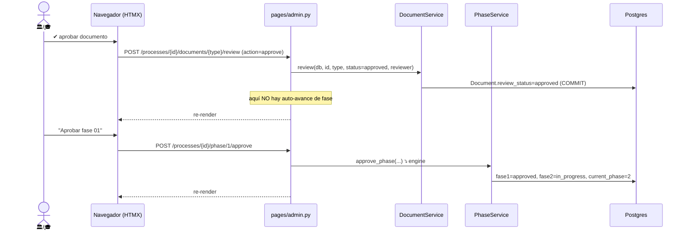

# Revisión admin de documentos iniciales (Fase 1)

> **Objetivo:** revisar los documentos del alumno, aprobar/rechazar cada uno y, si todo
> está bien, aprobar la fase 1 (que avanza a fase 2).

| | |
|---|---|
| **Actor(es)** | 🏛️ Servicios Escolares (revisa docs) · 🎓 Titulaciones (también puede) |
| **Permiso(s)** | ver el detalle: cualquiera de `_PROCESS_VIEW_PERMS` (`pages/admin.py:23-27`) · dictaminar doc: `document.api.approve` / `...reject` (`pages/admin.py:763-764`) · fase: `process.api.approve_phase` / `...reject_phase` (`pages/admin.py:812,837`) |
| **Trigger** | La fase 1 quedó `in_review` ([flujo del alumno](phase1_student_upload_initial_docs.md)) |
| **Precondiciones** | Proceso `active` **y** que `n` sea `current_phase`: desde 2026-09 lo valida el motor (`PhaseService.assert_can_transition`), no solo el render del botón (`partials/admin_process_detail.html:105`). Que la fase 1 esté `in_review` y los 3 docs subidos sigue siendo expectativa del proceso, **no** una validación del código |
| **Sub-flujos** | ⤵ [motor de avance de fase](engine_approve_advance_phase.md) |
| **Estado final** | Docs `approved`; fase 1 `approved`; fase 2 `in_progress` |

## Ruta en la app (UI)

1. Sidebar admin → **Procesos** (`/titulatec/admin/processes`) → abrir el proceso.
2. Card **"Documentos iniciales (fase 01)"**: por cada doc, botones ✔ aprobar / ✕ rechazar
   (`partials/admin_process_detail.html:50-72`).
3. Card **"Fase actual · NN"** → **"Aprobar fase NN"** (`partials/admin_process_detail.html:104-118`).

> **Cuál de los dos disparadores describe cada documento.** La fase 1 tiene **dos** caminos de
> avance y este documento describe **solo el B (manual)**: el detalle del proceso, donde aprobar los
> documentos NO avanza nada y hace falta pulsar además "Aprobar fase 01"
> (`pages/admin.py:758-779` vs `pages/admin.py:807-830`).
> El camino **A (auto-avance)** es la pestaña **Documentos** (`/titulatec/admin/documents`), donde
> aprobar el 3.er documento avanza la fase por sí solo (`pages/documents.py:135-137`) — ese está en
> [revisión de documentos iniciales (pestaña Documentos)](phase1_school_services_review_docs.md),
> que además documenta la **asimetría** entre ambos como defecto conocido. Los dos dictámenes de
> documento piden exactamente los mismos permisos, así que la misma persona ve los dos caminos.

## Secuencia

```mermaid
sequenceDiagram
    actor A as 🏛️/🎓
    participant FE as Navegador (HTMX)
    participant API as pages/admin.py
    participant DS as DocumentService
    participant PS as PhaseService
    participant DB as Postgres
    A->>FE: ✔ aprobar documento
    FE->>API: POST /processes/{id}/documents/{type}/review (action=approve)
    API->>DS: review(db, id, type, status=approved, reviewer)
    DS->>DB: Document.review_status=approved (COMMIT)
    Note over API: aquí NO hay auto-avance de fase
    API-->>FE: re-render #process-detail
    A->>FE: "Aprobar fase 01"
    FE->>API: POST /processes/{id}/phase/1/approve
    API->>PS: approve_phase(...)  ⤵ engine
    PS->>DB: fase1=approved, fase2=in_progress, current_phase=2
    API-->>FE: re-render #process-detail
```

## Pasos detallados

| # | Actor | UI / dónde | Acción | Endpoint | Service · método | Efecto en BD | Eventos |
|---|---|---|---|---|---|---|---|
| 1 | 🏛️ | card docs | aprobar doc | `POST /processes/{id}/documents/{type}/review` `action=approve` | `DocumentService.review` (`services/document_service.py:118-138`) | `Document.review_status=approved`, `review_note=None`, `reviewed_by_id` | — |
| 1b| 🏛️ | card docs | rechazar doc | idem `action=reject` (`note` opcional aquí) | `DocumentService.review` | `review_status=rejected`, `review_note` | notif `DOCUMENT_REJECTED` al alumno (`services/document_service.py:127-135`) |
| 2 | 🏛️/🎓 | card fase | aprobar fase N | `POST /processes/{id}/phase/{n}/approve` (`pages/admin.py:807`) | `PhaseService.approve_phase` ⤵ | fase N=`approved`, siguiente=`in_progress`, `current_phase`↑ | `phase_approved` |
| 2b| 🏛️/🎓 | card fase | rechazar fase N | `POST /processes/{id}/phase/{n}/reject` (form `reason`) | `PhaseService.reject_phase` | fase N=`rejected`, `rejection_reason`, `current_phase=n` | `phase_rejected` |

> Todas las acciones re-renderizan el parcial `partials/admin_process_detail.html` dentro
> de `#process-detail` (HTMX `hx-target`, vía `_render_detail_body` en `pages/admin.py:754-755`).

## Estado resultante

- Documentos en `approved` (o `rejected` con nota → el alumno re-sube y vuelven a `pending`,
  `services/document_service.py:95-96`).
- Fase 1 `approved`, fase 2 `in_progress`, `current_phase=2`.
- El proceso aparece en **"Por agendar"** de [Citas de cotejo](phase2_appointment_loop.md).

## Notificaciones al alumno

Rechazar un documento dispara `DOCUMENT_REJECTED` (link a la fase 1); aprobar la fase 1
dispara `PHASE_APPROVED` (vía el motor). Llegan al tab **Avisos** del shell. Ver
[integración del alumno en el shell](xcut_student_shell_embed.md#notificaciones-regla-general-de-toda-app).

## Caminos alternos / errores ❗

- Aprobar documentos aquí **no** avanza la fase: `doc_review` solo dictamina y re-renderiza
  (`pages/admin.py:766-779`). Si esperas el auto-avance, estás en la pantalla equivocada
  ([pestaña Documentos](phase1_school_services_review_docs.md)).
- Rechazar un doc no bloquea por sí solo el botón de fase; el criterio de aprobar la fase es del
  admin. El botón "Aprobar fase NN" solo se esconde si el proceso no está `active`
  (`partials/admin_process_detail.html:105`). Desde 2026-09 el endpoint **sí** valida que `n` sea la
  fase en curso de un proceso `active` (`PhaseService.assert_can_transition`, →
  [motor de avance](engine_approve_advance_phase.md#guarda-de-transición-desde-2026-09)); lo que
  **sigue sin validar** es el dictamen de los documentos, así que aprobar la fase 1 con documentos
  `pending`/`rejected` deja el proceso en fase 2 con documentos sin aprobar.
- Rechazar un doc desde aquí **no exige motivo** (`pages/admin.py:772` pasa `note` tal cual, sin
  validar): la notificación sale con el texto genérico. En la pestaña Documentos el motivo sí es
  obligatorio (`pages/documents.py:125-126`).
- Rechazar la fase (input motivo + "Rechazar fase") → fase 1 `rejected` con `rejection_reason`, el
  alumno corrige; `reject_phase` fija `current_phase = n` (`services/phase_service.py:200-218`), y `n` solo puede ser la fase en curso.
- El detalle y las dos rutas de dictamen **sí** están acotados por carrera: `process_detail`
  (`pages/admin.py:737`), `doc_review` (`:761`) y `fb_review` (`:787`) arrancan con
  `assert_process_in_scope`, que responde **404** si el proceso no cae en el alcance del usuario
  (mismo predicado que filtra la bandeja/kanban). Ver [alcance por carrera](engine_officer_scope.md).

## Flujos relacionados

- ← Previo: [el alumno sube docs](phase1_student_upload_initial_docs.md).
- ↔ El otro disparador (auto-avance): [pestaña Documentos](phase1_school_services_review_docs.md).
- ⤵ Motor: [aprobar/avanzar fase](engine_approve_advance_phase.md).
- → Siguiente: [cita de cotejo](phase2_appointment_loop.md).
