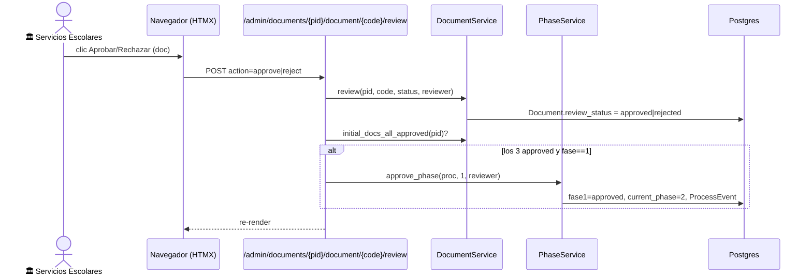

# Revisión de documentos iniciales (pestaña Documentos)

> **Objetivo:** Servicios Escolares aprueba/rechaza los 3 documentos iniciales desde una bandeja
> dedicada; al aprobar los 3, el proceso avanza solo a fase 2 y el alumno queda **elegible para
> agendar cotejo**.

| | |
|---|---|
| **Actor(es)** | 🏛️ Servicios Escolares (`titulatec_school_services` / `_head`) · 🎓 Titulaciones |
| **Permiso(s)** | `titulatec.document.page.list` (ver bandeja) · `titulatec.document.api.approve` / `.reject` (dictamen) |
| **Trigger** | El alumno subió documentos (fase 1); aparecen en la pestaña **Documentos**. |
| **Precondiciones** | Proceso `active`, fase 1, con al menos un documento subido. |
| **Sub-flujos** | ⤵ al 3.º aprobado invoca el [motor de avance de fase](engine_approve_advance_phase.md). |
| **Estado final** | 3 docs `approved` → fase 1 `approved`, `current_phase=2` → elegible para [cita de cotejo](phase2_appointment_loop.md). |

## Ruta en la app (UI)

1. `/titulatec/admin/documents` (pestaña **Documentos** del menú admin, gated por `document.page.list`).
2. Bandeja master-detail acotada por carrera (`officer_programs`): izquierda lista de procesos con
   contador "X por evaluar" + estado por doc; derecha visor + dictamen por documento.
3. Filtros: Todos / Por evaluar / Con rechazo / Completos. Encabezado: "N por evaluar" (total del scope).

## Secuencia

## Pasos detallados

| # | Actor | UI / dónde | Acción | Endpoint | Service · método | Efecto en BD |
|---|---|---|---|---|---|---|
| 1 | 🏛️ | `/admin/documents` | Selecciona proceso | `GET …/documents/body?selected=` | `_body_ctx` (scoped) | (lectura) |
| 2 | 🏛️ | panel derecho | Aprueba/rechaza doc | `POST …/{pid}/document/{code}/review` | `DocumentService.review` | `Document.review_status` |
| 3 | 🤖 | — | Auto-avance si 3 aprobadas | (mismo POST) | `DocumentService.initial_docs_all_approved` + `PhaseService.approve_phase` | fase1→approved, `current_phase=2`, `ProcessEvent` |

## Estado resultante

- 3 `Document.review_status = approved` → `initial_docs_all_approved == True`.
- Fase 1 `approved`, `current_phase = 2`.
- El proceso entra a "Por agendar" de [cita de cotejo](phase2_appointment_loop.md)
  (`AppointmentService.list_pending_processes` exige las 3 aprobadas).

## Caminos alternos / errores ❗

- Rechazar un doc → `review_status=rejected`; el proceso NO avanza; sigue en "Por evaluar"/"Con rechazo".
- Aprobar solo 2 de 3 → no avanza (idempotente: el avance solo dispara con los 3 y fase==1).
- La aprobación de fase 1 ya no es un botón manual aparte: la dispara el 3.º documento aprobado.

## Flujos relacionados

- ← Previo: [el alumno sube documentos](phase1_student_upload_initial_docs.md).
- ⤵ Motor: [aprobar/avanzar fase](engine_approve_advance_phase.md).
- → Siguiente: [cita de cotejo](phase2_appointment_loop.md) (requiere los 3 aprobados).
