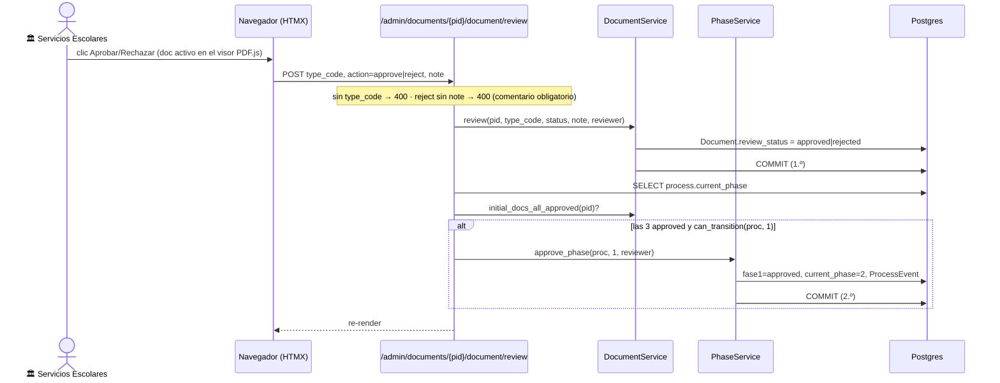

# Revisión de documentos iniciales (pestaña Documentos)

> **Objetivo:** Servicios Escolares aprueba/rechaza los 3 documentos iniciales desde una bandeja
> dedicada; al aprobar los 3, el proceso avanza solo a fase 2 y el alumno queda **elegible para
> agendar cotejo**.

| | |
|---|---|
| **Actor(es)** | 🏛️ Servicios Escolares (`titulatec_school_services` / `_head`) · 🎓 Titulaciones |
| **Permiso(s)** | ver: cualquiera de `titulatec.document.page.list`, `...dashboard.school_services`, `...dashboard.titulaciones`, `...dashboard.admin` (`_VIEW_PERMS`, `pages/documents.py:14-15`) · dictaminar: `titulatec.document.api.approve` **o** `...reject` (`_REVIEW_PERMS`, `pages/documents.py:16`) · ver el archivo: `titulatec.document.api.read.all` (`pages/documents.py:193`) |
| **Trigger** | El alumno subió documentos (fase 1); aparecen en la pestaña **Documentos**. |
| **Precondiciones** | Proceso `status='active'` con **al menos un archivo subido** (`pages/documents.py:91,105`). El auto-avance además exige que la fase 1 sea la transición legal del proceso: `PhaseService.can_transition(db, proc, 1)` (`pages/documents.py:182`), o sea proceso `active` **y** `current_phase == 1`. |
| **Sub-flujos** | ⤵ al 3.º aprobado invoca el [motor de avance de fase](engine_approve_advance_phase.md). |
| **Estado final** | 3 docs `approved` → fase 1 `approved`, `current_phase=2` → elegible para [cita de cotejo](phase2_appointment_loop.md). |

## Ruta en la app (UI)

1. `/titulatec/admin/documents` (pestaña **Documentos** del menú admin; la entrada del menú solo
   aparece con `titulatec.document.page.list` — `pages/nav.py:98` — mientras que la página acepta
   además los tres `dashboard.*` de `_VIEW_PERMS`).
2. Bandeja master-detail acotada por carrera (`officer_programs`, `pages/documents.py:90`): izquierda
   lista de procesos con pill de pendientes (o ✓ si los 3 están aprobados); derecha visor + dictamen
   del documento activo. El dictamen (`:151`) y el servido del archivo (`:191`) arrancan con
   `assert_process_in_scope` → **404** fuera del alcance, así que el dictamen y su auto-avance de
   fase no pueden tocar un proceso de otra carrera. Ver [alcance por carrera](engine_officer_scope.md).
3. Filtros: Todos / Por evaluar / Con rechazo / Completos (`partials/documents_body.html:8`).
   Encabezado "N por evaluar" = suma de pendientes de las **filas ya filtradas**, no del scope
   completo (`pages/documents.py:106-112`).

## Secuencia

```mermaid
sequenceDiagram
    actor SE as 🏛️ Servicios Escolares
    participant FE as Navegador (HTMX)
    participant API as /admin/documents/{pid}/document/review
    participant DS as DocumentService
    participant PS as PhaseService
    participant DB as Postgres
    SE->>FE: clic Aprobar/Rechazar (doc activo en el visor PDF.js)
    FE->>API: POST type_code, action=approve|reject, note
    Note over API: sin type_code → 400 · reject sin note → 400 (comentario obligatorio)
    API->>DS: review(pid, type_code, status, note, reviewer)
    DS->>DB: Document.review_status = approved|rejected
    DS->>DB: COMMIT (1.º)
    API->>DB: SELECT process.current_phase
    API->>DS: initial_docs_all_approved(pid)?
    alt las 3 approved y can_transition(proc, 1)
        API->>PS: approve_phase(proc, 1, reviewer)
        PS->>DB: fase1=approved, current_phase=2, ProcessEvent
        PS->>DB: COMMIT (2.º)
    end
    API-->>FE: re-render #docs-body
```

## Pasos detallados

| # | Actor | UI / dónde | Acción | Endpoint | Service · método | Efecto en BD |
|---|---|---|---|---|---|---|
| 1 | 🏛️ | `/admin/documents` | Selecciona proceso | `GET …/documents/body?selected=` | `_body_ctx` (scoped, `pages/documents.py:87-115`) | (lectura) |
| 2 | 🏛️ | panel derecho (doc activo) | Aprueba/rechaza doc | `POST …/{pid}/document/review` (`type_code`+`note` en form; reject exige `note`) | `DocumentService.review` (`services/document_service.py:166-187`) | `Document.review_status`, `review_note`, `reviewed_by_id` · commit en `:186` |
| 2b | 🏛️ | visor | Ve PDF (PDF.js→canvas) / lo expande al modal `#tt-doc-modal` | `GET …/{pid}/document/{code}` (`?download=1` descarga) | `DocumentService.get_document` | (lectura) |
| 3 | 🤖 | — | Auto-avance si las 3 aprobadas | (mismo POST) | `DocumentService.initial_docs_all_approved` + `PhaseService.can_transition` + `...approve_phase` (`pages/documents.py:181-183`) | fase1→`approved`, `current_phase=2`, `ProcessEvent` · commit en `services/phase_service.py:283` |

### De dónde sale el visor (ojo con los parciales muertos)

El markup del visor y el `<script>` que lo controla están **inline** en
`partials/documents_body.html:47-298`; el modal grande (`#tt-doc-modal`, con su propio dictamen que
delega en los botones HTMX del panel inline) está **inline** en el `` de
`admin/documents.html:31-61`.

Existen copias en `partials/documents/_doc_viewer.html` y `partials/documents/_doc_modal.html`, pero:

- `_doc_modal.html` **no lo incluye ningún template** (grep sobre `itcj2/`: solo aparece en su propia
  cabecera y citado en un comentario de `_doc_viewer.html:11`).
- `_doc_viewer.html` solo se incluye desde `partials/processes/_process_phase_panel.html:34`, y ese
  panel tampoco lo incluye ningún template.
- `static/js/partials/doc-viewer.js` dice ser cargado por `base_admin`, pero
  `admin/base_admin.html` no carga ningún `<script src=…>` (`:59-102`).

O sea: la bandeja **no** usa esos parciales. Si tocas el visor, edita `documents_body.html`.

## Lo que cuesta pintar la bandeja (arreglado 2026-09-02)

`_body_ctx` resuelve las filas en **5 consultas fijas**, no en 4 por fila.

Hasta el 2026-09-02 `_doc_row` recibía la sesión y, por cada proceso, hacía `db.get(User)`,
`db.get(Program)` y —dentro de un segundo bucle sobre los 3 tipos de documento— un `DocumentType`
por código más un `DocumentService.get_document`. Medido contra la BD de dev con el caché de authz
ya caliente: **273 consultas para 28 filas** (jefa) y **148 para 14** (encargado).

| Actor | Consultas antes | Consultas después | Tiempo de servidor antes | Después |
|---|---|---|---|---|
| gbarron (jefa, 34 procesos → 28 filas) | 273 | **5** | 112.5 ms | **3.8 ms** (29.8×) |
| fleon (encargado, 17 procesos → 14 filas) | 148 | **8** | 63.8 ms | **5.4 ms** (11.8×) |

(Mediana de 7 corridas en el mismo proceso y la misma sesión, con `expire_all()` entre medición y
medición. Medido de punta a punta desde el navegador, la petición de cambiar de filtro pasó de
~160 ms a ~53 ms.)

Las 5 son: procesos, `DocumentType IN (3)`, `Document IN (procesos) AND type_code IN (3)`,
`User IN (…)`, `Program IN (…)` (`pages/documents.py:19-57`). Las 3 extra del encargado son la
resolución del alcance por carrera, que este cambio no toca.

De paso, el `ORDER BY` gana un desempate por `id` (`pages/documents.py:103-104`).
`created_at` es `server_default NOW()` y en Postgres `NOW()` es la hora de **inicio de la
transacción**: varios procesos creados en la misma —una importación, por ejemplo— empatan, y
sin desempate el orden lo decidía el planificador, o sea la lista podía re-barajarse sola entre
un filtro y el siguiente. Con los 34 `created_at` distintos de hoy no cambia nada (el diff byte
a byte se repitió con el desempate puesto).

El lote es **equivalente** al bucle, no una aproximación: `DocumentType.code` es `UNIQUE` y
`Document` tiene `UNIQUE(process_id, type_code)`, así que el `.first()` por fila no podía devolver
más de un candidato. Comprobado además byte a byte: los 7 parciales de `/admin/documents/body`
(4 filtros × jefa, dos `?selected=`, y la vista del encargado) salen **idénticos** antes y después.

Lo fija `tests/fastapi/titulatec/test_documents_inbox.py`, que exige que la cuenta de consultas
**no dependa del número de filas** (2 filas y 8 filas ⇒ la misma cuenta) y que cubre los casos que
la BD de dev no tiene: proceso con 1 de 3 documentos (pseudo-estado `missing` en una fila visible),
proceso sin carrera, y documentos de procesos vecinos que no se cruzan.

## El indicador de carga de la bandeja

`#docs-skel` es un **overlay** (`tt-ind-host` + `tt-ind--overlay`, `admin/documents.html:11-20`),
no un bloque en flujo. Dos reglas, las dos del design system
([`docs/design/ui_motion.md`](../design/ui_motion.md)):

- **No aparece si la petición baja de `--tt-ind-delay` (300 ms)**, que es el caso normal: cambiar de
  filtro tarda ~160 ms. Antes se veía 150–192 ms — aparecer y desaparecer, justo lo que el usuario
  pidió quitar.
- **Cuando aparece no empuja nada.** Antes reservaba 24 px y toda la bandeja bajaba de golpe
  (CLS 0.024). Medido después con 900 ms de latencia artificial: aparece a +341 ms, **0 px de salto,
  CLS 0**.

Ojo con el markup de esta vista en concreto: la barra de filtros vive **dentro** de
`partials/documents_body.html`, o sea dentro de la región que se reemplaza, así que el velo también
la cubre. Es correcto (esos filtros pertenecen al estado viejo) pero es distinto de Citas, donde el
segmento queda fuera del host.

## Los DOS disparadores del avance de fase 1 ❗

La fase 1 puede avanzar por dos caminos distintos, y **hoy no son simétricos**:

| | A · pestaña Documentos | B · detalle del proceso |
|---|---|---|
| Dónde | `/titulatec/admin/documents` | `/titulatec/admin/processes/{id}` |
| Botones | Aprobar/Rechazar del dictamen (`partials/documents_body.html:103-112`) | ✔/✕ por documento (`partials/admin_process_detail.html:62-67`) y **"Aprobar fase NN"** (`partials/admin_process_detail.html:114-116`) |
| Endpoint de dictamen | `POST /admin/documents/{pid}/document/review` (`pages/documents.py:107`) | `POST /admin/processes/{pid}/documents/{type}/review` (`pages/admin.py:810`) |
| Permisos del dictamen | `document.api.approve` / `.reject` (`pages/documents.py:16`) | `document.api.approve` / `.reject` (`pages/admin.py:815-816`) — **los mismos** |
| ¿Auto-avanza al 3.º aprobado? | **Sí** (`pages/documents.py:181-183`) | **No**: `doc_review` solo llama `DocumentService.review` y re-renderiza (`pages/admin.py:818-833`) |
| Avance de fase | implícito | explícito: `POST …/phase/{n}/approve` → `titulatec.process.api.approve_phase` (`pages/admin.py:863-885`) |

**DEFECTO CONOCIDO (asimetría).** Dos endpoints con **el mismo par de permisos** producen efectos
distintos sobre la misma transición:

- `pages/documents.py:181-183` avanza la fase 1 solo por haber aprobado el último documento.
- `pages/admin.py:822-833` no avanza nada; hay que pulsar además "Aprobar fase 01".

Los tres roles operativos (`titulatec_school_services`, `..._head`, `titulatec_titulaciones`) tienen
a la vez `document.api.approve/reject` y `process.api.approve_phase`
(`database/DML/titulatec/03_insert_role_permissions.sql:38-39,55-56,74-76`), así que la misma persona
ve los dos caminos y obtiene resultados distintos según por dónde entre.

Agravantes verificados del botón manual:

- Su **único** guard de render es `process.status == 'active'`
  (`partials/admin_process_detail.html:105`); no mira el estado de la fase ni si los documentos están
  aprobados.
- El endpoint valida la **transición** pero no el **dictamen**: desde 2026-09 `phase_approve` exige
  que `n` sea la fase en curso de un proceso `active` (`PhaseService.assert_can_transition`, →
  [motor de avance](engine_approve_advance_phase.md#guarda-de-transición-desde-2026-09)), y responde
  `400` + `X-Tt-Error` si no. Lo que no mira es el estado de los documentos.
- Consecuencia: se puede aprobar la fase 1 con documentos `pending` o `rejected` y dejar el proceso en
  fase 2 con documentos sin aprobar. La bandeja lo seguiría mostrando como "Por evaluar" mientras
  `AppointmentService.list_pending_processes` sigue exigiendo las 3 aprobadas.

**El auto-avance no es atómico.** Son dos transacciones separadas con una lectura en medio:
`DocumentService.review` hace `db.commit()` (`services/document_service.py:186`); después
`pages/documents.py:181` relee `process.current_phase` y `PhaseService.approve_phase` hace su propio
`db.commit()` (`services/phase_service.py:283`). Si el segundo commit falla —o dos revisores aprueban
el último documento a la vez— el documento queda `approved` y la fase no avanza: hay que empujarla
con el botón manual. No hay bloqueo de fila; la idempotencia la da `can_transition` (la segunda pasada ya no encuentra el proceso en la fase 1).

## Estado resultante

- 3 `Document.review_status = approved` → `initial_docs_all_approved == True`
  (`services/document_service.py:10-17`).
- Fase 1 `approved`, `current_phase = 2`, `ProcessEvent(phase_approved)` y notificación
  `PHASE_APPROVED` al alumno (`services/phase_service.py:245,267-270,278-281`).
- El proceso entra a "Por agendar" de [cita de cotejo](phase2_appointment_loop.md)
  (`AppointmentService.list_pending_processes` exige las 3 aprobadas).

## Caminos alternos / errores ❗

- POST sin `type_code` → `400` + header `X-Tt-Error` (`pages/documents.py:163-164`).
- Rechazar sin comentario → `400` + `X-Tt-Error` (`pages/documents.py:169-170`). El endpoint gemelo
  del detalle de proceso **no** exige nota (`pages/admin.py:826`): rechaza con `note=None` y la
  notificación `DOCUMENT_REJECTED` sale con el texto genérico de `services/document_service.py:183`.
- Rechazar un doc → `review_status=rejected`; el proceso NO avanza; sigue en "Por evaluar" / "Con
  rechazo". Cuando el alumno re-sube, `DocumentService.save` lo devuelve a `pending`
  (`services/document_service.py:144-145`).
- Aprobar solo 2 de 3 → no avanza (el avance solo dispara con las 3 y `current_phase == 1`).
- Aprobar las 3 cuando la fase 1 ya no es la actual → no avanza; queda para el botón manual.
- La bandeja **no** exige que el alumno haya enviado la fase a revisión: `_body_ctx` filtra por
  `status='active'` y por tener archivos, no por `ProcessPhase.status` (`pages/documents.py:91-105`).
  Se puede aprobar y avanzar una fase 1 que sigue en `in_progress` porque el alumno nunca pulsó
  "Enviar a revisión" (`pages/student.py:530-557`).
- El alcance por carrera cubre **las dos capas**: el listado se filtra con `officer_programs`
  (`pages/documents.py:90`) y el POST de dictamen arranca con `assert_process_in_scope`
  (`pages/documents.py:175`), que responde **404** —no 403— porque el id es secuencial y
  enumerable. Antes de cerrarlo, con el `process_id` en la URL un encargado fuera de su alcance
  podía dictaminar y, peor, empujar de fase un proceso ajeno.
  Ver [alcance por carrera](engine_officer_scope.md).

## Flujos relacionados

- ← Previo: [el alumno sube documentos](phase1_student_upload_initial_docs.md).
- ↔ El mismo dictamen desde el detalle del proceso (sin auto-avance):
  [revisión admin de documentos iniciales](phase1_admin_review_initial_docs.md).
- ⤵ Motor: [aprobar/avanzar fase](engine_approve_advance_phase.md).
- → Siguiente: [cita de cotejo](phase2_appointment_loop.md) (requiere los 3 aprobados).
