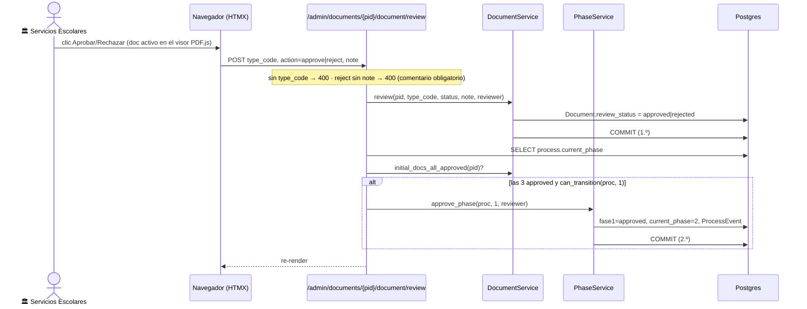

# Revisión de documentos iniciales (pestaña Documentos)

> **Objetivo:** Servicios Escolares aprueba/rechaza los 3 documentos iniciales desde una bandeja
> dedicada; al aprobar los 3, el proceso avanza solo a fase 2 y el alumno queda **elegible para
> agendar cotejo**.

| | |
|---|---|
| **Actor(es)** | 🏛️ Servicios Escolares (`titulatec_school_services` / `_head`) · 🎓 Titulaciones |
| **Permiso(s)** | ver: cualquiera de `titulatec.document.page.list`, `...dashboard.school_services`, `...dashboard.titulaciones`, `...dashboard.admin` (`_VIEW_PERMS`, `pages/documents.py:14-15`) · dictaminar: `titulatec.document.api.approve` **o** `...reject` (`_REVIEW_PERMS`, `pages/documents.py:16`) · ver el archivo: `titulatec.document.api.read.all` (`pages/documents.py:144`) |
| **Trigger** | El alumno subió documentos (fase 1); aparecen en la pestaña **Documentos**. |
| **Precondiciones** | Proceso `status='active'` con **al menos un archivo subido** (`pages/documents.py:54,61`). El auto-avance además exige que la fase 1 sea la transición legal del proceso: `PhaseService.can_transition(db, proc, 1)` (`pages/documents.py:136`), o sea proceso `active` **y** `current_phase == 1`. |
| **Sub-flujos** | ⤵ al 3.º aprobado invoca el [motor de avance de fase](engine_approve_advance_phase.md). |
| **Estado final** | 3 docs `approved` → fase 1 `approved`, `current_phase=2` → elegible para [cita de cotejo](phase2_appointment_loop.md). |

## Ruta en la app (UI)

1. `/titulatec/admin/documents` (pestaña **Documentos** del menú admin; la entrada del menú solo
   aparece con `titulatec.document.page.list` — `pages/nav.py:98` — mientras que la página acepta
   además los tres `dashboard.*` de `_VIEW_PERMS`).
2. Bandeja master-detail acotada por carrera (`officer_programs`, `pages/documents.py:53`): izquierda
   lista de procesos con pill de pendientes (o ✓ si los 3 están aprobados); derecha visor + dictamen
   del documento activo. El dictamen (`:107`) y el servido del archivo (`:147`) arrancan con
   `assert_process_in_scope` → **404** fuera del alcance, así que el dictamen y su auto-avance de
   fase no pueden tocar un proceso de otra carrera. Ver [alcance por carrera](engine_officer_scope.md).
3. Filtros: Todos / Por evaluar / Con rechazo / Completos (`partials/documents_body.html:8`).
   Encabezado "N por evaluar" = suma de pendientes de las **filas ya filtradas**, no del scope
   completo (`pages/documents.py:62-68`).

## Secuencia

```mermaid
sequenceDiagram
    actor SE as 🏛️ Servicios Escolares
    participant FE as Navegador (HTMX)
    participant API as /admin/documents/{pid}/document/review
    participant DS as DocumentService
    participant PS as PhaseService
    participant DB as Postgres
    SE->>FE: clic Aprobar/Rechazar (doc activo en el visor PDF.js)
    FE->>API: POST type_code, action=approve|reject, note
    Note over API: sin type_code → 400 · reject sin note → 400 (comentario obligatorio)
    API->>DS: review(pid, type_code, status, note, reviewer)
    DS->>DB: Document.review_status = approved|rejected
    DS->>DB: COMMIT (1.º)
    API->>DB: SELECT process.current_phase
    API->>DS: initial_docs_all_approved(pid)?
    alt las 3 approved y can_transition(proc, 1)
        API->>PS: approve_phase(proc, 1, reviewer)
        PS->>DB: fase1=approved, current_phase=2, ProcessEvent
        PS->>DB: COMMIT (2.º)
    end
    API-->>FE: re-render #docs-body
```

## Pasos detallados

| # | Actor | UI / dónde | Acción | Endpoint | Service · método | Efecto en BD |
|---|---|---|---|---|---|---|
| 1 | 🏛️ | `/admin/documents` | Selecciona proceso | `GET …/documents/body?selected=` | `_body_ctx` (scoped, `pages/documents.py:50-71`) | (lectura) |
| 2 | 🏛️ | panel derecho (doc activo) | Aprueba/rechaza doc | `POST …/{pid}/document/review` (`type_code`+`note` en form; reject exige `note`) | `DocumentService.review` (`services/document_service.py:118-138`) | `Document.review_status`, `review_note`, `reviewed_by_id` · commit en `:137` |
| 2b | 🏛️ | visor | Ve PDF (PDF.js→canvas) / lo expande al modal `#tt-doc-modal` | `GET …/{pid}/document/{code}` (`?download=1` descarga) | `DocumentService.get_document` | (lectura) |
| 3 | 🤖 | — | Auto-avance si las 3 aprobadas | (mismo POST) | `DocumentService.initial_docs_all_approved` + `PhaseService.can_transition` + `...approve_phase` (`pages/documents.py:135-137`) | fase1→`approved`, `current_phase=2`, `ProcessEvent` · commit en `services/phase_service.py:196` |

### De dónde sale el visor (ojo con los parciales muertos)

El markup del visor y el `<script>` que lo controla están **inline** en
`partials/documents_body.html:47-298`; el modal grande (`#tt-doc-modal`, con su propio dictamen que
delega en los botones HTMX del panel inline) está **inline** en el `` de
`admin/documents.html:18-47`.

Existen copias en `partials/documents/_doc_viewer.html` y `partials/documents/_doc_modal.html`, pero:

- `_doc_modal.html` **no lo incluye ningún template** (grep sobre `itcj2/`: solo aparece en su propia
  cabecera y citado en un comentario de `_doc_viewer.html:11`).
- `_doc_viewer.html` solo se incluye desde `partials/processes/_process_phase_panel.html:34`, y ese
  panel tampoco lo incluye ningún template.
- `static/js/partials/doc-viewer.js` dice ser cargado por `base_admin`, pero
  `admin/base_admin.html` no carga ningún `<script src=…>` (`:59-102`).

O sea: la bandeja **no** usa esos parciales. Si tocas el visor, edita `documents_body.html`.

## Los DOS disparadores del avance de fase 1 ❗

La fase 1 puede avanzar por dos caminos distintos, y **hoy no son simétricos**:

| | A · pestaña Documentos | B · detalle del proceso |
|---|---|---|
| Dónde | `/titulatec/admin/documents` | `/titulatec/admin/processes/{id}` |
| Botones | Aprobar/Rechazar del dictamen (`partials/documents_body.html:103-112`) | ✔/✕ por documento (`partials/admin_process_detail.html:62-67`) y **"Aprobar fase NN"** (`partials/admin_process_detail.html:114-116`) |
| Endpoint de dictamen | `POST /admin/documents/{pid}/document/review` (`pages/documents.py:107`) | `POST /admin/processes/{pid}/documents/{type}/review` (`pages/admin.py:758`) |
| Permisos del dictamen | `document.api.approve` / `.reject` (`pages/documents.py:16`) | `document.api.approve` / `.reject` (`pages/admin.py:763-764`) — **los mismos** |
| ¿Auto-avanza al 3.º aprobado? | **Sí** (`pages/documents.py:135-137`) | **No**: `doc_review` solo llama `DocumentService.review` y re-renderiza (`pages/admin.py:766-779`) |
| Avance de fase | implícito | explícito: `POST …/phase/{n}/approve` → `titulatec.process.api.approve_phase` (`pages/admin.py:807-830`) |

**DEFECTO CONOCIDO (asimetría).** Dos endpoints con **el mismo par de permisos** producen efectos
distintos sobre la misma transición:

- `pages/documents.py:135-137` avanza la fase 1 solo por haber aprobado el último documento.
- `pages/admin.py:770-777` no avanza nada; hay que pulsar además "Aprobar fase 01".

Los tres roles operativos (`titulatec_school_services`, `..._head`, `titulatec_titulaciones`) tienen
a la vez `document.api.approve/reject` y `process.api.approve_phase`
(`database/DML/titulatec/03_insert_role_permissions.sql:38-39,55-56,74-76`), así que la misma persona
ve los dos caminos y obtiene resultados distintos según por dónde entre.

Agravantes verificados del botón manual:

- Su **único** guard de render es `process.status == 'active'`
  (`partials/admin_process_detail.html:105`); no mira el estado de la fase ni si los documentos están
  aprobados.
- El endpoint valida la **transición** pero no el **dictamen**: desde 2026-09 `phase_approve` exige
  que `n` sea la fase en curso de un proceso `active` (`PhaseService.assert_can_transition`, →
  [motor de avance](engine_approve_advance_phase.md#guarda-de-transición-desde-2026-09)), y responde
  `400` + `X-Tt-Error` si no. Lo que no mira es el estado de los documentos.
- Consecuencia: se puede aprobar la fase 1 con documentos `pending` o `rejected` y dejar el proceso en
  fase 2 con documentos sin aprobar. La bandeja lo seguiría mostrando como "Por evaluar" mientras
  `AppointmentService.list_pending_processes` sigue exigiendo las 3 aprobadas.

**El auto-avance no es atómico.** Son dos transacciones separadas con una lectura en medio:
`DocumentService.review` hace `db.commit()` (`services/document_service.py:137`); después
`pages/documents.py:135` relee `process.current_phase` y `PhaseService.approve_phase` hace su propio
`db.commit()` (`services/phase_service.py:196`). Si el segundo commit falla —o dos revisores aprueban
el último documento a la vez— el documento queda `approved` y la fase no avanza: hay que empujarla
con el botón manual. No hay bloqueo de fila; la idempotencia la da `can_transition` (la segunda pasada ya no encuentra el proceso en la fase 1).

## Estado resultante

- 3 `Document.review_status = approved` → `initial_docs_all_approved == True`
  (`services/document_service.py:11-17`).
- Fase 1 `approved`, `current_phase = 2`, `ProcessEvent(phase_approved)` y notificación
  `PHASE_APPROVED` al alumno (`services/phase_service.py:97,106-109`).
- El proceso entra a "Por agendar" de [cita de cotejo](phase2_appointment_loop.md)
  (`AppointmentService.list_pending_processes` exige las 3 aprobadas).

## Caminos alternos / errores ❗

- POST sin `type_code` → `400` + header `X-Tt-Error` (`pages/documents.py:119-120`).
- Rechazar sin comentario → `400` + `X-Tt-Error` (`pages/documents.py:125-126`). El endpoint gemelo
  del detalle de proceso **no** exige nota (`pages/admin.py:772`): rechaza con `note=None` y la
  notificación `DOCUMENT_REJECTED` sale con el texto genérico de `services/document_service.py:134`.
- Rechazar un doc → `review_status=rejected`; el proceso NO avanza; sigue en "Por evaluar" / "Con
  rechazo". Cuando el alumno re-sube, `DocumentService.save` lo devuelve a `pending`
  (`services/document_service.py:95-96`).
- Aprobar solo 2 de 3 → no avanza (el avance solo dispara con las 3 y `current_phase == 1`).
- Aprobar las 3 cuando la fase 1 ya no es la actual → no avanza; queda para el botón manual.
- La bandeja **no** exige que el alumno haya enviado la fase a revisión: `_body_ctx` filtra por
  `status='active'` y por tener archivos, no por `ProcessPhase.status` (`pages/documents.py:54-61`).
  Se puede aprobar y avanzar una fase 1 que sigue en `in_progress` porque el alumno nunca pulsó
  "Enviar a revisión" (`pages/student.py:530-557`).
- El alcance por carrera solo filtra el **listado**: el POST de dictamen no llama `officer_programs`
  (`pages/documents.py:107-139`). Con el `process_id` en la URL, un encargado fuera de su alcance
  puede dictaminar; el re-render posterior sí le devolvería `detail=None` (`pages/documents.py:69`).
  Ver [alcance por carrera](engine_officer_scope.md).

## Flujos relacionados

- ← Previo: [el alumno sube documentos](phase1_student_upload_initial_docs.md).
- ↔ El mismo dictamen desde el detalle del proceso (sin auto-avance):
  [revisión admin de documentos iniciales](phase1_admin_review_initial_docs.md).
- ⤵ Motor: [aprobar/avanzar fase](engine_approve_advance_phase.md).
- → Siguiente: [cita de cotejo](phase2_appointment_loop.md) (requiere los 3 aprobados).
