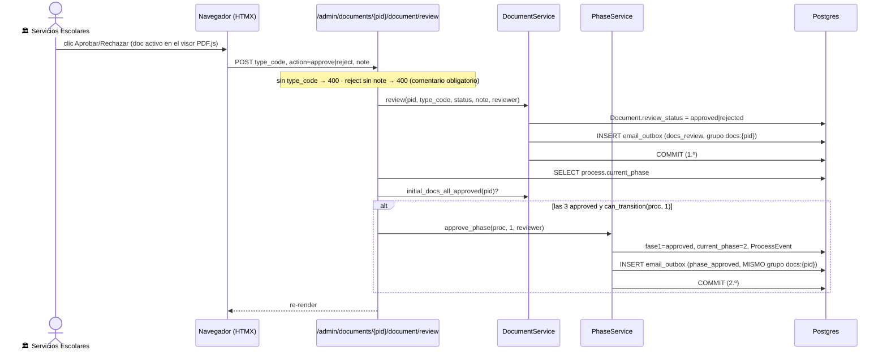

# Revisión de documentos iniciales (pestaña Documentos)

> **Objetivo:** Servicios Escolares aprueba/rechaza los documentos iniciales de CADA proceso —3 en
> licenciatura, 7 en posgrado (spec `2026-09-30-titulatec-posgrado-design.md` §4.4)— desde una
> bandeja dedicada; al aprobar el set completo, el proceso avanza solo a fase 2 y el alumno queda
> **elegible para agendar cotejo**.

| | |
|---|---|
| **Actor(es)** | 🏛️ Servicios Escolares (`titulatec_school_services` / `_head`) · 🎓 Titulaciones |
| **Permiso(s)** | ver: cualquiera de `titulatec.document.page.list`, `...dashboard.school_services`, `...dashboard.titulaciones`, `...dashboard.admin` (`_VIEW_PERMS`, `pages/documents.py:14-15`) · dictaminar: `titulatec.document.api.approve` **o** `...reject` (`_REVIEW_PERMS`, `pages/documents.py:16`) · ver el archivo: `titulatec.document.api.read.all` (`pages/documents.py:273`) |
| **Trigger** | El alumno subió documentos (fase 1); aparecen en la pestaña **Documentos**. |
| **Precondiciones** | Proceso `status='active'` con **al menos un archivo subido** (`pages/documents.py:161,175`). El auto-avance además exige que la fase 1 sea la transición legal del proceso: `PhaseService.can_transition(db, proc, 1)` (`pages/documents.py:262`), o sea proceso `active` **y** `current_phase == 1`. |
| **Sub-flujos** | ⤵ al aprobar el último pendiente del set invoca el [motor de avance de fase](engine_approve_advance_phase.md). |
| **Estado final** | todos los docs del set `approved` → fase 1 `approved`, `current_phase=2` → elegible para [cita de cotejo](phase2_appointment_loop.md). |

## Ruta en la app (UI)

1. `/titulatec/admin/documents` (pestaña **Documentos** del menú admin; la entrada del menú solo
   aparece con `titulatec.document.page.list` — `pages/nav.py:98` — mientras que la página acepta
   además los tres `dashboard.*` de `_VIEW_PERMS`).
2. Bandeja master-detail acotada por carrera (`officer_programs`, `pages/documents.py:160`): izquierda
   lista de procesos con pill de pendientes (o ✓ si todos los de SU perfil están aprobados); derecha
   visor + dictamen del documento activo. **Perfiles mezclados en la misma bandeja** (Tarea 4, spec
   §4.4): cada fila trae su propio set de 3 o 7 códigos
   (`_doc_rows`/`_doc_row`, `pages/documents.py:18-108`, vía `TrackService.for_level` reusando el
   `Program` ya cargado para el nombre de la carrera — sin consulta aparte) y la fila de un proceso
   de posgrado lleva la píldora **«Posgrado»** (`track_pill`, `_macros.html:92`) junto a la carrera,
   en `partials/documents_body.html`. El dictamen (`:226`) y el servido del archivo (`:271`) arrancan
   con `assert_process_in_scope` (`:250` y `:281` respectivamente) → **404** fuera del alcance, así
   que el dictamen y su auto-avance de fase no pueden tocar un proceso de otra carrera. Ver
   [alcance por carrera](engine_officer_scope.md).
3. Filtros: Todos / Por evaluar / Con rechazo / Completos y búsqueda por nombre, nº de control
   (también en MAYÚSCULA) o folio (`#docs-filters`, `partials/documents_body.html`;
   `process_search`, `services/process_service.py`). Encabezado "N por evaluar" y «Procesos (N)» =
   del **universo filtrado** (alcance + búsqueda + pestaña), no de la página ni del scope completo.
4. **Paginada (2026-10-04, spec `2026-10-04-titulatec-paginacion-design.md` §6)**: 50 procesos por
   página (`utils/paging.PAGE_SIZE`), pager `‹ Anteriores · a–b de N · Siguientes ›`. Cambiar de
   pestaña o de búsqueda vuelve a la página 1; el dictamen re-pinta la MISMA pestaña, página y
   búsqueda (hidden `page`/`q` en `#tt-review-form`) y, si vació la última página, cae en la
   última válida. `?selected=` pinta el detalle aunque el proceso caiga en otra página, siempre que
   esté en el universo filtrado; fuera de él (otra pestaña, otra búsqueda, otra carrera) no hay
   detalle.
   El buscador `#tt-docs-q` lleva `hx-preserve="true"` (`partials/documents_body.html:29`) y
   `#docs-filters` anuncia `data-tt-q-server` (`static/js/shared/titulatec-utils.js:414`): lo
   tecleado mientras viaja la petición no se pierde (fix `545aab64`, 2026-10-04). Medido en dev
   (EXPLAIN ANALYZE, 2026-10-04): pasada 1 de Documentos ≤0.03 ms (base de dev chica; Seq Scan).

## Secuencia

```mermaid
sequenceDiagram
    actor SE as 🏛️ Servicios Escolares
    participant FE as Navegador (HTMX)
    participant API as /admin/documents/{pid}/document/review
    participant DS as DocumentService
    participant PS as PhaseService
    participant DB as Postgres
    SE->>FE: clic Aprobar/Rechazar (doc activo en el visor PDF.js)
    FE->>API: POST type_code, action=approve|reject, note
    Note over API: sin type_code → 400 · reject sin note → 400 (comentario obligatorio)
    API->>DS: review(pid, type_code, status, note, reviewer)
    DS->>DB: Document.review_status = approved|rejected
    DS->>DB: INSERT email_outbox (docs_review, grupo docs:{pid})
    DS->>DB: COMMIT (1.º)
    API->>DB: SELECT process.current_phase
    API->>DS: initial_docs_all_approved(pid)?
    alt las 3 approved y can_transition(proc, 1)
        API->>PS: approve_phase(proc, 1, reviewer)
        PS->>DB: fase1=approved, current_phase=2, ProcessEvent
        PS->>DB: INSERT email_outbox (phase_approved, MISMO grupo docs:{pid})
        PS->>DB: COMMIT (2.º)
    end
    API-->>FE: re-render #docs-body
```

## Pasos detallados

| # | Actor | UI / dónde | Acción | Endpoint | Service · método | Efecto en BD | Correo |
|---|---|---|---|---|---|---|---|
| 1 | 🏛️ | `/admin/documents` | Selecciona proceso | `GET …/documents/body?selected=` | `_body_ctx` (scoped, `pages/documents.py:145-190`) | (lectura) | — |
| 2 | 🏛️ | panel derecho (doc activo) | Aprueba/rechaza doc | `POST …/{pid}/document/review` (`type_code`+`note` en form; reject exige `note`) | `DocumentService.review` | `Document.review_status`, `review_note`, `reviewed_by_id` · un solo commit al final | `docs_review` (aprobado **y** rechazado), grupo `docs:{pid}` |
| 2b | 🏛️ | visor | Ve PDF (PDF.js→canvas) / lo expande al modal `#tt-doc-modal` (`base_admin.html:93-125`, módulo `doc-viewer.js`) | `GET …/{pid}/document/{code}` (`?download=1` descarga) | `DocumentService.get_document` + `_storage_keys` → `storage.download_filename` | (lectura) · `Content-Disposition: inline\|attachment; filename="{control}_{ETIQUETA}.{ext}"` | — |
| 3 | 🤖 | — | Auto-avance si las 3 aprobadas | (mismo POST) | `DocumentService.initial_docs_all_approved` + `PhaseService.can_transition` + `...approve_phase` (`pages/documents.py:261-263`) | fase1→`approved`, `current_phase=2`, `ProcessEvent` · commit propio de `approve_phase` | `phase_approved`, **mismo** grupo `docs:{pid}` |

### Correo al egresado (desde 2026-09-28)

`DocumentService.review` encola con `StudentMail.doc_reviewed` —antes de su `commit`, en la misma
transacción que el dictamen— una fila `docs_review` con payload `{type_code, name, status, note}`:
`name` es el `DocumentType.name` (si el tipo ya no está en el catálogo, su código) y `note` el
motivo **tal como estaba al dictaminar** (`review_note` es un solo hueco y el siguiente dictamen lo
pisa). Aprobado y rechazado encolan los dos; el in-app sigue siendo solo del rechazo
(`DOCUMENT_REJECTED`).

Todo va al grupo `docs:{pid}`, igual que el `phase_approved` del auto-avance (paso 3): el
despachador junta el grupo en **un** correo cuando lleva `TITULATEC_EMAIL_DIGEST_MINUTES` sin
movimiento (D7), así que dictaminar los 3 documentos de corrido y el avance de fase salen juntos.
Lo fija `tests/fastapi/titulatec/test_mail_hooks.py`
(`test_tercer_aprobado_encola_tambien_phase_approved_en_el_grupo`, por la ruta real).

### Nombre del archivo descargado (desde 2026-09-28)

`GET …/{pid}/document/{code}` —aquí y su gemela de Citas, `pages/appointments.py`
(`/admin/appointments/{pid}/document/{code}`, siempre `inline`)— manda
`Content-Disposition: …; filename="{control}_{ETIQUETA}.{ext}"`: `23XXXXXX_ACTA.pdf`,
`…_CERTIFICADO.pdf`, `…_CURP.pdf`, y el código en mayúsculas para cualquier otro tipo. Lo calcula
`storage.download_filename(control, type_code, doc.file_path)` con el control de
`DocumentService._storage_keys` y la extensión de `file_path`, **no** con el nombre real del
archivo: un documento subido antes del cambio (todavía `curp.pdf` en disco, hasta correr
`titulatec rename-documents`) ya se descarga con el nombre nuevo. `Document.original_name` se
sigue guardando (y se muestra en el slot del alumno y en el expediente) pero **ya no nombra la
descarga**; antes iba tal cual al header. Con un número de control no alfanumérico (fila vieja
del importador) cae a la etiqueta sola (`CURP.pdf`), y con un `type_code` fuera de
`^[a-z0-9_]+$` a `documento.{ext}` (el catálogo real ya cumple; revisión 2026-09-28, m7): la
descarga nunca falla por el nombre. Fijado por
`tests/fastapi/titulatec/test_document_files_routes.py` y `test_document_storage.py`.

### De dónde sale el visor (reescrito 2026-10-05)

Tres piezas, ninguna con `<script>` inline:

- **Markup del panel**: `partials/documents_body.html` (selector de documentos `.tt-docpick`,
  `#tt-doc-review` con `data-phase-closed`, botones HTMX de dictamen con `data-closes`, línea 113).
  Solo datos por `data-*`.
- **Módulo**: `static/js/admin/doc-viewer.js` (`window.TitulaTecDocViewer = { init }`, IIFE, línea 340).
  PDF.js, documento activo, dictamen y modal. Lo carga **una vez** `admin/base_admin.html`
  (`<script src=…doc-viewer.js>`, junto a `officers.js`), delega en `document.body` y se re-inicia
  en `htmx:afterSettle` (`doc-viewer.js:323-330`; también en `htmx:historyRestore`, `:332`) solo si el swap trajo `#tt-doc-review`.
- **Modal grande** `#tt-doc-modal` (con `#tt-modal-actions`, su dictamen, que delega en los botones
  del panel inline): `admin/base_admin.html:93-125` (`#tt-modal-actions` en :113), dentro de `` (nivel `<body>`).
  `admin/appointments.html` y `admin/process_detail.html` lo heredan con `{{ super() }}`.
  Si el revisor no tiene `can_review_docs` (el panel no pinta botones), el módulo oculta el
  dictamen del modal.

**Causa del bug «Expandir no hacía nada» (corregido 2026-10-05, `ad8cacf9`)**: el visor era un
`<script>` inline de `documents_body.html` y el modal vivía en `admin/documents.html`. La navegación
del menú lateral trae solo `#tt-admin-content` (`hx-select`): el modal de la página no llegaba y el
`<script>` inline corría antes de Bootstrap y sin modal, así que `Expandir` nunca enganchaba.
Mover el modal a `base_admin` y el script a un módulo estático arregla las dos cosas.

Los parciales muertos `partials/documents/_doc_viewer.html`, `_doc_modal.html` y
`static/js/partials/doc-viewer.js` **se borraron** (2026-10-05); ya no hay copias que confundir.
Si tocas el visor, edita `static/js/admin/doc-viewer.js` (comportamiento), `documents_body.html`
(markup del panel) o `base_admin.html` (modal).

**PDF dentro del escritorio del core (2026-10-05, `a5ae4057`)**: el `<iframe>` que aloja cada app en
el escritorio llevaba `sandbox`, y Chromium **bloquea el visor de PDF** en documentos con sandbox
(incluidas las pestañas abiertas desde ellos: «bloqueó esta página»). Se retiró el `sandbox` (con
`allow-scripts`+`allow-same-origin` ya era evadible, no protegía) y quedó
`allow="fullscreen"` + `referrerpolicy="same-origin"` (`itcj2/core/static/js/dashboard/dashboard.js:250-256`;
shell móvil: `itcj2/core/templates/core/mobile/base_mobile.html`). Efecto aquí: el PDF del documento y «Abrir en
pestaña» funcionan con clic izquierdo dentro del escritorio.

## Lo que cuesta pintar la bandeja (arreglado 2026-09-02; dos pasadas desde 2026-10-04)

**Hoy (paginación, 2026-10-04): dos pasadas, 5 consultas fijas de la vista** (3 de ellas a tablas
`titulatec_*`) más la de eventos en «Por evaluar» — iguales con 2 procesos que con 40
(`test_documents_inbox.py::test_el_contexto_completo_cuesta_lo_mismo_con_2_que_con_40`,
`test_documents_paging.py::test_presupuesto_de_consultas_igual_con_2_y_con_40`).

- **Pasada 1 — `_doc_states`** (todo el universo): procesos activos en alcance + búsqueda con
  columnas ligeras (`id, created_at, current_phase, program_id, student_id, folio`), carreras
  (nivel + nombre, una lectura) y documentos del set en juego (columnas de estado), más la fase
  `initial_docs` solo si algún extra de posgrado no tiene fila. **Aquí, y solo aquí, vive la regla
  de estados** (`pending`/`missing`/`excused`/`all_approved`). Sobre estos estados se quitan los
  procesos sin ningún archivo, se filtra la pestaña, se ordena (FIFO de «Por evaluar» con
  `_order_pending_by_wait`, sobre TODO el universo: la cola sigue entre páginas) y se cuenta.
- **Pasada 2 — `_doc_present`** (solo los ≤50 de la página, y el detalle seleccionado si cae
  fuera): usuarios y nombres de tipo de documento. No decide estados: los copia.
- `_doc_rows(db, procs)` se conserva como `_doc_present(db, _doc_states(db, procs))`: 4 consultas
  fijas (carreras, documentos, usuarios, tipos).

Lo que sigue es la historia del arreglo original del N+1.

`_body_ctx` resuelve las filas en **5 consultas fijas**, no en 4 por fila.

Hasta el 2026-09-02 `_doc_row` recibía la sesión y, por cada proceso, hacía `db.get(User)`,
`db.get(Program)` y —dentro de un segundo bucle sobre los 3 tipos de documento— un `DocumentType`
por código más un `DocumentService.get_document`. Medido contra la BD de dev con el caché de authz
ya caliente: **273 consultas para 28 filas** (jefa) y **148 para 14** (encargado).

| Actor | Consultas antes | Consultas después | Tiempo de servidor antes | Después |
|---|---|---|---|---|
| gbarron (jefa, 34 procesos → 28 filas) | 273 | **5** | 112.5 ms | **3.8 ms** (29.8×) |
| fleon (encargado, 17 procesos → 14 filas) | 148 | **8** | 63.8 ms | **5.4 ms** (11.8×) |

(Mediana de 7 corridas en el mismo proceso y la misma sesión, con `expire_all()` entre medición y
medición. Medido de punta a punta desde el navegador, la petición de cambiar de filtro pasó de
~160 ms a ~53 ms.)

Las 5 son: procesos, `DocumentType IN (3)`, `Document IN (procesos) AND type_code IN (3)`,
`User IN (…)`, `Program IN (…)` (`pages/documents.py:19-57`). Las 3 extra del encargado son la
resolución del alcance por carrera, que este cambio no toca. Desde el 2026-09-24 «Por evaluar»
paga **una más, también fija**: los eventos de subida del lote (`_last_uploads`, ver abajo), que
son los que dan su orden FIFO. Lo fija `test_la_pestana_pendiente_no_escala_con_las_filas`.

**Con posgrado mezclado (Tarea 4, 2026-09-30) el `IN (3)` de `DocumentType`/`Document` pasa a ser
`IN (hasta 7)`**: `_doc_rows` resuelve el perfil de cada proceso primero (`TrackService.for_level`)
y arma `all_codes` con la UNIÓN de los sets de 3 y 7 en juego, así que sigue siendo **una** consulta
cada una — más ancha, no más numerosa. El conteo de **5** no cambia pase lo que pase con los
perfiles de la página (`test_documents_inbox.py::test_las_filas_de_la_bandeja_cuestan_lo_mismo_con_2_que_con_8`).

De paso, el `ORDER BY` gana un desempate por `id` (`pages/documents.py:103-104`).
`created_at` es `server_default NOW()` y en Postgres `NOW()` es la hora de **inicio de la
transacción**: varios procesos creados en la misma —una importación, por ejemplo— empatan, y
sin desempate el orden lo decidía el planificador, o sea la lista podía re-barajarse sola entre
un filtro y el siguiente. Con los 34 `created_at` distintos de hoy no cambia nada (el diff byte
a byte se repitió con el desempate puesto). Este orden —creación del proceso, no llegada del
documento— sigue rigiendo tal cual en **Todos**, **Con rechazo** y **Completos**.

**«Por evaluar» es la única pestaña con un orden distinto (2026-09-24).** En vez de cuándo se
creó el proceso, ordena por cuánto lleva esperando dictamen: para cada fila, el mínimo —entre
sus documentos con archivo en `review_status == 'pending'`— de la ÚLTIMA llegada de cada uno,
ascendente y con desempate por `process_id`. "Última" y no "primera" porque una resubida tras
un rechazo es una llegada NUEVA y se va al final de la fila, no conserva el lugar del primer
intento. La fuente de esa fecha es la bitácora (`ProcessEvent(document_uploaded)`, que
`DocumentService.save` escribe en la misma transacción que cada subida), no `Document.created_at`
ni `updated_at`: ninguna de las dos sirve sola, porque una resubida actualiza la fila de
`Document` en su lugar en vez de crear una nueva. Sin evento en la bitácora (fila sembrada, o
subida antes de `2f43e7e5` —2026-09-03—, cuando las subidas empezaron a dejar ese evento) el
respaldo es `Document.created_at`. Las filas cuyo único pendiente es "missing" (nada subido: se espera al
alumno, no al revisor) no tienen ningún tiempo que medir y van al final, sin reordenarse entre
sí —conservan el orden de arriba—. Lo resuelven `_last_uploads` y `_order_pending_by_wait`
(`pages/documents.py`), en una consulta de lote adicional que solo paga esta pestaña.

El lote es **equivalente** al bucle, no una aproximación: `DocumentType.code` es `UNIQUE` y
`Document` tiene `UNIQUE(process_id, type_code)`, así que el `.first()` por fila no podía devolver
más de un candidato. Comprobado además byte a byte: los 7 parciales de `/admin/documents/body`
(4 filtros × jefa, dos `?selected=`, y la vista del encargado) salen **idénticos** antes y después.

Lo fija `tests/fastapi/titulatec/test_documents_inbox.py`, que exige que la cuenta de consultas
**no dependa del número de filas** (2 filas y 8 filas ⇒ la misma cuenta) y que cubre los casos que
la BD de dev no tiene: proceso con 1 de 3 documentos (pseudo-estado `missing` en una fila visible),
proceso sin carrera, y documentos de procesos vecinos que no se cruzan.

## El indicador de carga de la bandeja

`#docs-skel` es un **overlay** (`tt-ind-host` + `tt-ind--overlay`, `admin/documents.html:11-20`),
no un bloque en flujo. Dos reglas, las dos del design system
([`docs/design/ui_motion.md`](../design/ui_motion.md)):

- **No aparece si la petición baja de `--tt-ind-delay` (300 ms)**, que es el caso normal: cambiar de
  filtro tarda ~160 ms. Antes se veía 150–192 ms — aparecer y desaparecer, justo lo que el usuario
  pidió quitar.
- **Cuando aparece no empuja nada.** Antes reservaba 24 px y toda la bandeja bajaba de golpe
  (CLS 0.024). Medido después con 900 ms de latencia artificial: aparece a +341 ms, **0 px de salto,
  CLS 0**.

Ojo con el markup de esta vista en concreto: la barra de filtros vive **dentro** de
`partials/documents_body.html`, o sea dentro de la región que se reemplaza, así que el velo también
la cubre. Es correcto (esos filtros pertenecen al estado viejo) pero es distinto de Citas, donde el
segmento queda fuera del host.

## El dictamen de documentos, y el «Mover de fase» del expediente que puede saltárselo ❗

**Corrección 2026-09-29 (deuda de documentación): esta sección describía un endpoint que ya no
existe.** Hasta el rediseño del expediente (2026-09-03, commit `2684de57` "el detalle del proceso
pasa a ser el expediente del alumno") había, en efecto, **dos** endpoints para dictaminar el mismo
documento con reglas distintas: el de esta bandeja y un gemelo en el entonces "detalle del
proceso" (`POST /admin/processes/{id}/documents/{type}/review`, sin exigir motivo al rechazar y
sin auto-avance). Ese rediseño **borró** el endpoint gemelo y su template
(`partials/admin_process_detail.html` ya no existe en el repo) — hoy dictaminar un documento
individual tiene **un solo camino**: esta bandeja. El expediente muestra los 3 documentos de la
fase 1 en **solo lectura**, con un enlace «Dictaminar en la bandeja» (ver
[expediente del alumno](xcut_admin_process_expediente.md), sección "Los documentos no se
dictaminan aquí").

**Lo que SÍ sigue vivo es una asimetría parecida, con otra forma.** El expediente conserva un
mecanismo GENÉRICO para mover cualquier fase — el botón «Mover de fase» de `#exp-head`
(`partials/processes/_exp_shell.html:50-55`), visible con `process.status == 'active' and
can_dictaminar_fase` (`:39`, `can_dictaminar_fase` = OR de `approve_phase`/`reject_phase`,
`pages/admin.py:1426-1441`) — que abre un modal cuyos botones Aprobar/Rechazar apuntan **siempre**
a `current_phase`. Cuando `current_phase == 1`, ese modal puede aprobar la fase 1 exactamente
igual que antes lo hacía el endpoint borrado:

- Endpoint: `POST /processes/{process_id}/phase/{n}/approve` (`pages/admin.py:1768`) →
  `PhaseService.approve_phase` (**la misma función** que usa el auto-avance de la bandeja).
- Permiso: `titulatec.process.api.approve_phase` (`pages/admin.py:1773`) — **el mismo par** que ya
  exige el dictamen por documento (`document.api.approve`/`.reject`, `pages/documents.py:16`); los
  tres roles operativos (`titulatec_school_services`, `..._head`, `titulatec_titulaciones`) tienen
  ambos permisos a la vez.
- Guarda: `PhaseService.assert_can_transition` (`phase_service.py:122-133`, vía `can_transition`,
  `:109-119`) exige que `n` sea la fase EN CURSO de un proceso `active`. **No mira el estado de los
  documentos** — ver [motor de avance](engine_approve_advance_phase.md).

**Consecuencia (verificada en el código):** se puede aprobar la fase 1 desde «Mover de fase» con
documentos `pending` o `rejected`, dejando el proceso en fase 2 sin los 3 aprobados — la bandeja lo
seguiría mostrando como "Por evaluar" mientras `AppointmentService.list_pending_processes` sigue
exigiendo las 3 aprobadas para dejar agendar. El guard del botón (`_exp_shell.html:39`) solo mira
permiso y estado del PROCESO, nunca el de sus documentos — es el mismo defecto de fondo que antes,
solo que hoy vive en el modal genérico y no en un botón dedicado de documentos.

**El auto-avance de la bandeja no es atómico.** Son dos transacciones separadas con una lectura en
medio: `DocumentService.review` hace su propio `db.commit()` (`services/document_service.py:416`);
después `pages/documents.py:261-263` relee `initial_docs_all_approved` + `can_transition` y, si
aplica, llama a `PhaseService.approve_phase`, que hace el suyo
(`services/phase_service.py:450`). Si el segundo commit falla —o dos revisores aprueban el último
documento a la vez— el documento queda `approved` y la fase no avanza: hay que empujarla con
«Mover de fase». No hay bloqueo de fila; la idempotencia la da `can_transition` (la segunda pasada
ya no encuentra el proceso en la fase 1). Los correos siguen a su propia transacción: el
`docs_review` queda con el 1.er commit y el `phase_approved` solo existe si el 2.º se confirmó —
nunca se avisa un avance que no ocurrió.

## Último aprobado = re-confirmación, y después el dictamen se congela (desde 2026-10-04)

Antes, rechazar un documento de la fase 1 con el proceso ya en la fase 2 dejaba al alumno
**trabado**: el documento quedaba `rejected`, el proceso no regresaba de fase (nada en el código
regresa una fase) y el alumno no podía re-subirlo (`assert_student_can_act` cierra las fases
anteriores: «La fase 01 ya esta cerrada…»). Además salía de la cola de cotejo
(`initial_docs_all_approved` en `AppointmentService`) pero `SelfBookingService.eligibility` no mira
documentos, así que podía seguir agendando solo. Decisión del usuario: **no se arregla regresando de
fase, se impide**.

- **Re-confirmación.** `_annotate_phase_lock` (`pages/documents.py`, solo sobre la fila
  seleccionada — una consulta al catálogo de fases, los conteos de `_doc_rows` no cambian) marca
  `closes_phase` en el documento que es el ÚNICO por aprobar del set del perfil, con archivo, y con
  el proceso en la fase `initial_docs`. La plantilla lo lleva como `data-closes` en su botón del
  selector; el JS del panel (`applyReviewState`, `partials/documents_body.html`) le pone al botón
  Aprobar `hx-confirm="Aprobar y avanzar de fase|…ya no se podrá cambiar… pasará a la siguiente
  fase."` + `data-tt-confirm-ok="Aprobar y avanzar"`, que el puente de `titulatec-utils.js`
  convierte en `confirmDialog`. El Aprobar del modal grande reusa ese mismo botón (y antes de
  dispararlo aplica el estado del doc del MODAL), así que hereda el aviso.
- **Congelado.** Con `current_phase` > fase del documento, `DocumentService.review` levanta
  `PHASE_CLOSED_MSG` (ASCII, viaja en `X-Tt-Error` → 400) ante un **rechazo** o ante cualquier
  dictamen sobre uno ya `approved` — antes de escribir nada. Sigue permitido **aprobar** uno que no
  lo esté (p. ej. la fase se movió con «Mover de fase» con documentos pendientes): solo destraba, y
  el dictamen tardío que fija `test_handoff_phase_cut.py` sigue en verde.
- **UI con la fase cerrada** (`phase_closed`): aviso `#tt-review-locked`, sin botón Rechazar
  (inline; el del modal se oculta por JS porque el modal vive fuera del swap), y Aprobar oculto
  cuando el doc activo ya está aprobado.
- Lo fija `tests/fastapi/titulatec/test_documents_phase_lock.py` (service, marcas y ruta real).
- **Fuera de alcance:** «Mover de fase» del expediente sigue pudiendo aprobar la fase 1 sin los
  documentos aprobados (sección de arriba); no hay re-confirmación ahí.

## Estado resultante

- Todos los `Document.review_status = approved` del set del PERFIL (3 en licenciatura, 7 en
  posgrado) → `initial_docs_all_approved == True` (`services/document_service.py:117-165`; el set
  sale de [`TrackService`](engine_process_track.md), nunca de un `3` fijo).
- Fase 1 `approved`, `current_phase = 2`, `ProcessEvent(phase_approved)` y notificación
  `PHASE_APPROVED` al alumno (`services/phase_service.py:401,424,433-436`).
- En `titulatec_email_outbox`: un `docs_review` por dictamen más el `phase_approved` del avance,
  todos `pending` en el MISMO grupo `docs:{pid}` — **un solo correo** cuando esa TANDA de
  dictámenes se despacha (`TITULATEC_EMAIL_DIGEST_MINUTES` sin movimiento, D7). Es por VENTANA de
  agrupado, no por proceso entero: si un dictamen de días antes ya salió (`sent`), el de hoy abre
  una tanda nueva en el mismo `group_key` y sale en su propio correo aparte. Detalle:
  [correos del proceso al egresado](xcut_student_email_notifications.md).
- El proceso entra a "Por agendar" de [cita de cotejo](phase2_appointment_loop.md)
  (`AppointmentService.list_pending_processes` exige el set del perfil aprobado — R-G exceptúa los
  extras de posgrado FALTANTES si la fase 1 ya cerró; ver [perfil de titulación](engine_process_track.md)).

## Caminos alternos / errores ❗

- POST sin `type_code` → `400` + header `X-Tt-Error` (`pages/documents.py:238-239`).
- Rechazar sin comentario → `400` + `X-Tt-Error` (`pages/documents.py:244-245`). (El endpoint
  gemelo del "detalle de proceso" que aceptaba rechazar sin motivo se borró con el rediseño del
  expediente, 2026-09-03 — ver "El dictamen de documentos…" arriba.)
- Rechazar un doc → `review_status=rejected`; el proceso NO avanza; sigue en "Por evaluar" / "Con
  rechazo". Cuando el alumno re-sube, `DocumentService.save` lo devuelve a `pending`
  (`services/document_service.py:301`). **Solo mientras la fase 1 sea la actual**: con la fase
  ya aprobada el rechazo responde `400` + `PHASE_CLOSED_MSG` (ver sección de arriba).
- Aprobar solo una parte del set (p. ej. 2 de 3 en licenciatura, o 6 de 7 en posgrado) → no avanza
  (el avance solo dispara con el set COMPLETO del perfil aprobado y `current_phase == 1`).
- Aprobar el set completo cuando la fase 1 ya no es la actual → no avanza; queda para «Mover de
  fase».
- La bandeja **no** exige `ProcessPhase.status`: `_body_ctx` filtra por `status='active'` y por
  tener archivos (`pages/documents.py:161,175`). Desde 2026-09-28 (Tarea 1) ya no hay un paso de
  "enviar a revisión" que el alumno pueda omitir -- `DocumentService.sync_initial_phase` deja la
  fase en `in_review` sola en cuanto llega el ÚLTIMO documento del set de SU perfil -- pero la fase
  1 puede seguir en `in_progress` mientras falte alguno de ese set (p. ej., en licenciatura, dos
  subidos y aprobados y el tercero todavía sin llegar): se puede aprobar y avanzar esa fase igual,
  porque `can_transition` no mira `ProcessPhase.status`, solo `process.current_phase` y `status ==
  'active'`.
- El alcance por carrera cubre **las dos capas**: el listado se filtra con `officer_programs`
  (`pages/documents.py:160`) y el POST de dictamen arranca con `assert_process_in_scope`
  (`pages/documents.py:250`), que responde **404** —no 403— porque el id es secuencial y
  enumerable. Antes de cerrarlo, con el `process_id` en la URL un encargado fuera de su alcance
  podía dictaminar y, peor, empujar de fase un proceso ajeno.
  Ver [alcance por carrera](engine_officer_scope.md).

## Flujos relacionados

- ← Previo: [el alumno sube documentos](phase1_student_upload_initial_docs.md).
- ↔ Antes existía un dictamen gemelo desde el "detalle del proceso" (sin auto-avance); se borró
  con el rediseño del expediente (2026-09-03, ver "El dictamen de documentos…" arriba).
  [`phase1_admin_review_initial_docs.md`](phase1_admin_review_initial_docs.md) todavía describe esa
  ruta — **desactualizado, pendiente de corregir aparte** (fuera del alcance de esta tarea).
- ⤵ Motor: [aprobar/avanzar fase](engine_approve_advance_phase.md).
- ⤵ De dónde sale el set de 3 vs. 7 y la píldora «Posgrado»: [perfil de titulación por nivel de
  carrera](engine_process_track.md).
- ⤵ Encola correo al egresado: [correos del proceso al egresado](xcut_student_email_notifications.md).
- → Siguiente: [cita de cotejo](phase2_appointment_loop.md) (requiere el set del perfil aprobado).
