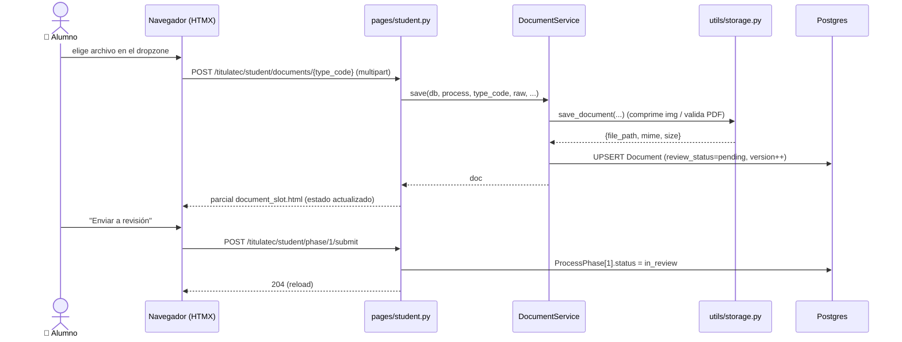

# El alumno sube sus documentos iniciales (Fase 1)

> **Objetivo:** el alumno carga los 3 documentos iniciales y envía la fase 1 a revisión.

| | |
|---|---|
| **Actor(es)** | 👤 Alumno (`student`) |
| **Permiso(s)** | `document.api.read.own` (ver) · `...upload.own` · `...delete.own` · `process.api.advance` (enviar) |
| **Trigger** | El alumno entra a "Documentos" desde el menú del alumno (drawer/rail) o el CTA del detalle de fase |
| **Precondiciones** | Tiene un `TitulationProcess` activo (creado en [import CSV](phase0_school_services_import_csv.md)); fase 1 `in_progress` |
| **Estado final** | 3 `Document` subidos (`review_status=pending`) + fase 1 → `in_review` |

Documentos requeridos (`DocumentType.code`): `birth_certificate`, `high_school_cert`, `curp`.

## Ruta en la app (UI)

1. Dashboard alumno `/titulatec/student/dashboard` → menú del alumno → **Documentos**
   (o directo `/titulatec/student/documents`). Chrome: ver [integración en el shell](xcut_student_shell_embed.md).
2. Por cada documento: tarjeta dropzone (parcial `partials/document_slot.html`).
   Tocar → seleccionar archivo (cámara/galería/PDF) → sube solo (HTMX `change`).
3. Cuando los 3 están subidos, se habilita **"Enviar a revisión"**.

## Secuencia

## Pasos detallados

| # | Actor | UI / dónde | Acción | Endpoint | Service · método | Efecto en BD | Eventos / Notif |
|---|---|---|---|---|---|---|---|
| 1 | 👤 | `/student/documents` | ver slots | `GET /student/documents` | `DocumentService.get_document` ×3 | — | — |
| 2 | 👤 | dropzone | subir/re-subir | `POST /student/documents/{type_code}` | `DocumentService.save` → `storage.save_document` | `titulatec_documents` UPSERT (`review_status=pending`, `version`++, archivo en `instance/.../{period}/{control}/documents/{type}.{ext}`) | — |
| 3 | 👤 | botón ✕ | eliminar | `DELETE /student/documents/{type_code}` | `DocumentService.delete` | borra fila + archivo | — |
| 4 | 👤 | botón enviar | enviar fase | `POST /student/phase/1/submit` | (inline) valida 3 docs | `ProcessPhase[1].status=in_review` | — |

## Estado resultante

- 3 filas en `titulatec_documents` con `review_status=pending`.
- `ProcessPhase[1].status = in_review` → aparece en la bandeja admin para revisión.

## Caminos alternos / errores ❗

- Archivo inválido (extensión/tamaño) → `StorageError`; el endpoint devuelve el parcial
  con `error` + header `X-Tt-Error` → toast rojo (`TitulaTecUtils`). No se guarda.
- Faltan documentos al enviar → `400` + `X-Tt-Error: "Faltan documentos por subir."`.
- Re-subir un doc ya aprobado/rechazado lo vuelve a `pending` (sobreescribe versión).

## Flujos relacionados

- ← Previo: [import CSV](phase0_school_services_import_csv.md) (crea el proceso).
- ⤵ Siguiente: [revisión admin de docs iniciales](phase1_admin_review_initial_docs.md).
