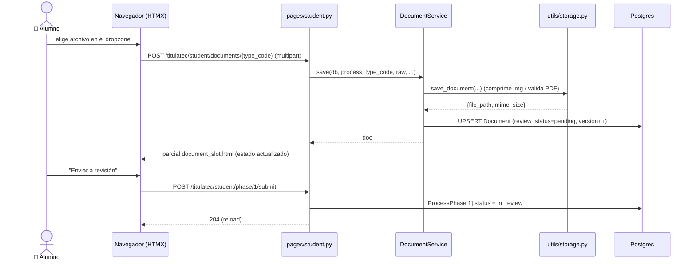

# El alumno sube sus documentos iniciales (Fase 1)

> **Objetivo:** el alumno carga los 3 documentos iniciales y envía la fase 1 a revisión.

| | |
|---|---|
| **Actor(es)** | 👤 Alumno (`student`) |
| **Permiso(s)** | `document.api.read.own` (ver) · `...upload.own` · `...delete.own` · `process.api.advance` (enviar) |
| **Trigger** | El alumno toca **«Ir a documentos»** en la tarjeta «Tu proceso» del dashboard (el CTA solo existe si la fase 1 es su fase actual, [acordeón de fases](xcut_student_phase_detail.md)), o entra por el menú del alumno (drawer/rail) |
| **Precondiciones** | Tiene un `TitulationProcess` activo (creado en [import CSV](phase0_school_services_import_csv.md)); **la fase 1 es su `current_phase`** (`in_progress` o `rejected`). **Se valida** en [`PhaseService.assert_student_can_act`](engine_student_phase_lock.md) |
| **Estado final** | 3 `Document` subidos (`review_status=pending`) + fase 1 → `in_review` |

Documentos requeridos (`DocumentType.code`): `birth_certificate`, `high_school_cert`, `curp`.

## Ruta en la app (UI)

1. Dashboard alumno `/titulatec/student/dashboard` → **columna A, tarjeta «Tu proceso»** →
   botón «Ir a documentos». Desde 2026-09-02 **ese es el camino principal**: no hay pantalla
   intermedia de fase, y el CTA lo pinta **solo** la fase actual ([acordeón](xcut_student_phase_detail.md)).
   Alternativas: menú del alumno (drawer/rail) → **Documentos**, o directo
   `/titulatec/student/documents`. Chrome: ver [integración en el shell](xcut_student_shell_embed.md).
2. Por cada documento: tarjeta dropzone (parcial `partials/document_slot.html`).
   Tocar → seleccionar archivo (cámara/galería/PDF) → sube solo (HTMX `change`).
3. Cuando los 3 están subidos, se habilita **"Enviar a revisión"**.

## Secuencia

```mermaid
sequenceDiagram
    actor U as 👤 Alumno
    participant FE as Navegador (HTMX)
    participant API as pages/student.py
    participant SVC as DocumentService
    participant ST as utils/storage.py
    participant DB as Postgres
    U->>FE: elige archivo en el dropzone
    FE->>API: POST /titulatec/student/documents/{type_code}  (multipart)
    API->>SVC: save(db, process, type_code, raw, ...)
    SVC->>ST: save_document(...) (comprime img / valida PDF)
    ST-->>SVC: {file_path, mime, size}
    SVC->>DB: UPSERT Document (review_status=pending, version++)
    SVC-->>API: doc
    API-->>FE: parcial document_slot.html (estado actualizado)
    U->>FE: "Enviar a revisión"
    FE->>API: POST /titulatec/student/phase/1/submit
    API->>DB: ProcessPhase[1].status = in_review
    API-->>FE: 204 (reload)
```

## Pasos detallados

| # | Actor | UI / dónde | Acción | Endpoint | Service · método | Efecto en BD | Eventos / Notif |
|---|---|---|---|---|---|---|---|
| 1 | 👤 | `/student/documents` | ver slots | `GET /student/documents` | `DocumentService.get_document` ×3 | — | — |
| 2 | 👤 | dropzone | subir/re-subir | `POST /student/documents/{type_code}` | `DocumentService.save` → `storage.save_document` | `titulatec_documents` UPSERT (`review_status=pending`, `version`++, archivo en `instance/.../{period}/{control}/documents/{type}.{ext}`) | — |
| 3 | 👤 | botón ✕ | eliminar | `DELETE /student/documents/{type_code}` | `DocumentService.delete` | borra fila + archivo | — |
| 4 | 👤 | botón enviar | enviar fase | `POST /student/phase/1/submit` | (inline) valida 3 docs | `ProcessPhase[1].status=in_review` | — |

## Estado resultante

- 3 filas en `titulatec_documents` con `review_status=pending`.
- `ProcessPhase[1].status = in_review` → aparece en la bandeja admin para revisión.

## Caminos alternos / errores ❗

- Archivo inválido (extensión/tamaño) → `StorageError`; el endpoint devuelve el parcial
  con `error` + header `X-Tt-Error` → toast rojo (`TitulaTecUtils`). No se guarda.
- Faltan documentos al enviar → `400` + `X-Tt-Error: "Faltan documentos por subir."`.
- Re-subir un doc ya aprobado/rechazado lo vuelve a `pending` (sobreescribe versión).
- **Fuera de la fase 1** ([guarda de fase](engine_student_phase_lock.md)): `GET
  /student/documents` responde `302` a `/student/dashboard?fase=1` (el acordeón, que sí
  explica la fase) y los tres pasos 2-4 devuelven `400` + `X-Tt-Error`. Los tres son los
  que antes dejaban **reabrir la fase 1 ya aprobada** y **borrar un documento aprobado**
  —fila y fichero— desde la fase 2.
- El paso 2 guarda por el **tipo**, no por la URL: subir un `DocumentType` de otra fase
  (`anexo_iii`, `ine`, `final_project`…) también da `400`.
- Fase 1 `rejected` → sigue abierta: es el camino de corrección y reenvío.

## Flujos relacionados

- ← Previo: [import CSV](phase0_school_services_import_csv.md) (crea el proceso).
- ⤵ Siguiente: [revisión admin de docs iniciales](phase1_admin_review_initial_docs.md).
- 🖥️ Entrada y seguimiento: [acordeón de fases del dashboard](xcut_student_phase_detail.md) — de
  ahí sale el CTA, y ahí se ve el avance documento a documento (aprobado / por corregir / en
  revisión / sin subir) sin abrir esta pantalla.
