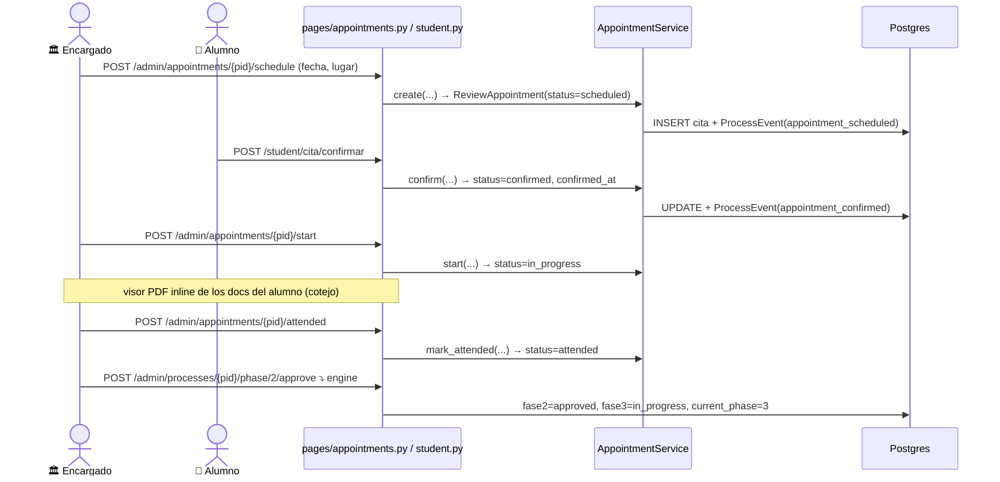

# Cita de cotejo — loop completo (Fase 2)

> **Objetivo:** Servicios Escolares agenda la cita, el alumno confirma, el encargado
> atiende el cotejo físico contra los documentos subidos, marca asistencia y aprueba
> la fase 2 (que avanza a Titulaciones / fase 3).

| | |
|---|---|
| **Actor(es)** | 🏛️ Servicios Escolares (encargado de la carrera) · 👤 Alumno |
| **Permiso(s)** | `appointment.page.list` · `api.create|update|reschedule|mark_attended` (🏛️) · `appointment.page.my` · `api.confirm.own` (👤) · `document.api.read.all` (visor cotejo) · `process.api.approve_phase` |
| **Trigger** | El proceso llegó a fase 2 (`current_phase=2`) tras aprobar fase 1 |
| **Precondiciones** | Proceso `active`, fase 2 `in_progress`, sin cita previa |
| **Sub-flujos** | ⤵ [motor de avance de fase](engine_approve_advance_phase.md) (paso final, separado) |
| **Estado final** | Cita `attended`; fase 2 `approved`; fase 3 `in_progress` |

> **Por carrera:** cada encargado de Servicios Escolares maneja su agenda; el filtro por
> carrera en la página separa las agendas. El alumno **solicita** cambios pero **el
> encargado asigna/reagenda**. Estados de la cita: ver [máquina de estados](00_state_machine.md).

## Ruta en la app (UI)

- **🏛️ Encargado:** sidebar admin → **Citas de cotejo** (`/titulatec/admin/appointments`).
  Agenda master-detail: izquierda lista (**Por agendar** = fase 2 sin cita · **Agenda** =
  citas), derecha detalle. Filtros carrera / estado / "solo mías".
- **👤 Alumno:** menú del alumno (drawer/rail) → **Cita de cotejo** (`/titulatec/student/cita`):
  tarjeta de estado + checklist físico fijo (actas, CURP cert., e.Firma, encuesta, no-adeudo,
  12 fotos, IMSS, $1,900). Chrome del alumno: ver [integración en el shell](xcut_student_shell_embed.md).

## Secuencia

## Pasos detallados

| # | Actor | UI / dónde | Acción | Endpoint | Service · método | Efecto en BD | Eventos |
|---|---|---|---|---|---|---|---|
| 1 | 🏛️ | Citas · Por agendar | agendar | `POST /admin/appointments/{pid}/schedule` | `AppointmentService.create` | `ReviewAppointment(status=scheduled, scheduled_at, location, created_by_id)` | `appointment_scheduled` + notif `APPOINTMENT_SCHEDULED` |
| 2 | 👤 | `/student/cita` | confirmar | `POST /student/cita/confirmar` | `AppointmentService.confirm` | `status=confirmed`, `confirmed_at` | `appointment_confirmed` |
| 2b| 👤 | `/student/cita` | solicitar cambio | `POST /student/cita/solicitar-cambio` (form `reason`) | `AppointmentService.request_change` | `note="[CAMBIO] …"` | `appointment_change_requested` |
| 3 | 🏛️ | detalle cita | atender (en proceso) | `POST /admin/appointments/{pid}/start` | `AppointmentService.start` | `status=in_progress` | `appointment_in_progress` |
| 3v| 🏛️ | detalle cita | ver doc (cotejo) | `GET /admin/appointments/{pid}/document/{type}` | `DocumentService.get_document` + `storage.abs_path` | — (FileResponse inline en iframe) | — |
| 4 | 🏛️ | detalle cita | marcar asistió | `POST /admin/appointments/{pid}/attended` | `AppointmentService.mark_attended` | `status=attended` | `appointment_attended` |
| 4b| 🏛️ | detalle cita | reagendar | `POST /admin/appointments/{pid}/reschedule` | `AppointmentService.reschedule` | `scheduled_at`/`location` nuevos, `status=scheduled`, limpia `note` | `appointment_rescheduled` + notif `APPOINTMENT_RESCHEDULED` |
| 4c| 🏛️ | detalle cita | no se presentó | `POST /admin/appointments/{pid}/no-show` | `AppointmentService.mark_no_show` | `status=no_show` | `appointment_no_show` |
| 5 | 🏛️/🎓 | detalle **proceso** | **aprobar fase 02** | `POST /admin/processes/{pid}/phase/2/approve` | `PhaseService.approve_phase` ⤵ | fase2=`approved`, fase3=`in_progress`, `current_phase=3` | `phase_approved` |

> Acciones 1–4 re-renderizan `#appt-body` (`partials/appointments_body.html`), conservando
> el proceso seleccionado. El paso 5 ocurre en el **detalle del proceso** (botón "Ir al
> proceso a aprobar fase 02" cuando la cita está `attended`).

## Estado resultante

- `ReviewAppointment.status = attended`, `confirmed_at` puesto.
- Fase 2 `approved`, fase 3 `in_progress`, `current_phase=3`.
- 5 `ProcessEvent` (phase 2): scheduled → confirmed → in_progress → attended → phase_approved.

## Notificaciones al alumno

Agendar (1) y reagendar (4b) avisan al alumno (`APPOINTMENT_SCHEDULED` / `APPOINTMENT_RESCHEDULED`,
con fecha+lugar, link a la fase 2) vía `services/notify.notify_student` → tab **Avisos** del shell.
La confirmación del alumno (2) no se auto-notifica. Ver
[integración del alumno en el shell](xcut_student_shell_embed.md#notificaciones-regla-general-de-toda-app).

## Caminos alternos / errores ❗

- **Solicitud de cambio del alumno** (2b): se guarda en `note` con prefijo `[CAMBIO] `;
  el encargado ve un banner ámbar y reagenda (4b), que limpia la nota y vuelve a `scheduled`.
- **"Marcar asistió" NO aprueba la fase** (decisión): es paso separado (5). Permite cotejo
  fallido sin aprobar.
- Filtro de carrera vacío llega como `program_id=` → los params se parsean como `str`
  (no `int|None`) para evitar 422 (gotcha conocido).

## Flujos relacionados

- ← Previo: [revisión de docs iniciales](phase1_admin_review_initial_docs.md).
- ⤵ Motor: [aprobar/avanzar fase](engine_approve_advance_phase.md).
- → Siguiente: [Formato B](phase3_student_formato_b.md).
