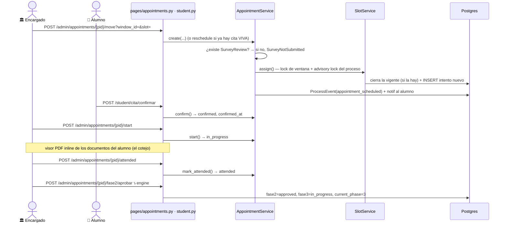

# Cita de cotejo — loop completo (Fase 2)

> **Objetivo:** el alumno queda sentado en una franja real de un encargado, se presenta, el
> encargado coteja sus documentos físicos contra los subidos, marca asistencia, palomea los
> requisitos y **dictamina la fase 2** desde esa misma pantalla.

| | |
|---|---|
| **Actor(es)** | 🏛️ Servicios Escolares (encargado de la carrera) · 👤 Alumno |
| **Permiso(s)** | **Ver la agenda:** `appointment.page.list` ∨ `dashboard.school_services` ∨ `dashboard.admin`. **Actuar:** `appointment.api.create` (agendar) · `.reschedule` (reagendar / mover) · `.update` (iniciar, no-show, deshacer, **cancelar**) · `.mark_attended` · `process.api.requirement.mark` (checklist) · `process.api.approve_phase` / `.reject_phase`. **Espacios:** `review_window.api.manage` ∨ `.manage.all`. **Alumno:** `appointment.page.my` · `.api.confirm.own` · `.api.book.own` · `.api.cancel.own` |
| **Trigger** | El proceso aparece en «Por agendar»: activo, **sin cita vigente**, **la fase 02 nunca rechazada**, los 3 documentos iniciales aprobados y la **encuesta de egresados ya enviada** |
| **Precondiciones** | `DocumentService.initial_docs_all_approved(db, process_id)` y existe `SurveyReview` (guarda dura de `AppointmentService.create`: `SurveyNotSubmitted`) |
| **Sub-flujos** | ⤵ [motor de avance de fase](engine_approve_advance_phase.md) · ⤵ [alcance por carrera](engine_officer_scope.md) · ⤵ [el egresado agenda solo](phase2_student_self_booking.md) |
| **Estado final** | Cita `attended`; fase 2 `approved`; fase 3 `in_progress` |

> **Por carrera:** cada encargado ve y atiende solo los procesos de **sus** carreras.
> `officer_programs` se resuelve **una vez** por petición (`_shell_ctx`) y alimenta todas las
> consultas de la vista; las rutas con `{process_id}` arrancan con `assert_process_in_scope` →
> **404** fuera del alcance. Ver [alcance por carrera](engine_officer_scope.md).
>
> **Estados de la cita:** los 7 valores, los 3 terminales y el eje `is_current` viven en la
> [máquina de estados](00_state_machine.md). No se duplican aquí.

> **Elegibilidad — corrección (jun-2026).** «Por agendar» **no** es `current_phase == 2`: el commit
> `ae0dfe1` quitó ese filtro de `AppointmentService.list_pending_processes`. El criterio es
> `status == "active"` + sin cita vigente + los **3 documentos iniciales aprobados**
> (`birth_certificate`, `high_school_cert`, `curp`). En la práctica coinciden —aprobar el 3.er
> documento aprueba la fase 1 y deja `current_phase=2`—, pero **la fase (en el sentido de
> `current_phase`) ya no se consulta**.
>
> **Corrección (2026-09-17): la fase SÍ vuelve a consultarse, pero por otra columna.** Desde el
> cubo «Fase 02 rechazada» (más abajo), «Por agendar» también excluye a quien tenga una
> `ProcessPhase` de `PhaseService.PHASE_COTEJO` en `status == "rejected"` — sin importar
> `current_phase`. Es lo que hace que «Por agendar» sea **solo primera vez**: sin esta resta, quien
> ya pasó por cotejo, se lo rechazaron y luego canceló su cita (D6 la devuelve a «sin cita»)
> reaparecería aquí mezclado con quien nunca tuvo cita.

> **Puerta de la encuesta de egresados (2026-09-15, D2).** «Por agendar» exige un cuarto requisito:
> la encuesta **ENVIADA** (no liberada — GTV puede seguir revisando en paralelo). Quien tiene los 3
> documentos pero no ha enviado la encuesta cae en el cubo **«Sin encuesta»**: filas sin arrastre,
> sin selección y sin navegación, que solo informan. La guarda dura vive en
> `AppointmentService.create` (`SurveyNotSubmitted`), **no** en la página: aplica a **todo**
> `create`, incluido el intento nuevo tras un `no_show`.
>
> ⚠️ **`SlotService.assign_batch` NO pasa por `AppointmentService.create`**: inserta directo, así
> que **se saltaría esta puerta** si alguna vista futura lo invoca sobre un proceso sin
> `SurveyReview`. Hoy no tiene llamadores en producción. Quien cablee esa vista debe tomar los
> candidatos de `list_pending_processes` o duplicar la guarda dentro de `assign_batch`.

---

## El modelo de la agenda: días → espacios → franjas

Tres niveles, cada uno de un dueño distinto. Entender esto es entender la pantalla:

| Nivel | Tabla | Quién lo pone | Qué define |
|---|---|---|---|
| **Día de cotejo** | `titulatec_cohort_review_days` | 🏛️ **jefatura** (Convocatorias → días de cotejo) | qué fechas de la convocatoria admiten cotejo. Se **cierran** (`is_closed`), no se borran: borrar un día no puede borrar la cita de un alumno |
| **Espacio / ventana** | `titulatec_review_windows` | 🏛️ **cada encargado**, para sí mismo | su horario dentro de ese día (`start_time`, `end_time`), la duración de sus franjas (`slot_minutes`), cuántas personas caben **por franja** (`capacity`), el lugar y su **visibilidad** |
| **Franja** | — *(derivada)* | 🤖 | `SlotService.slots(window)`: no se materializa en ninguna tabla. Solo cuenta la franja que cabe **entera** |

**El dueño de un espacio es el USUARIO, no el puesto**: `aux_school_services` tiene
`allows_multiple = TRUE` y nueve ocupantes, así que con dueño = puesto esas nueve personas
compartirían un solo horario.

Como las franjas no se materializan, cambiar `slot_minutes` con citas dentro deja citas fuera de
la rejilla; la UI las muestra en una banda **«Fuera de la rejilla»** en vez de esconderlas.

**Visibilidad del espacio (2026-09-16):** `private` (default) · `bookable` (el egresado elige
franja) · `walkin` (solo anuncio). Es un campo más del formulario de espacios, sin ruta ni permiso
propios. Detalle en ⤵ [el egresado agenda solo](phase2_student_self_booking.md).

---

## Ruta en la app (UI)

**🏛️ Encargado** → sidebar admin → **Citas de cotejo** (`/titulatec/admin/appointments`).
Un solo shell (`#appt-shell`) con una **zona fija** (título + segmento) y **tres sub-vistas
hermanas** — no tres zonas peleándose por el ancho:

| Sub-vista | `?v=` | Qué contiene |
|---|---|---|
| **Agenda** | `agenda` *(default)* | filtros + **carril de días** + **tablero de franjas** (`#appt-board`) + **cola de trabajo** (`#appt-queue`) |
| **Atender** | `atender` | la ficha del alumno abierto, a **ancho completo**: documentos, checklist de requisitos y el dictamen de la fase 02 |
| **Espacios** | `espacios` | el horario propio del encargado: lista de sus espacios del día + editor |

Cada una declara su rejilla **una vez por breakpoint**. Lo que cambia al elegir un alumno es **qué
sub-vista se renderiza**, nunca cuánto mide una columna: por eso nada se encoge ni salta. (Antes,
abrir un alumno pasaba la agenda de 676 a 340 px y a 390 px empujaba todo 1220 px hacia abajo.)

**La cola de trabajo son CINCO cubos mutuamente excluyentes** — un proceso aparece en exactamente
uno. El orden en pantalla (fijado 2026-09-17) antepone los dos cubos que de verdad necesitan una
cita **nueva** a los que solo necesitan *seguimiento*:

1. **Por agendar** — sin cita vigente, fase 02 **nunca rechazada**, y todavía puede agendarse solo
   (o esperar al encargado). Es la **prioridad visual** de la cola (fondo y borde de acento, kicker
   «Prioridad · primera cita», contador más grande): es la única que es de **primera vez** y la que
   más rota. `AppointmentService.list_pending_processes`.
2. **Fase 02 rechazada** — la fase 02 quedó con observaciones y necesita **otra** cita (D5).
   `AppointmentService.list_rejected_cotejo_processes`.
3. **Requieren que les agendes** — agotaron su tope de cancelaciones: **solo el encargado** puede
   sacarlos de ahí. Cada fila dice el conteo («3 cancelaciones · ya no puede agendar solo»).
4. **Reagendar** — no se presentaron (`no_show`).
5. **Sin encuesta** — documentos aprobados, falta enviar la encuesta. Solo informan.

> **El cubo 2 se añadió el 2026-09-16, cerrando un agujero: D5 no tenía bandeja.** Un proceso
> atendido al que le rechazaban la fase 02 caía en **cero** cubos — conserva cita vigente, así que
> el universo «sin cita» de los cubos 1, 3 y 5 no lo veía, y no es `no_show`, así que «Reagendar»
> tampoco. Podía auto-agendarse, pero **solo si alguien había publicado un espacio `bookable`**, y
> `private` es el `server_default`: el día uno ese egresado no aparecía en ninguna lista de nadie.
>
> **Ampliado el 2026-09-17, cerrando el mismo agujero por la puerta de atrás.** El predicado
> original exigía `status='attended'` en la cita vigente a secas, así que a quien se le **cancelaba**
> esa cita tras el rechazo (D6: cancelar libera y vuelve a «sin cita») le pasaban DOS cosas malas a
> la vez: (a) volvía a caer en cero cubos —el mismo defecto que el cubo 2 vino a cerrar—, y (b) si
> encima ya tenía documentos y encuesta, reaparecía en «Por agendar» como si fuera de **primera
> vez**, mezclando dos historias distintas bajo el mismo contador. El fix tiene dos mitades que
> tienen que viajar juntas: `list_rejected_cotejo_processes` ahora entra también **sin cita vigente
> en absoluto** (no solo con `attended`), y `_unscheduled_query` —la base compartida de los cubos
> 1, 3 y 5— resta a todo el que tenga la fase 02 `rejected`, tenga o no cita. Un `no_show` vigente
> con la fase 02 `rejected` **sigue** en «Reagendar» y no en el cubo 2: `attended` y `no_show` se
> excluyen por construcción, así que esa disjunción no dependía de arreglar nada.
>
> **Caso real que motivó el fix (dev, proceso #39):** fase 02 `rejected` + cita vigente `attended`,
> pero **sin** `SurveyReview` (nunca se sembró/migró correctamente). Arrastrarlo a un lugar libre
> reventaba con `SurveyNotSubmitted` — un error que no dice nada en el contexto de «nada más le
> rechazaron la fase». La fila del cubo 2 resuelve `sin_encuesta` (no existe `SurveyReview` del
> proceso) **por fila**: sin encuesta pierde `draggable`/`data-tt-drag*` y muestra la píldora
> «Falta encuesta» en su lugar, pero conserva la navegación (`appt_nav`) para poder ver el motivo y
> dar seguimiento. Con encuesta, arrastrable como cualquier otro cubo. También muestra `motivo`
> (`rejection_reason` de la fase 02, en una línea truncada con `title` completo) y, si aplica,
> **la misma línea de D9** que el cubo 3 («Agotó sus cancelaciones…») — `sin_encuesta` y bloqueado
> por D9 no son excluyentes entre sí.

La exclusión de los cubos 1 y 3 **no** se resuelve en la plantilla: la resta la hace
`list_pending_processes`, que excluye a los del cubo 3. Filtrar en el template dejaría los
**contadores** mintiendo. La del cubo 2 frente al 4 es **estructural** y no una resta: los dos
exigen cita vigente para quedar fuera del universo «sin cita», pero uno se define por `no_show` y
el otro por «`attended` o ninguna», que se excluyen por construcción. Y el cubo 2 exige además la
fase 02 **`rejected`**: el `attended` que espera dictamen no está en ningún cubo a propósito (no le
falta cita, le falta que el encargado se pronuncie), y el que la tiene **aprobada** tampoco (ya
terminó, §3 `fase_aprobada`).

El badge «por atender» del segmento suma los cubos 1+2+3+4 (por posición de pantalla: por agendar +
fase 02 rechazada + requieren que les agendes + reagendar); el de «sin encuesta» **no** suma, porque
ahí no hay nada que el encargado pueda hacer todavía. La suma no distingue si una fila del cubo 2
tiene `sin_encuesta=true` (esa sigue sin poder agendarse hasta que el egresado la envíe) — es una
imprecisión conocida y no una que este cambio haya intentado cerrar.

**👤 Alumno** → tarjeta «Tu proceso» del dashboard → **«Ver mi cita»**, o menú del alumno →
**Cita de cotejo** (`/titulatec/student/cita`): tarjeta de estado + checklist de requisitos de su
convocatoria + —desde 2026-09-16— el selector para **agendar él mismo**.

## Secuencia

```mermaid
sequenceDiagram
    actor S as 🏛️ Encargado
    actor U as 👤 Alumno
    participant API as pages/appointments.py · student.py
    participant SVC as AppointmentService
    participant SLOT as SlotService
    participant DB as Postgres
    S->>API: POST /admin/appointments/{pid}/move?window_id=&slot=
    API->>SVC: create(...) (o reschedule si ya hay cita VIVA)
    SVC->>SVC: ¿existe SurveyReview? → si no, SurveyNotSubmitted
    SVC->>SLOT: assign() — lock de ventana + advisory lock del proceso
    SLOT->>DB: cierra la vigente (si la hay) + INSERT intento nuevo
    SVC->>DB: ProcessEvent(appointment_scheduled) + notif al alumno
    U->>API: POST /student/cita/confirmar
    API->>SVC: confirm() → confirmed, confirmed_at
    S->>API: POST /admin/appointments/{pid}/start
    API->>SVC: start() → in_progress
    Note over S,API: visor PDF inline de los documentos del alumno (el cotejo)
    S->>API: POST /admin/appointments/{pid}/attended
    API->>SVC: mark_attended() → attended
    S->>API: POST /admin/appointments/{pid}/fase2/aprobar  ⤵ engine
    API->>DB: fase2=approved, fase3=in_progress, current_phase=3
```

## Pasos detallados

Todas las rutas del encargado cuelgan de `/titulatec/admin/appointments`.

| # | Actor | UI / dónde | Acción | Endpoint | Service · método | Efecto en BD | Eventos / Notif |
|---|---|---|---|---|---|---|---|
| 0 | 🏛️ | Espacios | abrir/editar su espacio | `POST /espacios/{window_id}` (`nuevo` o id) | `ReviewWindowService.create` / `.update` | `titulatec_review_windows` | — |
| 0b| 🏛️ | Espacios | pausar · eliminar · copiar a los demás días | `POST /espacios/{id}/pausa` · `/eliminar` · `/copiar` | `toggle_pause` · `delete` · `copy_to_days` | ídem (copiar **también copia el modo**) | — |
| 1 | 🏛️ | Agenda · tablero | **agendar** picando un lugar libre (o arrastrando al alumno) | `POST /{pid}/move?window_id=&slot=` | `AppointmentService.create` → `SlotService.assign` | **INSERT** cita `scheduled`, `is_current`, `attempt_no=max+1`, `booked_by='officer'` | `appointment_scheduled` + notif `APPOINTMENT_SCHEDULED` |
| 1b| 🏛️ | ficha | agendar desde el formulario | `POST /{pid}/schedule` | ídem | ídem | ídem |
| 2 | 👤 | `/student/cita` | confirmar | `POST /student/cita/confirmar` | `AppointmentService.confirm` | `confirmed`, `confirmed_at` | `appointment_confirmed` |
| 2b| 👤 | `/student/cita` | solicitar cambio | `POST /student/cita/solicitar-cambio` (form `reason`) | `AppointmentService.request_change` | **columna propia** `change_request` + `change_requested_at` | `appointment_change_requested` |
| 2c| 👤 | `/student/cita` | **agendar / cancelar él mismo** | `POST /student/cita/agendar` · `/cancelar` | `SelfBookingService.book` · `.cancel` | ⤵ [flujo dedicado](phase2_student_self_booking.md) | `appointment_scheduled` · `appointment_cancelled`, **sin notif** |
| 3 | 🏛️ | Atender | iniciar el cotejo | `POST /{pid}/start` | `AppointmentService.start` | `in_progress` | `appointment_in_progress` |
| 3v| 🏛️ | Atender | ver documento (el cotejo) | `GET /{pid}/document/{type_code}` | `DocumentService.get_document` + `storage.abs_path` | — (FileResponse inline) | — |
| 4 | 🏛️ | Atender | marcar asistió | `POST /{pid}/attended` | `AppointmentService.mark_attended` | `attended` | `appointment_attended` |
| 4b| 🏛️ | tablero | **mover de franja** (picando el destino, o arrastrando) | `POST /{pid}/move?window_id=&slot=` | `AppointmentService.reschedule` | la vigente pasa a `superseded` (si estaba viva) e **INSERTA** la nueva | `appointment_rescheduled` + notif `APPOINTMENT_RESCHEDULED` |
| 4c| 🏛️ | Atender | no se presentó | `POST /{pid}/no-show` | `mark_no_show` | `no_show` — **conserva su franja ocupada** | `appointment_no_show` *(sin notificación)* |
| 4d| 🏛️ | Atender | **deshacer «no se presentó»** | `POST /{pid}/undo-no-show` | `undo_no_show` | `no_show → in_progress` | `appointment_undo_no_show` |
| 4e| 🏛️ | Atender | **cancelar la cita** | `POST /{pid}/cancelar` (form `motivo`) | `AppointmentService.cancel` | `cancelled`, `is_current=False`, sella `cancelled_*`; **libera la franja** | `appointment_cancelled` + notif `APPOINTMENT_CANCELLED` |
| 4f| 🏛️ | Atender · checklist | marcar / dispensar / desmarcar requisito | `POST /{pid}/requisitos/{rid}` (form `action`, `note`) | `RequirementService.fulfill` / `.unfulfill` | `RequirementFulfillment(fulfilled\|waived)` o borrada | `requirement_fulfilled` / `requirement_unfulfilled` |
| 5 | 🏛️/🎓 | Atender | **aprobar fase 02** | `POST /{pid}/fase2/aprobar` | `PhaseService.approve_phase` ⤵ | fase2=`approved`, fase3=`in_progress`, `current_phase=3` | `phase_approved` |
| 5b| 🏛️ | Atender | **rechazar fase 02** (motivo obligatorio) | `POST /{pid}/fase2/rechazar` (form `reason`) | `PhaseService.reject_phase` | fase2=`rejected` + `rejection_reason` | `phase_rejected` + notif `PHASE_REJECTED` |

**Sobre el paso 1 y el 4b: son la misma ruta.** `move` decide sola cuál corresponde, y el criterio
es el **complemento exacto** de la guarda de `create`: si hay cita **viva**
(`scheduled|confirmed|in_progress`) la mueve con `reschedule`; si no —incluida una `attended` a la
que le faltaron papeles— abre un **intento nuevo** con `create`. Así los dos no pueden divergir.
Antes, `appt is None` se usaba como proxy de «no hay cita que mover» y una `attended` seguía siendo
la vigente: caía en `reschedule` → `InvalidTransition`, y el encargado no podía volver a sentar a
quien atendió y le faltaron papeles.

**Reagendar NO muta la fila: inserta.** `reschedule` y `create` cierran la vigente y crean un
intento nuevo con `attempt_no+1`. El historial completo sale de `AppointmentService.list_attempts`;
`get_for_process` devuelve **solo la vigente**. Esto es lo que hace que un `no_show` **conserve su
estado y su franja ocupada** mientras el alumno recibe una fila nueva en otra.

> **Desde el 2026-09-07 el dictamen de la fase 02 se hace AQUÍ.** Antes, con la cita en `attended`,
> el panel solo ofrecía un enlace «Ir al proceso a aprobar fase 02» que mandaba al oficial al
> expediente con el alumno esperando enfrente. El checklist (4f) va al lado de los dos botones
> porque `approve_phase` se niega mientras falte un requisito obligatorio
> (`PhaseService._cotejo_gate_error`): sin él, «Aprobar» contestaría «faltan: e.firma» y obligaría
> justo al viaje que esta pantalla elimina. Las rutas 4f, 5 y 5b son **hermanas** de las del
> expediente, no las mismas: aquellas terminan en `hx-target="#exp-shell"` y cableadas aquí
> meterían el expediente dentro de `#appt-shell`.
>
> «Rechazar» es una **navegación** con `&rechazar={pid}` (el mismo idiom que «Mover de franja» usa
> con `&mover=`), que re-renderiza el panel con el textarea abierto: `hx-confirm` es sí/no y
> `prompt()` está prohibido en el proyecto.

## Estado resultante

- `ReviewAppointment.status = attended`, `is_current = True`, con sus intentos previos conservados.
- Fase 2 `approved`, fase 3 `in_progress`, `current_phase = 3`.
- `ProcessEvent` de la fase 2: `appointment_scheduled` → `confirmed` → `in_progress` → `attended`
  → `phase_approved` (más los de cada requisito palomeado).

## Notificaciones al alumno

**Solo tres acciones notifican**, y son estas (`_notify_appt` → `services/notify.notify_student` →
tab **Avisos** del shell):

| Acción | Tipo | Condición |
|---|---|---|
| Agendar | `APPOINTMENT_SCHEDULED` | **salvo que agende el propio alumno** (no se le avisa de su propio clic) |
| Reagendar / mover | `APPOINTMENT_RESCHEDULED` | siempre |
| Cancelar | `APPOINTMENT_CANCELLED` | **salvo que cancele el propio alumno** |

**`no_show` no notifica** (no hay call site), y **el auto-agendado no le notifica nada al
encargado**: se entera por el distintivo «El alumno agendó» de su tablero.

> La comparación «¿el actor es el alumno?» va con `int()` en los dos lados: `user["sub"]` es
> **string**, y sin la coerción `"7" != 7` es siempre verdadero — el alumno recibiría aviso de su
> propio clic y el silencio de esa rama sería mentira.

## Caminos alternos / errores ❗

- **Solicitud de cambio del alumno** (2b): vive en **columna propia** (`change_request`), no en un
  prefijo mágico dentro de `note`. El encargado ve el indicador en el asiento y reagenda.
- **«Marcar asistió» NO aprueba la fase** (decisión): es el paso 5, separado. Permite cotejo
  fallido sin aprobar — y, desde el auto-agendado, permite que el alumno pida otra cita mientras la
  fase 2 siga abierta.
- **Día no habilitado** → `DayNotAllowed`. La guarda vive **en el service**
  (`AppointmentService.create` llama a `ReviewDayService.assert_allowed`), así que ya no depende de
  que cada página se acuerde de validar.
- **Sin datos de franja** → `MissingSchedule` (400 con mensaje). Antes esto era un `if dt:` que
  respondía 200 sin escribir nada y sin decir una palabra.
- **Franja llena** → `SlotFull`; **hora que no es franja de la rejilla** → `InvalidSlot`;
  **choque de locks** → `SlotLockTimeout` (`lock_timeout` es **LOCAL**, no de sesión: PgBouncer
  está en modo transaccional y un `SET` de sesión se le queda pegado a otro cliente).
- **Doble clic en «Agendar»** → `AppointmentConflict`. La guarda de `create` corre **fuera** de los
  locks, así que la que vale es la re-comprobación de dentro del advisory lock (`rechazar_activa`).
  Sin ella, el segundo clic superaba al primero y —peor— **liberaba su franja**, porque
  `superseded` libera.
- **Transición inválida** → `InvalidTransition`. Las escrituras de estado **de
  `AppointmentService`** pasan por `assert_transition`, así que `no_show → attended` ya **no** es
  alcanzable. **No es universal:** `SlotService._open_new_attempt` escribe `superseded` sobre la
  fila vieja **sin** consultar la matriz, a propósito (abrir un intento nuevo no es una transición
  del intento viejo). Ver [la nota de alcance en la máquina de estados](00_state_machine.md).
- **Filtro de carrera vacío** llega como `program_id=`: los parámetros se parsean como `str` (no
  `int|None`) para evitar un 422.
- **Las rutas del alumno solo responden con la fase 2 en curso**
  ([guarda de fase](engine_student_phase_lock.md)): `GET /student/cita` da `302` al acordeón; los
  POST dan `400` + `X-Tt-Error`. La guarda mira `process.current_phase`, **no** el estado de la cita.

## El contrato de URL de la agenda

Todos los controles llevan **la misma URL** en `href` y en `hx-get`, y apuntan a la **página**, no
a `/body`; el shell se recorta con `hx-select="#appt-shell"` y se sustituye con `morph:outerHTML` +
`hx-push-url="true"` (macros `appt_nav` / `appt_nav_filter` / `appt_action`). Consecuencia: **F5 y
el botón Atrás reconstruyen el estado exacto** y la barra de direcciones nunca acaba con un parcial
desnudo.

| Parámetro | Efecto |
|---|---|
| `v=agenda\|atender\|espacios` | sub-vista |
| `date=YYYY-MM-DD` | día abierto (sin él, `_default_day` elige **dónde está el trabajo**) |
| `selected=<process_id>` | alumno abierto (ficha de Atender) |
| `w=<window_id>\|nuevo` | espacio abierto en el editor |
| `q=` · `estado=` · `mias=1` · `program_id=` | filtros del área de trabajo (modo «resultados») |
| `p=<process_id>` | alumno «armado» para sentarlo picando un lugar |
| `mover=<process_id>` | modo «elige el lugar al que mover» |
| `rechazar=<process_id>` | abre el textarea del rechazo de la fase 02 |

`?selected=` es un **filtro, nunca una ampliación del alcance** (fue un IDOR): se valida contra el
**universo acotado completo** —toda la agenda del usuario, más su cola, más los bloqueados—, no
contra las filas de la vista; si no, abrir a alguien de «Por agendar» (que por definición no tiene
cita) sería imposible.

`mover` y `rechazar` se **descartan** tras cada acción (`_action_ctx`): son estados de «estoy a
mitad de una acción», y la acción ya terminó.

### Movimiento: solo se anima lo que cambió

`#appt-shell` lleva un `data-tt-view` **constante**, así que la puerta de `titulatec-utils.js` nunca
re-anima el shell entero en sus propios swaps. Cada zona declara un `data-tt-fade-key` con la clave
de su contenido y `static/js/admin/appointments.js` marca con `.tt-enter` solo las que cambiaron.
El indicador (`#appt-skel`) vive **fuera** del shell: dentro se destruiría estando visible.

## Limitaciones conocidas

Verificadas contra el código al **2026-09-16**. No son bugs con ticket abierto: son el
comportamiento actual, documentado para que nadie asuma otra cosa.

- **(a) El tablero no es en vivo.** No hay Socket.IO en esta app. Cancelar libera la franja en el
  acto, pero el encargado puede estar mirando un asiento que acaba de quedar libre; se resuelve en
  el siguiente render, como todo lo demás aquí.
- **(b) `walkin` no deja rastro.** Un espacio «abierto sin cita» no crea ningún registro, así que
  no hay dato de cuánta gente llegó. Es la decisión tomada (D2); si algún día molesta, la salida es
  un contador en la ventana, **no** citas fantasma.
- **(c) El motivo de la cancelación del alumno no se pide en la UI.** La ruta lo acepta y el
  service lo guarda, pero la tarjeta no ofrece el campo (un toggle exigiría JS inline, prohibido),
  así que desde la pantalla del alumno `cancel_reason` queda `NULL`. `
`/`
` es la
  salida barata si alguien lo retoma.
- **(d) Un espacio `bookable` de alguien sin carreras asignadas no lo ve nadie.** Es fail-closed a
  propósito (Ruling 14; `read.all` no abre la oferta), y la UI lo avisa al guardar **y** en la
  lista de espacios — pero sigue siendo una trampa si se ignora el aviso.
- **(e) `?v=reparto` está en la lista blanca de sub-vistas y no tiene ninguna.** `_shell_ctx` lo
  acepta pero no construye `board`, y el template cae al `` (Agenda), que itera
  `board.grupos` → `UndefinedError` (medido sobre esa misma estructura). Es un valor muerto del
  reparto masivo (`assign_batch`, sin llamadores); nada lo enlaza, así que solo se alcanza
  escribiéndolo a mano en la URL.

## Flujos relacionados

- ← Previo: [revisión de docs iniciales (pestaña Documentos)](phase1_school_services_review_docs.md).
- ⤵ **La otra mitad de esta fase:** [el egresado agenda su propia cita](phase2_student_self_booking.md).
- 🖥️ Entrada y seguimiento: [acordeón de fases del dashboard](xcut_student_phase_detail.md) — el
  panel de la fase 2 resume fecha, lugar y si falta confirmar, **sin** dejar confirmar desde ahí.
- ⤵ Motor: [aprobar/avanzar fase](engine_approve_advance_phase.md).
- ⤵ Alcance: [días/encargados por carrera](engine_officer_scope.md).
- ⤵ Puerta previa: [liberación GTV de la encuesta de egresados](phase2_tech_management_survey_release.md).
- 📐 [Máquina de estados](00_state_machine.md) — los 7 estados y el eje `is_current`.
- → Siguiente: [Formato B](phase3_student_formato_b.md).
