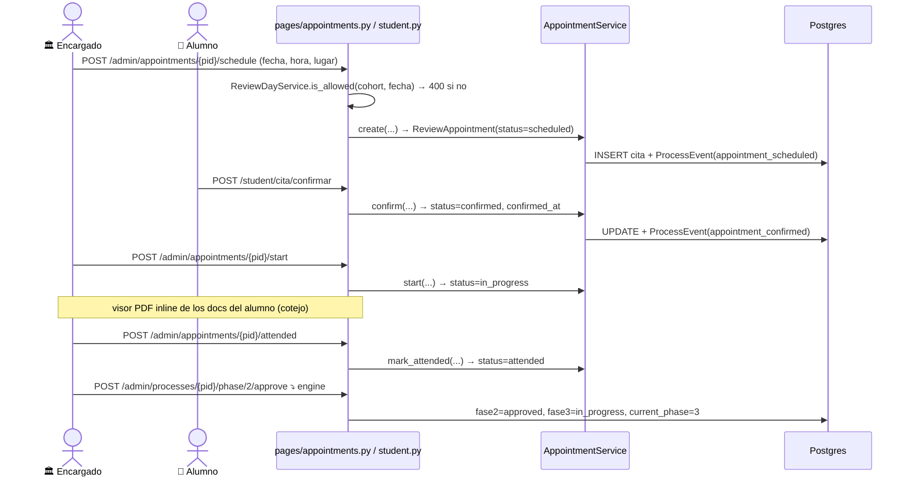

# Cita de cotejo — loop completo (Fase 2)

> **Objetivo:** Servicios Escolares agenda la cita, el alumno confirma, el encargado
> atiende el cotejo físico contra los documentos subidos, marca asistencia y aprueba
> la fase 2 (que avanza a Titulaciones / fase 3).

| | |
|---|---|
| **Actor(es)** | 🏛️ Servicios Escolares (encargado de la carrera) · 👤 Alumno |
| **Permiso(s)** | `appointment.page.list` \| `dashboard.school_services` \| `dashboard.admin` (ver agenda, `pages/appointments.py:62`) · `appointment.api.create` (:484) · `.reschedule` (:514) · `.update` (start/no-show, :545/:589) · `.mark_attended` (:567) · `appointment.page.my` (👤, `pages/student.py:471`) · `appointment.api.confirm.own` (👤, confirmar y solicitar cambio, `student.py:487,509`) · `process.api.approve_phase` |
| **Trigger** | Los 3 documentos iniciales quedaron aprobados → el proceso aparece en "Por agendar" |
| **Precondiciones** | Proceso `status == "active"`, **sin cita registrada**, y `DocumentService.initial_docs_all_approved(db, process_id) == True` (`services/appointment_service.py:127-144`) |
| **Sub-flujos** | ⤵ [motor de avance de fase](engine_approve_advance_phase.md) (paso final, separado) |
| **Estado final** | Cita `attended`; fase 2 `approved`; fase 3 `in_progress` |

> **Por carrera:** cada encargado de Servicios Escolares maneja su agenda; el filtro por
> carrera en la página separa las agendas (`officer_programs` se resuelve **una vez** en
> `pages/appointments.py:307` y alimenta las cinco consultas de la vista). Las **6 acciones con
> `{process_id}`** (schedule, reschedule, start, attended,
> no-show, ver documento) arrancan con `assert_process_in_scope` → **404** fuera del alcance,
> y el `?selected=` del querystring se resuelve **dentro de las filas ya acotadas**: antes
> devolvía la ficha completa (nombre, control, correo, `view_url` de los 3 documentos) de
> cualquier alumno del padrón. Ver [alcance por carrera](engine_officer_scope.md).
> El alumno **solicita** cambios pero **el encargado asigna/reagenda**.
> Estados de la cita: ver [máquina de estados](00_state_machine.md).

> **Elegibilidad — corrección (jun-2026).** Este documento decía antes que "Por agendar"
> eran los procesos con `current_phase == 2`. Ya no es así: el commit `ae0dfe1`
> *"feat(titulatec): elegibilidad de cotejo = 3 documentos aprobados"* (2026-06-04) quitó ese
> filtro de `AppointmentService.list_pending_processes`. Hoy el criterio es
> `status == "active"` + sin cita + los **3 documentos iniciales aprobados**
> (`birth_certificate`, `high_school_cert`, `curp`; `services/document_service.py:8-17`).
> En la práctica coinciden —aprobar el 3.er documento aprueba la fase 1 y deja
> `current_phase=2`—, pero **la fase ya no se consulta** en el service.

## Ruta en la app (UI)

- **🏛️ Encargado:** sidebar admin → **Citas de cotejo** (`/titulatec/admin/appointments`).
  **Vista de tres zonas** (rediseño del 2026-09-02, ver «La agenda de tres zonas» abajo):
  el **calendario** del mes como vista principal, **Por agendar** fijo a su lado con contador,
  y la **ficha** del alumno elegido junto a la lista del día. Los filtros carrera / estado /
  "solo mías" viven en la sub-vista **Lista**.
- **👤 Alumno:** tarjeta «Tu proceso» del dashboard → **«Ver mi cita»** (camino principal desde
  2026-09-02, [acordeón de fases](xcut_student_phase_detail.md)), o menú del alumno (drawer/rail)
  → **Cita de cotejo** (`/titulatec/student/cita`):
  tarjeta de estado + checklist físico fijo (actas, CURP cert., e.Firma, encuesta, no-adeudo,
  12 fotos, IMSS, $1,900). Chrome del alumno: ver [integración en el shell](xcut_student_shell_embed.md).

## Secuencia

```mermaid
sequenceDiagram
    actor S as 🏛️ Encargado
    actor U as 👤 Alumno
    participant API as pages/appointments.py / student.py
    participant SVC as AppointmentService
    participant DB as Postgres
    S->>API: POST /admin/appointments/{pid}/schedule (fecha, hora, lugar)
    API->>API: ReviewDayService.is_allowed(cohort, fecha) → 400 si no
    API->>SVC: create(...) → ReviewAppointment(status=scheduled)
    SVC->>DB: INSERT cita + ProcessEvent(appointment_scheduled)
    U->>API: POST /student/cita/confirmar
    API->>SVC: confirm(...) → status=confirmed, confirmed_at
    SVC->>DB: UPDATE + ProcessEvent(appointment_confirmed)
    S->>API: POST /admin/appointments/{pid}/start
    API->>SVC: start(...) → status=in_progress
    Note over S,API: visor PDF inline de los docs del alumno (cotejo)
    S->>API: POST /admin/appointments/{pid}/attended
    API->>SVC: mark_attended(...) → status=attended
    S->>API: POST /admin/processes/{pid}/phase/2/approve  ⤵ engine
    API->>DB: fase2=approved, fase3=in_progress, current_phase=3
```

## Estados de la cita

`ReviewAppointment.status` solo toma **cinco** valores; son los únicos que el service escribe
(docstring en `services/appointment_service.py:7-12`, asignaciones en `:196/:218/:232/:241/:249/:259`):

| Estado | Quién lo escribe | Dónde |
|---|---|---|
| `scheduled` | 🏛️ agendar / reagendar | `create` :196 · `reschedule` :218 |
| `confirmed` | 👤 confirmar | `confirm` :259 (+ `confirmed_at`) |
| `in_progress` | 🏛️ atender | `start` :232 |
| `attended` | 🏛️ marcar asistió | `mark_attended` :241 |
| `no_show` | 🏛️ no se presentó | `mark_no_show` :249 |

> ⚠️ **`rescheduled` no existe como estado.** El comentario de la columna
> (`models/review_appointment.py:16`) todavía lo lista, pero ninguna ruta ni service lo
> escribe: reagendar devuelve la cita a `scheduled` y limpia `confirmed_at`
> (`appointment_service.py:218-219`). Lo único con ese nombre es el **evento**
> `appointment_rescheduled` (`:221`) y su etiqueta en el timeline del alumno (`pages/student.py:55`).

## Pasos detallados

| # | Actor | UI / dónde | Acción | Endpoint | Service · método | Efecto en BD | Eventos |
|---|---|---|---|---|---|---|---|
| 1 | 🏛️ | Citas · Por agendar | agendar | `POST /admin/appointments/{pid}/schedule` | `ReviewDayService.is_allowed` → `AppointmentService.create` | `ReviewAppointment(status=scheduled, scheduled_at, location, note, created_by_id)` | `appointment_scheduled` + notif `APPOINTMENT_SCHEDULED` |
| 2 | 👤 | `/student/cita` | confirmar | `POST /student/cita/confirmar` | `AppointmentService.confirm` | `status=confirmed`, `confirmed_at` | `appointment_confirmed` |
| 2b| 👤 | `/student/cita` | solicitar cambio | `POST /student/cita/solicitar-cambio` (form `reason`) | `AppointmentService.request_change` | `note="[CAMBIO] …"` (pisa la nota previa) | `appointment_change_requested` |
| 3 | 🏛️ | detalle cita | atender (en proceso) | `POST /admin/appointments/{pid}/start` | `AppointmentService.start` | `status=in_progress` | `appointment_in_progress` |
| 3v| 🏛️ | detalle cita | ver doc (cotejo) | `GET /admin/appointments/{pid}/document/{type}` | `DocumentService.get_document` + `storage.abs_path` | — (FileResponse inline en iframe) | — |
| 4 | 🏛️ | detalle cita | marcar asistió | `POST /admin/appointments/{pid}/attended` | `AppointmentService.mark_attended` | `status=attended` | `appointment_attended` |
| 4b| 🏛️ | detalle cita | reagendar | `POST /admin/appointments/{pid}/reschedule` | `ReviewDayService.is_allowed` → `AppointmentService.reschedule` | `scheduled_at`/`location` nuevos, `status=scheduled`, `confirmed_at=NULL`, `note` ← la del form | `appointment_rescheduled` + notif `APPOINTMENT_RESCHEDULED` |
| 4c| 🏛️ | detalle cita | no se presentó | `POST /admin/appointments/{pid}/no-show` | `AppointmentService.mark_no_show` | `status=no_show` | `appointment_no_show` |
| 5 | 🏛️/🎓 | detalle **proceso** | **aprobar fase 02** | `POST /admin/processes/{pid}/phase/2/approve` | `PhaseService.approve_phase` ⤵ | fase2=`approved`, fase3=`in_progress`, `current_phase=3` | `phase_approved` |

> Acciones 1–4 re-renderizan **`#appt-shell` entero** (`partials/appointments_body.html`),
> conservando el alumno abierto **y la zona A**: cada botón manda el estado de la agenda en su
> propio querystring y `_action_ctx` (`pages/appointments.py:475-481`) lo devuelve al contexto,
> así que marcar asistencia desde el día 7 deja la vista en el día 7 y no salta al calendario.
> El paso 5 ocurre en el **detalle del proceso** (botón "Ir al proceso a aprobar fase 02"
> cuando la cita está `attended`).
>
> El paso 2 es el único con guarda de estado previo: `pages/student.py:498` solo confirma si el
> status de la cita es `scheduled`; la guarda vive en la página, no en `confirm()`.

## Estado resultante

- `ReviewAppointment.status = attended`, `confirmed_at` puesto.
- Fase 2 `approved`, fase 3 `in_progress`, `current_phase=3`.
- 5 `ProcessEvent` (phase 2): scheduled → confirmed → in_progress → attended → phase_approved.

## Notificaciones al alumno

Agendar (1) y reagendar (4b) avisan al alumno (`APPOINTMENT_SCHEDULED` / `APPOINTMENT_RESCHEDULED`,
con fecha+lugar, link a la fase 2 — que **redirige** al
[acordeón del dashboard](xcut_student_phase_detail.md)) vía `services/notify.notify_student` → tab **Avisos** del shell
(`appointment_service.py:159-173`, llamadas en `:206` y `:223`). La confirmación del alumno (2) no
se auto-notifica. Ver
[integración del alumno en el shell](xcut_student_shell_embed.md#notificaciones-regla-general-de-toda-app).

## Caminos alternos / errores ❗

- **Solicitud de cambio del alumno** (2b): se guarda en `note` con prefijo `[CAMBIO] `;
  el encargado ve un banner ámbar y reagenda (4b), que reemplaza la nota y vuelve a `scheduled`.
- **"Marcar asistió" NO aprueba la fase** (decisión): es paso separado (5). Permite cotejo
  fallido sin aprobar.
- **Fecha no habilitada** (1 y 4b) → `400` + header `X-Tt-Error` sin tocar la BD
  (`pages/appointments.py:502-503` y `:532-533`).
- Filtro de carrera vacío llega como `program_id=` → los params se parsean como `str`
  (no `int|None`) para evitar 422 (gotcha conocido).
- **Las 3 rutas del alumno solo responden con la fase 2 en curso**
  ([guarda de fase](engine_student_phase_lock.md)): `GET /student/cita` da `302` a
  `/student/dashboard?fase=2`, y `confirmar` / `solicitar-cambio` dan `400` +
  `X-Tt-Error`. La guarda mira `process.current_phase`, **no** el `status` de la cita:
  el loop completo de arriba (confirmar, pedir cambio tras una reagenda, volver a
  confirmar) sigue intacto mientras la 2 sea su fase.

## Días configurables + calendario (jun-2026)

- **La jefa configura fechas de cotejo por convocatoria** (`titulatec_cohort_review_days`, perm
  `titulatec.cohort.api.review_days`, solo rol head) en `/admin/cohorts/{id}/review-days`
  (calendario toggle). Servicio `ReviewDayService` (`list_days`/`is_allowed`/`set_days`/`toggle`/
  `months_with_days`, `services/review_day_service.py`).
- **Agendar solo en esas fechas**: el form usa un `<select>` de fechas habilitadas
  (`allowed_days`, `pages/appointments.py:202` y `:214`) + hora; el endpoint valida
  `ReviewDayService.is_allowed(cohort, fecha)` → `400` + `X-Tt-Error` si no. Sin fechas
  configuradas → aviso "la jefa aún no configura días".
- **Elegibilidad ("Por agendar")** = proceso `active`, sin cita, con los **3 docs aprobados**
  (`DocumentService.initial_docs_all_approved`), ver [revisión de documentos](phase1_school_services_review_docs.md).
- **Agenda = calendario mensual**: días no configurados en gris/tachado, configurados clickeables
  con **conteo de citas** (`AppointmentService.counts_by_day`, acotado por scope). Ver la sección
  siguiente para el contrato completo de la vista.

## La agenda de tres zonas (rediseño del 2026-09-02)

Decisión del usuario, después de usar la versión anterior: *«el calendario como vista principal,
"Por agendar" fijo a su lado (debajo en móvil) siempre visible con contador, y al elegir un alumno
que se abra SOLO ese en un panel de detalle junto a la lista del día, sin saltar a la pestaña
Lista»*. Y, aparte: *«si el contenido de la petición no cambia, que no se mueva»*.

### Qué se plegó y por qué

| Antes | Ahora |
|---|---|
| 3 rutas de vista: `/body` (lista+detalle), `/calendar`, `/day` | **1 sola**: `/body`, que renderiza `#appt-shell` con las tres zonas |
| segmento **Calendario · Del día · Lista** | segmento de **dos**, con activo real: **Calendario · Lista** |
| «Por agendar» solo existía en la pestaña Lista, y dentro de un `` | zona propia, **siempre** renderizada, con contador (0 incluido) |
| el detalle vivía en la pestaña Lista → elegir un alumno del día te sacaba del día | la ficha se abre **al lado** de la lista del día |
| `hx-trigger="load"` sobre `#appt-body` → la pestaña se pintaba dos veces al abrir | render en el servidor, un solo pintado |

**Por qué murió «Del día»:** sin parámetro aterrizaba en *hoy*, que fuera de la semana de cotejo
son **0 citas** y ninguna pista de dónde está el trabajo — un callejón sin salida. Al día se llega
picando una celda del calendario, y ya dentro hay un `<input type=date>` para saltar a otro.
Por lo mismo, el calendario **no aterriza ciegamente en el mes de hoy**: si la convocatoria activa
no tiene ningún día de cotejo este mes, abre en el mes del próximo día habilitado
(`_default_month`, `pages/appointments.py:220-235`).

### Las tres zonas

| Zona | Id | Qué es | Contexto |
|---|---|---|---|
| **A · agenda** | `#appt-agenda` | calendario del mes · lista de un día (`?date=`) · lista filtrada (`?view=list`) | `cal` / `day_rows` / `rows` |
| **B · por agendar** | `#appt-pending` | procesos elegibles **sin cita**, siempre visible, con contador | `pending`, `pending_count` |
| **C · detalle** | `#appt-detail` | ficha del alumno abierto (`?selected=`) | `detail` |

Layout (`titulatec.css`, bloque «ADMIN - CITAS DE COTEJO»): CSS Grid con áreas nombradas.
Sin ficha `"agenda pending"`; con ficha `"agenda detail" / "pending detail"`, o sea la agenda se
vuelve un carril de contexto de 340 px y la ficha ocupa el espacio grande **a su lado**. Bajo
992 px todo se apila, y con ficha abierta el orden pasa a **detalle → agenda → por agendar**, con
un botón «Volver a la agenda» en la propia ficha (que es también lo que hace el botón Atrás del
navegador). No es una hoja `position: fixed`: `.tt-admin` usa `transform` para el drawer, así que
un `fixed` dentro se ancla al contenedor y no a la ventana.

### El contrato de URL

Todos los controles llevan **la misma URL** en `href` y en `hx-get`, y apuntan a la **página**, no
a `/body`; el shell se recorta con `hx-select="#appt-shell"` y se sustituye con
`morph:outerHTML` + `hx-push-url="true"` (macro `appt_nav`, `partials/appointments/_appt_macros.html`).
Consecuencia: **F5 y el botón Atrás reconstruyen el estado exacto** —incluida la ficha abierta— y la
barra de direcciones nunca acaba con un parcial desnudo.

| Parámetro | Efecto |
|---|---|
| `view=list` | zona A → lista filtrada (única vista con `program_id` / `status` / `mine`) |
| `date=YYYY-MM-DD` | zona A → ese día (gana sobre `view`) |
| `month=YYYY-MM` | mes del calendario |
| `selected=<process_id>` | abre la zona C |

`?selected=` sigue siendo un **filtro, nunca una ampliación del alcance** (fue un IDOR, ver
[alcance por carrera](engine_officer_scope.md)), pero ahora se valida contra el **universo acotado
completo** —toda la agenda del usuario más toda su cola— y no contra las filas de la vista: si no,
abrir a un alumno de «Por agendar» (que por definición no tiene cita) sería imposible.

### Movimiento: solo se anima lo que cambió

`#appt-shell` lleva un `data-tt-view` **constante**, así que la puerta de `titulatec-utils.js` nunca
re-anima el shell entero en sus propios swaps. Cada zona declara en cambio un `data-tt-fade-key`
con la clave de su contenido, y `static/js/admin/appointments.js` marca con `.tt-enter` solo las
que cambiaron. Medido en Chromium 149:

- pulsar al alumno **que ya está abierto** → **0 animaciones**, 16/16 los mismos nodos del DOM;
- elegir **otro** alumno → exactamente **1** animación, y es `#appt-detail`;
- pasar de mes → 1 animación (`#appt-agenda`); «Por agendar» conserva su nodo y se mueve **0 px**.

El visor de documentos y el modal grande ya no llevan JS inline: el modal vive en
`` (fuera del morph) con id propio `tt-appt-doc-modal`, y sus pestañas y su
iframe se pueblan **al abrirlo** leyendo la barra de documentos de la ficha viva; al cerrarlo se
vacía el `src` para no dejar un PDF cargándose detrás del backdrop.

## Limitaciones conocidas

Verificadas contra el código al **2026-09-02** (tras el rediseño de la vista; ninguna la
toca, son todas del modelo y del service). No son bugs con ticket abierto: son el
comportamiento actual, documentado para que nadie asuma otra cosa.

- **(a) La solicitud de cambio vive en un prefijo mágico dentro de `note`.** No hay columna
  dedicada: `CHANGE_REQUEST_PREFIX = "[CAMBIO] "` (`services/appointment_service.py:24`) y la
  detección es un `startswith` de ese prefijo (`:176-177`; el texto se recorta en `:179-183`).
  `request_change` lo escribe en `:269`. Consecuencia: tanto `create` (`:195`, `appt.note = note`)
  como `reschedule` (`:220`, ídem) **pisan** esa nota con lo que venga del form —normalmente
  `None`—, así que la solicitud del alumno se pierde al reagendar; y una nota operativa que
  empiece con `[CAMBIO] ` se leería como solicitud del alumno.
- **(b) No hay cupo, duración ni validación de solape.** `create` (`:186-210`) solo consulta la
  cita del propio proceso (`get_for_process`, `:191`); nunca consulta otras citas del día.
  `ReviewAppointment` no tiene columna de duración ni de cupo (`models/review_appointment.py:12-22`),
  y `CohortReviewDay` solo guarda `cohort_id` + `date` (`models/cohort_review_day.py:17-24`).
  Dos procesos pueden quedar en el mismo `scheduled_at`; el calendario solo *cuenta*
  (`counts_by_day`, `:65-80`), no limita.
- **(c) `mark_attended` no mira el estado previo.** `:238-245` asigna `attended` sin comprobar de
  dónde viene, y el endpoint (`pages/appointments.py:567-585`) tampoco filtra: la transición
  `no_show → attended` (y `scheduled → attended`, saltándose `in_progress`) es alcanzable. Lo
  mismo aplica a `start` (`:229-236`) y `mark_no_show` (`:247-253`). La única guarda de estado
  previo en todo el flujo es la del alumno al confirmar (`pages/student.py:498`).
- **(d) El guard de días vive en las páginas, no en el service, y degrada a no-op silencioso.**
  `ReviewDayService.is_allowed` se invoca en `pages/appointments.py:502` (schedule) y `:532`
  (reschedule); `AppointmentService.create`/`reschedule` no lo llaman, así que cualquier otro
  llamador del service escribe sin validar. Además el guard está condicionado a que existan la
  fecha parseada y el proceso: si falta `appt_date` o `appt_time`, `_parse_dt` devuelve `None`
  (`:82-88`, `:497`, `:527`), no se valida, **no se crea ni modifica nada** y la ruta responde
  `200` con el cuerpo re-renderizado (`:508-509` y `:539-540`) — el usuario no ve error alguno.

## Cambio planeado (aún no implementado)

Decisión del usuario del **2026-09-01**. Nada de esto existe hoy en el código; no lo asumas
presente al leer el modelo ni al escribir código nuevo:

- `titulatec_cohort_review_days` llevará **`capacity`** y **`slot_minutes`**, de modo que cada día
  habilitado defina cuántas citas caben y de qué duración.
- El encargado agendará **seleccionando una franja** (slot) derivada de esos dos campos, en lugar
  de teclear una hora libre.
- La asignación validará el cupo de la franja **bajo `FOR UPDATE`** sobre el día, para cerrar la
  carrera entre dos encargados agendando a la vez (hoy no hay bloqueo, ver limitación **(b)**).

## Flujos relacionados

- ← Previo: [revisión de docs iniciales (pestaña Documentos)](phase1_school_services_review_docs.md).
- 🖥️ Entrada y seguimiento: [acordeón de fases del dashboard](xcut_student_phase_detail.md) — el
  panel de la fase 2 resume fecha, lugar y si falta confirmar, **sin** dejar confirmar desde ahí:
  confirmar y pedir cambio siguen viviendo solo en `/student/cita`.
- ⤵ Motor: [aprobar/avanzar fase](engine_approve_advance_phase.md).
- ⤵ Alcance: [días/encargados por carrera](engine_officer_scope.md).
- → Siguiente: [Formato B](phase3_student_formato_b.md).
