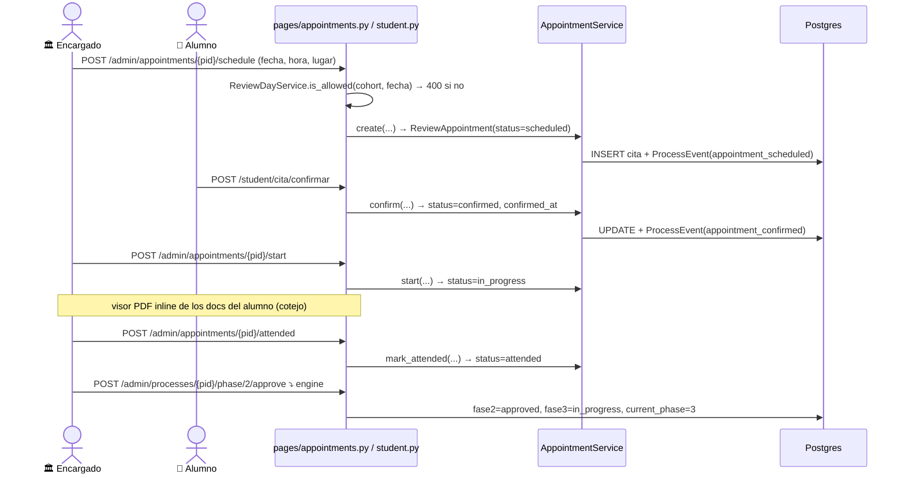

# Cita de cotejo — loop completo (Fase 2)

> **Objetivo:** Servicios Escolares agenda la cita, el alumno confirma, el encargado
> atiende el cotejo físico contra los documentos subidos, marca asistencia y aprueba
> la fase 2 (que avanza a Titulaciones / fase 3).

| | |
|---|---|
| **Actor(es)** | 🏛️ Servicios Escolares (encargado de la carrera) · 👤 Alumno |
| **Permiso(s)** | `appointment.page.list` \| `dashboard.school_services` \| `dashboard.admin` (ver agenda, `pages/appointments.py:30`) · `appointment.api.create` (:333) · `.reschedule` (:362) · `.update` (start/no-show, :392/:430) · `.mark_attended` (:411) · `appointment.page.my` (👤, `pages/student.py:471`) · `appointment.api.confirm.own` (👤, confirmar y solicitar cambio, `student.py:487,509`) · `process.api.approve_phase` |
| **Trigger** | Los 3 documentos iniciales quedaron aprobados → el proceso aparece en "Por agendar" |
| **Precondiciones** | Proceso `status == "active"`, **sin cita registrada**, y `DocumentService.initial_docs_all_approved(db, process_id) == True` (`services/appointment_service.py:104-121`) |
| **Sub-flujos** | ⤵ [motor de avance de fase](engine_approve_advance_phase.md) (paso final, separado) |
| **Estado final** | Cita `attended`; fase 2 `approved`; fase 3 `in_progress` |

> **Por carrera:** cada encargado de Servicios Escolares maneja su agenda; el filtro por
> carrera en la página separa las agendas (`officer_programs` en `pages/appointments.py:140`
> y `:199`). El alumno **solicita** cambios pero **el encargado asigna/reagenda**.
> Estados de la cita: ver [máquina de estados](00_state_machine.md).

> **Elegibilidad — corrección (jun-2026).** Este documento decía antes que "Por agendar"
> eran los procesos con `current_phase == 2`. Ya no es así: el commit `ae0dfe1`
> *"feat(titulatec): elegibilidad de cotejo = 3 documentos aprobados"* (2026-06-04) quitó ese
> filtro de `AppointmentService.list_pending_processes`. Hoy el criterio es
> `status == "active"` + sin cita + los **3 documentos iniciales aprobados**
> (`birth_certificate`, `high_school_cert`, `curp`; `services/document_service.py:8-17`).
> En la práctica coinciden —aprobar el 3.er documento aprueba la fase 1 y deja
> `current_phase=2`—, pero **la fase ya no se consulta** en el service.

## Ruta en la app (UI)

- **🏛️ Encargado:** sidebar admin → **Citas de cotejo** (`/titulatec/admin/appointments`).
  Agenda master-detail: izquierda lista (**Por agendar** = procesos elegibles sin cita ·
  **Agenda** = citas), derecha detalle. Filtros carrera / estado / "solo mías".
- **👤 Alumno:** menú del alumno (drawer/rail) → **Cita de cotejo** (`/titulatec/student/cita`):
  tarjeta de estado + checklist físico fijo (actas, CURP cert., e.Firma, encuesta, no-adeudo,
  12 fotos, IMSS, $1,900). Chrome del alumno: ver [integración en el shell](xcut_student_shell_embed.md).

## Secuencia

```mermaid
sequenceDiagram
    actor S as 🏛️ Encargado
    actor U as 👤 Alumno
    participant API as pages/appointments.py / student.py
    participant SVC as AppointmentService
    participant DB as Postgres
    S->>API: POST /admin/appointments/{pid}/schedule (fecha, hora, lugar)
    API->>API: ReviewDayService.is_allowed(cohort, fecha) → 400 si no
    API->>SVC: create(...) → ReviewAppointment(status=scheduled)
    SVC->>DB: INSERT cita + ProcessEvent(appointment_scheduled)
    U->>API: POST /student/cita/confirmar
    API->>SVC: confirm(...) → status=confirmed, confirmed_at
    SVC->>DB: UPDATE + ProcessEvent(appointment_confirmed)
    S->>API: POST /admin/appointments/{pid}/start
    API->>SVC: start(...) → status=in_progress
    Note over S,API: visor PDF inline de los docs del alumno (cotejo)
    S->>API: POST /admin/appointments/{pid}/attended
    API->>SVC: mark_attended(...) → status=attended
    S->>API: POST /admin/processes/{pid}/phase/2/approve  ⤵ engine
    API->>DB: fase2=approved, fase3=in_progress, current_phase=3
```

## Estados de la cita

`ReviewAppointment.status` solo toma **cinco** valores; son los únicos que el service escribe
(docstring en `services/appointment_service.py:7-12`, asignaciones en `:172/:194/:208/:217/:225/:235`):

| Estado | Quién lo escribe | Dónde |
|---|---|---|
| `scheduled` | 🏛️ agendar / reagendar | `create` :172 · `reschedule` :194 |
| `confirmed` | 👤 confirmar | `confirm` :235 (+ `confirmed_at`) |
| `in_progress` | 🏛️ atender | `start` :208 |
| `attended` | 🏛️ marcar asistió | `mark_attended` :217 |
| `no_show` | 🏛️ no se presentó | `mark_no_show` :225 |

> ⚠️ **`rescheduled` no existe como estado.** El comentario de la columna
> (`models/review_appointment.py:16`) todavía lo lista, pero ninguna ruta ni service lo
> escribe: reagendar devuelve la cita a `scheduled` y limpia `confirmed_at`
> (`appointment_service.py:194-195`). Lo único con ese nombre es el **evento**
> `appointment_rescheduled` (`:197`) y su etiqueta en el timeline del alumno (`pages/student.py:55`).

## Pasos detallados

| # | Actor | UI / dónde | Acción | Endpoint | Service · método | Efecto en BD | Eventos |
|---|---|---|---|---|---|---|---|
| 1 | 🏛️ | Citas · Por agendar | agendar | `POST /admin/appointments/{pid}/schedule` | `ReviewDayService.is_allowed` → `AppointmentService.create` | `ReviewAppointment(status=scheduled, scheduled_at, location, note, created_by_id)` | `appointment_scheduled` + notif `APPOINTMENT_SCHEDULED` |
| 2 | 👤 | `/student/cita` | confirmar | `POST /student/cita/confirmar` | `AppointmentService.confirm` | `status=confirmed`, `confirmed_at` | `appointment_confirmed` |
| 2b| 👤 | `/student/cita` | solicitar cambio | `POST /student/cita/solicitar-cambio` (form `reason`) | `AppointmentService.request_change` | `note="[CAMBIO] …"` (pisa la nota previa) | `appointment_change_requested` |
| 3 | 🏛️ | detalle cita | atender (en proceso) | `POST /admin/appointments/{pid}/start` | `AppointmentService.start` | `status=in_progress` | `appointment_in_progress` |
| 3v| 🏛️ | detalle cita | ver doc (cotejo) | `GET /admin/appointments/{pid}/document/{type}` | `DocumentService.get_document` + `storage.abs_path` | — (FileResponse inline en iframe) | — |
| 4 | 🏛️ | detalle cita | marcar asistió | `POST /admin/appointments/{pid}/attended` | `AppointmentService.mark_attended` | `status=attended` | `appointment_attended` |
| 4b| 🏛️ | detalle cita | reagendar | `POST /admin/appointments/{pid}/reschedule` | `ReviewDayService.is_allowed` → `AppointmentService.reschedule` | `scheduled_at`/`location` nuevos, `status=scheduled`, `confirmed_at=NULL`, `note` ← la del form | `appointment_rescheduled` + notif `APPOINTMENT_RESCHEDULED` |
| 4c| 🏛️ | detalle cita | no se presentó | `POST /admin/appointments/{pid}/no-show` | `AppointmentService.mark_no_show` | `status=no_show` | `appointment_no_show` |
| 5 | 🏛️/🎓 | detalle **proceso** | **aprobar fase 02** | `POST /admin/processes/{pid}/phase/2/approve` | `PhaseService.approve_phase` ⤵ | fase2=`approved`, fase3=`in_progress`, `current_phase=3` | `phase_approved` |

> Acciones 1–4 re-renderizan `#appt-body` (`partials/appointments_body.html`), conservando
> el proceso seleccionado. El paso 5 ocurre en el **detalle del proceso** (botón "Ir al
> proceso a aprobar fase 02" cuando la cita está `attended`).
>
> El paso 2 es el único con guarda de estado previo: `pages/student.py:498` solo confirma si el
> status de la cita es `scheduled`; la guarda vive en la página, no en `confirm()`.

## Estado resultante

- `ReviewAppointment.status = attended`, `confirmed_at` puesto.
- Fase 2 `approved`, fase 3 `in_progress`, `current_phase=3`.
- 5 `ProcessEvent` (phase 2): scheduled → confirmed → in_progress → attended → phase_approved.

## Notificaciones al alumno

Agendar (1) y reagendar (4b) avisan al alumno (`APPOINTMENT_SCHEDULED` / `APPOINTMENT_RESCHEDULED`,
con fecha+lugar, link a la fase 2) vía `services/notify.notify_student` → tab **Avisos** del shell
(`appointment_service.py:135-149`, llamadas en `:182` y `:199`). La confirmación del alumno (2) no
se auto-notifica. Ver
[integración del alumno en el shell](xcut_student_shell_embed.md#notificaciones-regla-general-de-toda-app).

## Caminos alternos / errores ❗

- **Solicitud de cambio del alumno** (2b): se guarda en `note` con prefijo `[CAMBIO] `;
  el encargado ve un banner ámbar y reagenda (4b), que reemplaza la nota y vuelve a `scheduled`.
- **"Marcar asistió" NO aprueba la fase** (decisión): es paso separado (5). Permite cotejo
  fallido sin aprobar.
- **Fecha no habilitada** (1 y 4b) → `400` + header `X-Tt-Error` sin tocar la BD
  (`pages/appointments.py:347-348` y `:376-377`).
- Filtro de carrera vacío llega como `program_id=` → los params se parsean como `str`
  (no `int|None`) para evitar 422 (gotcha conocido).

## Días configurables + calendario (jun-2026)

- **La jefa configura fechas de cotejo por convocatoria** (`titulatec_cohort_review_days`, perm
  `titulatec.cohort.api.review_days`, solo rol head) en `/admin/cohorts/{id}/review-days`
  (calendario toggle). Servicio `ReviewDayService` (`list_days`/`is_allowed`/`set_days`/`toggle`/
  `months_with_days`, `services/review_day_service.py`).
- **Agendar solo en esas fechas**: el form usa un `<select>` de fechas habilitadas
  (`allowed_days`, `pages/appointments.py:117-118` y `:130`) + hora; el endpoint valida
  `ReviewDayService.is_allowed(cohort, fecha)` → `400` + `X-Tt-Error` si no. Sin fechas
  configuradas → aviso "la jefa aún no configura días".
- **Elegibilidad ("Por agendar")** = proceso `active`, sin cita, con los **3 docs aprobados**
  (`DocumentService.initial_docs_all_approved`), ver [revisión de documentos](phase1_school_services_review_docs.md).
- **Agenda = calendario mensual** (vista default, `/admin/appointments/calendar?month=YYYY-MM`):
  días no configurados en gris/tachado, configurados clickeables con **conteo de citas**
  (`AppointmentService.counts_by_day`, acotado por scope). Click en día → detalle del día (`/day`).
  Segmentado Calendario / Del día / Lista. El visor de documentos del cotejo tiene botón **expandir** →
  modal `modal-xl`.

## Limitaciones conocidas

Verificadas contra el código al **2026-09-01**. No son bugs con ticket abierto: son el
comportamiento actual, documentado para que nadie asuma otra cosa.

- **(a) La solicitud de cambio vive en un prefijo mágico dentro de `note`.** No hay columna
  dedicada: `CHANGE_REQUEST_PREFIX = "[CAMBIO] "` (`services/appointment_service.py:24`) y la
  detección es un `startswith` de ese prefijo (`:152-153`; el texto se recorta en `:155-159`).
  `request_change` lo escribe en `:245`. Consecuencia: tanto `create` (`:171`, `appt.note = note`)
  como `reschedule` (`:196`, ídem) **pisan** esa nota con lo que venga del form —normalmente
  `None`—, así que la solicitud del alumno se pierde al reagendar; y una nota operativa que
  empiece con `[CAMBIO] ` se leería como solicitud del alumno.
- **(b) No hay cupo, duración ni validación de solape.** `create` (`:162-186`) solo consulta la
  cita del propio proceso (`get_for_process`, `:167`); nunca consulta otras citas del día.
  `ReviewAppointment` no tiene columna de duración ni de cupo (`models/review_appointment.py:12-22`),
  y `CohortReviewDay` solo guarda `cohort_id` + `date` (`models/cohort_review_day.py:17-24`).
  Dos procesos pueden quedar en el mismo `scheduled_at`; el calendario solo *cuenta*
  (`counts_by_day`, `:65-80`), no limita.
- **(c) `mark_attended` no mira el estado previo.** `:214-221` asigna `attended` sin comprobar de
  dónde viene, y el endpoint (`pages/appointments.py:407-423`) tampoco filtra: la transición
  `no_show → attended` (y `scheduled → attended`, saltándose `in_progress`) es alcanzable. Lo
  mismo aplica a `start` (`:205-212`) y `mark_no_show` (`:223-229`). La única guarda de estado
  previo en todo el flujo es la del alumno al confirmar (`pages/student.py:498`).
- **(d) El guard de días vive en las páginas, no en el service, y degrada a no-op silencioso.**
  `ReviewDayService.is_allowed` se invoca en `pages/appointments.py:347` (schedule) y `:376`
  (reschedule); `AppointmentService.create`/`reschedule` no lo llaman, así que cualquier otro
  llamador del service escribe sin validar. Además el guard está condicionado a que existan la
  fecha parseada y el proceso: si falta `appt_date` o `appt_time`, `_parse_dt` devuelve `None`
  (`:45-51`, `:341`, `:370`), no se valida, **no se crea ni modifica nada** y la ruta responde
  `200` con el cuerpo re-renderizado (`:349-353` y `:379-383`) — el usuario no ve error alguno.

## Cambio planeado (aún no implementado)

Decisión del usuario del **2026-09-01**. Nada de esto existe hoy en el código; no lo asumas
presente al leer el modelo ni al escribir código nuevo:

- `titulatec_cohort_review_days` llevará **`capacity`** y **`slot_minutes`**, de modo que cada día
  habilitado defina cuántas citas caben y de qué duración.
- El encargado agendará **seleccionando una franja** (slot) derivada de esos dos campos, en lugar
  de teclear una hora libre.
- La asignación validará el cupo de la franja **bajo `FOR UPDATE`** sobre el día, para cerrar la
  carrera entre dos encargados agendando a la vez (hoy no hay bloqueo, ver limitación **(b)**).

## Flujos relacionados

- ← Previo: [revisión de docs iniciales (pestaña Documentos)](phase1_school_services_review_docs.md).
- ⤵ Motor: [aprobar/avanzar fase](engine_approve_advance_phase.md).
- ⤵ Alcance: [días/encargados por carrera](engine_officer_scope.md).
- → Siguiente: [Formato B](phase3_student_formato_b.md).
