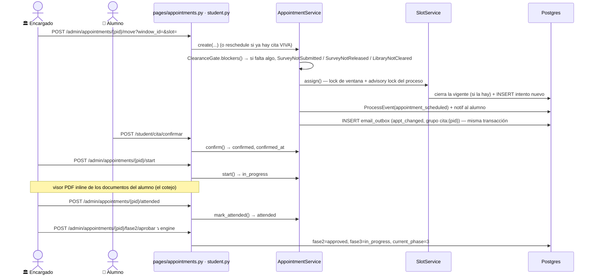

# Cita de cotejo — loop completo (Fase 2)

> **Objetivo:** el alumno queda sentado en una franja real de un encargado, se presenta, el
> encargado coteja sus documentos físicos contra los subidos, marca asistencia, palomea los
> requisitos y **dictamina la fase 2** desde esa misma pantalla.

| | |
|---|---|
| **Actor(es)** | 🏛️ Servicios Escolares (encargado de la carrera) · 👤 Alumno |
| **Permiso(s)** | **Ver la agenda:** `appointment.page.list` ∨ `dashboard.school_services` ∨ `dashboard.admin`. **Actuar:** `appointment.api.create` (agendar) · `.reschedule` (reagendar / mover) · `.update` (iniciar, no-show, deshacer, **cancelar**) · `.mark_attended` · `process.api.requirement.mark` (checklist) · `process.api.approve_phase` / `.reject_phase`. **Espacios:** `review_window.api.manage` ∨ `.manage.all`. **Alumno:** `appointment.page.my` · `.api.confirm.own` · `.api.book.own` · `.api.cancel.own` |
| **Trigger** | El proceso aparece en «Por agendar»: activo, **sin cita vigente**, **la fase 02 nunca rechazada**, los documentos iniciales de SU PERFIL aprobados (3 en licenciatura, 7 en posgrado — [perfil de titulación](engine_process_track.md); R-G exceptúa los extras de posgrado FALTANTES si la fase 1 ya cerró antes del despliegue de ese perfil), la **encuesta de egresados ya LIBERADA** por Gestión Tecnológica y Vinculación (2026-09-29, D1 — revierte D2 del 2026-09-15, que se conformaba con que la hubieran enviado) y, donde la convocatoria lo exige, el **no adeudo de biblioteca ya LIBERADO** (2026-10-01, D6 — ⤵ [no adeudo de biblioteca](phase2_library_clearance.md)) |
| **Precondiciones** | `DocumentService.initial_docs_all_approved(db, process_id)` y `ClearanceGate.is_clear(db, process_id)` (guarda dura de `AppointmentService.create`, spec 2026-10-01-titulatec-biblioteca-caja-design.md §4.4.1: `SurveyNotSubmitted`/`SurveyNotReleased` si falta la encuesta, `LibraryNotCleared` si falta el no adeudo donde la convocatoria lo exige — el PRIMER bloqueo de `ClearanceGate.blockers` es el que se levanta, encuesta primero) |
| **Sub-flujos** | ⤵ [motor de avance de fase](engine_approve_advance_phase.md) · ⤵ [alcance por carrera](engine_officer_scope.md) · ⤵ [el egresado agenda solo](phase2_student_self_booking.md) · ⤵ [no adeudo de biblioteca](phase2_library_clearance.md) (`ClearanceGate`, segunda liberación) |
| **Estado final** | Cita `attended`; fase 2 `approved`; fase 3 `in_progress` |

> **Por carrera:** cada encargado ve y atiende solo los procesos de **sus** carreras.
> `officer_programs` se resuelve **una vez** por petición (`_shell_ctx`) y alimenta todas las
> consultas de la vista; las rutas con `{process_id}` arrancan con `assert_process_in_scope` →
> **404** fuera del alcance. Ver [alcance por carrera](engine_officer_scope.md).
>
> **Estados de la cita:** los 7 valores, los 3 terminales y el eje `is_current` viven en la
> [máquina de estados](00_state_machine.md). No se duplican aquí.

> **Elegibilidad — corrección (jun-2026).** «Por agendar» **no** es `current_phase == 2`: el commit
> `ae0dfe1` quitó ese filtro de `AppointmentService.list_pending_processes`. El criterio es
> `status == "active"` + sin cita vigente + los **documentos iniciales de SU PERFIL aprobados** — 3
> en licenciatura (`birth_certificate`, `high_school_cert`, `curp`), 7 en posgrado (ver
> [perfil de titulación](engine_process_track.md); R-G exceptúa los extras de posgrado FALTANTES si
> la fase 1 ya cerró, 2026-09-30). En la práctica coinciden —aprobar el último documento aprueba la
> fase 1 y deja `current_phase=2`—, pero **la fase (en el sentido de `current_phase`) ya no se
> consulta**.
>
> **Corrección (2026-09-17): la fase SÍ vuelve a consultarse, pero por otra columna.** Desde el
> cubo «Fase 02 rechazada» (más abajo), «Por agendar» también excluye a quien tenga una
> `ProcessPhase` de `PhaseService.PHASE_COTEJO` en `status == "rejected"` — sin importar
> `current_phase`. Es lo que hace que «Por agendar» sea **solo primera vez**: sin esta resta, quien
> ya pasó por cotejo, se lo rechazaron y luego canceló su cita (D6 la devuelve a «sin cita»)
> reaparecería aquí mezclado con quien nunca tuvo cita.

> **Puerta de las LIBERACIONES — de ENVIADA a LIBERADA (2026-09-29, D1) y ampliada al no adeudo
> de biblioteca (2026-10-01, D6).** **D2 del 2026-09-15 queda REVERTIDA.** Hasta el 2026-09-29
> bastaba con que el egresado hubiera **ENVIADO** la encuesta (D2: «no liberada — GTV puede
> seguir revisando en paralelo»). Desde D1, «Por agendar» exige que Gestión Tecnológica y
> Vinculación ya la haya **LIBERADO** la encuesta, y desde el 2026-10-01 —donde la convocatoria
> tiene el requisito automático— exige ADEMÁS que Biblioteca y Caja hayan liberado el no adeudo.
> La única fuente de las dos es **`ClearanceGate`** (`services/clearance_gate.py`, spec
> `2026-10-01-titulatec-biblioteca-caja-design.md` §4.4): `status(db, pid)` da
> `{"survey": ..., "library": ...}` y `blockers(status)` la lista ORDENADA (encuesta primero) de
> lo que falta — por dentro usa `SurveyReviewService.release_status`/`.is_released` y
> `LibraryClearanceService.release_status`, las ÚNICAS comparaciones contra `'approved'`/
> `'cleared'` para esta regla (§5 invariante 2; nadie fuera del gate y de los dos dueños compara
> esos estados, prueba estructural en `test_clearance_gate.py`). Quien tiene los 3/7 documentos
> pero le falta alguna liberación —encuesta nunca enviada, `in_review`, `rejected`, o no adeudo
> `pending`/`missing`/`awaiting_payment` donde aplica— cae en el cubo **«Liberaciones
> pendientes»** (antes «Encuesta sin liberar»): filas sin arrastre, sin selección y sin
> navegación (`AppointmentService.list_missing_clearance_processes`, renombrada de
> `list_missing_survey_processes`), que solo informan con las píldoras de su estado real
> (`survey_review_pill` + `library_clearance_pill`, ver la cola de trabajo más abajo). La guarda
> dura vive en `AppointmentService.create`, **no** en la página: `SurveyNotSubmitted` si nunca
> envió la encuesta, `SurveyNotReleased` si la envió pero sigue `in_review`/`rejected`,
> `LibraryNotCleared` si le falta el no adeudo donde la convocatoria lo exige (el PRIMER bloqueo
> de `ClearanceGate.blockers` es el que se reporta) — aplica a **todo** `create`, incluido el
> intento nuevo tras un `no_show` y «Atender ahora» (D7, más abajo — reusa `create` y por tanto
> reusa esta misma guarda). Detalle completo del no adeudo: ⤵
> [no adeudo de biblioteca: Biblioteca → Caja](phase2_library_clearance.md).
>
> ⚠️ **`SlotService.assign_batch` NO pasa por `AppointmentService.create`**: inserta directo, así
> que **se saltaría esta puerta** (las dos liberaciones) si alguna vista futura lo invoca sobre
> un proceso con alguna pendiente. Hoy no tiene llamadores en producción. Quien cablee esa vista
> debe tomar los candidatos de `list_pending_processes` o duplicar la guarda dentro de
> `assign_batch`.

---

## El modelo de la agenda: días → espacios → franjas

Tres niveles, cada uno de un dueño distinto. Entender esto es entender la pantalla:

| Nivel | Tabla | Quién lo pone | Qué define |
|---|---|---|---|
| **Día de cotejo** | `titulatec_cohort_review_days` | 🏛️ **jefatura** (Convocatorias → días de cotejo) | qué fechas de la convocatoria admiten cotejo. Se **cierran** (`is_closed`), no se borran: borrar un día no puede borrar la cita de un alumno |
| **Espacio / ventana** | `titulatec_review_windows` | 🏛️ **cada encargado**, para sí mismo | su horario dentro de ese día (`start_time`, `end_time`), la duración de sus franjas (`slot_minutes`), cuántas personas caben (`capacity` — **por franja** en modo Privado/Agendable, **total del espacio** en modo Sin horario, D3), el lugar y su **visibilidad** |
| **Franja** | — *(derivada)* | 🤖 | `SlotService.slots(window)`: no se materializa en ninguna tabla. Solo cuenta la franja que cabe **entera**. En un espacio **Sin horario** (`walkin`) la derivación da **una sola franja**, a la hora de apertura, sin mirar `slot_minutes` (que se conserva en la columna, `NOT NULL`, pero no se usa) |

**El dueño de un espacio es el USUARIO, no el puesto**: `aux_school_services` tiene
`allows_multiple = TRUE` y nueve ocupantes, así que con dueño = puesto esas nueve personas
compartirían un solo horario.

Como las franjas no se materializan, cambiar `slot_minutes` con citas dentro deja citas fuera de
la rejilla; la UI las muestra en una banda **«Fuera de la rejilla»** en vez de esconderlas.

**Sin horario, en corto (2026-09-29, D3/D4 — detalle completo en el flujo del egresado):** el
egresado **aparta lugar sin elegir hora** — su cita guarda día + hora de apertura — hasta llenar
`capacity`, que en este modo es el cupo TOTAL del espacio. `SlotService.occupancy_map` (la regla;
`occupancy` es su caso de una sola ventana) cuenta **toda**
cita viva de la ventana bajo la apertura, sea cual sea su hora real: una cita de legado que un
encargado sentó a mano a otra hora (p. ej. 10:30) dentro de un `walkin` sigue ocupando un lugar y
se sigue anunciando con **su** hora, nunca el rango (regla de legado, D11 — ver
`SlotService.is_walkin_reservation`). El encargado además puede **«Abrir más lugares»** (D6, +N al
cupo total) y, si el espacio es de HOY, **«Atender ahora»** (D7, sienta y arranca el cotejo en una
sola transacción) — los dos, más abajo.

> ⚠️ **Ojo con las letras D repetidas entre specs.** D1-D12 de aquí en adelante son del spec
> **2026-09-29-titulatec-cotejo-espacios-design.md** (esta entrega). El resto del documento también
> cita `D1`-`D13` de specs MÁS VIEJAS con su propia numeración —el auto-agendado del 2026-09-15
> (p. ej. el D6 de «cancelar libera y vuelve a sin cita», líneas arriba, o el D9 del tope de
> cancelaciones) y los correos del 2026-09-28 (p. ej. el D7 del agrupado de correos, más abajo)—,
> que NO son las mismas decisiones aunque compartan letra. Cada mención de aquí en más que no traiga
> fecha es de ESTE spec (2026-09-29); las de las demás fechas se citan tal como ya vivían en el
> documento.

**Visibilidad del espacio (2026-09-16; `walkin` rediseñado el 2026-09-29):** `private` (default) ·
`bookable` (el egresado elige franja) · `walkin` — **«Sin horario»**: el egresado ve el rango,
el lugar y cuántos lugares quedan, y **aparta uno sin hora** (antes era solo un anuncio, sin
registro ni forma de reservar). Es un campo más del formulario de espacios, sin ruta ni permiso
propios. Detalle en ⤵ [el egresado agenda solo](phase2_student_self_booking.md).

---

## Ruta en la app (UI)

**🏛️ Encargado** → sidebar admin → **Citas de cotejo** (`/titulatec/admin/appointments`).
Un solo shell (`#appt-shell`) con una **zona fija** (título + segmento) y **tres sub-vistas
hermanas** — no tres zonas peleándose por el ancho:

| Sub-vista | `?v=` | Qué contiene |
|---|---|---|
| **Agenda** | `agenda` *(default)* | filtros (incluido el **buscador**, que también halla alumnos **sin cita**, D8) + **carril de días** + **tablero de espacios** — franjas y **Sin horario** juntos (`#appt-board`) + **cola de trabajo**, cinco cubos (`#appt-queue`) |
| **Atender** | `atender` | la ficha del alumno abierto, a **ancho completo**: documentos, checklist de requisitos y el dictamen de la fase 02 |
| **Espacios** | `espacios` | el horario propio del encargado: lista de sus espacios del día + editor |

Cada una declara su rejilla **una vez por breakpoint**. Lo que cambia al elegir un alumno es **qué
sub-vista se renderiza**, nunca cuánto mide una columna: por eso nada se encoge ni salta. (Antes,
abrir un alumno pasaba la agenda de 676 a 340 px y a 390 px empujaba todo 1220 px hacia abajo.)

**La cola de trabajo son CINCO cubos mutuamente excluyentes** — un proceso aparece en exactamente
uno. El orden en pantalla (fijado 2026-09-17) antepone los dos cubos que de verdad necesitan una
cita **nueva** a los que solo necesitan *seguimiento*:

1. **Por agendar** — sin cita vigente, fase 02 **nunca rechazada**, y todavía puede agendarse solo
   (o esperar al encargado). Es la **prioridad visual** de la cola (fondo y borde de acento, kicker
   «Prioridad · primera cita», contador más grande): es la única que es de **primera vez** y la que
   más rota. `AppointmentService.list_pending_processes`.
2. **Fase 02 rechazada** — la fase 02 quedó con observaciones y necesita **otra** cita (D5).
   `AppointmentService.list_rejected_cotejo_processes`.
3. **Requieren que les agendes** — agotaron su tope de cancelaciones: **solo el encargado** puede
   sacarlos de ahí. Cada fila dice el conteo («3 cancelaciones · ya no puede agendar solo»).
4. **Reagendar** — no se presentaron (`no_show`).
5. **Liberaciones pendientes** (antes «Encuesta sin liberar», ampliado 2026-10-01) — documentos
   aprobados, pero `ClearanceGate` ve que le falta alguna liberación: la encuesta de egresados
   —nunca la enviaron, o la enviaron y sigue `in_review` o `rejected` (D1, revierte D2 del
   2026-09-15)— o, donde la convocatoria lo exige, el no adeudo de biblioteca —en Biblioteca o
   por pagar en Caja (D6, ⤵ [no adeudo de biblioteca](phase2_library_clearance.md))—. Solo
   informan, con las dos píldoras (`survey_review_pill` + `library_clearance_pill`).

> **El cubo 2 se añadió el 2026-09-16, cerrando un agujero: D5 no tenía bandeja.** Un proceso
> atendido al que le rechazaban la fase 02 caía en **cero** cubos — conserva cita vigente, así que
> el universo «sin cita» de los cubos 1, 3 y 5 no lo veía, y no es `no_show`, así que «Reagendar»
> tampoco. Podía auto-agendarse, pero **solo si alguien había publicado un espacio `bookable`**, y
> `private` es el `server_default`: el día uno ese egresado no aparecía en ninguna lista de nadie.
>
> **Ampliado el 2026-09-17, cerrando el mismo agujero por la puerta de atrás.** El predicado
> original exigía `status='attended'` en la cita vigente a secas, así que a quien se le **cancelaba**
> esa cita tras el rechazo (D6: cancelar libera y vuelve a «sin cita») le pasaban DOS cosas malas a
> la vez: (a) volvía a caer en cero cubos —el mismo defecto que el cubo 2 vino a cerrar—, y (b) si
> encima ya tenía documentos y la encuesta liberada, reaparecía en «Por agendar» como si fuera de
> **primera vez**, mezclando dos historias distintas bajo el mismo contador. El fix tiene dos
> mitades que tienen que viajar juntas: `list_rejected_cotejo_processes` ahora entra también **sin
> cita vigente en absoluto** (no solo con `attended`), y `_unscheduled_query` —la base compartida de
> los cubos 1, 3 y 5— resta a todo el que tenga la fase 02 `rejected`, tenga o no cita. Un `no_show`
> vigente con la fase 02 `rejected` **sigue** en «Reagendar» y no en el cubo 2: `attended` y
> `no_show` se excluyen por construcción, así que esa disjunción no dependía de arreglar nada.
>
> **Caso real que motivó el fix (dev, proceso #39):** fase 02 `rejected` + cita vigente `attended`,
> pero **sin** `SurveyReview` (nunca se sembró/migró correctamente). Arrastrarlo a un lugar libre
> reventaba con `SurveyNotSubmitted` — un error que no dice nada en el contexto de «nada más le
> rechazaron la fase». La fila del cubo 2 resuelve `liberaciones_pendientes`
> (`bool(ClearanceGate.blockers(estado))`, `pages/appointments.py:1195`, consultas FIJAS vía
> `ClearanceGate.status_map` — D1: cubre el nunca-enviada Y el enviada-pero-sin-liberar, y desde
> 2026-10-01 también el no adeudo donde aplica) **por fila**: con alguna liberación pendiente
> pierde `draggable`/`data-tt-drag*` y muestra las píldoras de su estado real
> (`survey_review_pill(r.survey_status)` + `library_clearance_pill(r.library_status)` — «Encuesta
> pendiente» / «En revisión» / «Con observaciones» / «En Biblioteca» / «Por pagar en Caja») en su
> lugar, pero conserva la navegación (`appt_nav`) para poder ver el motivo y dar seguimiento. Con
> las dos liberaciones, arrastrable como cualquier otro cubo. También muestra `motivo`
> (`rejection_reason` de la fase 02, en una línea truncada con `title` completo) y, si aplica,
> **la misma línea de D9** que el cubo 3 («Agotó sus cancelaciones…») — `liberaciones_pendientes`
> y bloqueado por D9 no son excluyentes entre sí.

> **Ensanchado el 2026-10-02 (m41): la fase 02 YA `approved` por otra vía también se resta.**
> `_unscheduled_query` ya restaba la fase 02 `rejected` (cubo propio); le faltaba una resta
> ANÁLOGA para la fase 02 ya `approved` sin pasar por una cita aquí —una excepción manual, un dato
> heredado—: sin ella, ese proceso (nunca tuvo cita, o se le canceló la única que tuvo) seguía
> contando como «sin cita» en la base COMPARTIDA y podía reaparecer en «Por agendar», «Requieren
> que les agendes» o «Liberaciones pendientes» como si le faltara algo, cuando ya terminó su
> cotejo (mismo caso terminal que `fase_aprobada` corta del lado del auto-agendado, §3 de ⤵
> [auto-agendado](phase2_student_self_booking.md)). La resta es una consulta APARTE —a propósito,
> no fusionada con `rechazados_ids` en un solo `.in_(("rejected", "approved"))`—: cada resta
> documenta su propio motivo por separado.

La exclusión de los cubos 1 y 3 **no** se resuelve en la plantilla: la resta la hace
`list_pending_processes`, que excluye a los del cubo 3. Filtrar en el template dejaría los
**contadores** mintiendo. La del cubo 2 frente al 4 es **estructural** y no una resta: los dos
exigen cita vigente para quedar fuera del universo «sin cita», pero uno se define por `no_show` y
el otro por «`attended` o ninguna», que se excluyen por construcción. Y el cubo 2 exige además la
fase 02 **`rejected`**: el `attended` que espera dictamen no está en ningún cubo a propósito (no le
falta cita, le falta que el encargado se pronuncie), y el que la tiene **aprobada** tampoco (ya
terminó, §3 `fase_aprobada`).

El badge «por atender» del segmento suma los cubos 1+2+3+4 (por posición de pantalla: por agendar +
fase 02 rechazada + requieren que les agendes + reagendar); el de «Liberaciones pendientes» **no**
suma, porque ahí no hay nada que el encargado pueda hacer todavía. La suma no distingue si una fila
del cubo 2 tiene `liberaciones_pendientes=true` (esa sigue sin poder agendarse hasta que se libere)
— es una imprecisión conocida y no una que este cambio haya intentado cerrar.

**👤 Alumno** → tarjeta «Tu proceso» del dashboard → **«Ver mi cita»**, o menú del alumno →
**Cita de cotejo** (`/titulatec/student/cita`): tarjeta de estado + checklist de requisitos de su
convocatoria + —desde 2026-09-16— el selector para **agendar él mismo**.

## Secuencia

```mermaid
sequenceDiagram
    actor S as 🏛️ Encargado
    actor U as 👤 Alumno
    participant API as pages/appointments.py · student.py
    participant SVC as AppointmentService
    participant SLOT as SlotService
    participant DB as Postgres
    S->>API: POST /admin/appointments/{pid}/move?window_id=&slot=
    API->>SVC: create(...) (o reschedule si ya hay cita VIVA)
    SVC->>SVC: ClearanceGate.blockers() → si falta algo, SurveyNotSubmitted / SurveyNotReleased / LibraryNotCleared
    SVC->>SLOT: assign() — lock de ventana + advisory lock del proceso
    SLOT->>DB: cierra la vigente (si la hay) + INSERT intento nuevo
    SVC->>DB: ProcessEvent(appointment_scheduled) + notif al alumno
    SVC->>DB: INSERT email_outbox (appt_changed, grupo cita:{pid}) — misma transacción
    U->>API: POST /student/cita/confirmar
    API->>SVC: confirm() → confirmed, confirmed_at
    S->>API: POST /admin/appointments/{pid}/start
    API->>SVC: start() → in_progress
    Note over S,API: visor PDF inline de los documentos del alumno (el cotejo)
    S->>API: POST /admin/appointments/{pid}/attended
    API->>SVC: mark_attended() → attended
    S->>API: POST /admin/appointments/{pid}/fase2/aprobar  ⤵ engine
    API->>DB: fase2=approved, fase3=in_progress, current_phase=3
```

## Pasos detallados

Todas las rutas del encargado cuelgan de `/titulatec/admin/appointments`.

| # | Actor | UI / dónde | Acción | Endpoint | Service · método | Efecto en BD | Eventos / Notif | Correo |
|---|---|---|---|---|---|---|---|---|
| 0 | 🏛️ | Espacios | abrir/editar su espacio | `POST /espacios/{window_id}` (`nuevo` o id) | `ReviewWindowService.create` / `.update` | `titulatec_review_windows` | — | — |
| 0b| 🏛️ | Espacios | pausar · eliminar · copiar a los demás días | `POST /espacios/{id}/pausa` · `/eliminar` · `/copiar` | `toggle_pause` · `delete` · `copy_to_days` | ídem (copiar **también copia el modo**) | — | — |
| 0c| 🏛️ | Agenda · tablero (bloque **Sin horario**) | **«Abrir más lugares»** (D6): +N al cupo TOTAL | `POST /espacios/{id}/lugares` (form `n`) | `ReviewWindowService.add_places` | `titulatec_review_windows.capacity += n` (n: 1-50 por vez, tope 100 en total — D12) bajo el lock de la ventana | — | — |
| 1 | 🏛️ | Agenda · tablero | **agendar** picando un lugar libre (o arrastrando al alumno) | `POST /{pid}/move?window_id=&slot=` | `AppointmentService.create` → `SlotService.assign` | **INSERT** cita `scheduled`, `is_current`, `attempt_no=max+1`, `booked_by='officer'` | `appointment_scheduled` + notif `APPOINTMENT_SCHEDULED` | `appt_changed` (`scheduled`, `by=officer`) |
| 1b| 🏛️ | ficha | agendar desde el formulario | `POST /{pid}/schedule` | ídem | ídem | ídem | ídem |
| 1c| 🏛️ | Agenda · tablero / Atender · ficha (espacio **Sin horario** de HOY) | **«Atender ahora»** (D7): sienta al egresado y arranca el cotejo en una sola transacción | `POST /{pid}/atender-ahora` (form `window_id`) | `AppointmentService.attend_now` → `create(..., start_now=True)` | **INSERT** cita `scheduled` → `in_progress` (misma transacción), `booked_by='officer'` | `appointment_scheduled` + `appointment_in_progress`, **sin** notif in-app | — (sin correo de «agendada»: el egresado está enfrente) |
| 2 | 👤 | `/student/cita` | confirmar | `POST /student/cita/confirmar` | `AppointmentService.confirm` | `confirmed`, `confirmed_at` | `appointment_confirmed` | — |
| 2b| 👤 | `/student/cita` | solicitar cambio | `POST /student/cita/solicitar-cambio` (form `reason`) | `AppointmentService.request_change` | **columna propia** `change_request` + `change_requested_at` | `appointment_change_requested` | — |
| 2c| 👤 | `/student/cita` | **agendar / cancelar él mismo** | `POST /student/cita/agendar` · `/cancelar` | `SelfBookingService.book` · `.cancel` | ⤵ [flujo dedicado](phase2_student_self_booking.md) | `appointment_scheduled` · `appointment_cancelled`, **sin notif** | agendar: `appt_changed` (`by=student`, comprobante, D9) · cancelar: — |
| 3 | 🏛️ | Atender | iniciar el cotejo | `POST /{pid}/start` | `AppointmentService.start` | `in_progress` | `appointment_in_progress` | — |
| 3v| 🏛️ | Atender | ver documento (el cotejo) | `GET /{pid}/document/{type_code}` | `DocumentService.get_document` + `storage.abs_path` | — (FileResponse inline) | — | — |
| 4 | 🏛️ | Atender | marcar asistió | `POST /{pid}/attended` | `AppointmentService.mark_attended` | `attended` | `appointment_attended` | — (lo cubre el avance de la fase 2) |
| 4b| 🏛️ | tablero | **mover de franja** (picando el destino, o arrastrando) | `POST /{pid}/move?window_id=&slot=` | `AppointmentService.reschedule` | la vigente pasa a `superseded` (si estaba viva) e **INSERTA** la nueva | `appointment_rescheduled` + notif `APPOINTMENT_RESCHEDULED` | `appt_changed` (`rescheduled`, la cita NUEVA) |
| 4c| 🏛️ | Atender | no se presentó | `POST /{pid}/no-show` | `mark_no_show` | `no_show` — **conserva su franja ocupada** | `appointment_no_show` + notif `APPOINTMENT_NO_SHOW` | `appt_no_show`, con gracia (`not_before` = +espera del agrupado) |
| 4d| 🏛️ | Atender | **deshacer «no se presentó»** | `POST /{pid}/undo-no-show` | `undo_no_show` | `no_show → in_progress` | `appointment_undo_no_show` + notif `APPOINTMENT_NO_SHOW_UNDONE` | — (el `appt_no_show` pendiente sale `obsolete` al re-validar) |
| 4e| 🏛️ | Atender | **cancelar la cita** | `POST /{pid}/cancelar` (form `motivo`) | `AppointmentService.cancel` | `cancelled`, `is_current=False`, sella `cancelled_*`; **libera la franja** | `appointment_cancelled` + notif `APPOINTMENT_CANCELLED` | `appt_changed` (`cancelled`, con el motivo) |
| 4f| 🏛️ | Atender · checklist | marcar / dispensar / desmarcar requisito | `POST /{pid}/requisitos/{rid}` (form `action`, `note`) | `RequirementService.fulfill` / `.unfulfill` | `RequirementFulfillment(fulfilled\|waived)` o borrada | `requirement_fulfilled` / `requirement_unfulfilled` | — |
| 5 | 🏛️/🎓 | Atender | **aprobar fase 02** | `POST /{pid}/fase2/aprobar` | `PhaseService.approve_phase` ⤵ | fase2=`approved`, fase3=`in_progress`, `current_phase=3` | `phase_approved` | `phase_approved` (con el corte por omisión, `handoff=true`) |
| 5b| 🏛️ | Atender | **rechazar fase 02** (motivo obligatorio) | `POST /{pid}/fase2/rechazar` (form `reason`) | `PhaseService.reject_phase` | fase2=`rejected` + `rejection_reason` | `phase_rejected` + notif `PHASE_REJECTED` | `phase_rejected` (con el motivo) |

**Sobre el paso 1 y el 4b: son la misma ruta.** `move` decide sola cuál corresponde, y el criterio
es el **complemento exacto** de la guarda de `create`: si hay cita **viva**
(`scheduled|confirmed|in_progress`) la mueve con `reschedule`; si no —incluida una `attended` a la
que le faltaron papeles— abre un **intento nuevo** con `create`. Así los dos no pueden divergir.
Antes, `appt is None` se usaba como proxy de «no hay cita que mover» y una `attended` seguía siendo
la vigente: caía en `reschedule` → `InvalidTransition`, y el encargado no podía volver a sentar a
quien atendió y le faltaron papeles.

> **«Abrir más lugares» (0c, D6) solo existe en espacios Sin horario.** Con franjas, `capacity` es
> el cupo POR FRANJA y se edita en el editor de espacios (máx. 20); ahí `add_places` responde
> `InvalidSlot` («Solo los espacios sin horario abren lugares.»). El rango de `n` (1-50) se valida
> antes del lock; el modo y el tope total (100 desde D12 — el mismo `max` del campo «Personas en
> total» del editor; un espacio nuevo nace con 30) se validan contra la fila que `_lock_window`
> **relee** bajo el lock, para que dos encargados abriendo lugares a la vez no se pisen.
>
> **«Atender ahora» (1c, D7) tiene su propia guarda, además de la de `create`.** Solo funciona en un
> espacio **Sin horario**, **de HOY** (`db_now().date()`) y **del propio encargado** (ni siquiera
> quien tiene `manage.all` atiende aquí el espacio de otro) — si no, `NotWalkinToday`, con la MISMA
> frase que un `window_id` que no existe (el id es secuencial). El botón solo aparece en la ficha
> cuando el encargado le abriría un intento **nuevo**: sin cita viva, con un `no_show` vigente, o con
> una `attended` cuya fase 02 quedó `rejected` — nunca con una `attended` que todavía espera
> dictamen o que ya se aprobó (ahí «Mover» sigue siendo lo correcto, porque manda aviso y correo de
> reagendada al egresado que está enfrente). El doble clic lo absorbe la misma guarda de `create`
> (D4): el segundo POST encuentra la cita ya viva y responde 200 + aviso «Ese alumno ya tiene una
> cita activa…», nunca una cita duplicada.

**Reagendar NO muta la fila: inserta.** `reschedule` y `create` cierran la vigente y crean un
intento nuevo con `attempt_no+1`. El historial completo sale de `AppointmentService.list_attempts`;
`get_for_process` devuelve **solo la vigente**. Esto es lo que hace que un `no_show` **conserve su
estado y su franja ocupada** mientras el alumno recibe una fila nueva en otra.

> **Desde el 2026-09-07 el dictamen de la fase 02 se hace AQUÍ.** Antes, con la cita en `attended`,
> el panel solo ofrecía un enlace «Ir al proceso a aprobar fase 02» que mandaba al oficial al
> expediente con el alumno esperando enfrente. El checklist (4f) va al lado de los dos botones
> porque `approve_phase` se niega mientras falte un requisito obligatorio
> (`PhaseService._cotejo_gate_error`): sin él, «Aprobar» contestaría «faltan: e.firma» y obligaría
> justo al viaje que esta pantalla elimina. Las rutas 4f, 5 y 5b son **hermanas** de las del
> expediente, no las mismas: aquellas terminan en `hx-target="#exp-shell"` y cableadas aquí
> meterían el expediente dentro de `#appt-shell`.
>
> «Rechazar» es una **navegación** con `&rechazar={pid}` (el mismo idiom que «Mover de franja» usa
> con `&mover=`), que re-renderiza el panel con el textarea abierto: `hx-confirm` es sí/no y
> `prompt()` está prohibido en el proyecto.

## Estado resultante

- `ReviewAppointment.status = attended`, `is_current = True`, con sus intentos previos conservados.
- Fase 2 `approved`, fase 3 `in_progress`, `current_phase = 3`.
- `ProcessEvent` de la fase 2: `appointment_scheduled` → `confirmed` → `in_progress` → `attended`
  → `phase_approved` (más los de cada requisito palomeado).

## Notificaciones al alumno

**Cinco acciones avisan en la app**, y son estas (`_notify_appt` → `services/notify.notify_student`
→ tab **Avisos** del shell):

| Acción | Tipo | Condición |
|---|---|---|
| Agendar | `APPOINTMENT_SCHEDULED` | **salvo que agende el propio alumno** (no se le avisa de su propio clic) |
| Reagendar / mover | `APPOINTMENT_RESCHEDULED` | siempre |
| Cancelar | `APPOINTMENT_CANCELLED` | **salvo que cancele el propio alumno** (ni la revocación, `notify=False`) |
| No se presentó (desde 2026-09-28) | `APPOINTMENT_NO_SHOW` «No registramos tu asistencia a tu cita» | siempre |
| Deshacer «no se presentó» (desde 2026-09-28) | `APPOINTMENT_NO_SHOW_UNDONE` «Se corrigió tu asistencia a la cita» | siempre |

Además, el **recordatorio de la cita** (desde 2026-09-29): el barrido diario de las 9:00
(`titulatec.email_reminders` → `MailReminders.run`, `services/mail_reminders.py`) avisa
`APPOINTMENT_REMINDER` «Mañana es tu cita de cotejo» por la cita VIGENTE `scheduled`/`confirmed`
cuya fecha es la de mañana (`TITULATEC_APPT_REMINDER_DAYS_BEFORE`, 0 = apagado), salvo que se
haya agendado o movido hace menos de 24 h; una vez por cita, y solo si su correo `appt_reminder`
se encoló (fila nueva).

Los seis llevan de cuerpo «fecha · hora · lugar» y apuntan a la fase 2. **El auto-agendado no le
notifica nada al encargado**: se entera por el distintivo «El alumno agendó» de su tablero.

> La comparación «¿el actor es el alumno?» va con `int()` en los dos lados: `user["sub"]` es
> **string**, y sin la coerción `"7" != 7` es siempre verdadero — el alumno recibiría aviso de su
> propio clic y el silencio de esa rama sería mentira.

### Correo al egresado (desde 2026-09-28)

Cada acción **encola** su correo con `StudentMail` (`services/student_mail.py`) en la **misma
transacción** que la escritura de la cita; lo envía después el despachador periódico. La cita de
la fila siempre trae id (`SlotService.assign` hace `flush`; las demás ya existían).

| Acción | `kind` | Grupo / espera | Condición |
|---|---|---|---|
| Agendar (`create`) | `appt_changed`, `event=scheduled` | `cita:{pid}` | **siempre**, también si agenda el propio alumno (`by=student`): le sirve de comprobante (D9). Su in-app sigue suprimido |
| Reagendar / mover (`reschedule`) | `appt_changed`, `event=rescheduled` | `cita:{pid}` | siempre; la fila habla de la cita NUEVA |
| Cancelar (`cancel`) | `appt_changed`, `event=cancelled` + motivo | `cita:{pid}` | **la misma condición que el in-app**: ni la del propio alumno ni la de la revocación |
| No se presentó (`mark_no_show`) | `appt_no_show` | individual; `not_before` = ahora + `TITULATEC_EMAIL_DIGEST_MINUTES` | siempre; si se deshace dentro de la espera, el despachador lo da por obsoleto (D8), y también si dentro de la espera ya se le agendó otra cita o se reagendó (la del aviso dejó de ser la vigente: «ya hay una cita nueva», B3) |
| Deshacer «no se presentó» | — | — | solo in-app |

El grupo `cita:{pid}` hace que agendar y mover varias veces dentro de la espera salga en **un**
correo con la cita vigente (D7). Sin correo, a propósito: confirmar, solicitar cambio, iniciar,
«asistió» (lo cubre el avance de la fase 2) y la cancelación hecha por el propio alumno. Lo fijan
`tests/fastapi/titulatec/test_mail_hooks.py` y el barrido por AST de `test_mail_writers.py`.

## Caminos alternos / errores ❗

- **Solicitud de cambio del alumno** (2b): vive en **columna propia** (`change_request`), no en un
  prefijo mágico dentro de `note`. El encargado ve el indicador en el asiento y reagenda.
- **«Marcar asistió» NO aprueba la fase** (decisión): es el paso 5, separado. Permite cotejo
  fallido sin aprobar, y el ENCARGADO le sigue pudiendo abrir otro intento sin importar el
  veredicto. El EGRESADO es distinto desde el 2026-09-30 (D13 de
  [el auto-agendado](phase2_student_self_booking.md)): con la cita vigente `attended` y la fase 2
  SIN veredicto no puede pedir otra cita solo (`cotejo_en_dictamen`); recupera el auto-agendado en
  cuanto Servicios Escolares la RECHAZA -revierte en parte la regla del 2026-09-15, que dejaba
  agendar con cualquier `attended` sin aprobar-.
- **Día no habilitado** → `DayNotAllowed`. La guarda vive **en el service**
  (`AppointmentService.create` llama a `ReviewDayService.assert_allowed`), así que ya no depende de
  que cada página se acuerde de validar.
- **Sin datos de franja** → `MissingSchedule` (400 con mensaje). Antes esto era un `if dt:` que
  respondía 200 sin escribir nada y sin decir una palabra.
- **Franja llena** → `SlotFull` (en un espacio Sin horario, el texto habla de LUGARES: «Ese espacio
  sin horario se llenó hace un momento.», no de franja); **hora que no es franja de la rejilla** →
  `InvalidSlot`; **choque de locks** → `SlotLockTimeout` (`lock_timeout` es **LOCAL**, no de sesión:
  PgBouncer está en modo transaccional y un `SET` de sesión se le queda pegado a otro cliente).
- **Espacios Sin horario, errores propios de D3/D6:** cambiar la apertura con lugares ya apartados
  → `WalkinStartLocked` (los apartados guardan día + apertura; ampliar el CIERRE o abrir más
  lugares sí se puede); encoger el horario o el cupo total por debajo de las citas vivas →
  `WindowShrinkConflict`; pasar de franjas a Sin horario sin que quepan las vivas en el cupo total
  nuevo → `WindowModeConflict`; «Abrir más lugares» fuera de 1-50 por vez o por encima de 100 en
  total (D12) → `PlacesOutOfRange`. Las cuatro las levanta `ReviewWindowService` (crear/editar el
  espacio, o `add_places`), nunca `AppointmentService`.
- **Doble clic en «Agendar»** → `AppointmentConflict`. La guarda de `create` corre **fuera** de los
  locks, así que la que vale es la re-comprobación de dentro del advisory lock (`rechazar_activa`).
  Sin ella, el segundo clic superaba al primero y —peor— **liberaba su franja**, porque
  `superseded` libera.
- **Transición inválida** → `InvalidTransition`. Las escrituras de estado **de
  `AppointmentService`** pasan por `assert_transition`, así que `no_show → attended` ya **no** es
  alcanzable. **No es universal:** `SlotService._open_new_attempt` escribe `superseded` sobre la
  fila vieja **sin** consultar la matriz, a propósito (abrir un intento nuevo no es una transición
  del intento viejo). Ver [la nota de alcance en la máquina de estados](00_state_machine.md).
- **Filtro de carrera vacío** llega como `program_id=`: los parámetros se parsean como `str` (no
  `int|None`) para evitar un 422.
- **Las rutas del alumno solo responden con la fase 2 en curso**
  ([guarda de fase](engine_student_phase_lock.md)): `GET /student/cita` da `302` al acordeón; los
  POST dan `400` + `X-Tt-Error`. La guarda mira `process.current_phase`, **no** el estado de la cita.

## El contrato de URL de la agenda

Todos los controles llevan **la misma URL** en `href` y en `hx-get`, y apuntan a la **página**, no
a `/body`; el shell se recorta con `hx-select="#appt-shell"` y se sustituye con `morph:outerHTML` +
`hx-push-url="true"` (macros `appt_nav` / `appt_nav_filter` / `appt_action`). Consecuencia: **F5 y
el botón Atrás reconstruyen el estado exacto** y la barra de direcciones nunca acaba con un parcial
desnudo.

| Parámetro | Efecto |
|---|---|
| `v=agenda\|atender\|espacios` | sub-vista |
| `date=YYYY-MM-DD` | día abierto (sin él, `_default_day` elige **dónde está el trabajo**) |
| `selected=<process_id>` | alumno abierto (ficha de Atender) |
| `w=<window_id>\|nuevo` | espacio abierto en el editor |
| `q=` · `estado=` · `mias=1` · `program_id=` | filtros del área de trabajo (modo «resultados») |
| `p=<process_id>` | alumno «armado» para sentarlo picando un lugar |
| `mover=<process_id>` | modo «elige el lugar al que mover» |
| `rechazar=<process_id>` | abre el textarea del rechazo de la fase 02 |

`?selected=` es un **filtro, nunca una ampliación del alcance** (fue un IDOR): se valida contra el
**universo acotado completo** —toda la agenda del usuario, más su cola, más los bloqueados—, no
contra las filas de la vista; si no, abrir a alguien de «Por agendar» (que por definición no tiene
cita) sería imposible.

`mover` y `rechazar` se **descartan** tras cada acción (`_action_ctx`): son estados de «estoy a
mitad de una acción», y la acción ya terminó.

### El buscador también encuentra a quien no tiene cita (D8)

Con `q` sin vacío y **sin** `estado` (un estado de CITA no puede casar con quien no tiene ninguna,
así que con los dos puestos la lista siempre saldría vacía), el modo «resultados» agrega una
segunda sección **«Sin cita»** debajo de los resultados normales
(`_sin_cita_rows`, `pages/appointments.py`): el universo de la cola —«Por agendar», «Requieren que
les agendes», «Fase 02 rechazada» **sin** cita vigente y «Liberaciones pendientes»— que casa con `q`
(nombre completo, número de control o folio, `casefold`, sin mayúsculas), dentro del alcance ya
resuelto por `_shell_ctx` y respetando `program_id`. Reusa las listas que `_shell_ctx` YA calculó
para la cola: ninguna consulta nueva de citas.

Cada fila enlaza a la ficha (`abrible=True`) **salvo** la de «Liberaciones pendientes»: esa no está
en `visibles` (no hay ficha que darle todavía), así que sale sin enlace, solo con las píldoras de
su estado real (`survey_review_pill` + `library_clearance_pill`) — mismo criterio que la cola.

Es la MISMA sub-vista Agenda, no una ruta nueva: `ctx["rows"]` (resultados con cita) y
`ctx["sin_cita_rows"]` (sin cita) se calculan en el mismo `_shell_ctx` y se pintan en
`_appt_results.html`.

### Movimiento: solo se anima lo que cambió

`#appt-shell` lleva un `data-tt-view` **constante**, así que la puerta de `titulatec-utils.js` nunca
re-anima el shell entero en sus propios swaps. Cada zona declara un `data-tt-fade-key` con la clave
de su contenido y `static/js/admin/appointments.js` marca con `.tt-enter` solo las que cambiaron.
El indicador (`#appt-skel`) vive **fuera** del shell: dentro se destruiría estando visible.

## Cola del encargado sin consultas por candidato (2026-10-04)

Cambio de la spec `2026-10-04-titulatec-paginacion-design.md` §8, sin cambio de listas, orden, contadores ni UI. Los tres cubos del universo «sin cita» («Por agendar», «Requieren que les agendes», «Liberaciones pendientes») salen de `AppointmentService.queue_candidates` (`services/appointment_service.py:352`, antes `_pending_candidates`), calculado UNA vez por `_shell_ctx` (`pages/appointments.py:959`, uso en `:1017`) con mapas en lote: `DocumentService.initial_docs_approved_map` (`services/document_service.py:208`, misma regla perfil + R-G) y `SelfBookingService.cancellations_map` / `blocked_map` (`services/self_booking_service.py:196`, `:224`, `GROUP BY`). Los métodos por proceso y los `list_*` conservan firma y delegan. `list_appointments` puebla `process` desde su JOIN (`contains_eager`). `_shell_ctx` pasó de 252 a 40 consultas con 3 candidatos por clase y de 2115 a 40 con 30 (test de equivalencia contra el algoritmo por fila congelado). El buscador `#appt-q` ya llevaba `hx-preserve` (es el patrón que copiaron las demás bandejas).

## Ocupación en lote (2026-10-05)

Cambio de la spec `2026-10-05-titulatec-rendimiento-design.md` §3.4/§3.5 (R3/R4), sin cambio de listas, orden,
chips, textos ni UI. La regla «¿esta cita ocupa lugar?» tiene **UNA implementación, en lote**, y todo lo demás
delega en ella (invariante 2 de la spec). Todo en `services/slot_service.py`:

| Función | Qué hace |
|---|---|
| `_vivas(q)` | El filtro: `status NOT IN _ESTADOS_QUE_LIBERAN`, nunca `is_current` (⤵ [máquina de estados](00_state_machine.md)). Es la ÚNICA función que lee `_ESTADOS_QUE_LIBERAN`, en `slot_service.py` y en todo `itcj2/apps/titulatec`: lo fijan dos AST de `test_slot_occupancy_batch.py` (uno dentro del módulo, otro a lo ancho que prohíbe importarlo o citarlo en cualquier otro) |
| `occupancy_map(db, windows, *, excluir_process_id=None, walkin=None, inicio=None)` | `{window_id: {hora: n}}` con UN `SELECT window_id, scheduled_at` y `window_id IN (...)`; reparte en Python (walkin → la apertura o `inicio`; si no, la hora real). Toda ventana pedida con id sale en el mapa (`{}` sin citas); sin ventanas no consulta |
| `occupancy(db, window, ...)` | `occupancy_map(db, [window], ...)[window.id]` |
| `window_occupancy` · `window_occupancy_map(db, windows)` | (ocupados en franja real, capacidad = franjas × cupo), por ventana; `window_occupancy` = `_totales(window, occupancy(db, window))` y la de lote = un `occupancy_map` + `_totales` por ventana |
| `day_occupancy` · `day_occupancy_map(db, windows_by_day)` | lo mismo sumado por día (`_sumar`); `day_occupancy` = `_sumar(windows, occupancy_map(db, windows))` |
| `vivas_de_ventanas(db, window_ids)` | `{window_id: [citas VIVAS]}` en orden de apartado `(scheduled_at, id)`, UN SELECT con `_vivas`: la LISTA de lo que `occupancy_map` cuenta. La usa `_board_ctx` para los espacios sin horario míos (la lista numerada), así la lista y el contador de libres no divergen y la página no escribe su propio filtro por estado |
| `out_of_grid` · `out_of_grid_map(db, windows)` | la banda «Fuera de la rejilla»: un SELECT con `_vivas`; un `walkin` da `[]` sin consultar; orden `(scheduled_at, id)` (antes sin `ORDER BY`) |
| `windows_for_day` · `windows_for_days(db, day_ids, *, owner_id=None, solo_abiertas=True)` | las ventanas de varios días en un `IN`, mismo orden `(start_time, id)`; todo día pedido sale (`[]` si no tiene) |
| `free_slots` · `free_slots_from(window, ocupacion)` | la comparación contra el cupo, pura (sin BD); la usa también `SelfBookingService.offer` |

**Quién las usa** (`pages/appointments.py`): `_dias_ctx` (el carril de días) = `list_rows` → `windows_for_days` →
`day_occupancy_map`: **3 consultas fijas** para todo el carril. `_board_ctx` (el tablero) arma
`window_occupancy_map(mías + ajenas)` y `out_of_grid_map(mías con franjas)` UNA vez antes del bucle, y la lista
numerada de cada espacio sin horario mío sale de `vivas_de_ventanas` (una consulta para todos; antes la página
reescribía el filtro por estado); las ajenas ya no llaman dos veces a `window_occupancy` por ventana. **Presupuesto medido** (convocatoria sembrada, días ×
ventanas 3×2 vs 6×4, `test_slot_occupancy_batch.py`): `_dias_ctx` 10 / 31 → 3 / 3; `_board_ctx` 13 / 17 → 12 / 12;
vista completa `agenda`/día 38 / 63 → 30 / 30. En la copia de prod, `GET /titulatec/admin/appointments` pasó de 94 a
28 consultas (con la caché de authz tibia de R2). Equivalencia: oráculo congelado por ventana (`_viejo_*`) contra
los mapas — walkin, franjas, canceladas/no_show/attended, ventanas sin citas, exclusión de un proceso en dos
ventanas del mismo lote.

**Lo que sigue con una consulta por ventana** (baja frecuencia; ya delegan en la regla única, solo pagan una
consulta cada una): `_espacios_ctx` (pestaña Espacios) y `_detail_ctx` (walk-ins de hoy del encargado). La
oferta del egresado (`SelfBookingService.offer`) también pasó a lote: ⤵
[el egresado agenda su propia cita](phase2_student_self_booking.md#la-oferta-en-lote-2026-10-05).

## Limitaciones conocidas

Verificadas contra el código al **2026-09-29**. No son bugs con ticket abierto: son el
comportamiento actual, documentado para que nadie asuma otra cosa.

> **(2026-09-29): se RETIRA la limitación «`walkin` no deja rastro».** Con el sin horario apartable
> (D3/D4, spec 2026-09-29-titulatec-cotejo-espacios-design.md §3), un espacio Sin horario ya no es
> un simple anuncio: cada lugar apartado crea un `ReviewAppointment` real, igual que una franja. Ver
> «El modelo de la agenda» arriba.
>
> **Migración y reversión (I-4, revisión final):** ese cambio de semántica de `capacity` en los
> `walkin` que ya existían en producción lo aplica la migración de solo datos `tt20260929a`
> (`down_revision=tt20260928a`). El procedimiento completo de despliegue y reversión —incluido el
> aviso de contrato de la ventana blue/green y el comando exacto de `alembic downgrade`— vive en
> el `CLAUDE.md` de esta app (gitignored), §15.

- **(a) El tablero no es en vivo.** No hay Socket.IO en esta app. Cancelar libera la franja en el
  acto, pero el encargado puede estar mirando un asiento que acaba de quedar libre; se resuelve en
  el siguiente render, como todo lo demás aquí.
- **(b) El motivo de la cancelación del alumno no se pide en la UI.** La ruta lo acepta y el
  service lo guarda, pero la tarjeta no ofrece el campo (un toggle exigiría JS inline, prohibido),
  así que desde la pantalla del alumno `cancel_reason` queda `NULL`. `
`/`
` es la
  salida barata si alguien lo retoma.
- **(c) Un espacio `bookable` de alguien sin carreras asignadas no lo ve nadie.** Es fail-closed a
  propósito (Ruling 14; `read.all` no abre la oferta), y la UI lo avisa al guardar **y** en la
  lista de espacios — pero sigue siendo una trampa si se ignora el aviso.
- **(d) `?v=reparto` está en la lista blanca de sub-vistas y no tiene ninguna.** `_shell_ctx` lo
  acepta pero no construye `board`, y el template cae al `` (Agenda), que itera
  `board.grupos` → `UndefinedError` (medido sobre esa misma estructura). Es un valor muerto del
  reparto masivo (`assign_batch`, sin llamadores); nada lo enlaza, así que solo se alcanza
  escribiéndolo a mano en la URL.

## Flujos relacionados

- ← Previo: [revisión de docs iniciales (pestaña Documentos)](phase1_school_services_review_docs.md).
- ⤵ **La otra mitad de esta fase:** [el egresado agenda su propia cita](phase2_student_self_booking.md).
- 🖥️ Entrada y seguimiento: [acordeón de fases del dashboard](xcut_student_phase_detail.md) — el
  panel de la fase 2 resume fecha, lugar y si falta confirmar, **sin** dejar confirmar desde ahí.
- ⤵ Motor: [aprobar/avanzar fase](engine_approve_advance_phase.md).
- ⤵ Alcance: [días/encargados por carrera](engine_officer_scope.md).
- ⤵ Puerta previa (encuesta): [liberación GTV de la encuesta de egresados](phase2_tech_management_survey_release.md).
- ⤵ Puerta previa (no adeudo): [no adeudo de biblioteca: Biblioteca → Caja](phase2_library_clearance.md)
  — fila de solo lectura en la ficha de atender, botón de constancia previa (D9) y el cubo
  «Liberaciones pendientes».
- 📐 [Máquina de estados](00_state_machine.md) — los 7 estados y el eje `is_current`.
- → Siguiente: [Formato B](phase3_student_formato_b.md).
