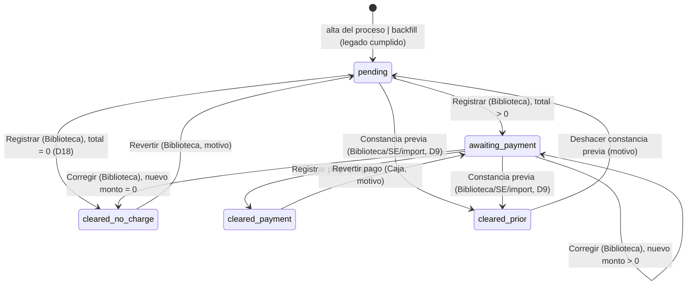

# No adeudo de biblioteca: Biblioteca → Caja (Fase 2)

> **Objetivo:** el Centro de Información (Biblioteca) revisa en FIFO a **toda** inscripción
> aceptada —desde la fase 1, sin esperar a la cita— y registra si el egresado debe algo; si
> debe, el egresado pasa **sin cita** a Caja (Recursos Financieros) a pagar el adeudo más la
> «Donación voluntaria de libro» de su convocatoria; Caja registra el pago y eso libera el
> requisito de cotejo `library_clearance`. Donde la convocatoria exige este requisito, **nadie
> agenda ni es agendado** sin el no adeudo liberado (D6) — misma severidad que la encuesta de
> egresados liberada por GTV, ⤵ [ese flujo](phase2_tech_management_survey_release.md).

| | |
|---|---|
| **Actor(es)** | 📚 Biblioteca (`titulatec_library`, puesto «Biblioteca · No adeudo» en `info_center`) · 💰 Caja (`titulatec_cashier`, puesto «Caja» en `financial_resources`) · 🏛️ Servicios Escolares (respaldo D9: donación de la convocatoria, constancia previa) · 👤 Egresado (solo lee su estado) |
| **Permiso(s)** | `titulatec.library_clearance.page.list` (bandeja Biblioteca) · `.api.register` (registrar/lote/corregir) · `.api.prior` (constancia previa, también SE) · `.api.revert` (revertir sin cargo/legado) · `.api.print_certificates` (⤵ [constancias](xcut_certificates_batch.md)) · `titulatec.library_payment.page.list` (bandeja Caja) · `.api.register` (pagar) · `.api.revert` (revertir pago) · `titulatec.cohort.api.update` (SE: donación de la convocatoria) |
| **Trigger** | `TitulationProcess` nuevo (`ImportService.import_rows`, cualquier vía de alta) → `LibraryClearanceService.open_for_process(..., just_created=True)` abre la fila `pending` EN LA MISMA transacción del alta, antes de la fase 2 |
| **Precondiciones** | Proceso admitido (`active`/`on_hold`; `cancelled`/`completed` → `ValueError`). Para pasar a Caja: la convocatoria tiene `Cohort.book_donation_amount` capturada (D19) |
| **Sub-flujos** | ⤵ [Constancias por lote](xcut_certificates_batch.md) (la constancia BIB que emite `payment`/`no_charge`) · ⤵ [Constancias previas](xcut_prior_clearances.md) (D9, el camino `prior`) · ⤵ [Correos del proceso al egresado](xcut_student_email_notifications.md) (4 `kind` nuevos) · ⤵ compone [motor de avance de fase](engine_approve_advance_phase.md) (requisito de la fase 2) · ⤵ [cita de cotejo](phase2_appointment_loop.md) y [auto-agendado](phase2_student_self_booking.md) (consumen el candado) |
| **Estado final** | `LibraryClearance.status = cleared` (`cleared_via` ∈ `payment`\|`no_charge`\|`prior`\|`legacy`) → requisito `library_clearance` `fulfilled` (`external_ref="library_clearance:{id}"`) → donde la convocatoria lo exige, `ClearanceGate` dejó de bloquear a este proceso |

Spec `docs/superpowers/specs/2026-10-01-titulatec-biblioteca-caja-design.md` §4.1.1, §4.2, §4.3,
§4.7-§4.9 (no se commitea). Dueño único de la tabla `titulatec_library_clearances` y del
cumplimiento del requisito `library_clearance`: `services/library_clearance_service.py::
LibraryClearanceService` (§5 invariante 1) — nadie más muta esa fila ni ese cumplimiento.

## Ruta en la app (UI)

1. 📚 **Biblioteca** inicia sesión → aterriza en `/titulatec/admin/biblioteca`
   (`_ROLE_DASHBOARD`) o entra por el ítem **Biblioteca** del menú admin (`bi-book`). Tres
   pestañas con contador — **Por revisar** (`pending`, FIFO por `TitulationProcess.created_at` =
   aceptación de la inscripción, *default*), **En caja** (`awaiting_payment`, FIFO por
   `ready_at`), **Liberados** (`cleared`, recientes primero) — y buscador por nombre/control, 50
   por página.
   - **Por revisar**: casilla por fila + barra «Sin adeudo (N)» (lote, confirmación) y, por
     fila, **«Sin adeudo»**, **«Con adeudo…»** (monto + nota) y **«Constancia previa…»** (fecha +
     nota, D9).
   - Aviso arriba si hay pendientes de convocatorias SIN donación capturada: «La convocatoria X
     no tiene capturada la donación voluntaria de libro; Servicios Escolares debe capturarla
     para pasar casos a Caja.»
   - **En caja**: desglose (adeudo + donación = total), nota, **«Corregir…»**.
   - **Liberados**: cómo se liberó (píldora), fecha, número de constancia, **«Revertir…»**/
     **«Deshacer…»** según permiso y `can_revert`.
2. 💰 **Caja** inicia sesión → aterriza en `/titulatec/admin/caja` o entra por **Caja**
   (`bi-cash-coin`). Buscador primero (autofocus, nombre o control, **en cualquier estado**:
   «En Biblioteca» / «Por cobrar $X» / «Liberado»), con precedencia sobre las pestañas. Sin
   buscar: **Por cobrar** (`awaiting_payment`, FIFO por `ready_at`, solo procesos admitidos) y
   **Pagados** (selector de día, hoy por omisión, con «Total del día $X»). **«Registrar pago»**
   (nº de recibo opcional, confirmación «Registrar pago de $X de NOMBRE») y **«Revertir pago…»**
   (motivo) si `can_revert`. Sin citas en Caja (D4).
3. 🏛️ **Servicios Escolares**: panel **Resumen** de la convocatoria → «Donación voluntaria de
   libro ($)» (obligatoria desde el alta) → **`POST /cohorts/{id}/donacion`**
   (`titulatec.cohort.api.update`). Cola de citas → cubo **«Liberaciones pendientes»** (antes
   «Encuesta sin liberar», ⤵ [cita de cotejo](phase2_appointment_loop.md)). Panel de atender y
   expediente (fase 2) → fila `library_clearance` de solo lectura con píldora y detalle, más
   **«Constancia previa…»**/**«Deshacer»** de respaldo (D9, con `library_clearance.api.prior`).
4. 👤 **Egresado**: dashboard → bloque «No adeudo de biblioteca» (visible desde la fase 1, solo
   si la convocatoria lo exige) y «Mi cita» → la misma fila con su píldora.

## Máquina de estados



(`cleared_no_charge`/`cleared_payment`/`cleared_prior` son el mismo `status='cleared'` con
distinto `cleared_via` — separados aquí solo para dibujar las flechas de reversa correctas;
`legacy` es un cuarto `cleared_via`, exclusivo del backfill, sin arista de entrada dibujable
porque nace ya así.)

- **Registrar** = adeudo tecleado (0 = «sin adeudo») + nota opcional. Congela
  `donation_amount` desde `Cohort.book_donation_amount` VIGENTE; `ValueError` (D19) si la
  convocatoria no la tiene capturada. **Corregir** (mismo verbo, `register()`, solo cambia el
  estado de entrada) vuelve a congelar con la donación VIGENTE de ese momento — si SE la cambió
  entre medias, la corrección la toma; lo ya cobrado NO se mueve (D16, Review Focus #2).
- **Lote «Sin adeudo»** (D10) = `register_no_debt_bulk`: adeudo 0 sobre los ids marcados, UNA
  transacción, UN commit; lo que no pasa la validación (otro estado, convocatoria sin donación,
  proceso no admitido, id inexistente) se omite con su motivo — la respuesta dice «N registrados
  · M omitidos» (`X-Tt-Notice`).
- **Total = 0** (adeudo 0 y donación 0, D18) libera DIRECTO a `cleared/no_charge` sin pasar por
  Caja. Adeudo 0 con donación > 0 SÍ pasa a Caja (el egresado paga solo la donación).
- **Revertir/Deshacer**: solo si la fase 2 del proceso NO está `approved` (gemelo de
  `SurveyReviewService.can_revoke`, §5 invariante 7). Caja revierte un **pago**
  (`revert_payment`); Biblioteca revierte una liberación **sin cargo o legado**
  (`revert_clearance`; un pago real NO se puede revertir desde aquí); una **constancia previa**
  se deshace (`undo_prior`), Biblioteca o SE.
- Cada transición: `SELECT … FOR UPDATE` + `populate_existing()` (relee lo que otra transacción
  ya hizo commit mientras se esperaba el lock), TODA la validación antes de mutar,
  `ProcessEvent` en la fase 2, aviso in-app + correo encolado en la MISMA transacción, **un**
  commit.
- Al **entrar** a `cleared` (vía `payment`/`no_charge`) → `RequirementService.fulfill` del
  requisito `library_clearance` (si la convocatoria lo tiene automático y activo) y
  `CertificateService.issue(kind="library_clearance", ...)` (⤵ [constancias](xcut_certificates_batch.md)).
  Al **salir** de `cleared` → `unfulfill` + `CertificateService.void`. `prior` y `legacy` nunca
  emiten constancia BIB (el egresado ya trae su papel).
- Al **volver a `pending`** (Revertir sin cargo/legado, Deshacer previa) la fila regresa a la
  forma de recién abierta: sin montos, nota, firma de Biblioteca, pago ni datos de constancia
  previa (lo anterior queda en el payload del `ProcessEvent`) — **salvo `ready_at`**, que se
  conserva como historia hasta la siguiente entrada a Caja.

**Ruling R10** (revisión de la Tarea 4): `ready_at` —la entrada VIGENTE a Caja, ancla del
recordatorio de pago (D14) y del FIFO de «Por cobrar»— se vuelve a fijar **solo** cuando la fila
ENTRA a `awaiting_payment` desde otro estado (Registrar desde `pending`, Revertir pago desde
`cleared/payment`), **nunca** al corregir el monto dentro de `awaiting_payment`. Y una corrección
que no cambia nada —mismo adeudo, misma donación congelada, misma nota— es **no-op**: sin
evento, sin aviso, sin correo, sin firma nueva de Biblioteca (`_same_registration`).

## El candado único ClearanceGate

`services/clearance_gate.py::ClearanceGate` es la ÚNICA fuente de «¿a este egresado le falta
alguna liberación?» (§5 invariante 2); fuera de aquí y de los dos dueños
(`SurveyReviewService`, `LibraryClearanceService`) ningún módulo compara
`SurveyReview.status`/`LibraryClearance.status` — lo fija la prueba estructural de
`test_clearance_gate.py`.

- `library_required(db, cohort_id)` → ¿hay un `CotejoRequirement` ACTIVO con
  `auto_source='library_clearance'` en esa convocatoria? **El candado de biblioteca aplica
  SOLO ahí.** Hasta que corre `titulatec init-biblioteca-caja` (que marca el requisito como
  automático en las convocatorias YA sembradas) nada cambia para nadie: desplegar el código no
  bloquea el agendado antes de que Biblioteca y Caja tengan ocupante. Una convocatoria nueva ya
  nace con el requisito automático (`CotejoRequirementService.DEFAULTS`).
- `status(db, pid)` → `{"survey": SurveyReviewService.release_status(...), "library":
  LibraryClearanceService.release_status(...)}` — `library` ∈ `missing`\|`pending`\|
  `awaiting_payment`\|`cleared`\|`not_required`. `status_map(db, ids)` en lote (consultas
  FIJAS, nunca una por proceso).
- `blockers(status)` → lista ORDENADA (**encuesta primero**) de `BLOCKERS` = `survey_missing`\|
  `survey_in_review`\|`survey_rejected`\|`library_pending`\|`library_awaiting_payment`. Un
  estado que no se reconoce bloquea (falla cerrado). `is_clear(db, pid)` → sin bloqueos.
- `released_clause()`/`not_released_clause()` — lo mismo en SQL (tres `EXISTS` correlacionados a
  `TitulationProcess`), para las consultas de la cola.

**Consumidores** (barrido de lectores, spec §4.4; ninguno guarda su propia comparación):

| Consumidor | Qué hace con el gate |
|---|---|
| `AppointmentService.create` | tras las dos de la encuesta, `LibraryNotCleared(status)` (400) si el no adeudo sigue `pending`/`missing`/`awaiting_payment` donde la convocatoria lo exige. Aplica a TODO intento nuevo, incluido tras un `no_show` o una `attended` rechazada |
| `AppointmentService._pending_candidates` / `list_missing_clearance_processes` | `released_clause()` / `not_released_clause()` — ⤵ [cita de cotejo](phase2_appointment_loop.md) |
| `SelfBookingService.eligibility` (regla 3) | `biblioteca_en_revision` (pending/missing) y `pago_pendiente` (awaiting_payment, con el total) — ⤵ [auto-agendado](phase2_student_self_booking.md) |
| `pages/appointments.py` | filas de la cola (`survey_status`/`library_status`/`liberaciones_pendientes`) y ficha de atender |
| `PhaseService._requirement_label` | sufijo «en revisión por Biblioteca» / «pendiente de pago en Caja» en la guarda de aprobar la fase 2 |
| Vistas del egresado, expediente, correos (D11) | cada una en su propia tarea — ver abajo |

## Secuencia

```mermaid
sequenceDiagram
    actor B as 📚 Biblioteca
    actor C as 💰 Caja
    participant LIB as pages/library_admin.py
    participant CAJ as pages/cashier_admin.py
    participant SVC as LibraryClearanceService
    participant CERT as CertificateService
    participant DB as Postgres

    Note over DB: ImportService.import_rows → open_for_process(just_created=True)<br/>INSERT titulatec_library_clearances (status=pending)

    B->>LIB: GET /admin/biblioteca (pestaña "Por revisar")
    LIB->>SVC: list_for_inbox(status="pending") + counts_by_status
    SVC-->>LIB: filas FIFO por alta del proceso
    LIB-->>B: #tt-library-body

    B->>LIB: POST /{clearance_id}/registrar (debt_amount, note)
    LIB->>SVC: register(..., expected_status="pending")
    SVC->>DB: SELECT ... FOR UPDATE (clearance)
    SVC->>DB: congela donation_amount vigente; total = debt + donation
    alt total > 0
        SVC->>DB: UPDATE status=awaiting_payment, ready_at=NOW()<br/>+ ProcessEvent(library_debt_registered)
        SVC->>DB: notify_student + INSERT email_outbox (library_ready)
    else total = 0 (D18)
        SVC->>DB: UPDATE status=cleared, cleared_via=no_charge<br/>+ RequirementService.fulfill(library_clearance)
        SVC->>CERT: issue(kind=library_clearance, source_ref="library_clearance:{id}")
        SVC->>DB: ProcessEvent(library_no_charge) + email_outbox (library_cleared)
    end
    SVC-->>LIB: clearance
    LIB-->>B: #tt-library-body (parcial re-renderizado)

    C->>CAJ: GET /admin/caja (buscar o pestaña "Por cobrar")
    CAJ->>SVC: search(q) | list_for_inbox(status="awaiting_payment", admitted_only=True)
    SVC-->>CAJ: filas
    CAJ-->>C: #tt-cashier-body

    C->>CAJ: POST /{clearance_id}/pagar (recibo, expected_total)
    CAJ->>SVC: register_payment(..., expected_total=)
    SVC->>DB: SELECT ... FOR UPDATE (clearance) + _check_expected
    SVC->>DB: UPDATE status=cleared, cleared_via=payment, paid_at=NOW()<br/>+ RequirementService.fulfill(library_clearance)
    SVC->>CERT: issue(kind=library_clearance, ...)
    SVC->>DB: ProcessEvent(library_payment_registered) + email_outbox (library_cleared)
    SVC-->>CAJ: clearance
    CAJ-->>C: #tt-cashier-body
```

## Pasos detallados

| # | Actor | UI / dónde | Acción | Endpoint | Service · método | Efecto en BD | Eventos / Notif | Correo |
|---|---|---|---|---|---|---|---|---|
| 1 | 🤖 | — | abre la fila al crear el proceso | `ImportService.import_rows` | `LibraryClearanceService.open_for_process(..., just_created=True)` | `titulatec_library_clearances` INSERT `status=pending` | — | — |
| 2 | 📚 | Biblioteca · Por revisar | ver / buscar / paginar | `GET /admin/biblioteca[/body]` | `list_for_inbox(status="pending")` + `counts_by_status` + `cohorts_missing_donation` | — (lectura) | — | — |
| 3 | 📚 | fila, «Sin adeudo» / «Con adeudo…» | registrar adeudo (0 o > 0) | `POST /admin/biblioteca/{clearance_id}/registrar` | `LibraryClearanceService.register` | ver máquina de estados arriba | `library_debt_registered` \| `library_no_charge` | `library_ready` \| `library_cleared` |
| 3b| 📚 | Por revisar, casillas + barra | **lote «Sin adeudo»** (D10) | `POST /admin/biblioteca/registrar` (form `ids[]`) | `register_no_debt_bulk` | N filas `pending → awaiting_payment\|cleared/no_charge`, UN commit | 1 evento por fila aplicada | 1 correo por fila aplicada |
| 4 | 📚 | En caja, «Corregir…» | corregir monto/nota | `POST /admin/biblioteca/{clearance_id}/registrar` (`expected_status=awaiting_payment`, `expected_total=`) | `register` (misma función) | `library_amount_corrected` o `cleared/no_charge` si el nuevo total es 0 | `library_amount_corrected` \| `library_no_charge` | `library_ready` (updated=True) \| `library_cleared` |
| 5 | 📚/🏛️ | fila, «Constancia previa…» | D9: ya pagó, trae su papel | `POST /admin/biblioteca/{clearance_id}/previa` (Biblioteca) · `POST /admin/processes/{pid}/no-adeudo-previo` (SE, expediente) · `POST /admin/appointments/{pid}/no-adeudo-previo` (SE, panel de atender) | `register_prior(by="library"\|"school_services")` | `pending\|awaiting_payment → cleared/prior` | `library_prior_registered` | `library_cleared` (vía prior) |
| 6 | 💰 | Caja · Por cobrar / buscador | ver / buscar / pestaña «Pagados» | `GET /admin/caja[/body]` | `search` \| `list_for_inbox(status="awaiting_payment", admitted_only=True)` \| `paid_on(day)` | — (lectura) | — | — |
| 7 | 💰 | fila, «Registrar pago» | cobrar el monto CONGELADO | `POST /admin/caja/{clearance_id}/pagar` (`recibo`, `expected_total`) | `register_payment` | `awaiting_payment → cleared/payment` | `library_payment_registered` | `library_cleared` |
| 8 | 💰 | fila Liberados, «Revertir pago…» | revertir un cobro (motivo) | `POST /admin/caja/{clearance_id}/revertir` | `revert_payment` | `cleared/payment → awaiting_payment`, `ready_at` NUEVO (R10) | `library_payment_reverted` | `library_reverted` |
| 9 | 📚 | fila Liberados, «Revertir…» | revertir sin cargo/legado (motivo) | `POST /admin/biblioteca/{clearance_id}/revertir` | `revert_clearance` | `cleared/no_charge\|legacy → pending` | `library_clearance_reverted` | `library_reverted` |
| 10| 📚/🏛️ | fila Liberados, «Deshacer…» | deshacer constancia previa (motivo) | `POST /admin/biblioteca/{clearance_id}/deshacer-previa` (Biblioteca) · rutas gemelas de SE con `{process_id}` | `undo_prior` | `cleared/prior → pending` | `library_prior_undone` | `library_reverted` |
| 11| 🏛️ | Convocatoria · Resumen | capturar/editar la donación | `POST /admin/cohorts/{id}/donacion` | `CohortService.set_book_donation` | `titulatec_cohorts.book_donation_amount` | — | — |

Las rutas de Biblioteca (`pages/library_admin.py`), Caja (`pages/cashier_admin.py`) y
Constancias van por `clearance_id`/`kind`, **nunca** por `process_id` (ninguna tiene alcance por
carrera, §4.6, §5 invariante 6, censo de `test_scope_guard.py`); las de respaldo de SE
(`pages/admin.py`, `pages/appointments.py`, filas 5 y 10) van por `{process_id}` con
`assert_process_in_scope` como PRIMERA sentencia del `try`.

## Concurrencia (Review Focus #1, Ruling R8)

Dos personas sobre la misma fila (dos de Biblioteca; Biblioteca corrige mientras Caja cobra):
cada formulario de Registrar/Corregir/Pagar manda en campos ocultos lo que el usuario VIO —
`expected_status` (Biblioteca) y `expected_total` (Biblioteca al corregir, Caja siempre) — y
`_check_expected` los compara contra la fila bajo `FOR UPDATE`: quien llega segundo recibe un
`ValueError` claro («Otra persona ya movió este caso…» / «El monto cambió mientras lo
revisabas…»), nunca un doble cobro ni un monto pisado. `expected_total` se valida con
`_check_total_shape` (finito y `>= 0`) y **nunca** con el tope `AMOUNT_MAX` (Ruling R9): ese
tope topa lo que se TECLEA (`debt_amount`); un adeudo al tope más la donación fácilmente lo
supera sin dejar de ser un total legítimo.

## Dinero (`parse_amount` / `format_amount`)

`LibraryClearanceService.parse_amount(raw) -> Decimal`: acepta «800», «800.5», «1,200.50»,
«$1,200» y «$ 1,200.50»; `ValueError` legible —sin escribir nada— si viene vacío, es negativo,
trae más de 2 decimales, notación científica o pasa de `AMOUNT_MAX = $100,000.00`. Nunca
`float`. `format_amount(value) -> "$1,200.00"`. `Numeric(10,2)`/`Decimal` en toda la tabla; CHECK
`total_amount = debt_amount + donation_amount` cuando ninguno es `NULL`.

## Servicios Escolares

- **Donación de la convocatoria** (D5): obligatoria en el alta (`CohortService.create`);
  editable después en el panel Resumen. Con casos YA en Caja de esa convocatoria, el aviso dice
  «N egresados ya tienen monto asignado; no cambia para ellos (Biblioteca puede corregir)» —
  `CohortService.set_book_donation` devuelve ese conteo (`affected`), nunca muta un
  `LibraryClearance` ya congelado.
- **Cola de citas**: cubo «Liberaciones pendientes» (antes «Encuesta sin liberar») con dos
  píldoras por fila — ⤵ [cita de cotejo](phase2_appointment_loop.md).
- **Panel de atender y expediente** (fase 2): fila `library_clearance` de solo lectura
  (`library_clearance_pill(status, via=)` + detalle: por cobrar y cuánto, constancia previa y
  fecha, o total pagado + recibo + número de constancia) — `_appt_attend.html`/`_exp_phase.html`,
  alimentada por `LibraryClearanceService.summary_for_process`. El botón «Constancia previa…»/
  «Deshacer» exige `library_clearance.api.prior` (respaldo D9: Biblioteca o Caja podrían no
  estar disponibles) y va por `{process_id}` + `assert_process_in_scope`.

## Egresado

- **Dashboard**: bloque «No adeudo de biblioteca» (visible desde la fase 1, como el de la
  encuesta, **solo** si `ClearanceGate.library_required(cohort_id)`). `pages/student.py::
  _library_block_ctx` shapea `summary_for_process` con `total_fmt`/`breakdown` ya formateados
  («adeudo $800.00 + donación voluntaria de libro $200.00», solo las partes > 0):
  «El Centro de Información está revisando tu adeudo» · «Pasa a Caja (Recursos Financieros) a
  pagar $X» + desglose + «sin cita, con tu número de control» + nota de Biblioteca · «Liberado» ·
  «Constancia previa registrada: llévala a tu cotejo».
- **«Mi cita»**: la misma fila con la misma píldora; bloqueo de agendar con los mensajes de
  `SelfBookingService.MENSAJES` (⤵ [auto-agendado](phase2_student_self_booking.md)) — **salvo**
  cuando la cita vigente ya OCUPA el cotejo (Ruling R12/R18, ver ese flujo): ahí el texto cambia
  a que Servicios Escolares necesita el no adeudo liberado para poder liberar la fase 2, nunca
  «podrás agendar».

## Correos y avisos

Cuatro `kind` nuevos (`OUTBOX_KINDS` 11 → 15), detalle completo en ⤵ [correos del proceso al
egresado](xcut_student_email_notifications.md): `library_ready` (pasa a Caja / se corrige el
monto), `library_cleared` (queda liberado, D11 con el estado vivo), `library_reverted` (se
revierte/deshace) y `library_reminder` (recordatorio diario del pago pendiente, D14, ancla
`ready_at`). Avisos in-app: `LIBRARY_READY`, `LIBRARY_CLEARED`, `LIBRARY_REVERTED`,
`LIBRARY_REMINDER` — `services/notify.notify_student`.

## Requisito `library_clearance` automático (§4.3)

`CotejoRequirementService.DEFAULTS` lleva `library_clearance` con `auto_source=
'library_clearance'` (cabe en `String(20)`) para convocatorias NUEVAS; el DML
`database/DML/titulatec/biblioteca_2026_10/22_library_requirement_auto.sql` (vía
`titulatec init-biblioteca-caja`) pone al día las filas YA sembradas, respetando las pistas que
SE ya hubiera editado. Las rutas de marcado manual del encargado (`appointments.py:1796`,
`admin.py:1982`) YA rechazaban todo `auto_source` desde la liberación GTV (2026-09-15): no
cambian. `pages/student.py` deja de pedirle al alumno «No-adeudo de biblioteca y comprobante de
la encuesta»: ahora dice que las áreas envían las constancias a Servicios Escolares.

## Estado resultante

- `LibraryClearance.status = cleared`, `cleared_via` dice cómo; requisito `library_clearance`
  (si automático y activo) `fulfilled` con `external_ref="library_clearance:{id}"`.
- `payment`/`no_charge`: una `Certificate(kind="library_clearance")` vigente, número `BIB-AAAA-
  NNNN` (⤵ [constancias](xcut_certificates_batch.md)). `prior`/`legacy`: ninguna.
- `ProcessEvent` en la fase 2 por cada transición (8 `event_type`, `LIBRARY_EVENT_TYPES`),
  visible en el expediente y el timeline del alumno.
- Donde la convocatoria exige el requisito, `ClearanceGate.is_clear` para este proceso ya no
  cuenta el bloqueo de biblioteca — si la encuesta también está liberada, el egresado puede
  agendar o ser agendado.

## Caminos alternos / errores ❗

- **Convocatoria sin donación capturada** (Registrar/Corregir) → `ValueError` con el nombre de
  la convocatoria, pidiendo a SE que la capture → `400` + `X-Tt-Error`; el aviso de arriba de la
  bandeja de Biblioteca ya lo anuncia antes de que alguien lo intente.
- **Monto fuera de forma** («1,200.50» mal agrupado, «$800», «800.5» con 3 decimales, «-5»,
  «1e3», vacío, > $100,000) → `parse_amount` da un mensaje legible, nada se escribe.
- **Proceso revocado o terminado** → `_admitted_process` levanta `ValueError` específico
  (`cancelled`/`completed`); fuera de «Por revisar» (patrón `_no_revocada_en_revision`), pero
  sigue visible en «En caja»/«Liberados» con su píldora, sin acciones.
- **Convocatoria en pausa** (`on_hold`) → Biblioteca y Caja SÍ operan (D17: solo el agendado se
  bloquea mientras la convocatoria está cerrada, no estas bandejas).
- **Dos personas sobre la misma fila** → ver «Concurrencia» arriba.
- **Revertir/Deshacer con la fase 2 ya `approved`** → `ValueError` («ya fue liberada; ya no se
  puede revertir») → `400`.
- **Revertir un pago desde Biblioteca, o un sin-cargo/legado desde Caja** → cada transición
  valida su propio `cleared_via` y manda al botón correcto («el pago lo revierte Caja» / «usa
  Deshacer constancia previa») → `400`.
- **`clearance_id`/`process_id` inexistente** → `LookupError` → `404`, sin `X-Tt-Error`.
- **Constancia previa vencida o futura** → ver ⤵ [constancias previas](xcut_prior_clearances.md#reglas-de-vigencia).
- **Lote «Sin adeudo» con selección inválida** (ids no numéricos, vacía) → `400` + `X-Tt-Error`
  ANTES de tocar el service.

## Pruebas

`tests/fastapi/titulatec/test_biblioteca_caja_models.py` (modelo + migración, ida y vuelta),
`test_library_clearance_service.py` (máquina de estados completa, concurrencia con `FOR UPDATE`,
`parse_amount`), `test_clearance_gate.py` (estado, lote, cláusula SQL, prueba estructural),
`test_library_inbox.py` / `test_cashier_inbox.py` (páginas: authz, sin `{process_id}`, swap
`outerHTML`, 400 + `X-Tt-Error`), `test_se_library_views.py` (respaldo de SE),
`test_student_library_status.py` (dashboard/Mi cita del egresado), `test_cli_biblioteca_caja.py`
(comando `init-biblioteca-caja`, dry-run, re-backfill, `_verify_biblioteca_caja`).

## Flujos relacionados

- ⤵ [Constancias por lote](xcut_certificates_batch.md) — numeración, emisión/anulación, PDF.
- ⤵ [Constancias previas](xcut_prior_clearances.md) — D9, camino `prior`, CLI de importación.
- ⤵ [Cita de cotejo (loop completo)](phase2_appointment_loop.md) — cubo «Liberaciones
  pendientes», `LibraryNotCleared`, ficha de atender.
- ⤵ [El egresado agenda su propia cita](phase2_student_self_booking.md) — regla 3 de
  `eligibility`, Rulings R12/R18.
- ⤵ [Liberación GTV de la encuesta de egresados](phase2_tech_management_survey_release.md) — la
  otra mitad del candado (`ClearanceGate`), siempre incondicional.
- ⤵ [Correos del proceso al egresado](xcut_student_email_notifications.md) — los 4 `kind` del
  no adeudo.
- ⤵ [Información para el alumno de un requisito de cotejo](phase2_school_services_requirement_info.md)
  — la pista de `library_clearance` que ve el egresado en su checklist.
- ← [Detalle de convocatoria](phase0_school_services_cohort_detail.md) — dónde SE captura la
  donación y el requisito automático.
- Máquina de estados: [`00_state_machine.md`](00_state_machine.md).
- Glosario: [`LibraryClearance`, `LibraryClearanceService`, `ClearanceGate`, roles `titulatec_library`/`titulatec_cashier`](_glossary.md).
