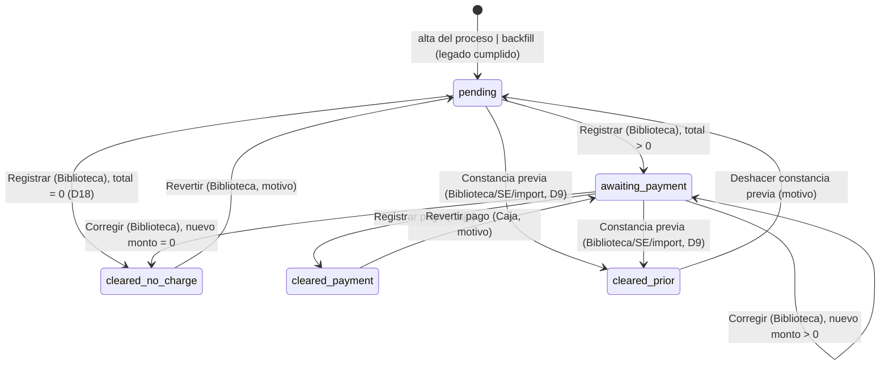

# No adeudo de biblioteca: Biblioteca → Caja (Fase 2)

> **Objetivo:** el Centro de Información (Biblioteca) revisa en FIFO a **toda** inscripción
> aceptada —desde la fase 1, sin esperar a la cita— y registra si el egresado debe algo; si
> debe, el egresado pasa **sin cita** a Caja (Recursos Financieros) a pagar el adeudo más la
> «Donación voluntaria de libro» de su convocatoria; Caja registra el pago y eso libera el
> requisito de cotejo `library_clearance`. Donde la convocatoria exige este requisito, **nadie
> agenda ni es agendado** sin el no adeudo liberado (D6) — misma severidad que la encuesta de
> egresados liberada por GTV, ⤵ [ese flujo](phase2_tech_management_survey_release.md).

| | |
|---|---|
| **Actor(es)** | 📚 Biblioteca (`titulatec_library`, puesto «Biblioteca · No adeudo» en `info_center`) · 💰 Caja (`titulatec_cashier`, puesto «Caja» en `financial_resources`) · 🏛️ Servicios Escolares (respaldo D9: donación de la convocatoria, constancia previa) · 👤 Egresado (solo lee su estado) |
| **Permiso(s)** | `titulatec.library_clearance.page.list` (bandeja Biblioteca) · `.api.register` (registrar/lote/corregir) · `.api.prior` (constancia previa, también SE) · `.api.revert` (revertir sin cargo/legado) · `.api.print_certificates` (⤵ [constancias](xcut_certificates_batch.md)) · `titulatec.library_payment.page.list` (bandeja Caja) · `.api.register` (pagar) · `.api.revert` (revertir pago) · `titulatec.cohort.api.update` (SE: donación de la convocatoria) |
| **Trigger** | `TitulationProcess` nuevo (`ImportService.import_rows`, cualquier vía de alta) → `LibraryClearanceService.open_for_process(..., just_created=True)` abre la fila `pending` EN LA MISMA transacción del alta, antes de la fase 2 |
| **Precondiciones** | Proceso admitido (`active`/`on_hold`; `cancelled`/`completed` → `ValueError`) que **todavía no pasa su cotejo** (fase 2 sin aprobar; con ella aprobada el no adeudo es `not_applicable`, Rulings R20/R21). Para pasar a Caja: la convocatoria tiene `Cohort.book_donation_amount` capturada (D19). El candado solo existe tras `titulatec activar-biblioteca-caja` (ver [Despliegue](#despliegue-en-dos-pasos-ruling-r19)) |
| **Sub-flujos** | ⤵ [Constancias por lote](xcut_certificates_batch.md) (la constancia BIB que emite `payment`/`no_charge`) · ⤵ [Constancias previas](xcut_prior_clearances.md) (D9, el camino `prior`) · ⤵ [Correos del proceso al egresado](xcut_student_email_notifications.md) (4 `kind` nuevos) · ⤵ compone [motor de avance de fase](engine_approve_advance_phase.md) (requisito de la fase 2) · ⤵ [cita de cotejo](phase2_appointment_loop.md) y [auto-agendado](phase2_student_self_booking.md) (consumen el candado) |
| **Estado final** | `LibraryClearance.status = cleared` (`cleared_via` ∈ `payment`\|`no_charge`\|`prior`\|`legacy`) → requisito `library_clearance` `fulfilled` (`external_ref="library_clearance:{id}"`) → donde la convocatoria lo exige, `ClearanceGate` dejó de bloquear a este proceso |

Spec `docs/superpowers/specs/2026-10-01-titulatec-biblioteca-caja-design.md` §4.1.1, §4.2, §4.3,
§4.7-§4.9 (no se commitea). Dueño único de la tabla `titulatec_library_clearances` y del
cumplimiento del requisito `library_clearance`: `services/library_clearance_service.py::
LibraryClearanceService` (§5 invariante 1) — nadie más muta esa fila ni ese cumplimiento.

## Ruta en la app (UI)

1. 📚 **Biblioteca** inicia sesión → aterriza en `/titulatec/admin/biblioteca`
   (`_ROLE_DASHBOARD`) o entra por el ítem **Biblioteca** del menú admin (`bi-book`). Tres
   pestañas con contador (cuatro desde 2026-10-05, ⤵ [Con observaciones](#con-observaciones-2026-10-05)) — **Por revisar** (`pending`, FIFO por `TitulationProcess.created_at` =
   aceptación de la inscripción, *default*), **En caja** (`awaiting_payment`, FIFO por
   `ready_at`), **Con observaciones** (`observed`, recientes primero), **Liberados** (`cleared`, recientes primero) — y buscador por nombre/control, 50
   por página.
   - **Por revisar**: casilla por fila + barra «Sin adeudo (N)» (lote, confirmación) y, por
     fila, **«Sin adeudo»**, **«Con adeudo…»** (monto + nota) y **«Constancia previa…»** (fecha +
     nota, D9).
   - Aviso arriba si hay pendientes de convocatorias SIN donación capturada: «La convocatoria X
     no tiene capturada la donación voluntaria de libro; Servicios Escolares debe capturarla
     para pasar casos a Caja.»
   - **En caja**: desglose (adeudo + donación = total), nota, **«Corregir…»**.
   - **Liberados**: cómo se liberó (píldora), fecha, **«Revertir…»**/**«Deshacer…»** según
     permiso y `can_revert`.
   - Columna **«Constancia»** en las TRES pestañas (2026-10-02, ⤵ [constancias por
     lote](xcut_certificates_batch.md#estado-de-impresión-ya-se-imprimió-e1e5-e7)): folio y, si ya
     se imprimió, «Impresa · lote #N · fecha» o «Sin imprimir» —con la inscripción revocada, una
     vigente sin lote pinta la píldora «No se imprimirá» y la nota tenue «inscripción revocada»,
     porque ya no entra a ningún lote (Rulings R13 y R18)—; si la última constancia se anuló
     DESPUÉS de imprimirse, «Anulada tras
     imprimir» con el lote a retirar, que abre la celda sin un «—» encima (M1). Reemplaza el folio
     suelto que antes vivía bajo «Estado», solo en «Liberados».
2. 💰 **Caja** inicia sesión → aterriza en `/titulatec/admin/caja` o entra por **Caja**
   (`bi-cash-coin`). Buscador primero (autofocus, nombre o control, **en cualquier estado**:
   «En Biblioteca» / «Por cobrar $X» / «Pagado» / «Liberado», con la píldora PROPIA de Caja —
   `caja_pill`, 2026-10-02, nunca la `library_clearance_pill` compartida—), con precedencia sobre
   las pestañas. Sin buscar: **Por cobrar** (`awaiting_payment`, FIFO por `ready_at`, solo
   procesos admitidos) y **«Corte del día»** (antes «Pagados»: selector de día, hoy por omisión,
   FIJO una vez cerrado ese día — ver «Caja: corte del día fijo» abajo). **«Registrar pago»**
   (nº de recibo opcional, confirmación «Registrar pago de $X de NOMBRE») y **«Revertir pago…»**
   (motivo) si `can_revert`. Sin citas en Caja (D4).
3. 🏛️ **Servicios Escolares**: panel **Resumen** de la convocatoria → «Donación voluntaria de
   libro ($)» (obligatoria desde el alta) → **`POST /titulatec/admin/cohorts/{cohort_id}/donacion`**
   (`titulatec.cohort.api.update`). Cola de citas → cubo **«Liberaciones pendientes»** (antes
   «Encuesta sin liberar», ⤵ [cita de cotejo](phase2_appointment_loop.md)). Panel de atender y
   expediente (fase 2) → fila `library_clearance` de solo lectura con píldora, detalle y (2026-10-02)
   la celda de constancia (folio + si ya se imprimió), más **«Constancia previa…»**/**«Deshacer»**
   de respaldo (D9, con `library_clearance.api.prior` y, desde la revisión final, nunca sobre una
   inscripción revocada —M2—).
4. 👤 **Egresado**: dashboard → bloque «No adeudo de biblioteca» (visible desde la fase 1, solo
   si la convocatoria lo exige) y «Mi cita» → la misma fila con su píldora.

## Máquina de estados



(`cleared_no_charge`/`cleared_payment`/`cleared_prior` son el mismo `status='cleared'` con
distinto `cleared_via` — separados aquí solo para dibujar las flechas de reversa correctas;
`legacy` es un cuarto `cleared_via` sin arista de entrada dibujable: lo escribe el DATO, nunca
una transición — el backfill de `tt20261001a` y, al encender el candado, el re-backfill y la
**promoción D17** de `activar-biblioteca-caja` (Ruling R20, ver [Despliegue](#despliegue-en-dos-pasos-ruling-r19)).)

**Ya pasó su cotejo (Rulings R20/R21).** Con la fase 2 `approved` y el no adeudo SIN liberar (sin
fila —el backfill salta a propósito esos procesos— o con una fila que nunca llegó a `cleared`),
`LibraryClearanceService.release_status[_map]`/`summary_for_process` dicen el pseudo-estado
**`not_applicable`** (no se guarda, como `missing`). `ClearanceGate` lo trata igual que
`not_required` (no bloquea), las vistas del egresado no lo pintan y las de SE dicen «No aplica
(cotejo ya liberado)». **Registrar**, el **lote** y la **constancia previa** lo rechazan («Este
egresado ya pasó su cotejo; no necesita trámite de no adeudo.») y **«Por revisar»** (lista,
contador y aviso de donación, `_reviewable_clause`) no lo muestra. Caja sí cobra un monto que
Biblioteca ya le mandó (`register_payment` no cambia).

- **Registrar** = adeudo tecleado (0 = «sin adeudo») + nota opcional. Congela
  `donation_amount` desde `Cohort.book_donation_amount` VIGENTE; `ValueError` (D19) si la
  convocatoria no la tiene capturada. **Corregir** (mismo verbo, `register()`, solo cambia el
  estado de entrada) vuelve a congelar con la donación VIGENTE de ese momento — si SE la cambió
  entre medias, la corrección la toma; lo ya cobrado NO se mueve (D16, Review Focus #2).
- **Lote «Sin adeudo»** (D10) = `register_no_debt_bulk`: adeudo 0 sobre los ids marcados, UNA
  transacción, UN commit; lo que no pasa la validación (otro estado o movida por otra persona,
  convocatoria sin donación, proceso no admitido, fase 2 ya aprobada, id inexistente) se omite con
  su motivo — la respuesta dice «N registrados · M omitidos» (`X-Tt-Notice`).
- **Total = 0** (adeudo 0 y donación 0, D18) libera DIRECTO a `cleared/no_charge` sin pasar por
  Caja. Adeudo 0 con donación > 0 SÍ pasa a Caja (el egresado paga solo la donación).
- **Revertir/Deshacer**: solo si la fase 2 del proceso NO está `approved` (gemelo de
  `SurveyReviewService.can_revoke`, §5 invariante 7). Caja revierte un **pago**
  (`revert_payment`); Biblioteca revierte una liberación **sin cargo o legado**
  (`revert_clearance`; un pago real NO se puede revertir desde aquí); una **constancia previa**
  se deshace (`undo_prior`), Biblioteca o SE.
- Cada transición: `SELECT … FOR UPDATE` + `populate_existing()` (relee lo que otra transacción
  ya hizo commit mientras se esperaba el lock), TODA la validación antes de mutar,
  `ProcessEvent` en la fase 2, aviso in-app + correo encolado en la MISMA transacción, **un**
  commit.
- Al **entrar** a `cleared` (vía `payment`/`no_charge`) → `RequirementService.fulfill` del
  requisito `library_clearance` (si la convocatoria lo tiene automático y activo) y
  `CertificateService.issue(kind="library_clearance", ...)` (⤵ [constancias](xcut_certificates_batch.md)).
  Al **salir** de `cleared` → `unfulfill` + `CertificateService.void`. `prior` y `legacy` nunca
  emiten constancia BIB (el egresado ya trae su papel).
- Al **volver a `pending`** (Revertir sin cargo/legado, Deshacer previa) la fila regresa a la
  forma de recién abierta: sin montos, nota, firma de Biblioteca, pago ni datos de constancia
  previa (lo anterior queda en el payload del `ProcessEvent`) — **salvo `ready_at`**, que se
  conserva como historia hasta la siguiente entrada a Caja.

**Ruling R10** (revisión de la Tarea 4): `ready_at` —la entrada VIGENTE a Caja, ancla del
recordatorio de pago (D14) y del FIFO de «Por cobrar»— se vuelve a fijar **solo** cuando la fila
ENTRA a `awaiting_payment` desde otro estado (Registrar desde `pending`, Revertir pago desde
`cleared/payment`), **nunca** al corregir el monto dentro de `awaiting_payment`. Y una corrección
que no cambia nada —mismo adeudo, misma donación congelada, misma nota— es **no-op**: sin
evento, sin aviso, sin correo, sin firma nueva de Biblioteca (`_same_registration`).

## Con observaciones (2026-10-05)

Spec `2026-10-05-titulatec-biblioteca-observaciones-design.md` (no se commitea). Biblioteca puede
**detener** a un egresado con un motivo: estado nuevo `observed`, etiqueta UI **«Con
observaciones»**. Mientras dura, el egresado no agenda y no paga; Biblioteca lo **rehabilita** y
vuelve a dictaminar. Gemelo de «GTV deja observaciones» en la encuesta, pero reversible por
Biblioteca sin intervención del egresado.

```mermaid
stateDiagram-v2
    pending --> observed: 📚 Observar (motivo)
    awaiting_payment --> observed: 📚 Observar (motivo; ready_at = NULL, montos intactos)
    observed --> observed: 📚 Actualizar observación (nuevo motivo)
    observed --> pending: 📚 Rehabilitar (montos precargan Registrar)
```



- **Quién/qué permiso**: Biblioteca, con `titulatec.library_clearance.api.register` (el mismo de
  Registrar; **sin DML ni permisos nuevos**). Rutas por `clearance_id` (nunca `process_id`, lo
  fija `test_scope_guard.py`): `POST /titulatec/admin/biblioteca/{clearance_id}/observar`
  (`pages/library_admin.py:339`, campo `reason` + `status`/`q`/`page` de vuelta) y
  `POST /titulatec/admin/biblioteca/{clearance_id}/rehabilitar` (`:369`). Las dos re-pintan la
  bandeja (pestaña/página/búsqueda de donde vinieron); reglas de negocio → `400` + `X-Tt-Error`
  (`_hdr`, ASCII), `LookupError` → `404`.
- **Service** (`services/library_clearance_service.py`, único escritor, invariante 1):
  `observe` (`:940`) y `reenable` (`:988`). Un `SELECT … FOR UPDATE` + UN commit, evento,
  aviso in-app (`LIBRARY_OBSERVED`/`LIBRARY_REENABLED`) y correo (`StudentMail.library_observed`/
  `.library_reenabled`) en la MISMA transacción.
- **Motivo**: obligatorio, `strip()`, 1..1000 caracteres (`REASON_MAX`, `:130`). Se guarda en
  `observation_reason`/`observed_by_id`/`observed_at` (`models/library_clearance.py:125-129`),
  que valen NULL fuera de `observed`; al rehabilitar se limpian y el motivo anterior queda en el
  payload del evento `library_reenabled {previous_reason}`.
- **Guardas de `observe`** (todas antes de mutar): proceso admitido (`active`/`on_hold`); no
  `cleared` («primero revierte la liberación»); **fase 2 sin aprobar** (`_assert_needs_clearance`,
  Ruling R20: quien ya pasó su cotejo no tiene trámite) → `ValueError`/`400`, nada escrito. Un
  proceso cancelado/terminado falla igual en `_admitted_process`. Desde `observed` solo
  **actualiza** el motivo (como `SurveyReviewService.reject`).
- **Desde Caja** (`awaiting_payment`): limpia `ready_at` (sale de «Por cobrar» y de los
  recordatorios de pago, que filtran por `awaiting_payment`) y **conserva los montos**. No cambia
  el requisito `library_clearance` (no estaba cumplido) ni emite/anula constancia.
- **Rehabilitar** (`reenable`): `observed` → `pending` SIEMPRE (D2), aunque tuviera montos
  —precargan el formulario de «Registrar»—; no vuelve a Caja solo. El candado sigue bloqueando
  agendar, ahora por `library_pending`, hasta que Biblioteca dictamine (Review Focus 2).
- **Con `observed` ninguna otra transición aplica**: Registrar/Corregir, lote «Sin adeudo»,
  cobrar, revertir y constancia previa levantan `ClearanceObserved` (`:215`, subclase de
  `ValueError`; `_assert_not_observed` `:1715`; mensaje «Está con observaciones de Biblioteca;
  rehabilítalo primero.»). Las páginas no leen literales de estado: capturan la excepción.
- **Bandeja de Biblioteca**: cuarta pestaña **«Con observaciones»** (`pages/library_admin.py:63`,
  contador en `counts_by_status`, que ahora trae las 4 llaves de `LIBRARY_STATUSES`; orden
  `observed_at DESC, id DESC`, `list_for_inbox` `:1133`; paginación por `utils/paging.py` + macro
  `pager`). La fila muestra motivo, quién y cuándo, **«Actualizar observación…»** y
  **«Rehabilitar»**; en «Por revisar»/«En caja» aparece **«Observar…»** (formulario con motivo).
  Plantilla: `templates/titulatec/admin/partials/library_body.html`.
- **Caja** (`pages/cashier_admin.py`): el buscador pinta «Con observaciones (Biblioteca)» (píldora
  `danger`, `cashier_body.html:71`) y **no** ofrece «Registrar pago»; el observado sale de «Por
  cobrar». Si la cajera tenía un «Por cobrar» viejo en pantalla y Biblioteca lo observó mientras
  tanto, «Registrar pago» no cobra: `ClearanceObserved` (`:247`) se traduce a **`200` + bandeja
  re-pintada + `X-Tt-Notice` (`warning`, `_MSG_CAJA_OBSERVADO` `:132`)**, igual que el choque de
  monto (R24), en vez de un `400` sin swap que dejaría la fila vieja ofreciendo cobrar (Review
  Focus 1).
- **Constancia previa / importación** (⤵ [constancias previas](xcut_prior_clearances.md)):
  `prior_outcome` devuelve `"conflict"` para `observed` (`:360-380`); la importación de previas lo
  lista en `conflicts` («Biblioteca registró observaciones en su no adeudo; lo decide
  Biblioteca», `prior_clearance_service.py:393`) en vez de abortar el lote; primero lo rehabilita
  Biblioteca.
- **Lectores** (invariante 2, solo por el dueño): `LibraryClearanceService.observation(db, pid)`
  (`:383`, `{"reason","observed_at"}` o `None`) para correos y vistas; `summary_for_process`
  trae `observation`/`observed_at`.
- **Eventos** (`models/process_event.py:71`): `library_observed {clearance_id, reason,
  from_status}` y `library_reenabled {previous_reason}`; el expediente de SE
  (`pages/admin.py:1240`, `_EVENT_UI`) y el historial del egresado (`pages/student.py:331`) los
  pintan.
- **Egresado**: píldora «Con observaciones» (`_macros.html:108`), el motivo en el bloque del
  dashboard (`student/dashboard.html:278`) y en «Mi cita» (`_cita_panel.html:80`), y el
  expediente de SE (`_exp_phase.html:213`). El hero del tablero solo pinta la píldora cuando la
  fase 2 es la actual (el motivo se lee en «Mi cita» y en el mensaje de autoagenda).
- **Migración y despliegue**: `migrations/versions/tt20261005a_titulatec_library_observations.py`
  (`down_revision = "tt20261001a"`, escrita a mano): tres columnas NULL en
  `titulatec_library_clearances` (`observation_reason`, `observed_by_id` FK `core_users`,
  `observed_at`); `status` es texto libre, no hay `CHECK` que ampliar. **Despliegue: `alembic
  upgrade head`** — sin DML, sin permisos nuevos, sin comando CLI, sin backfill (ninguna fila
  existente nace `observed`). Reversa: `alembic downgrade -1` devuelve las filas `observed` a
  `pending` antes de borrar las columnas.

## El candado único ClearanceGate

`services/clearance_gate.py::ClearanceGate` es la ÚNICA fuente de «¿a este egresado le falta
alguna liberación?» (§5 invariante 2); fuera de aquí y de los dos dueños
(`SurveyReviewService`, `LibraryClearanceService`) ningún módulo compara
`SurveyReview.status`/`LibraryClearance.status` — lo fija la prueba estructural de
`test_clearance_gate.py`.

- `library_required(db, cohort_id)` → ¿hay un `CotejoRequirement` ACTIVO con
  `auto_source='library_clearance'` en esa convocatoria? **El candado de biblioteca aplica
  SOLO ahí.** Hasta que corre `titulatec activar-biblioteca-caja` (que marca el requisito como
  automático en las convocatorias YA sembradas; `init-biblioteca-caja` ya NO lo hace, Ruling
  R19) nada cambia para nadie: desplegar el código no bloquea el agendado antes de que Biblioteca
  y Caja tengan ocupante. Una convocatoria nueva ya nace con el requisito automático
  (`CotejoRequirementService.DEFAULTS`).
- `status(db, pid)` → `{"survey": SurveyReviewService.release_status(...), "library":
  LibraryClearanceService.release_status(...)}` — dominios CERRADOS (`SURVEY_STATES`,
  `LIBRARY_STATES`, los fija la prueba): `library` ∈ `missing`\|`pending`\|`awaiting_payment`\|
  `observed`\|`cleared`\|`not_required`\|`not_applicable`. `status_map(db, ids)` en lote (consultas FIJAS,
  nunca una por proceso; la de biblioteca trae fila y fase 2 en UNA consulta).
- `blockers(status)` → lista ORDENADA (**encuesta primero**) de `BLOCKERS` = `survey_missing`\|
  `survey_in_review`\|`survey_rejected`\|`library_pending`\|`library_awaiting_payment`\|`library_observed`
  (2026-10-05, `clearance_gate.py:98-108`). En
  biblioteca no bloquean `cleared`, `not_required` ni `not_applicable`. Un estado que no se
  reconoce bloquea (falla cerrado). `is_clear(db, pid)` → sin bloqueos.
- `released_clause()`/`not_released_clause()` — lo mismo en SQL (cuatro `EXISTS`
  correlacionados a `TitulationProcess`: encuesta liberada, convocatoria con candado, no adeudo
  liberado y fase 2 aprobada), para las consultas de la cola.

**Consumidores** (barrido de lectores, spec §4.4; ninguno guarda su propia comparación):

| Consumidor | Qué hace con el gate |
|---|---|
| `AppointmentService.create` | tras las dos de la encuesta, `LibraryNotCleared(status)` (400) si el no adeudo sigue `pending`/`missing`/`awaiting_payment`/`observed` (este último con mensaje propio, `appointment_errors.py:250`) donde la convocatoria lo exige. Aplica a TODO intento nuevo, incluido tras un `no_show` o una `attended` rechazada |
| `AppointmentService.queue_candidates` / `list_missing_clearance_processes` | `released_clause()` / `not_released_clause()` — ⤵ [cita de cotejo](phase2_appointment_loop.md) |
| `SelfBookingService.eligibility` (regla 3) | `biblioteca_en_revision` (pending/missing), `pago_pendiente` (awaiting_payment, con el total) y `biblioteca_con_observaciones` (observed, 2026-10-05) — ⤵ [auto-agendado](phase2_student_self_booking.md) |
| `pages/appointments.py` | filas de la cola (`survey_status`/`library_status`/`liberaciones_pendientes`) y ficha de atender |
| `PhaseService._requirement_label` | sufijo «en revisión por Biblioteca» / «pendiente de pago en Caja» / «con observaciones de Biblioteca» (`phase_service.py:295`) en la guarda de aprobar la fase 2 |
| Vistas del egresado, expediente, correos (D11) | cada una en su propia tarea — ver abajo |

## Secuencia

```mermaid
sequenceDiagram
    actor B as 📚 Biblioteca
    actor C as 💰 Caja
    participant LIB as pages/library_admin.py
    participant CAJ as pages/cashier_admin.py
    participant SVC as LibraryClearanceService
    participant CERT as CertificateService
    participant DB as Postgres

    Note over DB: ImportService.import_rows → open_for_process(just_created=True)<br/>INSERT titulatec_library_clearances (status=pending)

    B->>LIB: GET /admin/biblioteca (pestaña "Por revisar")
    LIB->>SVC: list_for_inbox(status="pending") + counts_by_status
    SVC-->>LIB: filas FIFO por alta del proceso
    LIB-->>B: #tt-library-body

    B->>LIB: POST /{clearance_id}/registrar (debt_amount, note)
    LIB->>SVC: register(..., expected_status="pending")
    SVC->>DB: SELECT ... FOR UPDATE (clearance)
    SVC->>DB: congela donation_amount vigente; total = debt + donation
    alt total > 0
        SVC->>DB: UPDATE status=awaiting_payment, ready_at=NOW()<br/>+ ProcessEvent(library_debt_registered)
        SVC->>DB: notify_student + INSERT email_outbox (library_ready)
    else total = 0 (D18)
        SVC->>DB: UPDATE status=cleared, cleared_via=no_charge<br/>+ RequirementService.fulfill(library_clearance)
        SVC->>CERT: issue(kind=library_clearance, source_ref="library_clearance:{id}")
        SVC->>DB: ProcessEvent(library_no_charge) + email_outbox (library_cleared)
    end
    SVC-->>LIB: clearance
    LIB-->>B: #tt-library-body (parcial re-renderizado)

    C->>CAJ: GET /admin/caja (buscar o pestaña "Por cobrar")
    CAJ->>SVC: search(q) | list_for_inbox(status="awaiting_payment", admitted_only=True)
    SVC-->>CAJ: filas
    CAJ-->>C: #tt-cashier-body

    C->>CAJ: POST /{clearance_id}/pagar (recibo, expected_total)
    CAJ->>SVC: register_payment(..., expected_total=)
    SVC->>DB: SELECT ... FOR UPDATE (clearance) + _check_expected
    SVC->>DB: UPDATE status=cleared, cleared_via=payment, paid_at=NOW()<br/>+ RequirementService.fulfill(library_clearance)
    SVC->>CERT: issue(kind=library_clearance, ...)
    SVC->>DB: ProcessEvent(library_payment_registered) + email_outbox (library_cleared)
    SVC-->>CAJ: clearance
    CAJ-->>C: #tt-cashier-body
```

## Pasos detallados

| # | Actor | UI / dónde | Acción | Endpoint | Service · método | Efecto en BD | Eventos / Notif | Correo |
|---|---|---|---|---|---|---|---|---|
| 1 | 🤖 | — | abre la fila al crear el proceso | `ImportService.import_rows` | `LibraryClearanceService.open_for_process(..., just_created=True)` | `titulatec_library_clearances` INSERT `status=pending` | — | — |
| 2 | 📚 | Biblioteca · Por revisar | ver / buscar / paginar | `GET /admin/biblioteca[/body]` | `list_for_inbox(status="pending")` + `counts_by_status` + `cohorts_missing_donation` | — (lectura) | — | — |
| 3 | 📚 | fila, «Sin adeudo» / «Con adeudo…» | registrar adeudo (0 o > 0) | `POST /admin/biblioteca/{clearance_id}/registrar` | `LibraryClearanceService.register` | ver máquina de estados arriba | `library_debt_registered` \| `library_no_charge` | `library_ready` \| `library_cleared` |
| 3b| 📚 | Por revisar, casillas + barra | **lote «Sin adeudo»** (D10) | `POST /admin/biblioteca/registrar` (form `ids[]`) | `register_no_debt_bulk` | N filas `pending → awaiting_payment\|cleared/no_charge`, UN commit | 1 evento por fila aplicada | 1 correo por fila aplicada |
| 4 | 📚 | En caja, «Corregir…» | corregir monto/nota | `POST /admin/biblioteca/{clearance_id}/registrar` (`expected_status=awaiting_payment`, `expected_total=`) | `register` (misma función) | `library_amount_corrected` o `cleared/no_charge` si el nuevo total es 0 | `library_amount_corrected` \| `library_no_charge` | `library_ready` (updated=True) \| `library_cleared` |
| 5 | 📚/🏛️ | fila, «Constancia previa…» | D9: ya pagó, trae su papel | `POST /admin/biblioteca/{clearance_id}/previa` (Biblioteca) · `POST /admin/processes/{pid}/no-adeudo-previo` (SE, expediente) · `POST /admin/appointments/{pid}/no-adeudo-previo` (SE, panel de atender) | `register_prior(by="library"\|"school_services")` | `pending\|awaiting_payment → cleared/prior` | `library_prior_registered` | `library_cleared` (vía prior) |
| 6 | 💰 | Caja · Por cobrar / buscador | ver / buscar / pestaña «Corte del día» | `GET /admin/caja[/body]` | `search` \| `list_for_inbox(status="awaiting_payment", admitted_only=True)` \| `day_cut(day)` | — (lectura) | — | — |
| 7 | 💰 | fila, «Registrar pago» | cobrar el monto CONGELADO | `POST /admin/caja/{clearance_id}/pagar` (`recibo`, `expected_total`) | `register_payment` | `awaiting_payment → cleared/payment` | `library_payment_registered` | `library_cleared` |
| 8 | 💰 | fila Liberados, «Revertir pago…» | revertir un cobro (motivo) | `POST /admin/caja/{clearance_id}/revertir` | `revert_payment` | `cleared/payment → awaiting_payment`, `ready_at` NUEVO (R10) | `library_payment_reverted` | `library_reverted` |
| 9 | 📚 | fila Liberados, «Revertir…» | revertir sin cargo/legado (motivo) | `POST /admin/biblioteca/{clearance_id}/revertir` | `revert_clearance` | `cleared/no_charge\|legacy → pending` | `library_clearance_reverted` | `library_reverted` |
| 10| 📚/🏛️ | fila Liberados, «Deshacer…» | deshacer constancia previa (motivo) | `POST /admin/biblioteca/{clearance_id}/deshacer-previa` (Biblioteca) · rutas gemelas de SE con `{process_id}` | `undo_prior` | `cleared/prior → pending` | `library_prior_undone` | `library_reverted` |
| 11| 🏛️ | Convocatoria · Resumen | capturar/editar la donación | `POST /admin/cohorts/{cohort_id}/donacion` | `CohortService.set_book_donation` | `titulatec_cohorts.book_donation_amount` | — | — |

Las rutas de Biblioteca (`pages/library_admin.py`), Caja (`pages/cashier_admin.py`) y
Constancias van por `clearance_id`/`kind`, **nunca** por `process_id` (ninguna tiene alcance por
carrera, §4.6, §5 invariante 6, censo de `test_scope_guard.py`); las de respaldo de SE
(`pages/admin.py`, `pages/appointments.py`, filas 5 y 10) van por `{process_id}` con
`assert_process_in_scope` como PRIMERA sentencia del `try`.

## Concurrencia (Review Focus #1, Rulings R8 y R24)

Dos personas sobre la misma fila (dos de Biblioteca; Biblioteca corrige mientras Caja cobra):
cada formulario de Registrar/Corregir/Pagar manda en campos ocultos lo que el usuario VIO —
`expected_status` (Biblioteca) y `expected_total` (Biblioteca al corregir, Caja siempre) — y
`_check_expected` los compara contra la fila bajo `FOR UPDATE`: quien llega segundo recibe
`ClearanceConflict` (subclase de `ValueError`: «Otra persona ya movió este caso…» / «El monto
cambió mientras lo revisabas: ahora es $X…»), nunca un doble cobro ni un monto pisado.

**Ruling R24:** ese choque NO es un 400. `pages/library_admin.py::register` y
`pages/cashier_admin.py::pay` responden **200** con la bandeja **re-pintada** —la fila ya con su
estado y monto vigentes, para volver a confirmar— y el motivo en `X-Tt-Notice` con
`X-Tt-Notice-Kind: warning` (el patrón de colisión de estado que pinta `titulatec-utils.js`).
Con un 400 htmx no hacía swap: la fila seguía mostrando lo viejo y reintentar volvía a fallar.
El lote ya lo hacía (la fila movida se omite con su motivo). Las demás reglas de negocio siguen
en `400` + `X-Tt-Error`.

`expected_total` se valida con `_check_total_shape` (finito y `>= 0`; un total mal formado es un
`ValueError` cualquiera, 400) y **nunca** con el tope `AMOUNT_MAX` (Ruling R9): ese tope topa lo
que se TECLEA (`debt_amount`); un adeudo al tope más la donación fácilmente lo supera sin dejar
de ser un total legítimo.

## Dinero (`parse_amount` / `format_amount`)

`parse_amount(raw) -> Decimal` y `format_amount(value) -> str` son funciones de MÓDULO en
`services/library_clearance_service.py` (no métodos de `LibraryClearanceService`; los
llamadores —`pages/library_admin.py`, `pages/cashier_admin.py`, `pages/admin.py`— las importan
sueltas). `parse_amount` acepta «800», «800.5», «1,200.50», «$1,200» y «$ 1,200.50»; `ValueError`
legible —sin escribir nada— si viene vacío, es negativo, trae más de 2 decimales, notación
científica o pasa de `AMOUNT_MAX = $100,000.00`. Nunca `float`. `format_amount(value) ->
"$1,200.00"`. `Numeric(10,2)`/`Decimal` en toda la tabla; CHECK
`total_amount = debt_amount + donation_amount` cuando ninguno es `NULL`.

## Caja: corte del día fijo (2026-10-02, E3)

Pedido del usuario: el corte de un día no debe moverse después de cerrado. `LibraryClearanceService.
day_cut(db, day) -> dict` reemplazó a `paid_on` (que leía la fila VIGENTE por `paid_at`: una
reversa posterior la bajaba en silencio, incluso de un día YA cerrado). Fuente: la bitácora
(`titulatec_process_events`), con `created_at` en `[día, día+1)` — invariante 3 de la spec: los
eventos no se editan ni se borran, así que el corte de HOY nunca lo mueve algo que pase mañana.

- `library_payment_registered` es un **cobro** (monto con signo `+`); `library_payment_reverted`
  es una **reversa** (signo `−`, con el motivo y la fecha del cobro que revirtió). Devuelve
  `{"rows", "charged", "reverted", "net"}`, todo `Decimal` a centavos —`charged`/`reverted` no
  negativos, `net = charged - reverted` sí puede serlo (un día con solo reversas de cobros de
  OTRO día)—. **Review Focus #3**: cobro ayer + reversa hoy deja el corte de ayer intacto y el de
  hoy con el `−monto`; cobro + reversa + cobro el mismo día deja 3 renglones con neto de un cobro.
- Cada renglón trae hora, egresado, control, carrera, el movimiento (cobro/reversa), el monto con
  signo, recibo (en una reversa, el del cobro que revirtió), quién lo hizo, motivo/cobro original
  (solo reversas), el folio que ESE evento trae en su payload (histórico, no necesariamente el
  vigente) y `can_revert_here`. Tolerante a payloads viejos sin `total` o con uno no finito
  (`NaN`/`sNaN`/`Infinity`): cuenta como `Decimal("0.00")`, nunca truena.
- **«Revertir…» solo en el cobro VIGENTE** (`can_revert_here`): su folio de payload es la
  constancia vigente de la fila **y** la fila sigue siendo revertible AHORA
  (`LibraryClearanceService._revertible_ids`, el MISMO predicado batched que usa `can_revert`/
  `_rows`: liberada, proceso admitido, fase 2 sin aprobar). En LOTE —hasta 2 consultas de folios
  vigentes vía `CertificateService.print_status_map` + 1 de `_revertible_ids`—, nunca una por
  renglón. Como cada cobro saca un folio nuevo, dos cobros de la misma fila (uno revertido, el
  vigente) solo pueden coincidir con el folio vigente en el más reciente.
- **Pestaña «Corte del día»** (la clave sigue siendo `pagados`; la etiqueta cambió de «Pagados»).
  Encabezado: «Cobrado $X · Revertido −$Y · **Total del día $Z**» (el signo «−» solo aparece si
  `reverted`/`net` son negativos). Un día sin movimientos dice «No hay movimientos ese día.».
  Revertir desde un día que NO es hoy avisa en `X-Tt-Notice`: «Pago revertido. La reversa (−$X)
  quedó en el corte de hoy (dd/mm/aaaa).» — la reversa SIEMPRE entra al corte de HOY, nunca al del
  cobro original.
- **Caja tiene su propia píldora** (E11/m27, macro `caja_pill` en `cashier_body.html`, no la
  `library_clearance_pill` compartida —la usan más de 12 vistas—): «Revocada» · «Por cobrar $X» ·
  «Pagado» (`via == 'payment'`) · «Liberado» (otro `cleared`) · «En Biblioteca» (cualquier otro).
  Se usa en la tabla de búsqueda/«Por cobrar»; la tabla del «Corte del día» no lleva píldora de
  caso, solo la etiqueta Cobro/Reversa del renglón.
- **Sin columna «Constancia»** en ninguna de las dos tablas de Caja: el folio histórico SÍ viaja
  en cada renglón del corte (`certificate`) y el folio vigente sigue bajo la píldora en la tabla de
  búsqueda/«Por cobrar» (`r.certificate_number`, sin `certificate_cell`) — ver ⤵ [constancias por
  lote](xcut_certificates_batch.md#estado-de-impresión-ya-se-imprimió-e1e5-e7).
- **Sin migración**: `titulatec_process_events.created_at` ya tenía índice; en producción no hay
  datos previos porque la función no se había desplegado.

## Servicios Escolares

- **Donación de la convocatoria** (D5): obligatoria en el alta (`CohortService.create`);
  editable después en el panel Resumen. Con casos YA en Caja de esa convocatoria, el aviso dice
  «N egresados ya tienen monto asignado; no cambia para ellos (Biblioteca puede corregir)» —
  `CohortService.set_book_donation` devuelve ese conteo (`affected`), nunca muta un
  `LibraryClearance` ya congelado.
- **Cola de citas**: cubo «Liberaciones pendientes» (antes «Encuesta sin liberar») con dos
  píldoras por fila — ⤵ [cita de cotejo](phase2_appointment_loop.md).
- **Panel de atender y expediente** (fase 2): fila `library_clearance` de solo lectura
  (`library_clearance_pill(status, via=)` + detalle: por cobrar y cuánto, constancia previa y
  fecha, o total pagado + recibo) — `_appt_attend.html`/`_exp_phase.html`, alimentada por
  `LibraryClearanceService.summary_for_process`. El botón «Constancia previa…»/«Deshacer» exige
  `library_clearance.api.prior` (respaldo D9: Biblioteca o Caja podrían no estar disponibles) Y el
  proceso no revocado —`can_register_prior` pide `proc.status != 'cancelled'` en las DOS vistas;
  hasta la revisión final (M2) el panel de atender solo miraba el permiso y le ofrecía el
  formulario a un revocado con su cita `attended` vigente, junto a la «Revocada» de m42, y la ruta
  contestaba 400— y va por `{process_id}` + `assert_process_in_scope`. «Constancia previa…» solo
  se ofrece con el trámite ABIERTO (`missing`/`pending`/`awaiting_payment`): con `not_applicable`
  la píldora neutra dice «No aplica (cotejo ya liberado)» y no hay botón (la ruta, llamada a mano,
  responde 400 con el mismo motivo que Biblioteca).
  - **Constancia (2026-10-02)**: junto a la píldora, `certificate_cell(certificate, prior=,
    legacy=, revoked=)` — folio + «Impresa · lote #N · fecha» / «Sin imprimir» (o, con el proceso
    `cancelled`, la píldora «No se imprimirá» y la nota tenue «inscripción revocada», Rulings R13 y
    R18), o «Anulada tras imprimir» si la última se anuló después de imprimirse. `certificate` lo
    cuelga la VISTA, no el resumen (Ruling R14): `pages/appointments.py`/`pages/admin.py::
    _detail_ctx` hacen UNA llamada `CertificateService.print_status_map(db, [ref_encuesta,
    ref_biblioteca])` con los refs que existan (`certificate_ref` de cada dueño) y la cuelgan en
    los dos resúmenes: a lo más 2 consultas de constancias por vista. `summary_for_process` no
    consulta constancias —también lo usan el tablero y «Mi cita» del egresado, que no las pintan—
    y ya no trae `certificate_number` (Ruling R17: sin lector desde la Task 4; el folio suelto de
    Caja sale de `_rows`). ⤵ [constancias por
    lote](xcut_certificates_batch.md#estado-de-impresión-ya-se-imprimió-e1e5-e7).
  - **m42 — proceso revocado:** con `TitulationProcess.status == 'cancelled'` y el no adeudo
    todavía `missing`/`pending` —o `awaiting_payment` (Ruling R15)—, el renglón ya NO dice «En
    Biblioteca» ni «Por pagar en Caja»: pinta una píldora neutra «Revocada» (mismo marcado que usan
    las bandejas en su columna de Acciones) y, si estaba en Caja, sin el sufijo «— Por cobrar $X
    en Caja» (Caja lo esconde de «Por cobrar» y `register_payment` lo rechazaría: SE mandaría al
    egresado a una vuelta inútil). La celda de constancia se conserva (con R13).

## Egresado

- **Dashboard**: bloque «No adeudo de biblioteca» (visible desde la fase 1, como el de la
  encuesta, **solo** si `ClearanceGate.library_required(cohort_id)`). `pages/student.py::
  _library_block_ctx` shapea `summary_for_process` con `total_fmt`/`breakdown` ya formateados
  («adeudo $800.00 + donación voluntaria de libro $200.00», solo las partes > 0):
  «El Centro de Información está revisando tu adeudo» · «Pasa a Caja (Recursos Financieros) a
  pagar $X» + desglose + «sin cita, con tu número de control» + nota de Biblioteca · «Liberado» ·
  «Constancia previa registrada: llévala a tu cotejo».
- **«Mi cita»**: la misma fila con la misma píldora; bloqueo de agendar con los mensajes de
  `SelfBookingService.MENSAJES` (⤵ [auto-agendado](phase2_student_self_booking.md)) — **salvo**
  cuando la cita vigente ya OCUPA el cotejo (Ruling R12/R18, ver ese flujo): ahí el texto cambia
  a que Servicios Escolares necesita el no adeudo liberado para poder liberar la fase 2, nunca
  «podrás agendar».
- **Ya pasó su cotejo** (`not_applicable`, Ruling R21): ni el bloque del dashboard ni la píldora
  de «Mi cita» se pintan —decirle «El Centro de Información está revisando tu adeudo» sería
  falso—; la fila del requisito queda con su «Listo» si se acreditó a mano.

## Correos y avisos

Cuatro `kind` nuevos (`OUTBOX_KINDS` 11 → 15; el 2026-10-05 se suman `library_observed` y `library_reenabled`, ⤵ [Con observaciones](#con-observaciones-2026-10-05)), detalle completo en ⤵ [correos del proceso al
egresado](xcut_student_email_notifications.md): `library_ready` (pasa a Caja / se corrige el
monto), `library_cleared` (queda liberado, D11 con el estado vivo), `library_reverted` (se
revierte/deshace) y `library_reminder` (recordatorio diario del pago pendiente, D14, ancla
`ready_at`). Avisos in-app: `LIBRARY_READY`, `LIBRARY_CLEARED`, `LIBRARY_REVERTED`,
`LIBRARY_REMINDER` — `services/notify.notify_student`.

La reversión (E10, afinada por los Rulings R12 y R17; detalle en el flujo de correos) sale si lo
último que el egresado recibió por correo del no adeudo (S) fue un «quedó liberado». Si no, se
mira la ventana del ciclo vigente: lo que va de W a la reversión, donde W es el más reciente de S
y la reversión anterior en cualquier estado (esa reversión cierra el ciclo viejo).
- Si en esa ventana hay un `library_cleared` encolado, en cualquier estado, NO sale: liberar y
  revertir en la misma espera, o el renglón equivocado de Caja.
- Si no lo hay, SÍ sale: un no adeudo legado, uno liberado con el correo apagado o uno re-liberado
  sin correo. Aplica aunque antes haya habido un ciclo abortado. El egresado vio «Liberado» en la
  app.

## Requisito `library_clearance` automático (§4.3)

`CotejoRequirementService.DEFAULTS` lleva `library_clearance` con `auto_source=
'library_clearance'` (cabe en `String(20)`) para convocatorias NUEVAS; el DML
`database/DML/titulatec/biblioteca_2026_10/22_library_requirement_auto.sql` (vía
`titulatec activar-biblioteca-caja`, ver [Despliegue](#despliegue-en-dos-pasos-ruling-r19)) pone
al día las filas YA sembradas, respetando las pistas que SE ya hubiera editado. Las rutas de marcado manual del encargado (`appointments.py:1796`,
`admin.py:1982`) YA rechazaban todo `auto_source` desde la liberación GTV (2026-09-15): no
cambian. `pages/student.py` deja de pedirle al alumno «No-adeudo de biblioteca y comprobante de
la encuesta»: ahora dice que las áreas envían las constancias a Servicios Escolares.

## Estado resultante

- `LibraryClearance.status = cleared`, `cleared_via` dice cómo; requisito `library_clearance`
  (si automático y activo) `fulfilled` con `external_ref="library_clearance:{id}"`.
- `payment`/`no_charge`: una `Certificate(kind="library_clearance")` vigente, número `BIB-AAAA-
  NNNN` (⤵ [constancias](xcut_certificates_batch.md)). `prior`/`legacy`: ninguna.
- `ProcessEvent` en la fase 2 por cada transición (8 `event_type`, `LIBRARY_EVENT_TYPES`),
  visible en el expediente y el timeline del alumno.
- Donde la convocatoria exige el requisito, `ClearanceGate.is_clear` para este proceso ya no
  cuenta el bloqueo de biblioteca — si la encuesta también está liberada, el egresado puede
  agendar o ser agendado.

## Caminos alternos / errores ❗

- **Convocatoria sin donación capturada** (Registrar/Corregir) → `ValueError` con el nombre de
  la convocatoria, pidiendo a SE que la capture → `400` + `X-Tt-Error`; el aviso de arriba de la
  bandeja de Biblioteca ya lo anuncia antes de que alguien lo intente.
- **Monto fuera de forma** («1,200.50» mal agrupado, «$800», «800.5» con 3 decimales, «-5»,
  «1e3», vacío, > $100,000) → `parse_amount` da un mensaje legible, nada se escribe.
- **Proceso revocado o terminado** → `_admitted_process` levanta `ValueError` específico
  (`cancelled`/`completed`); fuera de «Por revisar» (patrón `_no_revocada_en_revision`), pero
  sigue visible en «En caja»/«Liberados» con su píldora, sin acciones.
- **Convocatoria en pausa** (`on_hold`) → Biblioteca y Caja SÍ operan (D17: solo el agendado se
  bloquea mientras la convocatoria está cerrada, no estas bandejas).
- **Ya pasó su cotejo** (fase 2 `approved`) → Registrar / lote / constancia previa: `ValueError`
  «Este egresado ya pasó su cotejo; no necesita trámite de no adeudo.» (`400`, o «omitido» en el
  lote); «Por revisar» ni siquiera lo muestra (Ruling R20).
- **Observar con la fase 2 ya `approved`, con el proceso cancelado/terminado o con la fila `cleared`** → `ValueError` → `400` + `X-Tt-Error`, nada escrito (2026-10-05).
- **Cualquier acción sobre una fila `observed` que no sea Observar/Rehabilitar** → `ClearanceObserved` → `400` (en Caja, `200` + re-pintado, ver arriba).
- **Motivo vacío o de más de 1000 caracteres** → `ValueError` → `400`.
- **Dos personas sobre la misma fila** → `200` + bandeja re-pintada + aviso warning, ver
  «Concurrencia» arriba (Ruling R24).
- **Revertir/Deshacer con la fase 2 ya `approved`** → `ValueError` («ya fue liberada; ya no se
  puede revertir») → `400`.
- **Revertir un pago desde Biblioteca, o un sin-cargo/legado desde Caja** → cada transición
  valida su propio `cleared_via` y manda al botón correcto («el pago lo revierte Caja» / «usa
  Deshacer constancia previa») → `400`.
- **`clearance_id`/`process_id` inexistente** → `LookupError` → `404`, sin `X-Tt-Error`.
- **Constancia previa vencida o futura** → ver ⤵ [constancias previas](xcut_prior_clearances.md#reglas-de-vigencia).
- **Lote «Sin adeudo» con selección inválida** (ids no numéricos, vacía) → `400` + `X-Tt-Error`
  ANTES de tocar el service.

## Despliegue en dos pasos (Ruling R19)

El comando que crea los puestos NO puede ser el mismo que enciende el candado: los puestos no
existen hasta el DML 20 y, si el 22 corría en el mismo paso, todo egresado de toda convocatoria
quedaba bloqueado sin nadie (salvo `admin`) que pudiera liberarlo. Por eso son dos comandos
(`itcj2/cli/titulatec.py`), y `SEED_FILES` (alta desde cero con `init-titulatec`) conserva los
CUATRO archivos juntos —ahí no hay procesos que proteger, y el 23 ahí no cambia nada (el 17 ya
siembra ese texto)—:

1. **`titulatec init-biblioteca-caja [--dry-run]`** — el 20 (puestos «Biblioteca · No adeudo» en
   `info_center` y «Caja» en `financial_resources`, sin ocupante), el 21 (roles
   `titulatec_library`/`titulatec_cashier`, los 10 permisos, sus concesiones —`admin` explícito—
   y el mapeo puesto→rol) y, desde el 2026-10-02 (m33), el 23
   (`biblioteca_2026_10/23_update_email_reminders_description.sql`): pone al día las DOS
   descripciones de la tarea `titulatec.email_reminders` (`core_task_definitions` y su fila de
   `core_periodic_tasks`) para que mencionen el recordatorio del pago pendiente en Caja — solo
   `UPDATE … WHERE … IS DISTINCT FROM`, idempotente; si `init-email-tasks` nunca corrió, no hace
   nada y el 17 ya siembra ese texto. El 20 y el 21 quedan verificados con
   `_verify_biblioteca_caja`; el 23 no (una base sin la tarea sembrada es válida). **No toca
   convocatorias, requisitos ni filas de no adeudo:** nadie queda bloqueado por correrlo.
2. Asignar ocupantes a los dos puestos (`/itcj/config/positions`) y que Servicios Escolares
   capture la donación de cada convocatoria que quedará con candado y tenga procesos por revisar
   (la bandeja de Biblioteca ya las anuncia; los pre-chequeos de abajo las listan).

   **Convocatorias EXISTENTES sin NINGUNA fila de requisitos** (Ruling R30 #5, re-revisión de la
   ola final): el pre-chequeo del paso 3 busca una fila `code='library_clearance'` — con CERO
   filas en `titulatec_cotejo_requirements` no hay ninguna que buscar, así que no la ve, pero la
   convocatoria igual nace con el candado (`CotejoRequirementService.DEFAULTS` lo trae activo) en
   cuanto algo dispare `list_or_seed`/`auto_requirement` sobre ella por primera vez —un «Mi cita»
   del egresado, GTV liberando su encuesta— **sin pasar por ningún chequeo**. Antes de activar,
   corre:
   ```sql
   SELECT c.id, c.name, COUNT(DISTINCT p.id) AS procesos
     FROM titulatec_cohorts c
     JOIN titulatec_processes p ON p.cohort_id = c.id
    WHERE p.status IN ('active', 'on_hold')
      AND NOT EXISTS (SELECT 1 FROM titulatec_cotejo_requirements req WHERE req.cohort_id = c.id)
    GROUP BY c.id, c.name ORDER BY c.name, c.id;
   ```
   Por cada convocatoria que salga: actívala ESE MISMO DÍA (con ocupantes y donación ya listos
   antes de que nazca el candado), o siembra su lista ANTES con la UI de Requisitos
   (`/titulatec/admin/cohorts/{id}/cotejo-reqs`) para que ya tenga su fila `library_clearance` y
   el pre-chequeo del paso 3 SÍ la vea.
3. **`titulatec activar-biblioteca-caja [--dry-run] [--force]`** — fuera de horario:
   1. **Pre-chequeos de solo lectura** (`_precheck_activar_biblioteca`): cada puesto con al menos
      un ocupante VIGENTE (asignación activa en fechas y usuario activo) y ninguna convocatoria
      con fila `code='library_clearance'` que tenga procesos `active`/`on_hold` sin la fase 2
      aprobada y SIN donación. Si algo falla, **aborta con exit 1** listando lo que falta y sin
      escribir nada; `--force` lo imprime como advertencia y sigue.
   2. DML 22: requisito `library_clearance` automático, obligatorio y activo en TODA convocatoria
      ya sembrada (y sus pistas, solo donde seguían en el default viejo). **Aquí se enciende el
      candado.**
   3. Re-backfill (`_library_clearance_rebackfill`, mismo predicado que el backfill de la
      migración): fila para los procesos creados en el blue/green.
   4. **Promoción D17** (`_library_clearance_promote`, Ruling R20): las `pending` que Biblioteca
      no ha tocado (`library_at IS NULL`) pasan a `cleared/legacy` si su requisito ya está
      `fulfilled`/`waived` (SE lo siguió marcando a mano después de la migración, mientras el
      requisito era manual) o si su fase 2 ya está `approved`. Dato, como el backfill: sin
      eventos ni correos.
   5. Verificación del requisito automático (`_verify_candado_biblioteca`).

   Imprime el conteo de cada paso; todo es idempotente (una segunda corrida no cambia nada).
   `--dry-run` corre los pre-chequeos y cuenta lo que haría cada paso sin escribir, y sale
   distinto de 0 si la corrida real abortaría.
4. Ese mismo día, Biblioteca corre su lote «Sin adeudo»: desde la activación nadie agenda sin no
   adeudo donde la convocatoria lo exige (salvo legado, quien ya pasó su cotejo y las citas ya
   agendadas, D17).

**Copias manuales al checkout principal (2026-10-02, `database/` gitignored):** la carpeta
`biblioteca_2026_10/` COMPLETA (ahora 4 archivos, con el 23) y, ADEMÁS, el
`mail_2026_09/17_insert_email_tasks.sql` YA EDITADO (mismo texto que `TASK_DEFINITIONS`) — si se
queda la copia VIEJA del 17, un `init-email-tasks` posterior sobre una base ya actualizada por el
23 regresa la descripción anterior (`ON CONFLICT … DO UPDATE SET description`).

**Reversa:** primero `rollback.sh` y, ENSEGUIDA, `downgrade tt20260930a` desde la imagen nueva:
entre los dos, el código viejo ve el requisito automático y no deja marcarlo a mano.

## Pruebas

`tests/fastapi/titulatec/test_biblioteca_caja_models.py` (modelo + migración, ida y vuelta),
`test_library_clearance_service.py` (máquina de estados completa, concurrencia con `FOR UPDATE` y
`ClearanceConflict`, `parse_amount`, «ya pasó su cotejo», `day_cut` —ayer fijo/hoy con signo,
cobro-reversa-cobro mismo día, día vacío, payload viejo sin `total`—, `_revertible_ids`,
`reviewable` —7 casos parametrizados; desde la revisión final, `_reviewable_clause` recorre la
MISMA tabla, con y sin fila de no adeudo (M5)—, el resumen sin `certificate` ni
`certificate_number` y sin consultar constancias —R14/R17—),
`test_clearance_gate.py` (estado con dominios cerrados, lote, cláusula SQL, prueba estructural,
incluida la forma de INSTANCIA/dict que ensanchó la Tarea 9), `test_library_inbox.py` (páginas: authz, sin
`{process_id}`, swap `outerHTML`, 400 + `X-Tt-Error`, choque = 200 + re-pintado + aviso, columna
«Constancia» en sus 3 pestañas, la anulada tras imprimir sin «—» encima —M1—, «No se imprimirá»
+ la nota «inscripción revocada» de un revocado —R13/R18—), `test_cashier_inbox.py` (ídem +
«Corte del día»: `dia` basura cae
en hoy, «Revertir…» solo en el cobro vigente del corte, aviso de éxito viendo hoy u otro día,
`caja_pill` por fila), `test_se_library_views.py` (respaldo de SE, «No aplica», «Revocada» con el
proceso revocado —m42; desde R15 también por pagar en Caja, sin el monto—, ninguna vista ofrece
«Constancia previa…» a un revocado —M2—, la celda de constancia en las dos vistas —con R13/R18—,
y UNA llamada a `print_status_map` por vista con a lo más 2 consultas de constancias en total
—R14/R17—), `test_student_library_status.py` (dashboard/Mi cita del egresado; R14/R17: ninguna de
las dos consulta constancias), `test_library_observations.py` (service: observar/actualizar/rehabilitar, guardas, Caja → observed sin `ready_at`, correos y su obsolescencia, `prior_outcome`, pestaña), `test_library_observations_gate.py` (blocker `library_observed`, autoagenda, vistas), `test_library_observations_routes.py` (rutas `/observar` y `/rehabilitar`, authz, Caja con «Por cobrar» viejo; 2026-10-05), `test_cli_biblioteca_caja.py` (los dos comandos, dry-run,
pre-chequeos, re-backfill, promoción D17, `[20, 21, 23]` del primer comando y que nunca re-corre
`mail_2026_09/`).

## Biblioteca y Caja: pager compartido (2026-10-04)

Cambio de la spec `2026-10-04-titulatec-paginacion-design.md` §9 (mismo molde que las otras bandejas, sin cambio de reglas).

- `LibraryClearanceService.list_for_inbox` (`services/library_clearance_service.py:934`) devuelve un `Page` (`paginate_query`, `:989`: total, rango, página acotada) en lugar de `(filas, has_more)`; lo usan Biblioteca (`pages/library_admin.py:114`, `library_body.html:262`, prefijo `tt-biblioteca`) y Caja (`pages/cashier_admin.py:131`, `:167`, `cashier_body.html:259`, prefijo `tt-cashier`). El pager inline «Anteriores/Siguientes» se reemplazó por la macro `pager`.
- Parámetros: Biblioteca `status`, `q`, `page`; Caja `tab`, `q`, `dia`, `page` (solo «Por cobrar» pagina; con `q` la lista es `search()`, sin pager, máx. 20 filas; el pager de Caja hornea `tab=por_cobrar` y no lleva `q`). Cambiar pestaña / búsqueda ⇒ `page=1`; página fuera de rango ⇒ última válida.
- **Buscador de Biblioteca** `#tt-library-q` con `hx-preserve="true"` y `data-tt-q-server` en `#tt-library-filters` (`library_body.html`, commit `b2ce954a`, 2026-10-04): mismo defecto de tecleo perdido que se arregló en las bandejas nuevas. El buscador de Caja `#tt-cashier-q` recibió lo mismo (`#tt-cashier-filters`, `include="closest form"`); conserva `autofocus`, que solo actúa en la carga completa. Los buscadores de Biblioteca, Liberaciones y Caja escapan `%`/`_` con `like_pattern` (comparten `_search_clause` / el de `survey_review_service`).

## Flujos relacionados

- ⤵ [Constancias por lote](xcut_certificates_batch.md) — numeración, emisión/anulación, PDF.
- ⤵ [Constancias previas](xcut_prior_clearances.md) — D9, camino `prior`, CLI de importación.
- ⤵ [Cita de cotejo (loop completo)](phase2_appointment_loop.md) — cubo «Liberaciones
  pendientes», `LibraryNotCleared`, ficha de atender.
- ⤵ [El egresado agenda su propia cita](phase2_student_self_booking.md) — regla 3 de
  `eligibility`, Rulings R12/R18.
- ⤵ [Liberación GTV de la encuesta de egresados](phase2_tech_management_survey_release.md) — la
  otra mitad del candado (`ClearanceGate`), siempre incondicional.
- ⤵ [Correos del proceso al egresado](xcut_student_email_notifications.md) — los 4 `kind` del
  no adeudo.
- ⤵ [Información para el alumno de un requisito de cotejo](phase2_school_services_requirement_info.md)
  — la pista de `library_clearance` que ve el egresado en su checklist.
- ← [Detalle de convocatoria](phase0_school_services_cohort_detail.md) — dónde SE captura la
  donación y el requisito automático.
- Máquina de estados: [`00_state_machine.md`](00_state_machine.md).
- Glosario: [`LibraryClearance`, `LibraryClearanceService`, `ClearanceGate`, roles `titulatec_library`/`titulatec_cashier`](_glossary.md).
