# Información para el alumno de un requisito de cotejo (Fase 2)

> **Objetivo:** Servicios Escolares escribe, por requisito de cotejo, una nota con formato
> ("qué es, dónde se tramita, qué tan vigente debe estar…") y el alumno la consulta desde su
> propia página de cita con el botón «i». Es **solo informativo**: no cambia si el requisito
> cuenta como cumplido (eso lo sigue haciendo el encargado en la cita, ⤵ ver
> [cita de cotejo](phase2_appointment_loop.md)).

| | |
|---|---|
| **Actor(es)** | 🏛️ Jefa de Servicios Escolares (única con permiso de edición hoy) · 👤 Alumno (solo lectura) |
| **Permiso(s)** | Ver la pestaña **Requisitos** (con o sin edición): `_COHORT_PERMS` (`pages/admin.py:17-21`). Editar — crear, actualizar o borrar la información de cualquier requisito, junto con el resto de sus campos: `titulatec.cohort.api.cotejo_reqs` (`_COTEJO_REQ_PERMS`, `admin.py:498`; hoy solo lo tiene el rol `titulatec_school_services_head`). **El alumno no usa un permiso nuevo**: la ve dentro de `/titulatec/student/cita`, gateada por `titulatec.appointment.page.my` — no hay un permiso propio para "ver la información para el alumno". |
| **Trigger** | 🏛️ La jefa despliega el bloque plegable «Información para el alumno» al dar de alta o editar un requisito. 👤 El alumno toca el botón «i» junto al requisito, en su checklist de cita. |
| **Precondiciones** | Existe el `CotejoRequirement` (sembrado por `seed_defaults`/`list_or_seed`, ver [alta de convocatoria](phase0_school_services_cohort_detail.md)). Para el alumno: un proceso acreditable con la fase 2 en curso (`ProcessService.creditable_process` + [guarda de fase](engine_student_phase_lock.md)). |
| **Sub-flujos** | ⤵ [Detalle de convocatoria — pestaña Requisitos](phase0_school_services_cohort_detail.md) (dónde vive el editor) · ⤵ [Cita de cotejo (loop completo)](phase2_appointment_loop.md) (dónde vive el botón «i» y el checklist de cumplimiento — pieza **distinta**: aquélla es `RequirementFulfillment.status`, ésta es solo texto) |
| **Estado final** | `titulatec_cotejo_requirements.info_html` con HTML sanitizado, o `NULL` si se vació. Nada más cambia: ni `RequirementFulfillment`, ni la fase, ni `is_required`/`is_active`. |

## Ruta en la app (UI)

1. 🏛️ Sidebar admin → **Convocatorias** → detalle → pestaña **Requisitos** (`?tab=cotejo`,
   `partials/cohort/cohort_cotejo_reqs.html`) → en el formulario de alta o en la fila de un
   requisito existente, `
` **«Información para el alumno»** (colapsado por default,
   con el estado «Con información» / «Sin información» en el resumen).
2. 🏛️ Al abrirlo por primera vez en la página, se descarga Quill 2.0.3 (perezoso, una sola vez)
   y se monta un editor visual dentro del bloque, ya con el HTML guardado (si lo había).
3. 🏛️ Escribe/da formato (negritas, cursivas, subrayado, listas, ligas) → el mismo botón
   **Guardar**/**Agregar** del formulario del requisito envía también la información.
4. 👤 Dashboard alumno → tarjeta «Tu proceso» (fase 2) → **«Ver mi cita»**, o menú → **Cita de
   cotejo** (`/titulatec/student/cita`). Cada requisito con información lleva un botón «i» junto
   a su nombre → clic abre un modal Bootstrap con el texto ya formateado → **Entendido** lo cierra.

## Secuencia

```mermaid
sequenceDiagram
    actor J as 🏛️ Jefa
    actor U as 👤 Alumno
    participant FE as Navegador (HTMX + Quill)
    participant API as pages/admin.py
    participant SVC as CotejoRequirementService
    participant RT as utils/rich_text.py
    participant DB as Postgres
    participant SP as pages/student.py

    J->>FE: abre <details> "Información para el alumno"
    FE->>FE: cotejo-info-editor.js: carga Quill perezosa + monta el editor
    J->>FE: escribe y dispara "Guardar"
    FE->>FE: vuelca el HTML de Quill al <input hidden name="info_html"> (captura del submit)
    FE->>API: POST /cohorts/{id}/cotejo-reqs[/{rid}/update]
    API->>SVC: create()/update(..., info_html=crudo)
    SVC->>RT: sanitize_info_html(crudo, max_len=20000)
    RT-->>SVC: HTML limpio -- o InfoHtmlTooLong
    SVC->>DB: INSERT/UPDATE info_html
    SVC-->>API: item
    API-->>FE: cohort_cotejo_reqs.html (outerHTML), bloque reabierto
    U->>SP: GET /titulatec/student/cita
    SP->>DB: RequirementService.list_with_status(process.id)
    SP->>RT: sanitize_info_html(req.info_html, max_len=None)  (una vez por requisito)
    SP-->>U: cita.html + un <div class="modal"> por requisito CON información
    U->>FE: toca el botón «i»
    FE-->>U: Bootstrap abre el modal (data-api, sin JS propio)
```

## Pasos detallados

| # | Actor | UI / dónde | Acción | Endpoint | Service · método | Efecto en BD | Eventos / Notif |
|---|---|---|---|---|---|---|---|
| 1 | 🏛️ | Requisitos → alta o fila | abrir el editor | — (JS: `cotejo-info-editor.js` monta Quill en el `
` al primer `toggle`) | — | — | — |
| 2 | 🏛️ | Requisitos → alta | agregar requisito con información | `POST /titulatec/admin/cohorts/{id}/cotejo-reqs` (`admin.py:552`) | `CotejoRequirementService.create(..., info_html=crudo)` → `sanitize_info_html` | `titulatec_cotejo_requirements` INSERT, `info_html` sanitizado o `NULL` | — |
| 3 | 🏛️ | Requisitos → fila | editar o borrar la información | `POST /cohorts/{id}/cotejo-reqs/{rid}/update` (`admin.py:595`) | `CotejoRequirementService.update(..., info_html=...)` → `sanitize_info_html` | `info_html` actualizado. **Semántica de la llave**: ausente en el form = no se toca; presente vacía = se borra (`None`) | — |
| 4 | 👤 | `/titulatec/student/cita` | ver el checklist | `GET /titulatec/student/cita` (`student.py:964`) | `_checklist_ctx` (`student.py:883`) → `RequirementService.list_with_status` + `sanitize_info_html(max_len=None)` por fila | — (lectura) | — |
| 5 | 👤 | checklist, botón «i» | abrir la información | — (`data-bs-toggle="modal"`, sin ruta propia) | — | — | — |

## La sanitización doble

`utils/rich_text.py::sanitize_info_html` corre **dos veces**, con distinto `max_len`, porque el
HTML que llega del navegador nunca es de confianza y una fila puede llegar a la tabla sin pasar
por el editor (un `UPDATE` a mano, un DML de seed):

| Momento | `max_len` | Quién lo llama | Si falla / si está vacío |
|---|---|---|---|
| **Al guardar** | `20 000` (`MAX_INFO_HTML_LEN`) sobre el HTML **crudo** | `CotejoRequirementService.create`/`.update` (`services/cotejo_requirement_service.py`) | Por encima del tope: `InfoHtmlTooLong` → **400 + `X-Tt-Error`** con el mensaje ya formateado (tope con espacios de millar), **sin escribir nada** — ni siquiera crea el requisito nuevo si fue en el alta. htmx no swappea en 4xx, así que el editor conserva lo escrito |
| **Al pintar** | `None` (sin tope) | `_cotejo_reqs_ctx` (admin, `admin.py:503-534`) y `_checklist_ctx` (alumno, `student.py:883-931`) | Una fila ya guardada nunca tumba la página, sin importar qué tan vieja o larga sea |

Sin texto legible tras limpiar (`
 
`, solo espacios, una liga sin texto…) el resultado es
**`NULL`, no cadena vacía** (`_es_vacio`): así el botón «i» del alumno y la píldora «Con
información»/«Sin información» del admin reflejan lo mismo.

**Lista blanca** (`ALLOWED_TAGS`): `p, br, strong, b, em, i, u, ul, ol, li, a`. En `<a>` solo
`href` con esquema `http`/`https`/`mailto` (una URL relativa o `javascript:` se cae y solo queda
el texto); `rel="noopener noreferrer"` y `target="_blank"` los **fuerza** el limpiador, no el
autor. Sin estilos, sin clases, sin atributos genéricos (`title`/`lang` incluidos). `script`,
`style`, `iframe` y similares se van **con su contenido**; el resto de etiquetas no permitidas se
desenvuelve y conserva el texto. La barra de Quill (`FORMATOS` en `cotejo-info-editor.js`) solo
ofrece negritas/cursivas/subrayado/listas/liga — el mismo subconjunto — para que nada se le
"desaparezca" al autor entre pegar y guardar. Fijado por
`tests/fastapi/titulatec/test_rich_text.py` y `test_cotejo_requirements.py`.

## La carga perezosa de Quill

`static/js/admin/cotejo-info-editor.js` (cargado una sola vez desde `base_admin.html`, patrón de
módulo admin del CLAUDE.md §4):

- Descarga Quill 2.0.3 (script + hoja, con SRI, desde jsDelivr) **solo la primera vez** que se abre
  cualquier bloque de cualquier requisito; ninguna otra página admin paga ese costo.
- Un editor por bloque abierto, reconocido por su nodo de montaje (`WeakMap`) — un morph que lo
  desmonte no deja instancias fantasma ni duplicadas.
- Recuerda qué bloques dejó abiertos el usuario y los **reabre** tras un swap (`htmx:afterSettle`):
  cada guardado reemplaza el parcial entero (`outerHTML`).
- Sincroniza el HTML de Quill al `<input type="hidden" name="info_html">` en cada cambio **y**, en
  captura, en el `submit` — antes de que htmx lea el formulario.
- Un `href` sin esquema (`biblioteca.itcj.edu.mx`) se completa a `https://` (o `mailto:` si parece
  un correo) **en el cliente**, para que la liga no desaparezca al guardar por no matchear la lista
  blanca del servidor; el servidor la vuelve a validar de todos modos.
- Si la descarga falla (red, CSP, SRI): mensaje en el propio bloque, el HTML ya guardado no se
  toca, y el resto del formulario (label/hint/ícono/checkboxes) se guarda igual.

## Dónde se lee (dos vistas, mismo campo)

- **Admin, con permiso de edición** (`can_edit_reqs`): el editor Quill, precargado con el HTML
  sanitizado.
- **Admin, sin permiso** (cualquier encargado sin `cohort.api.cotejo_reqs`): la pestaña
  Requisitos es de solo lectura (`_COHORT_PERMS` basta para verla) y la información sale como texto
  ya formateado (`cohort_cotejo_reqs.html`, rama ``).
- **Alumno**: **un `
` por requisito que tenga información**, todos emitidos en
  `` (a nivel `<body>`, fuera de `.tt-shell`) — no uno solo repoblado desde el
  disparador. A propósito: cero JS propio (lo abre el data-API de Bootstrap, con foco atrapado y
  regreso al botón «i»), el HTML se pinta **una vez** en el servidor ya sanitizado (nada de
  `innerHTML` en cliente ni copias en un `data-*`), y la lista es corta (~8 requisitos) así que el
  costo en DOM es despreciable (`templates/titulatec/student/cita.html:38-40,73-90`).

## Estado resultante

- `titulatec_cotejo_requirements.info_html` = HTML sanitizado (lista blanca) o `NULL`.
- El botón «i» del alumno y la píldora del admin aparecen/desaparecen exactamente con ese `NULL`.
- No hay escritura del lado del alumno: la vista es de solo lectura.
- No toca `RequirementFulfillment`, `is_required`, `is_active` ni la fase del proceso.

## Caminos alternos / errores ❗

- **HTML crudo > 20 000 caracteres** → `InfoHtmlTooLong` → `400` + `X-Tt-Error`, nada se escribe
  (ni el resto del requisito, si fue en el alta).
- **Contenido sin texto legible** → se guarda como `NULL`, no como cadena vacía.
- **Falla la descarga de Quill** → aviso en el bloque; no bloquea guardar el resto del formulario.
- **Fila escrita por fuera del editor** (DML, `UPDATE` a mano) → se sanitiza igual al pintar, en
  las dos vistas — nunca se sirve HTML sin pasar por la lista blanca.
- **Requisito automático** (`auto_source`, hoy solo `graduate_survey`): su información **sí** es
  editable — el candado de D9 (`update()`) solo fuerza `is_required`/`is_active`, nunca toca
  `info_html`.
- **Alumno fuera de la fase 2** → `/student/cita` ni siquiera llega a construir el checklist:
  `_phase_guard_page` redirige **302** al acordeón del dashboard (ver
  [guarda de fase](engine_student_phase_lock.md)).
- **Sin el permiso de edición** → el POST de create/update/delete responde `403` (`require_page_app`
  sin bypass de admin, igual que el resto de la app); la UI ni siquiera pinta el `<form>`.

## Flujos relacionados

- ⤵ [Detalle de convocatoria — pestaña Requisitos](phase0_school_services_cohort_detail.md) — dónde
  vive el editor, junto al resto de los campos del requisito.
- ⤵ [Cita de cotejo (loop completo)](phase2_appointment_loop.md) — el checklist del alumno (mismos
  requisitos) y el marcado de cumplimiento del encargado (`RequirementFulfillment`), que es un
  mecanismo **distinto** al de este flujo.
- ← [Guarda de fase del alumno](engine_student_phase_lock.md) — por qué `/student/cita` puede
  redirigir antes de mostrar el botón «i».
- ← [Glosario: `CotejoRequirement`](_glossary.md).
