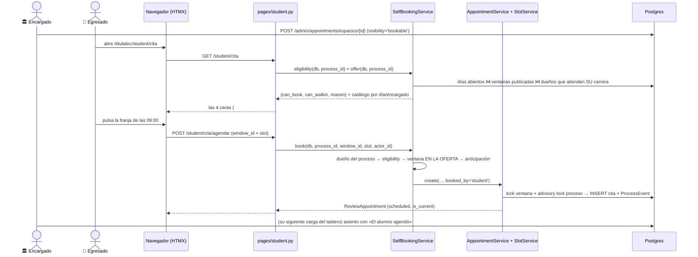

# El egresado agenda (y cancela) su propia cita de cotejo

> **Objetivo:** que el egresado elija él mismo una franja publicada por un encargado que atienda
> su carrera, sin esperar a que Servicios Escolares se la asigne — y que pueda soltarla a tiempo
> si no va a poder ir.

| | |
|---|---|
| **Actor(es)** | 👤 Egresado (`graduate`) · 🏛️ Encargado de Servicios Escolares (publica el espacio; no interviene en el agendado) |
| **Permiso(s)** | `titulatec.appointment.page.my` (la página) · **`titulatec.appointment.api.book.own`** (agendar) · **`titulatec.appointment.api.cancel.own`** (cancelar) — los dos NUEVOS, del rol `graduate`. Publicar el espacio es `titulatec.review_window.api.manage`, que el encargado ya tenía |
| **Trigger** | El egresado abre **Cita de cotejo** y hay al menos un espacio publicado como «Agendable» de su carrera |
| **Precondiciones** | Proceso `active` · **fase 2 en curso** (guarda de fase) · fase 2 **no** aprobada · **encuesta de egresados ENVIADA** (existe `SurveyReview`) · sin cita vigente activa · menos de `TITULATEC_SELF_CANCEL_MAX` cancelaciones propias · la franja arranca a más de `TITULATEC_SELF_BOOK_MIN_LEAD_MINUTES` |
| **Sub-flujos** | ⤵ [alcance por carrera](engine_officer_scope.md) (en sentido inverso) · ⤵ [guarda de fase del alumno](engine_student_phase_lock.md) · comparte capa dura con ⤵ [la cita de cotejo (loop del encargado)](phase2_appointment_loop.md) |
| **Estado final** | `ReviewAppointment` nueva, `status='scheduled'`, `is_current=True`, **`booked_by='student'`**, ocupando una franja de la ventana elegida |

> **La decisión de fondo (2026-09-15):** hasta esta fecha el alumno **solo podía pedir** un cambio;
> agendaba siempre el encargado. Se revirtió a petición del usuario por dos motivos reales: hay
> encargados que prefieren publicar sus franjas y dejar que el egresado se acomode, y hay
> encargados que no trabajan con franjas («los martes atiendo de 9 a 14, vengan cuando puedan») y
> no tenían forma de expresarlo.

## Las tres visibilidades de un espacio (D1)

El modo lo pone el encargado en su editor de espacios; es un campo más del formulario que ya
existía (`visibility`, en `POST /admin/appointments/espacios/{window_id}`), **sin ruta ni permiso
propios: quien puede editar un espacio puede publicarlo**.

| `ReviewWindow.visibility` | El egresado ve | El egresado agenda | El encargado |
|---|---|---|---|
| `private` (**default**) | nada | no | exactamente como antes |
| `bookable` | las franjas con lugar | **sí** | ve quién se agendó solo |
| `walkin` | solo el anuncio (día, horario, lugar, encargado) | no | sigue sentando gente a mano |

`private` es el `server_default`, así que toda ventana —vieja y nueva— nace privada: **publicar es
un acto deliberado** y migrar no le cambió el comportamiento a nadie.

## Ruta en la app (UI)

1. 🏛️ **Encargado** → `/titulatec/admin/appointments?v=espacios&date=YYYY-MM-DD` → «Abrir un
   espacio» → grupo de radios **«Visibilidad para el egresado»** → **Agendable** → «Guardar
   espacio». Cada modo trae su línea derivada calculada **en el servidor** («El egresado ve tus 10
   franjas libres y elige una»), y la lista marca la fila con una pastilla `Agendable`/`Sin
   cita`/`Privado`.
2. 👤 **Egresado** → menú del alumno → **Cita de cotejo** (`/titulatec/student/cita`). Un solo
   lugar con **cuatro caras**, que decide `eligibility()`:
   1. **Con cita vigente** → la tarjeta de la cita, con «Confirmar asistencia», «Solicitar cambio»
      y —si faltan más de 2 h— **«Cancelar mi cita»**.
   2. **Puede agendar** → **«Agendar mi cita»**: tira de días → encargado → franjas pulsables.
   3. **Hay espacios `walkin`** → tarjeta «Atención sin cita».
   4. **No puede** → **una frase que dice por qué**. Nunca un botón deshabilitado y mudo.

Las caras 3 y 4 conviven a propósito en el único caso donde eso importa: el bloqueado por el tope
de cancelaciones no puede *reservar*, pero sí puede *presentarse*.

## La fase 02 rechazada, en la pantalla del alumno (Tarea B2, 2026-09-17)

Hasta esta fecha, una cita `attended` con la fase 02 `rejected` (el dictamen que Servicios
Escolares hace tras el cotejo — «le faltan documentos») seguía mostrando la tarjeta como si
todo estuviera resuelto —píldora verde «Cotejo realizado»— y, si nadie había publicado
todavía un espacio nuevo, la pantalla no decía nada de qué hacer. El hueco era de PANTALLA,
no de reglas: la regla 2 de `eligibility()` (arriba) **ya** deja agendar de nuevo con la fase
02 rechazada —el corte real es la fase **aprobada**, no `attended`—, así que `agenda.can_book`
ya salía `True`. Lo que faltaba era mostrarlo.

`_cita_card_ctx` (`pages/student.py`) agrega un dato plano, `fase_rechazada` —
`{"motivo": str | None}` o `None`—, leído de `ProcessPhase` (fase `PhaseService.PHASE_COTEJO`)
y **nunca** de `appt.status`, por el mismo motivo que `_fase_cotejo_aprobada`: una `attended`
con la fase todavía sin dictaminar no es un rechazo. Lo consumen dos parciales:

- **`cita_card.html`**: si `fase_rechazada`, un aviso (`.tt-card--danger`) al inicio de la
  tarjeta — «Tu cotejo quedó con observaciones.», el motivo si lo hay, y «Necesitas otra cita
  de cotejo. Lleva lo que te faltó.». Es **aditivo**: si ya hay una cita nueva `scheduled`/
  `confirmed` (Servicios Escolares ya reagendó), el aviso convive arriba de su tarjeta normal
  como recordatorio del motivo. Cuando `appt.status == 'attended'` y la fase sigue rechazada,
  la píldora deja de decir «Cotejo realizado» (verde) y dice «Cotejo con observaciones»
  (ámbar); el resto de los estados de la cita no cambia.
- **`_cita_panel.html`**: caso nuevo, `fase_rechazada and agenda.can_book and not agenda.dias`
  —puede agendar, pero Servicios Escolares todavía no publicó ningún espacio—: una tarjeta
  «Servicios Escolares te agendará una nueva cita. Te avisaremos cuando tenga fecha.» ocupa el
  lugar donde iría el selector. `agenda.message` (cara 4) no cambia y no aplica a este caso:
  como `can_book` es `True`, no hay ningún motivo que explicar.

El motivo del rechazo **también** se ve, sin relación con nada de lo anterior, en el acordeón
del dashboard (`/student/dashboard`, y por tanto en `/student/fase/2`, que redirige ahí): la
fase 02 sigue siendo la `current` mientras esté `rejected` (`reject_phase` deja
`process.current_phase` apuntando a ella), así que `dashboard.html:82-87` ya pinta «Necesita
corrección» + el motivo en la tarjeta grande de la columna A. Es la MISMA información en dos
pantallas a propósito: en `/student/cita` el alumno decide su próximo paso (agendar, esperar);
en el dashboard confirma por qué.

Efecto colateral del lado del motor, no de esta pantalla: si la cita seguía `in_progress`
cuando Servicios Escolares dictaminó la fase 02, ya no queda colgada — el dictamen (aprobar
**o** rechazar) la cierra a `attended` en la MISMA transacción. Detalle: [motor de
aprobar/rechazar fase](engine_approve_advance_phase.md#cierre-automático-de-la-cita-de-cotejo-solo-fase-02-desde-2026-09-17)
y [máquina de estados](00_state_machine.md).

## Secuencia

## `eligibility()` — la única fuente de la verdad

La consumen **la pantalla del alumno y la cola del encargado**. Con dos implementaciones, el cubo
«Requieren que les agendes» diría una cosa y el alumno vería otra.

**El ORDEN es parte del contrato**: la primera regla que falla es la que se reporta.

| # | Condición | `reason` | Mensaje al alumno |
|---|---|---|---|
| 1 | `process.status != 'active'` | `proceso_inactivo` | «Tu proceso no está activo.» |
| 2 | fase 2 `approved` | `fase_aprobada` | «Tu cotejo ya quedó aprobado. No necesitas otra cita.» |
| 3 | sin `SurveyReview` | `sin_encuesta` | «Primero envía la encuesta de egresados.» |
| 4 | cita vigente en `scheduled\|confirmed\|in_progress` | `tiene_cita` | «Ya tienes una cita. Cancélala si necesitas otra.» |
| 5 | cancelaciones propias ≥ `TITULATEC_SELF_CANCEL_MAX` | `bloqueado_por_cancelaciones` | «Cancelaste N veces. Pídele la cita a tu encargado de carrera.» |
| 6 | — | `None` | puede agendar |

**Los casos que SÍ dejan agendar**, que son el corazón de la feature: cita `attended` con la fase 2
**sin** aprobar, `no_show`, `cancelled`, y no haber tenido nunca una. El corte real es **la fase 2
aprobada**, que se lee de `ProcessPhase` (`PhaseService.PHASE_COTEJO`), **nunca** de `appt.status`.

**`can_walkin` no es `can_book`.** Pasa con las reglas 1 a 4 y **la 5 no lo apaga**: quien agotó
sus cancelaciones perdió el derecho a reservar un lugar, no el de presentarse a una atención que
el encargado anunció abierta a todos. Colgarlo de `can_book` le fabricaría un callejón sin salida.

**El contador de D9 es derivado**, sin columna denormalizada: `status='cancelled'` **y**
`cancelled_by_id == process.student_id`. Si cancela el encargado **no** le consume cupo al alumno
— si no, el encargado podría dejarlo bloqueado sin querer.

## Pasos detallados

| # | Actor | UI / dónde | Acción | Endpoint | Service · método | Efecto en BD | Eventos / Notif |
|---|---|---|---|---|---|---|---|
| 1 | 🏛️ | Citas · Espacios | publicar el espacio | `POST /admin/appointments/espacios/{window_id}` (form `visibility`) | `ReviewWindowService.create` / `.update` | `titulatec_review_windows.visibility` ← `bookable\|walkin` | — |
| 2 | 👤 | `/student/cita` | ver la oferta | `GET /student/cita` | `SelfBookingService.eligibility` + `.offer` | — (lectura) | — |
| 2b | 👤 | tira de días | cambiar de día | `GET /student/cita?dia=YYYY-MM-DD` | ídem | — (lectura) | — |
| 3 | 👤 | rejilla de franjas | **agendar** | `POST /student/cita/agendar` (form `window_id` + `slot`) | `SelfBookingService.book` → `AppointmentService.create(booked_by='student')` → `SlotService.assign` | **INSERT** `ReviewAppointment(status=scheduled, is_current=True, attempt_no=max+1, booked_by='student')`; la vigente anterior se cierra | `appointment_scheduled`. **Sin notificación a nadie**: al alumno porque acaba de pulsar el botón, al encargado por D11 |
| 4 | 👤 | tarjeta de la cita | **cancelar** | `POST /student/cita/cancelar` (form `motivo`, opcional) | `SelfBookingService.cancel` → `AppointmentService.cancel` | `status='cancelled'`, `is_current=False`, `cancelled_at`, `cancelled_by_id`, `cancel_reason`; **la franja se libera** | `appointment_cancelled`. Sin notificación (el actor es el propio alumno) |
| 5 | 🏛️ | Citas · Agenda | enterarse | `GET /admin/appointments?date=…` | `_board_ctx` → `booked_by` | — (lectura) | — |

> **`GET /student/cita?dia=` NO es una ruta nueva**: es la misma con querystring. Lo que decide
> parcial-contra-página es la cabecera `HX-Request`, no la presencia del parámetro — ese mismo
> enlace pegado en la barra de direcciones es una navegación de página y devuelve la pantalla
> completa, no un fragmento pelado.

## Las dos capas de guardas (D13), y por qué están partidas así

| Capa | Dónde | Qué valida | A quién aplica |
|---|---|---|---|
| **Dura** | `AppointmentService` / `SlotService` | encuesta enviada, una sola cita vigente, día habilitado, franja real de la rejilla, cupo libre, lock de ventana + advisory lock del proceso | **todos**, encargado incluido |
| **Del alumno** | `SelfBookingService` | fase 2 aprobada, tope de cancelaciones, anticipación mínima, ventana `bookable` y de su carrera | solo el auto-agendado |

Por eso `cancel` **envuelve** a `AppointmentService.cancel` y `book` **delega** en
`AppointmentService.create` en vez de reimplementarlas: si la ventana de 2 h se colara a la capa
compartida se le aplicaría también al encargado, que no tiene ventana de tiempo. **Si acabas
escribiendo dos veces la misma regla, la partición está mal hecha.**

## El control de seguridad crítico ❗

`window_id` llega en el **cuerpo del formulario**, no en la ruta. El regresor estructural
`test_scope_guard.py` —que barre las rutas con `{process_id}`— **no lo ve**. Sin revalidación, un
egresado se sentaría en la ventana de cualquier encargado de cualquier carrera cambiando un número.

Lo cierra `SelfBookingService._window_in_offer`, que revalida el `window_id` contra la oferta **del
proceso del usuario autenticado** y exige `visibility='bookable'` (un `walkin` es un anuncio, no
una agenda). `_offerable_windows` es **un solo predicado** que sirve al catálogo (`offer`) y a la
escritura (`_window_in_offer`): si la oferta y la escritura usaran consultas distintas, un día
divergen y el agujero se abre por el lado que nadie mira. Tiene test propio y dedicado
(`test_self_booking_routes.py::test_no_agenda_en_la_ventana_de_otra_carrera`).

Además, **la guarda de propiedad del proceso va ANTES que `eligibility`**: al revés, un
`process_id` ajeno recibiría `SelfBookingNotAllowed` con el motivo de *ese* proceso
(`sin_encuesta`, `tiene_cita`…), o sea un oráculo de información — justo lo que el 404 uniforme
existe para cerrar.

## Estado resultante

- `titulatec_review_appointments`: fila nueva `status='scheduled'`, `is_current=True`,
  `attempt_no = max+1`, **`booked_by='student'`**, `created_by_id` = el propio alumno.
- La franja queda ocupada; el tablero del encargado la pinta con el distintivo **«El alumno
  agendó»** en la línea `.meta` del asiento (nunca en una línea nueva: el asiento es de alto fijo
  y crecer movería la fila).
- `ProcessEvent(appointment_scheduled)`; **ninguna notificación** (D11).
- Tras cancelar: la fila deja de ser la vigente, la franja vuelve al pozo **en el acto** y el
  proceso está «sin cita» otra vez — puede agendar de nuevo, hasta el tope.

## Caminos alternos / errores ❗

Los traduce `_cita_accion` (`pages/student.py`), y las tres salidas son un contrato:

- **`NotYours` → 404 limpio, SIN `X-Tt-Error`.** Lo levanta por **dos** motivos —ventana fuera de
  su oferta y proceso ajeno— y los dos salen igual **a propósito**: distinguirlos sería el oráculo
  que el 404 viene a cerrar.
- **Entrada del usuario** (`SlotTooSoon`, `CancelTooLate`, casi toda `SelfBookingNotAllowed`) →
  **400 + `X-Tt-Error`**. htmx no hace swap en 4xx, y está bien: lo que hay en pantalla sigue
  siendo verdad.
- **Colisión de estado** (`reason == "tiene_cita"`) → **200 con el panel fresco** + `X-Tt-Notice`.
  Es lo que produce el doble clic en «Agendar»: ahí la pantalla **sí** está rancia —ya existe una
  cita que el alumno no ve— y un 4xx lo dejaría mirando un selector muerto.
- **Doble clic en «Cancelar»**: la segunda vez ya no hay cita vigente → se devuelve el panel tal
  como quedó. Lo que pidió ya está hecho; un 4xx sería un error inventado.
- **Fuera de la fase 2** → `_phase_guard`: 400 + `X-Tt-Error` en los POST, 302 al acordeón en el GET.
- **Un `?dia=` viejo** (un día que el encargado cerró) **no tumba la vista**: degrada al primer día
  con oferta.
- **Un `walkin` que ya terminó hoy deja de anunciarse.** El corte por día no basta: a las 18:00 la
  pantalla seguiría diciendo «abierto sin cita, 09:00-11:00» y mandaría al egresado a caminar hasta
  un cubículo vacío. El corte vive en `offer`, **no en la plantilla**: la UI pinta lo que recibe,
  no filtra datos.

## Configuración

| Ajuste (`itcj2/config.py`) | Default | Qué controla |
|---|---|---|
| `TITULATEC_SELF_BOOK_MIN_LEAD_MINUTES` | `60` | no toma una franja que arranca en menos de 1 h |
| `TITULATEC_SELF_CANCEL_MIN_LEAD_MINUTES` | `120` | no cancela faltando menos de 2 h |
| `TITULATEC_SELF_CANCEL_MAX` | `3` | cancelaciones propias antes de perder el auto-agendado |

El reloj es **`db_now()`** (hora local naive, la misma que produce `NOW()` en Postgres), nunca
`utcnow()`: todas las columnas de fecha de esta app son naive y `utcnow()` restaría seis horas,
abriendo o cerrando la ventana sola.

## Pruebas

- `tests/fastapi/titulatec/test_self_booking_eligibility.py` — las 6 reglas, en orden, una por test.
- `…/test_self_booking_offer.py` — el catálogo y el predicado inverso de alcance.
- `…/test_self_booking_routes.py` — agendar y cancelar de punta a punta, las ventanas de tiempo,
  el tope, **y el IDOR**.
- `…/test_self_booking_cancel_frees_slot.py` — cancelar libera, no presentarse no.
- `tests/e2e/titulatec/citas-autoagenda.spec.js` — el recorrido real en navegador: el encargado
  publica → el egresado agenda → el encargado ve el distintivo, más el invariante
  `scrollWidth <= innerWidth` en los 6 viewports de la vista de agendado.

## Flujos relacionados

- ⤵ [Cita de cotejo · loop del encargado](phase2_appointment_loop.md) — la otra mitad: quién
  atiende, marca asistencia y dictamina la fase 2.
- ⤵ [Alcance por carrera](engine_officer_scope.md) — `offer` usa su predicado **en sentido inverso**.
- ⤵ [Guarda de fase del alumno](engine_student_phase_lock.md) — las dos rutas nuevas pasan por ella.
- ← Puerta previa: [liberación GTV de la encuesta de egresados](phase2_tech_management_survey_release.md)
  — la `SurveyReview` que exige la regla 3 nace al ENVIAR la encuesta, no al liberarla.
- 📐 [Máquina de estados](00_state_machine.md) — los 7 estados y el eje `is_current`.
