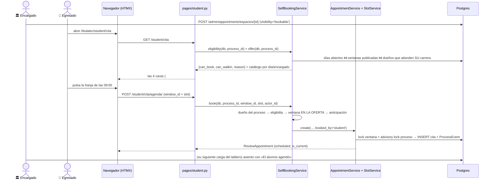

# El egresado agenda (y cancela) su propia cita de cotejo

> **Objetivo:** que el egresado elija él mismo una franja publicada por un encargado que atienda
> su carrera, sin esperar a que Servicios Escolares se la asigne — y que pueda soltarla a tiempo
> si no va a poder ir.

| | |
|---|---|
| **Actor(es)** | 👤 Egresado (`graduate`) · 🏛️ Encargado de Servicios Escolares (publica el espacio; no interviene en el agendado) |
| **Permiso(s)** | `titulatec.appointment.page.my` (la página) · **`titulatec.appointment.api.book.own`** (agendar) · **`titulatec.appointment.api.cancel.own`** (cancelar) — los dos NUEVOS, del rol `graduate`. Publicar el espacio es `titulatec.review_window.api.manage`, que el encargado ya tenía |
| **Trigger** | El egresado abre **Cita de cotejo** y hay al menos un espacio publicado como «Agendable» o **«Sin horario»** (2026-09-29, D3/D4 — el sin horario también se aparta, ya no es solo anuncio) de su carrera |
| **Precondiciones** | Proceso `active` · **fase 2 en curso** (guarda de fase) · fase 2 **no** aprobada · sin una cita vigente `attended` con la fase 2 todavía SIN veredicto (D13, 2026-09-30: `cotejo_en_dictamen` — solo se libera cuando la fase queda `rejected`) · **las dos liberaciones de `ClearanceGate`**: encuesta de egresados LIBERADA por Gestión Tecnológica y Vinculación (existe `SurveyReview` con `status == 'approved'`; 2026-09-29, revierte la exigencia de solo-ENVIADA del 2026-09-15) y, donde la convocatoria lo exige, **no adeudo de biblioteca LIBERADO** (2026-10-01, D6 — ⤵ [no adeudo de biblioteca](phase2_library_clearance.md)) · sin cita vigente activa · menos de `TITULATEC_SELF_CANCEL_MAX` cancelaciones propias · la franja arranca a más de `TITULATEC_SELF_BOOK_MIN_LEAD_MINUTES` (en un sin horario, es el CIERRE del espacio el que tiene que faltar más de ese lapso) |
| **Sub-flujos** | ⤵ [alcance por carrera](engine_officer_scope.md) (en sentido inverso) · ⤵ [guarda de fase del alumno](engine_student_phase_lock.md) · comparte capa dura con ⤵ [la cita de cotejo (loop del encargado)](phase2_appointment_loop.md) · ⤵ [no adeudo de biblioteca](phase2_library_clearance.md) (`ClearanceGate`, segunda liberación de la regla 3) |
| **Estado final** | `ReviewAppointment` nueva, `status='scheduled'`, `is_current=True`, **`booked_by='student'`**, ocupando una franja de la ventana elegida |

> **La decisión de fondo (2026-09-15):** hasta esta fecha el alumno **solo podía pedir** un cambio;
> agendaba siempre el encargado. Se revirtió a petición del usuario por dos motivos reales: hay
> encargados que prefieren publicar sus franjas y dejar que el egresado se acomode, y hay
> encargados que no trabajan con franjas («los martes atiendo de 9 a 14, vengan cuando puedan») y
> no tenían forma de expresarlo.

## Las tres visibilidades de un espacio (D1)

El modo lo pone el encargado en su editor de espacios; es un campo más del formulario que ya
existía (`visibility`, en `POST /admin/appointments/espacios/{window_id}`), **sin ruta ni permiso
propios: quien puede editar un espacio puede publicarlo**.

> ⚠️ **Ojo con las letras D repetidas entre specs.** El `D1` de este encabezado es del spec
> 2026-09-15 (que dio de alta las tres visibilidades). De aquí en adelante, un `D` seguido de
> número **con fecha 2026-09-29** —D3, D4, D5, D10, D11 principalmente— es del spec
> **2026-09-29-titulatec-cotejo-espacios-design.md** (esta entrega, el rediseño del `walkin`):
> letras compartidas, decisiones distintas. **Hay incluso una tercera capa de la misma trampa**:
> el `D13` de la sección «Las dos capas de guardas», más abajo, es del spec 2026-09-15 (la
> partición dura/alumno), y es DISTINTO del `D13` que cita la tabla de `eligibility()` -ese es
> una fila que el mismo spec 2026-09-29 sumó el **2026-09-30**, al probar en dev-. Los tres textos
> de aquí en más que digan «D13, 2026-09-30» son ese último.

| `ReviewWindow.visibility` | El egresado ve | El egresado agenda | El encargado |
|---|---|---|---|
| `private` (**default**) | nada | no | exactamente como antes |
| `bookable` | las franjas con lugar | **sí**, elige la hora | ve quién se agendó solo |
| `walkin` — **«Sin horario»** (D3, 2026-09-29) | el rango, el lugar y cuántos lugares quedan | **sí**, **aparta un lugar SIN hora** (D4) — antes solo era el anuncio, sin registro | sigue sentando gente a mano; además **«Abrir más lugares»** (D6) y, si es HOY, **«Atender ahora»** (D7) — detalle en ⤵ [cita de cotejo](phase2_appointment_loop.md) |

`private` es el `server_default`, así que toda ventana —vieja y nueva— nace privada: **publicar es
un acto deliberado** y migrar no le cambió el comportamiento a nadie.

## Ruta en la app (UI)

1. 🏛️ **Encargado** → `/titulatec/admin/appointments?v=espacios&date=YYYY-MM-DD` → «Abrir un
   espacio» → grupo de radios **«Visibilidad para el egresado»** (rotulados **Privado** /
   **Agendable** / **Sin horario**) → «Guardar espacio». Cada modo trae su línea derivada calculada
   **en el servidor**: en Agendable, «El egresado ve tus 10 franjas libres y elige una»; en **Sin
   horario** (D3), «El egresado ve «lunes 06 oct, 08:00 a 14:00, Edificio A» y aparta un lugar
   (quedan 7)» — nunca el mismo texto genérico para los dos modos. La lista de espacios marca la
   fila con una pastilla `Agendable` / **`Sin horario`** / `Privado`.
2. 👤 **Egresado** → menú del alumno → **Cita de cotejo** (`/titulatec/student/cita`). Un solo
   lugar con **cuatro caras**, que decide `eligibility()` + `_agenda_ctx` (`agenda.modo`):
   1. **Con cita vigente** → la tarjeta de la cita, con «Confirmar asistencia», «Solicitar cambio»
      y —si faltan más de 2 h (o, en un lugar sin horario, hasta el CIERRE, D5)— **«Cancelar mi
      cita»** («Cancelar mi lugar» en sin horario).
   2. **Puede agendar** (`agenda.modo == "agendar"`) → pill «Te toca agendar» + el selector
      **plegable** único **«Agendar mi cita»** (D10, más abajo): tira de días → encargados
      plegables → franjas pulsables **y** espacios Sin horario con **«Apartar mi lugar»** (D3/D4),
      mezclados en el mismo día.
   3. **Puede presentarse pero no reservar** (`agenda.modo == "presentarse"`, bloqueado por el tope
      de cancelaciones) → pill **«Atención sin cita»** + el MISMO selector, pero solo con los
      espacios Sin horario de la oferta y sin botón: «Preséntate en este horario; tu encargado te
      registra si hay lugar.»
   4. **No puede** (`agenda.modo is None`) → **una frase que dice por qué**. Nunca un botón
      deshabilitado y mudo.

Las caras 3 y 4 conviven a propósito en el único caso donde eso importa: el bloqueado por el tope
de cancelaciones no puede *reservar*, pero sí puede *presentarse*. **Desde el 2026-09-29 (D3/D4/D10)
ya no hay una tarjeta aparta para «Atención sin cita»**: el `walkin` viaja DENTRO de la misma tira
de días que las franjas, y el parcial dedicado (`_cita_walkin.html`) se retiró — ver «El selector
plegable», más abajo.

## La fase 02 rechazada, en la pantalla del alumno (Tarea B2, 2026-09-17)

Hasta esta fecha, una cita `attended` con la fase 02 `rejected` (el dictamen que Servicios
Escolares hace tras el cotejo — «le faltan documentos») seguía mostrando la tarjeta como si
todo estuviera resuelto —píldora verde «Cotejo realizado»— y, si nadie había publicado
todavía un espacio nuevo, la pantalla no decía nada de qué hacer. El hueco era de PANTALLA,
no de reglas: la regla 2 de `eligibility()` (arriba) **ya** deja agendar de nuevo con la fase
02 rechazada —el corte real es la fase **aprobada**, no `attended`—, así que `agenda.can_book`
ya salía `True`. Lo que faltaba era mostrarlo.

`_cita_card_ctx` (`pages/student.py`) agrega un dato plano, `fase_rechazada` —
`{"motivo": str | None}` o `None`—, leído de `ProcessPhase` (fase `PhaseService.PHASE_COTEJO`)
y **nunca** de `appt.status`, por el mismo motivo que `_fase_cotejo_status`: una `attended`
con la fase todavía sin dictaminar no es un rechazo. Lo consumen dos parciales:

- **`cita_card.html`**: si `fase_rechazada`, un aviso (`.tt-card--danger`) al inicio de la
  tarjeta — «Tu cotejo quedó con observaciones.», el motivo si lo hay, y «Necesitas otra cita
  de cotejo. Lleva lo que te faltó.». Es **aditivo**: si ya hay una cita nueva `scheduled`/
  `confirmed` (Servicios Escolares ya reagendó), el aviso convive arriba de su tarjeta normal
  como recordatorio del motivo. Cuando `appt.status == 'attended'` y la fase sigue rechazada,
  la píldora deja de decir «Cotejo realizado» (verde) y dice «Cotejo con observaciones»
  (ámbar); el resto de los estados de la cita no cambia.
- **`_cita_panel.html`**: caso nuevo, `fase_rechazada and agenda.can_book and not agenda.dias`
  —puede agendar, pero Servicios Escolares todavía no publicó ningún espacio—: una tarjeta
  «Servicios Escolares te agendará una nueva cita. Te avisaremos cuando tenga fecha.» ocupa el
  lugar donde iría el selector. `agenda.message` (cara 4) no cambia y no aplica a este caso:
  como `can_book` es `True`, no hay ningún motivo que explicar.

El motivo del rechazo **también** se ve, sin relación con nada de lo anterior, en el acordeón
del dashboard (`/student/dashboard`, y por tanto en `/student/fase/2`, que redirige ahí): la
fase 02 sigue siendo la `current` mientras esté `rejected` (`reject_phase` deja
`process.current_phase` apuntando a ella), así que `dashboard.html:82-87` ya pinta «Necesita
corrección» + el motivo en la tarjeta grande de la columna A. Es la MISMA información en dos
pantallas a propósito: en `/student/cita` el alumno decide su próximo paso (agendar, esperar);
en el dashboard confirma por qué.

Efecto colateral del lado del motor, no de esta pantalla: si la cita seguía `in_progress`
cuando Servicios Escolares dictaminó la fase 02, ya no queda colgada — el dictamen (aprobar
**o** rechazar) la cierra a `attended` en la MISMA transacción. Detalle: [motor de
aprobar/rechazar fase](engine_approve_advance_phase.md#cierre-automático-de-la-cita-de-cotejo-solo-fase-02-desde-2026-09-17)
y [máquina de estados](00_state_machine.md).

## Secuencia

```mermaid
sequenceDiagram
    actor S as 🏛️ Encargado
    actor U as 👤 Egresado
    participant FE as Navegador (HTMX)
    participant API as pages/student.py
    participant SB as SelfBookingService
    participant AS as AppointmentService + SlotService
    participant DB as Postgres
    S->>DB: POST /admin/appointments/espacios/{id} (visibility='bookable')
    U->>FE: abre /titulatec/student/cita
    FE->>API: GET /student/cita
    API->>SB: eligibility(db, process_id) + offer(db, process_id)
    SB->>DB: días abiertos ⋈ ventanas publicadas ⋈ dueños que atienden SU carrera
    SB-->>API: {can_book, can_walkin, reason} + catálogo por día/encargado
    API-->>FE: las 4 caras (#tt-cita-panel)
    U->>FE: pulsa la franja de las 09:00
    FE->>API: POST /student/cita/agendar (window_id + slot)
    API->>SB: book(db, process_id, window_id, slot, actor_id)
    SB->>SB: dueño del proceso → eligibility → ventana EN LA OFERTA → anticipación
    SB->>AS: create(..., booked_by='student')
    AS->>DB: lock ventana + advisory lock proceso → INSERT cita + ProcessEvent
    AS-->>API: ReviewAppointment (scheduled, is_current)
    API-->>FE: #tt-cita-panel re-renderizado (sin JSON: app pages-only)
    S->>DB: (su siguiente carga del tablero) asiento con «El alumno agendó»
```

## `eligibility()` — la única fuente de la verdad

La consumen **la pantalla del alumno y la cola del encargado**. Con dos implementaciones, el cubo
«Requieren que les agendes» diría una cosa y el alumno vería otra.

**El ORDEN es parte del contrato**: la primera regla que falla es la que se reporta.

| # | Condición | `reason` | Mensaje al alumno |
|---|---|---|---|
| 1 | `process.status != 'active'` | `proceso_inactivo` | «Tu proceso no está activo.» |
| 2 | fase 2 `approved` | `fase_aprobada` | «Tu cotejo ya quedó aprobado. No necesitas otra cita.» |
| 3a | nunca envió la encuesta (sin `SurveyReview`) | `sin_encuesta` | «Primero envía la encuesta de egresados.» |
| 3b | la envió, pero sigue `in_review` | `encuesta_en_revision` | «Tu encuesta de egresados está en revisión con Gestión Tecnológica y Vinculación. Podrás agendar en cuanto la liberen.» |
| 3c | la envió, pero quedó `rejected` (observaciones de GTV) | `encuesta_con_observaciones` | «Gestión Tecnológica y Vinculación dejó observaciones en tu encuesta de egresados. Podrás agendar en cuanto la liberen.» |
| 3d | encuesta liberada, pero el no adeudo de biblioteca sigue en Biblioteca (`pending`/`missing`) **donde la convocatoria lo exige** (2026-10-01, D6) | `biblioteca_en_revision` | «El Centro de Información está revisando si tienes adeudo con la biblioteca. Podrás agendar en cuanto se libere tu no adeudo.» |
| 3e | ídem, pero `awaiting_payment` (pasó a Caja) | `pago_pendiente` | «Pasa a Caja (Recursos Financieros) a pagar ${total}; no necesitas cita. Podrás agendar en cuanto se libere tu no adeudo.» |
| 4 | cita vigente en `scheduled\|confirmed\|in_progress` | `tiene_cita` | «Ya tienes una cita. Cancélala si necesitas otra.» |
| 5 | cita vigente `attended` y fase 2 SIN veredicto -ni `approved` (ya cortó en la 2) ni `rejected`- | `cotejo_en_dictamen` | «Tu cotejo ya se realizó. Servicios Escolares está por dictaminarlo; si queda con observaciones podrás agendar otra cita.» |
| 6 | cancelaciones propias ≥ `TITULATEC_SELF_CANCEL_MAX` | `bloqueado_por_cancelaciones` | «Cancelaste N veces. Pídele la cita a tu encargado de carrera.» |
| 7 | — | `None` | puede agendar |

> **Regla 5 nueva (D13, 2026-09-30, al probar en dev).** Revierte EN PARTE la regla del
> auto-agendado del 2026-09-15: hasta esa fecha el corte real era solo la fase 2 **aprobada** (ver
> abajo, «Los casos que SÍ dejan agendar»), así que una `attended` con papeles faltantes podía
> re-agendar de inmediato aunque la fase 2 siguiera sin dictaminar. Desde D13, mientras Servicios
> Escolares no dictamine -ni apruebe ni rechace- el egresado NO agenda ni se presenta: `can_walkin`
> también se apaga, mismo criterio que las reglas 1 a 4. Solo recupera el auto-agendado en cuanto
> la fase 2 queda `rejected`. Un `no_show` o una `cancelled` no disparan esta regla -no están
> `attended`- y siguen agendando sin cambio. Aplica igual a espacios con franjas y a Sin horario;
> del lado del encargado no cambia nada -su ficha ya solo ofrecía otra cita con `attended` cuando
> la fase 2 estaba `rejected`, ver [la otra mitad del flujo](phase2_appointment_loop.md).

**La regla 3 son las LIBERACIONES, y las decide ÚNICAMENTE `ClearanceGate`** (`services/
clearance_gate.py`, spec `2026-10-01-titulatec-biblioteca-caja-design.md` §4.4.4; único lector —
invariante 2—, para que el cubo «Requieren que les agendes» del encargado y esta pantalla nunca
diverjan). Se reporta su PRIMER bloqueo, en el orden fijo del gate: encuesta antes que no adeudo.

**Encuesta, tres caras desde el 2026-09-29 (D1, revierte D2 del 2026-09-15).** Hasta esa fecha
era un booleano —¿existe `SurveyReview`?— y bastaba con haberla ENVIADO. Desde D1,
`SurveyReviewService.release_status` decide entre `missing` / `in_review` / `rejected`
(`'approved'` nunca llega aquí como bloqueo: cae en la regla 7, «puede agendar»), y las tres
bloquean `can_book` por igual —enviarla ya no basta, hace falta que GTV la **libere**— pero cada
una le dice al alumno algo distinto sobre qué falta.

**No adeudo de biblioteca, dos caras desde el 2026-10-01 (D6).** SOLO si la convocatoria tiene el
requisito automático activo (`ClearanceGate.library_required`): `pending`/`missing`
(Biblioteca todavía no lo revisó) → `biblioteca_en_revision`; `awaiting_payment` (ya pasó a
Caja) → `pago_pendiente`, con el total CONGELADO de su fila en el mensaje (`library_total`,
leer el monto no decide nada — lo decidió el gate). Sin el requisito, `library` vale
`not_required` y nunca aparece en `blockers`; tampoco `not_applicable` (fase 2 ya aprobada sin
el no adeudo liberado, Ruling R21 — de todos modos la regla 2, «fase aprobada», corta antes).

El diccionario `SelfBookingService._CLEARANCE_REASONS` traduce cada código de `ClearanceGate.
blockers` (`survey_missing`/`survey_in_review`/`survey_rejected`/`library_pending`/
`library_awaiting_payment`) a su `reason`; los cinco textos viven en `SelfBookingService.
MENSAJES`, junto con los demás.

**Los casos que SÍ dejan agendar**, que son el corazón de la feature: cita `attended` con la fase 2
**rechazada**, `no_show`, `cancelled`, y no haber tenido nunca una. Hasta el 2026-09-29 bastaba con
que la fase 2 NO estuviera **aprobada**; desde D13 (2026-09-30) hace falta además que SÍ tenga
veredicto -mientras siga sin dictaminar, bloquea con `cotejo_en_dictamen`, regla 5-. El corte se
sigue leyendo de `ProcessPhase` (`PhaseService.PHASE_COTEJO`), **nunca** de `appt.status` a secas.

**`can_walkin` no es `can_book`.** Pasa con las reglas 1 a 5 y **la 6 no lo apaga**: quien agotó
sus cancelaciones perdió el derecho a reservar un lugar, no el de presentarse a una atención que
el encargado anunció abierta a todos. Colgarlo de `can_book` le fabricaría un callejón sin salida.

**El contador de D9 es derivado**, sin columna denormalizada: `status='cancelled'` **y**
`cancelled_by_id == process.student_id`. Si cancela el encargado **no** le consume cupo al alumno
— si no, el encargado podría dejarlo bloqueado sin querer.

### El mensaje de la cara 4 cuando una cita vigente YA ocupa el cotejo (Ruling R12/R18)

`eligibility()` reporta el PRIMER bloqueo en su orden fijo (regla 3 antes que 4/5): un egresado
con una cita vigente que OCUPA el cotejo (D17 de ⤵ [no adeudo de biblioteca](phase2_library_clearance.md):
las citas ya agendadas no se tocan) y al que ADEMÁS le falta el no adeudo reporta el motivo de
biblioteca (`biblioteca_en_revision`/`pago_pendiente`), **nunca** `tiene_cita`/`cotejo_en_dictamen`
— es CONTRATO, no se reordena. El texto normal de esos dos motivos («…Podrás agendar en cuanto se
libere tu no adeudo») sería **falso** bajo una cita que ya tiene: no le falta agendar, le falta
que Servicios Escolares pueda LIBERAR su cotejo (el mismo verbo que usa `PhaseService.
_cotejo_gate_error`). `pages/student.py::_agenda_ctx` sustituye el texto SOLO en esta pantalla
(constantes `_LIBRARY_REASONS_CON_CITA`/`_LIBRARY_BLOCK_WITH_CITA_MSG`) cuando
`SelfBookingService.cita_ocupa_el_cotejo(db, process, elig["current"], elig["fase2_status"])` es
verdadero —
`SelfBookingService.MENSAJES` no cambia: lo sigue usando quien SÍ puede agendar, el cubo de la
cola del encargado y los correos (D11).

**`cita_ocupa_el_cotejo(db, proc, current, fase2_status=_FASE2_NO_PROVISTA) -> bool`**
(`SelfBookingService`, Ruling R18 de la
revisión de la Tarea 12): el predicado ÚNICO —antes vivía duplicado e inline en
`mail_compose.py::_que_falta`— que responde «¿la cita vigente sigue ocupando el cotejo, o el
egresado puede/debe agendar otra?»: `True` si está en `_ESTADOS_ACTIVOS` (`scheduled`/
`confirmed`/`in_progress`, regla 4) o `attended` mientras la fase 2 sigue SIN veredicto (regla 5,
`cotejo_en_dictamen` — `approved` ya cortó antes en los dos llamadores, así que basta excluir
`rejected`). `None` (sin cita), `no_show` y `attended` con la fase 2 YA `rejected` devuelven
`False` — esos SÍ agendan otra, y decirles «ya tienes una cita» sería tan falso como prometerles
«podrás agendar» estando `scheduled`. Dos llamadores, misma pregunta: este (`_agenda_ctx`) y
`mail_compose.py::_que_falta` (⤵ [correos del proceso al egresado](xcut_student_email_notifications.md)).

**`fase2_status`, parámetro opcional (m37, 2026-10-02).** `eligibility()` ya leía
`_fase_cotejo_status` ella misma (reglas 2/5) pero no lo exponía; ahora lo agrega a su dict de
retorno (`elig["fase2_status"]`), y `_agenda_ctx` —el único llamador que YA tiene ese valor a la
mano— se lo pasa como cuarto argumento a `cita_ocupa_el_cotejo` en vez de dejar que vuelva a
consultar `ProcessPhase` (ahorra una consulta por carga de «Mi cita»). El valor por omisión es un
centinela privado del módulo (`_FASE2_NO_PROVISTA = object()`), NUNCA `None`: un proceso sin fila
de fase 2 es un valor real y distinto de «no me lo pasaron». `mail_compose.py::_que_falta` (el
otro llamador) sigue sin pasarlo —tres posicionales, sin tocar su firma— y `cita_ocupa_el_cotejo`
se comporta exactamente igual que antes: consulta `_fase_cotejo_status` ella misma.

## Sin horario: apartar y cancelar contra el CIERRE, no la hora (D5, 2026-09-29)

En un espacio Agendable la anticipación se mide contra la **franja** elegida; en un espacio **Sin
horario** no hay una franja que empiece —hay un espacio que CIERRA— así que las dos ventanas de
tiempo del alumno se miden contra el `end_time` de la ventana. **Mismos settings, sin ninguno
nuevo** (`TITULATEC_SELF_BOOK_MIN_LEAD_MINUTES` / `TITULATEC_SELF_CANCEL_MIN_LEAD_MINUTES`, ver
«Configuración» más abajo):

- **Apartar** (`SelfBookingService.book`): en `walkin`, el `slot` que haya mandado el formulario se
  **ignora** —no hay hora que elegir, D4— y se sustituye por `ventana.start_time`, la misma franja
  única que ya usa `SlotService.slots` para un `walkin`; la anticipación mínima se compara contra
  `ventana.end_time`, no contra la apertura. Si el cierre queda a menos de
  `TITULATEC_SELF_BOOK_MIN_LEAD_MINUTES` → `SlotTooSoon(sin_horario=True)`: «Este espacio cierra en
  menos de {lapso}; ya no se puede apartar lugar.» (el agendable dice «Esa franja empieza en menos
  de…»).
- **Cancelar** (`SelfBookingService.cancel` / `can_self_cancel`): la referencia la decide
  `SlotService.is_walkin_reservation(appt)` — ventana `walkin` **y** `scheduled_at.time() ==
  start_time` (la regla de legado: una cita que un encargado sentó a mano a OTRA hora dentro de un
  `walkin` sigue midiendo contra **su propia** `scheduled_at`, como cualquier cita normal). Si es un
  lugar apartado, la referencia es `día + ventana.end_time`; si faltan menos de
  `TITULATEC_SELF_CANCEL_MIN_LEAD_MINUTES` para el cierre → `CancelTooLate(sin_horario=True)`: «Ya
  faltan menos de {lapso} para que cierre el espacio, así que no puedes cancelar tu lugar.» (el
  agendable dice «…para tu cita»). La misma desigualdad (`_within_cancel_window`) decide si la
  tarjeta ofrece el botón «Cancelar mi lugar», así que nunca se pinta un botón que el servidor va a
  rechazar.
- La UI lo refleja con el vocabulario de «lugar», no de «cita»: la tarjeta dice «Cancelar mi lugar»
  (en vez de «Cancelar mi cita») y el `hx-confirm` dice «Vas a liberar tu lugar sin horario.»
  (`cita_card.html`, ver también «El selector plegable» más abajo).

## Pasos detallados

| # | Actor | UI / dónde | Acción | Endpoint | Service · método | Efecto en BD | Eventos / Notif | Correo |
|---|---|---|---|---|---|---|---|---|
| 1 | 🏛️ | Citas · Espacios | publicar el espacio | `POST /admin/appointments/espacios/{window_id}` (form `visibility`) | `ReviewWindowService.create` / `.update` | `titulatec_review_windows.visibility` ← `bookable\|walkin` | — | — |
| 2 | 👤 | `/student/cita` | ver la oferta | `GET /student/cita` | `SelfBookingService.eligibility` + `.offer` | — (lectura) | — | — |
| 2b | 👤 | tira de días | cambiar de día | `GET /student/cita?dia=YYYY-MM-DD` | ídem | — (lectura) | — | — |
| 3 | 👤 | rejilla de franjas / bloque Sin horario | **agendar / apartar lugar** | `POST /student/cita/agendar` (form `window_id` + `slot`; en Sin horario `slot` se ignora, D4) | `SelfBookingService.book` → `AppointmentService.create(booked_by='student')` → `SlotService.assign` | **INSERT** `ReviewAppointment(status=scheduled, is_current=True, attempt_no=max+1, booked_by='student')`; la vigente anterior se cierra | `appointment_scheduled`. **Sin notificación in-app a nadie**: al alumno porque acaba de pulsar el botón, al encargado por D11 | **Sí**: `appt_changed` (`event=scheduled`, `by=student`, grupo `cita:{pid}`) — su comprobante: fecha, lugar, qué llevar (D9) |
| 4 | 👤 | tarjeta de la cita | **cancelar** | `POST /student/cita/cancelar` (form `motivo`, opcional) | `SelfBookingService.cancel` → `AppointmentService.cancel` | `status='cancelled'`, `is_current=False`, `cancelled_at`, `cancelled_by_id`, `cancel_reason`; **la franja se libera** | `appointment_cancelled`. Sin notificación (el actor es el propio alumno) | **No** (su propia acción; `cancel` solo encola bajo la condición del in-app) |
| 5 | 🏛️ | Citas · Agenda | enterarse | `GET /admin/appointments?date=…` | `_board_ctx` → `booked_by` | — (lectura) | — | — |

> **El correo del paso 3 NO es un aviso de su propio clic, es un comprobante** (spec 2026-09-28,
> D9): el in-app sigue suprimido y el correo sale igual. Si el alumno agenda y cancela dentro de
> la espera del agrupado, el grupo `cita:{pid}` queda en neto cero y el despachador no manda nada
> (lo decide al enviar, no aquí). Lo fijan `test_alumno_agenda_encola_pero_sin_in_app` y
> `test_alumno_cancela_no_encola` en `tests/fastapi/titulatec/test_mail_hooks.py`. Si en cambio el
> ENCARGADO se la mueve dentro de la espera, el correo dice «Cambió tu cita de cotejo: …»: la
> creación del propio alumno no es su «primera noticia» —ya conocía la fecha—, solo la del
> encargado lo es (B5, ronda final 2026-09-29; `mail_compose._compose_appt_group`).

> **`GET /student/cita?dia=` NO es una ruta nueva**: es la misma con querystring. Lo que decide
> parcial-contra-página es la cabecera `HX-Request`, no la presencia del parámetro — ese mismo
> enlace pegado en la barra de direcciones es una navegación de página y devuelve la pantalla
> completa, no un fragmento pelado.

## El selector plegable (D10, 2026-09-29)

Rediseño de la pantalla del alumno: menos que desplazar, todo con `
` **nativo** (cero JS
nuevo), en el orden fijado por la spec §6.

1. **La tarjeta de la cita** (si la hay) — sin cambios de fondo, va primero porque responde «¿cuándo
   me toca?».
2. **«Qué llevar»**, plegado (`
`, `_cita_panel.html`) — **abierto** solo
   si hay una cita **VIVA** (`scheduled`/`confirmed`/`in_progress`); si no, cerrado. El resumen dice
   «Qué llevar a tu cita · N requisitos (M listos)». Antes vivía siempre visible dentro de
   `cita.html`; el contenido no cambió, solo se movió de sitio y de envoltura.
3. **El selector, unificado** (`_cita_agendar.html` — ya existía desde el auto-agendado de
   2026-09-16; esta tarea le fusiona encima el parcial dedicado del walk-in, **`_cita_walkin.html`,
   retirado**) — una sola tira de días que incluye tanto los que solo tienen franjas como los que
   solo tienen Sin horario (o los dos), y dentro de cada día, **encargados plegables**:
   `
`, abiertos
   los DOS si son ≤2 ese día, si no solo el primero (`owner["open"]`, calculado en `_agenda_ctx`,
   mismo orden por nombre que ya trae `offer()`). Dentro de cada encargado, por ventana:
   - **Franjas**: 12 horas visibles + `
` «Ver N horas más» si sobran (`slots_visible` /
     `slots_more`, cortados en `_agenda_ctx`, nunca en la plantilla).
   - **Sin horario**: el rango y, en modo agendar, `{places_left} de {capacity} lugares`; con
     `reservable` un botón **«Apartar mi lugar»**, si no la píldora **«Lleno por ahora»**. En modo
     `presentarse` (bloqueado por D9), sin botón: «Preséntate en este horario; tu encargado te
     registra si hay lugar.»
4. **La frase que dice por qué no puede** (cara 4), donde estaría el selector — el hueco queda
   explicado, nunca mudo.

**Tarjeta con lugar apartado.** El kicker de la tarjeta sigue diciendo «Tu cita de cotejo» —**no**
cambia con `sin_horario`—; lo que sí cambia es la línea de fecha/hora, que agrega « · por orden de
llegada» cuando `appt.sin_horario` (D11, el helper de abajo), y el botón de soltarla dice «Cancelar
mi lugar» en vez de «Cancelar mi cita» (ver D5, arriba).

**El helper D11 — una sola fuente para «cuándo es la cita».**
`AppointmentService.when(appt) -> {"fecha", "fecha_corta", "hora", "sin_horario", "label"}` vive en
`AppointmentService` (necesita `appt.window`) y lo consumen la tarjeta del alumno, la ficha y el
tablero del encargado, el expediente, los avisos in-app y los correos — un solo lugar que decide el
texto, no media docena de copias que puedan divergir. `sin_horario` sale de
`SlotService.is_walkin_reservation(appt)`: ventana `walkin` **y** sentada a la apertura —la regla de
legado— así que una cita que un encargado sentó a mano a OTRA hora dentro de un `walkin` conserva
**su** hora («10:30»), nunca el rango. `hora` es `«09:30»` o, en sin horario, `«de 08:00 a 14:00»`.

## Las dos capas de guardas (D13), y por qué están partidas así

> Este `D13` es del spec 2026-09-15 (la partición dura/alumno) — **no** el `D13` de 2026-09-30 de
> la regla `cotejo_en_dictamen`, arriba. Misma letra, specs y decisiones distintas.

| Capa | Dónde | Qué valida | A quién aplica |
|---|---|---|---|
| **Dura** | `AppointmentService` / `SlotService` | las dos liberaciones de `ClearanceGate` —encuesta **liberada** por GTV (D1, 2026-09-29) y, donde la convocatoria lo exige, no adeudo de biblioteca **liberado** (D6, 2026-10-01)—, una sola cita vigente, día habilitado, franja real de la rejilla, cupo libre, lock de ventana + advisory lock del proceso | **todos**, encargado incluido |
| **Del alumno** | `SelfBookingService` | fase 2 aprobada, una `attended` que no deje la fase 2 sin veredicto (D13, 2026-09-30), tope de cancelaciones, anticipación mínima (contra la franja, o contra el CIERRE en un Sin horario — D5), ventana `bookable` **o `walkin`** (D3/D4) y de su carrera | solo el auto-agendado |

Por eso `cancel` **envuelve** a `AppointmentService.cancel` y `book` **delega** en
`AppointmentService.create` en vez de reimplementarlas: si la ventana de 2 h se colara a la capa
compartida se le aplicaría también al encargado, que no tiene ventana de tiempo. **Si acabas
escribiendo dos veces la misma regla, la partición está mal hecha.**

**Ninguna de las dos capas mira documentos (2026-09-30, R-G — spec
`titulatec-posgrado-design.md` §5/§6, invariante 8).** Para llegar a esta pantalla el proceso ya
está en fase 2, así que la fase 1 (los documentos) ya quedó atrás; ni `eligibility()`
(`SelfBookingService`) ni `AppointmentService.create` llaman a `DocumentService` en ningún punto.
R-G — "un posgrado que cerró su fase 1 antes del despliegue no se regresa aunque le falten los 4
extras" — se resuelve ENTERAMENTE dentro de `DocumentService.initial_docs_all_approved`, y su único
consumidor es `AppointmentService._pending_candidates` (la cola del ENCARGADO, ⤵ [cita de cotejo
(loop completo)](phase2_appointment_loop.md), cubos «Por agendar» / «Requieren que les agendes» /
«Liberaciones pendientes»). Un egresado de posgrado que R-G mantiene en «Por agendar» agenda su propia
cita exactamente igual que cualquier otro — esta pantalla no le agrega ni le quita ninguna
validación. Detalle completo: [perfil de titulación por nivel de carrera](engine_process_track.md).

## El control de seguridad crítico ❗

`window_id` llega en el **cuerpo del formulario**, no en la ruta. El regresor estructural
`test_scope_guard.py` —que barre las rutas con `{process_id}`— **no lo ve**. Sin revalidación, un
egresado se sentaría en la ventana de cualquier encargado de cualquier carrera cambiando un número.

Lo cierra `SelfBookingService._window_in_offer`, que revalida el `window_id` contra la oferta **del
proceso del usuario autenticado** y exige `visibility in ('bookable', 'walkin')` (`_VISIBLES`,
2026-09-29: desde D3/D4 un `walkin` YA es agendable —el egresado aparta lugar sin hora—, así que
también entra aquí; antes del rediseño era `visibility='bookable'` a secas, porque un `walkin` solo
era el anuncio). `_offerable_windows` es **un solo predicado** que sirve al catálogo (`offer`) y a
la escritura (`_window_in_offer`): si la oferta y la escritura usaran consultas distintas, un día
divergen y el agujero se abre por el lado que nadie mira. Tiene test propio y dedicado
(`test_self_booking_routes.py::test_no_agenda_en_la_ventana_de_otra_carrera`).

Además, **la guarda de propiedad del proceso va ANTES que `eligibility`**: al revés, un
`process_id` ajeno recibiría `SelfBookingNotAllowed` con el motivo de *ese* proceso
(`sin_encuesta`, `tiene_cita`…), o sea un oráculo de información — justo lo que el 404 uniforme
existe para cerrar.

## Estado resultante

- `titulatec_review_appointments`: fila nueva `status='scheduled'`, `is_current=True`,
  `attempt_no = max+1`, **`booked_by='student'`**, `created_by_id` = el propio alumno.
- La franja queda ocupada; el tablero del encargado la pinta con el distintivo **«El alumno
  agendó»** en la línea `.meta` del asiento (nunca en una línea nueva: el asiento es de alto fijo
  y crecer movería la fila).
- `ProcessEvent(appointment_scheduled)`; **ninguna notificación in-app** (D11 del spec 2026-09-15
  — no confundir con el D11 «helper `when()`» de arriba, del spec 2026-09-29), pero sí una fila
  `appt_changed` en `titulatec_email_outbox` (el comprobante por correo, D9 del spec 2026-09-28).
- Tras cancelar: la fila deja de ser la vigente, la franja vuelve al pozo **en el acto** y el
  proceso está «sin cita» otra vez — puede agendar de nuevo, hasta el tope.

## Caminos alternos / errores ❗

Los traduce `_cita_accion` (`pages/student.py`), y las tres salidas son un contrato:

- **`NotYours` → 404 limpio, SIN `X-Tt-Error`.** Lo levanta por **dos** motivos —ventana fuera de
  su oferta y proceso ajeno— y los dos salen igual **a propósito**: distinguirlos sería el oráculo
  que el 404 viene a cerrar.
- **Entrada del usuario** (`SlotTooSoon`, `CancelTooLate`, casi toda `SelfBookingNotAllowed`) →
  **400 + `X-Tt-Error`**. htmx no hace swap en 4xx, y está bien: lo que hay en pantalla sigue
  siendo verdad.
- **Colisión de estado** (`reason in ("tiene_cita", "cotejo_en_dictamen")`) → **200 con el panel
  fresco** + `X-Tt-Notice`. La primera es el doble clic en «Agendar»: ahí la pantalla **sí** está
  rancia —ya existe una cita que el alumno no ve—. La segunda (D13, 2026-09-30) es el encargado
  marcando «asistió» mientras el alumno tiene la pantalla de agendado abierta: su clic choca
  contra un estado que cambió bajo sus pies, la misma familia de colisión que el doble clic. Un
  4xx lo dejaría mirando un selector muerto.
- **Doble clic en «Cancelar»**: la segunda vez ya no hay cita vigente → se devuelve el panel tal
  como quedó. Lo que pidió ya está hecho; un 4xx sería un error inventado.
- **Fuera de la fase 2** → `_phase_guard`: 400 + `X-Tt-Error` en los POST, 302 al acordeón en el GET.
- **Un `?dia=` viejo** (un día que el encargado cerró) **no tumba la vista**: degrada al primer día
  con oferta.
- **Un `walkin` que ya terminó hoy deja de anunciarse.** El corte por día no basta: a las 18:00 la
  pantalla seguiría anunciando un espacio «09:00 a 11:00» que ya cerró, y mandaría al egresado a
  caminar hasta un cubículo vacío. El corte vive en `offer`, **no en la plantilla**: la UI pinta lo
  que recibe, no filtra datos. Es el mismo corte que aplica también al que sí se puede reservar
  (D5): un espacio cuyo cierre ya pasó, o que cierra en menos del lapso mínimo, sale de `offer` por
  completo.

## Configuración

| Ajuste (`itcj2/config.py`) | Default | Qué controla |
|---|---|---|
| `TITULATEC_SELF_BOOK_MIN_LEAD_MINUTES` | `60` | no toma una franja que arranca en menos de 1 h |
| `TITULATEC_SELF_CANCEL_MIN_LEAD_MINUTES` | `120` | no cancela faltando menos de 2 h |
| `TITULATEC_SELF_CANCEL_MAX` | `3` | cancelaciones propias antes de perder el auto-agendado |

El reloj es **`db_now()`** (hora local naive, la misma que produce `NOW()` en Postgres), nunca
`utcnow()`: todas las columnas de fecha de esta app son naive y `utcnow()` restaría seis horas,
abriendo o cerrando la ventana sola.

## Pruebas

- `tests/fastapi/titulatec/test_self_booking_eligibility.py` — las 7 reglas en orden (la 3, un test
  por cada una de sus tres caras: `sin_encuesta` / `encuesta_en_revision` /
  `encuesta_con_observaciones`).
- `…/test_student_library_status.py::TestR12CitaVigenteNoPrometeAgendar` — presupuesto de
  consultas de `_agenda_ctx` (m37, 2026-10-02): pasar `elig["fase2_status"]` a
  `cita_ocupa_el_cotejo` evita releer `ProcessPhase` una segunda vez.
- `…/test_self_booking_offer.py` — el catálogo y el predicado inverso de alcance.
- `…/test_self_booking_routes.py` — agendar y cancelar de punta a punta, las ventanas de tiempo,
  el tope, **y el IDOR**.
- `…/test_self_booking_cancel_frees_slot.py` — cancelar libera, no presentarse no.
- `tests/e2e/titulatec/citas-autoagenda.spec.js` — el recorrido real en navegador: el encargado
  publica → el egresado agenda → el encargado ve el distintivo, más el invariante
  `scrollWidth <= innerWidth` en los 6 viewports de la vista de agendado.

## Flujos relacionados

- ⤵ [Cita de cotejo · loop del encargado](phase2_appointment_loop.md) — la otra mitad: quién
  atiende, marca asistencia y dictamina la fase 2; ahí sí pega R-G (cola «Por agendar»).
- ⤵ [Perfil de titulación por nivel de carrera](engine_process_track.md) — por qué R-G no toca esta
  pantalla.
- ⤵ [Alcance por carrera](engine_officer_scope.md) — `offer` usa su predicado **en sentido inverso**.
- ⤵ [Guarda de fase del alumno](engine_student_phase_lock.md) — las dos rutas nuevas pasan por ella.
- ← Puerta previa: [liberación GTV de la encuesta de egresados](phase2_tech_management_survey_release.md)
  — la `SurveyReview` que exige la regla 3 nace al ENVIAR la encuesta, pero desde 2026-09-29 (D1)
  la regla 3 exige además que GTV la haya LIBERADO — D2 del 2026-09-15 (bastaba con enviarla) queda
  **REVERTIDA**.
- ⤵ [No adeudo de biblioteca: Biblioteca → Caja](phase2_library_clearance.md) — la segunda mitad
  de la regla 3 (2026-10-01, D6), `biblioteca_en_revision`/`pago_pendiente`, y el Ruling R12/R18
  de «El mensaje de la cara 4…» arriba.
- ⤵ [Correos del proceso al egresado](xcut_student_email_notifications.md) — el otro llamador de
  `cita_ocupa_el_cotejo` (D11, `mail_compose.py::_que_falta`).
- 📐 [Máquina de estados](00_state_machine.md) — los 7 estados y el eje `is_current`.
