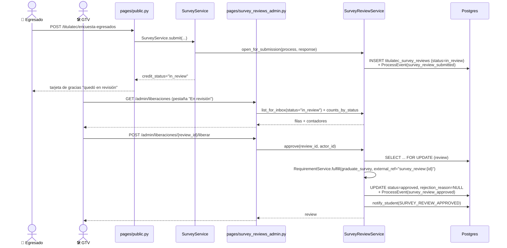

# Liberación GTV de la encuesta de egresados (Fase 2)

> **Objetivo:** Gestión Tecnológica y Vinculación (GTV) revisa la encuesta de egresados que el
> alumno ya envió y decide si libera el requisito de cotejo `graduate_survey` o le deja
> observaciones. Lo que detecta lo resuelve el egresado **físicamente** en la ventanilla de GTV
> (Residencias, Prácticas, Servicio Social) — el egresado nunca vuelve a tocar la encuesta desde
> el sistema.

| | |
|---|---|
| **Actor(es)** | 🛠️ GTV (`titulatec_tech_management`) · 👤 Alumno (solo dispara la apertura, al enviar la encuesta) |
| **Permiso(s)** | `titulatec.survey_review.page.list` (ver la bandeja) · `titulatec.survey_review.api.approve` (Liberar) · `titulatec.survey_review.api.reject` (Observar y Revocar) |
| **Trigger** | El egresado envía la encuesta de egresados (`POST /titulatec/encuesta-egresados`) con un proceso acreditable y SIN solicitud previa |
| **Precondiciones** | Proceso `status == "active"`; existe una fila `SurveyReview` para ese proceso (nace con el envío, una por proceso, `UNIQUE(process_id)`) |
| **Sub-flujos** | ⤵ [motor de avance de fase](engine_approve_advance_phase.md) (la liberación desatasca `PhaseService._cotejo_gate_error`, pero aprobar la fase 2 sigue siendo un paso separado) |
| **Estado final** | `SurveyReview.status = approved` (libera) → `graduate_survey` queda `fulfilled`; o `rejected` (con motivo) → el requisito sigue sin cumplimiento |

## Ruta en la app (UI)

1. 🛠️ GTV inicia sesión → aterriza directo en `/titulatec/admin/liberaciones` (`_ROLE_DASHBOARD`,
   `pages/nav.py`) o entra por el ítem **Liberaciones** del menú admin.
2. Pestañas **En revisión** (default, la cola de trabajo) · **Con observaciones** · **Liberadas**,
   cada una con su contador. Buscador por número de control o nombre; 50 filas por página.
3. En una fila de **En revisión**/**Con observaciones**: botón **Liberar** (con `hx-confirm`,
   siempre disponible) y un campo de motivo + **Observar**/**Actualizar observaciones**.
4. En una fila de **Liberadas**: "Liberada por {nombre} el {fecha}" y, solo si `can_revoke`, un
   campo de motivo + **Revocar** (con `hx-confirm`); si no, la píldora "Fase 2 liberada".
5. "Ver respuestas" en cualquier fila → `/titulatec/admin/encuestas/{response_id}` (bandeja
   **Encuestas**, también de GTV desde 2026-09-15, D12 — `pages/surveys_admin.py`, fuera del
   alcance de este flujo).

## Secuencia

## Pasos detallados

| # | Actor | UI / dónde | Acción | Endpoint | Service · método | Efecto en BD | Eventos / Notif |
|---|---|---|---|---|---|---|---|
| 1 | 👤 | `/titulatec/encuesta-egresados` | envía la encuesta (proceso acreditable, sin solicitud previa) | `POST /titulatec/encuesta-egresados` (`pages/public.py::survey_submit`) | `SurveyService.submit` → `SurveyReviewService.open_for_submission` | `titulatec_survey_reviews` INSERT (`status=in_review`, `submitted_at`) | `survey_review_submitted` (fase 2) |
| 2 | 🛠️ | Liberaciones | ver la cola / buscar / paginar | `GET /titulatec/admin/liberaciones[/body]` | `SurveyReviewService.list_for_inbox` + `counts_by_status` | — (lectura) | — |
| 3 | 🛠️ | fila, "Liberar" | libera (desde `in_review` **o** `rejected`) | `POST /titulatec/admin/liberaciones/{review_id}/liberar` | `SurveyReviewService.approve` | `status=approved`, `reviewed_by_id`/`reviewed_at`, `rejection_reason=NULL`; `titulatec_requirement_fulfillments` ← `RequirementService.fulfill(graduate_survey, source="system", external_ref="survey_review:{id}")` | `survey_review_approved` + notif `SURVEY_REVIEW_APPROVED` |
| 4 | 🛠️ | fila, motivo + "Observar" | deja/actualiza observaciones (desde `in_review` o `rejected`) | `POST /titulatec/admin/liberaciones/{review_id}/observar` (form `reason`) | `SurveyReviewService.reject` | `status=rejected`, `rejection_reason=motivo`, `reviewed_by_id`/`reviewed_at` | `survey_review_rejected` (payload `reason`) + notif `SURVEY_REVIEW_REJECTED` |
| 5 | 🛠️ | fila, motivo + "Revocar" (solo si `can_revoke`) | revoca una liberación | `POST /titulatec/admin/liberaciones/{review_id}/revocar` (form `reason`) | `SurveyReviewService.revoke` | `status=rejected`, `rejection_reason=motivo`; `titulatec_requirement_fulfillments` ← `RequirementService.unfulfill(graduate_survey)` | `survey_review_revoked` (payload `reason`) + notif `SURVEY_REVIEW_REVOKED` |

Las tres acciones de GTV (3–5) leen la fila con `SELECT … FOR UPDATE` antes de validar nada, y
hacen **un solo `commit`** al final (`services/survey_review_service.py`, mismo patrón que
`PhaseService`/`RequirementService`).

## Estado resultante

- **Liberar:** `SurveyReview.status=approved`; `graduate_survey` queda `fulfilled`
  (`external_ref="survey_review:{id}"`). Si era el único requisito de cotejo pendiente, deja de
  aparecer en `PhaseService._cotejo_gate_error` — pero **aprobar la fase 2 sigue siendo un paso
  separado** (⤵ [cita de cotejo](phase2_appointment_loop.md), botón "Aprobar fase 02").
- **Observar:** `SurveyReview.status=rejected` con motivo; el requisito sigue sin cumplimiento
  (nunca lo tuvo — ni `in_review` ni `rejected` tienen nada que `fulfill`/`unfulfill`).
- **Revocar:** `SurveyReview.status=rejected` con motivo; `graduate_survey` vuelve a quedar sin
  cumplimiento (la fila de `RequirementFulfillment` se borra vía `unfulfill`). Solo posible
  mientras la `ProcessPhase` de la fase 2 de ese proceso **no** esté `approved`.
- Las tres transiciones cuelgan un `ProcessEvent` de la **fase 2**, visible en el timeline del
  egresado (`_EVENT_LABELS`, `pages/student.py:169-172`) y en el expediente admin.
- El egresado **nunca** mueve un estado por su cuenta: `rejected → approved` (corrección
  resuelta en ventanilla) lo hace GTV directamente, sin que el egresado reenvíe nada (D6).

## Notificaciones al alumno

`services/notify.notify_student` (tab **Avisos** del shell mobile), best-effort, `phase_number=2`:

| Evento | Título | Cuerpo |
|---|---|---|
| `SURVEY_REVIEW_APPROVED` | "Tu encuesta de egresados fue liberada" | — |
| `SURVEY_REVIEW_REJECTED` | "Gestión Tecnológica y Vinculación dejó observaciones" | el motivo |
| `SURVEY_REVIEW_REVOKED` | "Se revocó la liberación de tu encuesta" | el motivo |

No hay correo: este dictamen es solo in-app (el canal de correo de TitulaTec está pausado en
dev, y el diseño lo deja fuera de alcance a propósito).

## Dónde se ve el estatus (lectura, cuatro pantallas más)

`SurveyReviewService.summary_for_process` es la ÚNICA consulta que arma el dict
(`status|reason|reviewed_by|reviewed_at|review_id|response_id`, con el pseudo-estado `missing`
si no hay fila todavía). La pintan, todas de solo lectura:

| Pantalla | Contexto | Plantilla |
|---|---|---|
| Home del egresado — fila del acordeón + tarjeta grande de la fase 2 | `pages/student.py::_phases_ctx` | `student/dashboard.html` |
| Mi cita — checklist físico | `pages/student.py::_checklist_ctx` | `student/cita.html` |
| Cola de Servicios Escolares — panel de atender | `pages/appointments.py` (fila `auto_source == 'graduate_survey'`) | `partials/appointments/_appt_attend.html` |
| Expediente del alumno — pestaña de la fase 2 | `pages/admin.py` (vía `RequirementService.list_with_status`) | `partials/processes/_exp_phase.html` |
| Encuesta pública, tras el primer envío | `pages/public.py::_solicitud_existente` | `public/partials/survey_status.html` / `survey_thanks.html` |

En las cuatro primeras, el requisito `graduate_survey` sustituye el texto genérico "Lo acredita
el sistema; no se marca a mano" por la píldora `survey_review_pill(status)` — macro NUEVA en
`_macros.html`, que a propósito NO reusa `estado_pill` ("Aprobado"/"Rechazado"): GTV "libera" u
"observa", vocabulario distinto para la misma forma visual — más el motivo si `rejected`, o
"Liberada por GTV · fecha" si `approved`.

## Caminos alternos / errores ❗

- **Motivo vacío, solo espacios o > 1000 caracteres** (Observar/Revocar) → `SurveyReviewService.
  _clean_reason` levanta `ValueError` → `400` + `X-Tt-Error`, nada se escribe.
- **Liberar una solicitud ya `approved`** → `ValueError("Esta solicitud ya fue liberada.")` → `400`.
- **Observar una solicitud `approved`** → `ValueError("No se pueden dejar observaciones a una
  solicitud ya liberada; revócala primero.")` → `400`.
- **Revocar una solicitud que no está `approved`**, o cuya fase 2 YA está `approved`
  (`can_revoke() == False`) → `ValueError("La fase 2 ya fue liberada; ya no se puede revocar.")` → `400`.
- **Proceso ya no `active`** (cualquier transición) → `ValueError` desde `_active_process` → `400`.
- **`review_id` inexistente** → `LookupError` → `404`, **sin** `X-Tt-Error`.
- **Convocatoria sin el requisito `graduate_survey` configurado** (al Liberar/Revocar) →
  `_graduate_survey_requirement` levanta `ValueError` pidiendo a Servicios Escolares que lo
  revise → `400`.
- **Dos personas de GTV sobre la misma fila** → `approve`/`reject`/`revoke` bloquean con
  `SELECT … FOR UPDATE` antes de leer `status`: quien llega segundo espera y valida contra el
  estado que dejó el primero.
- **El egresado no puede reabrir su propia encuesta tras observaciones** (D6, fuera de alcance
  del diseño): `SurveyService.submit` corta con `already_submitted` en cuanto existe una
  `SurveyReview`, sea cual sea su estado. La corrección ocurre físicamente en la ventanilla de
  GTV, y es GTV quien mueve `rejected → approved` directamente cuando el pendiente se resuelve
  — nunca hay un reenvío del alumno de por medio.

## Bordes conocidos

- **`SlotService.assign_batch` NO pasa por `AppointmentService.create`**
  (`services/slot_service.py:269`, hallazgo de la revisión de la Tarea 4 de este mismo trabajo;
  hoy **sin llamadores en producción** — es el motor de reparto masivo de citas). Inserta
  `ReviewAppointment` directamente, así que **se saltaría la puerta de la encuesta** (D2, ⤵ ver
  [cita de cotejo](phase2_appointment_loop.md)) si alguna vista futura lo invoca sobre un
  proceso sin `SurveyReview`. Quien cablee esa vista debe tomar los candidatos de
  `AppointmentService.list_pending_processes` (que ya exige la solicitud) o duplicar la guarda
  dentro de `assign_batch`.
- **Proceso en fase 3 o posterior sin solicitud** (legado, de antes de esta campaña): no aparece
  en Liberaciones; ninguna puerta lo afecta retroactivamente.
- **Convocatoria sin lista de requisitos al Liberar/Revocar**: `RequirementService.
  auto_requirement` siembra los de por defecto sin `commit` propio (se integra al único commit
  de la transición de GTV).
- **Usuario con roles de Escolares y de GTV**: aterriza por el que gane en `_ROLE_DASHBOARD`
  (`pages/nav.py`) y ve los ítems de ambos menús.
- **GTV no tiene alcance por carrera**: las rutas de este flujo van por `review_id`, nunca por
  `process_id` — `tests/fastapi/titulatec/test_scope_guard.py` exige la guarda de carrera a toda
  ruta con `{process_id}` en el path, y estas no la necesitan porque GTV ve todo.

## Flujos relacionados

- ← Lo abre: el envío de la encuesta (`pages/public.py::survey_submit` → `SurveyService.submit`)
  — sin flujo documentado propio todavía.
- ⤵ Guarda de agendar: [cita de cotejo (loop completo)](phase2_appointment_loop.md) — la puerta
  D2 (encuesta enviada) y el cubo "Sin encuesta".
- ⤵ Guarda de liberar la fase 2: [motor de avance de fase](engine_approve_advance_phase.md) —
  `PhaseService.approve_phase` / `_cotejo_gate_error`.
- ← Nota informativa por requisito (pieza distinta): [información para el alumno de un
  requisito de cotejo](phase2_school_services_requirement_info.md).
- ← Vitrina del alumno: [detalle de fase del alumno](xcut_student_phase_detail.md) — el badge y
  el bloque de la encuesta, visibles desde la fase 0.
- Máquina de estados: [`00_state_machine.md`](00_state_machine.md).
- Glosario: [`SurveyReview`, `SurveyReviewService`, rol `titulatec_tech_management`](_glossary.md).
