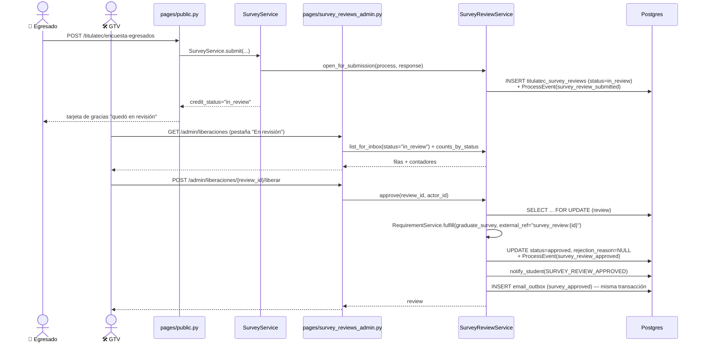

# Liberación GTV de la encuesta de egresados (Fase 2)

> **Objetivo:** Gestión Tecnológica y Vinculación (GTV) revisa la encuesta de egresados que el
> alumno ya envió y decide si libera el requisito de cotejo `graduate_survey` o le deja
> observaciones. Lo que detecta lo resuelve el egresado **con GTV, fuera del sistema** (contacto
> D12: servicio_ext@cdjuarez.tecnm.mx) — el egresado nunca vuelve a tocar la encuesta desde el
> sistema, salvo que GTV revoque una constancia PREVIA (esa se borra y la contesta, Ruling R22).

| | |
|---|---|
| **Actor(es)** | 🛠️ GTV (`titulatec_tech_management`) · 👤 Alumno (solo dispara la apertura, al enviar la encuesta) |
| **Permiso(s)** | `titulatec.survey_review.page.list` (ver la bandeja) · `titulatec.survey_review.api.approve` (Liberar) · `titulatec.survey_review.api.reject` (Observar y Revocar) |
| **Trigger** | El egresado envía la encuesta de egresados (`POST /titulatec/encuesta-egresados`) con un proceso acreditable y SIN solicitud previa |
| **Precondiciones** | Proceso `status == "active"`; existe una fila `SurveyReview` para ese proceso (nace con el envío, una por proceso, `UNIQUE(process_id)`) |
| **Sub-flujos** | ⤵ [motor de avance de fase](engine_approve_advance_phase.md) (la liberación desatasca `PhaseService._cotejo_gate_error`, pero aprobar la fase 2 sigue siendo un paso separado) · ⤵ [constancias por lote](xcut_certificates_batch.md) (emite `survey_release` al liberar, salvo `origin='prior'`) · ⤵ [constancias previas](xcut_prior_clearances.md) (D9: `register_prior`, sexta transición) · ⤵ [candado único](phase2_library_clearance.md#el-candado-único-clearancegate) (`ClearanceGate`, spec 2026-10-01) |
| **Estado final** | `SurveyReview.status = approved` (libera) → `graduate_survey` queda `fulfilled` + constancia `GTV-AAAA-NNNN` emitida (salvo `origin='prior'`); o `rejected` (con motivo) → el requisito sigue sin cumplimiento |

> **Esta liberación es UNA de las dos que abren la puerta de agendar (2026-09-29, D1 —
> `D2` del 2026-09-15 queda REVERTIDA; 2026-10-01, ampliada por el no adeudo de biblioteca).**
> Hasta el 2026-09-29, «Por agendar» (⤵ [cita de cotejo](phase2_appointment_loop.md)) solo exigía
> que el egresado hubiera **enviado** la encuesta —esta pantalla podía seguir con la solicitud
> `in_review` sin que eso bloqueara nada—. Desde D1, el `approved` que da esta pantalla (paso 3 de
> «Pasos detallados», abajo) es una de las dos liberaciones que exige
> **`ClearanceGate`** (spec `2026-10-01-titulatec-biblioteca-caja-design.md` §4.4): la guarda dura
> de `AppointmentService.create` ya no compara `SurveyReviewService.release_status(...) ==
> "approved"` directo, sino que pregunta a `ClearanceGate.status`/`.blockers`, que por dentro SÍ
> usa esa misma comparación (`SurveyReviewService.release_status`/`.is_released` siguen siendo la
> ÚNICA fuente de ese estado — nadie más lo compara, ni siquiera el gate, que delega). La encuesta
> es **incondicional** (toda convocatoria la exige) y se reporta PRIMERO en el orden de bloqueos;
> donde la convocatoria además exige el no adeudo de biblioteca, el gate suma ese segundo
> candado — ⤵ [no adeudo de biblioteca](phase2_library_clearance.md). Nada de lo que hace GTV en
> este flujo (Liberar / Observar / Revocar) cambió por esta entrega —el service sigue siendo 100%
> aditivo—; lo que cambió es que ahora `ClearanceGate` la consulta para decidir si se puede
> agendar, no solo si el requisito `graduate_survey` se acredita.

> **Qué formulario contestó el egresado no le importa a este flujo (2026-09-30, spec
> `titulatec-posgrado-design.md` §4.5).** El envío que abre la solicitud (paso 1, abajo) sale de
> `SurveyService.submit`, y desde qué formulario resolvió `pages/public.py` con
> `SurveyService.form_for_user(db, user_id)` — licenciatura (`egresados`) o, para un egresado de
> posgrado, `egresados_posgrado` si ya existe abierto, o la de licenciatura mientras no exista (D3,
> interino) — es indistinto para `SurveyReview`: es por PROCESO
> (`UNIQUE(process_id)`), sin `form_id`. GTV libera/observa/revoca exactamente igual sin importar
> cuál contestó. Detalle de la resolución por perfil: [perfil de
> titulación](engine_process_track.md).

> **Cuatro ajustes del 2026-10-01** (spec `2026-10-01-titulatec-biblioteca-caja-design.md` §4.5,
> §4.12, D9/D12/D13; ninguno cambia el VERBO de Liberar/Observar/Revocar):
>
> 1. **Constancia al liberar.** `approve` emite `CertificateService.issue(kind="survey_release",
>    source_ref="survey_review:{id}")` en la MISMA transacción, **salvo** `review.origin ==
>    'prior'` (la solicitud nace de una constancia previa que SE ya capturó a mano — el egresado
>    no necesita una nueva). `revoke` siempre llama a `CertificateService.void` (no-op si nunca
>    emitió). GTV la imprime por lote desde la página de Constancias — ⤵
>    [constancias por lote](xcut_certificates_batch.md).
> 2. **Sexta transición: `register_prior` (D9).** Un camino APARTE que no pasa por `in_review`
>    —no hay encuesta real detrás—: crea DIRECTO una solicitud `approved`/`origin='prior'`,
>    `response_id=NULL`, acredita `graduate_survey` con `external_ref="survey_prior:{id}"`
>    (distinto de `survey_review:{id}`, para que el cumplimiento diga de dónde vino) y NUNCA
>    emite constancia. Solo la llama `PriorClearanceService` (CLI `titulatec
>    import-prior-clearances`), nunca una ruta de este flujo — ⤵
>    [constancias previas](xcut_prior_clearances.md).
> 3. **D12 — línea de contacto en Observar y Revocar.** Los correos `survey_rejected`/
>    `survey_revoked` ya no dicen «Acude a la ventanilla de GTV para resolverlo.»: dicen «Para más
>    información, contactar con servicio_ext@cdjuarez.tecnm.mx» — ⤵
>    [correos del proceso al egresado](xcut_student_email_notifications.md).
> 4. **D13 — sin «Ya puedes agendar» fijo en `survey_approved`.** El correo de Liberar ya no trae
>    esa frase a secas: la decide `ClearanceGate` al componer, con el estado VIVO de las DOS
>    liberaciones (D11) — ver el flujo de correos.
>
> **Dos ajustes de la revisión final (2026-10-01):**
>
> 5. **Revocar una constancia previa la BORRA (Ruling R22).** Con `origin='prior'` no hay
>    encuesta real detrás: si quedara `rejected`, `SurveyService.submit` (que corta mientras
>    exista cualquier fila) dejaría al egresado sin poder contestar nunca. `revoke` deja el evento
>    `survey_review_revoked` (payload `reason`, `origin`, `review_id`), el `unfulfill`, el aviso y
>    el correo `survey_revoked` con `origin='prior'` —que le pide contestar la encuesta en la
>    plataforma, con el botón directo a ella— y borra la fila: la solicitud vuelve a `missing`.
>    `revoke` devuelve `None` en ese caso. La revocación de una encuesta REAL no cambia.
> 6. **D12 también en la tarjeta pública (Ruling R27).** La tarjeta de estatus de
>    `/encuesta-egresados` con observaciones (o revocada) ya no manda «a su ventanilla
>    (Residencias, Prácticas o Servicio Social)»: da la misma línea que los correos, «Para más
>    información, contactar con servicio_ext@cdjuarez.tecnm.mx» (con su `mailto:`).

## Ruta en la app (UI)

1. 🛠️ GTV inicia sesión → aterriza directo en `/titulatec/admin/liberaciones` (`_ROLE_DASHBOARD`,
   `pages/nav.py`) o entra por el ítem **Liberaciones** del menú admin.
2. Pestañas **En revisión** (default, la cola de trabajo) · **Con observaciones** · **Liberadas**,
   cada una con su contador. Buscador por número de control o nombre; 50 filas por página. Columna
   **«Constancia»** (2026-10-02, entre «Estado» y «Ver respuestas»/las acciones, en las TRES
   pestañas): folio y, si ya se imprimió, «Impresa · lote #N · fecha» o «Sin imprimir»; «Anulada
   tras imprimir» si la última se anuló DESPUÉS de imprimirse — ⤵ [constancias por
   lote](xcut_certificates_batch.md#estado-de-impresión-ya-se-imprimió-e1e5-e7). La anulada
   tras imprimir abre la celda, sin un «—» encima (M1 de la revisión final). Con una inscripción
   revocada (cualquier pestaña de historial) la fila pierde sus acciones y pinta «Revocada», pero
   la celda de constancia SÍ se conserva: «Impresa» y «Anulada tras imprimir» no cambian, y una
   vigente sin lote pinta la píldora «No se imprimirá» y la nota tenue «inscripción revocada»
   —ya no entra a ningún lote; Rulings R13 y R18; `revoked=r.revoked`—.
3. En una fila de **En revisión**/**Con observaciones**: botón **Liberar** (con `hx-confirm`,
   siempre disponible) y un campo de motivo + **Observar**/**Actualizar observaciones**.
4. En una fila de **Liberadas**: "Liberada por {nombre} el {fecha}" y, solo si `can_revoke`, un
   campo de motivo + **Revocar** (con `hx-confirm`); si no, la píldora "Fase 2 liberada".
5. "Ver respuestas" en cualquier fila → `/titulatec/admin/encuestas/{response_id}` (bandeja
   **Encuestas**, también de GTV desde 2026-09-15, D12 — `pages/surveys_admin.py`, fuera del
   alcance de este flujo).

## Secuencia

```mermaid
sequenceDiagram
    actor E as 👤 Egresado
    actor G as 🛠️ GTV
    participant PUB as pages/public.py
    participant SS as SurveyService
    participant API as pages/survey_reviews_admin.py
    participant SVC as SurveyReviewService
    participant DB as Postgres

    E->>PUB: POST /titulatec/encuesta-egresados
    PUB->>SS: SurveyService.submit(...)
    SS->>SVC: open_for_submission(process, response)
    SVC->>DB: INSERT titulatec_survey_reviews (status=in_review)<br/>+ ProcessEvent(survey_review_submitted)
    SS-->>PUB: credit_status="in_review"
    PUB-->>E: tarjeta de gracias "quedó en revisión"

    G->>API: GET /admin/liberaciones (pestaña "En revisión")
    API->>SVC: list_for_inbox(status="in_review") + counts_by_status
    SVC-->>API: filas + contadores
    API-->>G: #tt-releases-body

    G->>API: POST /admin/liberaciones/{review_id}/liberar
    API->>SVC: approve(review_id, actor_id)
    SVC->>DB: SELECT ... FOR UPDATE (review)
    SVC->>SVC: RequirementService.fulfill(graduate_survey, external_ref="survey_review:{id}")
    SVC->>DB: UPDATE status=approved, rejection_reason=NULL<br/>+ ProcessEvent(survey_review_approved)
    SVC->>DB: notify_student(SURVEY_REVIEW_APPROVED)
    SVC->>DB: INSERT email_outbox (survey_approved) — misma transacción
    SVC-->>API: review
    API-->>G: #tt-releases-body (parcial re-renderizado, misma pestaña)
```

## Pasos detallados

| # | Actor | UI / dónde | Acción | Endpoint | Service · método | Efecto en BD | Eventos / Notif | Correo |
|---|---|---|---|---|---|---|---|---|
| 1 | 👤 | `/titulatec/encuesta-egresados` | envía la encuesta (proceso acreditable, sin solicitud previa) | `POST /titulatec/encuesta-egresados` (`pages/public.py::survey_submit`) | `SurveyService.submit` → `SurveyReviewService.open_for_submission` | `titulatec_survey_reviews` INSERT (`status=in_review`, `submitted_at`) | `survey_review_submitted` (fase 2) | — (acción del propio egresado) |
| 2 | 🛠️ | Liberaciones | ver la cola / buscar / paginar | `GET /titulatec/admin/liberaciones[/body]` | `SurveyReviewService.list_for_inbox` + `counts_by_status` | — (lectura) | — | — |
| 3 | 🛠️ | fila, "Liberar" | libera (desde `in_review` **o** `rejected`) | `POST /titulatec/admin/liberaciones/{review_id}/liberar` | `SurveyReviewService.approve` | `status=approved`, `reviewed_by_id`/`reviewed_at`, `rejection_reason=NULL`; `titulatec_requirement_fulfillments` ← `RequirementService.fulfill(graduate_survey, source="system", external_ref="survey_review:{id}")`; `titulatec_certificates` ← `CertificateService.issue(kind="survey_release", ...)` **salvo** `origin='prior'` | `survey_review_approved` + notif `SURVEY_REVIEW_APPROVED` | `survey_approved` (D13: sin «Ya puedes agendar» fijo) |
| 4 | 🛠️ | fila, motivo + "Observar" | deja/actualiza observaciones (desde `in_review` o `rejected`) | `POST /titulatec/admin/liberaciones/{review_id}/observar` (form `reason`) | `SurveyReviewService.reject` | `status=rejected`, `rejection_reason=motivo`, `reviewed_by_id`/`reviewed_at` | `survey_review_rejected` (payload `reason`) + notif `SURVEY_REVIEW_REJECTED` | `survey_rejected` (con el motivo; D12: línea de contacto `servicio_ext@cdjuarez.tecnm.mx`) |
| 5 | 🛠️ | fila, motivo + "Revocar" (solo si `can_revoke`) | revoca una liberación | `POST /titulatec/admin/liberaciones/{review_id}/revocar` (form `reason`) | `SurveyReviewService.revoke` | `status=rejected`, `rejection_reason=motivo` — **una previa (`origin='prior'`) se BORRA** y vuelve a `missing` (Ruling R22); `titulatec_requirement_fulfillments` ← `RequirementService.unfulfill(graduate_survey)`; `titulatec_certificates` ← `CertificateService.void(source_ref="survey_review:{id}", ...)` (no-op si nunca emitió) | `survey_review_revoked` (payload `reason`, `origin`, `review_id`) + notif `SURVEY_REVIEW_REVOKED` | `survey_revoked` (con el motivo; D12: línea de contacto; con `origin='prior'` pide contestar la encuesta) |
| 6 | 🤖 | CLI `titulatec import-prior-clearances --tipo encuesta` | constancia previa (D9): el egresado YA traía su liberación de otro semestre | — (sin ruta; solo `PriorClearanceService`) | `SurveyReviewService.register_prior` | `titulatec_survey_reviews` INSERT DIRECTO `status=approved`, `origin='prior'`, `response_id=NULL`; `titulatec_requirement_fulfillments` ← `fulfill(graduate_survey, external_ref="survey_prior:{id}")`; **sin** constancia | `survey_review_prior` | `survey_approved` (texto propio de previa) |

Las tres acciones de GTV (3–5) leen la fila con `SELECT … FOR UPDATE` antes de validar nada, y
hacen **un solo `commit`** al final (`services/survey_review_service.py`, mismo patrón que
`PhaseService`/`RequirementService`).

## Estado resultante

- **Liberar:** `SurveyReview.status=approved`; `graduate_survey` queda `fulfilled`
  (`external_ref="survey_review:{id}"`). Si era el único requisito de cotejo pendiente, deja de
  aparecer en `PhaseService._cotejo_gate_error` — pero **aprobar la fase 2 sigue siendo un paso
  separado** (⤵ [cita de cotejo](phase2_appointment_loop.md), botón "Aprobar fase 02").
- **Observar:** `SurveyReview.status=rejected` con motivo; el requisito sigue sin cumplimiento
  (nunca lo tuvo — ni `in_review` ni `rejected` tienen nada que `fulfill`/`unfulfill`).
- **Revocar:** `SurveyReview.status=rejected` con motivo; `graduate_survey` vuelve a quedar sin
  cumplimiento (la fila de `RequirementFulfillment` se borra vía `unfulfill`). Solo posible
  mientras la `ProcessPhase` de la fase 2 de ese proceso **no** esté `approved`. Una constancia
  previa revocada no queda `rejected`: se BORRA y el egresado vuelve a ver el formulario de la
  encuesta (Ruling R22).
- Las tres transiciones cuelgan un `ProcessEvent` de la **fase 2**, visible en el timeline del
  egresado (`_EVENT_LABELS`, `pages/student.py:169-172`) y en el expediente admin.
- El egresado **nunca** mueve un estado por su cuenta: `rejected → approved` (corrección
  resuelta en ventanilla) lo hace GTV directamente, sin que el egresado reenvíe nada (D6).

## Notificaciones al alumno

`services/notify.notify_student` (tab **Avisos** del shell mobile), best-effort, `phase_number=2`:

| Evento | Título | Cuerpo |
|---|---|---|
| `SURVEY_REVIEW_APPROVED` | "Tu encuesta de egresados fue liberada" | — |
| `SURVEY_REVIEW_REJECTED` | "Gestión Tecnológica y Vinculación dejó observaciones" | el motivo |
| `SURVEY_REVIEW_REVOKED` | "Se revocó la liberación de tu encuesta" | el motivo |

**Correo (desde 2026-09-28).** Además del in-app, cada transición encola su correo con
`StudentMail.survey_result` (`services/student_mail.py`) en la misma transacción, antes del
`commit` — `result` ∈ `approved|rejected|revoked` → `kind` `survey_approved` / `survey_rejected` /
`survey_revoked`, individual, payload `{reason}` (el motivo ya recortado; `None` al liberar). Aquí
no se envía nada: lo manda después el despachador periódico (`titulatec.email_dispatch`). Abrir
la solicitud (paso 1) no lleva correo: es acción del propio egresado. Lo fija
`tests/fastapi/titulatec/test_mail_hooks.py::test_gtv_liberar_observar_revocar_encolan`.

## Dónde se ve el estatus (lectura, cuatro pantallas más)

`SurveyReviewService.summary_for_process` es la ÚNICA consulta que arma el dict
(`status|reason|reviewed_by|reviewed_at|review_id|response_id|origin|paper_to_collect`, con el pseudo-estado
`missing` si no hay fila todavía). `origin` ∈ `submission` (la de siempre) \| `prior` (D9,
⤵ [constancias previas](xcut_prior_clearances.md)): la bandeja de GTV («Liberadas») y la tarjeta
pública de estatus lo usan para distinguir una liberación real de una constancia previa — sin
«Ver respuestas» cuando es `prior` del CSV (no hay `SurveyResponse` detrás; las del Excel sí, 2026-10-05). La pintan, todas de solo
lectura:

| Pantalla | Contexto | Plantilla |
|---|---|---|
| Home del egresado — fila del acordeón + tarjeta grande de la fase 2 | `pages/student.py::_phases_ctx` | `student/dashboard.html` |
| Mi cita — checklist físico | `pages/student.py::_checklist_ctx` | `student/cita.html` |
| Cola de Servicios Escolares — panel de atender | `pages/appointments.py` (fila `auto_source == 'graduate_survey'`) | `partials/appointments/_appt_attend.html` |
| Expediente del alumno — pestaña de la fase 2 | `pages/admin.py` (vía `RequirementService.list_with_status`) | `partials/processes/_exp_phase.html` |
| Encuesta pública, tras el primer envío (o con su respuesta de Forms importada esperando la inscripción: pseudo-estado `imported`, 2026-10-05) | `pages/public.py::_solicitud_existente` | `public/partials/survey_status.html` / `survey_thanks.html` |

En las cuatro primeras, el requisito `graduate_survey` sustituye el texto genérico "Lo acredita
el sistema; no se marca a mano" por la píldora `survey_review_pill(status)` — macro NUEVA en
`_macros.html`, que a propósito NO reusa `estado_pill` ("Aprobado"/"Rechazado"): GTV "libera" u
"observa", vocabulario distinto para la misma forma visual — más el motivo si `rejected`, o
"Liberada por GTV · fecha" si `approved`.

**Constancia en el panel de atender y el expediente (2026-10-02).** `summary_for_process` NO trae
la constancia (Ruling R14 de la revisión final: también la usan el home, «Mi cita» y la encuesta
pública, que no la pintan, así que no consulta `titulatec_certificates`). La cuelga cada vista de
SE: `pages/appointments.py`/`pages/admin.py::_detail_ctx` hacen UNA llamada
`CertificateService.print_status_map(db, [ref_encuesta, ref_biblioteca])` para las dos filas, con
los refs que existan (`SurveyReviewService.certificate_ref(review_id)` = `survey_review:{id}`; sin
solicitud no se pide), y dejan `certificate` en el dict (`None` si no aplica).
`_appt_attend.html`/`_exp_phase.html` pintan `certificate_cell(certificate, prior=(origin ==
'prior'), revoked=)` junto a la píldora — folio + «Impresa»/«Sin imprimir» (o, con el proceso
`cancelled`, la píldora «No se imprimirá» y la nota «inscripción revocada», R13/R18), o «Anulada
tras imprimir» — ⤵
[constancias por lote](xcut_certificates_batch.md#estado-de-impresión-ya-se-imprimió-e1e5-e7). A
lo más 2 consultas de constancias por vista, en total (invariante 2; desde el Ruling R17 el
resumen de biblioteca tampoco consulta constancias), la misma cota de `list_for_inbox` por página.

## Caminos alternos / errores ❗

- **Motivo vacío, solo espacios o > 1000 caracteres** (Observar/Revocar) → `SurveyReviewService.
  _clean_reason` levanta `ValueError` → `400` + `X-Tt-Error`, nada se escribe.
- **Liberar una solicitud ya `approved`** → `ValueError("Esta solicitud ya fue liberada.")` → `400`.
- **Observar una solicitud `approved`** → `ValueError("No se pueden dejar observaciones a una
  solicitud ya liberada; revócala primero.")` → `400`.
- **Revocar una solicitud que no está `approved`**, o cuya fase 2 YA está `approved`
  (`can_revoke() == False`) → `ValueError("La fase 2 ya fue liberada; ya no se puede revocar.")` → `400`.
- **Proceso ya no `active`** (cualquier transición) → `ValueError` desde `_active_process` → `400`.
- **`review_id` inexistente** → `LookupError` → `404`, **sin** `X-Tt-Error`.
- **Convocatoria sin el requisito `graduate_survey` configurado** (al Liberar/Revocar) →
  `_graduate_survey_requirement` levanta `ValueError` pidiendo a Servicios Escolares que lo
  revise → `400`.
- **Dos personas de GTV sobre la misma fila** → `approve`/`reject`/`revoke` bloquean con
  `SELECT … FOR UPDATE` antes de leer `status`: quien llega segundo espera y valida contra el
  estado que dejó el primero.
- **El egresado no puede reabrir su propia encuesta tras observaciones** (D6, fuera de alcance
  del diseño): `SurveyService.submit` corta con `already_submitted` en cuanto existe una
  `SurveyReview`, sea cual sea su estado. La corrección se resuelve con GTV fuera del sistema
  (contacto D12: servicio_ext@cdjuarez.tecnm.mx, en el correo y en la tarjeta pública), y es GTV
  quien mueve `rejected → approved` directamente cuando el pendiente se resuelve — nunca hay un
  reenvío del alumno de por medio. **Excepción:** una constancia previa revocada se borra
  (Ruling R22), así que ese egresado SÍ contesta la encuesta (no tenía una real).

## Bordes conocidos

- **`SlotService.assign_batch` NO pasa por `AppointmentService.create`**
  (`services/slot_service.py:269`, hallazgo de la revisión de la Tarea 4 de este mismo trabajo;
  hoy **sin llamadores en producción** — es el motor de reparto masivo de citas). Inserta
  `ReviewAppointment` directamente, así que **se saltaría la puerta de la encuesta LIBERADA** (D1,
  2026-09-29, revierte D2 del 2026-09-15 — ⤵ ver [cita de cotejo](phase2_appointment_loop.md)) si
  alguna vista futura lo invoca sobre un proceso cuya encuesta no está liberada. Quien cablee esa
  vista debe tomar los candidatos de `AppointmentService.list_pending_processes` (que ya exige la
  solicitud liberada) o duplicar la guarda dentro de `assign_batch`.
- **Proceso en fase 3 o posterior sin solicitud** (legado, de antes de esta campaña): no aparece
  en Liberaciones; ninguna puerta lo afecta retroactivamente.
- **Convocatoria sin lista de requisitos al Liberar/Revocar**: `RequirementService.
  auto_requirement` siembra los de por defecto sin `commit` propio (se integra al único commit
  de la transición de GTV).
- **Usuario con roles de Escolares y de GTV**: aterriza por el que gane en `_ROLE_DASHBOARD`
  (`pages/nav.py`) y ve los ítems de ambos menús.
- **GTV no tiene alcance por carrera**: las rutas de este flujo van por `review_id`, nunca por
  `process_id` — `tests/fastapi/titulatec/test_scope_guard.py` exige la guarda de carrera a toda
  ruta con `{process_id}` en el path, y estas no la necesitan porque GTV ve todo.

## Respuestas importadas y constancia por recoger (2026-10-05)

Spec `2026-10-05-titulatec-import-encuesta-xlsx-design.md` §4.4 (D1/D3/R7/R9/R10). Origen: ⤵
[importar la encuesta desde el Excel](xcut_prior_clearances.md#importar-la-encuesta-de-egresados-desde-el-excel-de-forms-2026-10-05).
Lo de esta sección solo ocurre con previas que traen `response_id`/`paper_pending`; el resto de
Liberaciones no cambia.

- **«Ver respuestas» en una previa.** La columna ya aparecía siempre que había `response_id`
  (`templates/titulatec/admin/partials/survey_reviews_body.html:107`); las previas importadas ahora
  lo traen, así que GTV abre `/titulatec/admin/encuestas/{response_id}` también desde «Liberadas».
  Las previas del CSV siguen sin enlace.
- **Píldora «Constancia por recoger»** (ámbar) junto a la del estado
  (`survey_reviews_body.html:105`), mientras `SurveyReviewService.paper_to_collect(review)`
  (`services/survey_review_service.py:296`) sea cierto: `paper_pending` y sin `paper_delivered_at`.
  `list_for_inbox` y `summary_for_process` la cargan como `paper_to_collect`. **Con la inscripción
  revocada (`r.revoked`) no se pinta**, igual que el botón (fix 2026-10-05, commit `29edfc92`;
  prueba `test_previa_con_inscripcion_revocada_no_muestra_la_pildora_ni_el_boton`).
- **«Marcar constancia entregada»** (solo en «Liberadas», fila no revocada con papel por recoger,
  `survey_reviews_body.html:146`): `POST /titulatec/admin/liberaciones/{review_id}/entregada`
  (`pages/survey_reviews_admin.py:203`, `titulatec.pages.releases.paper_delivered`), permiso
  `titulatec.survey_review.api.approve` (el mismo de Liberar: GTV cierra la liberación que ella
  misma expide). Lleva `hx-confirm` en el `<form>` y devuelve la bandeja re-renderizada.
  `SurveyReviewService.mark_paper_delivered` (`survey_review_service.py:617`) llena
  `paper_delivered_at`/`paper_delivered_by_id` (`paper_pending` se conserva como hecho histórico) y
  deja el evento **`survey_paper_delivered`** (payload `{review_id}`; etiquetas en
  `pages/admin.py:1227` y `pages/student.py:321`). Sin correo ni aviso (R10). `404` si el
  `review_id` no existe; `400` + `X-Tt-Error` si no tenía papel por recoger o ya se entregó.
- **Lo que ve el alumno** mientras el papel esté por recoger: «Recoge tu constancia de liberación
  en Gestión Tecnológica y Vinculación.» (`data-tt-paper-pickup`) en la tarjeta de estatus de la
  encuesta (`public/partials/survey_status.html:45`), en el tablero (`student/dashboard.html:104`
  en el héroe de la fase actual y `:258` en el acordeón) y en Mi cita
  (`partials/student/_cita_panel.html:74`). Desaparece al marcarla entregada.
- **Correo de la previa** (R10): `StudentMail.survey_result(..., paper_pending=)`
  (`services/student_mail.py:385`) mete `paper_pending` en el payload solo si es verdadero;
  `_compose_survey` lo re-valida al componer (`services/mail_compose.py:595-608`: payload Y
  `paper_to_collect` vivo, D8) y `email/survey_result.html:30` pone la línea en negritas, solo en
  la variante de previa aprobada. ⤵ [correos del proceso](xcut_student_email_notifications.md).
- **Revocar** una previa con respuesta la BORRA igual (R22), pero la `SurveyResponse` importada
  NO se borra: sigue en «Encuestas».

### Encuestas (bandeja de SE/GTV): lo que cambia para respuestas importadas

(`pages/surveys_admin.py`, `templates/titulatec/admin/partials/surveys_body.html`,
`survey_detail.html`; este flujo no tiene documento propio, vive aquí.)

- **Pastilla «Importada»** (violeta) en la columna «Origen» en vez del código de
  `identity_source` (`surveys_body.html:46`) y bajo el nombre en el detalle (`survey_detail.html:10`).
- **Nombre**: `_who(response, user)` (`surveys_admin.py:116`) usa el de la cuenta; si no hay
  cuenta, `answers.nombre_completo`; si no, «Anónimo». El control viene de la respuesta.
- **Valores no coincidentes** (`SurveyAnswer.is_raw`): el detalle los agrupa en `data-tt-raw`
  (`survey_detail.html:21`) con «Valor original, no coincide con las opciones actuales».
- **«Otros datos importados»** (`#tt-survey-extras`, `survey_detail.html:33`): llaves de la
  respuesta que no están en el schema del formulario (R9), con etiqueta legible de
  `_EXTRA_LABELS` (`surveys_admin.py:133`, p. ej. `extra_aspecto_no_trabajo`).
- **CSV**: columna nueva `importada` (`sí`/`no`) justo después de `identidad`
  (`services/survey_service.py:466`, `SurveyService.export_rows`). Las llaves `extra_*` de las
  respuestas importadas (R9, p. ej. `extra_aspecto_no_trabajo`) van como columnas al final, en
  orden alfabético, solo si alguna respuesta del formulario las trae (`:460-461`; M5 de la
  revisión final).
- **Ocultas con valor real**: un valor que Forms aceptó en una pregunta que no aplicaba
  (`visible_when` falso) se guarda normalizado; solo lleva la marca de «Valor original» (`is_raw`)
  si además no coincide con las opciones/formato. El detalle NO distingue hoy que la pregunta no
  aplicaba ⤵ [import](xcut_prior_clearances.md#importar-la-encuesta-de-egresados-desde-el-excel-de-forms-2026-10-05).

## Liberaciones y Encuestas: pager compartido (2026-10-04)

Cambio de la spec `2026-10-04-titulatec-paginacion-design.md` §9. `SurveyReviewService.list_for_inbox` (`services/survey_review_service.py:725`, `paginate_query` en `:771`) devuelve un `Page` y la bandeja de Liberaciones (`pages/survey_reviews_admin.py:76`, `survey_reviews_body.html:175`, prefijo `tt-liberaciones`) usa la macro `pager`; lo mismo la lista de respuestas de Encuestas (`pages/surveys_admin.py:76`, `:93`, `surveys_body.html:54`, prefijo `tt-surveys`). Parámetros: Liberaciones `status`, `q`, `page`; Encuestas `form_id`, `page`. Cambiar pestaña o búsqueda ⇒ `page=1`; fuera de rango ⇒ última válida. Los contadores de pestaña respetan la búsqueda (como ya hacían).

**Buscador sin pérdida de tecleo**: `#tt-releases-q` lleva `hx-preserve="true"` y `#tt-releases-filters` anuncia `data-tt-q-server` (`survey_reviews_body.html`, commit `b2ce954a`, 2026-10-04); la sincronización la hace `titulatec-utils.js:414`.

## Flujos relacionados

- ← Lo abre: el envío de la encuesta (`pages/public.py::survey_submit` → `SurveyService.submit`)
  — sin flujo documentado propio todavía.
- ← Qué formulario contestó el egresado (indistinto para este flujo): [perfil de titulación por
  nivel de carrera](engine_process_track.md) — `SurveyService.form_for_user`.
- ⤵ [No adeudo de biblioteca: Biblioteca → Caja](phase2_library_clearance.md) — la OTRA
  liberación que exige `ClearanceGate` donde la convocatoria la pide; esta encuesta sigue siendo
  incondicional y se reporta primero.
- ⤵ [Constancias por lote](xcut_certificates_batch.md) — numeración, PDF y D15 (GTV imprime
  `survey_release`).
- ⤵ [Constancias previas](xcut_prior_clearances.md) — D9, `register_prior`, las CLI de
  importación (`import-prior-clearances` y, 2026-10-05, `import-survey-xlsx`: los únicos caminos que crean una solicitud `origin='prior'`).
- ⤵ Guarda de agendar: [cita de cotejo (loop completo)](phase2_appointment_loop.md) — la puerta
  D1 del 2026-09-29 (encuesta LIBERADA; **revierte D2 del 2026-09-15**, que se conformaba con
  enviarla) y el cubo «Liberaciones pendientes» (antes «Encuesta sin liberar», que a su vez fue
  «Sin encuesta»).
- ⤵ Guarda de liberar la fase 2: [motor de avance de fase](engine_approve_advance_phase.md) —
  `PhaseService.approve_phase` / `_cotejo_gate_error`.
- ← Nota informativa por requisito (pieza distinta): [información para el alumno de un
  requisito de cotejo](phase2_school_services_requirement_info.md).
- ← Vitrina del alumno: [detalle de fase del alumno](xcut_student_phase_detail.md) — el badge y
  el bloque de la encuesta, visibles desde la fase 0.
- Máquina de estados: [`00_state_machine.md`](00_state_machine.md).
- Glosario: [`SurveyReview`, `SurveyReviewService`, rol `titulatec_tech_management`](_glossary.md).
