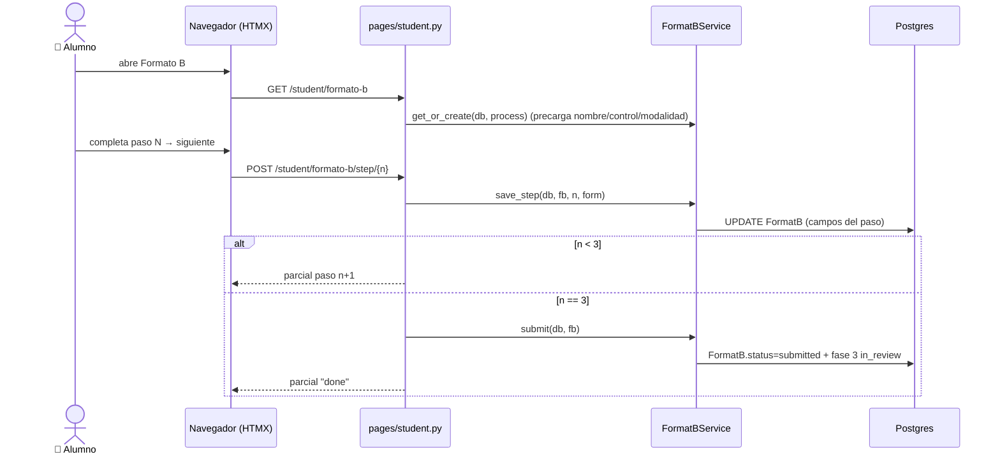

# El alumno llena y envía el Formato B (Fase 3)

> **Objetivo:** el alumno completa el Formato B (3 pasos) y lo envía; queda listo para
> que Titulaciones lo apruebe.

| | |
|---|---|
| **Actor(es)** | 👤 Alumno (`student`) |
| **Permiso(s)** | `format_b.page.fill` · `format_b.api.save` · `format_b.api.submit` |
| **Trigger** | El alumno entra al Formato B (fase 3 activa) |
| **Precondiciones** | Proceso `active`, fase 2 aprobada / fase 3 `in_progress` |
| **Estado final** | `FormatB.status=submitted` + fase 3 `in_review` |

## Ruta en la app (UI)

1. `/titulatec/student/formato-b` (shell, arranca en paso 1).
2. Stepper **Personal → Escolar → Proyecto** (parcial `partials/formato_b_step.html`,
   swap `outerHTML` de `#formato-b-body`). Guarda al pasar de paso; permite back nav.
3. En el paso 3, "Enviar" → confirma → pantalla de éxito.

## Secuencia

## Pasos detallados

| # | Actor | UI / dónde | Acción | Endpoint | Service · método | Efecto en BD | Eventos |
|---|---|---|---|---|---|---|---|
| 1 | 👤 | `/student/formato-b` | abrir | `GET /student/formato-b` | `FormatBService.get_or_create` | `FormatB(status=draft)` si no existía | — |
| 2 | 👤 | stepper | guardar paso | `POST /student/formato-b/step/{n}` (n=1..3) | `FormatBService.save_step` | `FormatB` campos del paso (fechas `type=month`→date 1er día) | — |
| 2b| 👤 | stepper | volver | `GET /student/formato-b/step/{n}` | `FormatBService.to_ctx` | — | — |
| 3 | 👤 | paso 3 | enviar | `POST /student/formato-b/step/3` | `FormatBService.submit` | `FormatB.status=submitted`; `ProcessPhase[3]=in_review` | — |

## Estado resultante

- `FormatB.status=submitted`; fase 3 `in_review`.
- Aparece en el detalle del proceso (card Formato B) para que 🎓 Titulaciones apruebe/rechace
  (`POST /admin/processes/{id}/format-b/review`).

## Caminos alternos / errores ❗

- Carrera = select de `core_programs`; nº control y nombre precargados desde el `User`/proceso.
- Rechazo de Titulaciones → `FormatB.status=rejected`; el alumno corrige y reenvía.

## Flujos relacionados

- ← Previo: [cita de cotejo](phase2_appointment_loop.md).
- ⤵ Aprobación de fase: [motor de avance](engine_approve_advance_phase.md).
