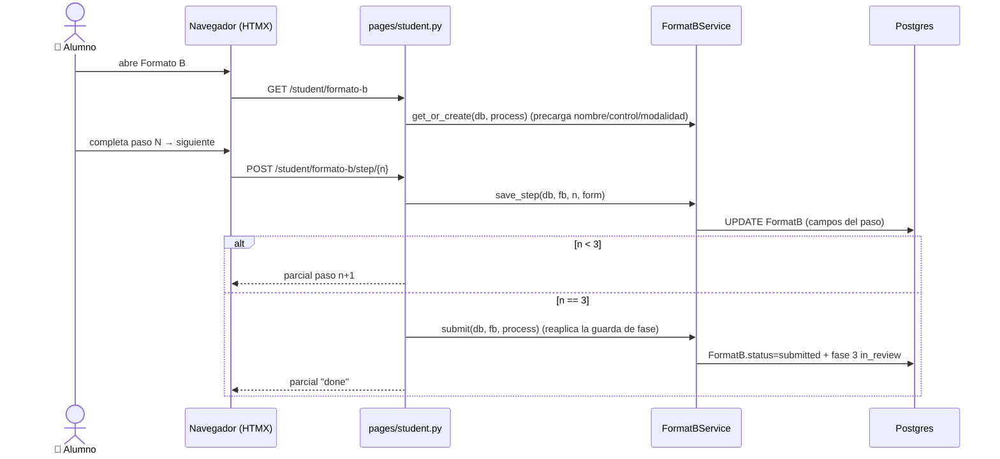

# El alumno llena y envía el Formato B (Fase 3)

> **Objetivo:** el alumno completa el Formato B (3 pasos) y lo envía; queda listo para
> que Titulaciones lo apruebe.

| | |
|---|---|
| **Actor(es)** | 👤 Alumno (`student`) |
| **Permiso(s)** | `format_b.page.fill` · `format_b.api.save` · `format_b.api.submit` |
| **Trigger** | El alumno toca **«Llenar Formato B»** en la tarjeta «Tu proceso» del dashboard ([acordeón de fases](xcut_student_phase_detail.md)); el CTA solo aparece con la fase 3 activa |
| **Precondiciones** | Proceso `active` y **la fase 3 es su `current_phase`** (`in_progress` o `rejected`). **Se valida** en [`PhaseService.assert_student_can_act`](engine_student_phase_lock.md) |
| **Estado final** | `FormatB.status=submitted` + fase 3 `in_review` |

## Ruta en la app (UI)

1. Dashboard → tarjeta «Tu proceso» → «Llenar Formato B» (o directo
   `/titulatec/student/formato-b`). Arranca en el paso 1.
2. Stepper **Personal → Escolar → Proyecto** (parcial `partials/formato_b_step.html`,
   swap `outerHTML` de `#formato-b-body`). Guarda al pasar de paso; permite back nav.
3. En el paso 3, "Enviar" → confirma → pantalla de éxito.

## Secuencia

```mermaid
sequenceDiagram
    actor U as 👤 Alumno
    participant FE as Navegador (HTMX)
    participant API as pages/student.py
    participant SVC as FormatBService
    participant DB as Postgres
    U->>FE: abre Formato B
    FE->>API: GET /student/formato-b
    API->>SVC: get_or_create(db, process) (precarga nombre/control/modalidad)
    U->>FE: completa paso N → siguiente
    FE->>API: POST /student/formato-b/step/{n}
    API->>SVC: save_step(db, fb, n, form)
    SVC->>DB: UPDATE FormatB (campos del paso)
    alt n < 3
        API-->>FE: parcial paso n+1
    else n == 3
        API->>SVC: submit(db, fb, process)  (reaplica la guarda de fase)
        SVC->>DB: FormatB.status=submitted + fase 3 in_review
        API-->>FE: parcial "done"
    end
```

## Pasos detallados

| # | Actor | UI / dónde | Acción | Endpoint | Service · método | Efecto en BD | Eventos |
|---|---|---|---|---|---|---|---|
| 1 | 👤 | `/student/formato-b` | abrir | `GET /student/formato-b` | `FormatBService.get_or_create` | `FormatB(status=draft)` si no existía | — |
| 2 | 👤 | stepper | guardar paso | `POST /student/formato-b/step/{n}` (n=1..3) | `FormatBService.save_step` | `FormatB` campos del paso (fechas `type=month`→date 1er día) | — |
| 2b| 👤 | stepper | volver | `GET /student/formato-b/step/{n}` | `FormatBService.to_ctx` | — | — |
| 3 | 👤 | paso 3 | enviar | `POST /student/formato-b/step/3` | `FormatBService.submit` (guarda dentro) | `FormatB.status=submitted`; `ProcessPhase[3]=in_review` | — |

## Estado resultante

- `FormatB.status=submitted`; fase 3 `in_review`.
- Aparece en el detalle del proceso (card Formato B) para que 🎓 Titulaciones apruebe/rechace
  (`POST /admin/processes/{id}/format-b/review`).

## Caminos alternos / errores ❗

- Carrera = select de `core_programs`; nº control y nombre precargados desde el `User`/proceso.
- Rechazo de Titulaciones → `FormatB.status=rejected`; el alumno corrige y reenvía: la fase 3
  sigue siendo su `current_phase`, así que la guarda **no** lo estorba.
- **Fuera de la fase 3** ([guarda de fase](engine_student_phase_lock.md)): `GET
  /student/formato-b` responde `302` a `/student/dashboard?fase=3`; los pasos 2, 2b y 3
  devuelven `400` + `X-Tt-Error`. El 302 va **antes** de `get_or_create`: ese `commit`
  hacía que el simple GET desde otra fase ya creara la fila `titulatec_format_b`.
- Este era el peor de los agujeros: `POST .../step/3` desde la **fase 1** dejaba la fase 3
  en `in_review` y el Formato B en `submitted` con `current_phase=1` — el proceso entraba en
  la cola de 🎓 Titulaciones sin haber pasado documentos iniciales ni cita de cotejo.

## Flujos relacionados

- ← Previo: [cita de cotejo](phase2_appointment_loop.md).
- ⤵ Aprobación de fase: [motor de avance](engine_approve_advance_phase.md).
- 🖥️ Entrada y seguimiento: [acordeón de fases del dashboard](xcut_student_phase_detail.md) — el
  panel de la fase 3 dice **en qué paso va** (1/3, 2/3, 3/3) y si ya está enviado. El paso se
  deriva de campos que llenó el alumno, no de los que `get_or_create` precarga: si contaran, el
  paso 2 se vería completo desde el minuto cero.
