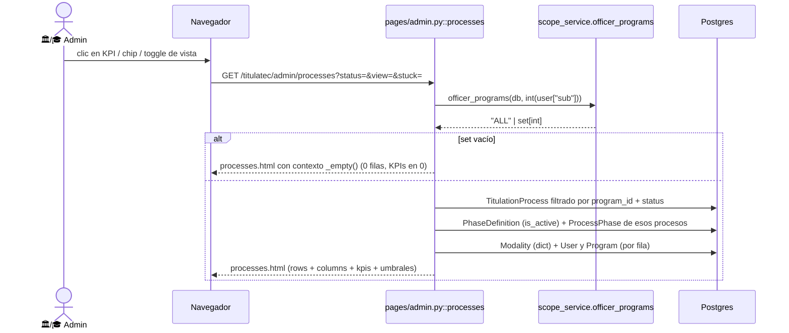

# La bandeja administrativa de procesos (transversal)

> **Objetivo:** que un usuario administrativo vea de un vistazo los procesos que le corresponden,
> en qué fase están, **cuántos días llevan sin moverse** y cuáles están atorados, con dos lentes
> sobre el mismo dataset: tabla densa y tablero kanban por fase.

| | |
|---|---|
| **Actor(es)** | 🏛️ Servicios Escolares (`titulatec_school_services`) · 🏛️ Jefe (`titulatec_school_services_head`) · 🎓 Titulaciones (`titulatec_titulaciones`) |
| **Permiso(s)** | **Home:** `titulatec.dashboard.titulaciones` · `titulatec.dashboard.school_services` · `titulatec.dashboard.admin` · `titulatec.process.page.list` (`pages/admin.py:288-293`).<br>**Procesos:** `_PROCESS_VIEW_PERMS` (`pages/admin.py:23-28`) = `process.page.list` · `process.page.detail` · `process.api.read.all` · los 3 `dashboard.*`. Basta **uno**: `require_page_app` intersecta (`itcj2/dependencies.py:131-135`). |
| **Trigger** | Clic en **Bandeja** o **Procesos** del menú admin (`pages/nav.py:96-97`), o entrada directa por URL. |
| **Precondiciones** | Asignación en la app `titulatec` + al menos uno de los permisos de arriba. Para ver filas: procesos dentro del [alcance por carrera](engine_officer_scope.md). |
| **Sub-flujos** | ⤵ [alcance por carrera](engine_officer_scope.md) (filtra el listado) · ⤵ el detalle abre [revisión de docs](phase1_admin_review_initial_docs.md) y el [motor de avance](engine_approve_advance_phase.md) |
| **Estado final** | — (vista de lectura; ningún endpoint de este flujo escribe en BD) |

## Ruta en la app (UI)

1. `/titulatec/admin/` → **Bandeja**: 4 tarjetas de conteo + aviso "En construcción"
   (`templates/titulatec/admin/dashboard.html`). Sin acciones.
2. `/titulatec/admin/processes` → **Procesos**: 5 KPIs clicables, 5 chips de filtro por status,
   toggle **Tabla / Tablero**, buscador (solo tabla) y funnel de fases (solo tabla).
3. Tabla → última columna **Abrir** → `/titulatec/admin/processes/{id}`.
   Tablero → la card entera es el enlace al mismo detalle (`partials/processes_board.html:16`).
4. El menú lateral navega por HTMX (`hx-target="#tt-admin-content"`, `hx-swap="morph:innerHTML"`,
   `templates/titulatec/admin/base_admin.html:38-39`); **los controles internos de esta página son
   `<a href>` planos** (`processes.html:11-59`), es decir navegación completa del documento.

## Secuencia



## Pasos detallados

| # | Actor | UI / dónde | Acción | Endpoint | Código | Efecto en BD |
|---|---|---|---|---|---|---|
| 1 | 🏛️/🎓 | menú admin | Abrir Bandeja | `GET /titulatec/admin/` | `pages/admin.py:285-316` | (lectura) 3 `COUNT` sobre `titulatec_processes` + 1 sobre `titulatec_cohorts` |
| 2 | 🏛️/🎓 | menú admin | Abrir Procesos | `GET /titulatec/admin/processes` | `pages/admin.py:614-734` | (lectura) |
| 3 | 🏛️/🎓 | KPI / chip | Filtrar por status | `…?status=active\|completed\|on_hold\|cancelled` | `pages/admin.py:658-659` | (lectura) |
| 4 | 🏛️/🎓 | KPI "Atorados" | Ver solo `idle_level=crit` | `…?stuck=1` | `pages/admin.py:713-714` | (lectura) |
| 5 | 🏛️/🎓 | botones Tabla/Tablero | Cambiar de vista | `…?view=table\|board` | `pages/admin.py:634` | (lectura) |
| 6 | 🏛️/🎓 | fila / card | Abrir detalle | `GET /titulatec/admin/processes/{id}` | `pages/admin.py:737-752` → `_detail_ctx` (`:555`) | (lectura) |

## Cómo se calcula `idle_days` (días sin moverse)

**El reloj es el de la FASE ACTUAL, no el del proceso.**

1. Se cargan de un solo golpe todas las filas `ProcessPhase` de los procesos listados y se indexan
   por `(process_id, phase_number) → started_at` (`pages/admin.py:679-685`).
2. Por proceso: `since = phase_started.get((p.id, p.current_phase)) or p.updated_at`
   (`pages/admin.py:694`) — cuándo arrancó la fase en la que el proceso está parado **ahora**.
   Ese `started_at` lo escribe el motor de avance al activar la siguiente fase
   (`services/phase_service.py:92-93`, con `db_now()`).
3. `idle_days = max(0, (now - since).days) if since else 0` (`pages/admin.py:695`), con
   `now = datetime.now()` (`pages/admin.py:688`, naive; el contenedor corre en
   `America/Ciudad_Juarez`, la misma zona de `db_now()` — `itcj2/core/utils/timezone.py:22-27`).

### Niveles y umbrales

```
idle_level = "crit" if idle_days >= crit_days else "warn" if idle_days >= warn_days else "ok"
```

`pages/admin.py:696-697`. Los umbrales salen de `Settings` (`itcj2/config.py:113-114`) y se leen
en `pages/admin.py:636-637`:

| Setting | Default | Significado |
|---|---|---|
| `TITULATEC_IDLE_WARN_DAYS` | `7` | a partir de aquí → `warn` (ámbar) |
| `TITULATEC_IDLE_CRIT_DAYS` | `14` | a partir de aquí → `crit` (rojo = **atorado**) |

Son campos de Pydantic Settings con `env_file=".env"`, así que se sobreescriben por variable de
entorno sin tocar código. Ambos viajan al template como `idle_warn` / `idle_crit`
(`pages/admin.py:733`).

`idle_level` es la **única** definición de "atorado" en la app: alimenta el KPI `n_stuck`
(`pages/admin.py:711`), el filtro `?stuck=1`, la clase `is-stuck` de la fila
(`processes.html:141`), la pill de días (`processes.html:159`) y la barra `health` de cada columna
del kanban (`partials/processes_board.html:8-12`).

## KPIs de `/admin/processes`

Se calculan **sobre el universo ya filtrado por scope y por `status`, pero ANTES del filtro
`stuck`** (comentario y código en `pages/admin.py:662-670`). Por eso con `?stuck=1` las tarjetas
siguen mostrando el total del filtro y solo cambia la lista de abajo.

| Clave | Cómo sale | Dónde |
|---|---|---|
| `total` | `len(procs)` | `pages/admin.py:663` |
| `active` / `completed` / `on_hold` / `cancelled` | contador por `p.status` (`if p.status in kpis`) | `pages/admin.py:665-667` |
| `pct_completed` | `round(completed / total * 100)`, 0 si `total == 0` | `pages/admin.py:668-670` |
| `n_stuck` | `sum(1 for r in rows if r["idle_level"] == "crit")` | `pages/admin.py:711` |

`progress_pct` por fila es aparte: `round(current_phase / max_phase * 100)` acotado a 0–100
(`pages/admin.py:698`), donde `max_phase` es el `number` más alto de las `PhaseDefinition` activas
(`pages/admin.py:677`; hoy `8` — las 9 fases van numeradas 0–8). Un proceso en fase 0 muestra 0 %
y uno en fase 8 muestra 100 % **aunque la fase 8 no esté aprobada todavía**.

## El filtro `?stuck=1`

- Parámetro `stuck: int = 0` (`pages/admin.py:619`). Cualquier entero truthy activa el filtro
  (`if stuck:`, `pages/admin.py:713`); `0` o ausente lo desactiva.
- Recorta `rows` a `idle_level == "crit"` **después** de calcular los KPIs y **antes** de armar
  las columnas del kanban (`pages/admin.py:713-729`), así que en modo tablero y en el funnel
  también se ven solo los atorados.
- Se pinta como el 5.º KPI (`processes.html:31-36`), que conserva `status` y `view` en el href.

## Las dos vistas

`view` se normaliza a un enum de dos valores en `pages/admin.py:634`:
`view = "table" if view != "board" else "board"` — cualquier otro valor cae a `table`.

### Tabla (`view=table`, default)

- Bloque `` de `processes.html:124-245`: 9 columnas (Folio, Alumno + control, Carrera,
  Modalidad, Progreso, Fase actual, Días en fase, Estado, acción **Abrir**).
- Buscador cliente (`#proc-search`) sobre `data-search` = `alumno control folio` en minúsculas
  (`processes.html:142`) y ordenamiento cliente por `progress` / `phase` / `idle`
  (`th.sortable`, `processes.html:134-136`; JS en `processes.html:173-245`).
- **Funnel de fases** (`processes.html:63-80`, solo en esta vista): una franja por columna con
  `flex-grow` = número de procesos y un `hue` interpolado; clic en una franja filtra las filas por
  fase **en el cliente**, sin volver al servidor.
- Ese JS es un IIFE idempotente que opera sobre el DOM ya renderizado, para sobrevivir al morph
  del menú admin (comentario en `processes.html:173-174`).

### Tablero (`view=board`)

- `templates/titulatec/admin/partials/processes_board.html`, incluido en `processes.html:83-86`:
  **una columna por `PhaseDefinition` activa** (hoy 9: `cohort_intake` … `ceremony`), ordenadas
  por `order_index`.
- Las columnas se construyen agrupando `rows` por `r["phase"]` (`pages/admin.py:717-729`). Cada
  columna lleva `count` y `n_stuck`; la barra `health` es el % de atorados de esa columna.
- `buckets.setdefault(r["phase"], [])` (`pages/admin.py:719`) tolera un `current_phase` sin
  `PhaseDefinition` activa, pero **esa columna extra nunca se renderiza**: el loop de salida itera
  `phase_defs`, no `buckets` (`pages/admin.py:721`). Esos procesos desaparecen del kanban aunque
  sí salgan en la tabla.
- Las cards son **solo lectura**: un `<a href>` al detalle (`partials/processes_board.html:16`).
  **No hay drag & drop** ni endpoint que cambie de fase desde el tablero; eso solo ocurre en el
  detalle vía [motor de avance](engine_approve_advance_phase.md).
- JS propio para fijar el alto del tablero al viewport y las sombras de "hay más"
  (`processes.html:87-123`).

### Conservación de parámetros al alternar

No hay estado de sesión: **cada control reconstruye el querystring a mano** en el template.

| Control | Href | Qué conserva |
|---|---|---|
| Botones Tabla / Tablero (`processes.html:52-59`) | `?view=table\|board` + `&status=` + `&stuck=1` | `status` y `stuck` |
| Chips de status (`processes.html:40-43`) | `?view=` + `&status=` + `&stuck=1` | `view` y `stuck` |
| KPIs Total / Activos / Completados / En espera (`processes.html:11-30`) | `?view=` (+ `&status=`) | solo `view`; **pierden `stuck`** |
| KPI Atorados (`processes.html:31-36`) | `?view=` + `&status=` + `&stuck=1` | `view` y `status` |

Lo que **no** viaja en la URL: el texto del buscador, el orden de la tabla y el filtro por franja
del funnel. Son estado del cliente y se pierden en cada navegación.

## Dónde se aplica el scope por carrera (y dónde no)

`officer_programs(db, user_id)` (`services/scope_service.py:32-36`) devuelve `"ALL"` si el usuario
tiene `titulatec.process.api.read.all`, si no un `set[int]` de `program_id`.

| Ruta | ¿Scope? | Evidencia |
|---|---|---|
| `GET /admin/processes` | ✅ sí, sobre `TitulationProcess.program_id` | `pages/admin.py:652-657` |
| `GET /admin/processes/{id}` (detalle) | ❌ **no** | `pages/admin.py:737-752` y `_detail_ctx` (`:555-611`) no llaman `officer_programs` |
| `GET /admin/` (home) | ❌ **no** | `pages/admin.py:302-309`, `COUNT` sin filtro |
| `GET /admin/documents` | ✅ sí | `pages/documents.py:50-58` |

Con `scope` vacío (encargado sin `ProgramPosition`) el endpoint corta temprano y renderiza el
contexto `_empty()` — 0 filas, 0 columnas, KPIs en cero, umbrales igual
(`pages/admin.py:639-656`). Hoy en dev `titulatec.process.api.read.all` lo tienen
`titulatec_school_services_head` y `titulatec_titulaciones`; `titulatec_school_services` es scoped.

## Estado resultante

- Ninguno. Los tres endpoints son `GET` de lectura: abren su propia `SessionLocal()` y la cierran
  en `finally` sin `commit` (`pages/admin.py:302-310`, `:651-728`, `:744-750`).

## Caminos alternos / errores ❗

- Sin permiso → `PageForbidden(has_app_access=True)` (`itcj2/dependencies.py:131-135`); sin sesión
  → `PageLoginRequired` (`itcj2/dependencies.py:120-121`).
- `status` con valor arbitrario (`?status=foo`) **no** es error: se pasa tal cual a
  `filter_by(status=status)` (`pages/admin.py:659`) y la lista sale vacía con KPIs en cero.
- `view` desconocido → cae silenciosamente a `table` (`pages/admin.py:634`).
- Detalle inexistente → `Response(status_code=404)` sin cuerpo (`pages/admin.py:747-748`).
- Encargado sin carreras asignadas → pantalla vacía, no error (ver [alcance](engine_officer_scope.md)).

## Limitaciones conocidas ⚠

1. **Los KPIs de la home no tienen scope.** `pages/admin.py:302-309` cuenta `TitulationProcess` de
   todo el instituto sin pasar por `officer_programs`: un encargado con 1 carrera ve en `/admin/`
   los números de las 9 carreras y en `/admin/processes` solo los suyos. Los dos tableros **no
   cuadran** entre sí.
2. **"Procesos activos" y "Pendientes de revisar" son la misma query.** `pages/admin.py:305-306`
   ejecuta dos veces `filter_by(status="active").count()`; las dos tarjetas
   (`dashboard.html:16-17`) siempre muestran el mismo número.
3. **`on_hold` y `cancelled` siempre son 0.** El comentario del modelo dice
   `active|completed|cancelled|on_hold` (`models/process.py:23`), pero los únicos valores que el
   código escribe son `"active"` al crear el proceso (`services/import_service.py:305`) y
   `"completed"` al aprobar la última fase (`services/phase_service.py:87`). No hay endpoint ni
   servicio que ponga `on_hold` o `cancelled`: el KPI "En espera" (`processes.html:26-30`) y los
   chips `on_hold` / `cancelled` (`processes.html:40`) son cascarones vacíos.
4. **El detalle no valida el alcance.** Un encargado scoped que no ve un proceso en la lista sí
   puede abrirlo —y actuar sobre él— escribiendo `/titulatec/admin/processes/{id}`: el gate es
   solo `_PROCESS_VIEW_PERMS`.
5. **`updated_at` no se actualiza nunca.** `TitulationProcess.updated_at` (`models/process.py:29`)
   y `ProcessPhase.updated_at` (`models/process_phase.py:25`) tienen `server_default=NOW()` pero
   **sin** `onupdate`, y no existen triggers en las tablas `titulatec_*`. Como es el fallback de
   `since` (`pages/admin.py:694`), cuando la fase no tiene `started_at` el `idle_days` se mide
   desde la **creación** de la fila.
6. **Los procesos recién importados no tienen `started_at`.** `services/import_service.py:310-312`
   crea las 9 filas `ProcessPhase` sin `started_at`; solo `services/phase_service.py:93` lo llena
   al activar una fase. Durante toda la fase 1 recién importada el `idle_days` cae al fallback del
   punto 5.
7. **Faltan estilos de la bandeja.** `static/css/titulatec.css` (526 líneas, el único stylesheet
   de la app — `templates/titulatec/base.html:23`) **no define** `.tt-kpis`, `.tt-kpi`,
   `.tt-search`, `.tt-funnel`, `.tt-progress`, `.tt-pill--idle-ok/warn/crit`, `.tt-pill--neutral`,
   `th.sortable`, `.col-scroll` ni `.health`. Los KPIs, el funnel, las barras de progreso y —lo
   más grave— las pills de días **no tienen color por nivel**: `ok`, `warn` y `crit` se ven
   idénticas (solo el `.tt-pill` base, `titulatec.css:109-122`), y la señal de atoro en la tabla
   queda en la clase `is-stuck`, también sin CSS. Sí existen `.tt-kanban*`
   (`titulatec.css:510-526`) y `.tt-table-wrap` (`titulatec.css:468-469`).
8. **N+1 al armar las filas.** `pages/admin.py:692-693` hace `db.get(User, …)` y
   `db.get(Program, …)` por proceso dentro del loop, a diferencia de `Modality` y
   `PhaseDefinition` que sí se precargan en diccionario (`pages/admin.py:675`, `:687`). Y no hay
   paginación: se listan **todos** los procesos del scope.
9. **`qbase` es código muerto.** `processes.html:5` define la variable y ningún href la usa; cada
   enlace repite la concatenación a mano (de ahí el `stuck` que pierden los 4 primeros KPIs).

## Flujos relacionados

- ⤵ [Alcance por carrera + encargados](engine_officer_scope.md) — quién ve qué en esta bandeja.
- ⤵ [Revisión de documentos iniciales (admin)](phase1_admin_review_initial_docs.md) — lo que se hace al abrir el detalle.
- ⤵ [Motor de aprobación y avance de fase](engine_approve_advance_phase.md) — quien escribe el `started_at` del que sale `idle_days`.
- ← [Máquina de estados](00_state_machine.md) · [Glosario](_glossary.md)
