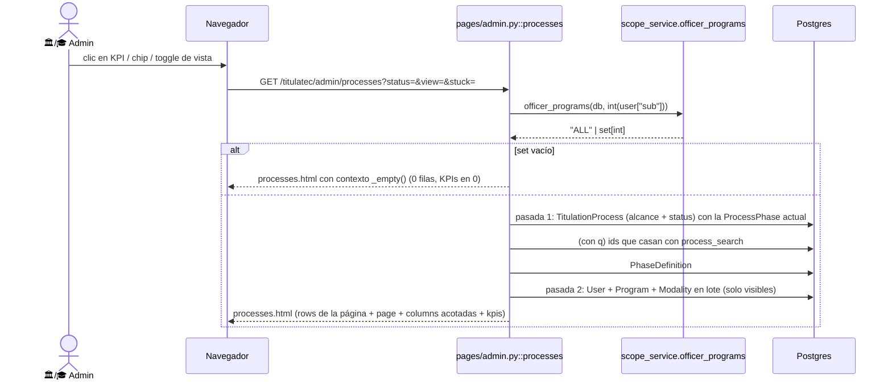

# La bandeja administrativa de procesos (transversal)

> **Objetivo:** que un usuario administrativo vea de un vistazo los procesos que le corresponden,
> en qué fase están, **cuántos días llevan sin moverse** y cuáles están atorados, con dos lentes
> sobre el mismo dataset: tabla densa y tablero kanban por fase.

| | |
|---|---|
| **Actor(es)** | 🏛️ Servicios Escolares (`titulatec_school_services`) · 🏛️ Jefe (`titulatec_school_services_head`) · 🎓 Titulaciones (`titulatec_titulaciones`) |
| **Permiso(s)** | **Home:** `titulatec.dashboard.titulaciones` · `titulatec.dashboard.school_services` · `titulatec.dashboard.admin` · `titulatec.process.page.list` (`pages/admin.py:288-293`).<br>**Procesos:** `_PROCESS_VIEW_PERMS` (`pages/admin.py:23-28`) = `process.page.list` · `process.page.detail` · `process.api.read.all` · los 3 `dashboard.*`. Basta **uno**: `require_page_app` intersecta (`itcj2/dependencies.py:131-135`). |
| **Trigger** | Clic en **Bandeja** o **Procesos** del menú admin (`pages/nav.py:96-97`), o entrada directa por URL. |
| **Precondiciones** | Asignación en la app `titulatec` + al menos uno de los permisos de arriba. Para ver filas: procesos dentro del [alcance por carrera](engine_officer_scope.md). |
| **Sub-flujos** | ⤵ [alcance por carrera](engine_officer_scope.md) (filtra el listado) · ⤵ el detalle abre [revisión de docs](phase1_admin_review_initial_docs.md) y el [motor de avance](engine_approve_advance_phase.md) |
| **Estado final** | — (vista de lectura; ningún endpoint de este flujo escribe en BD) |

## Ruta en la app (UI)

1. `/titulatec/admin/` → **Bandeja**: 4 tarjetas de conteo + aviso "En construcción"
   (`templates/titulatec/admin/dashboard.html`). Sin acciones.
2. `/titulatec/admin/processes` → **Procesos**: 5 KPIs clicables, 5 chips de filtro por status,
   toggle **Tabla / Tablero**, buscador **en servidor** (las dos vistas) y funnel de fases (solo
   tabla). La tabla pagina de 50 en 50; el tablero pinta como mucho 50 tarjetas por columna.
3. Tabla → última columna **Abrir** → `/titulatec/admin/processes/{id}`.
   Tablero → la card entera es el enlace al mismo detalle (`partials/processes_board.html:16`).
4. El menú lateral navega por HTMX (`hx-target="#tt-admin-content"`, `hx-swap="morph:outerHTML"`,
   `templates/titulatec/admin/base_admin.html`), y **desde 2026-09-02 los controles internos de
   esta página también**: los 12 anclas (5 KPIs, 5 chips de status, 2 de vista) conservan su
   `href` y añaden el mismo contrato de swap. Ver «Los filtros no recargan la página».

## Los filtros no recargan la página (2026-09-02)

Antes cada KPI, chip o botón de vista era un `<a href>` pelado: **recarga completa del documento**.
El resultado visible era el que reportó el usuario — *«si el contenido de la petición no cambia,
aun así recarga todo con las animaciones y se ve raro que se muevan cosas sin haber cambiado
nada»* — porque pulsar **Activos** con 34/34 procesos activos repintaba una pantalla idéntica.

Contrato de los 12 controles (`processes.html`), el mismo del menú lateral:

```html
href="{{ u_chip }}" hx-get="{{ u_chip }}"
hx-target="#tt-admin-content" hx-select="#tt-admin-content"
hx-swap="morph:outerHTML" hx-push-url="true"
```

- **`href` y `hx-get` salen de la MISMA variable Jinja** (`u_total`, `u_active`, `u_chip`, `u_table`…,
  `processes.html:12-18` y `:80`). No pueden divergir, y el enlace sigue siendo un enlace de verdad
  (rueda del ratón, «abrir en pestaña nueva», deep link, auditoría responsive por URL).
- **`hx-select` == `hx-target` obliga a `outerHTML`**: es el invariante de la app
  (`CLAUDE.md` §4), fijado por `tests/fastapi/titulatec/test_admin_nav_swap.py`.
- **`hx-ext="morph"` vive en `#ttAdmin`**, no en `#tt-admin-content`: si viviera en el destino se
  perdería al primer `morph:outerHTML` (la respuesta no trae el atributo) y htmx caería en silencio
  a `innerHTML`, anidando el contenedor dentro de sí mismo.
- **Ids estables** en filas (`proc-row-{id}`), tarjetas (`proc-card-{id}`), columnas
  (`proc-col-{n}`), paneles (`proc-table-pane` / `proc-board-pane`) y en cada control. Sin ellos
  Idiomorph empareja por posición y reescribe filas que no han cambiado.

Qué se anima ahora (ver [`docs/design/ui_motion.md`](../design/ui_motion.md)):

| Acción | Movimiento |
|---|---|
| Filtro cuyo resultado **no cambia** | ninguno. Verificado en Chromium: 34/34 filas son los **mismos nodos** DOM, cero `animationstart`, `getAnimations()` devuelve los **mismos 6 objetos** de siempre (todos `finished`) |
| Filtro que **sí** cambia | solo las filas/tarjetas nuevas reciben `.tt-enter` (fundido de opacidad .18 s). Las supervivientes no se mueven |
| Cambio de pestaña por el sidebar | `tt-anim-in` sobre `#tt-admin-content`, como siempre (`data-tt-view` pasa de `documents` a `processes`) |
| Pulsar la pestaña en la que ya estás | ninguno |

## Paginación, búsqueda y fase en servidor (2026-10-04)

Spec `2026-10-04-titulatec-paginacion-design.md` §7. La ruta (`pages/admin.py::processes`) es
ahora una envoltura de `_proc_ctx`, que arma la vista en **dos pasadas**:

1. **`_proc_universe(db, user_id, status, q, phase)`** — UNA consulta: procesos en alcance
   (`officer_programs`, antes de contar) y del `status` pedido, con el `started_at` de su fase
   ACTUAL por outer join a `ProcessPhase` (único por `uq_titulatec_phase_process_number`), en orden
   `created_at DESC, id DESC` (el desempate por `id` faltaba). Filas ligeras
   (`id, created_at, status, current_phase, student_id, program_id, started_at_fase, idle_days,
   idle_level` + `folio`, `modality_id`). Con `q`, una consulta más trae los ids que casan
   (`process_search`: control —también en MAYÚSCULA—, nombre en los dos órdenes, folio). Sobre
   eso, en Python y con la lógica de siempre: `idle_days`/`idle_level` y los KPIs.
2. **`_proc_present(db, ligeras, …)`** — alumnos, carreras y modalidades **en lote** solo para las
   filas visibles: la página de la tabla, o las ≤50 tarjetas de cada columna. Quita el N+1 de
   `db.get(User)`/`db.get(Program)` por fila.

Presupuesto medido (`test_sin_n_mas_1_usuario_y_carrera`): 8 sentencias con 3 y con 40 procesos,
en tabla y en tablero (app + alcance ×2 + universo + fases + alumnos + carreras + modalidades);
+1 con `q`.

| Qué | Regla |
|---|---|
| **KPIs** | Como antes: universo en alcance **y del `status` pedido** (los KPIs son también los filtros de estado). **Nunca** los mueven `q`, `phase`, `stuck` ni la página. |
| **`?stuck=1`** | Filtra el universo por `idle_level == "crit"` ANTES de paginar: «1–50 de N» cuenta solo atorados. |
| **`?phase=N`** (nuevo) | Filtra la TABLA por fase actual (vacío o basura = sin filtro). El tablero lo ignora (cada columna ya es una fase) y el funnel sigue mostrando todas las fases, con la elegida resaltada. |
| **`?q=`** | Búsqueda en servidor (`strip()`, 100 caracteres, `%`/`_` escapados). Sin resultados → «Sin resultados para "q"», sin pager. |
| **`?page=`** | 50 por página (`paginate_list`); fuera de rango → la última válida. |
| **Kanban** | Columnas sobre el universo filtrado (estado, `q`, `stuck`; sin `phase`). Cada columna lleva su `count` REAL y pinta las 50 más recientes; si hay más, pie **«Ver las N en tabla»** → `?view=table&phase=N` + filtros vigentes. |

Controles: `#proc-filters` guarda los filtros vigentes como hidden (`view`, `status`, `stuck`,
`phase`, `page=1`) junto al buscador `#proc-q` (`hx-get` + `hx-include="#proc-filters"`,
`keyup changed delay:400ms, search`). El pager (`prefix='tt-proc'`) incluye ese bloque y su
`hx-vals` de página pisa el `page=1`. Buscador, pager, franjas del funnel y «Ver las N en tabla»
usan el contrato de la vista (`hx-target`/`hx-select` `#tt-admin-content`, `morph:outerHTML`,
`hx-push-url`): el macro `pager` aceptó un `select` opcional para esto. KPIs, chips y botones de
vista conservan `q` y `phase` y vuelven a la página 1.

## Secuencia


```mermaid
sequenceDiagram
    actor U as 🏛️/🎓 Admin
    participant FE as Navegador
    participant P as pages/admin.py::processes
    participant SC as scope_service.officer_programs
    participant DB as Postgres
    U->>FE: clic en KPI / chip / toggle de vista
    FE->>P: GET /titulatec/admin/processes?status=&view=&stuck=
    P->>SC: officer_programs(db, int(user["sub"]))
    SC-->>P: "ALL" | set[int]
    alt set vacío
        P-->>FE: processes.html con contexto _empty() (0 filas, KPIs en 0)
    else
        P->>DB: pasada 1: TitulationProcess (alcance + status) con la ProcessPhase actual
        P->>DB: (con q) ids que casan con process_search
        P->>DB: PhaseDefinition
        P->>DB: pasada 2: User + Program + Modality en lote (solo visibles)
        P-->>FE: processes.html (rows de la página + page + columns acotadas + kpis)
    end
```

## Pasos detallados

| # | Actor | UI / dónde | Acción | Endpoint | Código | Efecto en BD |
|---|---|---|---|---|---|---|
| 1 | 🏛️/🎓 | menú admin | Abrir Bandeja | `GET /titulatec/admin/` | `pages/admin.py:285-316` | (lectura) 3 `COUNT` sobre `titulatec_processes` + 1 sobre `titulatec_cohorts` |
| 2 | 🏛️/🎓 | menú admin | Abrir Procesos | `GET /titulatec/admin/processes` | `pages/admin.py:614-734` | (lectura) |
| 3 | 🏛️/🎓 | KPI / chip | Filtrar por status | `…?status=active\|completed\|on_hold\|cancelled` | `pages/admin.py:658-659` | (lectura) |
| 4 | 🏛️/🎓 | KPI "Atorados" | Ver solo `idle_level=crit` | `…?stuck=1` | `pages/admin.py:713-714` | (lectura) |
| 5 | 🏛️/🎓 | botones Tabla/Tablero | Cambiar de vista | `…?view=table\|board` | `pages/admin.py:634` | (lectura) |
| 6 | 🏛️/🎓 | fila / card | Abrir detalle | `GET /titulatec/admin/processes/{id}` | `pages/admin.py:737-752` → `_detail_ctx` (`:555`) | (lectura) |

## Cómo se calcula `idle_days` (días sin moverse)

**El reloj es el de la FASE ACTUAL, no el del proceso.**

1. Se cargan de un solo golpe todas las filas `ProcessPhase` de los procesos listados y se indexan
   por `(process_id, phase_number) → started_at` (`pages/admin.py:679-685`).
2. Por proceso: `since = phase_started.get((p.id, p.current_phase)) or p.updated_at`
   (`pages/admin.py:694`) — cuándo arrancó la fase en la que el proceso está parado **ahora**.
   Ese `started_at` lo escribe el motor de avance al activar la siguiente fase
   (`services/phase_service.py:92-93`, con `db_now()`).
3. `idle_days = max(0, (now - since).days) if since else 0` (`pages/admin.py:695`), con
   `now = datetime.now()` (`pages/admin.py:688`, naive; el contenedor corre en
   `America/Ciudad_Juarez`, la misma zona de `db_now()` — `itcj2/core/utils/timezone.py:22-27`).

### Niveles y umbrales

```
idle_level = "crit" if idle_days >= crit_days else "warn" if idle_days >= warn_days else "ok"
```

`pages/admin.py:696-697`. Los umbrales salen de `Settings` (`itcj2/config.py:113-114`) y se leen
en `pages/admin.py:636-637`:

| Setting | Default | Significado |
|---|---|---|
| `TITULATEC_IDLE_WARN_DAYS` | `7` | a partir de aquí → `warn` (ámbar) |
| `TITULATEC_IDLE_CRIT_DAYS` | `14` | a partir de aquí → `crit` (rojo = **atorado**) |

Son campos de Pydantic Settings con `env_file=".env"`, así que se sobreescriben por variable de
entorno sin tocar código. Ambos viajan al template como `idle_warn` / `idle_crit`
(`pages/admin.py:733`).

`idle_level` es la **única** definición de "atorado" en la app: alimenta el KPI `n_stuck`
(`pages/admin.py:711`), el filtro `?stuck=1`, la clase `is-stuck` de la fila
(`processes.html:141`), la pill de días (`processes.html:159`) y la barra `health` de cada columna
del kanban (`partials/processes_board.html:8-12`).

## KPIs de `/admin/processes`

Se calculan **sobre el universo ya filtrado por scope y por `status`, pero ANTES del filtro
`stuck`** (comentario y código en `pages/admin.py:662-670`). Por eso con `?stuck=1` las tarjetas
siguen mostrando el total del filtro y solo cambia la lista de abajo.

| Clave | Cómo sale | Dónde |
|---|---|---|
| `total` | `len(procs)` | `pages/admin.py:663` |
| `active` / `completed` / `on_hold` / `cancelled` | contador por `p.status` (`if p.status in kpis`) | `pages/admin.py:665-667` |
| `pct_completed` | `round(completed / total * 100)`, 0 si `total == 0` | `pages/admin.py:668-670` |
| `n_stuck` | `sum(1 for r in rows if r["idle_level"] == "crit")` | `pages/admin.py:711` |

`progress_pct` por fila es aparte: `round(current_phase / max_phase * 100)` acotado a 0–100
(`pages/admin.py:698`), donde `max_phase` es el `number` más alto de las `PhaseDefinition` activas
(`pages/admin.py:677`; hoy `8` — las 9 fases van numeradas 0–8). Un proceso en fase 0 muestra 0 %
y uno en fase 8 muestra 100 % **aunque la fase 8 no esté aprobada todavía**.

## El filtro `?stuck=1`

- Parámetro `stuck: int = 0` (`pages/admin.py:619`). Cualquier entero truthy activa el filtro
  (`if stuck:`, `pages/admin.py:713`); `0` o ausente lo desactiva.
- Recorta `rows` a `idle_level == "crit"` **después** de calcular los KPIs y **antes** de armar
  las columnas del kanban (`pages/admin.py:713-729`), así que en modo tablero y en el funnel
  también se ven solo los atorados.
- Se pinta como el 5.º KPI (`processes.html:31-36`), que conserva `status` y `view` en el href.

## Las dos vistas

`view` se normaliza a un enum de dos valores en `pages/admin.py:634`:
`view = "table" if view != "board" else "board"` — cualquier otro valor cae a `table`.

### Tabla (`view=table`, default)

- Bloque `` de `processes.html:124-245`: 9 columnas (Folio, Alumno + control, Carrera,
  Modalidad, Progreso, Fase actual, Días en fase, Estado, acción **Abrir**).
- Buscador **en servidor** (`#proc-q`, ver «Paginación…» arriba). Desde 2026-10-04 ya no hay
  filtro de cliente ni `data-search`: con la tabla paginada solo habría filtrado la página. Queda
  el ordenamiento cliente por `progress` / `phase` / `idle` (`th.sortable`), que reordena **la
  página visible**. El JS vive en **`static/js/admin/processes.js`**, cargado una sola vez por
  `base_admin.html`.
- **Funnel de fases** (solo en esta vista): una franja por columna con `flex-grow` = número de
  procesos y un `hue` interpolado; cada franja con procesos es un enlace a `?phase=N` (filtro
  **en servidor**, página 1); la seleccionada lleva `is-sel` y las demás `is-dim`, y pulsarla de
  nuevo quita el filtro.
- Ese módulo es morph-safe: **todos** sus listeners están delegados en `document` (nunca
  `data-tt-bound`, que Idiomorph borraría al sincronizar atributos, duplicando listeners) y el
  estado del orden vive en el módulo, no en el DOM, así que **sobrevive** a un cambio de filtro o
  de página del servidor.
  Hasta 2026-09-02 este archivo existía pero **ningún template lo cargaba**, y su lógica estaba
  duplicada inline dentro del fragmento que el morph reemplaza.
- El `value` del buscador ahora lo trae el servidor (`value="{{ q }}"`, el `q` recortado), así
  que el módulo ya no lo repone.

### Tablero (`view=board`)

- `templates/titulatec/admin/partials/processes_board.html`, incluido en `processes.html:83-86`:
  **una columna por `PhaseDefinition` activa** (hoy 9: `cohort_intake` … `ceremony`), ordenadas
  por `order_index`.
- Las columnas (`phase`, `label`, `count`, `n_stuck`, `rows`, `more`, `table_url`) agrupan el
  universo filtrado por fase actual (`_proc_ctx`). `count` es el total real; `rows` son las ≤50
  más recientes; la barra `health` es el % de atorados de esa columna.
- Un `current_phase` sin `PhaseDefinition` activa **no tiene columna**: el loop de salida itera
  las definiciones activas, no los grupos. Esos procesos desaparecen del kanban aunque sí salgan
  en la tabla.
- Las cards son **solo lectura**: un `<a href>` al detalle (`partials/processes_board.html:16`).
  **No hay drag & drop** ni endpoint que cambie de fase desde el tablero; eso solo ocurre en el
  detalle vía [motor de avance](engine_approve_advance_phase.md).
- El alto del tablero al viewport y las sombras de "hay más" los fija el mismo módulo
  (`static/js/admin/processes.js`), en `htmx:afterSettle` y en `resize`.

### Conservación de parámetros al alternar

No hay estado de sesión: **cada control reconstruye el querystring a mano** en el template.

| Control | Href | Qué conserva |
|---|---|---|
| Botones Tabla / Tablero (`u_table` / `u_board`) | `?view=table\|board` + `&status=` + `&stuck=1` + `&phase=` + `&q=` | `status`, `stuck`, `phase`, `q` |
| Chips de status (`u_chip`) | `?view=` + `&status=` + `&stuck=1` + `&phase=` + `&q=` | `view`, `stuck`, `phase`, `q` |
| KPIs Total / Activos / Completados / En espera (`u_total`, `u_active`, `u_completed`, `u_hold`) | `?view=` (+ `&status=`) + `&phase=` + `&q=` | `view`, `phase`, `q`; **pierden `stuck`** |
| KPI Atorados (`u_stuck`) | `?view=` + `&status=` + `&stuck=1` + `&phase=` + `&q=` | todo |
| Buscador / pager | `#proc-filters` (hidden) + `q` (+ `page` del pager) | todo |

Ningún control lleva `page`: cambiar un filtro vuelve a la página 1. El botón **Abrir** lleva en
`?from=` la URL completa (filtros + página), así Regresar vuelve a la misma página. Lo único que
sigue siendo estado de cliente es el orden de la tabla (`processes.js`).

## Dónde se aplica el scope por carrera (y dónde no)

`officer_programs(db, user_id)` (`services/scope_service.py:96`) devuelve `"ALL"` si el usuario
tiene `titulatec.process.api.read.all`, si no un `set[int]` de `program_id`. El detalle usa el mismo
predicado por proceso (`assert_process_in_scope`, `:139`), que devuelve **404** fuera del alcance.

| Ruta | ¿Scope? | Evidencia |
|---|---|---|
| `GET /admin/processes` | ✅ sí, sobre `TitulationProcess.program_id` | `pages/admin.py:652-657` |
| `GET /admin/processes/{id}` (detalle) | ✅ sí, guard → 404 | `pages/admin.py:744-751` (`assert_process_in_scope`) |
| `GET /admin/` (home) | ❌ **no** | `pages/admin.py:302-309`, `COUNT` sin filtro |
| `GET /admin/documents` | ✅ sí | `pages/documents.py:50-58` |

Con `scope` vacío (encargado sin `ProgramPosition`) el endpoint corta temprano y renderiza el
contexto `_empty()` — 0 filas, 0 columnas, KPIs en cero, umbrales igual
(`pages/admin.py:639-656`). Hoy en dev `titulatec.process.api.read.all` lo tienen
`titulatec_school_services_head` y `titulatec_titulaciones`; `titulatec_school_services` es scoped.

## Estado resultante

- Ninguno. Los tres endpoints son `GET` de lectura: abren su propia `SessionLocal()` y la cierran
  en `finally` sin `commit` (`pages/admin.py:302-310`, `:651-728`, `:744-750`).

## Caminos alternos / errores ❗

- Sin permiso → `PageForbidden(has_app_access=True)` (`itcj2/dependencies.py:131-135`); sin sesión
  → `PageLoginRequired` (`itcj2/dependencies.py:120-121`).
- `status` con valor arbitrario (`?status=foo`) **no** es error: se pasa tal cual a
  `filter_by(status=status)` (`pages/admin.py:659`) y la lista sale vacía con KPIs en cero.
- `view` desconocido → cae silenciosamente a `table` (`pages/admin.py:634`).
- Detalle inexistente → `Response(status_code=404)` sin cuerpo (`pages/admin.py:747-748`).
- Encargado sin carreras asignadas → pantalla vacía, no error (ver [alcance](engine_officer_scope.md)).

## Limitaciones conocidas ⚠

1. **Los KPIs de la home no tienen scope.** `pages/admin.py:302-309` cuenta `TitulationProcess` de
   todo el instituto sin pasar por `officer_programs`: un encargado con 1 carrera ve en `/admin/`
   los números de las 9 carreras y en `/admin/processes` solo los suyos. Los dos tableros **no
   cuadran** entre sí.
2. **"Procesos activos" y "Pendientes de revisar" son la misma query.** `pages/admin.py:305-306`
   ejecuta dos veces `filter_by(status="active").count()`; las dos tarjetas
   (`dashboard.html:16-17`) siempre muestran el mismo número.
3. **`cancelled` siempre es 0; `on_hold` ya no.** El comentario del modelo dice
   `active|completed|cancelled|on_hold` (`models/process.py:23`). Se escribe `"active"` al crear
   el proceso (`services/import_service.py:305`), `"completed"` al aprobar la última fase
   (`services/phase_service.py:87`) y —desde 2026-09-07— `"on_hold"` ↔ `"active"` en
   `CohortService.set_window` (`services/cohort_service.py`), que pausa los procesos `active` de
   una convocatoria al cerrarla y reanuda los `on_hold` de convocatorias cerradas al abrir otra
   (regla D5). Cada flip deja un `ProcessEvent` `process_paused` / `process_resumed`. El KPI
   "En espera" (`processes.html:26-30`) y el chip `on_hold` (`processes.html:40`) ya cuentan algo;
   el chip `cancelled` sigue siendo un cascarón vacío.
4. **El detalle no valida el alcance.** Un encargado scoped que no ve un proceso en la lista sí
   puede abrirlo —y actuar sobre él— escribiendo `/titulatec/admin/processes/{id}`: el gate es
   solo `_PROCESS_VIEW_PERMS`.
5. **`updated_at` no se actualiza nunca.** `TitulationProcess.updated_at` (`models/process.py:29`)
   y `ProcessPhase.updated_at` (`models/process_phase.py:25`) tienen `server_default=NOW()` pero
   **sin** `onupdate`, y no existen triggers en las tablas `titulatec_*`. Como es el fallback de
   `since` (`pages/admin.py:694`), cuando la fase no tiene `started_at` el `idle_days` se mide
   desde la **creación** de la fila.
6. **Los procesos recién importados no tienen `started_at`.** `services/import_service.py:310-312`
   crea las 9 filas `ProcessPhase` sin `started_at`; solo `services/phase_service.py:93` lo llena
   al activar una fase. Durante toda la fase 1 recién importada el `idle_days` cae al fallback del
   punto 5.
7. ~~**Faltan estilos de la bandeja.**~~ **Saldado.** `.tt-kpis`, `.tt-kpi`, `.tt-search`,
   `.tt-funnel`, `.tt-progress`, `.tt-pill--idle-ok/warn/crit`, `th.sortable`, `.col-scroll`,
   `.health` y `tr.is-stuck` existen hoy en `static/css/titulatec.css` (verificado 2026-09-02).
8. ~~**N+1 al armar las filas y sin paginación.**~~ **Saldado 2026-10-04**: dos pasadas
   (`_proc_universe` / `_proc_present`), alumnos/carreras/modalidades en lote, tabla de 50 en 50
   y kanban con tope de 50 por columna.
9. ~~**`qbase` es código muerto.**~~ **Saldado.** La variable desapareció; ahora cada control sale
   de una variable Jinja propia (`u_total`…`u_board`) que alimenta a la vez `href` y `hx-get`.
   El `stuck` que pierden los 4 primeros KPIs **se conserva tal cual**: es la semántica de
   siempre, no un descuido de la migración a HTMX.

## Buscador y medición (2026-10-04)

`#proc-q` lleva `hx-preserve="true"` (`templates/titulatec/admin/processes.html:114`) y `#proc-filters` anuncia `data-tt-q-server`; `static/js/shared/titulatec-utils.js:414` repone el texto cuando la navegación cambia `q` sin pasar por el input (fix `545aab64`). Un tablero con búsqueda sin resultados dice «Sin resultados para "q"» en vez de nueve columnas de «—». Los KPIs conservan el filtro de estado y nunca se mueven con `q`/`phase`/`stuck`/página (`pages/admin.py:1754`). Medido en dev (EXPLAIN ANALYZE, 2026-10-04): pasada 1 de Procesos 0.027 ms (con `q` ≤0.03 ms); base de dev chica, Seq Scan.

## Flujos relacionados

- ⤵ [Alcance por carrera + encargados](engine_officer_scope.md) — quién ve qué en esta bandeja.
- ⤵ [Revisión de documentos iniciales (admin)](phase1_admin_review_initial_docs.md) — lo que se hace al abrir el detalle.
- ⤵ [Motor de aprobación y avance de fase](engine_approve_advance_phase.md) — quien escribe el `started_at` del que sale `idle_days`.
- ← [Máquina de estados](00_state_machine.md) · [Glosario](_glossary.md)
