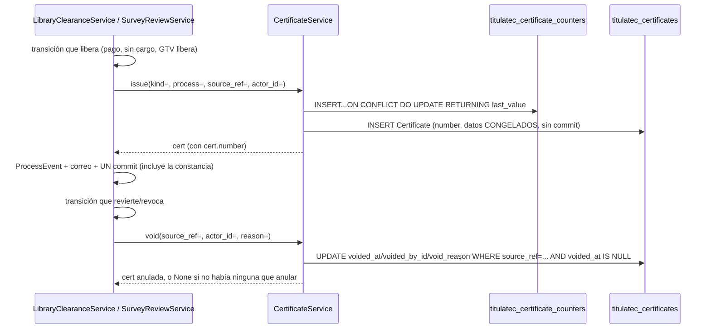

# Constancias por lote: numeración, emisión y PDF (transversal)

> **Objetivo:** GTV y el Centro de Información dejan de entregarle papel al egresado uno por
> uno. El sistema emite una constancia con **número propio** en cuanto se libera la encuesta o
> el no adeudo, las acumula, y el área genera —una vez al día, cuando quiere— el PDF de las
> pendientes (2 o 3 por hoja carta, a elegir cada vez que se abre) para recortar y llevar a
> Servicios Escolares antes del cotejo. La tabla también dice si cada constancia YA se imprimió
> (entró a un lote) y, si se anuló DESPUÉS de imprimirse, avisa que hay que retirar ese papel.

| | |
|---|---|
| **Actor(es)** | 🤖 Sistema (emite/anula dentro de la transacción del dueño) · 📚 Centro de Información (imprime `library_clearance`) · 🛠️ GTV (imprime `survey_release`) |
| **Permiso(s)** | `titulatec.certificate.page.list` (ENTRAR a la página — único gate de las 4 rutas) · `titulatec.library_clearance.api.print_certificates` (imprimir no adeudo) · `titulatec.survey_review.api.print_certificates` (imprimir encuesta) — las dos últimas deciden qué SECCIONES ve cada quien, no si entra a la página |
| **Trigger** | `SurveyReviewService.approve` (encuesta, salvo `origin='prior'`) y `LibraryClearanceService` al quedar `cleared` por `payment`/`no_charge` (no adeudo) emiten SOLAS, sin acción del área. El área solo dispara **«Generar lote»** cuando quiere imprimir |
| **Precondiciones** | Ninguna para emitir (es automático dentro de la transacción del dueño); para generar lote, al menos una constancia `kind` pendiente (sin lote, sin anular) |
| **Sub-flujos** | ⤵ compone [no adeudo de biblioteca](phase2_library_clearance.md) (emisor `library_clearance`) y [liberación GTV de la encuesta](phase2_tech_management_survey_release.md) (emisor `survey_release`) |
| **Estado final** | `Certificate` vigente con folio único `{PREFIJO}-{AAAA}-{NNNN}`, datos congelados; `CertificateBatch` con las constancias impresas juntas |

Spec `docs/superpowers/specs/2026-10-01-titulatec-biblioteca-caja-design.md` §4.1.3-5, §4.5,
D7/D8/D15/D21/D22, §5 invariante 5; ampliado por
`docs/superpowers/specs/2026-10-02-titulatec-constancias-y-pendientes-design.md` §2 (E4/E8, 2 o 3
por hoja), §3.1-§3.2/§3.5 (E1/E5-E7, estado de impresión y listas de la página) y §3.4 (vistas de
SE; Rulings R13/R14 de la revisión final). Motor
compartido: `services/certificate_service.py::CertificateService`, **único** escritor de
`titulatec_certificates` / `titulatec_certificate_batches` / `titulatec_certificate_counters`
(igual que `SurveyReviewService` lo es de `titulatec_survey_reviews`). Página:
`pages/certificates_admin.py`, `/titulatec/admin/constancias`.

## Las dos constancias (`CERT_KINDS`)

Una sola tabla (`Certificate.kind`), textos VERBATIM del spec §4.5 — lo que se imprime y se
entrega a Servicios Escolares, no se parafrasea:

| `kind` | Prefijo | Título impreso | Departamento | Frase | Quién la emite |
|---|---|---|---|---|---|
| `library_clearance` | `BIB` | «CONSTANCIA DE NO ADEUDO» | Centro de Información | «no tiene adeudo con el Centro de Información (biblioteca) del Instituto Tecnológico de Ciudad Juárez» | `LibraryClearanceService` al quedar `cleared/payment` o `cleared/no_charge` |
| `survey_release` | `GTV` | «CONSTANCIA DE LIBERACIÓN DE ENCUESTA DE EGRESADOS» | Gestión Tecnológica y Vinculación | «contestó la encuesta de egresados y le fue liberada» | `SurveyReviewService.approve` (salvo `origin='prior'`) |

D15: las de no adeudo las imprime el Centro de Información; las de encuesta, GTV — ambas
conviven en la MISMA página de Constancias (`_printable_kinds` decide qué secciones ve cada
quien por sus permisos efectivos).

## Numeración atómica

`CertificateService._next_number(db, kind, year)`: una sola sentencia, segura bajo PgBouncer —

```sql
INSERT INTO titulatec_certificate_counters (kind, year, last_value)
VALUES (:kind, :year, 1)
ON CONFLICT (kind, year) DO UPDATE SET last_value = last_value + 1
RETURNING last_value
```

— `kind`+`year` es la PK de `CertificateCounter`. Nace en 1 la primera vez que se emite ese
`(kind, year)` (cambio de año → nuevo contador, arranca en 1 otra vez); **anular una constancia
NUNCA libera su número**, y «re-liberar» (Review Focus #6) emite una constancia **NUEVA** con
folio NUEVO — nunca reabre la anulada. Dos emisiones simultáneas de la MISMA `(kind, year)`
reciben folios consecutivos sin colisión (probado con dos conexiones reales,
`test_certificate_service.py`, Ruling R6: la concurrencia de NUMERACIÓN tiene prueba dedicada
con dos hilos/conexiones; la de `create_batch` con `SKIP LOCKED` no la exige el plan — el
mecanismo es del motor).

## Emitir y anular



- **`issue(db, *, kind, process, source_ref, actor_id)`**: folio + datos CONGELADOS del proceso
  EN ESE MOMENTO (D7/D21/D22: número de control, nombre, carrera, semestre — un cambio posterior
  del alumno o la convocatoria no mueve lo ya impreso). No consulta antes si `source_ref` ya
  tiene una vigente: «a lo más UNA vigente por `source_ref`» (§5 invariante 5) la cuida primero
  el LLAMADOR, que conoce su propia máquina de estados (`SurveyReviewService.approve` solo emite
  desde `in_review`/`rejected`, nunca dos veces sobre una ya `approved`; `LibraryClearanceService`
  solo al ENTRAR a `cleared/payment|no_charge`), y la RESPALDA la base: el UNIQUE parcial
  `uq_titulatec_certificates_live_source` sobre `(source_ref) WHERE voided_at IS NULL` (Ruling
  R29, en el modelo y en `tt20261001a`). Un llamador que se equivocara truena con
  `IntegrityError` en el `flush()`; una anulada y su reemplazo sí conviven (la anulada sale del
  índice).
  **Sin commit** — transacción del llamador. `source_ref` = `"survey_review:{id}"` |
  `"library_clearance:{id}"` (sin FK real: puede apuntar a cualquiera de los dos dueños según
  `kind`).
- **`void(db, *, source_ref, actor_id, reason)`**: anula la VIGENTE de ese `source_ref` (`FOR
  UPDATE`, `voided_at IS NULL`). `None` si no hay ninguna que anular — **no es un error**: un
  `SurveyReview` con `origin='prior'` nunca emitió (lo salta `issue` desde `approve`), así que
  revocarlo no tiene nada que anular, camino normal. Nunca borra ni libera el folio.
- `period_label(period)` → «Agosto-Diciembre 2026» por el sufijo del código `AAAAS` (1
  Enero-Junio, 2 Verano, 3 Agosto-Diciembre); respaldo `period.name` si el código no calza ese
  formato. `issue()` SIEMPRE recorta a `_PERIOD_LABEL_MAX = 40` (tope de columna,
  `Certificate.period_label` `String(40)`), aunque el respaldo por sí solo diera algo más largo.

## Lotes y PDF

- **`pending(db, kind)`**: constancias `kind` sueltas (`batch_id IS NULL`), vigentes
  (`voided_at IS NULL`) y de un proceso NO revocado (Ruling R26: `ProcessService.cancel` no
  anula constancias, y SE no debe recibir papeles de una inscripción dada de baja; la constancia
  no se toca, solo no se imprime), FIFO por `issued_at`. `pending_count(db, kind)` sigue
  disponible para quien solo necesite el número; la página de Constancias ya NO lo llama para su
  badge (ver «Página de Constancias» abajo). Los tres (`pending`, `pending_count`, `create_batch`)
  comparten UNA definición, `_pending_criteria(kind)` (el revocado con `NOT EXISTS`, no JOIN: el
  `FOR UPDATE SKIP LOCKED` del lote bloquea solo constancias).
- **`create_batch(db, *, kind, actor_id)`**: toma TODAS las pendientes con `FOR UPDATE SKIP
  LOCKED` (si otra transacción las está imprimiendo ahora mismo, esta llamada simplemente no las
  ve, en vez de bloquearse), crea el `CertificateBatch`, les pone `batch_id` a todas — esto es lo
  ÚNICO que marca una constancia como «impresa» (ver «Estado de impresión» abajo). **Commit
  propio**: imprimir es su propia operación, sin nada más pendiente en la transacción. 0
  pendientes → `ValueError` legible, nada se crea.
- **El PDF NUNCA se guarda**: `utils/certificate_pdf.py::render_certificates_pdf(certs,
  per_page=2|3) -> bytes` lo REGENERA siempre a partir de los datos ya CONGELADOS de cada fila —
  mismo resultado cada vez, nada que mantener sincronizado. `GET
  /lotes/{batch_id}.pdf?por_hoja=` (`2` o `3`) lo sirve `inline`, con el nombre de archivo
  `constancias_{kind}_{batch_id}_{n}xhoja.pdf` — se abre en pestaña nueva desde uno de los DOS
  `<a target="_blank">` planos del parcial («PDF · 3 por hoja» / «PDF · 2 por hoja», el de 3
  primero por ser el de siempre), nunca `<script>` (spec 2026-10-02 §3.1/E4). Esa ruta sigue
  siendo **`def`, no `async def`** (Ruling R23): WeasyPrint es CPU bloqueante —30 constancias
  1.7 s, 300 constancias 14.6 s, medido en el contenedor— y en el event loop congelaba un worker
  HTTP de toda la plataforma en cada PDF; como `def`, FastAPI la corre en su threadpool.
- **`certificates_of(db, batch_id)`**: todas las de un lote, anuladas incluidas — una anulada
  sale marcada «ANULADA» en el PDF **en los dos acomodos**, nunca desaparece del lote que ya se
  imprimió; la fila del lote conserva su `count` tal cual se generó, aunque una de sus constancias
  se anule después (Review Focus #2).
- **`list_batches(db, *, kind, page, per_page)`**: lotes más recientes primero, con
  `voided_count` por lote en UNA consulta agrupada (nunca una por fila).

## Estado de impresión («¿ya se imprimió?», E1/E5-E7)

Pedido del usuario (2026-10-02): que las tablas digan si cada constancia ya se entregó impresa.
**Una sola fuente de verdad** (invariante 1 de la spec de ese día): `titulatec_certificates.
batch_id` (`NULL` = sin imprimir) — no se agregó columna a `titulatec_survey_reviews` ni a
`titulatec_library_clearances`: una copia ahí tendría otro escritor y podría desincronizarse.
«Impresa» significa **entró a un lote** (E1): si la impresora falla, se reabre el PDF del lote y
se reimprime; no hay un paso aparte de «confirmar impresión».

- **`CertificateService.print_status_map(db, source_refs: list[str]) -> dict[str, dict | None]`**
  (solo lee `titulatec_certificates`/`_certificate_batches`, invariante 4): a lo más **2
  consultas por llamada**, sin importar cuántos `source_refs` traiga (1 si todos tienen vigente,
  2 si alguno no la tiene; `{}` sin tocar la base con una lista vacía). Por cada `source_ref`:
  - con constancia **vigente**: `number`, `issued_at`, `batch_id`, `batch_at` (fecha del lote,
    `None` si sigue suelta), `printed = batch_id is not None`, `voided_printed = None` SIEMPRE
    —aunque una anulada anterior del mismo origen sí se haya impreso, esa sale en
    `voided_after_print`, nunca aquí—;
  - sin vigente pero con una anulada que alcanzó a entrar a un lote: `voided_printed` con sus
    datos (`number`, `batch_id`, `batch_at`, `voided_at`, `void_reason`);
  - `None` (no un dict) si nunca tuvo constancia, o las que tuvo se anularon sin imprimirse.

  **Re-emisión tras anular (Review Focus #1):** pagado → impreso → revertido → pagado de nuevo
  emite una constancia NUEVA (folio nuevo, numeración atómica de siempre); como la vigente SIEMPRE
  manda, la celda muestra la NUEVA («Sin imprimir»), nunca la vieja impresa — la vieja aparece en
  «Anuladas después de imprimir».
- **`CertificateService.voided_after_print(db, kind, *, days=30) -> list[dict]`**: anuladas de
  `kind` con `batch_id IS NOT NULL` y `voided_at` en los últimos `days` días (`db_now()`, límite
  CERRADO: exactamente `days` días vale, un segundo más vieja ya no), de la más reciente a la más
  vieja. Incluye las de un proceso YA revocado después (a diferencia de `pending`): el papel sigue
  circulando y hay que recuperarlo igual.
- **`certificate_cell(info, *, prior=False, legacy=False, revoked=False)`** (macro en
  `templates/titulatec/_macros.html`): pinta la celda a partir del dict de arriba (o `None`):
  - con vigente: folio + píldora «Impresa» (`lote #N · dd/mm/aaaa`), o —sin lote— «Sin imprimir»
    (ámbar); con `revoked` (inscripción revocada, Ruling R13) esa vigente sin lote pinta la
    píldora neutra **«No se imprimirá»** y, fuera de ella, la nota tenue **«inscripción
    revocada»**, que sí se parte (Ruling R18: la píldora es `nowrap` y con el motivo adentro
    desbordaba en celular). Es porque `_pending_criteria` ya no la lleva a ningún lote (R26) —
    así no contradice a «Por imprimir». «Impresa» y «Anulada tras imprimir» no cambian con
    `revoked`: ese papel existe;
  - sin vigente: «Constancia previa (papel del egresado)» si `prior`; «—» si `legacy` o si nunca
    tuvo constancia;
  - ADEMÁS, si no hay vigente y hay una anulada-con-lote: «Anulada tras imprimir · folio · lote #N —
    retira ese papel». Debajo del texto de `prior`/`legacy` cuando lo hay; si no, ABRE la celda,
    sin un «—» encima (M1 de la revisión final: la fila sí tuvo constancia).

  Nunca truena con `info=None`. La usan, cada una con UNA sola llamada a `print_status_map` por
  página/vista (invariante 2):
  - las bandejas de ⤵ [Biblioteca](phase2_library_clearance.md) y ⤵
    [GTV](phase2_tech_management_survey_release.md) (columna «Constancia», en sus 3 pestañas; la
    llamada la hacen `_rows`/`list_for_inbox` para la página entera; pasan `revoked=r.revoked`);
  - el panel de atender cotejo y el expediente de SE (`_appt_attend.html`/`_exp_phase.html`,
    filas de encuesta y de no adeudo). Desde el Ruling R14, cada vista (`pages/appointments.py`/
    `pages/admin.py::_detail_ctx`) hace UNA llamada `print_status_map(db, [ref_encuesta,
    ref_biblioteca])` con los refs que existan (`SurveyReviewService.certificate_ref`/
    `LibraryClearanceService.certificate_ref`; sin solicitud o sin fila no se pide) y cuelga
    `certificate` en cada resumen (`None` si no aplica): a lo más 2 consultas de constancias por
    vista. Los dos `summary_for_process` no consultan constancias —ni la marca (R14) ni, el de
    biblioteca, su viejo `certificate_number`, que no tenía lector desde la Task 4 (Ruling R17)—:
    también los usan el tablero del egresado, «Mi cita» y las páginas públicas de la encuesta, que
    no la pintan. Las dos vistas pasan `revoked=` con el estado del proceso.
    Con el proceso `cancelled` el renglón del no adeudo muestra «Revocada» en vez de la píldora
    de liberación (m42; desde R15 también en lugar de «Por pagar en Caja», sin el sufijo del
    monto), y la celda de constancia se conserva.
  - La página de Constancias NO la usa: muestra lo mismo con sus propias tablas, directo de
    `pending`/`voided_after_print` (ver «Página de Constancias» abajo), sin `print_status_map`.
  - Caja tampoco pinta la celda (`cashier_body.html`): sigue con el folio suelto de siempre
    (`r.certificate_number`) bajo su propia píldora (`caja_pill`, ⤵ [no adeudo de
    biblioteca](phase2_library_clearance.md)). Sus DATOS sí pasan por `print_status_map`: la tabla
    de búsqueda/«Por cobrar» sale de `_rows` (el mismo de Biblioteca, que calcula `certificate` y
    de ahí `certificate_number`) y el «Corte del día» (`day_cut`) lo usa para saber qué cobro
    sigue siendo el de la constancia vigente («Revertir…»).

### El PDF (WeasyPrint)

Plantilla en DOS piezas (E8, pensando en los formatos oficiales que cada área trae después):
`templates/titulatec/certificates/sheet.html` —la HOJA— NO extiende `base.html` ni ningún layout
HTTP: es un documento completo con su propio `@page { size: letter }` y una clase de acomodo por
hoja (`sheet--2`/`sheet--3`), pensado solo para WeasyPrint; y `templates/titulatec/certificates/
_slot.html` —la RANURA de una constancia—, que `sheet.html` incluye por `kind` a través del mapa
`SLOT_TEMPLATES` (`utils/certificate_pdf.py`: hoy los dos `CERT_KINDS` comparten la misma ranura;
el día que lleguen los formatos oficiales, cada entrada apunta a la suya sin tocar `sheet.html` ni
`render_certificates_pdf`). `render_certificates_pdf` agrupa `certs` de `per_page` en `per_page`
(`ALLOWED_PER_PAGE = (2, 3)`, `DEFAULT_PER_PAGE = 3`; cualquier otro valor es un `ValueError` de
PROGRAMADOR —la ruta ya normalizó con `_parse_por_hoja` antes de llamarla—). La ranura mide 3.2in
de alto con 3 por hoja y 4.9in con 2 (tipografía algo mayor en 2); la línea punteada de corte con
✂ va entre ranuras de la MISMA hoja, nunca después de la última.

Cada ranura: logos TecNM + escudo ITCJ (`itcj2/core/static/images/`, resueltos por WeasyPrint
contra `base_url` = `CORE_STATIC_DIR`, calculado desde el paquete — nunca el cwd del proceso),
campos (No. de control, Nombre, Carrera, Semestre), folio y fecha de emisión en español
(`utils/dates_es.py::dia_mes`). El pie («Fecha de emisión» / línea «Nombre, firma y sello») va
anclado al FONDO de la ranura con `position: absolute` (no `margin-top: auto`: WeasyPrint 70 solo
soporta flexbox PARCIALMENTE y ese truco no lo empujaba al fondo) — deja espacio arriba de la
línea para firmar y sellar, en los dos acomodos. Una constancia anulada lleva el sello «ANULADA»
superpuesto, en los dos acomodos. Fuentes: Arial/Liberation/DejaVu (ya en la imagen Debian 13 con
LibreOffice; **Pango** —que WeasyPrint sí exige y la imagen NO traía— se agregó en `02e32128`;
**`libharfbuzz-subset0`** —evita el `DeprecationWarning` «HarfBuzz-Subset will be required», no un
error duro— se agregó el 2026-10-02; ver «Despliegue» abajo). Una lista vacía SÍ produce un PDF
(de una página en blanco: WeasyPrint siempre renderiza el `@page`) — decidir si eso es un error de
negocio es tarea del llamador (`create_batch` ya impide un lote de 0 constancias).

## Página de Constancias (`pages/certificates_admin.py`)

- `_LIST = ["titulatec.certificate.page.list"]` en las CUATRO rutas — es el permiso de ENTRAR.
  Qué tipos puede de verdad IMPRIMIR cada actor es una pregunta aparte, resuelta por el ÚNICO
  helper `_printable_kinds(db, user_id)` (lee permisos efectivos de la app contra
  `_KIND_PERM`). El reparto del DML siempre concede ambos códigos juntos a quien corresponde,
  pero el helper no lo asume: una cuenta con `certificate.page.list` y SIN ningún permiso de
  imprimir entra a la página y ve 0 secciones.
- Un `kind` fuera de lo que `_printable_kinds` permite responde SIEMPRE **404** (nunca 403: la
  página ya se aprobó con `page.list`, así que un 403 no distinguiría nada que el actor no
  supiera ya) — mismo criterio que un recurso fuera de alcance en el resto de la app.
- Por cada `kind` imprimible, antes de los lotes (E6/E7): **«Por imprimir (N)»**, con un
  `<details>` CERRADO por omisión (sin JS) que lista, en FIFO, a QUIÉNES corresponde
  (folio/egresado/control/carrera/emitida, de `CertificateService.pending`) — no se pinta con 0
  pendientes; y, si aplica, **«Anuladas después de imprimir (últimos 30 días)»**
  (folio/egresado/control/lote/anulada el/motivo, de `voided_after_print`) — no se pinta si no hay
  ninguna. `N` (el badge Y el de «Generar lote (N)») sale de `len(pending_rows)`, la MISMA lista
  que ya trajo el `<details>` — no de una segunda consulta a `pending_count`.
- **«Generar lote (N)»** (confirmación) → el parcial re-pintado trae «Lote recién generado» con
  los DOS enlaces al PDF («PDF · 3 por hoja» / «PDF · 2 por hoja», `?por_hoja=2` o `3`); «Lotes» lista
  fecha, quién, cuántas (y cuántas anuladas) y los MISMOS dos enlaces. Paginación independiente
  por `kind` (`page_library_clearance`/`page_survey_release`, siempre los dos en la URL aunque el
  actor solo vea uno).
- Rutas por `kind`/`batch_id`, **nunca** `process_id` (sin alcance por carrera, §4.6, §5
  invariante 6, censo de `test_scope_guard.py`).

## Pasos detallados

| # | Actor | UI / dónde | Acción | Endpoint | Service · método | Efecto en BD | Eventos |
|---|---|---|---|---|---|---|---|
| 1 | 🤖 | — | GTV libera la encuesta | `SurveyReviewService.approve` | `CertificateService.issue(kind="survey_release", ...)` | `titulatec_certificates` INSERT (salvo `origin='prior'`) | — (dentro del evento de `approve`) |
| 1b| 🤖 | — | GTV revoca | `SurveyReviewService.revoke` | `CertificateService.void(source_ref="survey_review:{id}")` | `voided_at`/`voided_by_id`/`void_reason` (o `None` si nunca emitió) | — |
| 2 | 🤖 | — | Biblioteca registra sin cargo, o Caja cobra | `LibraryClearanceService._clear_no_charge` / `.register_payment` | `CertificateService.issue(kind="library_clearance", ...)` | INSERT | — (dentro del evento del dueño) |
| 2b| 🤖 | — | Biblioteca/Caja revierte | `revert_payment` / `revert_clearance` | `CertificateService.void(source_ref="library_clearance:{id}")` | anula (o `None`) | — |
| 3 | 📚/🛠️ | Constancias | ver «Por imprimir» / «Anuladas» / «Lotes» | `GET /admin/constancias[/body]` | `pending` + `voided_after_print` + `list_batches` | — (lectura) | — |
| 4 | 📚/🛠️ | «Generar lote» | imprimir el lote del día | `POST /admin/constancias/{kind}/lote` | `CertificateService.create_batch` | `CertificateBatch` INSERT + `batch_id` en N filas, commit propio | — |
| 5 | 📚/🛠️ | «PDF · 3 por hoja» / «PDF · 2 por hoja» | abrir el PDF de un lote, en el acomodo elegido | `GET /admin/constancias/lotes/{batch_id}.pdf?por_hoja=` (`2` o `3`) | `certificates_of` + `render_certificates_pdf(per_page=)` | — (lectura, el PDF se regenera siempre) | — |

## Estado resultante

- `Certificate` con `number` único (`BIB-AAAA-NNNN` / `GTV-AAAA-NNNN`), datos congelados,
  `issued_at`/`issued_by_id`; `batch_id` `NULL` hasta que se imprime.
- A lo más UNA vigente (no anulada) por `source_ref` (los emisores + el UNIQUE parcial de la
  base); anular nunca borra ni reutiliza el folio.
- `CertificateBatch` con `count` fijo (las constancias de ese lote no se mueven a otro lote
  después, aunque se anulen).
- `CertificateCounter(kind, year)` con `last_value` monotónico — nunca retrocede.

## Caminos alternos / errores ❗

- **`create_batch` con 0 pendientes** → `ValueError("No hay constancias por imprimir.")` → `400`
  + `X-Tt-Error`.
- **`kind` desconocido** (fuera de `CERT_KINDS`) en `issue`/`create_batch` → `ValueError`.
- **`kind` fuera de lo que el actor puede imprimir** (`create_batch`, `batch_pdf`) → `404`.
- **Lote inexistente** (`batch_pdf`) → `404`.
- **Dos emisiones simultáneas del mismo `(kind, year)`** → folios consecutivos, sin colisión
  (`ON CONFLICT DO UPDATE`, probado con dos conexiones reales).
- **Imprimir dos veces «al mismo tiempo»** → `create_batch` usa `SKIP LOCKED`: la segunda
  llamada simplemente no ve las filas que la primera ya tomó (no se bloquea, no duplica el lote).
- **Anular algo que nunca se emitió** (`origin='prior'` revocado) → `void` devuelve `None`, sin
  error: camino normal, no hay nada que anular.
- **Una segunda vigente del mismo origen** (un llamador que se saltara su máquina de estados) →
  `IntegrityError` contra `uq_titulatec_certificates_live_source`: la base no deja dos papeles
  válidos del mismo trámite.
- **Inscripción revocada con constancias sin imprimir** → no salen en «Por imprimir» ni en el
  lote (`_pending_criteria`); se quedan sin lote y sin anular, y la celda «Constancia» de las
  bandejas y de las vistas de SE las pinta con la píldora «No se imprimirá» y la nota «inscripción
  revocada» (R13/R18).
- **`?por_hoja=` fuera de forma** (ausente, vacío, `abc`, `4`, …) → `_parse_por_hoja` cae en 3 por
  hoja (`DEFAULT_PER_PAGE`): nunca `400`/`500` — es un filtro de vista, igual que `_parse_dia` de
  Caja.

## Despliegue

`weasyprint>=70,<71` en `requirements.txt` (70.0 verificado); `libpango-1.0-0
libpangoft2-1.0-0` en `docker/backend/Dockerfile.fastapi` y en el workflow de CI antes de
`pytest` — la imagen Debian 13 con LibreOffice ya traía cairo/harfbuzz/fontconfig/fuentes, pero
**no** Pango, que WeasyPrint exige. Sin estos paquetes, `render_certificates_pdf` revienta al
primer PDF (`OSError` de WeasyPrint al cargar Pango), no antes. Junto a ellos, desde el
2026-10-02, **`libharfbuzz-subset0`** (m07): sin él, WeasyPrint emite un `DeprecationWarning`
(«HarfBuzz-Subset will be required») en cada PDF — no un error, pero `deploy.sh` reconstruye la
imagen con el paquete ya puesto para no arrastrarlo.

## Pruebas

`test_certificate_service.py` (numeración atómica con dos conexiones reales —incluida la limpieza
robusta del renglón sintético si algún hilo sigue vivo tras el `join`—, `void`, lotes con `SKIP
LOCKED`, revocadas fuera de «Por imprimir», dos vigentes del mismo origen truenan, `period_label`,
el truncado de `control_number`/`student_name` a su columna y, desde la Tarea 1 de la spec
2026-10-02, también el de `program_name` —`core_programs.name` es `Text` sin tope,
`Certificate.program_name` es `String(200)`—; `print_status_map`/`voided_after_print`: vigente
sin/con lote, pagado→impreso→anulado, anulada sin lote, anulada→re-emitida, lote mixto de varias
anuladas, el límite de 30 días CERRADO exacto, presupuesto de consultas en 1 y 20 filas),
`test_se_library_views.py` (la celda en las dos vistas de SE; R13/R18 en las dos celdas y por
render directo de la macro; R14/R17: una llamada por vista con los refs que existan y a lo más 2
consultas de constancias en total), `test_library_inbox.py`/`test_survey_reviews_admin_routes.py`
(la columna en las bandejas; la anulada tras imprimir abre la celda sin «—», M1; R13/R18 en las
dos), `test_student_library_status.py`/`test_survey_review_submit.py` (R14/R17: el tablero, «Mi
cita» y la página pública de la encuesta no llaman `print_status_map` ni tocan ninguna tabla de
constancias),
`test_biblioteca_caja_models.py` (el UNIQUE parcial en el modelo y en la BD),
`test_certificate_pdf.py` (2 o 3 por página, `per_page=4` truena, el pie anclado al fondo con
espacio de firma en los dos acomodos, el sello ANULADA en los dos acomodos, texto extraíble con
`pypdf`), `test_certificates_page.py` (página: `_printable_kinds` resuelto UNA sola vez por
petición, 404 por `kind`/`batch_id`, sin `{process_id}`, la ruta del PDF no es corrutina,
`?por_hoja=` fuera de forma cae en 3, ids de la tarjeta «Lote generado» sin chocar con los de la
fila, el `<details>` de pendientes FIFO y colapsado, la sección de anuladas).

## Flujos relacionados

- ⤵ [No adeudo de biblioteca: Biblioteca → Caja](phase2_library_clearance.md) — emisor
  `library_clearance`.
- ⤵ [Liberación GTV de la encuesta de egresados](phase2_tech_management_survey_release.md) —
  emisor `survey_release`, única excepción `origin='prior'`.
- ⤵ [Constancias previas](xcut_prior_clearances.md) — D9: el camino que NUNCA emite una
  constancia nueva (el egresado trae su papel de antes).
- Glosario: [`Certificate`, `CertificateBatch`, `CertificateCounter`, `CertificateService`](_glossary.md).
