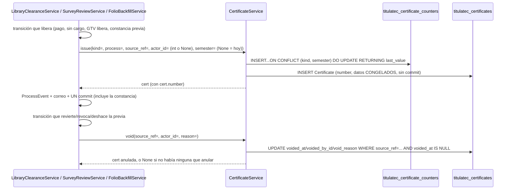

# Folios y constancias por lote: numeración, emisión y PDF (transversal)

> ⚠️ **La impresión está APAGADA por omisión (2026-10-05).** `TITULATEC_CERTIFICATE_PRINTING`
> (`itcj2/config.py`) vale `False`: ya no se imprimen constancias, solo se genera el **folio** y
> Servicios Escolares (SE) resuelve el papel internamente con él. Con el switch apagado el lote
> y el PDF dan **404**, la página `/titulatec/admin/constancias` es la tabla de **Folios** y
> ninguna vista menciona impresión. Todo lo de las secciones «Lotes y PDF», «Estado de impresión»
> y «El PDF (WeasyPrint)» sigue en el código y se vuelve a ver con
> `TITULATEC_CERTIFICATE_PRINTING=true` en `.env` + reinicio (D2: se oculta, no se borra) — ver
> «Switch de impresión» abajo. Spec `docs/superpowers/specs/2026-10-05-titulatec-folios-design.md`.

> **Objetivo (vigente):** al liberarse la encuesta (GTV) o el no adeudo (Biblioteca/Caja) el
> sistema emite un **folio** `{BIB|GTV}-{AAAA}{A|B}-{NNNN}` (`BIB-2026B-0001`), consecutivo por
> tipo + semestre. Las previas (D9) y el legado también lo llevan, en el semestre anterior al de
> su registro. Cada área ve en la pestaña **«Folios»** qué folio le tocó a cada persona, con
> buscador; SE lo ve solo en el panel de atender cotejo y en el expediente.
>
> **Objetivo (ronda del 2026-10-01/02, hoy tras el switch):** GTV y el Centro de Información
> dejan de entregarle papel al egresado uno por uno. El sistema acumula las constancias, y el
> área genera —una vez al día, cuando quiere— el PDF de las pendientes (2 o 3 por hoja carta, a
> elegir cada vez que se abre) para recortar y llevar a SE antes del cotejo. La tabla también
> dice si cada constancia YA se imprimió (entró a un lote) y, si se anuló DESPUÉS de imprimirse,
> avisa que hay que retirar ese papel.

| | |
|---|---|
| **Actor(es)** | 🤖 Sistema (emite/anula dentro de la transacción del dueño; el backfill emite sin usuario) · 📚 Centro de Información (ve los folios `library_clearance`; imprime solo con el switch encendido) · 🛠️ GTV (ve los `survey_release`; imprime solo con el switch encendido) · 🏛️ SE (ve el folio en cotejo y expediente) |
| **Permiso(s)** | `titulatec.certificate.page.list` (ENTRAR a la página — único gate de las 4 rutas) · `titulatec.library_clearance.api.print_certificates` (ver los folios de no adeudo; imprimirlos, si el switch está encendido) · `titulatec.survey_review.api.print_certificates` (ver los de encuesta; ídem) — las dos últimas deciden qué TIPOS ve cada quien, no si entra a la página. Sin permisos ni DML nuevos: los códigos `*.print_certificates` ahora significan «ver los folios de ese tipo» (spec folios C2) |
| **Trigger** | Emiten SOLOS, sin acción del área: `SurveyReviewService.approve` (encuesta, salvo `origin='prior'`), `LibraryClearanceService` al quedar `cleared` por `payment`/`no_charge`, y las dos `register_prior` (previas, semestre anterior). `FolioBackfillService` (`titulatec emitir-folios-previos`, paso 5 de `activar-biblioteca-caja`) cubre las previas anteriores a este código y el legado. Con el switch encendido, el área además dispara **«Generar lote»** cuando quiere imprimir |
| **Precondiciones** | Ninguna para emitir (es automático dentro de la transacción del dueño); para generar lote (switch encendido), al menos una constancia `kind` pendiente (sin lote, sin anular) |
| **Sub-flujos** | ⤵ compone [no adeudo de biblioteca](phase2_library_clearance.md) (emisor `library_clearance`), [liberación GTV de la encuesta](phase2_tech_management_survey_release.md) (emisor `survey_release`) y [constancias previas](xcut_prior_clearances.md#folio-de-las-previas-y-del-legado-2026-10-05) (previas y backfill) |
| **Estado final** | `Certificate` vigente con folio único `{PREFIJO}-{AAAA}{A\|B}-{NNNN}`, datos congelados; `CertificateBatch` con las constancias impresas juntas (solo si el switch estuvo encendido) |

Spec `docs/superpowers/specs/2026-10-01-titulatec-biblioteca-caja-design.md` §4.1.3-5, §4.5,
D7/D8/D15/D21/D22, §5 invariante 5; ampliado por
`docs/superpowers/specs/2026-10-02-titulatec-constancias-y-pendientes-design.md` §2 (E4/E8, 2 o 3
por hoja), §3.1-§3.2/§3.5 (E1/E5-E7, estado de impresión y listas de la página) y §3.4 (vistas de
SE; Rulings R13/R14 de la revisión final). Motor
compartido: `services/certificate_service.py::CertificateService`, **único** escritor de
`titulatec_certificates` / `titulatec_certificate_batches` / `titulatec_certificate_counters`
(igual que `SurveyReviewService` lo es de `titulatec_survey_reviews`). Página:
`pages/certificates_admin.py`, `/titulatec/admin/constancias`.

## Las dos constancias (`CERT_KINDS`)

Una sola tabla (`Certificate.kind`), textos VERBATIM del spec §4.5 — lo que se imprime y se
entrega a Servicios Escolares, no se parafrasea:

| `kind` | Prefijo | Título impreso | Departamento | Frase | Quién la emite |
|---|---|---|---|---|---|
| `library_clearance` | `BIB` | «CONSTANCIA DE NO ADEUDO» | Centro de Información | «no tiene adeudo con el Centro de Información (biblioteca) del Instituto Tecnológico de Ciudad Juárez» | `LibraryClearanceService` al quedar `cleared/payment` o `cleared/no_charge` (semestre de la emisión) y `register_prior` (`cleared/prior`, semestre anterior al registro); el legado, vía `FolioBackfillService` |
| `survey_release` | `GTV` | «CONSTANCIA DE LIBERACIÓN DE ENCUESTA DE EGRESADOS» | Gestión Tecnológica y Vinculación | «contestó la encuesta de egresados y le fue liberada» | `SurveyReviewService.approve` (salvo `origin='prior'`, semestre de la emisión) y `SurveyReviewService.register_prior` (previas, semestre anterior al registro) |

Título impreso, departamento y frase (`CERT_KINDS`) solo los usa el PDF, o sea, solo con el switch
de impresión encendido; el folio es lo único que hoy se ve.

D15: los folios de no adeudo los ve el Centro de Información; los de encuesta, GTV — ambos
conviven en la MISMA página (`/titulatec/admin/constancias`, «Folios»; `_visible_kinds` decide
qué `kind` ve cada quien por sus permisos efectivos; con el switch encendido son también los
tipos que cada área puede imprimir).

## Numeración atómica

**Formato (2026-10-05, migración `tt20261005c`):** `{PREFIJO}-{AAAA}{A|B}-{NNNN:04d}` —
`BIB-2026B-0001`, `GTV-2026A-0001`—, consecutivo por **tipo + semestre**. Antes era
`{PREFIJO}-{AAAA}-{NNNN}` por tipo + año. El semestre sale de funciones puras de módulo en
`services/certificate_service.py`:

| Función | Regla | Ejemplo |
|---|---|---|
| `semester_key(when)` | mes 1-6 → `A`, mes 7-12 → `B` | `2026-06-30` → `2026A`, `2026-07-01` → `2026B` |
| `previous_semester_key(when)` | el semestre ANTERIOR: `A` de Y → `(Y-1)B`; `B` de Y → `YA` | `2026-10-05` → `2026A`, `2027-02-10` → `2026B` |
| `SEMESTER_RE` | `^\d{4}[AB]$` (con `re.ASCII`, usada con `fullmatch`) | `2026B` sí; `2026C`, `26B`, `2026B\n` no |

`CertificateService._next_number(db, kind, semester)`: una sola sentencia, segura bajo PgBouncer —

```sql
INSERT INTO titulatec_certificate_counters (kind, semester, last_value)
VALUES (:kind, :semester, 1)
ON CONFLICT (kind, semester) DO UPDATE SET last_value = last_value + 1
RETURNING last_value
```

— `kind`+`semester` (`String(5)`) es la PK de `CertificateCounter` (antes `kind`+`year`). Nace en 1
la primera vez que se emite ese `(kind, semester)` (cambio de semestre → nuevo contador, arranca
en 1 otra vez); **anular una constancia NUNCA libera su número**, y «re-liberar» (Review Focus
#6) emite una constancia **NUEVA** con folio NUEVO — nunca reabre la anulada (las previas
también: deshacer y volver a registrar saca otro folio). Dos emisiones simultáneas del MISMO
`(kind, semester)` reciben folios consecutivos sin colisión (probado con dos conexiones reales,
`test_certificate_service.py`, Ruling R6: la concurrencia de NUMERACIÓN tiene prueba dedicada
con dos hilos/conexiones; la de `create_batch` con `SKIP LOCKED` no la exige el plan — el
mecanismo es del motor).

**Qué semestre lleva cada folio** (`issue(..., semester=)`):

- **Liberación normal** (pago, sin cargo, GTV libera; decisión C1): `semester=None` →
  `semester_key(db_now())`, el semestre de la **emisión** (equivale al «año de emisión» del
  formato viejo; no depende del código del periodo de la convocatoria, así que el verano no es
  un caso especial).
- **Previas y legado** (D5/D6): `previous_semester_key(<fecha de registro>)` — registrada en
  2026B da 2026A. Las previas importadas del Excel en dev quedan todas en 2026A. Para una **previa
  diferida** (importada sin proceso; `PriorClearance` que `apply_pending` aplica al inscribirse)
  la «fecha de registro» es `PriorClearance.created_at` —la importación—, NO la de la
  inscripción (kwarg `registered_at`): una importada en 2026B que se inscribe en 2027 sigue en
  2026A. Detalle: ⤵ [constancias previas](xcut_prior_clearances.md#folio-de-las-previas-y-del-legado-2026-10-05).

**Migración `tt20261005c`** (`down_revision = tt20261005b`, escrita a mano): `issued_by_id` pasa
a NULLABLE; las constancias existentes se renumeran con UN `UPDATE … ROW_NUMBER() OVER (PARTITION
BY kind, sem ORDER BY issued_at, id)` (el formato nuevo lleva la letra del semestre y nunca choca
con el UNIQUE de `number`); los contadores se reconstruyen (DROP + CREATE con la PK nueva + un
INSERT con el `COUNT(*)` por `(kind, sem)`), así el siguiente folio sigue al último. Producción no
tiene constancias (no-op); en dev las 3 BIB quedan `BIB-2026B-0001..0003`. Reversa y despliegue:
ver «Despliegue» abajo.

## Emitir y anular



- **`issue(db, *, kind, process, source_ref, actor_id: int | None, semester: str | None = None)`**:
  folio + datos CONGELADOS del proceso EN ESE MOMENTO (D7/D21/D22: número de control, nombre,
  carrera, semestre — un cambio posterior del alumno o la convocatoria no mueve lo ya emitido).
  `semester=None` → `semester_key(db_now())`; un valor que no cumpla `SEMESTER_RE` →
  `ValueError` ANTES de tocar el contador. `actor_id=None` es válido (importaciones, CLI y
  backfill): `issued_by_id` queda NULL. `issued_at` es SIEMPRE la hora real de emisión, aunque el
  folio caiga en un semestre anterior. No consulta antes si `source_ref` ya
  tiene una vigente: «a lo más UNA vigente por `source_ref`» (§5 invariante 5) la cuida primero
  el LLAMADOR, que conoce su propia máquina de estados (`SurveyReviewService.approve` solo emite
  desde `in_review`/`rejected`, nunca dos veces sobre una ya `approved`; `LibraryClearanceService`
  solo al ENTRAR a `cleared/payment|no_charge|prior`; el backfill solo donde no hay vigente), y
  la RESPALDA la base: el UNIQUE parcial
  `uq_titulatec_certificates_live_source` sobre `(source_ref) WHERE voided_at IS NULL` (Ruling
  R29, en el modelo y en `tt20261001a`). Un llamador que se equivocara truena con
  `IntegrityError` en el `flush()`; una anulada y su reemplazo sí conviven (la anulada sale del
  índice).
  **Sin commit** — transacción del llamador. `source_ref` = `"survey_review:{id}"` |
  `"library_clearance:{id}"` (sin FK real: puede apuntar a cualquiera de los dos dueños según
  `kind`).
- **`void(db, *, source_ref, actor_id, reason)`**: anula la VIGENTE de ese `source_ref` (`FOR
  UPDATE`, `voided_at IS NULL`). `None` si no hay ninguna que anular — **no es un error**: una
  previa registrada con el código anterior a los folios y aún sin backfill no tiene folio, así
  que revocarla o deshacerla no tiene nada que anular (el payload del evento lleva
  `certificate: None`). Desde 2026-10-05 las previas SÍ emiten, así que el caso normal es que
  `void` anule: `LibraryClearanceService.undo_prior` y `SurveyReviewService.revoke` (esta última
  ANTES del `db.delete` de una previa, Ruling R22) anulan su folio. Nunca borra ni libera el
  folio.
- **Quién emite y quién anula** (`source_ref` = `survey_review:{id}` / `library_clearance:{id}`):

  | Transición | Emite | Anula |
  |---|---|---|
  | GTV libera (`SurveyReviewService.approve`, no `prior`) | `survey_release`, semestre de hoy | — |
  | GTV revoca (`revoke`) | — | sí (también una previa, antes de borrarla) |
  | Biblioteca sin cargo / Caja cobra | `library_clearance`, semestre de hoy | — |
  | Revertir pago / sin cargo / legado (`revert_payment`, `revert_clearance`) | — | sí |
  | Constancia previa de encuesta o no adeudo (`register_prior`) | folio del semestre ANTERIOR al registro (`registered_at` en la diferida) | — |
  | Deshacer previa de no adeudo (`undo_prior`) | — | sí |
  | `FolioBackfillService` (previas anteriores al código y legado `cleared/legacy`) | semestre anterior al ancla, `actor_id=None` | — |
- `period_label(period)` → «Agosto-Diciembre 2026» por el sufijo del código `AAAAS` (1
  Enero-Junio, 2 Verano, 3 Agosto-Diciembre); respaldo `period.name` si el código no calza ese
  formato. `issue()` SIEMPRE recorta a `_PERIOD_LABEL_MAX = 40` (tope de columna,
  `Certificate.period_label` `String(40)`), aunque el respaldo por sí solo diera algo más largo.

## Backfill de folios de previas y legado (`FolioBackfillService`)

`services/folio_backfill_service.py`. Cubre lo que el código de `register_prior` nunca ve: las
previas registradas ANTES de que emitieran (p. ej. las importadas del Excel de Forms en dev) y el
no adeudo `cleared/legacy`, que no lo escribe ningún service sino el SQL de `tt20261001a` y la
promoción D17 de `activar-biblioteca-caja`.

- **`candidates(db) -> list[dict]`**: liberaciones VIGENTES sin folio vigente de un proceso que no
  está `cancelled`. `SurveyReview` `approved` con `origin='prior'` (ancla `reviewed_at`) y
  `LibraryClearance` `cleared` con `cleared_via IN ('prior','legacy')` (ancla `updated_at`); ancla
  NULL = `db_now()`. «Sin folio vigente» = `NOT EXISTS` en `titulatec_certificates` con el mismo
  `source_ref` y `voided_at IS NULL` (un folio anulado no cuenta: sale uno nuevo). Cada dict trae
  `kind`, `source_ref`, `process_id`, `anchor` y `semester = previous_semester_key(anchor)`; orden
  por ancla, tipo e id.
- **`run(db, *, dry_run) -> dict[(kind, semester), int]`**: en la corrida real lista con
  `candidates(db, lock=True)` (`FOR UPDATE OF` la tabla FUENTE, `titulatec_survey_reviews` /
  `titulatec_library_clearances`, ordenado por id), RE-VERIFICA cada fila con el mismo predicado
  justo antes de emitir (`_sigue_candidata`: si `revert_clearance`/`undo_prior`/`revoke` la dejó de
  liberar entre la lista y la emisión, no recibe folio ni cuenta; sin esto quedaba un folio VIVO
  sobre una fila no liberada y la siguiente liberación legítima daba 500 contra
  `uq_titulatec_certificates_live_source`) y hace `issue(..., actor_id=None, semester=...)`
  agrupado por tipo (dentro del tipo, por ancla: la numeración por `(kind, semester)` no cambia), y
  UN commit al final; `dry_run=True` solo cuenta, sin bloquear. Idempotente: una segunda corrida
  da 0. El estado que libera sale de las constantes del gate (`_SURVEY_RELEASED`/
  `_LIBRARY_RELEASED`), no de literales.
- **CLI** `titulatec emitir-folios-previos [--dry-run]` (`itcj2/cli/titulatec.py`) imprime los
  conteos por tipo y semestre, y **paso 5 de `titulatec activar-biblioteca-caja`** (después de la
  promoción D17, porque el legado nace ahí; su `--dry-run` no cuenta el legado que el re-backfill
  y la promoción crearían en la corrida real).
- Es el ÚNICO lector de `SurveyReview.status`/`LibraryClearance.status` fuera de los dueños y de
  `ClearanceGate`: está en `_LECTORES_DE_REPARACION` de `test_clearance_gate.py` (excepción por
  archivo, con control positivo: EXACTAMENTE 2 comparaciones, una por tipo), porque solo enumera
  filas ya liberadas sin su folio y su única
  escritura es `CertificateService.issue`.
- Las previas DIFERIDAS (sin proceso, `PriorClearance`) no son candidatas: reciben su folio al
  inscribirse el egresado (`apply_pending`), con el semestre de su importación.

## Switch de impresión (`TITULATEC_CERTIFICATE_PRINTING`, 2026-10-05)

`TITULATEC_CERTIFICATE_PRINTING: bool = False` en `itcj2/config.py`.
`certificate_service.printing_enabled()` lee `get_settings()` en CADA llamada (nada se guarda en
una constante de módulo: los tests parchean el atributo del singleton con la fixture
`printing_on`, y un autouse del conftest lo fija en `False` para que ninguna prueba dependa del
`.env`) y se registra como global Jinja **`tt_certificate_printing`**
(`titulatec_templates.env.globals`, `pages/nav.py`): los globales sí llegan a las macros
importadas sin contexto, las variables de contexto no.

| | Apagado (default) | Encendido |
|---|---|---|
| `POST /admin/constancias/{kind}/lote` | **404**, primera sentencia (no lee el formulario ni escribe) | «Generar lote» como antes |
| `GET /admin/constancias/lotes/{batch_id}.pdf` | **404** aunque el lote exista | el PDF como antes |
| Página `/admin/constancias` | solo la tabla de **Folios** (`_body_ctx` ni arma `sections`): sin «Por imprimir», «Generar lote», «Lotes» ni «Anuladas después de imprimir» | tabla de Folios + `partials/_certificates_print.html` debajo |
| `certificate_cell` (bandejas, cotejo, expediente) | folio (`tt-mono`) + nota tenue «previa» (`prior`) o «previo al sistema» (`legacy`); sin folio vigente: «Constancia previa (papel del egresado)» (`prior`) o «—» (también una anulada-tras-imprimir: la celda nunca queda en blanco). NUNCA «Impresa», «Sin imprimir», «No se imprimirá» ni «Anulada tras imprimir» | exactamente la ronda del 2026-10-02 |
| Columna de las bandejas de Biblioteca y GTV | «Folio» (antes «Constancia»), con o sin switch | ídem |

Para volver a imprimir: `TITULATEC_CERTIFICATE_PRINTING=true` en `.env` y reiniciar. Todo folio
sin lote aparecería «Por imprimir» desde el principio (también las previas y el legado): generar
un lote los incluye a todos.

## Lotes y PDF

> Esta sección y las dos siguientes («Estado de impresión», «El PDF») describen código que SIGUE
> en el repo pero solo es accesible con `TITULATEC_CERTIFICATE_PRINTING` encendido; apagado, el
> lote y el PDF dan 404 y las celdas muestran solo el folio (ver «Switch de impresión»).

- **`pending(db, kind)`**: constancias `kind` sueltas (`batch_id IS NULL`), vigentes
  (`voided_at IS NULL`) y de un proceso NO revocado (Ruling R26: `ProcessService.cancel` no
  anula constancias, y SE no debe recibir papeles de una inscripción dada de baja; la constancia
  no se toca, solo no se imprime), FIFO por `issued_at`. `pending_count(db, kind)` sigue
  disponible para quien solo necesite el número; la página de Folios ya NO lo llama para su
  badge (ver «Página de Folios» abajo). Los tres (`pending`, `pending_count`, `create_batch`)
  comparten UNA definición, `_pending_criteria(kind)` (el revocado con `NOT EXISTS`, no JOIN: el
  `FOR UPDATE SKIP LOCKED` del lote bloquea solo constancias).
- **`create_batch(db, *, kind, actor_id)`**: toma TODAS las pendientes con `FOR UPDATE SKIP
  LOCKED` (si otra transacción las está imprimiendo ahora mismo, esta llamada simplemente no las
  ve, en vez de bloquearse), crea el `CertificateBatch`, les pone `batch_id` a todas — esto es lo
  ÚNICO que marca una constancia como «impresa» (ver «Estado de impresión» abajo). **Commit
  propio**: imprimir es su propia operación, sin nada más pendiente en la transacción. 0
  pendientes → `ValueError` legible, nada se crea.
- **El PDF NUNCA se guarda**: `utils/certificate_pdf.py::render_certificates_pdf(certs,
  per_page=2|3) -> bytes` lo REGENERA siempre a partir de los datos ya CONGELADOS de cada fila —
  mismo resultado cada vez, nada que mantener sincronizado. `GET
  /lotes/{batch_id}.pdf?por_hoja=` (`2` o `3`) lo sirve `inline`, con el nombre de archivo
  `constancias_{kind}_{batch_id}_{n}xhoja.pdf` — se abre en pestaña nueva desde uno de los DOS
  `<a target="_blank">` planos del parcial («PDF · 3 por hoja» / «PDF · 2 por hoja», el de 3
  primero por ser el de siempre), nunca `<script>` (spec 2026-10-02 §3.1/E4). Esa ruta sigue
  siendo **`def`, no `async def`** (Ruling R23): WeasyPrint es CPU bloqueante —30 constancias
  1.7 s, 300 constancias 14.6 s, medido en el contenedor— y en el event loop congelaba un worker
  HTTP de toda la plataforma en cada PDF; como `def`, FastAPI la corre en su threadpool (desde 2026-10-05 es la convención de TODAS las rutas de la
  app, `CLAUDE.md` §1).
  **Dentro del escritorio del core (2026-10-05)**: el `<iframe>` del escritorio llevaba `sandbox` y
  Chromium bloqueaba el visor de PDF en ese contexto («bloqueó esta página» al abrir el lote con
  clic izquierdo). Se retiró el `sandbox` del iframe
  (`itcj2/core/static/js/dashboard/dashboard.js:250-256`, commit `a5ae4057`); los `<a
  target="_blank">` no cambian.
- **`certificates_of(db, batch_id)`**: todas las de un lote, anuladas incluidas — una anulada
  sale marcada «ANULADA» en el PDF **en los dos acomodos**, nunca desaparece del lote que ya se
  imprimió; la fila del lote conserva su `count` tal cual se generó, aunque una de sus constancias
  se anule después (Review Focus #2).
- **`list_batches(db, *, kind, page, per_page)`**: lotes más recientes primero, con
  `voided_count` por lote en UNA consulta agrupada (nunca una por fila).

## Estado de impresión («¿ya se imprimió?», E1/E5-E7)

Pedido del usuario (2026-10-02): que las tablas digan si cada constancia ya se entregó impresa.
**Una sola fuente de verdad** (invariante 1 de la spec de ese día): `titulatec_certificates.
batch_id` (`NULL` = sin imprimir) — no se agregó columna a `titulatec_survey_reviews` ni a
`titulatec_library_clearances`: una copia ahí tendría otro escritor y podría desincronizarse.
«Impresa» significa **entró a un lote** (E1): si la impresora falla, se reabre el PDF del lote y
se reimprime; no hay un paso aparte de «confirmar impresión».

- **`CertificateService.print_status_map(db, source_refs: list[str]) -> dict[str, dict | None]`**
  (solo lee `titulatec_certificates`/`_certificate_batches`, invariante 4): a lo más **2
  consultas por llamada**, sin importar cuántos `source_refs` traiga (1 si todos tienen vigente,
  2 si alguno no la tiene; `{}` sin tocar la base con una lista vacía). Por cada `source_ref`:
  - con constancia **vigente**: `number`, `issued_at`, `batch_id`, `batch_at` (fecha del lote,
    `None` si sigue suelta), `printed = batch_id is not None`, `voided_printed = None` SIEMPRE
    —aunque una anulada anterior del mismo origen sí se haya impreso, esa sale en
    `voided_after_print`, nunca aquí—;
  - sin vigente pero con una anulada que alcanzó a entrar a un lote: `voided_printed` con sus
    datos (`number`, `batch_id`, `batch_at`, `voided_at`, `void_reason`);
  - `None` (no un dict) si nunca tuvo constancia, o las que tuvo se anularon sin imprimirse.

  **Re-emisión tras anular (Review Focus #1):** pagado → impreso → revertido → pagado de nuevo
  emite una constancia NUEVA (folio nuevo, numeración atómica de siempre); como la vigente SIEMPRE
  manda, la celda muestra la NUEVA («Sin imprimir»), nunca la vieja impresa — la vieja aparece en
  «Anuladas después de imprimir».
- **`CertificateService.voided_after_print(db, kind, *, days=30) -> list[dict]`**: anuladas de
  `kind` con `batch_id IS NOT NULL` y `voided_at` en los últimos `days` días (`db_now()`, límite
  CERRADO: exactamente `days` días vale, un segundo más vieja ya no), de la más reciente a la más
  vieja. Incluye las de un proceso YA revocado después (a diferencia de `pending`): el papel sigue
  circulando y hay que recuperarlo igual.
- **`certificate_cell(info, *, prior=False, legacy=False, revoked=False)`** (macro en
  `templates/titulatec/_macros.html`): pinta la celda a partir del dict de arriba (o `None`).
  **Con el switch APAGADO** (el default desde 2026-10-05) pinta solo el folio, ver «Switch de
  impresión»; lo que sigue es la rama ENCENDIDA, igual a la ronda del 2026-10-02:
  - con vigente: folio + píldora «Impresa» (`lote #N · dd/mm/aaaa`), o —sin lote— «Sin imprimir»
    (ámbar); con `revoked` (inscripción revocada, Ruling R13) esa vigente sin lote pinta la
    píldora neutra **«No se imprimirá»** y, fuera de ella, la nota tenue **«inscripción
    revocada»**, que sí se parte (Ruling R18: la píldora es `nowrap` y con el motivo adentro
    desbordaba en celular). Es porque `_pending_criteria` ya no la lleva a ningún lote (R26) —
    así no contradice a «Por imprimir». «Impresa» y «Anulada tras imprimir» no cambian con
    `revoked`: ese papel existe;
  - sin vigente: «Constancia previa (papel del egresado)» si `prior`; «—» si `legacy` o si nunca
    tuvo constancia;
  - ADEMÁS, si no hay vigente y hay una anulada-con-lote: «Anulada tras imprimir · folio · lote #N —
    retira ese papel». Debajo del texto de `prior`/`legacy` cuando lo hay; si no, ABRE la celda,
    sin un «—» encima (M1 de la revisión final: la fila sí tuvo constancia).

  Nunca truena con `info=None`. La usan, cada una con UNA sola llamada a `print_status_map` por
  página/vista (invariante 2):
  - las bandejas de ⤵ [Biblioteca](phase2_library_clearance.md) y ⤵
    [GTV](phase2_tech_management_survey_release.md) (columna «Folio», antes «Constancia», en sus 3 pestañas; la
    llamada la hacen `_rows`/`list_for_inbox` para la página entera; pasan `revoked=r.revoked`);
  - el panel de atender cotejo y el expediente de SE (`_appt_attend.html`/`_exp_phase.html`,
    filas de encuesta y de no adeudo). Desde el Ruling R14, cada vista (`pages/appointments.py`/
    `pages/admin.py::_detail_ctx`) hace UNA llamada `print_status_map(db, [ref_encuesta,
    ref_biblioteca])` con los refs que existan (`SurveyReviewService.certificate_ref`/
    `LibraryClearanceService.certificate_ref`; sin solicitud o sin fila no se pide) y cuelga
    `certificate` en cada resumen (`None` si no aplica): a lo más 2 consultas de constancias por
    vista. Los dos `summary_for_process` no consultan constancias —ni la marca (R14) ni, el de
    biblioteca, su viejo `certificate_number`, que no tenía lector desde la Task 4 (Ruling R17)—:
    también los usan el tablero del egresado, «Mi cita» y las páginas públicas de la encuesta, que
    no la pintan. Las dos vistas pasan `revoked=` con el estado del proceso.
    Con el proceso `cancelled` el renglón del no adeudo muestra «Revocada» en vez de la píldora
    de liberación (m42; desde R15 también en lugar de «Por pagar en Caja», sin el sufijo del
    monto), y la celda de constancia se conserva.
  - La página de Folios NO la usa: con el switch encendido muestra lo mismo con sus propias
    tablas, directo de `pending`/`voided_after_print` (ver «Página de Folios» abajo), sin
    `print_status_map`.
  - Caja tampoco pinta la celda (`cashier_body.html`): sigue con el folio suelto de siempre
    (`r.certificate_number`) bajo su propia píldora (`caja_pill`, ⤵ [no adeudo de
    biblioteca](phase2_library_clearance.md)). Sus DATOS sí pasan por `print_status_map`: la tabla
    de búsqueda/«Por cobrar» sale de `_rows` (el mismo de Biblioteca, que calcula `certificate` y
    de ahí `certificate_number`) y el «Corte del día» (`day_cut`) lo usa para saber qué cobro
    sigue siendo el de la constancia vigente («Revertir…»).

### El PDF (WeasyPrint)

Plantilla en DOS piezas (E8, pensando en los formatos oficiales que cada área trae después):
`templates/titulatec/certificates/sheet.html` —la HOJA— NO extiende `base.html` ni ningún layout
HTTP: es un documento completo con su propio `@page { size: letter }` y una clase de acomodo por
hoja (`sheet--2`/`sheet--3`), pensado solo para WeasyPrint; y `templates/titulatec/certificates/
_slot.html` —la RANURA de una constancia—, que `sheet.html` incluye por `kind` a través del mapa
`SLOT_TEMPLATES` (`utils/certificate_pdf.py`: hoy los dos `CERT_KINDS` comparten la misma ranura;
el día que lleguen los formatos oficiales, cada entrada apunta a la suya sin tocar `sheet.html` ni
`render_certificates_pdf`). `render_certificates_pdf` agrupa `certs` de `per_page` en `per_page`
(`ALLOWED_PER_PAGE = (2, 3)`, `DEFAULT_PER_PAGE = 3`; cualquier otro valor es un `ValueError` de
PROGRAMADOR —la ruta ya normalizó con `_parse_por_hoja` antes de llamarla—). La ranura mide 3.2in
de alto con 3 por hoja y 4.9in con 2 (tipografía algo mayor en 2); la línea punteada de corte con
✂ va entre ranuras de la MISMA hoja, nunca después de la última.

Cada ranura: logos TecNM + escudo ITCJ (`itcj2/core/static/images/`, resueltos por WeasyPrint
contra `base_url` = `CORE_STATIC_DIR`, calculado desde el paquete — nunca el cwd del proceso),
campos (No. de control, Nombre, Carrera, Semestre), folio y fecha de emisión en español
(`utils/dates_es.py::dia_mes`). El pie («Fecha de emisión» / línea «Nombre, firma y sello») va
anclado al FONDO de la ranura con `position: absolute` (no `margin-top: auto`: WeasyPrint 70 solo
soporta flexbox PARCIALMENTE y ese truco no lo empujaba al fondo) — deja espacio arriba de la
línea para firmar y sellar, en los dos acomodos. Una constancia anulada lleva el sello «ANULADA»
superpuesto, en los dos acomodos. Fuentes: Arial/Liberation/DejaVu (ya en la imagen Debian 13 con
LibreOffice; **Pango** —que WeasyPrint sí exige y la imagen NO traía— se agregó en `02e32128`;
**`libharfbuzz-subset0`** —evita el `DeprecationWarning` «HarfBuzz-Subset will be required», no un
error duro— se agregó el 2026-10-02; ver «Despliegue» abajo). Una lista vacía SÍ produce un PDF
(de una página en blanco: WeasyPrint siempre renderiza el `@page`) — decidir si eso es un error de
negocio es tarea del llamador (`create_batch` ya impide un lote de 0 constancias).

## Página de Folios (`pages/certificates_admin.py`)

Misma URL (`/titulatec/admin/constancias`), mismo permiso y mismos nombres internos
(`Certificate*`, `certificates_admin.py`); solo cambian la etiqueta del menú —«Constancias»
(`bi-printer`) pasó a **«Folios»** (`bi-hash`, `pages/nav.py`)—, el título («Folios ·
TitulaTec», encabezado «Folios de liberación») y el contenido (spec folios C3, §3.6).

- `_LIST = ["titulatec.certificate.page.list"]` en las CUATRO rutas — es el permiso de ENTRAR.
  Qué tipos puede de verdad VER cada actor (y, con el switch encendido, IMPRIMIR) es una pregunta
  aparte, resuelta por el ÚNICO helper `_visible_kinds(db, user_id)` (antes `_printable_kinds`;
  lee permisos efectivos de la app contra `_KIND_PERM`). El reparto del DML siempre concede ambos
  códigos juntos a quien corresponde, pero el helper no lo asume: una cuenta con
  `certificate.page.list` y SIN ningún permiso de tipo entra a la página y ve «Sin tipos
  asignados».
- Un `kind` REAL de `CERT_KINDS` fuera de lo que `_visible_kinds` permite responde SIEMPRE
  **404** (nunca 403: la página ya se aprobó con `page.list`, así que un 403 no distinguiría nada
  que el actor no supiera ya) — mismo criterio que un recurso fuera de alcance en el resto de la
  app. Un `kind` AUSENTE o que no es de `CERT_KINDS` solo es un filtro mal escrito: cae en el
  primer `kind` visible, nunca en error.
- **Tabla de folios** (`GET ""` y `GET /body`, sin importar el switch). Parámetros: `kind`, `q`
  (`normalize_q`), `estado` (`vigentes` por omisión, `anulados`, `todos`; cualquier otro cae en
  `vigentes`) y `page` (con el switch encendido, también `page_library_clearance`/
  `page_survey_release` de «Lotes»). La lectura es `CertificateService.list_folios(db, *, kind,
  q=None, estado="vigentes", per_page=PAGE_SIZE, page=1) -> Page`: lee SOLO
  `titulatec_certificates` (invariante 4; los datos del egresado salen de lo congelado al emitir),
  busca en `number` y `control_number` (también en MAYÚSCULA) con la búsqueda entera y en
  `student_name` POR PALABRAS (AND de un `ILIKE` por palabra, en cualquier orden: «Juan Pérez»
  encuentra «PÉREZ GÓMEZ JUAN», revisión final M3), todo con `like_pattern` + `escape="\\"`,
  ordena `issued_at DESC, id DESC` y pagina con `utils/paging.paginate_query`; los
  items son dicts (`number`, `student_name`, `control_number`, `program_name`, `issued_at`,
  `voided_at`, `void_reason`).
- **Plantilla** `partials/certificates_body.html` (raíz `#tt-cert-body`; la incluye `certificates.html`):
  pestañas por `kind` solo si el actor ve más de uno (admin); chips de estado; buscador
  **`#tt-folio-q`** con `hx-preserve="true"`, dentro de **`#tt-folio-filters`**
  (`data-tt-q-server`, reglas de §18 de la guía de la app: el contenedor lleva `kind`, `estado` y
  `page=1`); tabla Folio · Egresado · No. de control · Carrera · Emitido (dd/mm/aaaa) · Estado
  («Vigente», o «Anulado» + fecha + motivo); paginación con la macro `pager(..., include=
  '#tt-folio-filters', prefix='tt-folio')`. Vacío: «Sin folios todavía», o «Sin resultados para
  "{q}"» si hubo búsqueda. Texto del encabezado: «El folio se genera solo al liberar; búscalo por
  folio, número de control o nombre.»
- **Con el switch encendido**, debajo de la tabla se incluye `partials/_certificates_print.html`
  (la impresión de la ronda del 2026-10-02, movida tal cual): «Generar lote» y la paginación de
  «Lotes» llevan `hx-include` de `#tt-folio-filters`, así que repintar `#tt-cert-body`
  (`create_batch` lo hace entero) conserva la pestaña, la búsqueda y el estado de la tabla.
  Lo siguiente describe esa parte.
- Por cada `kind` visible, antes de los lotes (E6/E7): **«Por imprimir (N)»**, con un
  `<details>` CERRADO por omisión (sin JS) que lista, en FIFO, a QUIÉNES corresponde
  (folio/egresado/control/carrera/emitida, de `CertificateService.pending`) — no se pinta con 0
  pendientes; y, si aplica, **«Anuladas después de imprimir (últimos 30 días)»**
  (folio/egresado/control/lote/anulada el/motivo, de `voided_after_print`) — no se pinta si no hay
  ninguna. `N` (el badge Y el de «Generar lote (N)») sale de `len(pending_rows)`, la MISMA lista
  que ya trajo el `<details>` — no de una segunda consulta a `pending_count`.
- **«Generar lote (N)»** (confirmación) → el parcial re-pintado trae «Lote recién generado» con
  los DOS enlaces al PDF («PDF · 3 por hoja» / «PDF · 2 por hoja», `?por_hoja=2` o `3`); «Lotes» lista
  fecha, quién, cuántas (y cuántas anuladas) y los MISMOS dos enlaces. Paginación independiente
  por `kind` (`page_library_clearance`/`page_survey_release`, siempre los dos en la URL aunque el
  actor solo vea uno).
- Rutas por `kind`/`batch_id`, **nunca** `process_id` (sin alcance por carrera, §4.6, §5
  invariante 6, censo de `test_scope_guard.py`).

## Pasos detallados

| # | Actor | UI / dónde | Acción | Endpoint | Service · método | Efecto en BD | Eventos |
|---|---|---|---|---|---|---|---|
| 1 | 🤖 | — | GTV libera la encuesta | `SurveyReviewService.approve` | `CertificateService.issue(kind="survey_release", ...)` | `titulatec_certificates` INSERT, semestre de hoy (salvo `origin='prior'`) | — (dentro del evento de `approve`) |
| 1b| 🤖 | — | GTV revoca | `SurveyReviewService.revoke` | `CertificateService.void(source_ref="survey_review:{id}")` | `voided_at`/`voided_by_id`/`void_reason` (una previa se anula ANTES de borrarla; `None` si no tenía folio) | — |
| 1c| 🤖 | — | constancia previa de encuesta | `SurveyReviewService.register_prior` | `CertificateService.issue(kind="survey_release", semester=previous_semester_key(registered_at or ahora), actor_id=None\|int)` | INSERT, semestre anterior al registro | — (dentro de `survey_review_prior`) |
| 2 | 🤖 | — | Biblioteca registra sin cargo, o Caja cobra | `LibraryClearanceService._clear_no_charge` / `.register_payment` | `CertificateService.issue(kind="library_clearance", ...)` | INSERT, semestre de hoy | — (dentro del evento del dueño) |
| 2b| 🤖 | — | Biblioteca/Caja revierte | `revert_payment` / `revert_clearance` | `CertificateService.void(source_ref="library_clearance:{id}")` | anula (o `None`) | — |
| 2c| 🤖 | — | constancia previa de no adeudo | `LibraryClearanceService.register_prior` (también `commit=False`) | `CertificateService.issue(kind="library_clearance", semester=previous_semester_key(registered_at or ahora))` | INSERT, semestre anterior al registro | — (dentro de `library_prior_registered`) |
| 2d| 🤖 | — | deshacer constancia previa de no adeudo | `LibraryClearanceService.undo_prior` | `CertificateService.void(source_ref="library_clearance:{id}")` | anula; el payload de `library_prior_undone` lleva `certificate` (folio o `None`) | — |
| 2e| 🤖 | CLI | previas anteriores al código y legado `cleared/legacy` | `titulatec emitir-folios-previos` / paso 5 de `activar-biblioteca-caja` | `FolioBackfillService.run` → `issue(actor_id=None, semester=previous_semester_key(ancla))` | INSERT por candidato, UN commit | — |
| 3 | 📚/🛠️ | Folios | ver los folios del `kind`, buscar, filtrar por estado, paginar | `GET /admin/constancias[/body]` | `CertificateService.list_folios` | — (lectura) | — |
| 3b| 📚/🛠️ | Folios (solo switch encendido) | ver «Por imprimir» / «Anuladas» / «Lotes» | `GET /admin/constancias[/body]` | `pending` + `voided_after_print` + `list_batches` | — (lectura) | — |
| 4 | 📚/🛠️ | «Generar lote» (solo switch encendido) | imprimir el lote del día | `POST /admin/constancias/{kind}/lote` (404 apagado) | `CertificateService.create_batch` | `CertificateBatch` INSERT + `batch_id` en N filas, commit propio | — |
| 5 | 📚/🛠️ | «PDF · 3 por hoja» / «PDF · 2 por hoja» (solo switch encendido) | abrir el PDF de un lote, en el acomodo elegido | `GET /admin/constancias/lotes/{batch_id}.pdf?por_hoja=` (`2` o `3`; 404 apagado) | `certificates_of` + `render_certificates_pdf(per_page=)` | — (lectura, el PDF se regenera siempre) | — |

## Estado resultante

- `Certificate` con `number` único (`BIB-AAAA{A|B}-NNNN` / `GTV-AAAA{A|B}-NNNN`, p. ej.
  `BIB-2026B-0001`), datos congelados, `issued_at`/`issued_by_id` (NULL si lo emitió una
  importación o el backfill); `batch_id` `NULL` hasta que se imprime (con el switch apagado, para
  siempre).
- A lo más UNA vigente (no anulada) por `source_ref` (los emisores + el UNIQUE parcial de la
  base); anular nunca borra ni reutiliza el folio.
- `CertificateBatch` con `count` fijo (las constancias de ese lote no se mueven a otro lote
  después, aunque se anulen).
- `CertificateCounter(kind, semester)` con `last_value` monotónico — nunca retrocede.

## Caminos alternos / errores ❗

- **Switch de impresión apagado** → `create_batch` y `batch_pdf` responden **404** (primera
  sentencia, antes de cualquier otra validación); la página no pinta nada de impresión.
- **`create_batch` con 0 pendientes** (switch encendido) → `ValueError("No hay constancias por
  imprimir.")` → `400` + `X-Tt-Error`.
- **`kind` desconocido** (fuera de `CERT_KINDS`) en `issue`/`create_batch`/`list_folios` →
  `ValueError`.
- **`semester` fuera de `SEMESTER_RE`** en `issue` (`"2026C"`, `"26B"`, `"2026B\n"`, no-`str`) →
  `ValueError` en español, antes de tocar el contador (no se consume ningún folio).
- **`kind` REAL fuera de lo que el actor puede ver** (página, `create_batch`, `batch_pdf`) →
  `404`. **`kind` ausente o desconocido en la página** → el primer `kind` visible, nunca error.
- **Lote inexistente** (`batch_pdf`) → `404`.
- **Dos emisiones simultáneas del mismo `(kind, semester)`** → folios consecutivos, sin colisión
  (`ON CONFLICT DO UPDATE`, probado con dos conexiones reales).
- **Imprimir dos veces «al mismo tiempo»** → `create_batch` usa `SKIP LOCKED`: la segunda
  llamada simplemente no ve las filas que la primera ya tomó (no se bloquea, no duplica el lote).
- **Anular algo que nunca se emitió** (una previa registrada antes de los folios y sin backfill,
  revocada o deshecha) → `void` devuelve `None`, sin error: camino normal, no hay nada que
  anular.
- **Correr `emitir-folios-previos` dos veces** → la segunda no emite nada (una liberación con
  folio vigente ya no es candidata).
- **Una segunda vigente del mismo origen** (un llamador que se saltara su máquina de estados) →
  `IntegrityError` contra `uq_titulatec_certificates_live_source`: la base no deja dos papeles
  válidos del mismo trámite.
- **Inscripción revocada con constancias sin imprimir** → no salen en «Por imprimir» ni en el
  lote (`_pending_criteria`); se quedan sin lote y sin anular, y la celda de la columna «Folio»
  (antes «Constancia») de las bandejas y de las vistas de SE, CON EL SWITCH DE IMPRESIÓN
  ENCENDIDO, las pinta con la píldora «No se imprimirá» y la nota «inscripción revocada»
  (R13/R18); apagado (el default) pinta solo el folio.
- **`?por_hoja=` fuera de forma** (ausente, vacío, `abc`, `4`, …) → `_parse_por_hoja` cae en 3 por
  hoja (`DEFAULT_PER_PAGE`): nunca `400`/`500` — es un filtro de vista, igual que `_parse_dia` de
  Caja.

## Despliegue

### Folios por semestre (2026-10-05, spec folios §6)

1. `alembic upgrade head` (→ `tt20261005c`; con `MIGRATE_DATABASE_URL`, nunca por PgBouncer).
2. El paso de folios ya va dentro de `titulatec activar-biblioteca-caja` (paso 5, tras la
   promoción D17): producción folia su legado sin un paso manual, y las previas que lleguen
   después se folian solas al registrarse.
3. Si alguna previa se importó ANTES de este código: `titulatec emitir-folios-previos --dry-run`
   y luego sin `--dry-run`.
4. **Dev:** migrar y correr `titulatec emitir-folios-previos` (folia las previas ya aplicadas y el
   legado a 2026A; al 2026-10-05 el dry-run da 2 folios de encuesta, 2026A). Las previas
   DIFERIDAS importadas del Excel (368) no son candidatas: reciben su folio al inscribirse
   (`apply_pending`), con el semestre de su importación (2026A).
5. `TITULATEC_CERTIFICATE_PRINTING` queda en `False` (no hace falta tocar `.env`).

**Volver a imprimir:** `TITULATEC_CERTIFICATE_PRINTING=true` en `.env` y reiniciar. Todo folio sin
lote (también el de las previas y el legado) aparecería «Por imprimir» desde el principio.

**Reversa**, desde la imagen NUEVA y ANTES de `./docker/scripts/rollback.sh` (la imagen vieja no
conoce `tt20261005c`): `alembic -c migrations/alembic.ini downgrade tt20261005b`. El downgrade, en
este orden: (1) `DELETE` de las constancias con `issued_by_id IS NULL` (folios de importación y
backfill: el esquema viejo no los admite; ninguna tabla tiene FK hacia `titulatec_certificates`);
(2) renumera las que quedan a `{prefijo}-{AAAA}-{NNNN}` por `(kind, año de issued_at)`; (3)
reconstruye los contadores `(kind, year)`; (4) `issued_by_id` vuelve a NOT NULL. **Se pierde**
todo folio sin emisor. Los folios de previas emitidos POR UN USUARIO (captura de SE, Biblioteca,
GTV) sobreviven, y el código viejo los trataría como constancias por imprimir (aparecerían en
«Por imprimir»). Un upgrade posterior los re-archiva en el semestre de su `issued_at`, no en el
anterior a su registro.

### Imagen (WeasyPrint)

`weasyprint>=70,<71` en `requirements.txt` (70.0 verificado); `libpango-1.0-0
libpangoft2-1.0-0` en `docker/backend/Dockerfile.fastapi` y en el workflow de CI antes de
`pytest` — la imagen Debian 13 con LibreOffice ya traía cairo/harfbuzz/fontconfig/fuentes, pero
**no** Pango, que WeasyPrint exige. Sin estos paquetes, `render_certificates_pdf` revienta al
primer PDF (`OSError` de WeasyPrint al cargar Pango), no antes. Junto a ellos, desde el
2026-10-02, **`libharfbuzz-subset0`** (m07): sin él, WeasyPrint emite un `DeprecationWarning`
(«HarfBuzz-Subset will be required») en cada PDF — no un error, pero `deploy.sh` reconstruye la
imagen con el paquete ya puesto para no arrastrarlo. WeasyPrint/Pango siguen en
`requirements.txt`, el Dockerfile y el CI aunque la impresión esté apagada (D2).

## Pruebas

Folios (2026-10-05): `test_certificate_service.py` (`semester_key`/`previous_semester_key` en
los bordes —junio/julio, enero/diciembre—, formato `BIB-2026B-0001`, el contador reinicia por
semestre, `semester=` explícito, inválido → `ValueError`, `actor_id=None`, concurrencia sobre
`(kind, semester)`, `list_folios`: búsqueda por folio/control/nombre/`%`, estados, orden y
paginación; el reloj se fija en un año sintético, `_ANIO = 2091`, porque la base de dev es
compartida y ya trae contadores reales), `test_biblioteca_caja_models.py` (PK
`(kind, semester)`, `issued_by_id` nullable),
`test_survey_review_service.py`/`test_library_clearance_service.py`/
`test_prior_clearance_service.py`/`test_survey_import_service.py` (la previa emite folio del
semestre anterior, la diferida el de su importación, `undo_prior` anula, revocar una previa de
encuesta anula antes de borrar, el import de Forms emite un folio por fila liberada),
`test_folio_backfill.py` (candidatos, semestre por ancla, dry-run, idempotencia, orden, la CLI y
el paso de `activar-biblioteca-caja`), `test_clearance_gate.py` (`_LECTORES_DE_REPARACION`),
`test_certificates_page.py` (switch apagado: tabla de folios, buscador preservado con
`paging_asserts.assert_buscador_preservado`, `kind` ajeno 404, lote/PDF 404, sin texto de
impresión; encendido: lo de hoy, con la fixture `printing_on`), `test_se_library_views.py`/
`test_library_inbox.py`/`test_survey_reviews_admin_routes.py` (la celda apagada: folio sin
píldoras), `test_mail_compose.py`/`test_cotejo_requirements.py` (textos de C4).

Ronda del 2026-10-01/02 (corren con el switch encendido por fixture):
`test_certificate_service.py` (numeración atómica con dos conexiones reales —incluida la limpieza
robusta del renglón sintético si algún hilo sigue vivo tras el `join`—, `void`, lotes con `SKIP
LOCKED`, revocadas fuera de «Por imprimir», dos vigentes del mismo origen truenan, `period_label`,
el truncado de `control_number`/`student_name` a su columna y, desde la Tarea 1 de la spec
2026-10-02, también el de `program_name` —`core_programs.name` es `Text` sin tope,
`Certificate.program_name` es `String(200)`—; `print_status_map`/`voided_after_print`: vigente
sin/con lote, pagado→impreso→anulado, anulada sin lote, anulada→re-emitida, lote mixto de varias
anuladas, el límite de 30 días CERRADO exacto, presupuesto de consultas en 1 y 20 filas),
`test_se_library_views.py` (la celda en las dos vistas de SE; R13/R18 en las dos celdas y por
render directo de la macro; R14/R17: una llamada por vista con los refs que existan y a lo más 2
consultas de constancias en total), `test_library_inbox.py`/`test_survey_reviews_admin_routes.py`
(la columna en las bandejas; la anulada tras imprimir abre la celda sin «—», M1; R13/R18 en las
dos), `test_student_library_status.py`/`test_survey_review_submit.py` (R14/R17: el tablero, «Mi
cita» y la página pública de la encuesta no llaman `print_status_map` ni tocan ninguna tabla de
constancias),
`test_biblioteca_caja_models.py` (el UNIQUE parcial en el modelo y en la BD),
`test_certificate_pdf.py` (2 o 3 por página, `per_page=4` truena, el pie anclado al fondo con
espacio de firma en los dos acomodos, el sello ANULADA en los dos acomodos, texto extraíble con
`pypdf`), `test_certificates_page.py` (página: `_visible_kinds` resuelto UNA sola vez por
petición, 404 por `kind`/`batch_id`, sin `{process_id}`, la ruta del PDF no es corrutina,
`?por_hoja=` fuera de forma cae en 3, ids de la tarjeta «Lote generado» sin chocar con los de la
fila, el `<details>` de pendientes FIFO y colapsado, la sección de anuladas).

## Flujos relacionados

- ⤵ [No adeudo de biblioteca: Biblioteca → Caja](phase2_library_clearance.md) — emisor
  `library_clearance`.
- ⤵ [Liberación GTV de la encuesta de egresados](phase2_tech_management_survey_release.md) —
  emisor `survey_release`; `approve` salta `origin='prior'` porque la previa emite en
  `register_prior`.
- ⤵ [Constancias previas](xcut_prior_clearances.md#folio-de-las-previas-y-del-legado-2026-10-05)
  — D9: el egresado trae su papel de antes, pero desde 2026-10-05 la previa también lleva folio
  (semestre anterior al registro).
- Glosario: [`Certificate`, `CertificateBatch`, `CertificateCounter`, `CertificateService`](_glossary.md).
