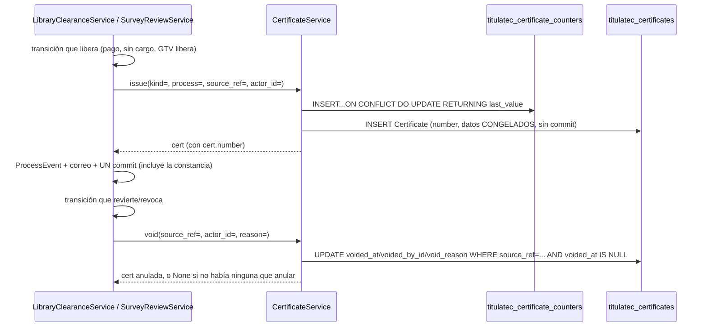

# Constancias por lote: numeración, emisión y PDF (transversal)

> **Objetivo:** GTV y el Centro de Información dejan de entregarle papel al egresado uno por
> uno. El sistema emite una constancia con **número propio** en cuanto se libera la encuesta o
> el no adeudo, las acumula, y el área genera —una vez al día, cuando quiere— el PDF de las
> pendientes (3 por hoja carta) para recortar y llevar a Servicios Escolares antes del cotejo.

| | |
|---|---|
| **Actor(es)** | 🤖 Sistema (emite/anula dentro de la transacción del dueño) · 📚 Centro de Información (imprime `library_clearance`) · 🛠️ GTV (imprime `survey_release`) |
| **Permiso(s)** | `titulatec.certificate.page.list` (ENTRAR a la página — único gate de las 4 rutas) · `titulatec.library_clearance.api.print_certificates` (imprimir no adeudo) · `titulatec.survey_review.api.print_certificates` (imprimir encuesta) — las dos últimas deciden qué SECCIONES ve cada quien, no si entra a la página |
| **Trigger** | `SurveyReviewService.approve` (encuesta, salvo `origin='prior'`) y `LibraryClearanceService` al quedar `cleared` por `payment`/`no_charge` (no adeudo) emiten SOLAS, sin acción del área. El área solo dispara **«Generar lote»** cuando quiere imprimir |
| **Precondiciones** | Ninguna para emitir (es automático dentro de la transacción del dueño); para generar lote, al menos una constancia `kind` pendiente (sin lote, sin anular) |
| **Sub-flujos** | ⤵ compone [no adeudo de biblioteca](phase2_library_clearance.md) (emisor `library_clearance`) y [liberación GTV de la encuesta](phase2_tech_management_survey_release.md) (emisor `survey_release`) |
| **Estado final** | `Certificate` vigente con folio único `{PREFIJO}-{AAAA}-{NNNN}`, datos congelados; `CertificateBatch` con las constancias impresas juntas |

Spec `docs/superpowers/specs/2026-10-01-titulatec-biblioteca-caja-design.md` §4.1.3-5, §4.5,
D7/D8/D15/D21/D22, §5 invariante 5. Motor compartido: `services/certificate_service.py::
CertificateService`, **único** escritor de `titulatec_certificates` /
`titulatec_certificate_batches` / `titulatec_certificate_counters` (igual que
`SurveyReviewService` lo es de `titulatec_survey_reviews`). Página:
`pages/certificates_admin.py`, `/titulatec/admin/constancias`.

## Las dos constancias (`CERT_KINDS`)

Una sola tabla (`Certificate.kind`), textos VERBATIM del spec §4.5 — lo que se imprime y se
entrega a Servicios Escolares, no se parafrasea:

| `kind` | Prefijo | Título impreso | Departamento | Frase | Quién la emite |
|---|---|---|---|---|---|
| `library_clearance` | `BIB` | «CONSTANCIA DE NO ADEUDO» | Centro de Información | «no tiene adeudo con el Centro de Información (biblioteca) del Instituto Tecnológico de Ciudad Juárez» | `LibraryClearanceService` al quedar `cleared/payment` o `cleared/no_charge` |
| `survey_release` | `GTV` | «CONSTANCIA DE LIBERACIÓN DE ENCUESTA DE EGRESADOS» | Gestión Tecnológica y Vinculación | «contestó la encuesta de egresados y le fue liberada» | `SurveyReviewService.approve` (salvo `origin='prior'`) |

D15: las de no adeudo las imprime el Centro de Información; las de encuesta, GTV — ambas
conviven en la MISMA página de Constancias (`_printable_kinds` decide qué secciones ve cada
quien por sus permisos efectivos).

## Numeración atómica

`CertificateService._next_number(db, kind, year)`: una sola sentencia, segura bajo PgBouncer —

```sql
INSERT INTO titulatec_certificate_counters (kind, year, last_value)
VALUES (:kind, :year, 1)
ON CONFLICT (kind, year) DO UPDATE SET last_value = last_value + 1
RETURNING last_value
```

— `kind`+`year` es la PK de `CertificateCounter`. Nace en 1 la primera vez que se emite ese
`(kind, year)` (cambio de año → nuevo contador, arranca en 1 otra vez); **anular una constancia
NUNCA libera su número**, y «re-liberar» (Review Focus #6) emite una constancia **NUEVA** con
folio NUEVO — nunca reabre la anulada. Dos emisiones simultáneas de la MISMA `(kind, year)`
reciben folios consecutivos sin colisión (probado con dos conexiones reales,
`test_certificate_service.py`, Ruling R6: la concurrencia de NUMERACIÓN tiene prueba dedicada
con dos hilos/conexiones; la de `create_batch` con `SKIP LOCKED` no la exige el plan — el
mecanismo es del motor).

## Emitir y anular



- **`issue(db, *, kind, process, source_ref, actor_id)`**: folio + datos CONGELADOS del proceso
  EN ESE MOMENTO (D7/D21/D22: número de control, nombre, carrera, semestre — un cambio posterior
  del alumno o la convocatoria no mueve lo ya impreso). No consulta antes si `source_ref` ya
  tiene una vigente: «a lo más UNA vigente por `source_ref`» (§5 invariante 5) la cuida primero
  el LLAMADOR, que conoce su propia máquina de estados (`SurveyReviewService.approve` solo emite
  desde `in_review`/`rejected`, nunca dos veces sobre una ya `approved`; `LibraryClearanceService`
  solo al ENTRAR a `cleared/payment|no_charge`), y la RESPALDA la base: el UNIQUE parcial
  `uq_titulatec_certificates_live_source` sobre `(source_ref) WHERE voided_at IS NULL` (Ruling
  R29, en el modelo y en `tt20261001a`). Un llamador que se equivocara truena con
  `IntegrityError` en el `flush()`; una anulada y su reemplazo sí conviven (la anulada sale del
  índice).
  **Sin commit** — transacción del llamador. `source_ref` = `"survey_review:{id}"` |
  `"library_clearance:{id}"` (sin FK real: puede apuntar a cualquiera de los dos dueños según
  `kind`).
- **`void(db, *, source_ref, actor_id, reason)`**: anula la VIGENTE de ese `source_ref` (`FOR
  UPDATE`, `voided_at IS NULL`). `None` si no hay ninguna que anular — **no es un error**: un
  `SurveyReview` con `origin='prior'` nunca emitió (lo salta `issue` desde `approve`), así que
  revocarlo no tiene nada que anular, camino normal. Nunca borra ni libera el folio.
- `period_label(period)` → «Agosto-Diciembre 2026» por el sufijo del código `AAAAS` (1
  Enero-Junio, 2 Verano, 3 Agosto-Diciembre); respaldo `period.name` si el código no calza ese
  formato. `issue()` SIEMPRE recorta a `_PERIOD_LABEL_MAX = 40` (tope de columna,
  `Certificate.period_label` `String(40)`), aunque el respaldo por sí solo diera algo más largo.

## Lotes y PDF

- **`pending(db, kind)`**: constancias `kind` sueltas (`batch_id IS NULL`), vigentes
  (`voided_at IS NULL`) y de un proceso NO revocado (Ruling R26: `ProcessService.cancel` no
  anula constancias, y SE no debe recibir papeles de una inscripción dada de baja; la constancia
  no se toca, solo no se imprime), FIFO por `issued_at`. `pending_count(db, kind)` para el badge
  «Por imprimir (N)». Los tres (`pending`, `pending_count`, `create_batch`) comparten UNA
  definición, `_pending_criteria(kind)` (el revocado con `NOT EXISTS`, no JOIN: el `FOR UPDATE
  SKIP LOCKED` del lote bloquea solo constancias).
- **`create_batch(db, *, kind, actor_id)`**: toma TODAS las pendientes con `FOR UPDATE SKIP
  LOCKED` (si otra transacción las está imprimiendo ahora mismo, esta llamada simplemente no las
  ve, en vez de bloquearse), crea el `CertificateBatch`, les pone `batch_id` a todas. **Commit
  propio**: imprimir es su propia operación, sin nada más pendiente en la transacción. 0
  pendientes → `ValueError` legible, nada se crea.
- **El PDF NUNCA se guarda**: `utils/certificate_pdf.py::render_certificates_pdf(certs) ->
  bytes` lo REGENERA siempre a partir de los datos ya CONGELADOS de cada fila — mismo resultado
  cada vez, nada que mantener sincronizado. `GET /lotes/{batch_id}.pdf` lo sirve `inline` (se
  abre en pestaña nueva desde un `<a target="_blank">` plano del parcial, nunca `<script>`). Esa
  ruta es **`def`, no `async def`** (Ruling R23): WeasyPrint es CPU bloqueante —30 constancias
  1.7 s, 300 constancias 14.6 s, medido en el contenedor— y en el event loop congelaba un worker
  HTTP de toda la plataforma en cada «Ver PDF»; como `def`, FastAPI la corre en su threadpool.
- **`certificates_of(db, batch_id)`**: todas las de un lote, anuladas incluidas — una anulada
  sale marcada «ANULADA» en el PDF, nunca desaparece del lote que ya se imprimió.
- **`list_batches(db, *, kind, page, per_page)`**: lotes más recientes primero, con
  `voided_count` por lote en UNA consulta agrupada (nunca una por fila).

### El PDF (WeasyPrint)

`templates/titulatec/certificates/sheet.html` NO extiende `base.html` ni ningún layout HTTP: es
un documento completo con su propio `@page { size: letter }`, pensado solo para WeasyPrint.
`render_certificates_pdf` agrupa `certs` de `PER_PAGE = 3` en `PER_PAGE` (cambiar esa constante
mueve también la plantilla, que itera grupos de ese tamaño por hoja). Cada ranura: logos TecNM +
escudo ITCJ (`itcj2/core/static/images/`, resueltos por WeasyPrint contra `base_url` =
`CORE_STATIC_DIR`, calculado desde el paquete — nunca el cwd del proceso), línea punteada de
corte con ✂ entre ranuras, campos (No. de control, Nombre, Carrera, Semestre), folio y fecha de
emisión en español (`utils/dates_es.py::dia_mes`), línea «Nombre, firma y sello». Una constancia
anulada lleva el sello «ANULADA» superpuesto. Fuentes: Arial/Liberation/DejaVu (ya en la imagen
Debian 13 con LibreOffice; **Pango** —que WeasyPrint sí exige y la imagen NO traía— se agregó en
`02e32128`, ver «Despliegue» abajo). Una lista vacía SÍ produce un PDF (de una página en blanco:
WeasyPrint siempre renderiza el `@page`) — decidir si eso es un error de negocio es tarea del
llamador (`create_batch` ya impide un lote de 0 constancias).

## Página de Constancias (`pages/certificates_admin.py`)

- `_LIST = ["titulatec.certificate.page.list"]` en las CUATRO rutas — es el permiso de ENTRAR.
  Qué tipos puede de verdad IMPRIMIR cada actor es una pregunta aparte, resuelta por el ÚNICO
  helper `_printable_kinds(db, user_id)` (lee permisos efectivos de la app contra
  `_KIND_PERM`). El reparto del DML siempre concede ambos códigos juntos a quien corresponde,
  pero el helper no lo asume: una cuenta con `certificate.page.list` y SIN ningún permiso de
  imprimir entra a la página y ve 0 secciones.
- Un `kind` fuera de lo que `_printable_kinds` permite responde SIEMPRE **404** (nunca 403: la
  página ya se aprobó con `page.list`, así que un 403 no distinguiría nada que el actor no
  supiera ya) — mismo criterio que un recurso fuera de alcance en el resto de la app.
- Por cada `kind` imprimible: «Por imprimir (N)» → **«Generar lote (N)»** (confirmación) → el
  parcial re-pintado trae «Lote recién generado» con la liga al PDF; «Lotes» lista fecha, quién,
  cuántas (y cuántas anuladas) y «Ver PDF». Paginación independiente por `kind`
  (`page_library_clearance`/`page_survey_release`, siempre los dos en la URL aunque el actor solo
  vea uno).
- Rutas por `kind`/`batch_id`, **nunca** `process_id` (sin alcance por carrera, §4.6, §5
  invariante 6, censo de `test_scope_guard.py`).

## Pasos detallados

| # | Actor | UI / dónde | Acción | Endpoint | Service · método | Efecto en BD | Eventos |
|---|---|---|---|---|---|---|---|
| 1 | 🤖 | — | GTV libera la encuesta | `SurveyReviewService.approve` | `CertificateService.issue(kind="survey_release", ...)` | `titulatec_certificates` INSERT (salvo `origin='prior'`) | — (dentro del evento de `approve`) |
| 1b| 🤖 | — | GTV revoca | `SurveyReviewService.revoke` | `CertificateService.void(source_ref="survey_review:{id}")` | `voided_at`/`voided_by_id`/`void_reason` (o `None` si nunca emitió) | — |
| 2 | 🤖 | — | Biblioteca registra sin cargo, o Caja cobra | `LibraryClearanceService._clear_no_charge` / `.register_payment` | `CertificateService.issue(kind="library_clearance", ...)` | INSERT | — (dentro del evento del dueño) |
| 2b| 🤖 | — | Biblioteca/Caja revierte | `revert_payment` / `revert_clearance` | `CertificateService.void(source_ref="library_clearance:{id}")` | anula (o `None`) | — |
| 3 | 📚/🛠️ | Constancias | ver «Por imprimir» / «Lotes» | `GET /admin/constancias[/body]` | `pending_count` + `list_batches` | — (lectura) | — |
| 4 | 📚/🛠️ | «Generar lote» | imprimir el lote del día | `POST /admin/constancias/{kind}/lote` | `CertificateService.create_batch` | `CertificateBatch` INSERT + `batch_id` en N filas, commit propio | — |
| 5 | 📚/🛠️ | «Ver PDF» | abrir el PDF de un lote | `GET /admin/constancias/lotes/{batch_id}.pdf` | `certificates_of` + `render_certificates_pdf` | — (lectura, el PDF se regenera siempre) | — |

## Estado resultante

- `Certificate` con `number` único (`BIB-AAAA-NNNN` / `GTV-AAAA-NNNN`), datos congelados,
  `issued_at`/`issued_by_id`; `batch_id` `NULL` hasta que se imprime.
- A lo más UNA vigente (no anulada) por `source_ref` (los emisores + el UNIQUE parcial de la
  base); anular nunca borra ni reutiliza el folio.
- `CertificateBatch` con `count` fijo (las constancias de ese lote no se mueven a otro lote
  después, aunque se anulen).
- `CertificateCounter(kind, year)` con `last_value` monotónico — nunca retrocede.

## Caminos alternos / errores ❗

- **`create_batch` con 0 pendientes** → `ValueError("No hay constancias por imprimir.")` → `400`
  + `X-Tt-Error`.
- **`kind` desconocido** (fuera de `CERT_KINDS`) en `issue`/`create_batch` → `ValueError`.
- **`kind` fuera de lo que el actor puede imprimir** (`create_batch`, `batch_pdf`) → `404`.
- **Lote inexistente** (`batch_pdf`) → `404`.
- **Dos emisiones simultáneas del mismo `(kind, year)`** → folios consecutivos, sin colisión
  (`ON CONFLICT DO UPDATE`, probado con dos conexiones reales).
- **Imprimir dos veces «al mismo tiempo»** → `create_batch` usa `SKIP LOCKED`: la segunda
  llamada simplemente no ve las filas que la primera ya tomó (no se bloquea, no duplica el lote).
- **Anular algo que nunca se emitió** (`origin='prior'` revocado) → `void` devuelve `None`, sin
  error: camino normal, no hay nada que anular.
- **Una segunda vigente del mismo origen** (un llamador que se saltara su máquina de estados) →
  `IntegrityError` contra `uq_titulatec_certificates_live_source`: la base no deja dos papeles
  válidos del mismo trámite.
- **Inscripción revocada con constancias sin imprimir** → no salen en «Por imprimir» ni en el
  lote (`_pending_criteria`); se quedan sin lote y sin anular.

## Despliegue

`weasyprint>=70,<71` en `requirements.txt` (70.0 verificado); `libpango-1.0-0
libpangoft2-1.0-0` en `docker/backend/Dockerfile.fastapi` y en el workflow de CI antes de
`pytest` — la imagen Debian 13 con LibreOffice ya traía cairo/harfbuzz/fontconfig/fuentes, pero
**no** Pango, que WeasyPrint exige. `deploy.sh` reconstruye la imagen. Sin estos paquetes,
`render_certificates_pdf` revienta al primer PDF (`OSError` de WeasyPrint al cargar Pango), no
antes.

## Pruebas

`test_certificate_service.py` (numeración atómica con dos conexiones reales, `void`, lotes con
`SKIP LOCKED`, revocadas fuera de «Por imprimir», dos vigentes del mismo origen truenan,
`period_label`, truncado de `program_name`), `test_biblioteca_caja_models.py` (el UNIQUE
parcial en el modelo y en la BD), `test_certificate_pdf.py` (3 por página, texto extraíble con
`pypdf`, sello ANULADA), `test_certificates_page.py` (página: `_printable_kinds`, 404 por
`kind`/`batch_id`, sin `{process_id}`, la ruta del PDF no es corrutina).

## Flujos relacionados

- ⤵ [No adeudo de biblioteca: Biblioteca → Caja](phase2_library_clearance.md) — emisor
  `library_clearance`.
- ⤵ [Liberación GTV de la encuesta de egresados](phase2_tech_management_survey_release.md) —
  emisor `survey_release`, única excepción `origin='prior'`.
- ⤵ [Constancias previas](xcut_prior_clearances.md) — D9: el camino que NUNCA emite una
  constancia nueva (el egresado trae su papel de antes).
- Glosario: [`Certificate`, `CertificateBatch`, `CertificateCounter`, `CertificateService`](_glossary.md).
