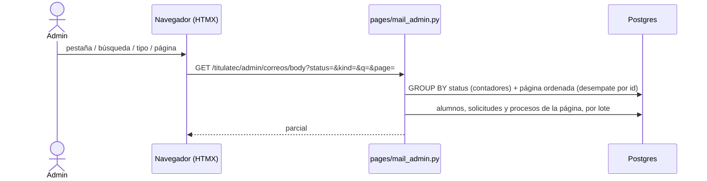

# Pestaña «Correos»: la bandeja de salida, de solo lectura (transversal)

> **Objetivo:** que el administrador vea de un vistazo qué correos esperan su turno, cuáles
> salieron, cuáles fallaron y cuáles se descartaron, sin entrar expediente por expediente.

| | |
|---|---|
| **Actor(es)** | 🛠️ rol `admin` de TitulaTec |
| **Permiso(s)** | `titulatec.email_outbox.page.list` (página y parcial; solo lo tiene `admin`) |
| **Trigger** | Menú admin → **Correos** (`/titulatec/admin/correos`) |
| **Precondiciones** | El permiso cargado (`titulatec init-outbox-admin`, abajo) |
| **Sub-flujos** | ⤵ lee lo que escriben los [correos del proceso](xcut_student_email_notifications.md) (encolar → componer → despachar) |
| **Estado final** | Ninguno: no escribe nada |

## Ruta en la app (UI)

1. Menú admin → **Correos** (icono de sobre). Solo aparece con el permiso.
2. Pestañas por estado de `titulatec_email_outbox.status`, cada una con su contador:

   | Pestaña | Estados | Orden |
   |---|---|---|
   | **Pendientes** (por omisión) | `pending` | la cola: `not_before` ascendente (lo próximo en salir, primero) |
   | **Entregados** | `sent` | alta más reciente primero |
   | **Fallidos** | `failed` (agotó `TITULATEC_EMAIL_MAX_ATTEMPTS`) | ídem |
   | **Descartados** | `no_recipient` + `obsolete` (el despachador decidió no mandarlo) | ídem |
   | **Todos** | todos | ídem |

3. Buscador en servidor (destinatario, asunto, número de control, nombre o correo del
   alumno o del solicitante, folio) y selector de **tipo** (las etiquetas de
   `StudentMail.KIND_LABELS`). Los contadores de las pestañas respetan búsqueda y tipo.
4. Cada fila: fechas (alta, «sale …» si la cola la retiene, «enviado …»), para quién
   (alumno o solicitud, número de control, folio con liga al expediente **solo si** el actor
   puede abrirlo), destinatario (vacío hasta que sale: lo decide el despachador), tipo y
   asunto, «sale agrupado» si es parte de un grupo (D7), intentos, estado (misma píldora que la
   bitácora del expediente) y el último error.
5. Paginada en servidor, 50 por página (`utils/paging`), pager con los filtros.

## Secuencia

## Pasos detallados

| # | Actor | UI / dónde | Acción | Endpoint | Service · método | Efecto en BD | Eventos / Notif |
|---|---|---|---|---|---|---|---|
| 1 | 🛠️ | Menú → Correos | Abrir | `GET /titulatec/admin/correos` | `mail_admin._body_ctx` | lectura | — |
| 2 | 🛠️ | `#tt-mail-body` | Pestaña, buscar, tipo, página | `GET /titulatec/admin/correos/body` | `mail_admin._body_ctx` | lectura | — |

## Lo que NO hace (decisión del dueño, 2026-10-06)

- **Ni reintentar, ni reenviar, ni descartar.** Solo el despachador (`mail_dispatch.py`) cambia
  el `status` de una fila; esta página no tiene ni un formulario ni un `hx-post`.
- **No pinta el `payload`** (los hechos congelados del evento).
- **No muestra los correos con secreto** (liga de activación, NIP): salen en línea y nunca pasan
  por el outbox (regla de `models/email_outbox.py`).
- **Una fila por aviso, no por correo:** un grupo que salió junto son varias filas con el mismo
  envío. La bitácora del expediente sí los junta (ruling 21).

## Despliegue

1. Código (deploy normal).
2. `python -m itcj2.cli.main titulatec init-outbox-admin` — corre SOLO
   `database/DML/titulatec/outbox_2026_10/24_insert_email_outbox_perm.sql`: crea el permiso y lo
   concede EXPLÍCITAMENTE al rol `admin` (en producción el `15_grant_admin_all_perms.sql` nunca
   se re-corre). Idempotente; verifica al final (`_verify_outbox_admin`). `--dry-run` lista sin
   escribir. El menú lo muestra en cuanto caduca la caché de permisos (`AUTHZ_CACHE_TTL`).
3. En una instalación desde cero el 24 entra con `init-titulatec` (`SEED_FILES`, antes del 15).

## Caminos alternos / errores ❗

- Sin el permiso → 403 (página y parcial) y sin ítem de menú.
- Pestaña o tipo desconocidos en la URL → se ignoran (Pendientes / todos los tipos).
- Página fuera de rango → cae en la última válida.
- Proceso fuera del alcance del actor (o sin carrera y sin `officers.api.manage`) → el folio sale
  sin liga.

## Flujos relacionados

- ⤵ [Correos del proceso al egresado](xcut_student_email_notifications.md) — quién escribe cada fila y cómo sale.
- ⤵ [Inscripción pública](xcut_public_enrollment.md) — los 4 correos de inscripción sin secreto (filas de solicitud).
- → [Expediente del alumno](xcut_admin_process_expediente.md) — la misma información, por alumno (`#exp-correos`).
