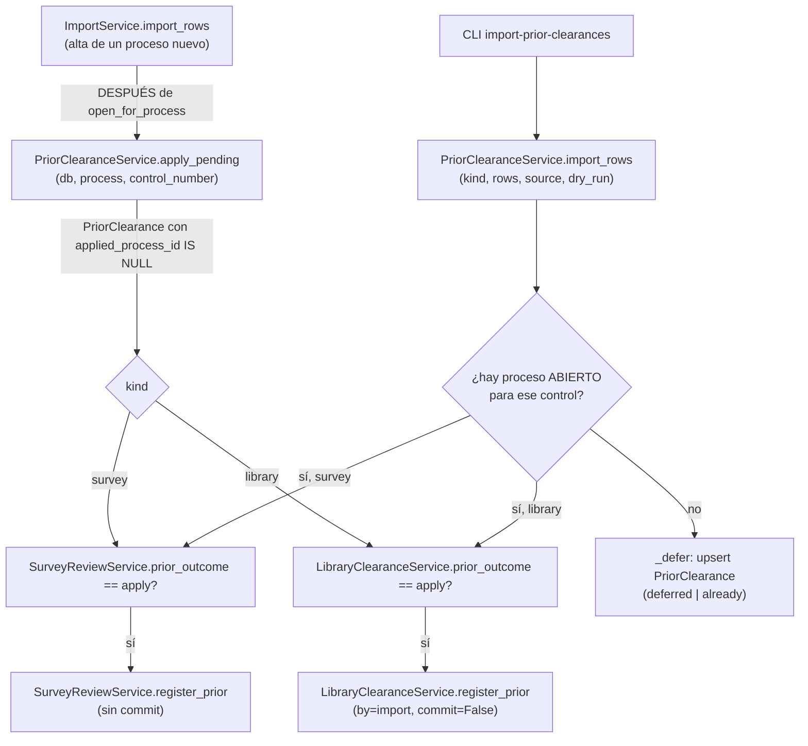

# Constancias previas: liberaciones de antes de este sistema (D9, transversal)

> **Objetivo:** un egresado que YA traía, de ANTES de esta campaña —otro semestre, en papel, en
> el sistema legado—, su liberación de encuesta o su no adeudo de biblioteca, no tiene que
> repetir el trámite. Servicios Escolares (o el desarrollador, para la base completa de
> encuestas del semestre anterior) la registra, y el sistema la aplica al proceso del egresado
> en cuanto hay uno que reclamarla — ya exista, o en cuanto se inscriba después.

| | |
|---|---|
| **Actor(es)** | 🏛️ Servicios Escolares (UI, respaldo D9) · 📚 Biblioteca (UI) · 🛠️ GTV (ve las previas en su bandeja, no las crea) · 🤖 Desarrollador vía CLI (carga masiva) |
| **Permiso(s)** | `titulatec.library_clearance.api.prior` (UI de no adeudo, Biblioteca o SE) — la de encuesta SOLO existe vía CLI (`import-prior-clearances` o, desde 2026-10-05, `import-survey-xlsx`), sin UI que la registre a mano |
| **Trigger** | 🏛️/📚 clic en «Constancia previa…» sobre un caso concreto · 🤖 `titulatec import-prior-clearances --tipo encuesta\|biblioteca ARCHIVO.csv` · 🤖 alta de un proceso nuevo (`ImportService.import_rows`) cuyo número de control tiene una previa diferida esperando |
| **Precondiciones** | `issued_on` obligatoria, no futura, vigente (`<= 365 días`, D9) |
| **Sub-flujos** | ⤵ compone [no adeudo de biblioteca](phase2_library_clearance.md) (`LibraryClearanceService.register_prior`) y [liberación GTV de la encuesta](phase2_tech_management_survey_release.md) (`SurveyReviewService.register_prior`) — este flujo NUNCA muta esas tablas directamente |
| **Estado final** | con proceso: `LibraryClearance.cleared_via='prior'` o `SurveyReview.status='approved', origin='prior'` — aplicado de inmediato. Sin proceso: `PriorClearance` diferida, a la espera |

Spec `docs/superpowers/specs/2026-10-01-titulatec-biblioteca-caja-design.md` §4.1.6, §4.12.
Servicio: `services/prior_clearance_service.py::PriorClearanceService`. **Nunca** muta
`SurveyReview.status` ni `LibraryClearance.status` directamente (§5 invariante 1): llama a cada
dueño (`SurveyReviewService.register_prior`, `LibraryClearanceService.register_prior`), y para
CLASIFICAR qué le tocaría a una fila (¿aplicaría, ya se aplicó, o es un conflicto?) llama a los
predicados de solo lectura de cada dueño —`prior_outcome`— en vez de comparar `.status` por su
cuenta; `tests/fastapi/titulatec/test_prior_clearance_service.py::
test_el_servicio_nunca_lee_status_directo` lo barre por AST.

## Dos piezas, un modelo

- **`PriorClearance`** (`titulatec_prior_clearances`, modelo en `models/prior_clearance.py`):
  la fila DIFERIDA — un número de control sin proceso todavía que la reclame. `UNIQUE(kind,
  control_number)`: una segunda carga del MISMO número actualiza fecha/nota/origen en vez de
  duplicar. `applied_process_id`/`applied_at` `NULL` hasta que se aplica; una vez aplicada **no
  se vuelve a ofrecer** (ni a otro proceso del mismo alumno después).
- **`PriorClearanceService`**: decide, por número de control, si una previa se APLICA YA (hay
  un proceso ABIERTO) o se DIFIERE (upsert de `PriorClearance`). Las transiciones reales —quién
  de verdad mueve `SurveyReview`/`LibraryClearance`— viven en los dueños.

**«Proceso ABIERTO»** (`_open_process_for_control`, §4.12): activo o en pausa (
`ADMITTED_PROCESS_STATUSES`) **y** la fase 2 sin `approved`. Cualquier otro caso —sin proceso,
con uno ya revocado/terminado, o con la fase 2 ya aprobada— se trata como «sin proceso» y la
constancia se DIFIERE; si el alumno vuelve a inscribirse (nueva convocatoria) o su proceso
avanza de otra forma, `apply_pending` la aplicará sola. Con VARIOS procesos abiertos del mismo
alumno (una convocatoria tras otra), se queda con el más reciente (`id DESC`) cuya fase 2 no
esté aprobada.

## Dos puntos de entrada



### 1. `apply_pending(db, process, control_number)` — alta de un proceso nuevo

La llama `ImportService.import_rows` **justo después** de
`LibraryClearanceService.open_for_process(..., just_created=True)`, dentro de la MISMA
transacción del lote completo (CSV, alta manual, bandeja de Solicitudes o liga de activación —
cualquier vía de alta pasa por este único punto, `services/import_service.py:636`). Aplica las
`PriorClearance` VIGENTES de ese número de control que sigan sin aplicar
(`applied_process_id IS NULL`), por cada `kind` presente. Sin commit: la transacción es del
llamador. Devuelve los `kind` que sí aplicó (`[]`, `["survey"]`, `["library"]` o los dos).

Una previa que ya no es válida AL MOMENTO de aplicarse —venció entre que se importó y que el
alumno por fin se inscribió— se **salta** (se registra en el log) en vez de tumbar el alta
completa del proceso: la validación de vigencia se vuelve a correr dentro de
`register_prior` (defensa en profundidad, igual que el resto de la app), así que
`apply_pending` nunca asume que lo que clasificó como diferible sigue siendo válido.

### 2. `import_rows(db, *, kind, rows, source, dry_run, today)` — la CLI

El motor de `titulatec import-prior-clearances`. Por fila:

1. **Número de control**: normalizado a MAYÚSCULA, validado con `CONTROL_NUMBER_RE` (el mismo
   de `ImportService`) → bote `invalid` si no calza.
2. **`issued_on`**: ver «Reglas de vigencia» abajo → `invalid`/`expired` si no pasa.
3. **Proceso ABIERTO** para ese control:
   - **sin proceso** → se DIFIERE: upsert de `PriorClearance` → bote `deferred`. Si la que había
     ya se APLICÓ a un proceso anterior (revocado o terminado): con una fecha **más nueva** (otro
     semestre) la REEMPLAZA —fecha/nota/origen, `applied_*` a `NULL`— y vuelve a quedar
     pendiente para la siguiente inscripción → `deferred` («más nueva que la que ya se aplicó
     antes…», Ruling R28); con la misma fecha o una anterior → `already` («ya registrada»), sin
     tocar nada.
   - **con proceso, `kind=survey`**: sin `SurveyReview` → `register_prior` → `applied`; ya
     `approved` → `already`; `in_review`/`rejected`, o una previa revocada por GTV en este mismo
     proceso (ver Ruling R30 #2 abajo) → **`conflicts`** (lo decide GTV desde su bandeja, NUNCA
     esta CLI) — el MOTIVO impreso distingue las dos (m39): «ya envió la encuesta de este
     semestre; lo decide GTV» (solicitud real) vs «GTV revocó su constancia previa; debe
     contestar la encuesta de egresados» (previa revocada).
   - **con proceso, `kind=library`**: `pending`/`awaiting_payment` → `register_prior` →
     `applied`; `cleared` (cualquier `cleared_via`) → `already`.

`dry_run=True` **no toca la sesión** — ni siquiera un INSERT idempotente que luego se deshaga—:
la clasificación completa corre igual (vigencia, búsqueda del proceso, consulta a
`prior_outcome`), pero ninguna rama mutadora se ejecuta. `dry_run=False` hace **un** commit al
final, cubriendo TODAS las filas del archivo.

## Reglas de vigencia

`issued_on` obligatoria, no futura y `>= hoy − 365 días` (`PRIOR_VALIDITY_DAYS`, declarada una
vez en `LibraryClearanceService` y reusada por `PriorClearanceService` para no declarar el
número dos veces): **exactamente 365 días vale, 366 no**. El mismo límite aplica a las dos
`kind`. Esta validación de aquí es solo de CLASIFICACIÓN (decide en qué bote cae la fila); la
mutación real la vuelve a validar el service dueño (`LibraryClearanceService._check_prior_date`,
`SurveyReviewService.register_prior`) — defensa en profundidad.

| Entrada | Resultado |
|---|---|
| Fecha futura | `invalid` — «la fecha de emisión no puede ser futura» |
| Exactamente hoy − 365 días | vigente, se aplica/difiere normal |
| Hoy − 366 días (o más vieja) | `expired` — «la constancia venció (más de 365 días)» |
| Ausente, sin columna ni `--fecha` | la CLI rechaza el comando entero ANTES de leer ninguna fila |
| Ausente en una fila suelta (columna por fila, esa celda vacía) | `invalid` — «fecha de emisión ausente» |

### Formatos de fecha aceptados — Ruling R13

Registrar desde la UI usa `<input type="date">` (ISO estricto, validado por el navegador). El
**CLI** (`import_rows`/`--fecha`) acepta CUATRO formatos, probados en orden, el primero que
calce COMPLETO (`strptime` exige que no sobre ni falte nada):

1. `AAAA-MM-DD` (ISO, el de siempre).
2. `AAAA-MM-DD HH:MM:SS` (ISO con hora).
3. `DD/MM/AAAA` (el que escribe a mano Servicios Escolares).
4. `DD/MM/AAAA HH:MM:SS` (la exportación de Google Forms es-MX trae «15/03/2026 10:22:33»).

Cualquier otro formato → bote `invalid` con el motivo exacto («fecha no reconocida: … (usa
AAAA-MM-DD o DD/MM/AAAA, con hora opcional)»). Decisión del controlador (Ruling R13): la base
real que recibirá el desarrollador no tiene un formato conocido de antemano, así que se acepta
el abanico razonable en vez de obligar a una sola plantilla — riesgo aceptado: un formato de más
del que estrictamente se necesitaba.

## CLI `titulatec import-prior-clearances`

```
titulatec import-prior-clearances --tipo encuesta|biblioteca ARCHIVO.csv
    [--fecha AAAA-MM-DD] [--columna-control X] [--columna-fecha Y] [--dry-run]
```

- `--tipo` (obligatorio): `encuesta` → `kind="survey"` · `biblioteca` → `kind="library"`.
- La columna del número de control se **autodetecta** (mismo heurístico que
  `ImportService.autodetect_mapping`, el de la importación de alumnos por CSV) o se fija con
  `--columna-control`.
- La fecha: `--columna-fecha` (una por fila) o `--fecha` (fija para TODAS las filas) — falta una
  de las dos → `ClickException`, sin leer ni clasificar ninguna fila. Si vienen las dos a la vez,
  la CLI rechaza el comando entero con `click.UsageError` (m16), también antes de leer ninguna
  fila — antes (nota conocida, sin cambio de código) prefería `--columna-fecha` en silencio.
- `--dry-run`: clasifica TODO —incluida la búsqueda del proceso abierto— pero no escribe nada,
  ni siquiera un alta idempotente de la fila de biblioteca.
- Imprime, por bote (`IMPORT_BUCKETS`, en este orden): **Aplicadas** · **Registradas para
  después** · **Ya liberadas** · **Conflictos** · **Vencidas** · **Inválidas** — cada una con el
  número de control y el motivo, una línea por fila.

## UI (Biblioteca / Servicios Escolares)

Biblioteca y SE tienen el MISMO botón «Constancia previa…» (fecha + nota), en rutas distintas —
ver ⤵ [no adeudo de biblioteca, paso 5](phase2_library_clearance.md#pasos-detallados): Biblioteca
va por `clearance_id` (`POST /admin/biblioteca/{clearance_id}/previa`), SE va por `process_id`
con `assert_process_in_scope` (expediente y panel de atender; en los dos, el botón solo sale con
el proceso no revocado —M2 de la revisión final—: sobre una inscripción revocada la ruta
respondería 400). **No hay UI que registre una
previa de ENCUESTA a mano** — ese `kind` solo entra por la CLI (`import_rows`); no hay botón
«Constancia previa de encuesta» en ninguna pantalla.

`register_prior` (el de biblioteca) recibe `by` ∈ `library`\|`school_services`\|`import`, que
viaja al payload del evento para distinguir quién la registró. `LibraryClearanceService.
register_prior(..., commit=False)` es el que usa `apply_pending` (dentro de la transacción del
alta); las rutas de UI siempre usan `commit=True` (su propia transacción).

### GTV ve las previas, no las crea

En la bandeja de Liberaciones, una solicitud con `origin='prior'` sale en **«Liberadas»** con la
píldora «Constancia previa», con «Ver respuestas» solo si la previa vino del Excel (2026-10-05: `response_id`
ligado; las del CSV no tienen `SurveyResponse` detrás y `response_id` es `NULL`). Se revoca con el mismo botón que una liberación real
(`SurveyReviewService.revoke`, que SIEMPRE llama a `CertificateService.void` — no-op porque
`approve` nunca emitió constancia para un `origin='prior'`), pero el resultado es otro (Ruling
R22): tras el evento `survey_review_revoked` (payload con `origin='prior'`), el `unfulfill`, el
aviso y el correo, la solicitud se **BORRA** —vuelve a `missing`— porque una previa `rejected`
dejaba al egresado sin salida (`SurveyService.submit` corta mientras exista cualquier fila). El
correo `survey_revoked` con `origin='prior'` le pide contestar la encuesta en la plataforma
(botón directo a la encuesta, más la línea D12 de contacto). La encuesta pública, si el egresado
abre el formulario con una previa VIGENTE, muestra la tarjeta de estado («quedó liberada con tu
constancia del semestre anterior») y no deja contestar; con la previa revocada vuelve a mostrar
el formulario.

## Importar la encuesta de egresados desde el Excel de Forms (2026-10-05)

Spec `docs/superpowers/specs/2026-10-05-titulatec-import-encuesta-xlsx-design.md` (los rulings
del ledger mandan sobre el texto de la spec; van abajo). Segunda puerta de entrada para las
previas de ENCUESTA —la primera es el CSV de `import-prior-clearances --tipo encuesta`— pero esta
SÍ guarda la respuesta completa del egresado, no solo la fecha.

**Despliegue.** `alembic upgrade head` (→ `tt20261005b`,
`migrations/versions/tt20261005b_titulatec_survey_import.py:52`), luego
`titulatec import-survey-xlsx ARCHIVO.xlsx --dry-run` (clasifica todo, no escribe nada) y, con las
cifras a la vista, el mismo comando sin `--dry-run`. El archivo trae datos personales: **nunca**
va al repo ni a un test (los tests fabrican libros con openpyxl,
`tests/fastapi/titulatec/_survey_xlsx.py`).

```
titulatec import-survey-xlsx ARCHIVO.xlsx [--hoja Sheet1] [--dry-run]     (itcj2/cli/titulatec.py:2792)
```

### El archivo (`SurveyImportService.read_xlsx`, `services/survey_import_service.py:265`)

- Hoja **`Sheet1`** (`DEFAULT_SHEET`, `:47`; `--hoja` la cambia). Si no existe, el error lista las
  que hay.
- Las columnas se ligan por el **TEXTO normalizado del encabezado** (`_HEADER_MAP`, `:80`; nunca
  por letra, R2). El texto de Forms trae instrucciones largas detrás, así que casi todos se
  comparan por prefijo (gana el más largo). Un encabezado desconocido, uno faltante o uno repetido
  **aborta sin escribir nada** (`ValueError` → `ClickException`).
- `Id`, `Start time`, `Completion time`, `Email`, `Name` son de Forms. `Completion time` es la
  fecha de emisión de la liberación (`issued_on`). Una fila con datos pero sin `Id` aborta; las
  filas totalmente vacías se ignoran.
- **Id en naranja = constancia en papel pendiente de recoger.** `_is_orange` (`:244`) lee el
  relleno de la celda del `Id` (hallada por encabezado): `FFFFC000` o el color de tema accent4
  (`THEME_ACCENT4`). Naranja → `paper_pending=True` (ver «Constancia por recoger»).
- La pregunta del Excel que el formulario abierto no tiene («…aspecto que valora la empresa… No
  trabajo») se guarda bajo la llave `extra_aspecto_no_trabajo` (`EXTRA_FIELDS`, `:76`; R9) y se ve
  en «Otros datos importados» de Encuestas.

### Qué hace `SurveyImportService.import_rows` (`:536`)

1. Exige el formulario `egresados` ABIERTO (`SurveyService.open_form`); si no hay, `ValueError`.
2. **Duplicados dentro del archivo** → gana la respuesta con `Completion time` más reciente
   (empate: la última del archivo); las demás van al bote «Duplicadas» y no se guardan (R3).
3. **Sin `Completion time` legible** → bote «Inválidas (no guardadas)»: sin fecha no hay constancia
   ni referencia estable.
4. **Idempotencia** (R6, ajustada por el ledger): `import_ref = "msforms:{Id}:{Completion time
   ISO}"` (NO lleva el nombre del archivo, y los `Id` de Forms reinician cada semestre, por eso la
   fecha va dentro). Se busca entre TODAS las respuestas de formularios con código `egresados` —no
   por `form_id`: abrir una v2 del formulario no debe reimportar el archivo—. Una fila cuya
   referencia ya existe va a «Ya importadas» y no se toca. Respaldo duro: el índice único
   `uq_titulatec_survey_responses_form_import_ref` (la CLI traduce la colisión a un mensaje).
5. **Guarda la respuesta** (`_write_response`, `:671`): `SurveyResponse.identity_source='import'`
   (la UI la pinta «Importada») con `submitted_at = Completion time` y un `SurveyAnswer` por
   pregunta. `user_id` en cuanto exista el `User` de ese control y `cohort_id` desde su proceso más
   reciente; `process_id` **solo** cuando la respuesta queda ligada a una liberación (evita dos
   respuestas por proceso).
6. **Normaliza sin rechazar** (D1): lo que no encaja con las opciones/formato del schema se guarda
   con su texto original y `SurveyAnswer.is_raw=True` (la UI lo marca). Canonicaliza sinónimos
   («Mucho 5», «Aprobé»/«Aprobó») y descarta los centinelas («No trabajo», «No estudio»,
   «Desempleado (a)», «Ninguno») de campos que no aplican por `visible_when`, en vez de dejarlos
   como raw. `survey_validator` NO se usa en este camino.
7. **Libera SIEMPRE por la maquinaria de constancias previas**: arma filas
   `{control_number, issued_on, response_id, paper_pending}` y llama a
   `PriorClearanceService.import_rows(kind="survey", commit=False)`
   (`services/prior_clearance_service.py:258`) — no reimplementa la clasificación. Cada bote de
   allá se traduce a uno de acá (`_PRIOR_TO_BUCKET`, `:60`).
8. UN commit al final; `--dry-run` no escribe nada (ni la respuesta).

### Botes que imprime la CLI (`IMPORT_BUCKETS`, `:56`; etiquetas en `itcj2/cli/titulatec.py`, `_IMPORT_SURVEY_ETIQUETAS`)

| Bote | Qué pasó |
|---|---|
| Guardadas y liberadas | tenía proceso abierto: respuesta guardada, `SurveyReview` aprobada `origin='prior'` con `response_id`, respuesta ligada a su proceso |
| Guardadas, liberación diferida | sin proceso abierto: `PriorClearance` con `response_id`/`paper_pending`; se aplica en `apply_pending` al inscribirse |
| Guardadas (ya liberadas) | ya tenía liberación: si venía de una previa SIN respuesta (p. ej. el CSV) se le **adjunta** la respuesta y el papel (abajo) |
| Guardadas (conflicto) | ya envió la encuesta aquí o GTV revocó su previa: la respuesta se guarda, la liberación la decide GTV |
| Guardadas sin liberar | control inválido/vacío o constancia vencida (> 365 días): solo la respuesta |
| Duplicadas (no guardadas) | mismo control repetido en el archivo; se importa la más reciente |
| Ya importadas | re-correr el archivo no duplica nada |
| Inválidas (no guardadas) | `Completion time` vacío o ilegible |

### Respuesta y papel ligados a la liberación

- Columnas nuevas (migración `tt20261005b`): `SurveyResponse.import_ref`, `SurveyAnswer.is_raw`,
  `PriorClearance.response_id`/`paper_pending` (`models/prior_clearance.py:64`) y
  `SurveyReview.paper_pending`/`paper_delivered_at`/`paper_delivered_by_id`
  (`models/survey_review.py:84-86`). `PriorClearance.response_id` es `ON DELETE SET NULL`.
- **`SurveyReview.response_id` queda SIN `ondelete` a propósito**: es una guarda — ningún flujo
  borra respuestas, y si alguno lo intentara sobre una liberación ligada, la BD lo impide en vez
  de dejar a la liberación sin su respuesta.
- `SurveyReviewService.register_prior(..., response_id=, paper_pending=)`
  (`services/survey_review_service.py:351`) los escribe y los lleva en el payload de
  `survey_review_prior`. `_apply_survey` (`prior_clearance_service.py:218`) los pasa desde la fila
  diferida y, con respuesta, llama a `SurveyImportService.link_response_to_process`
  (`survey_import_service.py:515`: llena `user_id`/`process_id`/`cohort_id`, solo en filas
  `identity_source='import'`).
- **Diferida que lleva respuesta y papel** (R7): `_defer(..., link=(response_id, paper_pending))`
  (`prior_clearance_service.py:491`) los escribe en una fila nueva o reemplazada; en una pendiente
  que se actualiza, `link=None` deja intacta la liga que ya tenía.
- **«Already» con liberación previa sin respuesta**: `PriorClearanceService.attach_imported_response`
  (`:449`) → `SurveyReviewService.attach_imported_response` (`survey_review_service.py:649`):
  adjunta la respuesta y ENCIENDE `paper_pending` (nunca lo apaga ni pisa una respuesta ya
  ligada). También cubre la previa todavía diferida (`:484`).
- `paper_pending` se interpreta con `is True`, no con `bool()`.

### Cambio de `_defer` (afecta TAMBIÉN al CSV de `import-prior-clearances`)

Al actualizar una previa diferida **pendiente** (`prior_clearance_service.py:491`) se conserva la
fecha de emisión MÁS NUEVA (una carga posterior con fecha vieja ya no la acorta) y una nota vacía
ya no borra la que había (el Excel no trae nota; la del CSV se conserva). `source` sí se
actualiza. Consecuencia conocida: re-correr un CSV viejo ya no puede bajar `issued_on` ni limpiar
la nota.

### Constancia por recoger (D3)

Una previa con `paper_pending` y sin `paper_delivered_at` está «por recoger»
(`SurveyReviewService.paper_to_collect`, `survey_review_service.py:296`). El alumno ve «Recoge tu
constancia de liberación en Gestión Tecnológica y Vinculación.» y GTV la cierra con «Marcar
constancia entregada» — ⤵ [liberación GTV](phase2_tech_management_survey_release.md#respuestas-importadas-y-constancia-por-recoger-2026-10-05).
Tras la entrega `paper_pending` se conserva como hecho histórico.

### Rollback

`alembic downgrade tt20261005a` desde la imagen NUEVA, **antes** de `rollback.sh` (la imagen vieja
no conoce `tt20261005b`). Las respuestas ya importadas sobreviven como filas con
`identity_source='import'`; lo que se pierde son las columnas nuevas (`import_ref`, `is_raw`,
`paper_*`, `response_id` de las previas).

### Pruebas

`test_survey_import_service.py`, `test_survey_import_model.py`, `test_cli_import_survey_xlsx.py`
y `test_survey_import_ui.py`, con libros sintéticos de `_survey_xlsx.py`.


## Pasos detallados

| # | Actor | UI / dónde | Acción | Endpoint / comando | Service · método | Efecto en BD | Eventos |
|---|---|---|---|---|---|---|---|
| 1 | 🤖 | CLI | carga masiva (base del semestre anterior) | `titulatec import-prior-clearances --tipo encuesta ARCHIVO.csv` | `PriorClearanceService.import_rows(kind="survey")` | `PriorClearance` upsert (diferida) o `SurveyReview` INSERT `approved`/`origin=prior` (aplicada) | `survey_review_prior` (vía `SurveyReviewService.register_prior`) |
| 1c| 🤖 | CLI | carga masiva con respuesta completa (Excel de Forms) | `titulatec import-survey-xlsx ARCHIVO.xlsx` | `SurveyImportService.import_rows` → `PriorClearanceService.import_rows(kind="survey")` | `SurveyResponse` (`identity_source='import'`) + `SurveyAnswer`; `PriorClearance` con `response_id`/`paper_pending`, o `SurveyReview` `approved`/`origin=prior` ligada a la respuesta | `survey_review_prior` (con `response_id` y `paper_pending`) |
| 1b| 🤖 | CLI | carga masiva (no adeudo ya pagado) | `titulatec import-prior-clearances --tipo biblioteca ARCHIVO.csv` | `import_rows(kind="library")` | `PriorClearance` upsert, o `LibraryClearance` → `cleared/prior` | `library_prior_registered` |
| 2 | 📚 | Biblioteca, fila | registrar UNA previa de no adeudo | `POST /admin/biblioteca/{clearance_id}/previa` | `LibraryClearanceService.register_prior(by="library")` | `pending\|awaiting_payment → cleared/prior` | `library_prior_registered` |
| 3 | 🏛️ | Expediente / panel de atender | respaldo: registrar previa de no adeudo | `POST /admin/processes/{pid}/no-adeudo-previo` · `POST /admin/appointments/{pid}/no-adeudo-previo` | `register_prior(by="school_services")` | ídem | ídem |
| 4 | 🤖 | — | alta de proceso nuevo con previa(s) diferida(s) esperando | `ImportService.import_rows` → `apply_pending` | `register_prior(by="import")` por cada `kind` pendiente | aplica de inmediato, en la MISMA transacción del alta | según `kind` |

## Estado resultante

- **Diferida** (`PriorClearance`): `applied_process_id IS NULL`; espera a `apply_pending` en el
  siguiente alta de proceso con ese número de control.
- **Aplicada**: `applied_process_id`/`applied_at` fijos; `SurveyReview.status='approved',
  origin='prior'` (`response_id=NULL` salvo que venga del Excel) y/o `LibraryClearance.status='cleared', cleared_via='prior'`.
  **Nunca** se vuelve a ofrecer, ni a otro proceso del mismo alumno después.
- Encuesta: constancia `survey_release` **NO** se emite (`SurveyReviewService.approve` la salta
  cuando `origin='prior'`). No adeudo: constancia `library_clearance` tampoco (`register_prior`
  nunca llama a `CertificateService.issue`) — el egresado ya trae su papel físico; por eso el
  correo de liberación (`library_cleared`/`survey_approved`) le pide llevarlo a su cotejo.

## Caminos alternos / errores ❗

- **Fecha futura o vencida** → `invalid`/`expired` en el bote correspondiente (UI: `ValueError`
  → `400` + `X-Tt-Error`; CLI: fila reportada, el resto del archivo sigue).
- **Número de control inválido** (no calza `CONTROL_NUMBER_RE`) → `invalid`.
- **Encuesta con solicitud `in_review`/`rejected`** → `conflicts`: lo decide GTV, la CLI nunca
  pisa una revisión humana en curso.
- **Previa que vence entre que se difiere y que se aplica** (`apply_pending`) → se SALTA (log),
  el alta del proceso sigue sin tumbarse.
- **Carga repetida del mismo `(kind, control_number)`** (aún diferida) → `UNIQUE` la actualiza
  (fecha/nota/origen), no la duplica.
- **Carga repetida de una YA aplicada** → con la misma fecha o una anterior, `already` («ya
  registrada»), sin tocar nada; con una fecha MÁS NUEVA, reemplaza y queda pendiente para la
  siguiente inscripción (`deferred`, Ruling R28).
- **GTV revoca una previa de encuesta y luego se vuelve a importar el MISMO archivo** (Ruling
  R30 #2, re-revisión de la ola final) → **ya NO se re-aplica sola**: el evento
  `survey_review_revoked` (`origin='prior'`) sobrevive al DELETE de la fila, y mientras exista
  `prior_outcome` devuelve `conflict` (bote `conflicts`) en vez de `apply`, pase lo que pase en el
  archivo -ni siquiera corrigiendo el dato de origen se vuelve a importar sola-. Es permanente
  para ese proceso: la única salida es que el egresado conteste la encuesta REAL (el formulario
  vuelve a estar disponible, §4.12 arriba) y GTV la revise por la vía normal
  (`approve`/`reject`), no por esta CLI. El motivo que imprime la CLI en este caso es «GTV revocó
  su constancia previa; debe contestar la encuesta de egresados» (m39,
  `SurveyReviewService.prior_conflict_reason`) — distinto del «ya envió la encuesta de este
  semestre; lo decide GTV» de una solicitud real `in_review`/`rejected`.
- **`--fecha` y `--columna-fecha` juntas** → `click.UsageError`: el comando se rechaza antes de
  leer ninguna fila (m16; antes ganaba `--columna-fecha` en silencio, sin avisar).
- **Falta `--fecha` y no hay `--columna-fecha`** → la CLI rechaza el comando completo antes de
  leer una sola fila.

## Pruebas

`test_prior_clearance_service.py` (clasificación, `apply_pending` -incluido el branch silencioso
`already` que no marca la previa, m14-, la más nueva que reemplaza a la aplicada, barrido AST de
`.status` directo, `PRIOR_KINDS` sin copia propia -m15-, fechas relativas no-bomba-de-tiempo —
Ruling R14; reimportar tras revocar una previa cae en `conflicts` y no se re-aplica — Ruling R30
#2; un control repetido en el mismo archivo no sobrecuenta `applied` en dry-run — m13),
`test_survey_review_service.py`/`test_survey_review_submit.py` (revocar una previa la borra y
el egresado vuelve a contestar; `TestPriorOutcome` cubre `prior_outcome` directo, incluida la
marca que deja la revocación; `TestPriorConflictReason` cubre el submotivo fino -m39-),
`test_cli_prior_clearances.py` (CLI: dry-run, autodetección de columna, los 4 formatos de fecha,
botes, `--fecha`+`--columna-fecha` juntas rechaza con `UsageError` -m16-).

## Flujos relacionados

- ⤵ [No adeudo de biblioteca: Biblioteca → Caja](phase2_library_clearance.md) — dueño real de
  `LibraryClearance`, paso 5.
- ⤵ [Liberación GTV de la encuesta de egresados](phase2_tech_management_survey_release.md) —
  dueño real de `SurveyReview`, incluida la vista «Liberadas» con `origin='prior'`.
- ⤵ [Constancias por lote](xcut_certificates_batch.md) — por qué una previa NUNCA emite una
  constancia nueva.
- Glosario: [`PriorClearance`, `PriorClearanceService`](_glossary.md).
