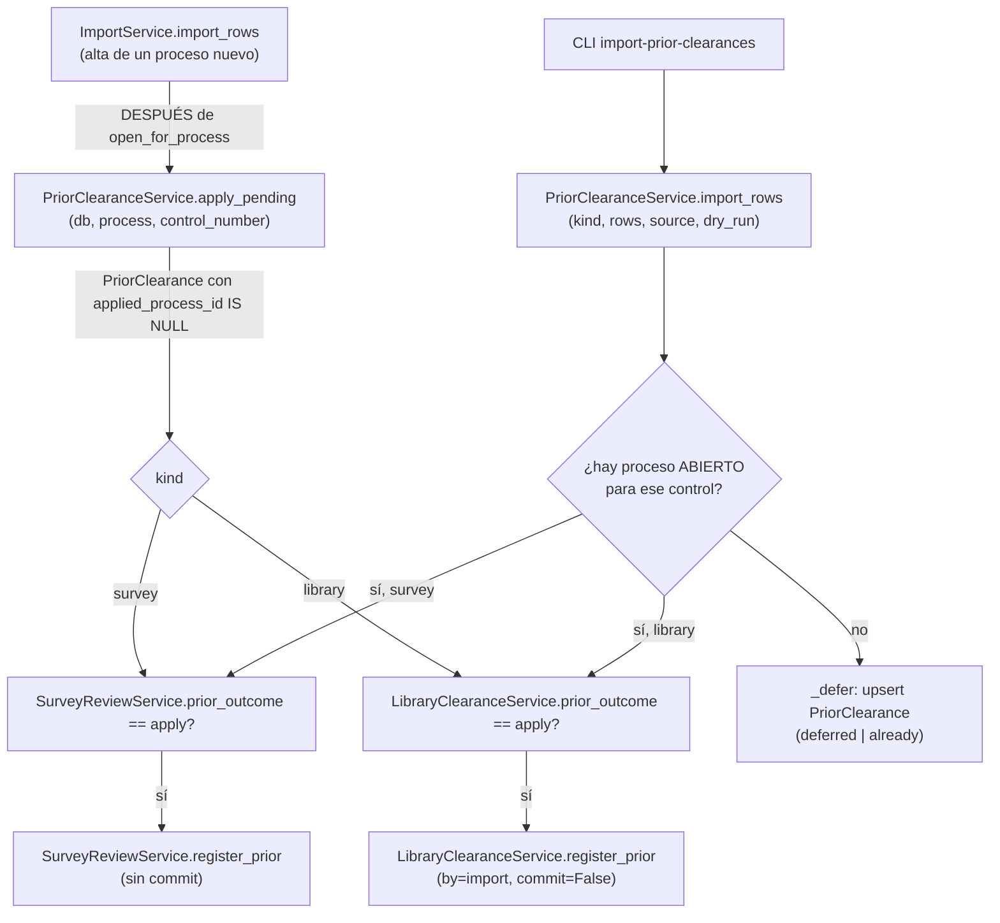

# Constancias previas: liberaciones de antes de este sistema (D9, transversal)

> **Objetivo:** un egresado que YA traía, de ANTES de esta campaña —otro semestre, en papel, en
> el sistema legado—, su liberación de encuesta o su no adeudo de biblioteca, no tiene que
> repetir el trámite. Servicios Escolares (o el desarrollador, para la base completa de
> encuestas del semestre anterior) la registra, y el sistema la aplica al proceso del egresado
> en cuanto hay uno que reclamarla — ya exista, o en cuanto se inscriba después.

| | |
|---|---|
| **Actor(es)** | 🏛️ Servicios Escolares (UI, respaldo D9) · 📚 Biblioteca (UI) · 🛠️ GTV (ve las previas en su bandeja, no las crea) · 🤖 Desarrollador vía CLI (carga masiva) |
| **Permiso(s)** | `titulatec.library_clearance.api.prior` (UI de no adeudo, Biblioteca o SE) — la de encuesta SOLO existe vía CLI, sin UI que la registre a mano |
| **Trigger** | 🏛️/📚 clic en «Constancia previa…» sobre un caso concreto · 🤖 `titulatec import-prior-clearances --tipo encuesta\|biblioteca ARCHIVO.csv` · 🤖 alta de un proceso nuevo (`ImportService.import_rows`) cuyo número de control tiene una previa diferida esperando |
| **Precondiciones** | `issued_on` obligatoria, no futura, vigente (`<= 365 días`, D9) |
| **Sub-flujos** | ⤵ compone [no adeudo de biblioteca](phase2_library_clearance.md) (`LibraryClearanceService.register_prior`) y [liberación GTV de la encuesta](phase2_tech_management_survey_release.md) (`SurveyReviewService.register_prior`) — este flujo NUNCA muta esas tablas directamente |
| **Estado final** | con proceso: `LibraryClearance.cleared_via='prior'` o `SurveyReview.status='approved', origin='prior'` — aplicado de inmediato. Sin proceso: `PriorClearance` diferida, a la espera |

Spec `docs/superpowers/specs/2026-10-01-titulatec-biblioteca-caja-design.md` §4.1.6, §4.12.
Servicio: `services/prior_clearance_service.py::PriorClearanceService`. **Nunca** muta
`SurveyReview.status` ni `LibraryClearance.status` directamente (§5 invariante 1): llama a cada
dueño (`SurveyReviewService.register_prior`, `LibraryClearanceService.register_prior`), y para
CLASIFICAR qué le tocaría a una fila (¿aplicaría, ya se aplicó, o es un conflicto?) llama a los
predicados de solo lectura de cada dueño —`prior_outcome`— en vez de comparar `.status` por su
cuenta; `tests/fastapi/titulatec/test_prior_clearance_service.py::
test_el_servicio_nunca_lee_status_directo` lo barre por AST.

## Dos piezas, un modelo

- **`PriorClearance`** (`titulatec_prior_clearances`, modelo en `models/prior_clearance.py`):
  la fila DIFERIDA — un número de control sin proceso todavía que la reclame. `UNIQUE(kind,
  control_number)`: una segunda carga del MISMO número actualiza fecha/nota/origen en vez de
  duplicar. `applied_process_id`/`applied_at` `NULL` hasta que se aplica; una vez aplicada **no
  se vuelve a ofrecer** (ni a otro proceso del mismo alumno después).
- **`PriorClearanceService`**: decide, por número de control, si una previa se APLICA YA (hay
  un proceso ABIERTO) o se DIFIERE (upsert de `PriorClearance`). Las transiciones reales —quién
  de verdad mueve `SurveyReview`/`LibraryClearance`— viven en los dueños.

**«Proceso ABIERTO»** (`_open_process_for_control`, §4.12): activo o en pausa (
`ADMITTED_PROCESS_STATUSES`) **y** la fase 2 sin `approved`. Cualquier otro caso —sin proceso,
con uno ya revocado/terminado, o con la fase 2 ya aprobada— se trata como «sin proceso» y la
constancia se DIFIERE; si el alumno vuelve a inscribirse (nueva convocatoria) o su proceso
avanza de otra forma, `apply_pending` la aplicará sola. Con VARIOS procesos abiertos del mismo
alumno (una convocatoria tras otra), se queda con el más reciente (`id DESC`) cuya fase 2 no
esté aprobada.

## Dos puntos de entrada



### 1. `apply_pending(db, process, control_number)` — alta de un proceso nuevo

La llama `ImportService.import_rows` **justo después** de
`LibraryClearanceService.open_for_process(..., just_created=True)`, dentro de la MISMA
transacción del lote completo (CSV, alta manual, bandeja de Solicitudes o liga de activación —
cualquier vía de alta pasa por este único punto, `services/import_service.py:636`). Aplica las
`PriorClearance` VIGENTES de ese número de control que sigan sin aplicar
(`applied_process_id IS NULL`), por cada `kind` presente. Sin commit: la transacción es del
llamador. Devuelve los `kind` que sí aplicó (`[]`, `["survey"]`, `["library"]` o los dos).

Una previa que ya no es válida AL MOMENTO de aplicarse —venció entre que se importó y que el
alumno por fin se inscribió— se **salta** (se registra en el log) en vez de tumbar el alta
completa del proceso: la validación de vigencia se vuelve a correr dentro de
`register_prior` (defensa en profundidad, igual que el resto de la app), así que
`apply_pending` nunca asume que lo que clasificó como diferible sigue siendo válido.

### 2. `import_rows(db, *, kind, rows, source, dry_run, today)` — la CLI

El motor de `titulatec import-prior-clearances`. Por fila:

1. **Número de control**: normalizado a MAYÚSCULA, validado con `CONTROL_NUMBER_RE` (el mismo
   de `ImportService`) → bote `invalid` si no calza.
2. **`issued_on`**: ver «Reglas de vigencia» abajo → `invalid`/`expired` si no pasa.
3. **Proceso ABIERTO** para ese control:
   - **sin proceso** → se DIFIERE: upsert de `PriorClearance` → bote `deferred`. Si la que había
     ya se APLICÓ a un proceso anterior (revocado o terminado): con una fecha **más nueva** (otro
     semestre) la REEMPLAZA —fecha/nota/origen, `applied_*` a `NULL`— y vuelve a quedar
     pendiente para la siguiente inscripción → `deferred` («más nueva que la que ya se aplicó
     antes…», Ruling R28); con la misma fecha o una anterior → `already` («ya registrada»), sin
     tocar nada.
   - **con proceso, `kind=survey`**: sin `SurveyReview` → `register_prior` → `applied`; ya
     `approved` → `already`; `in_review`/`rejected` → **`conflicts`** (lo decide GTV desde su
     bandeja, NUNCA esta CLI — el egresado ya envió la encuesta de ESTE semestre y hay un humano
     revisándola).
   - **con proceso, `kind=library`**: `pending`/`awaiting_payment` → `register_prior` →
     `applied`; `cleared` (cualquier `cleared_via`) → `already`.

`dry_run=True` **no toca la sesión** — ni siquiera un INSERT idempotente que luego se deshaga—:
la clasificación completa corre igual (vigencia, búsqueda del proceso, consulta a
`prior_outcome`), pero ninguna rama mutadora se ejecuta. `dry_run=False` hace **un** commit al
final, cubriendo TODAS las filas del archivo.

## Reglas de vigencia

`issued_on` obligatoria, no futura y `>= hoy − 365 días` (`PRIOR_VALIDITY_DAYS`, declarada una
vez en `LibraryClearanceService` y reusada por `PriorClearanceService` para no declarar el
número dos veces): **exactamente 365 días vale, 366 no**. El mismo límite aplica a las dos
`kind`. Esta validación de aquí es solo de CLASIFICACIÓN (decide en qué bote cae la fila); la
mutación real la vuelve a validar el service dueño (`LibraryClearanceService._check_prior_date`,
`SurveyReviewService.register_prior`) — defensa en profundidad.

| Entrada | Resultado |
|---|---|
| Fecha futura | `invalid` — «la fecha de emisión no puede ser futura» |
| Exactamente hoy − 365 días | vigente, se aplica/difiere normal |
| Hoy − 366 días (o más vieja) | `expired` — «la constancia venció (más de 365 días)» |
| Ausente, sin columna ni `--fecha` | la CLI rechaza el comando entero ANTES de leer ninguna fila |
| Ausente en una fila suelta (columna por fila, esa celda vacía) | `invalid` — «fecha de emisión ausente» |

### Formatos de fecha aceptados — Ruling R13

Registrar desde la UI usa `<input type="date">` (ISO estricto, validado por el navegador). El
**CLI** (`import_rows`/`--fecha`) acepta CUATRO formatos, probados en orden, el primero que
calce COMPLETO (`strptime` exige que no sobre ni falte nada):

1. `AAAA-MM-DD` (ISO, el de siempre).
2. `AAAA-MM-DD HH:MM:SS` (ISO con hora).
3. `DD/MM/AAAA` (el que escribe a mano Servicios Escolares).
4. `DD/MM/AAAA HH:MM:SS` (la exportación de Google Forms es-MX trae «15/03/2026 10:22:33»).

Cualquier otro formato → bote `invalid` con el motivo exacto («fecha no reconocida: … (usa
AAAA-MM-DD o DD/MM/AAAA, con hora opcional)»). Decisión del controlador (Ruling R13): la base
real que recibirá el desarrollador no tiene un formato conocido de antemano, así que se acepta
el abanico razonable en vez de obligar a una sola plantilla — riesgo aceptado: un formato de más
del que estrictamente se necesitaba.

## CLI `titulatec import-prior-clearances`

```
titulatec import-prior-clearances --tipo encuesta|biblioteca ARCHIVO.csv
    [--fecha AAAA-MM-DD] [--columna-control X] [--columna-fecha Y] [--dry-run]
```

- `--tipo` (obligatorio): `encuesta` → `kind="survey"` · `biblioteca` → `kind="library"`.
- La columna del número de control se **autodetecta** (mismo heurístico que
  `ImportService.autodetect_mapping`, el de la importación de alumnos por CSV) o se fija con
  `--columna-control`.
- La fecha: `--columna-fecha` (una por fila) o `--fecha` (fija para TODAS las filas) — falta una
  de las dos → `ClickException`, sin leer ni clasificar ninguna fila. Si vienen las dos a la vez,
  la CLI prefiere `--columna-fecha` **en silencio** (nota conocida, sin cambio de código).
- `--dry-run`: clasifica TODO —incluida la búsqueda del proceso abierto— pero no escribe nada,
  ni siquiera un alta idempotente de la fila de biblioteca.
- Imprime, por bote (`IMPORT_BUCKETS`, en este orden): **Aplicadas** · **Registradas para
  después** · **Ya liberadas** · **Conflictos** · **Vencidas** · **Inválidas** — cada una con el
  número de control y el motivo, una línea por fila.

## UI (Biblioteca / Servicios Escolares)

Biblioteca y SE tienen el MISMO botón «Constancia previa…» (fecha + nota), en rutas distintas —
ver ⤵ [no adeudo de biblioteca, paso 5](phase2_library_clearance.md#pasos-detallados): Biblioteca
va por `clearance_id` (`POST /admin/biblioteca/{clearance_id}/previa`), SE va por `process_id`
con `assert_process_in_scope` (expediente y panel de atender). **No hay UI que registre una
previa de ENCUESTA a mano** — ese `kind` solo entra por la CLI (`import_rows`); no hay botón
«Constancia previa de encuesta» en ninguna pantalla.

`register_prior` (el de biblioteca) recibe `by` ∈ `library`\|`school_services`\|`import`, que
viaja al payload del evento para distinguir quién la registró. `LibraryClearanceService.
register_prior(..., commit=False)` es el que usa `apply_pending` (dentro de la transacción del
alta); las rutas de UI siempre usan `commit=True` (su propia transacción).

### GTV ve las previas, no las crea

En la bandeja de Liberaciones, una solicitud con `origin='prior'` sale en **«Liberadas»** con la
píldora «Constancia previa», **sin** el enlace «Ver respuestas» (no hay `SurveyResponse`
detrás: `response_id` es `NULL`). Se revoca con el mismo botón que una liberación real
(`SurveyReviewService.revoke`, que SIEMPRE llama a `CertificateService.void` — no-op porque
`approve` nunca emitió constancia para un `origin='prior'`), pero el resultado es otro (Ruling
R22): tras el evento `survey_review_revoked` (payload con `origin='prior'`), el `unfulfill`, el
aviso y el correo, la solicitud se **BORRA** —vuelve a `missing`— porque una previa `rejected`
dejaba al egresado sin salida (`SurveyService.submit` corta mientras exista cualquier fila). El
correo `survey_revoked` con `origin='prior'` le pide contestar la encuesta en la plataforma
(botón directo a la encuesta, más la línea D12 de contacto). La encuesta pública, si el egresado
abre el formulario con una previa VIGENTE, muestra la tarjeta de estado («quedó liberada con tu
constancia del semestre anterior») y no deja contestar; con la previa revocada vuelve a mostrar
el formulario.

## Pasos detallados

| # | Actor | UI / dónde | Acción | Endpoint / comando | Service · método | Efecto en BD | Eventos |
|---|---|---|---|---|---|---|---|
| 1 | 🤖 | CLI | carga masiva (base del semestre anterior) | `titulatec import-prior-clearances --tipo encuesta ARCHIVO.csv` | `PriorClearanceService.import_rows(kind="survey")` | `PriorClearance` upsert (diferida) o `SurveyReview` INSERT `approved`/`origin=prior` (aplicada) | `survey_review_prior` (vía `SurveyReviewService.register_prior`) |
| 1b| 🤖 | CLI | carga masiva (no adeudo ya pagado) | `titulatec import-prior-clearances --tipo biblioteca ARCHIVO.csv` | `import_rows(kind="library")` | `PriorClearance` upsert, o `LibraryClearance` → `cleared/prior` | `library_prior_registered` |
| 2 | 📚 | Biblioteca, fila | registrar UNA previa de no adeudo | `POST /admin/biblioteca/{clearance_id}/previa` | `LibraryClearanceService.register_prior(by="library")` | `pending\|awaiting_payment → cleared/prior` | `library_prior_registered` |
| 3 | 🏛️ | Expediente / panel de atender | respaldo: registrar previa de no adeudo | `POST /admin/processes/{pid}/no-adeudo-previo` · `POST /admin/appointments/{pid}/no-adeudo-previo` | `register_prior(by="school_services")` | ídem | ídem |
| 4 | 🤖 | — | alta de proceso nuevo con previa(s) diferida(s) esperando | `ImportService.import_rows` → `apply_pending` | `register_prior(by="import")` por cada `kind` pendiente | aplica de inmediato, en la MISMA transacción del alta | según `kind` |

## Estado resultante

- **Diferida** (`PriorClearance`): `applied_process_id IS NULL`; espera a `apply_pending` en el
  siguiente alta de proceso con ese número de control.
- **Aplicada**: `applied_process_id`/`applied_at` fijos; `SurveyReview.status='approved',
  origin='prior', response_id=NULL` y/o `LibraryClearance.status='cleared', cleared_via='prior'`.
  **Nunca** se vuelve a ofrecer, ni a otro proceso del mismo alumno después.
- Encuesta: constancia `survey_release` **NO** se emite (`SurveyReviewService.approve` la salta
  cuando `origin='prior'`). No adeudo: constancia `library_clearance` tampoco (`register_prior`
  nunca llama a `CertificateService.issue`) — el egresado ya trae su papel físico; por eso el
  correo de liberación (`library_cleared`/`survey_approved`) le pide llevarlo a su cotejo.

## Caminos alternos / errores ❗

- **Fecha futura o vencida** → `invalid`/`expired` en el bote correspondiente (UI: `ValueError`
  → `400` + `X-Tt-Error`; CLI: fila reportada, el resto del archivo sigue).
- **Número de control inválido** (no calza `CONTROL_NUMBER_RE`) → `invalid`.
- **Encuesta con solicitud `in_review`/`rejected`** → `conflicts`: lo decide GTV, la CLI nunca
  pisa una revisión humana en curso.
- **Previa que vence entre que se difiere y que se aplica** (`apply_pending`) → se SALTA (log),
  el alta del proceso sigue sin tumbarse.
- **Carga repetida del mismo `(kind, control_number)`** (aún diferida) → `UNIQUE` la actualiza
  (fecha/nota/origen), no la duplica.
- **Carga repetida de una YA aplicada** → con la misma fecha o una anterior, `already` («ya
  registrada»), sin tocar nada; con una fecha MÁS NUEVA, reemplaza y queda pendiente para la
  siguiente inscripción (`deferred`, Ruling R28).
- **GTV revoca una previa de encuesta y luego se vuelve a importar el MISMO archivo** con el
  proceso aún abierto → la fila se aplica otra vez (`prior_outcome` ve `missing`): la revocación
  no deja marca que la importación lea. Si GTV revocó por un error de la base, corregir el
  archivo antes de reimportar.
- **`--fecha` y `--columna-fecha` juntas** → gana `--columna-fecha` en silencio (nota conocida).
- **Falta `--fecha` y no hay `--columna-fecha`** → la CLI rechaza el comando completo antes de
  leer una sola fila.

## Pruebas

`test_prior_clearance_service.py` (clasificación, `apply_pending`, la más nueva que reemplaza
a la aplicada, barrido AST de `.status` directo, fechas relativas no-bomba-de-tiempo — Ruling
R14), `test_survey_review_service.py`/`test_survey_review_submit.py` (revocar una previa la
borra y el egresado vuelve a contestar), `test_cli_prior_clearances.py`
(CLI: dry-run, autodetección de columna, los 4 formatos de fecha, botes).

## Flujos relacionados

- ⤵ [No adeudo de biblioteca: Biblioteca → Caja](phase2_library_clearance.md) — dueño real de
  `LibraryClearance`, paso 5.
- ⤵ [Liberación GTV de la encuesta de egresados](phase2_tech_management_survey_release.md) —
  dueño real de `SurveyReview`, incluida la vista «Liberadas» con `origin='prior'`.
- ⤵ [Constancias por lote](xcut_certificates_batch.md) — por qué una previa NUNCA emite una
  constancia nueva.
- Glosario: [`PriorClearance`, `PriorClearanceService`](_glossary.md).
