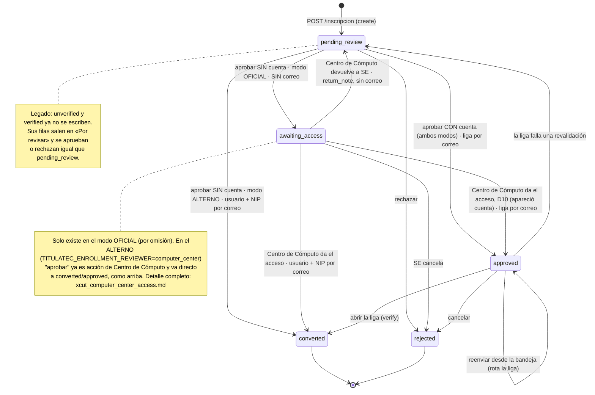
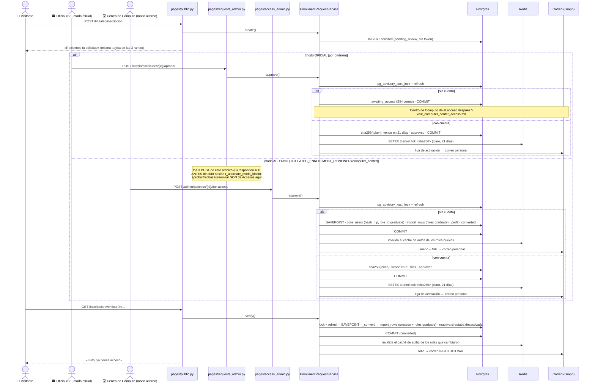

# Inscripción pública con revisión previa (transversal)

> **Objetivo:** que un egresado pida inscribirse a la convocatoria abierta desde un formulario
> público y que el acceso le llegue **solo por correo**, después de que Servicios Escolares revise
> la solicitud. Nadie queda inscrito por llenar un formulario.

| | |
|---|---|
| **Actor(es)** | 👤 Visitante anónimo (formulario y liga) · 🏛️ Servicios Escolares (bandeja: jefatura con alcance total + operativo/encargados por carrera) · 💻 Centro de Cómputo (desde 2026-09-24, modo oficial: da el NIP a las solicitudes sin cuenta — ver [Accesos de Centro de Cómputo](xcut_computer_center_access.md)) · 🤖 correo y conversión |
| **Permiso(s)** | Formulario, liga y reenvío público: **ninguno**. Son las rutas públicas de `pages/public.py`, sin `require_page_app` (una ruta es pública por omitir la dependencia). Bandeja (`pages/requests_admin.py`), **un código por ruta**: `titulatec.enrollment_request.page.list` (ver) · `titulatec.enrollment_request.api.approve` (aprobar y reenviar) · `titulatec.enrollment_request.api.reject` (rechazar). Los tres se conceden a `titulatec_school_services_head` (jefatura) Y, desde 2026-09-21, también a `titulatec_school_services` (operativo: secretaria, auxiliar y los `se_officer_*` de los encargados) — `survey_2026_09/10_insert_survey_role_permissions.sql`. |
| **Rol que recibe el alumno** | `graduate` (egresado) en las apps `itcj` y `titulatec`, siempre vía `ImportService.import_rows`. Ver [Rol `graduate`](#rol-graduate-egresado). |
| **Trigger** | El visitante envía el formulario de `/titulatec/inscripcion`. |
| **Precondiciones** | Exactamente **una** convocatoria abierta según `CohortService.is_public_enrollment_open` (`status='open'` y hoy dentro de `[opens_at, closes_at]`). Cero: tarjeta de cierre. Más de una: 503, falla cerrado. En la bandeja, las filas pasan por el [alcance por carrera](engine_officer_scope.md). **D5 (2026-09-24):** ese rango `[opens_at, closes_at]` filtra SOLO el envío del formulario. Todo lo que sigue a una solicitud ya enviada — aprobar, dar acceso/NIP, abrir la liga, reenviarla (bandeja y pública) — exige únicamente `cohort.status == 'open'` (`CohortService.accepts_enrollment_followup`): pasar `closes_at` no deja varado a nadie que entró a tiempo; solo una convocatoria puesta en `closed` a mano pausa esos pasos. |
| **Sub-flujos** | ⤵ [alcance por carrera](engine_officer_scope.md) · ⤵ `ImportService.import_rows`, el mismo alta que el [CSV](phase0_school_services_import_csv.md) y el [alta manual](phase0_school_services_add_student_manual.md) · ⤵ [Accesos de Centro de Cómputo](xcut_computer_center_access.md) — quién da el NIP y en qué modo |
| **Estado final** | `titulatec_enrollment_requests.status = converted` con `converted_process_id` (proceso en fase 1), `awaiting_access` (2026-09-24: esperando el NIP de Centro de Cómputo, modo oficial), o `rejected` con motivo. |

**Quién revisa (2026-09-21):** hasta esa fecha SOLO la jefatura (`titulatec_school_services_head`,
alcance `"ALL"`) podía abrir esta bandeja. El permiso se extendió al rol operativo
(`titulatec_school_services`) para que los **encargados de carrera** también revisen, limitados a
SU carrera — el filtro por `program_id` y el 404 liso fuera de alcance (`_load_scoped_request` /
`_program_in_scope`, `pages/requests_admin.py:79-107`) ya existían antes de este delta; solo faltaba
el permiso. `api.approve` también gatea el reenvío de liga (paso 4 de abajo) — a propósito, no un
descuido. Detalle del alcance: [`engine_officer_scope.md`](engine_officer_scope.md). Si la secretaria
o el auxiliar del depto no tienen ninguna carrera asignada en `core_program_positions`, ven la
pestaña vacía con el aviso "sin alcance" — es el comportamiento esperado.

## Ruta en la app (UI)

1. 👤 `/titulatec/inscripcion` → formulario: **¿ya acreditaste el inglés?** (primero, obligatoria), número
   de control, nombre, apellidos, carrera (obligatoria, siempre del catálogo), teléfono, **correo personal
   dos veces** y e.firma → **Enviar solicitud** → tarjeta «Recibimos tu solicitud».

   **Inglés (2026-09-17, revierte D11 «el inglés no se pregunta»):** radios Sí/No SIN opción marcada
   (`required` en el primero). Con «No» el POST responde 200 con el formulario y el error en el campo
   («Para inscribirte necesitas tener acreditado el inglés. Cuando lo acredites, vuelve a enviar tu
   solicitud.»); sin respuesta, «Indica si ya acreditaste el inglés.». Es un error de formulario más:
   no se crea la solicitud ni se cobra presupuesto de IP ni de control. **No se guarda** la respuesta
   (solo pasa quien contestó «Sí») ni se escribe `core_student_profile.english_accredited`, que es el
   dato VERIFICADO (sii|manual|import), no lo que declara el egresado.
2. 🏛️ Menú admin **Solicitudes** (`/titulatec/admin/solicitudes`) → pestaña **Por revisar**, que es la
   de por omisión.
3. 🏛️ Fila **Sin cuenta** → NIP de 4 dígitos + carrera → **Aprobar y crear acceso**.
   Fila **Con cuenta** → carrera → **Aprobar y enviar liga**, con el aviso «La liga de activación irá
   a este correo, que escribió el solicitante. Confirma su identidad antes de aprobar.».
   Si esa cuenta está desactivada, la fila lleva además la píldora **«Cuenta desactivada: se
   reactiva al abrir la liga»** (también en **Liga enviada**).
   Cualquiera de las dos → motivo → **Rechazar**.
4. 🏛️ Pestaña **Liga enviada** → «Liga enviada N vez/veces · última dd/mm/aaaa hh:mm ·
   abierta/sin abrir» (o la píldora «correo no enviado») → **Reenviar liga** (rota la liga) o
   **Cancelar solicitud** (rechazo con motivo).
5. 👤 Correo «Activa tu acceso a titulación» → **Activar mi acceso** →
   `/titulatec/inscripcion/verificar?t=…` → tarjeta «Listo, ya tienes acceso» con el folio.
6. 🏛️ Pestañas **Inscritas** (folio), **Rechazadas** (motivo) y **Todas** (con el estado en cada fila).

Tras aprobar, rechazar o reenviar, la bandeja vuelve a pintar **la pestaña donde estaba el oficial**:
cada formulario de fila lleva `status` y `cohort_id` en campos ocultos.

## La pantalla pública (rediseño 2026-09-17)

Una sola plantilla (`public/enroll.html`) con dos ramas, y `public_main_class` decide el ancho de
cada una: ` tt-public-main--enroll` siempre, más ` tt-public-main--enroll-notice` cuando lo que se
pinta es un aviso.

### Rama A — formulario

`partials/enroll_aside.html` + `partials/enroll_form.html` dentro de `.tt-enroll-layout`.

- **≥992 px:** rejilla de dos columnas (`16.5rem` de panel + `1fr` de formulario, tope 58.5rem).
  El panel es `position: sticky`. Antes era una columna de 60ch centrada con ~1100 px de fondo
  vacío a los lados, justo lo que prohíbe [`docs/design/responsive.md`](../design/responsive.md).
- **<992 px:** una columna, el panel ARRIBA. Decirle al egresado qué tener a la mano sirve cuando
  todavía puede ir por ello, no después de once campos.
- **El panel NO nombra la convocatoria.** `test_enrollment_public.py` asierta
  `cohort.name not in resp.text`. Solo lleva la fecha de cierre (`_enroll_aside_ctx`), y con
  `closes_at` nulo ese bloque entero desaparece en vez de inventar una fecha.
- **Cuatro `<fieldset>`** separados por una línea de 1 px dentro de la MISMA tarjeta (tarjeta
  anidada está prohibida): «¿Ya acreditaste el inglés?» · «Tus datos» · «Cómo te contactamos» ·
  «¿Ya tienes tu e.firma vigente?». Un grupo de una sola pregunta usa la pregunta como `<legend>`.
- **Vocabulario reutilizado de la encuesta pública**, no inventado: `.tt-opts`/`.tt-opt` para los
  binarios (44 px, la tile entera es el `<label>`), `.tt-label`, `.tt-hint` y `.tt-err`.
- **Campos a 16 px** (`--tt-fs-300`) y 44 px de alto: por debajo de 16, iOS hace zoom al enfocar y
  deja la página desplazada. El foco pasó de ámbar (2.15:1) a `--tt-focus` (5.02:1, WCAG 1.4.11).
- **`min-width: 0` en el `<fieldset>`** no es cosmético: sin él, una celda que no cabe rompe
  `scrollWidth <= innerWidth` a 360 px.
- Solo un campo es opcional (apellido materno) y es el único marcado; los otros nueve no llevan
  asterisco.

### Rama B — la ventana está cerrada, y dice cuándo abre

`partials/enroll_closed.html`, con el ancla estable `data-tt-notice="closed"` y el literal
«La inscripción está cerrada» que asiertan pytest y la E2E.

`CohortService.next_public_enrollment_window(db)` devuelve la convocatoria **`status='open'` con
`opens_at` futuro** más próxima (orden `opens_at, id`), o `None`:

| Caso | Qué se pinta |
|---|---|
| Hay apertura futura | «Abre de nuevo el **lunes 28 de septiembre**» (en `<time datetime>`), pastilla «Faltan 11 días», «Vuelve a esta página ese día…» y «Tendrás hasta el 30 de septiembre para enviar tu solicitud.» |
| No hay | «Ahora mismo no hay una convocatoria abierta. Consulta las fechas con Servicios Escolares.» |
| >1 abierta (`ambiguous`) | Sin cambio: 503 con la tarjeta genérica «no disponible» |

**Una `draft` NO se anuncia**: es un borrador cuyas fechas todavía se mueven, y prometer un día al
que el egresado vendría en balde es peor que no decir nada. Una `closed` con `opens_at` futuro
tampoco: esa ventana la cerró la jefatura a mano.

Aquí sí se desempata por `id` (al revés que `public_enrollment_cohort`, que falla cerrado): lo
único que se expone es una fecha, y si dos convocatorias abren el mismo día la fecha es la misma.

El aviso se centra en vertical con **márgenes automáticos**, no con `justify-content: center`:
cuando el contenido no cabe, un margen automático se resuelve en 0 y el aviso sigue completo,
mientras que el centrado de flex lo recortaría por arriba sin manera de llegar a él.

Fechas en español: `utils/dates_es.py` (`dia_mes`, `dia_largo`, `cuenta_regresiva`), escritas a
mano porque el locale del contenedor es `C` y `%B` devolvería «September».

**Cobertura:** `tests/fastapi/titulatec/test_enrollment_public.py` (53 tests, 11 del rediseño) y
`tests/e2e/titulatec/public-enroll.spec.js` (16, incluidos los seis viewports de la matriz en las
dos ramas y la medición real de 44 px / 16 px). ⚠️ 2026-09-21: uno de esos 16
(**«mi carrera no aparece» revela el campo de texto libre**) quedó **roto** por este mismo cambio
—ejercita `program_id=__other__` y `[name="program_text"]`, que ya no existen en el HTML— y sigue
sin tocarse; pendiente de borrarlo en un commit aparte.

## Estados

El índice parcial `uq_titulatec_enrollment_req_open (cohort_id, control_number) WHERE status IN
('unverified','verified','pending_review','approved')` impide **dos solicitudes vivas** del mismo
control en la misma convocatoria; `rejected` y `converted` quedan fuera, así que se puede volver a
intentar. Lo crea la migración `tt20260915a` y lo declara el `__table_args__` del modelo (el CI usa
`create_all`); `test_el_modelo_y_la_migracion_declaran_el_mismo_predicado` amarra los dos.

## Secuencia

## Pasos detallados

| # | Actor | UI / dónde | Acción | Endpoint | Service · método | Efecto en BD | Eventos / Correo |
|---|---|---|---|---|---|---|---|
| 1 | 👤 | `/titulatec/inscripcion` | Ver el formulario | `GET /titulatec/inscripcion` | `CohortService.public_enrollment_cohort` | (lectura) | — |
| 2 | 👤 | formulario | Enviar | `POST /titulatec/inscripcion` | `EnrollmentRequestService.create` | `titulatec_enrollment_requests` ← `pending_review`, `kind` (solo para mostrar), `created_ip_hash`; **sin token** | Solo si ya hay proceso vivo: `send_already_enrolled` → institucional, sin fila |
| 3 | 🏛️ | Solicitudes | Ver una pestaña | `GET /titulatec/admin/solicitudes[/body]?status=&cohort_id=` | `_body_ctx` (KPIs y "por año" vía `EnrollmentRequestService.stats`) | (lectura; `account_inactive`, `rejection_sent`, `prior_reject` por fila) | — |
| 4a | 🏛️ | fila **Sin cuenta**, modo OFICIAL (por omisión) | Aprobar y pasar a Cómputo | `POST /titulatec/admin/solicitudes/{id}/aprobar` | `approve` | solicitud → `awaiting_access`, `reviewed_by_id/at` | **Sin correo** — el alumno no se entera de este paso. El NIP lo da Centro de Cómputo: ⤵ [`xcut_computer_center_access.md`](xcut_computer_center_access.md) |
| 4a-alt | 💻 | Accesos (⚠️ **NO** Solicitudes: en este modo su bandeja es de solo lectura y los 3 POST de `requests_admin.py` responden 400 ANTES de abrir sesión — `_alternate_mode_block`), fila **Sin cuenta**, modo ALTERNO (`TITULATEC_ENROLLMENT_REVIEWER=computer_center`) | Aprobar y crear acceso | `POST /titulatec/admin/accesos/{id}/dar-acceso` (`pages/access_admin.py`) | `approve` | `core_users` ← usuario = control, `hash_nip(nip)`, `must_change_password`, `role_id = graduate`; `core_user_app_roles` ← `graduate` en `itcj` y `titulatec`; `titulatec_processes` + 9 fases; `core_student_profile` con los datos del formulario; solicitud → `converted` | `ProcessEvent(enrollment_self_service, activation=nip_personal_email)` sin NIP; caché de authz invalidado tras el commit; `send_enrollment_approved` → **personal** |
| 4b | 🏛️ | Solicitudes, fila **Con cuenta**, modo OFICIAL | Aprobar y enviar liga | `POST /titulatec/admin/solicitudes/{id}/aprobar` | `approve` | solicitud → `approved`; `verify_token_hash`, `verify_expires_at` (+21 días, `_link_ttl_hours()`), `verify_sent_to`, `verify_send_count = 1`; claro en Redis. **La cuenta no se toca, ni se reactiva** | `send_verify_enrollment` → **personal**; si sale, `verify_sent_at` |
| 4b-alt | 💻 | Accesos (misma salvedad que 4a-alt: NO es Solicitudes), fila **Con cuenta**, modo ALTERNO | Aprobar y enviar liga | `POST /titulatec/admin/accesos/{id}/dar-acceso` (`pages/access_admin.py`) | `approve` | mismo efecto que 4b | mismo correo que 4b |
| 5 | 👤 | correo | Activar mi acceso | `GET /titulatec/inscripcion/verificar?t=` | `verify` → `_convert` | `core_user_app_roles`: `graduate` en `itcj` y `titulatec`, fuera `student` en `itcj`/`titulatec`/`agendatec`; `core_users.role_id` → `graduate` solo desde `student`/NULL; `core_users.is_active` → `true` **si estaba desactivada**; `titulatec_processes` + fases; solicitud → `converted`, `verified_at`. **Nada del perfil** | `ProcessEvent(activation=personal_email_link, reactivated)`; caché de authz invalidado tras el commit; `send_enrollment_done` → **institucional** |
| 6 | 🏛️ | Liga enviada | Reenviar liga | `POST /titulatec/admin/solicitudes/{id}/reenviar` | `resend_link` | hash y vencimiento nuevos, `verify_send_count + 1`, `verified_at` y `verify_sent_at` a NULL; claro viejo borrado de Redis | `send_verify_enrollment` → personal |
| 7 | 🏛️ | fila (`pending_review`, `approved` o, desde 2026-09-24, `awaiting_access`) | Rechazar / Cancelar solicitud | `POST /titulatec/admin/solicitudes/{id}/rechazar` | `reject` | → `rejected`, `review_note`, `reviewed_by_id/at`, token a NULL; claro borrado; si el correo sale, `rejection_sent_at` en un commit propio (2026-09-17) | `send_enrollment_rejected` → personal, firmado por `reviewer_label()` |
| 8 | 👤 | (sin pantalla) | Reenvío público | `POST /titulatec/inscripcion/reenviar` | `resend` | `verify_send_count + 1`, mismo token | `send_verify_enrollment` → personal |

## A qué buzón va cada correo

| Correo | Método | Destinatario |
|---|---|---|
| Liga de activación | `send_verify_enrollment` | correo **personal** de la solicitud |
| Usuario + NIP (cuenta nueva) | `send_enrollment_approved` | correo **personal** |
| Rechazo con motivo | `send_enrollment_rejected` | correo **personal** |
| «Ya tienes un proceso» | `send_already_enrolled` | **institucional** (`student_email(user)`) |
| Folio al activarse (alarma) | `send_enrollment_done` | **institucional** |

El destinatario lo decide cada método del helper, nunca quien llama: ninguno recibe `to`. Lo fija
`test_ningun_correo_de_la_solicitud_acepta_un_destinatario_del_llamador`. Sin token de Graph y fuera
de producción, la liga se escribe al log con `[TT-VERIFY-LINK]` (E9).

## Bandeja: KPIs, por año de ingreso, correo de rechazo sin enviar y antecedentes (2026-09-17)

Arriba de las pestañas de `requests_body.html`, `_body_ctx` invoca
`EnrollmentRequestService.stats(db, scope=, cohort_id=)` — MISMO alcance por carrera y MISMA
convocatoria que el listado, pero **sin** filtro de pestaña ni el límite de 300 filas: es el universo
completo, no la página visible. Con `scope` acotado a un conjunto vacío (`no_programs`), no se
calcula nada y no se pinta nada de esto.

- **KPIs** (`stats()["counts"]`, tarjetas `.tt-kpi` reutilizadas de Procesos/Convocatorias): Total,
  Por revisar (`pending_review` + el legado `unverified`/`verified`), Liga enviada (`approved`),
  Inscritas (`converted`), Rechazadas (`rejected`). Cuentan **solicitudes**, no personas.
- **Por año de ingreso** (`stats()["by_year"]`/`["year_max"]`): cuenta **personas** — número de
  control distinto —, cada una por su solicitud MÁS RECIENTE (`created_at`, `id`) dentro del mismo
  alcance/convocatoria. El año sale de `entry_year(control, today=None)`: los 2 primeros dígitos tras
  una letra opcional, con pivote dinámico sobre los 2 últimos dígitos del año actual (`yy <= hoy % 100
  → 2000+yy`, si no `1900+yy`; con hoy=2026: 26→2026, 21→2021, 90→1990). Un control que no case cae en
  el grupo «Sin año». Orden: año descendente, «Sin año» al final. Cada año trae el mismo desglose de
  `counts` sobre sus personas. La barra de cada fila es un `<meter min="0" max=year_max value=total>`
  **nativo** (nunca `style=` inline: `requests_body.html`/`requests.html` están barridos por
  `test_la_bandeja_no_usa_hx_confirm_ni_js_ni_css_inline`); el número de personas siempre va en texto,
  igual que el desglose por estado (nunca solo color).
  **Plegable y cerrado por omisión (2026-09-17, a pedido del usuario):** con 20+ generaciones (hay
  egresados desde 2002) la versión en filas medía 2,651 px a 1440 de ancho y mandaba pestañas y lista
  fuera de la pantalla. Ahora es un `
` cuyo `
` lleva
  `stats()["summary"]` — personas únicas · generaciones (rango) · año pico, que desempata por el más
  reciente — y adentro una rejilla de fichas por año (icono + número por estado, con una sola
  leyenda). Medido con 27 generaciones: cerrado 58-95 px; abierto 520 px a 1440 (6 columnas) y 2
  columnas en móvil; sin scroll horizontal en 360/390/1280/1440. `data-tt-remember="tt-req-years"`
  (`titulatec-utils.js`) guarda en localStorage si el oficial lo dejó abierto y lo restaura en
  `htmx:load`, porque cada acción de la bandeja re-pinta el parcial y el servidor lo manda cerrado.
- **La tabla cabe en el admin (2026-09-17):** 5 columnas — Solicitante (control, nombre, cuenta y
  «Rechazada antes» hasta 2 renglones) · Carrera (con la convocatoria debajo) · Contacto (el correo
  parte en la «@» con `<wbr>` armado por `partition`, sin `|safe`) · Recibida · acciones apiladas —
  con `table-layout: fixed`, anchos en % y mínimo de 920 px. Con 8 columnas medía 1,337 px contra
  977-1,192 px útiles y las acciones quedaban fuera, con la barra de scroll al final de cientos de
  filas. Medido en 1920/1440/1280/1024/390/360 × 4 pestañas: 0 celdas desbordadas; bajo 1280 la tabla
  se desplaza dentro de `.table-responsive` y la página nunca.
- **Correo de rechazo no enviado**: columna `titulatec_enrollment_requests.rejection_sent_at`
  (`DateTime`, nullable; migración `tt20260917a`). `reject()` la sella en un commit PROPIO, DESPUÉS
  de mandar `send_enrollment_rejected`, solo si devolvió `True` — mismo patrón que
  `verify_sent_at`/`_mail_activation`: un fallo al sellar no deshace el rechazo, que ya está
  commiteado. Una fila `rejected` con `rejection_sent_at` NULL muestra la píldora ámbar «correo no
  enviado» (pestañas Rechazadas y Todas). Sin botón de reenvío: a diferencia de la liga de activación,
  no hay nada que reenviar automáticamente — el motivo ya se decidió y quedó en `review_note`.
- **Rechazada antes**: si existe una solicitud ANTERIOR (`id` menor) con el MISMO número de control,
  en estado `rejected` y dentro del MISMO alcance por carrera del oficial, la fila muestra «Rechazada
  antes · dd/mm/aaaa: motivo» (la más reciente de esas). `_body_ctx` lo resuelve en una sola consulta
  por lote sobre los controles de la página (nunca N+1); el motivo se trunca VISUALMENTE con CSS
  (`.tt-prior-reject`, `text-overflow: ellipsis`) y queda completo en `title` — Jinja ya escapa los
  dos. Acotado al alcance: una rechazada de otra carrera no se delata a un encargado que no podría
  verla por sí mismo.

Cálculo puro y testeable sin HTTP en `EnrollmentRequestService.stats`/`entry_year`
(`test_enrollment_request_service.py`); el nivel de ruta (KPIs con números correctos, píldora,
antecedente, alcance) en `test_enrollment_inbox.py`.

## Rol `graduate` (egresado)

Desde el 2026-09-15 el alumno de titulación **ya no recicla** el rol global `student`, que es también el
que AgendaTec exige literalmente (`apps/agendatec/pages/student.py:27`) y el `core_users.role_id` de miles
de cuentas: con los permisos del alumno colgando de él, «alumno de AgendaTec» y «se está titulando» eran lo
mismo para la autorización. `ImportService.import_rows` es el **único** alta de roles de TitulaTec (CSV,
alta manual, aprobación de bandeja y liga de activación) y a cada usuario del lote le aplica
`_sync_graduate_roles`:

| Qué | Dónde / cuándo |
|---|---|
| Asegura `graduate` | apps `itcj` y `titulatec`. Si falta el rol o la app `itcj`: 400 «Rol 'graduate' no existe.» / «App 'itcj' no existe.» |
| Revoca `student` | apps `itcj`, `titulatec` y `agendatec`; una app que no exista se salta en silencio |
| Alias legado `core_users.role_id` → `graduate` | solo si era `student` o NULL; nunca pisa otro rol global (`staff`) |

- **Permisos** (DML, nunca Alembic): `01_insert_roles.sql` crea `graduate`; `03_insert_role_permissions.sql`
  le concede los 21 permisos de titulatec que tenía `student` más `core.general.read` y
  `core.general.api.read` de la app `itcj`, y un `DELETE` que se re-aplica en cada corrida le revoca a
  `student` todo lo de titulatec (misma política que los otros `DELETE` del archivo).
- **Caché de authz, siempre después del commit.** Con `commit=True`, `import_rows` lo invalida tras su
  commit. Con `commit=False` (`approve` y `verify`), los pares `(user_id, app_key)` que cambiaron viajan en
  `summary["authz_touched"]` y el dueño de la transacción llama a `ImportService.invalidate_authz` después
  del suyo. El `role_id` no cuenta: el caché sale de `core_user_app_roles` y de los puestos.
- **Aterrizaje.** `/titulatec/` manda `graduate` a `/titulatec/student/dashboard` (`nav.py`; `student` queda
  de respaldo para filas viejas) y `role_home` lo manda a `/itcj/m/`.
- **Backfill.** `database/DML/titulatec/survey_2026_09/14_graduate_role_backfill.sql` aplica lo mismo a todo
  usuario con al menos un `titulatec_processes`. Es idempotente, aborta sin mover a nadie si `graduate` no
  existe o no tiene permisos de titulatec, no toca permisos de rol y en producción hoy es un no-op (no hay
  procesos). Lo corren `titulatec init-titulatec` (después del 01 y del 03) y `load-survey-2026-09`.
- **Consecuencia en AgendaTec:** quien se da de alta en titulación pierde `student` en AgendaTec y deja de
  ver esa app.

Lo fijan `tests/fastapi/titulatec/test_import_graduate_role.py` y `test_nav_dashboard_url.py`, y
`tests/fastapi/core/test_role_home.py`.

## Riesgo aceptado y contención

La liga de una cuenta existente viaja al correo que **tecleó** el solicitante. Quien escriba un
número de control ajeno con su propio correo y pase la revisión puede dejar inscrita a esa persona.
El usuario aceptó ese riesgo; lo que impide que escale:

1. Sobre una cuenta existente **jamás** se escribe `password_hash`, `must_change_password` ni
   `core_student_profile` a partir de la solicitud, ni al aprobar ni al abrir la liga. Solo recibe el
   proceso y los roles de egresado (con la excepción del punto 6).
2. Una cuenta existente **sin contraseña** no recibe liga: `approve()` responde «Esa cuenta no tiene
   contraseña; dala de alta desde la convocatoria y rechaza esta solicitud.» y la bandeja la marca
   «sin contraseña» desde antes.
3. El aviso con folio de la activación va al buzón **institucional**: es la alarma de la dueña de la
   cuenta, y su texto dice «Si no fuiste tú, avisa de inmediato a Servicios Escolares.».
4. El oficial ve el aviso de a dónde va la liga antes de aprobar.
5. La segunda liga «confirma tu correo de contacto» **ya no existe**: dejó de emitirse y el 2026-09-15 se
   retiraron su canje (`confirm_contact`), su ruta (`GET /titulatec/inscripcion/correo`, hoy 404) y su
   plantilla. Canjeaba contra el perfil con la sola prueba del buzón tecleado.
   `contact_token_hash`/`contact_expires_at` quedan en la BD como legado sin uso.
6. **Excepción aprobada: la reactivación.** Abrir la liga pasa `is_active` de `false` a `true`; sin eso la
   persona quedaba inscrita sin poder entrar. Es la única escritura sobre la cuenta además de roles y
   proceso, y ocurre con el proceso ya creado (una revalidación fallida no reactiva). Riesgo: reactivar una
   cuenta que alguien desactivó a propósito. Contención: solo lo hace la liga de una solicitud **aprobada**
   (`approve()` no reactiva); la bandeja pinta «Cuenta desactivada: se reactiva al abrir la liga» antes de
   aprobar y mientras la liga va en camino; la contraseña no cambia, así que quien tecleó un control ajeno
   sigue sin poder entrar; el aviso con folio va al institucional (3), y el `ProcessEvent` registra
   `reactivated: true`.

Una cuenta **nueva** solo conoce su NIP por el correo que manda la aprobación.

«¿Tiene cuenta?» se decide contra `core_users` **al aprobar**. Si al enviar el formulario no existía
pero un CSV la creó después, la solicitud va por la rama con cuenta.

Lo fija `tests/fastapi/titulatec/test_enrollment_identity_chain.py`.

## Token, concurrencia y transacciones

- **Token (E7).** `secrets.token_urlsafe(32)`; en BD solo `sha256`, comparado con
  `hmac.compare_digest`. El claro vive en Redis bajo `tt:enroll:tok:<sha256>` con la misma vida que la
  liga, solo para que el reenvío **público** mande el mismo token: rotar desde un endpoint anónimo
  dejaría a un extraño matar la liga de otra persona. Sin esa copia, el reenvío público no sale. La
  bandeja sí rota.
- **Lock por solicitud.** `approve`, `verify`, `reject`, `resend_link` y `resend` toman
  `pg_advisory_xact_lock(0x7456, req.id)` y hacen `db.refresh(req)` antes de leer el estado. Un doble
  clic en «Aprobar» produce un solo correo. Orden global: solicitud y luego folios (`import_rows`
  toma `0x7454` por convocatoria), sin ciclos.
- **Savepoints.** `_convert` corre dentro de un SAVEPOINT en `verify`: si falla una revalidación, se
  deshace lo que `import_rows` ya había hecho `flush` (roles, proceso) sin soltar el lock y sin perder
  `verified_at` ni la nota. La rama sin cuenta de `approve` hace lo mismo, y por eso `approve()` que
  devuelve `(False, …)` no deja nada escrito.
- **Correo y caché siempre después del commit.** `verify_sent_at` se sella solo si el correo salió; si no,
  la bandeja muestra «correo no enviado». El caché de authz de los roles se invalida justo tras el commit
  y antes del correo.
- **Idempotencia de la liga.** Una solicitud convertida conserva su hash: abrir la liga otra vez
  (el prefetch de Outlook Safe Links es el caso normal) devuelve la misma tarjeta sin repetir
  proceso, evento ni aviso.

## Estado resultante

- `titulatec_enrollment_requests.status = converted`, `converted_process_id`, `reviewed_by_id/at`.
- `titulatec_processes` con fase 0 aprobada y fase 1 en curso (`import_rows`), más su
  `ProcessEvent(process_created)` y la notificación al alumno.
- Cuenta nueva: `core_users` con `must_change_password` y `role_id = graduate`. Cuenta existente: intacta
  salvo los roles de egresado y, si estaba desactivada, `is_active = true`.
- Siguiente paso natural: el alumno [sube sus documentos iniciales](phase1_student_upload_initial_docs.md).

## Caminos alternos / errores ❗

**Formulario** (200 con el formulario re-renderizado y el error en su campo; ningún presupuesto se cobra):
número de control fuera de `CONTROL_NUMBER_RE`, correo inválido, **«Los dos correos no coinciden.»**
(se compara sin distinguir mayúsculas ni espacios), nombre, apellido paterno, teléfono, carrera.

**Número de control (2026-09-17):** `CONTROL_NUMBER_RE = ^[A-Za-z]?\d{8}$` — 8 dígitos, o una letra
+ 8 dígitos si viene de traslado (`B21221523`). Se retiró el formato viejo «letra + 7 a 9 dígitos».
El mensaje del campo es «Tu número de control son 8 dígitos, o una letra y 8 dígitos si vienes de
traslado (ej. 21111182 o B21221523).». `enroll_submit` pasa la letra a MAYÚSCULA (y recorta) ANTES de
validar y guardar, y `enroll_resend` antes de buscar: `EnrollmentRequestService.create()`/`.resend()`
solo hacen `.strip()` y sus lookups por `control_number` son exactos, así que `b21221523` abriría una
segunda solicitud (o no encontraría la aprobada) frente a `B21221523`. El `<input>` lleva
`pattern="[A-Za-z]?[0-9]{8}"` y `maxlength="9"`, sin texto de ayuda bajo el campo (se quitó a pedido del
usuario el 2026-09-17): la regla solo se explica en el mensaje de error.

**Carrera (2026-09-21, elimina el caso de raíz):** obligatoria y siempre del catálogo
(`core_programs`). Hasta esa fecha el visitante podía elegir «Mi carrera no aparece en la lista»
(`program_id=__other__`) y escribirla a mano en `program_text`, lo que dejaba la solicitud **sin**
`program_id` — y una solicitud sin carrera no la ve ningún encargado de carrera, porque el
[alcance por carrera](engine_officer_scope.md) filtra por `program_id`. Se quitaron del `<select>` la
opción `__other__` y la fila de texto libre; el aviso «De no encontrar tu carrera exacta, elige la que
más se apegue a la que cursaste.» queda como ayuda del campo (`aria-describedby`). El servidor valida
contra el MISMO catálogo que ofreció el `<select>` (`db.get(Program, program_id)`), no solo que
`program_id` tenga forma de dígito: antes un id inventado o de una carrera borrada pasaba la
validación de a fuerzas y la petición fallaba silenciosamente contra el `FOREIGN KEY` de
`titulatec_enrollment_requests.program_id` (la misma tarjeta genérica de éxito, sin escribir nada).
Mensaje: «Elige tu carrera de la lista.». La columna `program_text` **sigue en la BD** (dato legado;
la bandeja la sigue mostrando para las filas viejas) y `EnrollmentRequestService.create` sigue
aceptándola — solo el formulario público dejó de alimentarla.

**Formulario, defensas públicas:**
- Trampa llena → la misma tarjeta, sin escritura ni cobro.
- Límite por IP (30/hora) y por número de control (3/día): se **leen** antes y se **cobran** solo tras
  un `create` que termina; al agotarse, tarjeta «Demasiados intentos» con `Retry-After`. Redis
  caído → la misma tarjeta (`fail_open=False`).
- Sin `Content-Length` → 411; cuerpo > 256 KB → 413.
- Más de una convocatoria abierta → GET 503 con tarjeta; POST 503 con `X-Tt-Error` (htmx no
  swappea en 5xx).
- Excepción al escribir → `rollback` y la misma tarjeta de éxito (ninguna entrada produce un 500).

**Aprobar** (`POST /titulatec/admin/solicitudes/{id}/aprobar`, 400 con `X-Tt-Error`; **solo modo
OFICIAL** — en el ALTERNO esta ruta corta con 400 ANTES de abrir sesión, ver el párrafo de abajo, así
que ninguno de estos mensajes sale de aquí en ese modo):
«Esa solicitud ya fue aprobada; usa Reenviar liga.» · «Ya está en Centro de Cómputo para su acceso.»
(2026-09-24: sobre una `awaiting_access` — SE ya la aprobó, esta ruta no vuelve a aprobarla) · «Esa
solicitud ya se resolvió.» · «Esa convocatoria está cerrada.» (D5: solo mira `cohort.status`, no las
fechas) · «El número de control o el nombre no tienen formato válido.» · «Esa persona ya tiene un
proceso en otra convocatoria.» · «Esa cuenta no tiene contraseña; dala de alta desde la convocatoria y
rechaza esta solicitud.» · «Esa carrera no está en tu alcance.» · «No pudimos completar la aprobación;
intenta de nuevo.» (excepción con `rollback`; entre ellas, que falte el rol `graduate`). En modo
OFICIAL `approve()` sin cuenta ya NO lee ni valida el NIP — lo da Centro de Cómputo después —, así que
«El NIP debe ser exactamente 4 dígitos.» nunca sale de esta ruta; ese mensaje es del `approve()` que
corre en modo ALTERNO detrás de `POST /titulatec/admin/accesos/{id}/dar-acceso`
(`pages/access_admin.py`, no este archivo) — ver la sección «Caminos alternos / errores» de
[`xcut_computer_center_access.md`](xcut_computer_center_access.md).
Fuera de alcance o inexistente → **404 liso, sin `X-Tt-Error`** (aprobar, rechazar y reenviar). En
modo ALTERNO, la bandeja de Solicitudes es de solo lectura: los tres POST de este archivo responden
400 «En este modo la revisión la hace Centro de Cómputo.» ANTES de abrir sesión — detalle completo en
[`xcut_computer_center_access.md`](xcut_computer_center_access.md).

**Reenviar desde la bandeja:** una solicitud que no está `approved` → 400 «Solo se reenvía la liga
de solicitudes aprobadas.».

**Abrir la liga** (siempre 200 con tarjeta):

| Resultado | Cuándo | Tarjeta |
|---|---|---|
| `converted` / `already_converted` | `approved` con liga vigente, o ya convertida | «Listo, ya tienes acceso» + folio |
| `expired` | `approved` con la liga vencida (se sella `verified_at`) | «Esa liga venció» · «Pide a Servicios Escolares que te la reenvíe.» |
| `pending_review` | falló una revalidación: vuelve a la bandeja con `review_note` y la liga muere | «Tu solicitud necesita revisión» |
| `invalid` | token desconocido, rotado o de una solicitud `pending_review`, `rejected` o legado; o una excepción (con `rollback`: la solicitud sigue aprobada) | «No pudimos validar tu liga» |

Notas que deja una revalidación fallida (las ve el oficial en «Por revisar»): «La convocatoria estaba
cerrada cuando se abrió la liga de activación.» · «El número de control o el nombre no tienen formato
válido.» · «La cuenta de ese número de control ya no existe.» · «Esa persona ya tiene un proceso en
otra convocatoria.» · «Esa cuenta no tiene contraseña; …» · «No se pudo crear el proceso al abrir la
liga; revisa los datos de la solicitud.»

**Reenvío público:** la respuesta es idéntica (bytes y cabeceras) salga o no salga el correo, y el
presupuesto por IP (10/hora) se cobra siempre. No sale si no casa (control, correo), si la solicitud
no está `approved`, con 3 envíos, a menos de 5 minutos del anterior, con la convocatoria cerrada, con
la liga vencida o sin el claro en Redis. Esa indistinción es un invariante, no un defecto.

## Limitaciones conocidas ⚠

1. **El riesgo aceptado** de arriba: una revisión descuidada puede inscribir a una persona por
   error. La contención evita que eso le dé a nadie la cuenta.
2. **Prefetch + rebote.** Si la primera apertura la hace un escáner de correo y justo falla una
   revalidación, el escáner ve «Tu solicitud necesita revisión» y la persona, al abrir después, ve
   «No pudimos validar tu liga». La solicitud sí quedó en la bandeja con su nota.
3. **Reactivación de una cuenta desactivada a propósito.** Si alguien pide inscribirla, el oficial aprueba
   pese a la píldora y se abre la liga, la cuenta vuelve a estar activa. La contención (punto 6 del riesgo)
   impide que eso le dé acceso a quien no conoce la contraseña; el `ProcessEvent` deja el rastro.
4. **El reenvío público no tiene pantalla.** La ruta conserva su contrato; hoy reenvía la bandeja.
5. **`server_default='unverified'`** en `status` es legado: `create()` escribe `pending_review`
   explícito.
6. **Filas `student` sin mover.** Una cuenta dada de alta antes del 2026-09-15 conserva `student` hasta que
   corre el backfill 14; si el `03` nuevo corrió sin él, esa cuenta ya no tiene permisos de titulatec. Los
   dos viajan juntos en `init-titulatec`; `load-survey-2026-09` corre el 14 y aborta si falta el 03.
7. **Canal de tiempo en el reenvío público.** Cuando el correo sale hay una llamada síncrona a Graph;
   cuando no, la respuesta es inmediata. Solo confirma un par (control, correo) que quien pregunta ya
   escribió, con 10 intentos por hora por IP.

## Flujos relacionados

- ⤵ [Alcance por carrera + encargados](engine_officer_scope.md) — quién ve y resuelve cada solicitud.
- ⤵ [Detalle de convocatoria](phase0_school_services_cohort_detail.md) — la ventana que abre el formulario.
- → [El alumno sube sus documentos iniciales](phase1_student_upload_initial_docs.md) — lo siguiente tras inscribirse.
- ← [Máquina de estados](00_state_machine.md) · [Glosario](_glossary.md)
