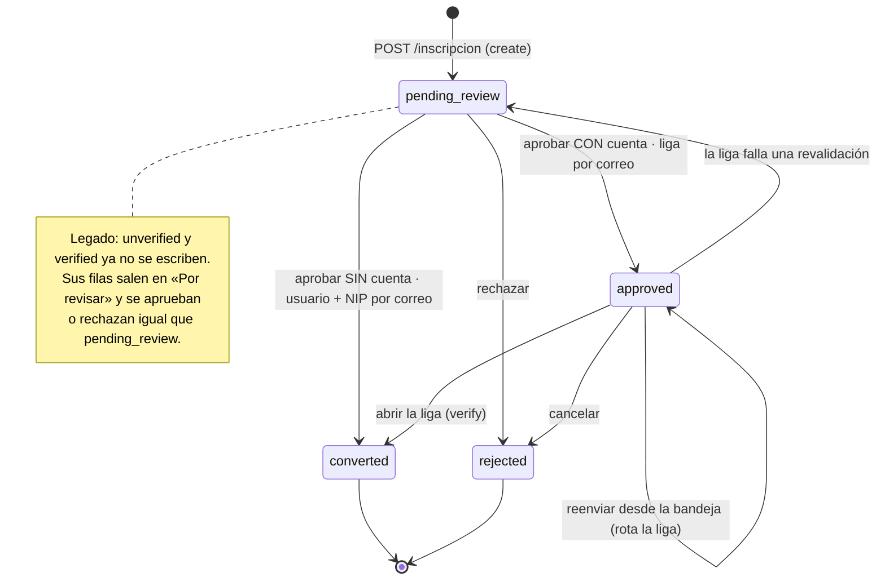
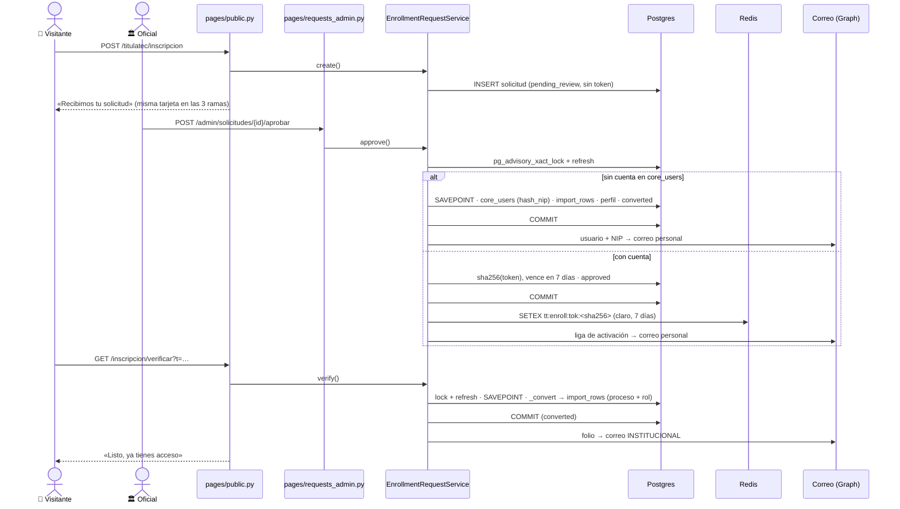

# Inscripción pública con revisión previa (transversal)

> **Objetivo:** que un egresado pida inscribirse a la convocatoria abierta desde un formulario
> público y que el acceso le llegue **solo por correo**, después de que Servicios Escolares revise
> la solicitud. Nadie queda inscrito por llenar un formulario.

| | |
|---|---|
| **Actor(es)** | 👤 Visitante anónimo (formulario y liga) · 🏛️ Servicios Escolares (bandeja) · 🤖 correo y conversión |
| **Permiso(s)** | Formulario, liga y reenvío público: **ninguno**. Son las rutas públicas de `pages/public.py`, sin `require_page_app` (una ruta es pública por omitir la dependencia). Bandeja (`pages/requests_admin.py`), **un código por ruta**: `titulatec.enrollment_request.page.list` (ver) · `titulatec.enrollment_request.api.approve` (aprobar y reenviar) · `titulatec.enrollment_request.api.reject` (rechazar). |
| **Trigger** | El visitante envía el formulario de `/titulatec/inscripcion`. |
| **Precondiciones** | Exactamente **una** convocatoria abierta según `CohortService.is_public_enrollment_open` (`status='open'` y hoy dentro de `[opens_at, closes_at]`). Cero: tarjeta de cierre. Más de una: 503, falla cerrado. En la bandeja, las filas pasan por el [alcance por carrera](engine_officer_scope.md). |
| **Sub-flujos** | ⤵ [alcance por carrera](engine_officer_scope.md) · ⤵ `ImportService.import_rows`, el mismo alta que el [CSV](phase0_school_services_import_csv.md) y el [alta manual](phase0_school_services_add_student_manual.md) |
| **Estado final** | `titulatec_enrollment_requests.status = converted` con `converted_process_id` (proceso en fase 1), o `rejected` con motivo. |

## Ruta en la app (UI)

1. 👤 `/titulatec/inscripcion` → formulario: número de control, nombre, apellidos, carrera (o texto
   libre si no aparece), teléfono, **correo personal dos veces** y e.firma → **Enviar solicitud** →
   tarjeta «Recibimos tu solicitud».
2. 🏛️ Menú admin **Solicitudes** (`/titulatec/admin/solicitudes`) → pestaña **Por revisar**, que es la
   de por omisión.
3. 🏛️ Fila **Sin cuenta** → NIP de 4 dígitos + carrera → **Aprobar y crear acceso**.
   Fila **Con cuenta** → carrera → **Aprobar y enviar liga**, con el aviso «La liga de activación irá
   a este correo, que escribió el solicitante. Confirma su identidad antes de aprobar.».
   Cualquiera de las dos → motivo → **Rechazar**.
4. 🏛️ Pestaña **Liga enviada** → «Liga enviada N vez/veces · última dd/mm/aaaa hh:mm ·
   abierta/sin abrir» (o la píldora «correo no enviado») → **Reenviar liga** (rota la liga) o
   **Cancelar solicitud** (rechazo con motivo).
5. 👤 Correo «Activa tu acceso a titulación» → **Activar mi acceso** →
   `/titulatec/inscripcion/verificar?t=…` → tarjeta «Listo, ya tienes acceso» con el folio.
6. 🏛️ Pestañas **Inscritas** (folio), **Rechazadas** (motivo) y **Todas** (con el estado en cada fila).

Tras aprobar, rechazar o reenviar, la bandeja vuelve a pintar **la pestaña donde estaba el oficial**:
cada formulario de fila lleva `status` y `cohort_id` en campos ocultos.

## Estados

El índice parcial `uq_titulatec_enrollment_req_open (cohort_id, control_number) WHERE status IN
('unverified','verified','pending_review','approved')` impide **dos solicitudes vivas** del mismo
control en la misma convocatoria; `rejected` y `converted` quedan fuera, así que se puede volver a
intentar. Lo crea la migración `tt20260915a` y lo declara el `__table_args__` del modelo (el CI usa
`create_all`); `test_el_modelo_y_la_migracion_declaran_el_mismo_predicado` amarra los dos.

## Secuencia

## Pasos detallados

| # | Actor | UI / dónde | Acción | Endpoint | Service · método | Efecto en BD | Eventos / Correo |
|---|---|---|---|---|---|---|---|
| 1 | 👤 | `/titulatec/inscripcion` | Ver el formulario | `GET /titulatec/inscripcion` | `CohortService.public_enrollment_cohort` | (lectura) | — |
| 2 | 👤 | formulario | Enviar | `POST /titulatec/inscripcion` | `EnrollmentRequestService.create` | `titulatec_enrollment_requests` ← `pending_review`, `kind` (solo para mostrar), `created_ip_hash`; **sin token** | Solo si ya hay proceso vivo: `send_already_enrolled` → institucional, sin fila |
| 3 | 🏛️ | Solicitudes | Ver una pestaña | `GET /titulatec/admin/solicitudes[/body]?status=&cohort_id=` | `_body_ctx` | (lectura) | — |
| 4a | 🏛️ | fila **Sin cuenta** | Aprobar y crear acceso | `POST /titulatec/admin/solicitudes/{id}/aprobar` | `approve` | `core_users` ← usuario = control, `hash_nip(nip)`, `must_change_password`; `core_user_app_roles` (`student`); `titulatec_processes` + 9 fases; `core_student_profile` con los datos del formulario; solicitud → `converted` | `ProcessEvent(enrollment_self_service, activation=nip_personal_email)` sin NIP; `send_enrollment_approved` → **personal** |
| 4b | 🏛️ | fila **Con cuenta** | Aprobar y enviar liga | `POST /titulatec/admin/solicitudes/{id}/aprobar` | `approve` | solicitud → `approved`; `verify_token_hash`, `verify_expires_at` (+7 días), `verify_sent_to`, `verify_send_count = 1`; claro en Redis. **La cuenta no se toca** | `send_verify_enrollment` → **personal**; si sale, `verify_sent_at` |
| 5 | 👤 | correo | Activar mi acceso | `GET /titulatec/inscripcion/verificar?t=` | `verify` → `_convert` | `core_user_app_roles`; `titulatec_processes` + fases; solicitud → `converted`, `verified_at`. **Nada del perfil** | `ProcessEvent(activation=personal_email_link)`; `send_enrollment_done` → **institucional** |
| 6 | 🏛️ | Liga enviada | Reenviar liga | `POST /titulatec/admin/solicitudes/{id}/reenviar` | `resend_link` | hash y vencimiento nuevos, `verify_send_count + 1`, `verified_at` y `verify_sent_at` a NULL; claro viejo borrado de Redis | `send_verify_enrollment` → personal |
| 7 | 🏛️ | fila | Rechazar / Cancelar solicitud | `POST /titulatec/admin/solicitudes/{id}/rechazar` | `reject` | → `rejected`, `review_note`, `reviewed_by_id/at`, token a NULL; claro borrado | `send_enrollment_rejected` → personal |
| 8 | 👤 | (sin pantalla) | Reenvío público | `POST /titulatec/inscripcion/reenviar` | `resend` | `verify_send_count + 1`, mismo token | `send_verify_enrollment` → personal |
| 9 | 👤 | correo viejo | Confirmar correo de contacto (legado) | `GET /titulatec/inscripcion/correo?t=` | `confirm_contact` | `core_student_profile` | — |

## A qué buzón va cada correo

| Correo | Método | Destinatario |
|---|---|---|
| Liga de activación | `send_verify_enrollment` | correo **personal** de la solicitud |
| Usuario + NIP (cuenta nueva) | `send_enrollment_approved` | correo **personal** |
| Rechazo con motivo | `send_enrollment_rejected` | correo **personal** |
| «Ya tienes un proceso» | `send_already_enrolled` | **institucional** (`student_email(user)`) |
| Folio al activarse (alarma) | `send_enrollment_done` | **institucional** |

El destinatario lo decide cada método del helper, nunca quien llama: ninguno recibe `to`. Lo fija
`test_ningun_correo_de_la_solicitud_acepta_un_destinatario_del_llamador`. Sin token de Graph y fuera
de producción, la liga se escribe al log con `[TT-VERIFY-LINK]` (E9).

## Riesgo aceptado y contención

La liga de una cuenta existente viaja al correo que **tecleó** el solicitante. Quien escriba un
número de control ajeno con su propio correo y pase la revisión puede dejar inscrita a esa persona.
El usuario aceptó ese riesgo; lo que impide que escale:

1. Sobre una cuenta existente **jamás** se escribe `password_hash`, `is_active`,
   `must_change_password` ni `core_student_profile` a partir de la solicitud, ni al aprobar ni al
   abrir la liga. Solo recibe el proceso y el rol de la app.
2. Una cuenta existente **sin contraseña** no recibe liga: `approve()` responde «Esa cuenta no tiene
   contraseña; dala de alta desde la convocatoria y rechaza esta solicitud.» y la bandeja la marca
   «sin contraseña» desde antes.
3. El aviso con folio de la activación va al buzón **institucional**: es la alarma de la dueña de la
   cuenta, y su texto dice «Si no fuiste tú, avisa de inmediato a Servicios Escolares.».
4. El oficial ve el aviso de a dónde va la liga antes de aprobar.
5. Ya no existe la segunda liga «confirma tu correo de contacto», que canjeaba contra el perfil con
   la sola prueba del buzón tecleado. `confirm_contact` sigue vivo, con su guarda, para las que ya
   se mandaron.

Una cuenta **nueva** solo conoce su NIP por el correo que manda la aprobación.

«¿Tiene cuenta?» se decide contra `core_users` **al aprobar**. Si al enviar el formulario no existía
pero un CSV la creó después, la solicitud va por la rama con cuenta.

Lo fija `tests/fastapi/titulatec/test_enrollment_identity_chain.py`.

## Token, concurrencia y transacciones

- **Token (E7).** `secrets.token_urlsafe(32)`; en BD solo `sha256`, comparado con
  `hmac.compare_digest`. El claro vive en Redis bajo `tt:enroll:tok:<sha256>` con la misma vida que la
  liga, solo para que el reenvío **público** mande el mismo token: rotar desde un endpoint anónimo
  dejaría a un extraño matar la liga de otra persona. Sin esa copia, el reenvío público no sale. La
  bandeja sí rota.
- **Lock por solicitud.** `approve`, `verify`, `reject`, `resend_link` y `resend` toman
  `pg_advisory_xact_lock(0x7456, req.id)` y hacen `db.refresh(req)` antes de leer el estado. Un doble
  clic en «Aprobar» produce un solo correo. Orden global: solicitud y luego folios (`import_rows`
  toma `0x7454` por convocatoria), sin ciclos.
- **Savepoints.** `_convert` corre dentro de un SAVEPOINT en `verify`: si falla una revalidación, se
  deshace lo que `import_rows` ya había hecho `flush` (rol, proceso) sin soltar el lock y sin perder
  `verified_at` ni la nota. La rama sin cuenta de `approve` hace lo mismo, y por eso `approve()` que
  devuelve `(False, …)` no deja nada escrito.
- **Correo siempre después del commit.** `verify_sent_at` se sella solo si el correo salió; si no,
  la bandeja muestra «correo no enviado».
- **Idempotencia de la liga.** Una solicitud convertida conserva su hash: abrir la liga otra vez
  (el prefetch de Outlook Safe Links es el caso normal) devuelve la misma tarjeta sin repetir
  proceso, evento ni aviso.

## Estado resultante

- `titulatec_enrollment_requests.status = converted`, `converted_process_id`, `reviewed_by_id/at`.
- `titulatec_processes` con fase 0 aprobada y fase 1 en curso (`import_rows`), más su
  `ProcessEvent(process_created)` y la notificación al alumno.
- Cuenta nueva: `core_users` con `must_change_password`; cuenta existente: intacta salvo el rol de la app.
- Siguiente paso natural: el alumno [sube sus documentos iniciales](phase1_student_upload_initial_docs.md).

## Caminos alternos / errores ❗

**Formulario** (200 con el formulario re-renderizado y el error en su campo; ningún presupuesto se cobra):
número de control fuera de `CONTROL_NUMBER_RE`, correo inválido, **«Los dos correos no coinciden.»**
(se compara sin distinguir mayúsculas ni espacios), nombre, apellido paterno, teléfono, carrera.

**Formulario, defensas públicas:**
- Trampa llena → la misma tarjeta, sin escritura ni cobro.
- Límite por IP (30/hora) y por número de control (3/día): se **leen** antes y se **cobran** solo tras
  un `create` que termina; al agotarse, tarjeta «Demasiados intentos» con `Retry-After`. Redis
  caído → la misma tarjeta (`fail_open=False`).
- Sin `Content-Length` → 411; cuerpo > 256 KB → 413.
- Más de una convocatoria abierta → GET 503 con tarjeta; POST 503 con `X-Tt-Error` (htmx no
  swappea en 5xx).
- Excepción al escribir → `rollback` y la misma tarjeta de éxito (ninguna entrada produce un 500).

**Aprobar** (400 con `X-Tt-Error`, sin cambios):
«Esa solicitud ya fue aprobada; usa Reenviar liga.» · «Esa solicitud ya se resolvió.» · «Esa
convocatoria está cerrada; abre su ventana primero.» · «El número de control o el nombre no tienen
formato válido.» · «El NIP debe ser exactamente 4 dígitos.» (solo sin cuenta) · «Esa persona ya
tiene un proceso en otra convocatoria.» · «Esa cuenta no tiene contraseña; dala de alta desde la
convocatoria y rechaza esta solicitud.» · «Esa carrera no está en tu alcance.» · «No pudimos
completar la aprobación; intenta de nuevo.» (excepción, con `rollback`).
Fuera de alcance o inexistente → **404 liso, sin `X-Tt-Error`** (aprobar, rechazar y reenviar).

**Reenviar desde la bandeja:** una solicitud que no está `approved` → 400 «Solo se reenvía la liga
de solicitudes aprobadas.».

**Abrir la liga** (siempre 200 con tarjeta):

| Resultado | Cuándo | Tarjeta |
|---|---|---|
| `converted` / `already_converted` | `approved` con liga vigente, o ya convertida | «Listo, ya tienes acceso» + folio |
| `expired` | `approved` con la liga vencida (se sella `verified_at`) | «Esa liga venció» · «Pide a Servicios Escolares que te la reenvíe.» |
| `pending_review` | falló una revalidación: vuelve a la bandeja con `review_note` y la liga muere | «Tu solicitud necesita revisión» |
| `invalid` | token desconocido, rotado o de una solicitud `pending_review`, `rejected` o legado; o una excepción (con `rollback`: la solicitud sigue aprobada) | «No pudimos validar tu liga» |

Notas que deja una revalidación fallida (las ve el oficial en «Por revisar»): «La convocatoria estaba
cerrada cuando se abrió la liga de activación.» · «El número de control o el nombre no tienen formato
válido.» · «La cuenta de ese número de control ya no existe.» · «Esa persona ya tiene un proceso en
otra convocatoria.» · «Esa cuenta no tiene contraseña; …» · «No se pudo crear el proceso al abrir la
liga; revisa los datos de la solicitud.»

**Reenvío público:** la respuesta es idéntica (bytes y cabeceras) salga o no salga el correo, y el
presupuesto por IP (10/hora) se cobra siempre. No sale si no casa (control, correo), si la solicitud
no está `approved`, con 3 envíos, a menos de 5 minutos del anterior, con la convocatoria cerrada, con
la liga vencida o sin el claro en Redis. Esa indistinción es un invariante, no un defecto.

## Limitaciones conocidas ⚠

1. **El riesgo aceptado** de arriba: una revisión descuidada puede inscribir a una persona por
   error. La contención evita que eso le dé a nadie la cuenta.
2. **Prefetch + rebote.** Si la primera apertura la hace un escáner de correo y justo falla una
   revalidación, el escáner ve «Tu solicitud necesita revisión» y la persona, al abrir después, ve
   «No pudimos validar tu liga». La solicitud sí quedó en la bandeja con su nota.
3. **Cuenta desactivada.** Abrir la liga inscribe a una cuenta con `is_active = False` (no se
   reactiva, por la contención), pero esa persona no podrá entrar. La bandeja no lo marca.
4. **El reenvío público no tiene pantalla.** La ruta conserva su contrato; hoy reenvía la bandeja.
5. **`server_default='unverified'`** en `status` es legado: `create()` escribe `pending_review`
   explícito.
6. **`templates/titulatec/email/confirm_contact.html`** quedó sin llamadores: ya no se emiten ligas de
   contacto. Se puede retirar junto con `GET /inscripcion/correo` cuando venzan las que salieron.
7. **Canal de tiempo en el reenvío público.** Cuando el correo sale hay una llamada síncrona a Graph;
   cuando no, la respuesta es inmediata. Solo confirma un par (control, correo) que quien pregunta ya
   escribió, con 10 intentos por hora por IP.

## Flujos relacionados

- ⤵ [Alcance por carrera + encargados](engine_officer_scope.md) — quién ve y resuelve cada solicitud.
- ⤵ [Detalle de convocatoria](phase0_school_services_cohort_detail.md) — la ventana que abre el formulario.
- → [El alumno sube sus documentos iniciales](phase1_student_upload_initial_docs.md) — lo siguiente tras inscribirse.
- ← [Máquina de estados](00_state_machine.md) · [Glosario](_glossary.md)
