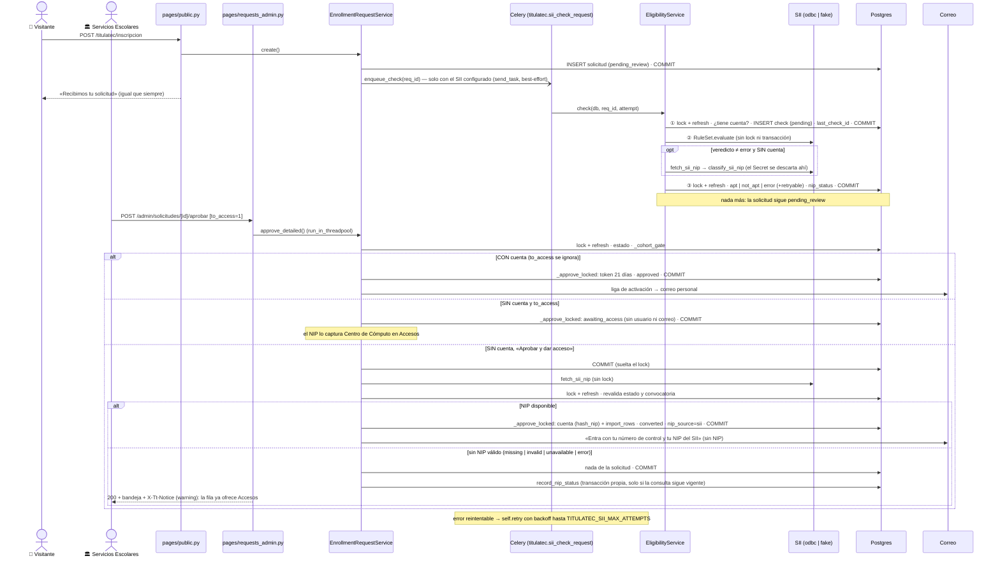

# Consulta de elegibilidad al SII: el SII informa, Servicios Escolares decide (transversal, modo `sii`)

> **Objetivo:** que cada solicitud de inscripción pública se consulte contra la base del **SII**
> (fuente de verdad, Sybase) y que Servicios Escolares (SE) la decida con esa información a la
> vista: el veredicto regla por regla, las diferencias de identidad formulario↔SII y, para quien
> no tiene cuenta, si el SII tiene su **NIP**. **Nada se aprueba solo**: SE da siempre el paso
> final. Sin cuenta, la cuenta nace con el NIP del SII; si el SII no lo da, SE la pasa a
> **Accesos**, donde Centro de Cómputo se lo captura (respaldo).

| | |
|---|---|
| **Actor(es)** | 🤖 tarea celery + barrido periódico (**solo consultan**) · 🏛️ Servicios Escolares (bandeja de Solicitudes: aprobar por la vía que toque, rechazar, «Reintentar consulta», «Reenviar aviso», revocar) · 💻 Centro de Cómputo (respaldo: la bandeja [Accesos](xcut_computer_center_access.md), solo con lo que SE le pasa) · 👤 visitante (formulario público, sin cambios) |
| **Permiso(s)** | Ninguno nuevo (spec 2026-09-27 D4/D5: sin DML). Bandeja: `titulatec.enrollment_request.page.list` · aprobar, **«Reintentar consulta»** y **«Reenviar aviso»**: `titulatec.enrollment_request.api.approve` · rechazar: `titulatec.enrollment_request.api.reject` · revocar: `titulatec.process.api.cancel` (también de `titulatec_school_services` y `titulatec_school_services_head` desde 2026-09-25) · Accesos: `titulatec.enrollment_access.*` (ver su flujo) |
| **Trigger** | El commit del alta pública (`EnrollmentRequestService.create`) encola `titulatec.sii_check_request(req_id)` si el SII está configurado; la periódica `titulatec.sii_sweep` (cada 10 min) recoge lo que quedó atrás. La decisión la dispara SE desde la bandeja. |
| **Precondiciones** | `TITULATEC_ENROLLMENT_REVIEWER=sii` — **el valor por omisión desde 2026-09-27**. Para consultar: `TITULATEC_SII_BACKEND` = `fake` u `odbc` y las reglas en `TITULATEC_SII_RULES_DIR` (default `database/SII/titulatec/`, gitignored). Con `disabled` (el caso de producción mientras no haya acceso al SII) no se consulta nada: ver [SII no configurado](#sii-no-configurado-d11). Solicitud en `pending_review`. |
| **Sub-flujos** | ⤵ [Inscripción pública con revisión previa](xcut_public_enrollment.md) (formulario, liga, correos, rol `graduate`) · ⤵ [Formato de las reglas del SII](../sii_rules_format.md) · ⤵ [Accesos de Centro de Cómputo](xcut_computer_center_access.md) (el respaldo) · ⤵ `EnrollmentRequestService._approve_locked` (núcleo único de la aprobación) · ⤵ `ProcessService.cancel` (revocar) |
| **Estado final** | La consulta **nunca** cambia el estado de la solicitud: deja una `EligibilityCheck`. SE aprueba → `approved` (con cuenta: liga de 21 días) · `converted` (sin cuenta, cuenta con el NIP del SII; el correo no lo lleva) · `awaiting_access` (sin cuenta, «pasar a Accesos»). SE rechaza → `rejected`. |

Los modos `school_services` (oficial) y `computer_center` (alterno) se conservan **tal cual**, como
respaldo activable solo por variable de entorno + reinicio (spec 2026-09-27 D3): todo lo de este
archivo corre solo con `reviewer_mode() == "sii"`. `reviewer_label()` en modo `sii` es «Servicios
Escolares» (firma el correo de rechazo). **Centro de Cómputo solo interviene como respaldo**: en
modo `sii` su bandeja Accesos se comporta como en el oficial y recibe únicamente las solicitudes
que SE le pasa con «Aprobar y pasar a Accesos» (spec D1; [Accesos](xcut_computer_center_access.md)).

**Historia — la aprobación automática, retirada el 2026-09-27** (spec 2026-09-27 D2). Del
2026-09-25 al 2026-09-27 una solicitud apta se aprobaba sola (actor `None`), con interruptor por
convocatoria, ventana de veto y edad máxima del veredicto. Todo eso se borró del código: el
servicio que aprobaba solo, el interruptor «Aprobación automática (SII)» del panel de la ventana,
la píldora «Aprobada automáticamente (SII)» y dos settings (ver [Configuración](#configuración)).
Legado de la BD, retirado el 2026-09-27: la columna `titulatec_cohorts.sii_auto_approve` queda
**sin uso**, y en el modelo con ese comentario para que el autogenerate no proponga borrarla.
Settings retirados el 2026-09-27: `TITULATEC_SII_AUTO_APPROVE_DELAY_HOURS`,
`TITULATEC_SII_VERDICT_MAX_AGE_HOURS` (retirado el 2026-09-27; un `.env` que aún los traiga no
truena: `extra="ignore"`). Una prueba estructural
(`test_eligibility_service.py::test_nada_llama_al_nucleo_de_aprobacion_salvo_approve`) recorre
`itcj2/` y falla si algo que no sea `approve`/`approve_detailed` llama a `_approve_locked`, o si el
símbolo del servicio retirado vuelve a aparecer en un `.py`.

## Piezas

| Pieza | Dónde | Qué hace |
|---|---|---|
| Configuración | `itcj2/config.py` | `TITULATEC_ENROLLMENT_REVIEWER` (default `sii`) y 7 settings `TITULATEC_SII_*` (ver [Configuración](#configuración)); un validador de arranque (`fake` prohibido con `FLASK_ENV=production`). Se leen **solo** por métodos estáticos: `EnrollmentRequestService.reviewer_mode()`, `SiiConfig` (`services/sii/client.py`) y `EligibilityService.max_attempts()/sii_configured()/rules_version()`. Los tests parchean esos métodos, nunca `get_settings`. |
| Conector | `services/sii/client.py` | `get_sii_client()` → `OdbcSiiClient` (`pyodbc` importado **perezosamente**, FreeTDS, solo lectura, timeouts, parámetros `?`) · `FakeSiiClient` (JSON local) · `disabled` lanza `SiiUnavailable`. Errores: `SiiUnavailable` (reintentable) vs `SiiQueryError`/`SiiRulesError` (configuración). Mensajes sin cadena de conexión ni valores de fila. |
| Motor de reglas | `services/sii/rules.py` | `RuleSet.load/validate/evaluate/fetch_credential/advisories`. Formato: [`sii_rules_format.md`](../sii_rules_format.md) (no se duplica aquí). |
| Modelo | `models/eligibility_check.py`, `models/enrollment_request.py` | `titulatec_eligibility_checks` (una fila por intento; `nip_status` desde `tt20260927a`) · `titulatec_enrollment_requests.last_check_id` (la consulta vigente) y `.nip_source` (`tt20260927a`). Migraciones `tt20260925a` + `tt20260925b` (columna `retryable`) + `tt20260927a`. |
| Servicio de elegibilidad | `services/eligibility_service.py` | `EligibilityService.check / sweep / recheck_errors / record_nip_status / classify_sii_nip / sii_configured / latest_check`, `enqueue_check` (devuelve `bool`), `fetch_sii_nip`, `nip_failure`, `identity_block`. **No aprueba nada.** |
| Servicio de solicitudes | `services/enrollment_request_service.py` | `approval_path(has_account, nip_status)` + `APPROVAL_LABELS` (el botón; lo comparten la bandeja y `sii-check`, Ruling R8) · `approve_detailed(..., to_access)` → `ApproveResult(ok, detail, nip_failure)` → `_approve_locked` (núcleo único) · `_sii_nip_unlocked` · `resend_access_notice` («Reenviar aviso») · `NIP_SOURCES`. |
| Tareas | `itcj2/tasks/titulatec_tasks.py` | `titulatec.sii_check_request(req_id, attempt, force)` y `titulatec.sii_sweep()`. Solo consultan. |
| Periódica | `database/DML/titulatec/sii_2026_09/16_insert_sii_sweep_task.sql` (gitignored, en `SEED_FILES`, **ya sembrado en producción**) | `core_task_definitions` + `core_periodic_tasks` «TitulaTec: barrido de elegibilidad del SII», `*/10 * * * *`. Fuera del modo `sii` o con el SII sin configurar no hace nada, pero cada corrida deja su registro. **Texto legado:** la `description` que ese DML dejó en `core_task_definitions` todavía dice «…y aprueba las aptas cuya ventana de veto venció»; no se re-siembra solo por un texto (Ruling R6, spec D5). Lo vigente es `TASK_DEFINITIONS` de `titulatec_tasks.py` («No aprueba nada: eso es de Servicios Escolares»). Pausable en `/itcj/config/system/tasks` › «Tareas Programadas». |
| Bandeja | `pages/requests_admin.py` + `admin/requests.html` + `admin/partials/requests_body.html` | Columna «SII» en **todas** las pestañas (`_sii_cell`), botón de aprobar por `approval_path` (`_approve_action`), confirmación D7 (`_approve_confirm`), aviso `#tt-req-sii-off` (D11), «Reintentar consulta» (`POST /{req_id}/reconsultar`), «Reenviar aviso» (`POST /{req_id}/reenviar-aviso`), «Revocar inscripción» (`POST /{req_id}/revocar`). |
| Accesos (respaldo) | `pages/access_admin.py` + `admin/access.html` + `admin/partials/access_body.html` | En `sii` opera como en el oficial (`_OFFICIAL_LIKE`); «Con acceso» deja fuera las cuentas con `nip_source = 'sii'`. |
| CLI | `itcj2/cli/titulatec.py` | `sii-ping`, `sii-rules-validate [--dir]`, `sii-check <control> [--cohort ID]`, `sii-sweep [--cohort ID] [--reconsultar-errores]`. |

## Ruta en la app (UI)

1. 👤 `/titulatec/inscripcion` → el formulario y la tarjeta de «Recibimos tu solicitud» **no
   cambian** (indistinguibilidad E8: la consulta es asíncrona y la respuesta pública no depende
   del SII).
2. 🏛️ Menú **Solicitudes** (`/titulatec/admin/solicitudes`). La cabecera, en modo `sii`, explica el
   flujo: el SII revisa y SE decide; sin cuenta y con NIP en el SII la cuenta nace con él; si no lo
   tiene, pasa a Accesos; con cuenta, liga de activación. Con el SII sin configurar, arriba de la
   tabla va el aviso `#tt-req-sii-off` («SII sin configurar · El SII no está configurado: las
   solicitudes sin cuenta se aprueban pasándolas a Accesos.»).
3. 🏛️ Pestaña **Por revisar** (FIFO: `created_at, id` ascendente; incluye el legado
   `unverified`/`verified`). La tabla tiene **seis** columnas en modo `sii`: la del **SII** va entre
   «Recibida» y las acciones, con el bloque `#tt-req-sii-<id>`:
   - píldora de estado: **Sin consultar** · **Consultando…** (en curso, o recién pedida) ·
     **Consultando… sin respuesta desde dd/mm/aaaa hh:mm** (colgada) · **Apta** · **No apta** ·
     **Error de consulta**, con «SII · intento N de M · fecha»;
   - las **reglas incumplidas** con su `message` de `rules.toml` (abiertas) y las cumplidas
     plegadas («N reglas cumplidas»); el texto del error, y «Se reintenta sola (intento N de M).»
     en un error reintentable bajo el tope (N es el intento que sigue: lo que se reintenta es la
     CONSULTA) — solo con el SII configurado: sin él nadie la reintenta;
   - «Diferencias con el SII»: «Nombre: «…» en el formulario, «…» en el SII» (nombre, apellidos,
     carrera);
   - solo **sin cuenta**, la píldora del NIP: «NIP en el SII: disponible» · «El SII no tiene NIP» ·
     «NIP del SII con formato inválido» · «No se pudo leer el NIP (SII sin respuesta)» · «No se pudo
     leer el NIP (configuración)» · «NIP sin revisar»;
   - botón **«Reintentar consulta»** («Consultar al SII» si nunca se consultó): solo en
     `pending_review` (el legado no se consulta), oculto mientras hay una consulta en curso y con el
     SII sin configurar.
4. 🏛️ Misma fila → el botón de aprobar, que decide `EnrollmentRequestService.approval_path`
   (Ruling R8) — el mismo que imprime `sii-check --cohort`:

   | Caso (cuenta contra `core_users` HOY + `nip_status` de la consulta vigente) | Botón | Aviso bajo el botón |
   |---|---|---|
   | Con cuenta | **Aprobar y enviar liga** | «La liga de activación irá a este correo, que escribió el solicitante. Confirma su identidad antes de aprobar.» |
   | Sin cuenta y `nip_status = available` | **Aprobar y dar acceso** | «La cuenta nace con su NIP del SII; el correo no lo lleva.» |
   | Sin cuenta y cualquier otro `nip_status` (o sin consulta, o legado) | **Aprobar y pasar a Accesos** (manda `to_access=1`) | «Centro de Cómputo le captura el NIP en Accesos; el correo sale entonces.» |
   | Sin cuenta, **SII sin configurar** | **Aprobar y pasar a Accesos**, aunque una consulta vieja diga `available` (Ruling R10: «dar acceso» le pediría el NIP a un SII que no hay) | igual que arriba |
   | Cualquiera | **Rechazar** (motivo obligatorio, sin cambios) | — |

   Un control que no cumple `CONTROL_NUMBER_RE` cuenta como **sin cuenta** (no se busca en
   `core_users`: mismo corte que `check`, la aprobación y `sii-check`). La fila **promete**; lo que
   ocurre lo decide `approve_detailed` bajo el lock (si entretanto apareció la cuenta, sale la liga
   aunque el botón dijera Accesos).
5. 🏛️ **Confirmación (D7).** Con el SII configurado, el formulario de aprobar lleva
   `hx-confirm="Aprobar solicitud|<motivo>"` + `data-tt-confirm-ok="Aprobar"` (el puente
   `htmx:confirm` de `titulatec-utils.js` abre `TitulaTecUtils.confirmDialog`; es el único
   `hx-confirm` de la bandeja) cuando: no hay consulta («No se ha consultado al SII.»); está en
   curso o se acaba de pedir («La consulta al SII sigue en curso.»); quedó colgada («La consulta al
   SII no terminó.»); terminó en error («La consulta al SII terminó en error.»); el SII dijo «No
   apta» («El SII dijo «No apta»: motivo; motivo.»); o es apta pero el nombre no coincide o no se
   pudo comparar (`identity_block`). Todos terminan en «¿Aprobar de todos modos?». Una apta con el
   nombre confirmado no pregunta; una carrera distinta tampoco (el SII la manda como clave). Con el
   SII sin configurar no hay consulta nueva: sin consulta, o con una en curso/colgada/en error, no
   hay confirmación (no hay veredicto que discutir); pero una consulta **vieja** que marcó «No apta»
   o la identidad sin confirmar en una apta se sigue pintando en la celda (Ruling R10) y pide la
   misma confirmación con su motivo (revisión final F6: con cuenta, aprobar manda la liga al correo
   tecleado).
6. 🏛️ Pestañas de historial (**En Cómputo**, **Liga enviada**, **Inscritas**, **Rechazadas**) → la
   columna SII en forma **compacta** (`.tt-sii--compact`): la píldora y «N reglas incumplidas»
   plegadas, de la consulta vigente. En **Todas**, las filas pendientes van completas. «En Cómputo»
   (lo que SE pasó a Accesos) es cola FIFO por `reviewed_at` (D10); el historial sigue DESC.
7. 🏛️ **Inscritas** → si la cuenta nació con el NIP del SII (`nip_source = 'sii'`) y su correo de
   acceso no salió (`access_sent_at` nulo): píldora ámbar «correo no enviado» + **«Reenviar
   aviso»** (D12; el correo no lleva el NIP y no se toca ninguna credencial).
8. 💻 **Accesos** (respaldo) → «Por dar acceso» recibe lo que SE pasó; Centro de Cómputo teclea el
   NIP, la devuelve con nota o reasigna el NIP ([Accesos](xcut_computer_center_access.md)).
9. 🏛️ **Revocar inscripción** (motivo obligatorio): en el expediente (`#exp-revocar-abrir` → modal
   `#exp-modal-revocar`) y en Solicitudes › Inscritas. Ver [Revocar](#revocar-inscripción).

## Secuencia



## Pasos detallados

| # | Actor | UI / dónde | Acción | Endpoint / tarea | Service · método | Efecto en BD | Eventos / Correo |
|---|---|---|---|---|---|---|---|
| 1 | 👤 | `/titulatec/inscripcion` | Enviar el formulario | `POST /titulatec/inscripcion` | `EnrollmentRequestService.create` → `eligibility_service.enqueue_check(req.id)` **tras el commit** | solicitud `pending_review` | Encola `titulatec.sii_check_request` por nombre (`send_task`, `retry=False`): el web no importa el módulo de tareas; con el broker caído lo recoge el barrido. Con el SII sin configurar `enqueue_check` devuelve `False` **sin publicar** |
| 2 | 🤖 | celery | Consultar | `titulatec.sii_check_request(req_id, attempt=1, force=False)` | `EligibilityService.check` | fase ①: fila `pending` + `last_check_id`; fase ③: `status`, `rules_version`, `results`, `facts`, `identity_mismatch`, `error`, `retryable`, **`nip_status`**, `finished_at`, `duration_ms` | Reintento con `self.retry` (60 s × 2^(n-1), tope 1 h) **solo** si `retryable` y `attempt < max_attempts()`. Nunca aprueba |
| 3 | 🤖 | beat | Barrer | `titulatec.sii_sweep()` cada 10 min (`soft_time_limit=540`, presupuesto 480 s) | `EligibilityService.sweep` | ver [Barrido](#barrido-periódico) | — |
| 4 | 🏛️ | Solicitudes, fila `pending_review` | Reintentar consulta | `POST /titulatec/admin/solicitudes/{id}/reconsultar` (`api.approve`) | `enqueue_check(req.id, force=True)` | nada propio (la fila la abre la tarea bajo lock) | 200 + parcial (la fila ya dice «Consultando…») + `X-Tt-Notice` «Consulta al SII solicitada: el veredicto aparece al terminar.» |
| 5a | 🏛️ | fila **con cuenta** | Aprobar y enviar liga | `POST …/{id}/aprobar` (en `run_in_threadpool`: no congela el event loop) | `approve_detailed` → `_approve_locked` | → `approved`; token (hash) + 21 días; `reviewed_by_id/at`. La cuenta no se toca | `send_verify_enrollment` → personal, tras el commit; 200 + `X-Tt-Notice` «Liga enviada al correo del solicitante.» (*warning* si no salió: «Liga generada, pero el correo no salió: reenvíala desde Liga enviada.») |
| 5b | 🏛️ | fila **sin cuenta**, `nip_status = available` | Aprobar y dar acceso | `POST …/{id}/aprobar` | `approve_detailed` → `_sii_nip_unlocked` (el NIP se pide **sin** lock) → revalida → `_approve_locked` → `_create_account_with_sii_nip` | `core_users` (`hash_nip(NIP del SII)`, `must_change_password=False`, `role_id = graduate`) + `import_rows` (proceso + roles `graduate`) + perfil; solicitud → `converted`, `nip_source = 'sii'`, `access_granted_by_id/at` = SE, `reviewed_by_id/at` | `ProcessEvent(enrollment_self_service)` con `activation=nip_personal_email`, `approved_by_id`, `granted_by_id` y `nip_source: "sii"`, sin el NIP; caché de authz tras el commit; `send_enrollment_approved(nip_source="sii")` → personal, **sin NIP** («Entra con tu número de control y tu NIP del SII»); sella `access_sent_at` si sale; 200 + `X-Tt-Notice` «Cuenta creada (folio X); se le avisó por correo.» (*warning* si no salió, `access_mail_unsent`: «Cuenta creada (folio X), pero el correo no salió: reenvíalo desde Inscritas.») |
| 5c | 🏛️ | fila **sin cuenta**, cualquier otro caso | Aprobar y pasar a Accesos | `POST …/{id}/aprobar` con `to_access=1` | `approve_detailed(to_access=True)` → `_approve_locked` | → `awaiting_access`, `program_id`, `reviewed_by_id/at`; **sin** usuario ni correo; el SII **no** se consulta | 200 + `X-Tt-Notice` «Pasó a Accesos: Centro de Cómputo le capturará el NIP.» (Accesos le da el NIP: ⤵ [Accesos](xcut_computer_center_access.md)). Con el SII sin configurar, aprobar **sin** `to_access` es esto mismo (F8) |
| 5d | 🏛️ | como 5b, pero el SII ya no da un NIP válido | (el mismo clic) | `POST …/{id}/aprobar` | `approve_detailed` → `ApproveResult(False, motivo, nip_failure)` → `EligibilityService.record_nip_status` | **nada** de la solicitud; la consulta vigente guarda el `nip_status` visto (transacción propia y corta, solo si `last_check_id` sigue siendo esa) | **200** + bandeja re-pintada (la fila ya ofrece «Aprobar y pasar a Accesos») + `X-Tt-Notice` *warning*: «<motivo> Puedes pasarla a Accesos o reintentar la consulta.» |
| 6 | 🏛️ | Solicitudes | Rechazar | `POST …/{id}/rechazar` | `reject` | igual que el modo oficial | `send_enrollment_rejected`, firmado «Servicios Escolares» |
| 7 | 🏛️ | Inscritas, «correo no enviado» | Reenviar aviso | `POST /titulatec/admin/solicitudes/{id}/reenviar-aviso` (`api.approve`, `_load_scoped_request`) | `resend_access_notice` (lock + refresh; exige `converted`, `nip_source = 'sii'`, `access_sent_at` nulo y que la cuenta del control sea la dueña de `converted_process_id`) | ninguna credencial; `access_sent_at` si el correo sale | `send_enrollment_approved(nip_source="sii")` → personal, sin NIP; 200 + `X-Tt-Notice` «Aviso reenviado.» |
| 8 | 🏛️ | Inscritas / expediente | Revocar inscripción | `POST …/{id}/revocar` · `POST /titulatec/admin/processes/{pid}/cancelar` | `ProcessService.cancel` | ver [Revocar](#revocar-inscripción) | `send_process_cancelled` tras el commit |

## Estado resultante

- `titulatec_eligibility_checks`: una fila por intento; la vigente es `last_check_id`.
  `status` ∈ `pending | apt | not_apt | error`. `results = [{rule, ok, message}]`; `facts` = solo las
  columnas de la lista blanca `[facts]`; **nunca** la columna ni la consulta de `[credential]`.
- `retryable` (Boolean, nullable): `true` si el `error` fue `SiiUnavailable` (SII caído, timeout,
  cadena vacía) o `SoftTimeLimitExceeded` (celery cortó la tarea por tiempo); `false` si es de
  configuración (reglas que no cargan, SQL inválido, columna faltante, `NULL` en una regla
  `truthy`/`falsy`); `NULL` fuera de `error`.
- `identity_mismatch`: `NULL` = no se comparó · `{}` = se comparó y coincide · con claves = los
  campos que difieren · `_unverified` = `first_name`/`last_name` vacíos en algún lado o columna mal
  escrita (no se pudo comparar). Alimenta la confirmación D7 (`identity_block`).
- **`nip_status`** (`String(20)`, nullable, `tt20260927a`) — solo el **estado**, nunca el valor.
  Lo decide una sola función, `EligibilityService.classify_sii_nip`, que usan la consulta,
  `sii-check` y la aprobación; la regla de formato vive solo en `nip_format_ok`:

  | Valor | Significa | Botón (sin cuenta) |
  |---|---|---|
  | `available` | el SII dio un NIP de 4 dígitos | «Aprobar y dar acceso» |
  | `missing` | el SII respondió sin NIP (0 filas, `NULL`, vacío) | «Aprobar y pasar a Accesos» |
  | `invalid` | el SII dio un NIP que no son 4 dígitos | «Aprobar y pasar a Accesos» |
  | `unavailable` | el SII no respondió al pedir el NIP (transitorio) | «Aprobar y pasar a Accesos» + «Reintentar consulta» |
  | `error` | `[credential]` mal configurada (solo el tipo del error) | «Aprobar y pasar a Accesos» |
  | `not_needed` | la persona tenía cuenta al consultar (no se pidió) | con cuenta: «Aprobar y enviar liga»; si la cuenta desapareció, «pasar a Accesos» |
  | `NULL` | no se revisó: veredicto `error`, consulta en curso, o anterior a `tt20260927a` | «Aprobar y pasar a Accesos» |

  También lo escribe la **aprobación** (paso 5d) cuando el SII ya no da un NIP válido
  (`record_nip_status`, solo sobre la consulta que sigue vigente).
- `titulatec_enrollment_requests.nip_source` (`sii | center | form`, nullable, `tt20260927a`): de
  dónde salió el NIP de la cuenta que **creó** la solicitud. `sii` = aprobación con el NIP del SII
  (5b); `center` = Centro de Cómputo en Accesos (`grant_access`); `form` = el modo alterno. `NULL` =
  cuenta que ya existía (liga) o fila anterior. Lo escribe solo `_create_account`. «Con acceso» de
  Accesos filtra `nip_source IS DISTINCT FROM 'sii'`; «Reenviar aviso» lo exige en `sii`.
- Quién aprobó: siempre una persona (`reviewed_by_id`); ya no existe «aprobada sola».

## Barrido periódico

`EligibilityService.sweep` **solo consulta**, nunca aprueba: una apta queda para SE como cualquier
otra. Sobre `pending_review` (lotes de 200, ordenados por id; cada solicitud en su transacción, la
que revienta se registra por **tipo** y no detiene a las demás), devuelve `{"checked", "retried"}`:

- sin consulta vigente → primera consulta (`checked`);
- vigente `error` con `retryable` y `attempt < max_attempts()` → siguiente intento (`retried`);
- `pending` colgada (> 15 min, `_PENDING_STALE`) → se retoma **forzada, aunque esté en el tope**
  (`retried`).

Un `error` de **configuración** (no reintentable) o uno reintentable que ya llegó al tope **no** lo
vuelve a tomar el barrido: esperar no lo arregla. Tras corregir la causa (reglas, conexión, el
montaje del worker):

```bash
python -m itcj2.cli.main titulatec sii-sweep --reconsultar-errores [--cohort ID]
```

(`EligibilityService.recheck_errors`) **encola** una consulta forzada para toda `pending_review`
cuya vigente sea `error` —cualquiera— o `pending` colgada, e imprime cuántas encoló y cuántas no se
pudieron encolar (broker caído). La consulta la hace el worker. «Reintentar consulta» de la bandeja
es lo mismo, fila por fila.

Manual: `python -m itcj2.cli.main titulatec sii-sweep [--cohort ID]` (solo en modo `sii`; imprime
«Consultadas: N · reintentadas: M» — ya no hay conteo de aprobadas).

## SII no configurado (D11)

`TITULATEC_SII_BACKEND=disabled` es el caso de producción mientras no haya acceso al SII. El único
criterio es `EligibilityService.sii_configured()` (`SiiConfig.backend() != "disabled"`):

- `create()` no encola (`enqueue_check` devuelve `False` sin publicar); `check` devuelve `None` sin
  leer la BD (una tarea que llegue no escribe nada);
- `sweep` y `recheck_errors` no tocan la BD y devuelven sus conteos en cero con `"disabled": True`;
  `sii-sweep` imprime «El SII no está configurado (TITULATEC_SII_BACKEND=disabled); no se consultó
  nada.» y sale 0;
- `POST …/reconsultar` responde 400 «El SII no está configurado.» antes de abrir sesión;
- la bandeja pinta el aviso `#tt-req-sii-off`, sin «Reintentar consulta», sin «Se reintenta sola» y
  sin confirmación D7 salvo que una consulta vieja marque «No apta» o la identidad (F6), y toda
  fila **sin cuenta** ofrece «Aprobar y pasar a Accesos» (Ruling R10: aunque una consulta vieja
  diga `available`; la celda sí sigue mostrando ese último veredicto). Con cuenta, «Aprobar y
  enviar liga» como siempre;
- aprobar **sin** `to_access` una solicitud sin cuenta (la página del modo oficial abierta el día
  del deploy, con su «Aprobar y pasar a Cómputo», o una vieja en caché con «dar acceso») ES pasarla
  a Accesos (`approve_detailed` fuerza `to_access`, revisión final F8): `awaiting_access`, 200 +
  «Pasó a Accesos…», sin pedirle el NIP a un SII que no hay ni dejar un WARNING por clic. Con
  cuenta, la liga como siempre (decidido bajo el lock);
- las cabeceras lo dicen: Solicitudes, «El SII todavía no está configurado: tú revisas cada
  solicitud…»; Accesos, «Solicitudes sin cuenta que aprobó Servicios Escolares (el SII no está
  configurado)…» con las instrucciones del modo oficial (F4).

Al configurarlo (backend `odbc` + reinicio), el barrido toma toda `pending_review` sin consulta
vigente como su **primera consulta**: no hace falta `--reconsultar-errores`.

## Concurrencia

- Transiciones con `pg_advisory_xact_lock(_REQUEST_LOCK_NS, id)` + `db.refresh` antes de leer el
  estado. La consulta al SII corre **sin** lock ni transacción abierta (lock → commit → SII → lock →
  commit). «¿Tiene cuenta?» se decide en la fase ① de la consulta y **otra vez** al aprobar, contra
  `core_users` en ese momento.
- «Aprobar y dar acceso»: `approve_detailed` valida bajo el lock, suelta (`_sii_nip_unlocked`),
  pide el NIP y en una segunda vuelta re-toma el lock y **revalida todo** (estado, convocatoria)
  antes de `_approve_locked(..., sii_nip=...)`. La ruta `aprobar` corre en `run_in_threadpool`
  (pyodbc es bloqueante).
- **La cuenta aparece entre la consulta y la aprobación** (`nip_status = missing` pintó «pasar a
  Accesos», pero al aprobar ya hay cuenta): se emite la liga, `to_access` se ignora y nada queda en
  `awaiting_access` (decisión bajo el lock).
- El `nip_status` que escribe una aprobación fallida (5d) va en transacción propia, **después** de
  soltar el lock de la solicitud, y solo si `last_check_id` sigue siendo la consulta que se leyó:
  una consulta más nueva no se pisa. Nunca lanza.
- Una `pending` de menos de 15 min = otra tarea consultando: no se duplica, ni con `force`.
- Sin `force` no se repite un intento ya hecho (`vigente.attempt >= attempt`) ni se pasa del tope.
  Una tarea que llega antes de que el commit del alta sea visible no encuentra la solicitud y no
  hace nada; el barrido la recoge.
- La bandeja rechaza «Reintentar consulta» con 400 «Ya se está consultando al SII; espera el
  resultado.» si la vigente está en curso (misma regla `_in_flight` que el servicio, fijada por
  `test_la_bandeja_y_el_servicio_coinciden_en_que_es_una_consulta_en_curso`).

## El NIP del SII

Se pide al SII en **dos** momentos, y en ninguno sale de memoria:

- en la **consulta** (fase ②, solo sin cuenta y con veredicto distinto de `error`): se clasifica
  (`classify_sii_nip`) y el `Secret` se descarta en la misma línea — en BD queda solo el estado
  (`nip_status`);
- al **aprobar** «dar acceso»: vive en un `Secret` (repr/str `****`) entre `fetch_credential` y
  `hash_nip`.

Jamás en BD en claro, log, `X-Tt-Error`, `X-Tt-Notice`, correo, `ProcessEvent.payload`, `facts`,
`results`, `repr` ni salida de CLI; de un error se registra solo el **tipo**. La consulta de
`[credential]` corre en modo **sensible** (errores del driver reducidos a tipo + SQLSTATE). El NIP
del formulario (si un formulario viejo lo manda) se ignora. El correo de cuenta nueva dice «Entra
con tu número de control y tu NIP del SII»; la celda de NIP dice «Tu NIP del SII». Una cuenta que
nació con el NIP del SII no admite «Reasignar NIP» (`must_change_password=False`).

## Caminos alternos / errores ❗

**Aprobar** (`POST /titulatec/admin/solicitudes/{id}/aprobar`):

- El SII no da un NIP válido al «dar acceso» → **200** + aviso *warning*, nada escrito de la
  solicitud, `nip_status` actualizado. Motivos (`_NIP_FAILURE_MSGS`, seguidos de «Puedes pasarla a
  Accesos o reintentar la consulta.»): «El SII no tiene NIP para esta persona.» · «El NIP del SII no
  tiene un formato válido (4 dígitos).» · «El SII no respondió al pedir el NIP.» · «No se pudo leer
  el NIP en el SII (revisa la configuración de las reglas).» — un 4xx no dejaría a HTMX re-pintar
  la fila, que ya ofrece Accesos.
- Falla inesperada al crear la cuenta con el NIP del SII → 400 «No se pudo crear la cuenta con el
  NIP del SII; intenta de nuevo.» (rollback; se registra solo el tipo: el mensaje de la BD trae el
  hash del NIP). No es una falla del NIP: nadie toca `nip_status` (sigue `available`), así que la
  fila sigue ofreciendo «Aprobar y dar acceso», que es el reintento; el motivo no dice «pasar a
  Accesos» porque esa fila no tiene ese botón.
- El resto, 400 + `X-Tt-Error` como en el modo oficial: «Esa solicitud ya fue aprobada; usa
  Reenviar liga.» · «Ya está en Centro de Cómputo para su acceso.» · «Esa solicitud ya se
  resolvió.» · «Esa convocatoria está cerrada.» (`_cohort_gate`, solo `status`) · «El número de
  control o el nombre no tienen formato válido.» · «Esa persona ya tiene un proceso en otra
  convocatoria.» · «Esa persona tiene una inscripción revocada en esta convocatoria; solo puede
  inscribirse en otra.» (D1) · «Esa cuenta no tiene contraseña; …» · «Esa carrera no está en tu
  alcance.» · «No pudimos completar la aprobación; intenta de nuevo.» (excepción, rollback).
  Fuera de alcance o inexistente → 404 liso.

**Reintentar consulta** (400 + `X-Tt-Error`): fuera del modo `sii` «La consulta al SII solo existe
en el modo sii.» · SII sin configurar «El SII no está configurado.» · no `pending_review` (incluido
el legado) «Esa solicitud ya se resolvió.» · en curso «Ya se está consultando al SII; espera el
resultado.» · broker caído «No se pudo solicitar la consulta; intenta de nuevo.».

**Reenviar aviso** (400 + `X-Tt-Error`): sin aviso pendiente «Esa solicitud no tiene un aviso de
acceso pendiente.» · el correo no salió «El correo no salió; intenta más tarde.» (la fila sigue
marcada). En el modo alterno, 400 antes de abrir sesión (la bandeja es de solo lectura).

**Filas legado** (`unverified`/`verified`): no se consultan; quedan «Sin consultar» en «Por
revisar» con «Aprobar y pasar a Accesos», y `approve(to_access=True)` las acepta.

**Accesos no se opera**: lo que SE pasó se queda en «En Cómputo» (visible en Solicitudes, donde SE
puede cancelarlo). Riesgo aceptado (spec §11, D1).

## Revocar inscripción

`ProcessService.cancel(db, process_id, *, reason, actor_id)` es la **única** escritura de
`TitulationProcess.status = 'cancelled'`:

- revocables: `active` y `on_hold`; `cancelled` → 400 «Esta inscripción ya estaba revocada.»
  (idempotente, sin evento ni correo); `completed` → 400; motivo obligatorio (≤ 2000).
- toma el advisory de citas del proceso (`SlotService._lock_process`) **antes** del bloqueo de la
  fila (orden anti-deadlock con agendar). La fila va con `FOR NO KEY UPDATE`
  (`with_for_update(key_share=True)`): serializa dos revocaciones y a `CohortService.set_window`,
  pero no choca con el `FOR KEY SHARE` de los INSERT con FK al proceso (citas, eventos).
  `set_window` lee con `FOR UPDATE` los procesos que pausa o reanuda, así una revocación que hace
  commit entretanto no se pisa (Postgres re-evalúa el filtro de estado tras la espera). Cancela la
  cita vigente si está `scheduled`/`confirmed` (libera la franja, en la misma transacción, sin su
  propio aviso);
- evento `process_cancelled` (payload `reason`, `previous_status`, `appointment_cancelled`), aviso en
  la app («Tu inscripción a titulación fue revocada») y **después del commit**
  `send_process_cancelled` al institucional y al personal — texto **neutro** («Tu inscripción al
  proceso de titulación fue revocada», sin atribuirla a un área), sin motivo, folio ni número de
  control (el motivo se lee en la plataforma con sesión);
- el alumno conserva `graduate`: en su dashboard ve «Inscripción revocada» / «Tu inscripción fue
  revocada: motivo» en lugar de la fase actual, **sin** barra de avance ni fase «Actual» en el
  acordeón (ninguna fase se presenta como viva);
- en la bandeja de GTV («Con observaciones» y «Liberadas») la fila de una inscripción revocada no
  ofrece acciones (todas responderían 400) y lleva la píldora «Revocada».

Rutas: `POST /titulatec/admin/processes/{process_id}/cancelar` (expediente; `assert_process_in_scope`,
404 liso fuera de carrera) y `POST /titulatec/admin/solicitudes/{req_id}/revocar` (formulario
«Revocar inscripción» de Solicitudes › Inscritas; `titulatec.process.api.cancel`, alcance por
carrera de la bandeja con `_load_scoped_request`; revoca `converted_process_id`).

**Decisión por sitio de los lectores de `TitulationProcess.status`** (detalle completo en la
máquina de estados): excluidas de Por agendar, En revisión de GTV, Liberados/CSV, resumen de la
convocatoria, kanban y agenda; **etiquetadas** «Revocado» en la bandeja de Procesos, la pestaña
Alumnos y el expediente (banner con motivo); **bloqueadas** en las guardas de fase y al
agendar/reagendar (`EnrollmentRevoked`, también dentro del lock); reabrir una convocatoria no las
resucita.

**D1 — sin readmisión en la misma convocatoria.** Una revocada no cuenta como proceso vivo, así que
la persona **sí** puede inscribirse en **otra** convocatoria. En la **misma** no: hay una sola fila
por `(alumno, convocatoria)` e `import_rows` reutilizaría la revocada; aprobar y abrir la liga
responden «Esa persona tiene una inscripción revocada en esta convocatoria; solo puede inscribirse
en otra.». No existe «des-revocar».

## CLI

Ninguno escribe salvo `sii-sweep`. En producción se corren **en el worker de Celery** (es quien
consulta de verdad; el backend HTTP monta `database/` entero y saldría en verde aunque el worker no
vea nada): `docker compose exec celery-worker python -m itcj2.cli.main titulatec …`.

- `sii-ping` — backend y latencia; exit 1 si no responde.
- `sii-rules-validate [--dir RUTA]` — reglas + advertencias. Sin `[identity]` que mapee
  `first_name`/`last_name` advierte (exit 0) que no se compara el nombre con el formulario, así que
  cada aprobación pedirá confirmación («No se pudo comparar el nombre con el SII»).
- `sii-check <control> [--cohort ID]` — dry-run: veredicto por regla, hechos, identidad,
  advertencias y `NIP: <estado> — <detalle>` (`disponible` · `no tiene` · `formato inválido` ·
  `no se pudo leer (el SII no respondió)` · `error de configuración` · `sin revisar`; el valor
  siempre `****`). Es el estado que guardaría la consulta para alguien **sin** cuenta: aquí se
  pregunta aunque el control ya tenga cuenta. Con `--cohort`, lo que vería SE: «Convocatoria: …»,
  «Cuenta: sí|no» y «→ En «Por revisar», Servicios Escolares vería: <botón>» (`approval_path`, la
  misma decisión que la bandeja). Exit 1 si el veredicto es `error` o el NIP es `invalid`,
  `unavailable` o `error` (con ese NIP no se podría crear la cuenta); `missing` sale 0 (esa persona
  irá a Accesos).
- `sii-sweep [--cohort ID] [--reconsultar-errores]` — ver [Barrido](#barrido-periódico) y [SII no
  configurado](#sii-no-configurado-d11).

## Configuración

| Variable | Default | Nota |
|---|---|---|
| `TITULATEC_ENROLLMENT_REVIEWER` | **`sii`** (desde 2026-09-27; antes `school_services`) | `sii \| school_services \| computer_center`; los dos últimos, respaldo sin cambios |
| `TITULATEC_SII_BACKEND` | `disabled` | `disabled \| fake \| odbc`; `disabled` = SII no configurado (D11): no se consulta ni se encola nada. `fake` **no arranca** con `FLASK_ENV=production` |
| `TITULATEC_SII_ODBC` | `""` | `SecretStr`, fuera del `repr`; p. ej. `DRIVER=FreeTDS;SERVER=…;PORT=…;DATABASE=…;UID=…;PWD=…;TDS_Version=5.0;ClientCharset=UTF-8` (`ClientCharset=UTF-8`: sin él una Ñ o un acento del SII llegan mal y la comparación del nombre falla) |
| `TITULATEC_SII_RULES_DIR` | `database/SII/titulatec` | relativa a la raíz del proyecto |
| `TITULATEC_SII_FAKE_FILE` | `database/SII/titulatec/fake_sii.json` | solo con `fake` |
| `TITULATEC_SII_CONNECT_TIMEOUT_S` | `5` | 1–60 |
| `TITULATEC_SII_QUERY_TIMEOUT_S` | `10` | 1–120 |
| `TITULATEC_SII_MAX_ATTEMPTS` | `5` | 1–20 |

`TITULATEC_SII_AUTO_APPROVE_DELAY_HOURS` y `TITULATEC_SII_VERDICT_MAX_AGE_HOURS`: retiradas el 2026-09-27
junto con su validador cruzado; un `.env` que las traiga no truena (`extra="ignore"`).

`get_settings()` está en `lru_cache` por proceso: cambiar cualquiera exige reiniciar **todos** los
procesos (backend HTTP, sockets, celery worker y beat).

## Despliegue

### Este cambio (2026-09-27, spec §10)

**Comprobaciones previas — ANTES de fusionar a `main`** (el push a `main` dispara `deploy.yml`, y
para cuando la migración aborta `deploy.sh` ya hizo backup, build y `git reset`: el workflow sale
en rojo y hay que relanzarlo a mano):

- **Toda convocatoria tiene cierre**: `SELECT id, name FROM titulatec_cohorts WHERE closes_at IS
  NULL;` en producción debe dar **0 filas**. Si no, `tt20260927b` **aborta** nombrando cada una; se
  configura en Convocatorias › Resumen › Ventana de inscripción.
- **`.env.prod` NO fija el modo**: `grep TITULATEC_ .env.prod` no debe traer
  `TITULATEC_ENROLLMENT_REVIEWER` (si trae `school_services`, el cambio de default no hace nada y
  Servicios Escolares sigue en el flujo viejo sin que nadie lo note). Las retiradas
  (`TITULATEC_SII_AUTO_APPROVE_DELAY_HOURS`, `TITULATEC_SII_VERDICT_MAX_AGE_HOURS`) pueden quedarse:
  `extra="ignore"`.

**Aviso de contrato: `tt20260927b` NO es compatible hacia atrás.** El código anterior (el de
`origin/main` antes de esta rama) compara `date.today()` con la columna ya `TIMESTAMP` →
`TypeError` y **500 en `/titulatec/inscripcion`** (GET y POST) mientras haya una convocatoria
`open`; y su alta de convocatoria da **500 por el NOT NULL**. `deploy.sh` migra en el paso 4 y el
backend viejo sigue atendiendo hasta la recarga de nginx (health check + alcance): **desplegar
fuera de una ventana de inscripción abierta** o aceptar ese corte breve. `tt20260927a` sí es
compatible (solo agrega columnas nullable).

Pasos:

1. Las dos comprobaciones previas de arriba.
2. `git pull` + **reconstruir** las imágenes backend y celery (la rama ya trae el montaje
   `../../database/SII:/app/database/SII:ro` del `celery-worker` en
   `docker/compose/docker-compose.prod.yml`).
3. `alembic -c migrations/alembic.ini upgrade head` con `MIGRATE_DATABASE_URL` (Postgres directo;
   PgBouncer rompe el DDL): aplica `tt20260927a` (`nip_status`, `nip_source` + relleno) y
   `tt20260927b` (ventana `DateTime` NOT NULL; ver
   [Detalle de convocatoria](phase0_school_services_cohort_detail.md#editor-de-ventana-de-inscripción)).
4. **Reiniciar todos los procesos** (HTTP, sockets, celery worker y beat): el nuevo default del
   modo vive en `get_settings()` (`lru_cache`).
5. **Nada de `init-titulatec` ni DML**: no cambia ningún permiso, rol ni puesto (D4/D5). `.env.prod`
   no necesita el modo (ya es el default) y **no debe** fijarlo (comprobación previa).

`docker/scripts/deploy.sh` (merge a `main`) hace 2-4 solo: migra en la imagen nueva con
`set -euo pipefail` —si `tt20260927b` aborta, el deploy se detiene antes de conmutar el backend— y
recrea sockets, `celery-worker` y `celery-beat`. Mientras no haya acceso al SII,
`TITULATEC_SII_BACKEND` sigue `disabled`: **todo lo sin cuenta se aprueba pasando a Accesos** (la
jefatura y la secretaría de Centro de Cómputo capturan el NIP), y con cuenta sale la liga.

### Volver atrás

`docker/scripts/rollback.sh` revierte solo el código. **ANTES** de correrlo hay que bajar la BD a
`tt20260927a` (compatible con el código anterior), y **desde la imagen NUEVA**: la vieja no trae
`tt20260927a`/`b` y alembic no las encuentra. En `/home/cuaderno/ITCJ`, con el patrón del paso 4
de `deploy.sh` (`MIGRATE_DATABASE_URL` llega del `env_file` `.env.prod` del servicio; cualquier
color sirve, la imagen la fija `IMAGE_TAG`):

```bash
export IMAGE_TAG="$(git rev-parse --short HEAD)"   # la imagen NUEVA (la que calculó deploy.sh)
docker compose -f docker/compose/docker-compose.prod.yml --profile blue \
    run --rm --entrypoint "" -e PYTHONPATH=/app backend-blue \
    bash -c "cd /app && alembic -c migrations/alembic.ini downgrade tt20260927a"
./docker/scripts/rollback.sh
```

Se pierde la hora de la ventana (un cierre a las 14:00 vuelve a contar el día entero); `nip_status`
y `nip_source` se quedan (el código viejo las ignora). La otra salida es restaurar el dump
pre-deploy que deja `deploy.sh`. Lo mismo vale si `backend-NEW` no pasa el health check después de
migrar: `deploy.sh` sale dejando el backend viejo sobre el esquema migrado, y el formulario público
queda en 500 hasta bajar a `tt20260927a`.

### Cuando haya acceso al SII

1. **Copiar al servidor** `database/SII/titulatec/` (`rules.toml`, `queries/*.sql`; gitignored, no
   viaja con `git pull`).
2. **El worker de Celery tiene que ver las reglas.** La consulta y el barrido van a la cola
   `default`, que consume `celery-worker`; la imagen no trae `database/` (`.dockerignore`), por eso
   el montaje del paso 2 de arriba. Sin él **toda** consulta termina en «Error de consulta» no
   reintentable. Comprobar:
   `docker compose exec celery-worker ls /app/database/SII/titulatec/rules.toml`.
3. **Canal al SII cifrado y en UTF-8.** Exigir cifrado del lado de FreeTDS (`encryption = require`
   en la sección del servidor de `freetds.conf`, o el equivalente del driver) o, si ASE no lo
   soporta, un segmento de red aislado: por ese canal viajan el usuario de BD y el NIP de cada
   alumno. Y `ClientCharset=UTF-8` en `TITULATEC_SII_ODBC`.
4. **`.env.prod`**: `TITULATEC_SII_BACKEND=odbc` y `TITULATEC_SII_ODBC=…`.
5. **Validar desde el worker**:
   ```bash
   docker compose exec celery-worker python -m itcj2.cli.main titulatec sii-ping              # exit 1 si no responde
   docker compose exec celery-worker python -m itcj2.cli.main titulatec sii-rules-validate    # reglas + advertencias
   docker compose exec celery-worker python -m itcj2.cli.main titulatec sii-check <control> --cohort <id>
   ```
   Probar al menos: un apto con NIP, un no apto, uno sin NIP, un control inexistente y uno con Ñ o
   acento en el nombre (charset). `sii-rules-validate` no debe advertir de `[identity]`.
6. **Reiniciar todos los procesos** y confirmar que la periódica «TitulaTec: barrido de
   elegibilidad del SII» está activa en `/itcj/config/system/tasks` › «Tareas Programadas».
   El barrido hace solo la primera consulta de todo lo pendiente (no hace falta
   `--reconsultar-errores`). Confirmar en el log del worker `titulatec.sii_check_request` y
   `titulatec.sii_sweep`.
7. **Tras corregir cualquier configuración** (reglas, cadena ODBC, montaje, charset) reconsultar lo
   que ya quedó en error — el barrido no lo retoma:
   ```bash
   docker compose exec celery-worker python -m itcj2.cli.main titulatec sii-sweep --reconsultar-errores
   ```

Para desarrollo o demo sin accesos: `TITULATEC_SII_BACKEND=fake` + `fake_sii.json` (formato en
[`sii_rules_format.md`](../sii_rules_format.md#fake_siijson-sii-falso)).

## Pruebas

`tests/fastapi/titulatec/`: `test_eligibility_service.py` (consulta, `nip_status`, SII no
configurado, barrido, estructural del núcleo único), `test_enrollment_approve.py` (las tres vías y
la falla del NIP con aviso), `test_enrollment_inbox.py` (columna SII, botones, confirmación D7,
aviso D11), `test_requests_reconsultar.py`, `test_requests_resend_notice.py` (D12),
`test_access_inbox.py` (Accesos en modo `sii`), `test_sii_cli.py`, `test_titulatec_tasks.py`,
`test_migration_tt20260927a.py`. E2E: `tests/e2e/titulatec/admin-requests.spec.js` (con el SII sin
configurar, aprobar sin cuenta la pasa a Accesos) y `admin-access.spec.js`. «Aprobar y dar acceso» y
la confirmación D7 no tienen E2E (necesitan un SII falso): los cubre pytest.

## Flujos relacionados

- ← [Inscripción pública con revisión previa](xcut_public_enrollment.md) — el formulario, la liga y los otros dos modos.
- ⤵ [Accesos de Centro de Cómputo](xcut_computer_center_access.md) — el respaldo: a dónde va «Aprobar y pasar a Accesos».
- ⤵ [Formato de las reglas del SII](../sii_rules_format.md)
- ⤵ [Expediente del alumno](xcut_admin_process_expediente.md) — botón «Revocar inscripción».
- ⤵ [Detalle de convocatoria](phase0_school_services_cohort_detail.md) — la ventana (con hora) que abre el formulario público.
- ← [Máquina de estados](00_state_machine.md) · [Glosario](_glossary.md)
