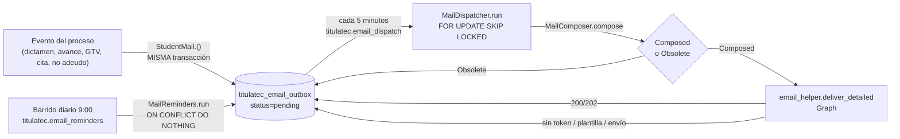

# Correos del proceso al egresado (transversal)

> **Objetivo:** el egresado recibe correo, con liga directa a la pantalla que le toca, en los
> momentos que importan del proceso de titulación (dictamen de documentos, avance/rechazo de
> fase, resultado de GTV, su cita de cotejo, el no adeudo de biblioteca Biblioteca → Caja, y
> cuatro recordatorios) — sin correo por sus propias acciones triviales (subir, borrar, confirmar
> asistencia, cancelar su propia cita).

| | |
|---|---|
| **Actor(es)** | 🤖 Sistema (encolado dentro de la transacción del evento; envío por Celery) |
| **Permiso(s)** | ninguno nuevo (D12): el destinatario es siempre el alumno del proceso, resuelto por `student_id`, no por sesión |
| **Trigger** | dictamen de documentos, avance/rechazo de fase, dictamen de GTV sobre la encuesta, agendar/mover/cancelar la cita de cotejo, cada transición del no adeudo de biblioteca (Biblioteca/Caja), y el barrido diario de recordatorios |
| **Precondiciones** | `TITULATEC_EMAIL_ENABLED=true` (encolar) y proceso con destinatario resoluble (`StudentMail.contact_email`) para que salga de verdad |
| **Sub-flujos** | ⤵ compone [dictamen de documentos](phase1_school_services_review_docs.md), [motor de avance de fase](engine_approve_advance_phase.md), [liberación GTV](phase2_tech_management_survey_release.md), [cita de cotejo](phase2_appointment_loop.md), [auto-agendado](phase2_student_self_booking.md), [no adeudo de biblioteca](phase2_library_clearance.md) · lo lee [expediente del alumno](xcut_admin_process_expediente.md) |
| **Estado final** | filas en `titulatec_email_outbox`: `pending → sent\|failed\|no_recipient\|obsolete` |

Parte del spec `docs/superpowers/specs/2026-09-28-titulatec-correos-notificaciones-design.md`
(no se commitea); los 4 `kind` del no adeudo de biblioteca son del spec
`2026-10-01-titulatec-biblioteca-caja-design.md` §4.11 (D11/D12/D13/D14). Antecedentes:
`services/email_helper.py` (los 6 correos de inscripción, que **no cambian** — D3),
`services/notify.py` (in-app, que tampoco cambia — solo gana tipos nuevos).

---

## Arquitectura

Cuatro piezas, cada una responsable de una sola cosa:

| Pieza | Archivo | Responsabilidad |
|---|---|---|
| `StudentMail` | `services/student_mail.py` | **Encolar**: una función por evento del catálogo, arma el payload y deja la fila `pending` en la transacción del llamador. Resuelve destinatario y ligas. |
| `MailComposer` / `Obsolete` / `Composed` | `services/mail_compose.py` | **Componer**: dado un grupo o una fila suelta ya tomada por el despachador, decide asunto + plantilla + contexto, o que ya no aplica. Solo lectura. |
| `MailDispatcher` | `services/mail_dispatch.py` | **Despachar**: la tarea de cada 5 minutos. Toma, agrupa, compone, envía y marca. Único que muta `status` tras el alta. |
| `MailReminders` | `services/mail_reminders.py` | **Recordar**: el barrido diario que decide a quién le toca un recordatorio y lo encola (+ su in-app). |

---

## 1. Catálogo (spec §5 + spec 2026-10-01 §4.11) — 15 `kind`, con los nombres reales

`OUTBOX_KINDS` (`models/email_outbox.py`, 11 → 15 el 2026-10-01). Todos: `_base_email.html`,
asunto con prefijo exacto `[TitulaTec ITCJ] ` (`mail_compose.py:60`), saludo con `first_name`, un
botón con la liga y el texto plano debajo. Plantillas bajo `templates/titulatec/email/`.

| # | `kind` | Grupo/llave | Encolado en (escritor real) | Compuesto por | Plantilla | Liga (`next`) | In-app |
|---|---|---|---|---|---|---|---|
| 1 | `docs_review` | `docs:{pid}` | `DocumentService.review` → `StudentMail.doc_reviewed` (`document_service.py:409-414`, `student_mail.py:306-319`) | `_compose_docs_group` (`mail_compose.py:172-216`) | `docs_review.html` | `/titulatec/student/documents` | sin cambio (`DOCUMENT_REJECTED`, solo rechazo, `document_service.py:396-401`) |
| 1b | `phase_approved` (fase `initial_docs`) | **mismo** `docs:{pid}` | `PhaseService.approve_phase` → `StudentMail.phase_approved` (`phase_service.py:442-448`, `student_mail.py:321-340`) | el mismo `_compose_docs_group` (detecta el `phase_approved` del grupo → `advanced=True`) | `docs_review.html` | `/titulatec/student/cita` | sin cambio |
| 2 | `phase_approved` (otras fases) | individual | mismo caller de arriba | `_compose_phase_approved` (`:288-307`) | `phase_approved.html` | `/titulatec/student/dashboard?fase=N` | sin cambio (`PHASE_APPROVED`/`PROCESS_COMPLETED`, `phase_service.py:426-436`) |
| 3 | `phase_rejected` | individual | `PhaseService.reject_phase` → `StudentMail.phase_rejected` (`phase_service.py:485-489`, `student_mail.py:342-350`) | `_compose_phase_rejected` (`:310-316`) | `phase_rejected.html` | `/titulatec/student/dashboard?fase=N` | sin cambio (`PHASE_REJECTED`, `phase_service.py:477-481`) |
| 4 | `survey_approved` | individual | `SurveyReviewService.approve` → `StudentMail.survey_result(result="approved")` (`survey_review_service.py:196-203`) | `_compose_survey` (`:319-327`) | `survey_result.html` | `/titulatec/student/dashboard?fase=2` | sin cambio (`SURVEY_REVIEW_APPROVED`, `:196-199`) |
| 5 | `survey_rejected` | individual | `SurveyReviewService.reject` → `StudentMail.survey_result(result="rejected", reason=motivo)` (`survey_review_service.py:231-238`) | `_compose_survey` | `survey_result.html` | idem | sin cambio (`SURVEY_REVIEW_REJECTED`, `:231-234`) |
| 6 | `survey_revoked` | individual | `SurveyReviewService.revoke` → `StudentMail.survey_result(result="revoked", reason=motivo, origin=...)` (`survey_review_service.py`) | `_compose_survey` | `survey_result.html` | idem; con `origin='prior'` (Ruling R22: la previa se borró) `/titulatec/encuesta-egresados` | sin cambio (`SURVEY_REVIEW_REVOKED`) |
| 7 | `appt_changed` | `cita:{pid}` | `AppointmentService.create` (`appointment_service.py:662-677`, D9: **siempre**, incluso si agenda el propio alumno), `.reschedule` (`:741-747`), `.cancel` (`:868-885`, **solo** si `notify=True` **y** el actor no es el alumno) → `StudentMail.appointment_changed` (`student_mail.py:363-379`) | `_compose_appt_group` (`:219-282`) | `appt_changed.html` (vigente) **o** `appt_cancelled.html` (sin vigente) | `/titulatec/student/cita` | sin cambio |
| 8 | `appt_reminder` | `appt_reminder:{appt_id}` | `MailReminders._citas` → `_recordar_cita` → `StudentMail.appointment_reminder` (`mail_reminders.py:261-292`, `:151-161`, `student_mail.py:391-401`) | `_compose_appt_reminder` (`:399-436`) | `appt_reminder.html` | `/titulatec/student/cita` | **nuevo** (`APPOINTMENT_REMINDER`, `mail_reminders.py:159`) |
| 9 | `appt_no_show` | individual, `not_before = +digest_minutes` | `AppointmentService.mark_no_show` → `StudentMail.appointment_no_show` (`appointment_service.py:787-792`, `student_mail.py:381-389`) | `_compose_appt_no_show` (`:330-359`) | `appt_no_show.html` | `/titulatec/student/cita` | **nuevo** (`APPOINTMENT_NO_SHOW`, `:793-795`) + `undo_no_show` solo in-app (`APPOINTMENT_NO_SHOW_UNDONE`, `:813-815`, sin correo propio: el de «no se presentó» que siga en su gracia lo da por obsoleto el despachador) |
| 10 | `docs_reminder` | `docs_reminder:{pid}:{ancla}:{n}` | `MailReminders._documentos` → `_recordar_documentos` → `StudentMail.docs_reminder` (`mail_reminders.py:294-363`, `:164-181`, `student_mail.py:403-409`) | `_compose_docs_reminder` (`:439-460`) | `docs_reminder.html` | `/titulatec/student/documents` | **nuevo** (`DOCUMENTS_REMINDER`, `mail_reminders.py:178-180`) |
| 11 | `survey_reminder` | `survey_reminder:{pid}:{ancla}:{n}` | `MailReminders._encuestas` → `_recordar_encuesta` → `StudentMail.survey_reminder` (`mail_reminders.py:365-399`, `:184-198`, `student_mail.py:411-417`) | `_compose_survey_reminder` (`:463-478`) | `survey_reminder.html` | `/titulatec/encuesta-egresados` | **nuevo** (`SURVEY_REMINDER`, `mail_reminders.py:195-197`) |
| 12 | `library_ready` | individual | `LibraryClearanceService._mark_ready` → `StudentMail.library_ready` (Registrar con adeudo > 0, o Corregir el monto) | `_compose_library_ready` (`mail_compose.py:597-646`) | `library_ready.html` | `/titulatec/student/dashboard?fase=2` | **nuevo** (`LIBRARY_READY`) |
| 13 | `library_cleared` | individual | `LibraryClearanceService` al quedar `cleared` → `StudentMail.library_cleared(via=)` (pago, sin cargo D18, o constancia previa D9) | `_compose_library_cleared` (`:649-687`) | `library_cleared.html` | `/titulatec/student/dashboard?fase=2` | **nuevo** (`LIBRARY_CLEARED`) |
| 14 | `library_reverted` | individual | `LibraryClearanceService.revert_payment`/`.revert_clearance`/`.undo_prior` → `StudentMail.library_reverted(to_status=)` | `_compose_library_reverted` (`:690-752`) | `library_reverted.html` | `/titulatec/student/dashboard?fase=2` | **nuevo** (`LIBRARY_REVERTED`) |
| 15 | `library_reminder` | `library_reminder:{pid}:{ancla}:{n}` | `MailReminders._pagos` → `_recordar_pago` → `StudentMail.library_reminder` (ancla `ready_at`, D14) | `_compose_library_reminder` (`:896-925`) | `library_reminder.html` | `/titulatec/student/dashboard?fase=2` | **nuevo** (`LIBRARY_REMINDER`) |

Los 4 del no adeudo (12-15) cuelgan de la fase 2, como los de GTV; ninguno lleva grupo —cada
transición de Biblioteca/Caja es un correo propio, no se agrupan entre sí como `docs:`/`cita:`—.
Detalle completo de QUÉ dispara cada uno: ⤵ [no adeudo de biblioteca: Biblioteca →
Caja](phase2_library_clearance.md).

`MailComposer.REGISTRY` (`mail_compose.py:850-...`) es el mapeo `kind → función` para una fila
SUELTA; los grupos (`docs:`/`cita:`) se reconocen antes por su `group_key`
(`MailComposer.compose`). Un `kind` sin composición registrada queda `obsolete` con
error en el log — no se reintenta sin fin.

### Sin correo (a propósito)

Subir/borrar documento, confirmar asistencia, solicitar cambio, **cancelación hecha por el propio
alumno** (`AppointmentService.cancel` exige `int(actor_id) != int(proc.student_id)` para
notificar — `appointment_service.py:872-873`), iniciar cotejo, «asistió» (lo cubre el avance de
fase 2), revocación de inscripción (`ProcessService.cancel` llama `.cancel(..., notify=False)`,
ya tiene su propio `PROCESS_CANCELLED`/`send_process_cancelled`), pausa/reanudación de
convocatoria.

### Barrido de escritores (test estructural)

`tests/fastapi/titulatec/test_mail_writers.py` enumera TODOS los escritores de cada estado que
debería encolar correo (toda creación de `ReviewAppointment` pasa por `SlotService.assign`, y
`SlotService.assign_batch` sigue sin llamadores —
`test_assign_batch_sigue_sin_llamadores`) y falla si aparece uno nuevo sin registrar
(`test_ningun_escritor_sin_registrar_ni_entradas_muertas`) o si una rama "sin correo" pierde su
prueba de comportamiento (`test_las_ramas_sin_correo_tienen_prueba_de_comportamiento`). Desde el
2026-10-01 también mapea los 7 métodos de `LibraryClearanceService` que escriben correo (3
`kind` sin contar el recordatorio, que no pasa por aquí porque lo encola el barrido, no un
"estado nuevo" de una fila).

---

## 2. Encolar — `StudentMail` (`services/student_mail.py`)

Contrato completo en el docstring del módulo (líneas 1-44); resumen:

- **No hace commit ni flush obligatorio** (`enqueue`, `:269-301`): `db.add(row)` nada más. El
  service del evento es dueño de su transacción — si revierte, la fila **nunca existió** (Review
  Focus 4 del plan; test que fuerza el fallo del commit dentro de `DocumentService.review`).
- **Best-effort** (`_best_effort`, `:126-138`, decorador en cada función pública): un error al
  armar el correo nunca tumba la acción que lo origina — log + `False`.
- `TITULATEC_EMAIL_ENABLED = false` → `enqueue` no escribe nada (`:281-282`); tampoco el
  despachador ni el barrido tocan la BD entonces.
- **Recordatorios** (`dedupe_key`, los cuatro — cita, documentos, encuesta y, desde 2026-10-01,
  pago en Caja): `INSERT … ON CONFLICT (dedupe_key) DO NOTHING`
  dentro de un `SAVEPOINT` de la conexión (`:289-301`) — correr el barrido dos veces no duplica, y
  un choque no aborta la transacción entera del llamador. Los de documentos, encuesta y pago
  nacen con `created_at` = el reloj del barrido que los encola (`StudentMail._reminder`,
  `:419-433`; sin él, el `NOW()` de la BD): la cadencia del ruling 19 (§5) mide con ESE valor la
  separación con el recordatorio anterior.
- **Payload congelado**: `json.loads(json.dumps(payload))` (`_outbox_values`, `:146-177`) — lo que
  el llamador cambie después en su dict no llega a la fila. Solo hechos del evento; **nunca** NIP,
  token, liga de activación ni contraseña.
- **Destinatario (D2)** — `StudentMail.contact_email` (`:230-252`): `core_student_profile
  .contact_email` → respaldo `EnrollmentRequest.contact_email` de la más reciente que convirtió
  ESTE proceso (`converted_process_id`) → `None`. Vacío o solo espacios cuenta como ausente.
  **Nunca** el institucional. Se resuelve AL ENVIAR (no al encolar), así que un alumno que
  actualiza su correo antes de que salga el correo ya usa el nuevo.
- **Ligas (D10, C7)** — `StudentMail.link` (`:212-225`): `{PUBLIC_ORIGIN}/itcj/login?next=<ruta
  codificada>`. `PUBLIC_ORIGIN` vive en un solo lugar, `email_helper.PUBLIC_ORIGIN`
  (`email_helper.py:60`, `https://enlinea.cdjuarez.tecnm.mx`) — ni la inscripción ni este correo
  tienen ya una segunda copia. `path` tiene que pasar `safe_next` (`itcj2/core/pages/auth.py:22`)
  tal cual, o `link()` levanta `ValueError`: ruta relativa, sin `//host` ni `/\host`, sin esquema
  antes de la primera `/`, sin caracteres de control. Con sesión el login redirige directo a
  `next`; sin sesión, entra y cae ahí (el handler global de `PageLoginRequired` pierde el `next`;
  no se toca el core — D10).
- **Grupos (D7)**: `StudentMail.docs_group(pid)` = `docs:{pid}`; `StudentMail.appt_group(pid)` =
  `cita:{pid}` (`:202-210`).
- **`MailSettings`** (`:77-115`): única lectura de los 7 settings — ver §6.

---

## 3. Componer — `MailComposer` (`services/mail_compose.py`)

`MailComposer.compose(db, rows, process, user)` (`:505-539`) recibe filas YA tomadas por el
despachador (todas del mismo proceso: un grupo entero o una fila suelta) y devuelve `Composed`
(`subject`, `template`, `context`, `link`) o `Obsolete(reason)`. **Solo lectura**: ni commit, ni
flush, ni siembra — los requisitos "qué llevar" de la cita salen de
`CotejoRequirementService.list` y **nunca** de `.list_or_seed`/`RequirementService
.list_with_status`, que siembran y commitean (`mail_compose.py:14-19`, `258-260`, `430-432`).
Filas de otro proceso/alumno, de dos grupos, o varias sueltas sin grupo → `ValueError` (error del
llamador; adivinar podría mandarle a un egresado lo de otro).

### Grupo `docs:` — `_compose_docs_group` (`:172-216`)

De cada documento cuenta su **último** dictamen del grupo (reasignar en el dict conserva el lugar
de la primera aparición). Si el grupo trae además `phase_approved` de la fase `initial_docs`, el
correo da los siguientes pasos (encuesta → agendar) y lleva a la cita, con el asunto «¡Tus
documentos fueron aprobados!» **solo si no queda ningún rechazo** tras el último dictamen de cada
tipo. Con uno —dictamen tardío desde la bandeja, o la fase 1 aprobada a mano con un documento
rechazado— el asunto y el encabezado son «Revisamos tus documentos: hay correcciones» y el cuerpo
solo menciona el avance, sin pedir volver a subir: la fase 1 ya no es la actual (B4, ronda final
2026-09-29; en la plantilla, `has_rejected` manda sobre `advanced`). Sin avance: «Revisamos tus
documentos» (con o sin «: hay correcciones») y lleva a Documentos.

### Grupo `cita:` — `_compose_appt_group` (`:219-282`)

Se arma con la cita **VIGENTE al enviar** (`AppointmentService.get_for_process`), no con el
historial de cada fila — mover tres veces en el tablero es un solo correo con la fecha final (D7).

- Vigente `scheduled`/`confirmed` → fecha, hora, lugar, qué llevar (lectura no sembradora) y
  «confirma tu asistencia» si no la confirmó. Asunto «Cambió tu cita de cotejo: …» solo si el
  alumno ya conocía su cita y hubo un `rescheduled`. La **primera noticia** es SOLO la creación
  hecha por el ENCARGADO: si el grupo empieza con ella, el asunto es «Tu cita de cotejo: …»
  aunque haya `rescheduled` después (ruling 3, 2026-09-29). Si empieza con la creación del propio
  alumno (auto-agendado, `by = "student"`), él ya conocía la fecha —su correo es el comprobante—
  y un `rescheduled` del encargado dentro de la espera sí es «Cambió…» (B5, ronda final
  2026-09-29; `mail_compose.py:224-231,252-256,261-262`).
- Vigente en otro estado (`in_progress`/`attended`/`no_show`) → `Obsolete` con la palabra exacta
  de `_CITA_YA` (`:74-79`).
- Sin vigente (`cancel` le quita la vigencia):
  - el primer evento del grupo es la creación → agendada y cancelada dentro de la espera, **neto
    cero** → `Obsolete("agendada y cancelada dentro de la espera")` (`:272-273`);
  - el grupo **no** trae ningún evento `cancelled` → la canceló el propio alumno o una revocación
    (vías que no encolan un `cancelled`) → `Obsolete("la cita se canceló por una vía sin correo")`
    (ruling 2026-09-29, `:274-276`);
  - si no → «Tu cita de cotejo fue cancelada» con el motivo de la **última** cancelación del grupo
    (`:277-282`).

### Correos sueltos y recordatorios

`_compose_phase_approved` (`:288-307`, «¡Proceso completado!» / «Concluiste tu trámite con
Servicios Escolares» si la siguiente fase ya es del corte a T-soft / «Avanzaste a {fase}»),
`_compose_phase_rejected` (`:310-316`), `_compose_survey` (`:485-517`, usa `_GTV` para el asunto
sin prefijo de cada resultado; desde el 2026-10-01 trae además `origin` —`prior`, D9, cambia
texto y asunto— y, al liberar, ya NO dice «Ya puedes agendar» fijo: lo resuelve `_que_falta`,
D11/D13, ver abajo). La revocación de una constancia previa (`result="revoked"`,
`origin="prior"`, Ruling R22) BORRÓ la solicitud: el correo dice que se revocó la liberación
registrada con su constancia del semestre anterior, le pide **contestar la encuesta de
egresados en la plataforma**, conserva el motivo y la línea D12, y su liga/botón («Contestar la
encuesta») lleva a `/titulatec/encuesta-egresados` en vez del tablero.

`_compose_appt_no_show` (`:330-359`, #9): re-validado al enviar (D8) — si el encargado deshizo la
inasistencia dentro de la gracia, `Obsolete("se corrigió la asistencia")`; si hay OTRA fila
`appt_no_show` de la MISMA cita con `id` mayor (marcar → deshacer → marcar dentro de la espera),
`Obsolete("hay un aviso más reciente de la misma cita")` — sale solo la más reciente (ruling
2026-09-29, `:341-348`); y si la cita del aviso ya no es la **VIGENTE** —dentro de la gracia se le
agendó otra o se reagendó: el intento nuevo le quita `is_current` y la vieja conserva su
`no_show`—, `Obsolete("ya hay una cita nueva")`: «Agenda una nueva» sería falso (B3, ronda final
2026-09-29).

**No adeudo de biblioteca (2026-10-01, #12-15) — `_compose_library_ready`/`_cleared`/`_reverted`/
`_reminder` (`:597-646`/`:649-687`/`:690-752`/`:896-925`).** Las cuatro se re-validan al enviar
contra `LibraryClearanceService.payment_due`/`.reviewable`/`ClearanceGate` (D8, igual que el
resto) y pintan los montos VIGENTES de la fila, no los del payload — ni una corrección doble
(`library_ready` más nuevo del mismo proceso → obsoleto) ni un correo de liberación tras una
reversión posterior (`_hay_posterior`, `:275-285`, mismo patrón que `appt_no_show`). Detalle
completo de cuándo dispara cada uno: ⤵ [no adeudo de biblioteca: Biblioteca →
Caja](phase2_library_clearance.md).

**`_compose_library_reverted` re-valida en CUATRO pasos, en este orden** (spec 2026-10-02 §2,
m30/m40; Ruling R8 de la revisión de la Tarea 8):

1. Se volvió a liberar DESPUÉS (`_hay_posterior(db, fila, "library_cleared")`) → obsoleto.
2. **E10 — anclado en lo ÚLTIMO que el egresado recibió por correo**, no en «el `library_cleared`
   más reciente, saliera o no» (ese ancla, la PRIMERA versión de E10, perdía una reversión
   legítima cuando liberar/revertir se repetía varias veces dentro de la misma espera del
   despachador — el motivo exacto del Ruling R8). `_ultimo_enviado(db, fila, ("library_cleared",
   "library_reverted"))` (`:288-316`) busca el `kind` de la fila `sent` MÁS RECIENTE del proceso,
   de esa familia, encolada ANTES que esta reversión. `None` (nunca le llegó nada por correo: un
   legado del backfill, una liberación con `TITULATEC_EMAIL_ENABLED=false`, o liberar+revertir
   dentro de la misma espera) o `library_reverted` (lo último que ya recibió fue OTRA reversión:
   se re-liberó sin que le llegara correo —correo apagado, promoción D17— y se revierte otra
   vez) → obsoleto en los dos casos: por correo, para él nada cambió, y «Se revirtió tu no
   adeudo…» sería ruido o, peor, falso si Caja se equivocó de renglón. Solo un `library_cleared`
   SENT ahí dispara el correo — así, liberado (sale) → revertido → re-liberado → revertido en una
   sola espera manda la reversión FINAL (los dos pasos de en medio ya salieron obsoletos, por la
   regla 1 y por `_compose_library_cleared`).
3. Regresó a Caja (`to_status == "awaiting_payment"`) y ya no tiene pago pendiente
   (`LibraryClearanceService.payment_due`, también `None` con la fase 2 ya aprobada, Ruling R30
   #4) → obsoleto.
4. Regresó a Biblioteca y **`LibraryClearanceService.reviewable(db, process_id)`** (m40, gemela de
   `_reviewable_clause`: el proceso admitido Y su fase 2 NO `approved`) es falsa → obsoleto: «El
   Centro de Información volverá a revisar tu caso» sería falso. Al componer, en la práctica
   siempre es la fase 2 ya aprobada (el despachador descarta un proceso `cancelled` antes de
   componer). Cada rama le pregunta al dueño (`payment_due`/`reviewable`); `mail_compose.py` no
   compara ningún estado de liberación por su cuenta (invariante 2).

`_ultimo_enviado` SUPONE que las filas `sent` del outbox nunca se purgan (hoy no hay ninguna tarea
de retención — un futuro job de retención tendría que conservar la última `sent`
`library_cleared`/`library_reverted` de cada proceso) y documenta en su propio docstring dos
carreras angostas, sin cambio en el despachador: (a) dos corridas de `MailDispatcher` encimadas
sobre el mismo proceso (cada una toma sus filas con `FOR UPDATE SKIP LOCKED`, §4) pueden hacer que
una reversión salga obsoleta aunque el «quedó liberado» que la antecede SÍ se esté entregando en
ese momento; (b) Graph aceptó el envío pero el commit que lo marca `sent` falló (entrega «al menos
una vez»). Consecuencia APARTE, no una carrera (siempre igual, no angosta): revertir un
`library_cleared/legacy` —el backfill de `tt20261001a`, o cualquier liberación mientras
`TITULATEC_EMAIL_ENABLED=false`— nunca manda el correo de reversión, porque nunca hubo un
`library_cleared` `sent` que anclar; solo queda el aviso in-app (`LIBRARY_REVERTED`).

**D11 — `_que_falta(db, process, bloqueos=None)` (`:224-272`).** Función compartida por
`_compose_survey` (liberar) y `_compose_library_cleared`: arma, con el estado VIVO al componer,
«qué le falta para agendar su cita de cotejo» — `None` si no aplica ninguna frase (proceso no
`active`, fase 2 ya aprobada, o su cita vigente YA OCUPA el cotejo —
`SelfBookingService.cita_ocupa_el_cotejo`, Ruling R18, ⤵ [auto-agendado](phase2_student_self_booking.md)—),
`[]` si ya puede agendar («Ya puedes agendar tu cita de cotejo»), o una frase por pendiente —la
fase 1 si sigue sin aprobar, y cada bloqueo de `ClearanceGate.blockers` en su orden (encuesta
primero; el de Caja lleva el total congelado). Reemplaza el «Ya puedes agendar tu cita de
cotejo.» fijo que traía `survey_approved` hasta el 2026-09-29 (D13).

Los cuatro recordatorios (`_compose_appt_reminder` `:804-844`, `_compose_docs_reminder` `:847-868`,
`_compose_survey_reminder` `:871-893`, `_compose_library_reminder` `:896-925`, el último nuevo
2026-10-01) se re-validan al enviar contra el estado ACTUAL, no el del payload — ver §4.

---

## 4. Despachar — `MailDispatcher` (`services/mail_dispatch.py`)

Tarea Celery `titulatec.email_dispatch`, **cada 5 minutos** (`*/5 * * * *`; ruling 18,
2026-09-29 — antes corría a cada minuto, pero el scheduler del core crea un `core_task_runs` por
ejecución y no hay retención; `tasks/titulatec_tasks.py:189-211`, `soft_time_limit=50`).
`MailDispatcher.run(db, now=None, limit=50)` (`:217-247`) es el único que muta `status` después
del alta.

1. Apagado (`MailSettings.enabled()` falso) → `{"disabled": True}` sin tocar la BD.
2. Candidatas: `pending` con `not_before <= now`, hasta `limit`, bajo `FOR UPDATE SKIP LOCKED`
   (`:230-236`) — lo que otra corrida tiene tomado ni se ve.
3. **Unidades** (`_unidades`, `:110-117`): el `group_key` con TODAS sus filas `pending` (aunque el
   `limit` haya dejado alguna fuera), o la fila suelta. `_tomar` (`:136-163`) vuelve a tomar la
   unidad CON CANDADO justo antes de procesarla (`populate_existing`, nada de lo que hay en
   memoria se da por bueno) y se rinde (`None`) si otra corrida tiene parte del grupo, si ya no
   queda nada `pending`, o si ninguna fila cumple `not_before <= now` todavía.
4. **Espera del grupo (D7)**: si la fila más nueva del grupo tiene `created_at > now - espera`
   (`MailSettings.digest_minutes()`) → `"waiting"`, no se toca (`_unidad`, `:303-306`).
5. Por unidad, en orden: proceso o alumno ya no existen → `obsolete`; proceso `cancelled` →
   `obsolete` («inscripción revocada» — ya salió `send_process_cancelled`); sin correo personal
   (`StudentMail.contact_email`) → `no_recipient`; `MailComposer.compose` → `Obsolete` → `obsolete`
   con su motivo; si no, `email_helper.deliver_detailed` (`:319-331`).
6. Salió → `sent` + `sent_at`/`sent_to`/`subject`, y `last_error` en blanco (el motivo de un
   intento anterior ya no describe el correo que llegó). No salió → `attempts += 1`,
   `not_before = now + backoff_minutes(attempts)` (1, 2, 4, 8, 16, 32… min, tope 60 —
   `backoff_minutes`, `:211-215`); al llegar a `MailSettings.max_attempts()` (default **7**,
   ruling 20) → `failed` con `last_error` legible (`_MOTIVOS`, `:99-103`: «Cuenta de correo no
   conectada», «Error en la plantilla», «Error al enviar»). Siete intentos = seis esperas
   (1+2+4+8+16+32 min): ~1 h de reintentos antes de darlo por fallido (cada espera se redondea a la
   siguiente corrida de 5 minutos, así que el séptimo intento cae hacia los 80 min del primero);
   con 6 se rendía a los ~31 min.
7. **Todas las filas de una unidad quedan con el mismo desenlace y el mismo conteo de intentos**:
   el intento es del CORREO, no de cada fila.

### Transacciones y concurrencia (Review Focus 1)

Una unidad = una transacción con `commit()` al cerrarla (`_despachar`, `:249-270`), que suelta
TODOS los candados de la selección — por eso cada unidad se re-toma con `FOR UPDATE SKIP LOCKED`
antes de procesarse. Dos corridas simultáneas (beat encimado, dos workers) nunca mandan la misma
fila dos veces: lo fija `tests/fastapi/titulatec/test_mail_dispatch.py` (test de «segunda corrida
no reenvía» + test estructural de que la consulta usa `with_for_update(skip_locked=True)`).

- **Excepción inesperada en una unidad** (componer, renderizar, enviar…): `rollback()` y, en una
  transacción NUEVA, intento fallido de TODAS sus filas con `last_error = "Error interno al
  preparar el correo"` (ruling 2026-09-29, `_intento_fallido`, `:272-287`) — si no, se
  reintentaría en cada corrida sin fin y jamás se vería «Falló» en el expediente. El lote sigue con la
  siguiente unidad.
- **Corte de Celery** (`SoftTimeLimitExceeded`) **también cuenta como intento fallido** de la
  unidad en curso, con `last_error = "Tiempo agotado al enviar"` (ruling 2026-09-29,
  `_despachar:260-265`): `rollback`, se registra el intento en una transacción nueva, y se vuelve
  a lanzar la excepción — el LOTE termina ahí (lo que quedó sale en la corrida siguiente). Si el
  corte cae dentro de `graph_send_mail`, lo atrapa `email_helper._send` como cualquier error de
  envío («Error al enviar»), no como timeout de celery.
- **Presupuesto de la corrida**: `_PRESUPUESTO_S = 15` segundos (`:95`) — pasado ese tiempo no se
  toma otra unidad (`run`, `:239-242`); lo que falta sale en la corrida siguiente (5 minutos
  después). Existe porque el
  `soft_time_limit` de la tarea es 50 s y un envío puede tardar hasta 30 s (el `timeout` de
  `graph_send_mail`): la unidad que empieza dentro del presupuesto termina antes del corte.
- **«Al menos una vez»**: se envía y DESPUÉS se marca `sent`; si ese commit fallara, el correo
  volvería a salir. Por eso lo que se escribe tras un envío siempre cabe en su columna (`_cabe`,
  `:166-172`, recorta al `String(N)` de cada columna).

### Dev sin cuenta Graph — `[TT-MAIL]`

Sin token de Graph y fuera de producción (`email_helper._is_production()` falso):
`logger.warning("[TT-MAIL] %s -> %s · %s · %s", kind, to, correo.subject, correo.link)`
(`mail_dispatch.py:341-343`). En producción, jamás. El despachador pasa **`link=None`** a
`deliver_detailed` (`:329-331`, ruling 2026-09-29) — el `[TT-VERIFY-LINK]` que
`email_helper._dev_link` también podría loguear es el de la liga de **activación de la
inscripción** (los 6 correos viejos), no de estos; con `link=None` esa función retorna sin loguear
nada, así que la liga de ESTE correo sale **solo** por `[TT-MAIL]`.

---

## 5. Recordar — `MailReminders` (`services/mail_reminders.py`)

Tarea Celery `titulatec.email_reminders`, **diaria a las 9:00** (cron en `core_periodic_tasks`,
zona `APP_TZ`; `tasks/titulatec_tasks.py:214-231`, `soft_time_limit=540`).
`MailReminders.run(db, now=None)` (`:234-259`) encola en `titulatec_email_outbox` lo que toca hoy
y crea su in-app (misma transacción); el despachador los manda en su corrida siguiente (cada 5
minutos) y los
RE-VALIDA al enviar (D8, §3 arriba). Solo procesos `status = 'active'`. Commit al terminar cada
tipo (cita, documentos, encuesta, **y desde 2026-10-01 pago en Caja**) — lo de uno queda firme
aunque el siguiente reviente. Si celery corta la tarea (`SoftTimeLimitExceeded`), `_aislado` NO se
lo traga como la falla de un candidato: el candidato a medias se deshace con su SAVEPOINT, `run`
commitea lo encolado antes del corte y vuelve a lanzar la excepción (mismo patrón del despachador,
§4); el barrido termina ahí y lo que faltó lo toma la corrida siguiente (las llaves no dejan
duplicar). `run` devuelve `{"appt": n, "docs": n, "survey": n, "library": n}`.

| Recordatorio | Candidato | Ancla | Cuándo toca |
|---|---|---|---|
| `appt_reminder` | cita **VIGENTE** (`is_current`) `scheduled`/`confirmed` cuya FECHA es hoy + `TITULATEC_APPT_REMINDER_DAYS_BEFORE` (`_citas`, `:261-292`) | — | una vez por cita (`appt_id`); se omite si se agendó/cambió hace < 24 h (`_CITA_RECIENTE`, `:83`) — acaba de recibir el correo #7 |
| `docs_reminder` | `current_phase` = fase `initial_docs` con documentos que faltan o `rejected`, **contra el set DEL PERFIL del proceso** (`_documentos`, `:294-363`) | `max(inicio de la fase 1 —o el alta del proceso—, última `document_uploaded`, última `document_rejected`)` | `MailReminders.due_index` (`:205-232`) |
| `survey_reminder` | `current_phase` = `PhaseService.PHASE_COTEJO` sin fila en `titulatec_survey_reviews` (`_encuestas`, `:365-399`) | `started_at` de la fase 2 (sin él, se omite) | idem |
| `library_reminder` (2026-10-01, D14) | proceso `active` con `LibraryClearance.status == 'awaiting_payment'` (`LibraryClearanceService.awaiting_payment_clause`, `_pagos`, `:443-476`) | `ready_at` (la entrada VIGENTE a Caja, Ruling R10 — sin ella, se omite: `_mark_ready` siempre la fija) | idem |

**`library_reminder` reusa `max_reminders()`/`due_index()`**, los MISMOS `TITULATEC_REMINDER_*`
de documentos y encuesta — sin setting propio. `_pagos` trae el `TitulationProcess`,
`LibraryClearance.ready_at` y `.total_amount` de TODOS los candidatos en una sola consulta
(`JOIN`), nunca N+1; el total viaja al asunto (`asunto_recordatorio_pago`, `mail_compose.py`) y al
cuerpo del aviso in-app (`LIBRARY_REMINDER`).

**`docs_reminder` por perfil (2026-09-30, spec `titulatec-posgrado-design.md` §4.4).** `_documentos`
resuelve el set de TODOS los procesos candidatos en una sola llamada
(`DocumentService.initial_doc_types_by_process`, `mail_reminders.py:336`) y mide "falta"/"por
corregir" de cada proceso contra SU PROPIO set (3 en licenciatura, 7 en posgrado) — nunca contra un
`3` fijo; R-G (⤵ [perfil de titulación](engine_process_track.md)) no aplica aquí porque este
recordatorio solo mira procesos que SIGUEN en la fase `initial_docs`
(`current_phase == fase`), y esa regla es para quien ya la pasó. Los nombres que lista el correo
(«te falta: ...») salen del catálogo con la misma consulta de unión de códigos que usa la bandeja
admin, así que un extra de posgrado aparece con su nombre real («Cédula profesional»), no con el
código crudo.

**Fórmula común** (`due_index(anchor, now, sent, last_sent_at)`, `:205-232`): toca el índice
`sent` si `sent < max_reminders()` y `now >= anchor + first_days() + sent · every_days()` (días)
**y**, del segundo en adelante (`sent >= 1`), además han pasado `every_days()` días de CALENDARIO
desde `last_sent_at` — el `created_at` del recordatorio anterior de ESA ancla (ruling 19,
2026-09-29). `sent` y `last_sent_at` salen de la misma consulta por lote (`_llaves`, `:122-134`,
trae `dedupe_key` y `created_at`; `_enviados`, `:137-145`, cuenta el prefijo de la llave,
salieran o no, y toma el `created_at` más nuevo) — sin N+1.

Por qué la segunda condición: con un ancla vieja (el primer barrido de producción, o el correo que
se vuelve a encender tras un apagado) la fórmula del ancla ya venció para los índices 0, 1 y 2, y
un barrido diario los mandaba en **tres días seguidos**. Con ella sale el 0 el primer día y los
siguientes cada `every_days()` desde el anterior (ancla de 19 días: día 0 → índice 0, días 1-6
nada, día 7 → índice 1, día 14 → índice 2). Se cuenta en días de calendario y no en bloques de
24 h porque el anterior lo encoló el barrido de las 9:00 y el de la semana siguiente corre a la
misma hora con segundos de diferencia: en horas, la mitad de las semanas saldría un día tarde.
Una subida o un rechazo nuevos mueven el ancla y la cuenta vuelve a empezar.
`max_reminders() == 0` → sin recordatorios de documentos/encuesta; `appt_days_before() == 0` →
sin recordatorio de cita.

**Borde de medianoche (Review Focus 3, `APP_TZ`)**: «mañana» es la FECHA siguiente, no «dentro de
24 h» — a las 9:00, la cita de mañana a las 00:30 SÍ recibe recordatorio; la de hoy a las 23:30 NO
(`_citas` calcula `desde`/`hasta` con `datetime.combine(...).date(), time.min)`, `:277-285`). Test
con `now` fijo en `tests/fastapi/titulatec/test_mail_reminders.py`.

**Idempotencia**: cada recordatorio entra con su `dedupe_key` único (`INSERT … ON CONFLICT DO
NOTHING`, §2) y el in-app se crea SOLO si esa llamada devolvió `True` (fila nueva) — correr el
barrido dos veces no duplica ni correos ni avisos (`_aislado`, `:94-119`, cada candidato en su
propio `SAVEPOINT`: su correo y su aviso quedan juntos o no queda ninguno).

In-app desde Celery: `notify_student` hace flush pero no hay loop de Socket.IO ahí, así que el
aviso aparece al recargar — es lo esperado.

---

## 6. Settings (`itcj2/config.py:550-571`, `TITULATEC_EMAIL_*`/`TITULATEC_REMINDER_*`)

| Setting | Default | Rango | Qué controla |
|---|---|---|---|
| `TITULATEC_EMAIL_ENABLED` | `True` | — | apagado completo (§7) |
| `TITULATEC_EMAIL_DIGEST_MINUTES` | `10` | 1–120 | espera del agrupado (D7) **y** gracia de «no se presentó» (D8) |
| `TITULATEC_EMAIL_MAX_ATTEMPTS` | `7` | 1–20 | intentos antes de `failed` (ruling 20: ~1 h de reintentos; con 6 eran ~31 min) |
| `TITULATEC_REMINDER_FIRST_DAYS` | `3` | 1–60 | días desde el ancla al primer recordatorio de documentos/encuesta |
| `TITULATEC_REMINDER_EVERY_DAYS` | `7` | 1–60 | días entre recordatorios siguientes |
| `TITULATEC_REMINDER_MAX` | `3` | 0–10 | tope por ancla (0 = sin recordatorios de encuesta/documentos) |
| `TITULATEC_APPT_REMINDER_DAYS_BEFORE` | `1` | 0–7 | días antes de la cita (0 = sin recordatorio de cita) |

Leídos **solo** por `MailSettings` (`student_mail.py:77-115`): las pruebas parchean esos métodos,
nunca `get_settings()` directo (vive en `lru_cache` **por proceso**). Cambiar cualquiera exige
variable de entorno y reiniciar TODOS los procesos backend (HTTP, sockets, worker, beat). La hora
del barrido diario es su `cron_expression` en `core_periodic_tasks` (editable en
`/config/system/tasks`), no un setting de este módulo.

---

## 7. Tareas, DML y despliegue (spec §9)

- `titulatec.email_dispatch` y `titulatec.email_reminders` en `TASK_DEFINITIONS`
  (`tasks/titulatec_tasks.py:97-125`) — registro en el WORKER, no en `core_periodic_tasks`.
- DML `database/DML/titulatec/mail_2026_09/17_insert_email_tasks.sql` (gitignored, subcarpeta
  propia): da de alta `core_task_definitions` + `core_periodic_tasks` (`*/5 * * * *` y
  `0 9 * * *`, zona `APP_TZ`), idempotente (`ON CONFLICT`, no pisa `is_active`/`cron_expression` si
  alguien ya los tocó desde `/config/system/tasks`). Celery Beat corre con `DatabaseScheduler`, que
  SOLO lee `core_periodic_tasks` — sin esta fila ninguna de las dos tareas se programa, aunque el
  worker ya las tenga registradas. Las descripciones de `core_task_definitions` son copia literal
  de `TASK_DEFINITIONS` (lo fija `test_cli_mail_tasks.py`).
- **Resuelto el 2026-10-02 (m33).** El residual del 2026-10-01 —`TASK_DEFINITIONS["titulatec.
  email_reminders"].description` seguía listando solo cita, documentos y encuesta, aunque
  `email_reminders()` ya contaba el pago en su dict de retorno y el barrido YA lo mandaba— quedó
  cerrado: la descripción (`itcj2/tasks/titulatec_tasks.py:118-127`) ya menciona «el pago
  pendiente en Caja del no adeudo de biblioteca». El DML de alta desde cero
  (`mail_2026_09/17_insert_email_tasks.sql`) se editó con el mismo texto (fresh installs); una
  base YA sembrada lo recibe de `database/DML/titulatec/biblioteca_2026_10/
  23_update_email_reminders_description.sql` (dos `UPDATE … WHERE … IS DISTINCT FROM`,
  idempotente), que corre el primer paso del despliegue (`titulatec init-biblioteca-caja`) — ⤵
  [no adeudo de biblioteca: despliegue](phase2_library_clearance.md#despliegue-en-dos-pasos-ruling-r19).
- **Base que ya sembró el despachador con `* * * * *`** (antes del ruling 18): como el `ON CONFLICT`
  no pisa `cron_expression`, re-sembrar NO lo cambia. Pasarlo a mano —
  `UPDATE core_periodic_tasks SET cron_expression = '*/5 * * * *' WHERE task_name =
  'titulatec.email_dispatch';` (o desde `/config/system/tasks`)—; el beat lo toma solo en ≤30 s
  (`_reload_from_db` reconstruye el schedule entero, cron incluido). Solo aplica a la base de dev:
  producción siembra desde cero con `*/5`.
- Comando `titulatec init-email-tasks [--dry-run]` (`cli/titulatec.py:1156-1193`): corre SOLO ese
  archivo (`_DML_MAIL_2026_09_FILES`, `:1153`). El archivo también está en `SEED_FILES`
  (`cli/titulatec.py:94`, antes del 15), así que una instalación desde cero ya lo siembra con
  `init-titulatec` (`_run_sql_files(SEED_FILES)`, `:283`); en producción ese comando completo NUNCA
  se re-ejecuta, y por eso el despliegue de este delta usa `init-email-tasks`, que corre solo este
  archivo. Idempotente.

**Orden de despliegue:**

1. Merge → el deploy (`docker/scripts/deploy.sh`) corre `alembic upgrade head` en la imagen nueva
   (crea `titulatec_email_outbox`, migración `tt20260928a`, escrita a mano, `down_revision =
   tt20260927b`) y, en su paso 11.1, **recrea el celery worker y el beat** (`up -d --build
   --force-recreate celery-worker celery-worker-reports celery-beat`) con el código nuevo: no hace
   falta reiniciarlos a mano.
2. **Después** del deploy: copiar `database/DML/titulatec/mail_2026_09/` al servidor (`database/`
   es gitignored) y correr `python -m itcj2.cli.main titulatec init-email-tasks`. El beat
   (`DatabaseScheduler`) relee `core_periodic_tasks` cada 30 s (`_DEFAULT_SYNC_EVERY`), así que
   programa las dos tareas solo. El orden importa: corrido ANTES del deploy, el beat viejo mandaría
   `titulatec.email_dispatch` a un worker que todavía no la tiene registrada.
3. Verificar en `/itcj/config/email` que la cuenta Graph de **titulatec** esté conectada en
   producción.
5. **El PRIMER barrido en producción manda el recordatorio índice 0 a TODO proceso elegible esa
   misma mañana** — es una ráfaga esperada por contrato (D6: todo proceso que ya lleva más de
   `first_days()` sin actividad estaba "vencido" desde antes de que la tarea existiera, y el
   barrido no tiene memoria de un "antes"). No es un bug del primer arranque. Lo que ya NO pasa
   (ruling 19, §5): que ese mismo proceso reciba el índice 1 al día siguiente y el 2 al otro
   porque su ancla es vieja — el 0 sale el primer día y los siguientes cada 7 días desde el
   anterior. Lo mismo al volver a encender el correo tras un apagado.
6. **En dev la cuenta Graph sigue pausada a propósito** (igual que los 6 correos de inscripción):
   las filas terminan `failed` con `last_error = "Cuenta de correo no conectada"`, y las ligas
   salen al log del worker con `[TT-MAIL]` para probar a mano.

### Apagado de emergencia (§9.5)

`TITULATEC_EMAIL_ENABLED=false` + reinicio de todos los procesos. No borra nada: lo ya encolado se
queda `pending` y sale al volver a encender. Si eso no se quiere, marcar las filas `obsolete` a
mano (sin herramienta de CLI para esto en esta entrega — UPDATE directo). El despachador y el
barrido, con el interruptor apagado, no tocan la BD (`{"disabled": True}`); el despacho deja esa
corrida en el log en DEBUG, igual que una en ceros — no una línea de INFO cada 5 minutos mientras
dure el apagado.

---

## 8. Bitácora en el expediente (spec §7, D11)

Zona `#exp-correos` en `partials/processes/_exp_shell.html`, al final del shell (después de
`#exp-otros`), colapsable, cerrada por omisión, **no se pinta si el proceso no tiene filas**.
Lectura en `pages/admin.py:1521-1530` (`_detail_ctx`) → `_bitacora_correos` (`:1179-1227`): UNA
consulta (`StudentMail.history(db, process_id)`, `student_mail.py:254-264`, `created_at DESC, id
DESC`), misma guarda de alcance (`assert_process_in_scope`) y mismos permisos del expediente — sin
permisos nuevos (D12).

**Una entrada por CORREO, no por aviso** (ruling 21, 2026-09-29): las filas de un mismo grupo
(`group_key` no nulo) con el mismo `status` y el mismo `sent_at` son un solo correo —el despachador
marca toda la unidad igual— y se juntan en UNA entrada con «N avisos agrupados» cuando N > 1, bajo
el id de la fila MÁS RECIENTE del grupo (`exp-mail-{id}`, morph-safe). Las filas sueltas son una
entrada cada una. La fecha es la de ENVÍO (`sent_at`) si salió; si no, la de alta del aviso más
reciente. El conteo del encabezado («N correos») cuenta entradas, no filas. Límite conocido: lo que
no salió no guarda cuándo se decidió, así que dos correos del MISMO grupo que terminaron igual sin
salir (p. ej. dos `failed` en dev, sin cuenta Graph) comparten llave y quedan en una sola entrada.

Cada entrada: fecha larga · `subject` (o `StudentMail.KIND_LABELS[kind]` — `student_mail.py:185-197`
— mientras la fila no se ha enviado; si el `kind` no tiene etiqueta, **cae al código crudo del
`kind`** en vez de reventar — `KIND_LABELS.get(m.kind, m.kind)`, `pages/admin.py:1216`,
`test_expediente_mail.py::test_kind_desconocido_no_revienta_la_pagina`) · destinatario (`sent_to`
o «—» si aún no salió; partible —`#exp-correos .quien { overflow-wrap: anywhere; }` en
`titulatec.css`—: un correo personal largo y sin espacios no rompe `scrollWidth <= innerWidth` a
360px) · «N avisos agrupados» si junta más de uno · píldora de estado,
`_MAIL_STATUS_UI` (`pages/admin.py:1130-1136`):

| `status` | Píldora | Tono |
|---|---|---|
| `sent` | Enviado | success |
| `pending` | En cola | neutral |
| `failed` | Falló (+ `last_error`) | danger |
| `no_recipient` | Sin correo personal | amber |
| `obsolete` | Ya no aplicaba | neutral |

El motivo (`last_error`) se pinta solo en `failed`, `pending` (el reintento en espera dice por qué)
y `obsolete` (por qué ya no aplicaba); en `sent` y `no_recipient` sería un error viejo que ya no
describe nada, así que no se enseña (`_exp_mail.html`). El despachador, además, lo deja en blanco
al marcar `sent` (§4, paso 6).

**Solo lectura, sin reenviar (D11)**: el personal necesita saber qué se mandó, cuándo, a dónde y
si falló — no repetir el envío desde aquí (fuera de alcance de esta entrega).

---

## Flujos relacionados

- ⤵ Encolado desde: [revisión de documentos](phase1_school_services_review_docs.md),
  [motor de avance de fase](engine_approve_advance_phase.md),
  [liberación GTV de la encuesta](phase2_tech_management_survey_release.md),
  [cita de cotejo](phase2_appointment_loop.md), [auto-agendado](phase2_student_self_booking.md),
  [no adeudo de biblioteca: Biblioteca → Caja](phase2_library_clearance.md) (los 4 `kind` nuevos,
  D11/D14).
- ⤵ D11/D13: `_que_falta` consulta [`ClearanceGate`](phase2_library_clearance.md#el-candado-único-clearancegate),
  la única fuente de «qué liberaciones le faltan».
- ← De dónde sale el set de 3 vs. 7 que mide `docs_reminder`: [perfil de titulación por nivel de
  carrera](engine_process_track.md).
- ← Antecedente (no cambia): los 6 correos de inscripción de
  [inscripción pública](xcut_public_enrollment.md) (`services/email_helper.py`, `_deliver`).
- → Lo lee: [expediente del alumno](xcut_admin_process_expediente.md) (bitácora `#exp-correos`).
- ↔ In-app (no cambia su mecánica, solo gana tipos):
  [el alumno en el shell mobile del core](xcut_student_shell_embed.md).
