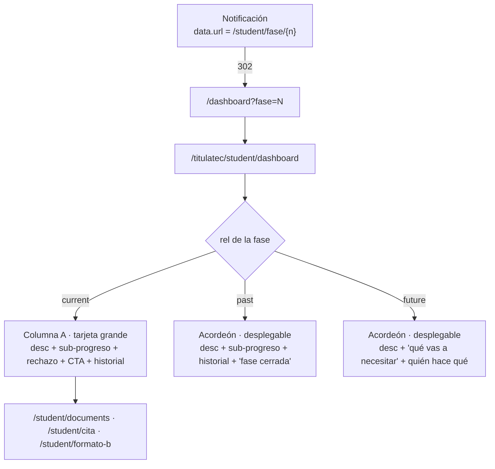

# El alumno consulta el detalle de una fase (transversal)

> **Objetivo:** que el alumno vea, por fase, su estado, qué debe hacer, el acceso a la
> acción correspondiente y el historial de eventos — **sin salir del dashboard**.

> ⚠️ **Reescrito el 2026-09-02.** Hasta esa fecha existía una pantalla intermedia
> `/titulatec/student/fase/{n}`. **Ya no.** El alumno se topaba con una pantalla que solo
> describía la fase y llevaba otro botón al módulo real: era fácil creer que el paso *se
> ejecutaba ahí*. Ahora la descripción es un **acordeón dentro de la propia lista** del
> dashboard, y la fase actual sale **en grande** en la tarjeta "Tu proceso" con su CTA.
> La ruta vieja sobrevive como **redirect** (ver abajo): no se puede borrar.

| | |
|---|---|
| **Actor(es)** | 👤 Alumno (`student`) |
| **Permiso(s)** | `titulatec.dashboard.student` (dashboard) · `titulatec.process.page.my` / `titulatec.process.api.read.own` (la ruta `/fase/{n}` que redirige) |
| **Trigger** | Entrar al dashboard, desplegar una fase, o abrir una notificación |
| **Precondiciones** | Sesión iniciada. **No** hace falta proceso activo: sin él las 9 fases salen informativas |
| **Estado final** | — (vista de lectura; no muta nada) |

## Las tres reglas que gobiernan la pantalla

1. **La fase ACTUAL no se despliega.** Su fila del acordeón no es un `<button>`: es un `div`
   (`.tt-acc-row`) con la píldora "Actual" y una pista que remite a la tarjeta grande. Lo decide
   el servidor con `can_expand = not is_current`, no una condición del JS.
2. **Las ANTERIORES son inmutables.** Se despliegan para consultar (resumen + historial) y **no
   llevan un solo botón de acción**.
3. **Las SIGUIENTES son informativas.** Descripción + "qué vas a necesitar" + quién hace qué.
   **Sin CTA**: el alumno se prepara ahí, no ejecuta.

`_cta_for()` (`pages/student.py`) aplica 2 y 3 en un solo sitio: devuelve `None` salvo para la
fase actual. `_PHASE_CTA` sigue siendo la única fuente de los enlaces.

> **Y el servidor lo respalda (desde 2026-09-02).** Estas tres reglas eran solo de pintado:
> las 13 rutas del alumno estaban gateadas **solo por permiso** y el rol `student` tiene los
> 21, así que quitar el CTA no impedía nada — bastaba escribir la URL para llenar el Formato
> B desde la fase 1 o borrar un documento aprobado de una fase cerrada. Hoy lo hace cumplir
> [`PhaseService.assert_student_can_act`](engine_student_phase_lock.md): las páginas de una
> fase que no es la actual responden **302 a este mismo acordeón** (`?fase=N`), y las acciones
> `400` + `X-Tt-Error`. Esta pantalla ES la vista de solo lectura de las otras fases, por eso
> es el destino del redirect: no hay una segunda plantilla que se pueda desincronizar.

## Ruta en la app (UI)

1. `/titulatec/student/dashboard` → hero + **columna A** (fase actual en grande) + **columna B**
   (acordeón de las 9). En móvil la columna A va **antes** en el DOM: "arriba" es literal.
2. Toca una fase anterior o siguiente → el acordeón la despliega **en el sitio** (sin petición).
3. Toca el CTA de la columna A → el módulo real (documentos / cita / Formato B).



## Contrato de contexto

`GET /titulatec/student/dashboard[?fase=N]` → `pages/student.py::_phases_ctx`:

```
has_process, current_phase, progress_pct, open_phase
current   card | None      la MISMA card de la fase actual → columna A
phases    [card × 9]       orden de catálogo
```

Cada `card`: `number, code, name, icon, responsible, responsible_label, status, rel
("past"|"current"|"future"), is_current, can_expand, is_open, is_target, desc, needs[], who,
cta{url,label,icon}|None, rejection_reason, events[{label,when}], progress|None`.

`progress` (sub-pasos, decisión 4) trae `kind`, `label` ya en lenguaje del alumno y `tone`
(vocabulario de `pill()`), más su detalle:

| Fase | `kind` | Detalle |
|---|---|---|
| 1 · Documentos iniciales | `documents` | `counts{approved,rejected,pending,missing}`, `uploaded`, `total`, `items[{code,name,status,note}]`. **`missing` ≠ `pending`**: "no lo subiste" y "está en revisión" no son lo mismo |
| 2 · Cita de cotejo | `appointment` | `status`, `scheduled_label`, `location`, `confirmed`, `change_requested` |
| 3 · Formato B | `format_b` | `step`, `total_steps`, `steps[{n,label,done}]`, `submitted`, `rejection_reason` |

Una fase **futura sin tocar** trae `progress: None` (anunciarle "aún no lo empiezas" de la fase 3
a quien va en la 1 es ruido). Consultas: **7 SELECT planos**, independientes del número de fases.

## `/fase/{n}` → 302 al dashboard

**No se puede borrar la ruta.** `services/notify.py` escribe `data['url'] =
/titulatec/student/fase/{n}` dentro de `core_notifications`, y esas filas **ya están en BD**: todo
aviso emitido hasta hoy apunta ahí.

- **302, no 301/308**: un redirect permanente lo cachea el navegador y deja de preguntar. Esta URL
  vive dentro de filas ya escritas; si mañana cambia el mecanismo de deep-link, quien lo tenga
  cacheado no se enteraría nunca.
- **`?fase=N`, no `#fase-N`**: el fragmento no viaja al servidor, así que el acordeón llegaría
  cerrado y solo lo abriría JS **después** de pintar. Con query param el servidor ya emite el
  `aria-expanded` correcto: sin parpadeo y sin depender de JS.
- `?fase=abc`, `?fase=` o vacío degradan a "sin acordeón abierto" (`_parse_open_phase`), **nunca**
  a un 422 en la pantalla principal del alumno. `n` fuera de 0..8, o sin proceso, → 404.
- `is_open` vs `is_target`: difieren solo cuando el deep-link apunta a la fase **actual**, que se
  resalta pero no se despliega (su contenido está en la columna A).

## Accesibilidad y JS

- Cabecera desplegable = `<h3>` + `<button>` real con `aria-expanded` y `aria-controls`
  (patrón APG). El panel cerrado lleva el atributo **`hidden`**, no una altura de 0: nada
  alcanzable con Tab ni por lector de pantalla.
- Teclado: Enter/Espacio los da el `<button>` nativo; `static/js/student/dashboard.js` añade
  ↑ ↓ Inicio Fin entre cabeceras.
- El JS **no** abre el deep-link (eso ya viene resuelto del servidor): solo **desplaza** a la fase
  resaltada, una vez por documento, respetando `prefers-reduced-motion`. Es morph-safe (delegado
  en `document`, guarda de doble carga) y se carga **una vez** desde `base_student.html`.

## Reglas de presentación

- **CTA** (`_PHASE_CTA`): `initial_docs`→documentos · `review_appointment`→cita · `format_b`→Formato B.
  Solo en la fase actual y si su `status` ≠ `skipped`.
- **Copy** por código de fase en `_PHASE_INFO` (`desc` / `needs` / `who`). **Responsable**:
  `_RESPONSIBLE_LABEL`. **Timeline**: `ProcessEvent` de esa fase con etiqueta de `_EVENT_LABELS`
  (los eventos sin `phase_number` no se cuelgan de ninguna fase).
- El historial de la fase **actual** vive en la tarjeta de la columna A, debajo del CTA (su fila
  del acordeón no se despliega).
- Estados visuales vía [máquina de estados](00_state_machine.md); pills vía `estado_pill`.

## Archivos

- `pages/student.py` — `_PHASE_INFO`, `_phases_ctx()`, `dashboard()`, `phase_detail()` (redirect).
- `templates/titulatec/student/dashboard.html` + `partials/phase_progress.html`.
- `static/css/titulatec.css` → sección "ACORDEÓN DE FASES + TARJETA AHORA".
- `static/js/student/dashboard.js` (cargado desde `student/base_student.html`).
- `services/document_service.initial_docs_summary()` · `services/format_b_service.progress()`.
- Tests: `tests/fastapi/titulatec/test_student_dashboard_accordion.py` (contrato de datos de
  `_phases_ctx`) y `test_student_dashboard_html.py` (**el markup servido**).

  Están separados a propósito y ninguno sustituye al otro: `_cta_for()` puede devolver `None`
  impecablemente y aun así el template puede pintar a mano un `<a href="/student/documents">` en
  el panel de una fase futura. Se comprobó mutando el template para colar ese enlace: los 25 tests
  de contexto siguieron **en verde** y solo cayeron los de HTML. Por eso el guardia del segundo
  archivo no busca "el CTA" sino que barre el acordeón entero y prohíbe **cualquier** forma de
  accionar — `<a>` a un módulo, `<form>`, o atributo `hx-*` —, en las **9** posiciones posibles del
  alumno: en fase 0 las tres fases accionables son futuras, en fase 8 las tres son pasadas, y un
  `` mal puesto solo falla en una de esas posiciones.
- **Borrado**: `templates/titulatec/student/fase_detail.html` (ninguna ruta lo renderizaba ya).

## Flujos relacionados

- Desde la columna A el alumno entra a: [documentos](phase1_student_upload_initial_docs.md),
  [cita](phase2_appointment_loop.md), [Formato B](phase3_student_formato_b.md).
- Chrome y modo embebido: [shell del alumno](xcut_student_shell_embed.md).
- Contrato responsive (el alumno va **a pantalla completa** en escritorio desde 2026-09-02):
  [`docs/design/responsive.md`](../design/responsive.md).
